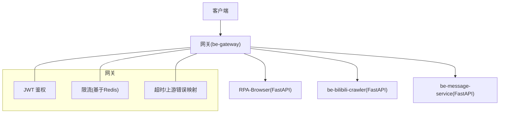
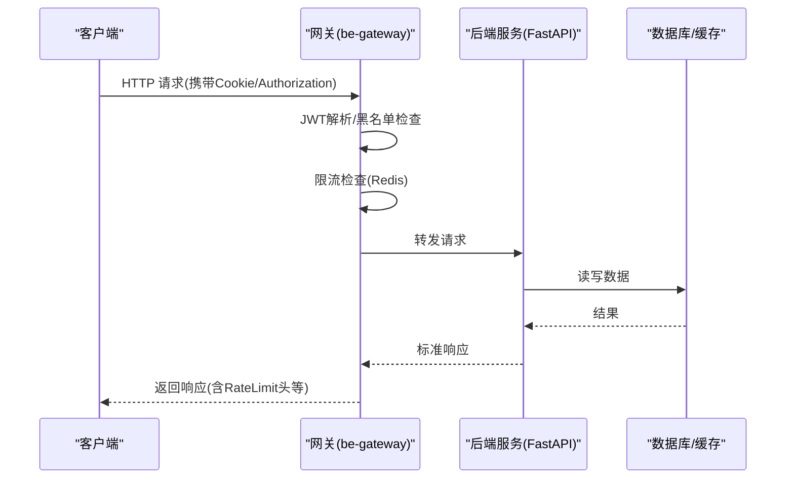
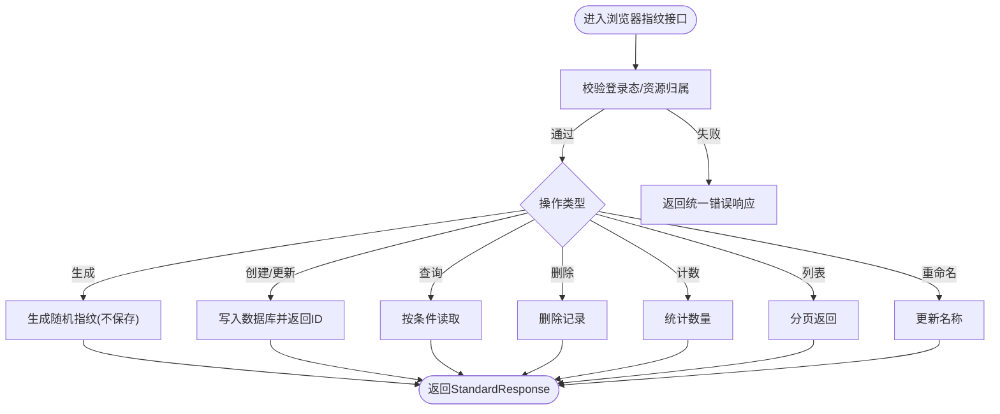
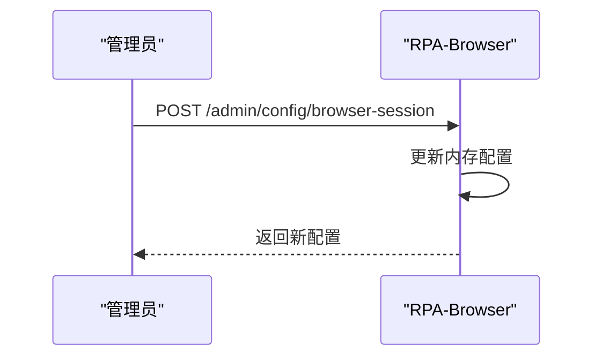
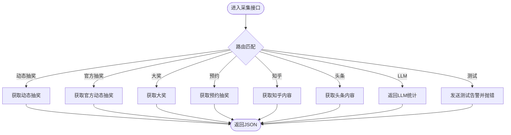
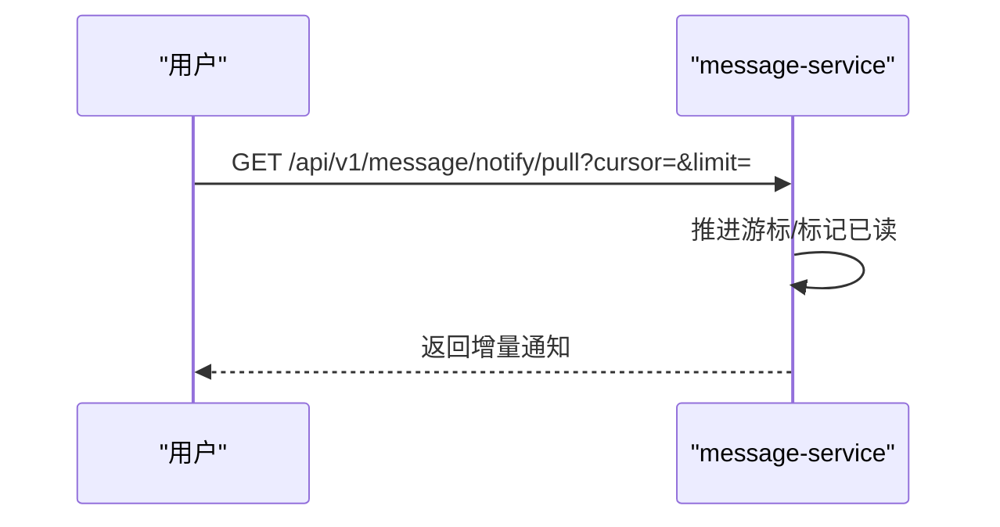
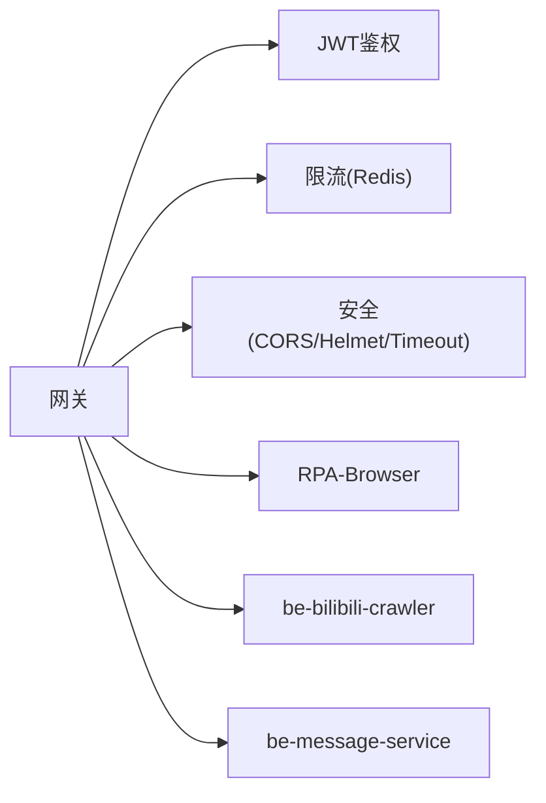

# API 接口文档

<cite>
**本文引用的文件**
- [RPA-Browser/main.py](file://RPA-Browser/main.py)
- [RPA-Browser/app/routes.py](file://RPA-Browser/app/routes.py)
- [RPA-Browser/app/controller/v1/browser/browser_router.py](file://RPA-Browser/app/controller/v1/browser/browser_router.py)
- [RPA-Browser/app/controller/v1/admin/admin_router.py](file://RPA-Browser/app/controller/v1/admin/admin_router.py)
- [be-bilibili-crawler/main.py](file://be-bilibili-crawler/main.py)
- [be-bilibili-crawler/controller/common/CommonRouter.py](file://be-bilibili-crawler/controller/common/CommonRouter.py)
- [be-message-service/app/api/notify.py](file://be-message-service/app/api/notify.py)
- [be-gateway/index.js](file://be-gateway/index.js)
- [be-gateway/ExpressServerEnd/app.js](file://be-gateway/ExpressServerEnd/app.js)
- [be-gateway/ExpressServerEnd/MiddleWare/Limiter.js](file://be-gateway/ExpressServerEnd/MiddleWare/Limiter.js)
- [be-gateway/ExpressServerEnd/Service/user_permission_module/JwtModule.js](file://be-gateway/ExpressServerEnd/Service/user_permission_module/JwtModule.js)
- [be-gateway/ExpressServerEnd/MiddleWare/PrefetchUserInfo.js](file://be-gateway/ExpressServerEnd/MiddleWare/PrefetchUserInfo.js)
- [RPA-Browser/app/utils/middlewares/ban_guard.py](file://RPA-Browser/app/utils/middlewares/ban_guard.py)
</cite>

## 目录
1. [简介](#简介)
2. [项目结构](#项目结构)
3. [核心组件](#核心组件)
4. [架构总览](#架构总览)
5. [详细组件分析](#详细组件分析)
6. [依赖关系分析](#依赖关系分析)
7. [性能与限流](#性能与限流)
8. [故障排查指南](#故障排查指南)
9. [结论](#结论)
10. [附录：接口清单与示例](#附录接口清单与示例)

## 简介
本接口文档面向开发者，系统化梳理本项目中所有对外暴露的 RESTful API，覆盖数据采集、消息推送、浏览器控制、用户管理等主要模块。文档包含请求参数、响应格式、错误码、认证方式、版本管理、限流策略与安全措施说明，并提供典型请求与响应示例路径，帮助快速集成与联调。

## 项目结构
本项目由多个服务组成，通过网关统一入口对外暴露 API：
- be-gateway（Node/Express）：统一网关，负责鉴权、限流、安全头、超时与上游错误映射。
- RPA-Browser（FastAPI）：浏览器自动化与运行时控制、管理员配置等。
- be-bilibili-crawler（FastAPI）：数据采集相关接口（抽奖动态、统计、LLM 统计等）。
- be-message-service（FastAPI）：系统通知与消息推送能力。
- Vue3FrontEndDemoExercise：前端工程（不在本文档范围）。

**图示来源**
- [be-gateway/ExpressServerEnd/app.js:82-117](file://be-gateway/ExpressServerEnd/app.js#L82-L117)
- [be-gateway/ExpressServerEnd/MiddleWare/Limiter.js:20-51](file://be-gateway/ExpressServerEnd/MiddleWare/Limiter.js#L20-L51)
- [be-gateway/ExpressServerEnd/MiddleWare/PrefetchUserInfo.js:75-110](file://be-gateway/ExpressServerEnd/MiddleWare/PrefetchUserInfo.js#L75-L110)

**章节来源**
- [be-gateway/ExpressServerEnd/app.js:82-117](file://be-gateway/ExpressServerEnd/app.js#L82-L117)
- [RPA-Browser/main.py:36-74](file://RPA-Browser/main.py#L36-L74)
- [be-bilibili-crawler/main.py:48-60](file://be-bilibili-crawler/main.py#L48-L60)
- [be-message-service/app/api/notify.py:40-40](file://be-message-service/app/api/notify.py#L40-L40)

## 核心组件
- 网关层（be-gateway）
  - JWT 认证：从 HttpOnly Cookie 或 Authorization 头读取令牌，支持可选校验与黑名单检查。
  - 限流：基于 Redis 的速率限制，支持自定义窗口、阈值与键生成器。
  - 安全与超时：Helmet CSP、CORS、connect-timeout 超时；上游不可达/无效响应映射为 502/504。
- RPA-Browser
  - 路由注册与异常处理：封禁拦截中间件、统一业务异常处理器。
  - 浏览器指纹管理：生成、创建/更新、查询、删除、计数、分页列表、重命名。
  - 管理员会话与配置：查看会话、获取/更新浏览器会话清理策略。
- be-bilibili-crawler
  - 数据采集接口：获取其他用户动态抽奖、官方动态抽奖、大奖、预约抽奖、知乎/头条抓取等。
  - LLM 统计、测试告警、取关列表等辅助接口。
- be-message-service
  - 通知拉取与历史分页、未读数、系统通知兼容 B 站格式。
  - 管理员发布/修改/撤回/列表管理。

**章节来源**
- [RPA-Browser/app/routes.py:20-47](file://RPA-Browser/app/routes.py#L20-L47)
- [RPA-Browser/app/controller/v1/browser/browser_router.py:36-251](file://RPA-Browser/app/controller/v1/browser/browser_router.py#L36-L251)
- [RPA-Browser/app/controller/v1/admin/admin_router.py:19-117](file://RPA-Browser/app/controller/v1/admin/admin_router.py#L19-L117)
- [be-bilibili-crawler/controller/common/CommonRouter.py:25-172](file://be-bilibili-crawler/controller/common/CommonRouter.py#L25-L172)
- [be-message-service/app/api/notify.py:43-216](file://be-message-service/app/api/notify.py#L43-L216)

## 架构总览
整体调用链：客户端 → 网关（鉴权/限流/安全/超时）→ 后端服务（RPA/Crawler/Message）→ 数据库/缓存/RPC。

**图示来源**
- [be-gateway/ExpressServerEnd/app.js:82-117](file://be-gateway/ExpressServerEnd/app.js#L82-L117)
- [be-gateway/ExpressServerEnd/MiddleWare/Limiter.js:20-51](file://be-gateway/ExpressServerEnd/MiddleWare/Limiter.js#L20-L51)
- [be-gateway/ExpressServerEnd/MiddleWare/PrefetchUserInfo.js:75-110](file://be-gateway/ExpressServerEnd/MiddleWare/PrefetchUserInfo.js#L75-L110)

## 详细组件分析

### 浏览器指纹管理（RPA-Browser）
- 功能概述
  - 生成随机指纹（不持久化）
  - 创建/更新指纹（持久化到数据库）
  - 查询、删除、计数、分页列表、重命名
- 认证与权限
  - 部分接口需登录态（从网关注入的用户信息），部分接口需验证浏览器资源归属。
- 关键端点
  - POST /api/v1/browser/fingerprint/gen_rand_fingerprint
  - POST /api/v1/browser/fingerprint/upsert_fingerprint
  - POST /api/v1/browser/fingerprint/read_fingerprint
  - POST /api/v1/browser/fingerprint/delete_fingerprint
  - POST /api/v1/browser/fingerprint/count_fingerprint
  - POST /api/v1/browser/fingerprint/list_fingerprint
  - POST /api/v1/browser/fingerprint/rename_fingerprint
- 请求/响应
  - 请求体：各端点定义不同参数（如创建/更新指纹的配置、分页参数、重命名新名称等）。
  - 响应：统一 StandardResponse 包装，data 字段承载具体数据。
- 错误处理
  - 使用统一业务异常处理器与数据库连接异常处理器，HTTP 状态码与 body.code 分离。

**图示来源**
- [RPA-Browser/app/controller/v1/browser/browser_router.py:36-251](file://RPA-Browser/app/controller/v1/browser/browser_router.py#L36-L251)
- [RPA-Browser/app/routes.py:20-47](file://RPA-Browser/app/routes.py#L20-L47)

**章节来源**
- [RPA-Browser/app/controller/v1/browser/browser_router.py:36-251](file://RPA-Browser/app/controller/v1/browser/browser_router.py#L36-L251)
- [RPA-Browser/app/routes.py:20-47](file://RPA-Browser/app/routes.py#L20-L47)

### 管理员会话与配置（RPA-Browser）
- 功能概述
  - 获取所有浏览器会话信息（管理员）
  - 获取/更新浏览器会话清理策略（仅内存生效）
- 关键端点
  - POST /api/v1/admin/sessions/all
  - GET /api/v1/admin/config/browser-session
  - POST /api/v1/admin/config/browser-session
- 请求/响应
  - 请求体：更新配置时传入 auto_cleanup、max_idle_time、cleanup_interval、expiration_time。
  - 响应：StandardResponse 包装，data 为会话列表或配置对象。
- 注意事项
  - 配置修改仅在内存中生效，重启后恢复环境变量值。

**图示来源**
- [RPA-Browser/app/controller/v1/admin/admin_router.py:54-117](file://RPA-Browser/app/controller/v1/admin/admin_router.py#L54-L117)

**章节来源**
- [RPA-Browser/app/controller/v1/admin/admin_router.py:19-117](file://RPA-Browser/app/controller/v1/admin/admin_router.py#L19-L117)

### 数据采集接口（be-bilibili-crawler）
- 功能概述
  - 获取其他用户动态抽奖、官方动态抽奖、大奖、预约抽奖
  - 知乎/头条抓取
  - LLM 实例统计、测试告警、取关列表等
- 关键端点
  - GET /get_others_lot_dyn
  - GET /get_others_official_lot_dyn
  - GET /get_others_big_lot
  - GET /get_others_big_reserve
  - GET /zhihu_get_others_lot_pins
  - GET /toutiao_get_others_lot_ids
  - GET /get_llm_stats
  - GET /test_push_error
  - POST /post_rm_following_list
- 请求/响应
  - 多数为 GET 无参或简单参数；POST 接口接收 Body。
  - 响应为统一 JSON 结构（crawler 内部可能直接返回 list/dict）。
- 错误处理
  - 全局异常处理器捕获异常并返回 500，同时触发告警推送。

**图示来源**
- [be-bilibili-crawler/controller/common/CommonRouter.py:25-172](file://be-bilibili-crawler/controller/common/CommonRouter.py#L25-L172)
- [be-bilibili-crawler/main.py:63-112](file://be-bilibili-crawler/main.py#L63-L112)

**章节来源**
- [be-bilibili-crawler/controller/common/CommonRouter.py:25-172](file://be-bilibili-crawler/controller/common/CommonRouter.py#L25-L172)
- [be-bilibili-crawler/main.py:63-112](file://be-bilibili-crawler/main.py#L63-L112)

### 系统通知（be-message-service）
- 功能概述
  - 用户侧：增量拉取、历史分页、未读数、系统通知列表（兼容 B 站格式）
  - 管理员侧：发布、修改、撤回、列表管理
- 关键端点
  - GET /api/v1/message/notify/pull
  - GET /api/v1/message/notify/list
  - GET /api/v1/message/notify/unread
  - GET /api/v1/message/notify/system
  - POST /api/v1/message/notify/delete（仅管理员）
  - POST /api/v1/message/notify/admin/create
  - POST /api/v1/message/notify/admin/update/{notify_id}
  - POST /api/v1/message/notify/admin/revoke/{notify_id}
  - GET /api/v1/message/notify/admin/list
- 请求/响应
  - 用户侧拉取支持 cursor 游标与 limit 分页；list 支持 page_num/page_size。
  - 响应统一 StandardResponse，data 为对应模型。
- 认证与权限
  - 完全依赖网关注入的请求头（x-bili-*），不做本地令牌校验。
  - 管理员接口需要 admin 角色。

**图示来源**
- [be-message-service/app/api/notify.py:46-64](file://be-message-service/app/api/notify.py#L46-L64)

**章节来源**
- [be-message-service/app/api/notify.py:43-216](file://be-message-service/app/api/notify.py#L43-L216)

## 依赖关系分析
- 网关依赖
  - JWT 模块：从 Cookie/Authorization 解析令牌，支持可选校验与黑名单。
  - 限流：基于 Redis 的 rate-limit，支持自定义 key 生成与窗口。
  - 安全：Helmet CSP、CORS、超时。
- RPA-Browser 依赖
  - 路由注册：集中注册控制器与异常处理器。
  - 封禁中间件：根据 x-bili-mid/x-bili-role 判断是否放行。
- 数据采集与消息服务
  - 独立 FastAPI 应用，各自注册路由与异常处理。

**图示来源**
- [be-gateway/ExpressServerEnd/app.js:82-117](file://be-gateway/ExpressServerEnd/app.js#L82-L117)
- [be-gateway/ExpressServerEnd/MiddleWare/Limiter.js:20-51](file://be-gateway/ExpressServerEnd/MiddleWare/Limiter.js#L20-L51)
- [be-gateway/ExpressServerEnd/Service/user_permission_module/JwtModule.js:133-155](file://be-gateway/ExpressServerEnd/Service/user_permission_module/JwtModule.js#L133-L155)

**章节来源**
- [be-gateway/ExpressServerEnd/app.js:82-117](file://be-gateway/ExpressServerEnd/app.js#L82-L117)
- [be-gateway/ExpressServerEnd/MiddleWare/Limiter.js:20-51](file://be-gateway/ExpressServerEnd/MiddleWare/Limiter.js#L20-L51)
- [be-gateway/ExpressServerEnd/Service/user_permission_module/JwtModule.js:133-155](file://be-gateway/ExpressServerEnd/Service/user_permission_module/JwtModule.js#L133-L155)

## 性能与限流
- 网关限流
  - 基于 Redis 的 rate-limit，支持 windowMs、limit、keyGenerator、skip 等。
  - 默认以 IP 作为限流键，可自定义。
- 超时与上游错误
  - connect-timeout 设置 30s 超时；上游不可达/无效响应映射为 502/504。
- RPA-Browser 异常处理
  - 统一业务异常与数据库连接异常处理，避免阻塞正常流程。
- 建议
  - 合理设置限流窗口与阈值，避免误伤正常流量。
  - 对长耗时接口考虑异步/队列化处理，减少网关超时。

**章节来源**
- [be-gateway/ExpressServerEnd/MiddleWare/Limiter.js:20-51](file://be-gateway/ExpressServerEnd/MiddleWare/Limiter.js#L20-L51)
- [be-gateway/ExpressServerEnd/app.js:82-117](file://be-gateway/ExpressServerEnd/app.js#L82-L117)
- [RPA-Browser/app/routes.py:35-47](file://RPA-Browser/app/routes.py#L35-L47)

## 故障排查指南
- 常见问题
  - 401/权限不足：检查网关 JWT 配置与 Cookie/Authorization 头是否正确。
  - 502/504：上游服务不可达或超时，检查后端服务健康与网络连通性。
  - 403 封禁：RPA 服务封禁中间件命中，检查 x-bili-mid/x-bili-role 与封禁状态。
- 日志与告警
  - crawler 全局异常会记录并触发告警推送，便于快速定位问题。
  - 网关在 prod 环境输出错误日志，便于审计。
- 建议步骤
  - 确认网关限流是否触发（RateLimit 头）。
  - 检查后端服务日志与数据库连接状态。
  - 对于封禁问题，确认封禁记录与缓存失效逻辑。

**章节来源**
- [be-bilibili-crawler/main.py:94-112](file://be-bilibili-crawler/main.py#L94-L112)
- [RPA-Browser/app/utils/middlewares/ban_guard.py:32-72](file://RPA-Browser/app/utils/middlewares/ban_guard.py#L32-L72)
- [be-gateway/ExpressServerEnd/app.js:119-184](file://be-gateway/ExpressServerEnd/app.js#L119-L184)

## 结论
本项目通过网关统一鉴权、限流与安全策略，将 RPA 浏览器控制、数据采集与消息通知等能力模块化暴露。接口设计遵循统一响应格式与异常处理规范，便于前后端协作与扩展。建议在集成时重点关注网关配置、限流策略与封禁中间件行为，确保稳定与合规。

## 附录：接口清单与示例

### 浏览器指纹管理（RPA-Browser）
- 端点与方法
  - POST /api/v1/browser/fingerprint/gen_rand_fingerprint
  - POST /api/v1/browser/fingerprint/upsert_fingerprint
  - POST /api/v1/browser/fingerprint/read_fingerprint
  - POST /api/v1/browser/fingerprint/delete_fingerprint
  - POST /api/v1/browser/fingerprint/count_fingerprint
  - POST /api/v1/browser/fingerprint/list_fingerprint
  - POST /api/v1/browser/fingerprint/rename_fingerprint
- 请求参数
  - 生成：可选 BrowserFingerprintCreateParams（浏览器类型、操作系统、设备类型等）
  - 创建/更新：BrowserFingerprintUpsertParams（id 可选，配置项）
  - 查询：BrowserReqAuthInfo（browser_id、auth_info.mid）
  - 删除：BrowserReqAuthInfo
  - 计数：AuthInfo（mid）
  - 列表：BrowserFingerprintListParams（page_num、page_size）
  - 重命名：BrowserFingerprintRenameParams（id、new_name）
- 响应格式
  - StandardResponse[data=具体模型]
- 示例
  - 请求：POST /api/v1/browser/fingerprint/upsert_fingerprint
    - Body: { "browser_type": "chromium", "os": "windows", "device": "desktop" }
  - 响应：{ "code": 0, "msg": "success", "data": { "id": "...", "created_at": "..." } }

**章节来源**
- [RPA-Browser/app/controller/v1/browser/browser_router.py:36-251](file://RPA-Browser/app/controller/v1/browser/browser_router.py#L36-L251)

### 管理员会话与配置（RPA-Browser）
- 端点与方法
  - POST /api/v1/admin/sessions/all
  - GET /api/v1/admin/config/browser-session
  - POST /api/v1/admin/config/browser-session
- 请求参数
  - 更新配置：auto_cleanup、max_idle_time、cleanup_interval、expiration_time
- 响应格式
  - StandardResponse[data=会话列表或配置对象]
- 示例
  - 请求：POST /api/v1/admin/config/browser-session
    - Body: { "auto_cleanup": true, "max_idle_time": 3600 }
  - 响应：{ "code": 0, "msg": "配置更新成功（仅内存中生效）", "data": { ... } }

**章节来源**
- [RPA-Browser/app/controller/v1/admin/admin_router.py:19-117](file://RPA-Browser/app/controller/v1/admin/admin_router.py#L19-L117)

### 数据采集接口（be-bilibili-crawler）
- 端点与方法
  - GET /get_others_lot_dyn
  - GET /get_others_official_lot_dyn
  - GET /get_others_big_lot
  - GET /get_others_big_reserve
  - GET /zhihu_get_others_lot_pins
  - GET /toutiao_get_others_lot_ids
  - GET /get_llm_stats
  - GET /test_push_error
  - POST /post_rm_following_list
- 请求参数
  - 多为 GET 无参；POST /post_rm_following_list 接收 list[int | str]
- 响应格式
  - 直接返回 JSON（list/dict 等）
- 示例
  - 请求：GET /get_others_lot_dyn
  - 响应：[ { "id": "...", "url": "..." }, ... ]

**章节来源**
- [be-bilibili-crawler/controller/common/CommonRouter.py:25-172](file://be-bilibili-crawler/controller/common/CommonRouter.py#L25-L172)

### 系统通知（be-message-service）
- 端点与方法
  - GET /api/v1/message/notify/pull
  - GET /api/v1/message/notify/list
  - GET /api/v1/message/notify/unread
  - GET /api/v1/message/notify/system
  - POST /api/v1/message/notify/delete（仅管理员）
  - POST /api/v1/message/notify/admin/create
  - POST /api/v1/message/notify/admin/update/{notify_id}
  - POST /api/v1/message/notify/admin/revoke/{notify_id}
  - GET /api/v1/message/notify/admin/list
- 请求参数
  - pull: cursor（可选）、limit（1-100）
  - list: page_num、page_size
  - admin/create: NotifyCreateReq（标题、内容、目标、定时等）
- 响应格式
  - StandardResponse[data=对应模型]
- 示例
  - 请求：GET /api/v1/message/notify/pull?cursor=0&limit=20
  - 响应：{ "code": 0, "msg": "", "data": { "items": [...], "unread_count": 5 } }

**章节来源**
- [be-message-service/app/api/notify.py:43-216](file://be-message-service/app/api/notify.py#L43-L216)

### 认证与版本管理
- 认证方式
  - 网关 JWT：从 HttpOnly Cookie（bili_jwt）或 Authorization: Bearer <token> 读取。
  - 可选校验：jwtAuthOptional 支持无 token 匿名访问。
  - 黑名单：登出后 token 签名加入黑名单立即失效。
- 版本管理
  - 网关路由前缀 /api/v1/*；RPA 与 message-service 均按 v1 组织。
- 安全与限流
  - Helmet CSP、CORS、超时；Redis 限流；上游错误映射 502/504。

**章节来源**
- [be-gateway/ExpressServerEnd/app.js:82-117](file://be-gateway/ExpressServerEnd/app.js#L82-L117)
- [be-gateway/ExpressServerEnd/Service/user_permission_module/JwtModule.js:133-155](file://be-gateway/ExpressServerEnd/Service/user_permission_module/JwtModule.js#L133-L155)
- [be-gateway/ExpressServerEnd/MiddleWare/Limiter.js:20-51](file://be-gateway/ExpressServerEnd/MiddleWare/Limiter.js#L20-L51)

### WebSocket 说明
- 当前仓库未发现显式 WebSocket 路由实现。若需实时通信，可在网关或后端服务中引入 WebSocket 支持（如 FastAPI WebSocket 或 Express ws），并通过网关进行鉴权与限流。

[本节为概念性说明，不直接分析具体文件]