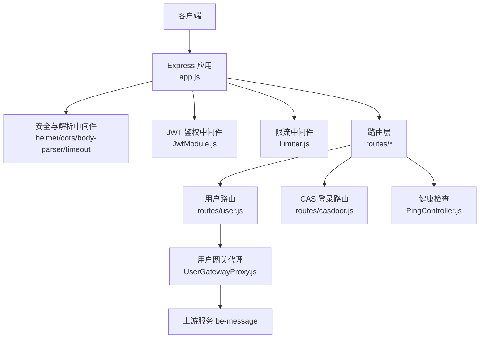
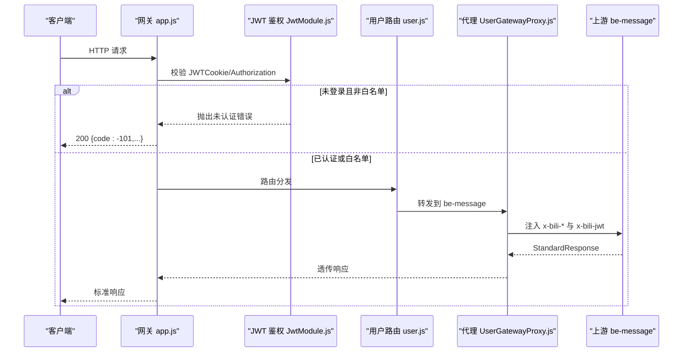
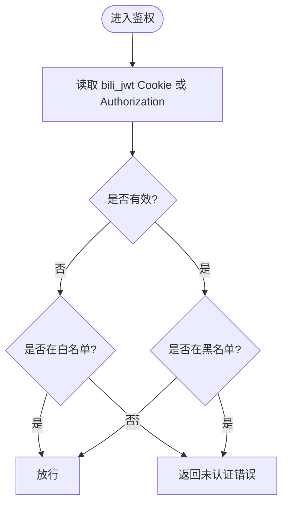
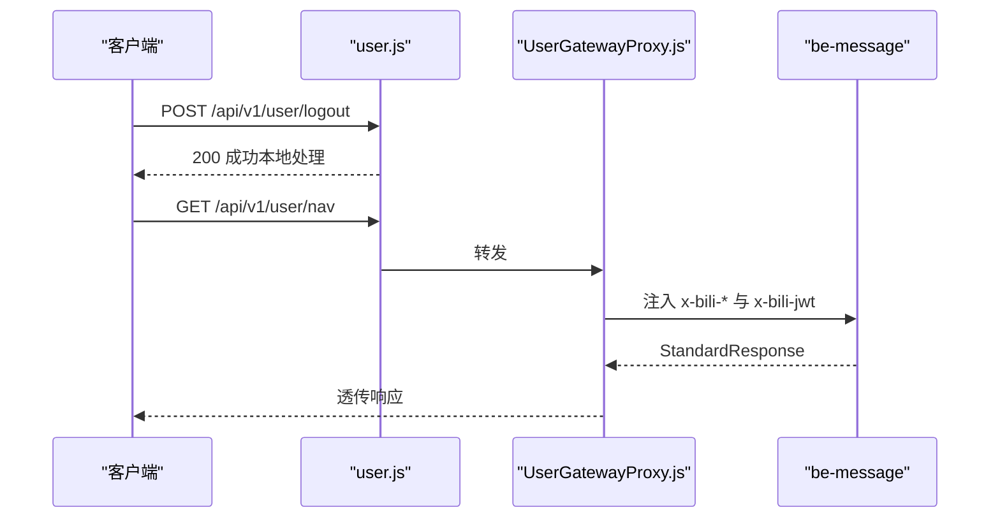
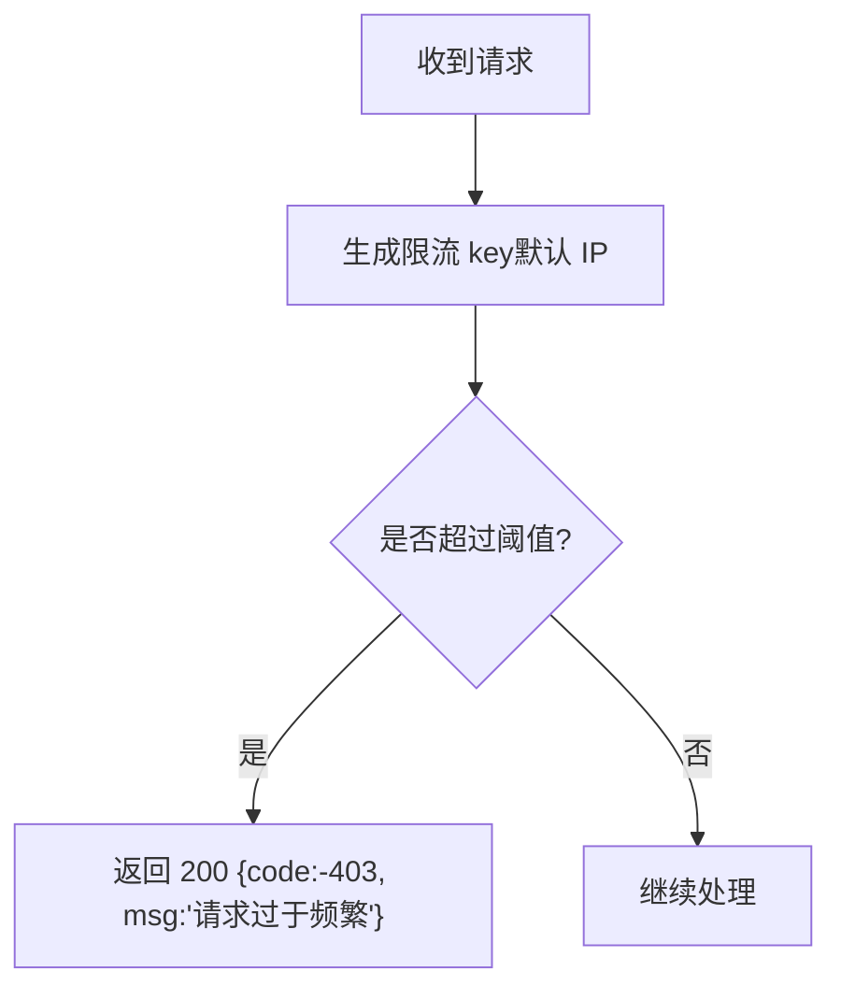
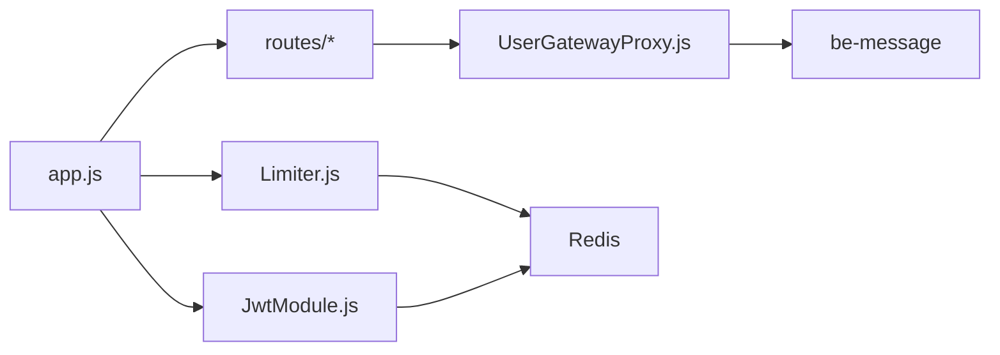

# API 网关接口

<cite>
**本文引用的文件**
- [ExpressServerEnd/app.js](file://be-gateway/ExpressServerEnd/app.js)
- [ExpressServerEnd/config/config.yml](file://be-gateway/ExpressServerEnd/config/config.yml)
- [ExpressServerEnd/MiddleWare/Limiter.js](file://be-gateway/ExpressServerEnd/MiddleWare/Limiter.js)
- [ExpressServerEnd/Service/user_permission_module/JwtModule.js](file://be-gateway/ExpressServerEnd/Service/user_permission_module/JwtModule.js)
- [ExpressServerEnd/routes/user.js](file://be-gateway/ExpressServerEnd/routes/user.js)
- [ExpressServerEnd/Controller/api/v1/user/UserGatewayProxy.js](file://be-gateway/ExpressServerEnd/Controller/api/v1/user/UserGatewayProxy.js)
- [ExpressServerEnd/Controller/api/v1/ping/PingController.js](file://be-gateway/ExpressServerEnd/Controller/api/v1/ping/PingController.js)
- [ExpressServerEnd/routes/casdoor.js](file://be-gateway/ExpressServerEnd/routes/casdoor.js)
- [ExpressServerEnd/Service/response_constants.js](file://be-gateway/ExpressServerEnd/Service/response_constants.js)
</cite>

## 目录
1. [简介](#简介)
2. [项目结构](#项目结构)
3. [核心组件](#核心组件)
4. [架构总览](#架构总览)
5. [详细组件分析](#详细组件分析)
6. [依赖关系分析](#依赖关系分析)
7. [性能与限流](#性能与限流)
8. [故障排查指南](#故障排查指南)
9. [结论](#结论)
10. [附录：统一响应与错误码](#附录统一响应与错误码)

## 简介
本文件为 API 网关的统一接口文档，覆盖用户认证、权限控制、请求转发等核心能力，并给出 JWT 令牌管理、用户信息获取、角色权限验证、限流策略、健康检查、跨域处理、统一错误处理等集成说明。网关基于 Express 构建，负责鉴权、限流、日志与安全头配置，并将用户相关接口反向代理至 be-message 服务；同时提供 CAS 登录入口与健康检查端点。

## 项目结构
- 应用入口与安全中间件：app.js
- 路由注册：routes/*（user、casdoor、ping、proxy）
- 鉴权模块：JwtModule.js（JWT 签发、校验、Cookie 管理、白名单路径）
- 限流与访问控制：Limiter.js（Redis 存储的速率限制、本地访问限制）
- 用户路由与代理：routes/user.js + UserGatewayProxy.js（转发到 be-message）
- 健康检查：PingController.js（GET /api/v1/ping）
- 配置：config.yml（JWT 密钥、RPC 超时等）
- 统一响应常量：response_constants.js

图表来源
- [ExpressServerEnd/app.js:12-117](file://be-gateway/ExpressServerEnd/app.js#L12-L117)
- [ExpressServerEnd/Service/user_permission_module/JwtModule.js:86-131](file://be-gateway/ExpressServerEnd/Service/user_permission_module/JwtModule.js#L86-L131)
- [ExpressServerEnd/MiddleWare/Limiter.js:20-50](file://be-gateway/ExpressServerEnd/MiddleWare/Limiter.js#L20-L50)
- [ExpressServerEnd/routes/user.js:20-34](file://be-gateway/ExpressServerEnd/routes/user.js#L20-L34)
- [ExpressServerEnd/Controller/api/v1/user/UserGatewayProxy.js:28-62](file://be-gateway/ExpressServerEnd/Controller/api/v1/user/UserGatewayProxy.js#L28-L62)
- [ExpressServerEnd/Controller/api/v1/ping/PingController.js:1-19](file://be-gateway/ExpressServerEnd/Controller/api/v1/ping/PingController.js#L1-L19)
- [ExpressServerEnd/routes/casdoor.js:1-106](file://be-gateway/ExpressServerEnd/routes/casdoor.js#L1-L106)

章节来源
- [ExpressServerEnd/app.js:12-117](file://be-gateway/ExpressServerEnd/app.js#L12-L117)
- [ExpressServerEnd/config/config.yml:1-29](file://be-gateway/ExpressServerEnd/config/config.yml#L1-L29)

## 核心组件
- 统一安全与解析
  - 超时保护、CSP/安全头、CORS（允许携带凭证）、JSON/表单解析
- 认证与授权
  - JWT 从 HttpOnly Cookie（bili_jwt）或 Authorization 头读取；支持可选登录模式；黑名单撤销
  - 全局白名单路径免鉴权（如登录、注册、ping、部分公开读接口）
- 请求转发
  - 用户相关接口通过 http-proxy-middleware 原样转发至 be-message，注入可信 x-bili-* 头与原始 JWT
- 限流与访问控制
  - Redis 存储的速率限制器，支持自定义 key、窗口、阈值、成功/失败计数策略
  - 本地访问限制（仅内网 IP 可访问特定接口）
- 健康检查
  - GET /api/v1/ping 返回时间戳与运行时长
- 统一错误处理
  - 将业务错误映射为标准 JSON 响应；网络/上游错误映射为 502/504；未知错误返回 500

章节来源
- [ExpressServerEnd/app.js:35-185](file://be-gateway/ExpressServerEnd/app.js#L35-L185)
- [ExpressServerEnd/Service/user_permission_module/JwtModule.js:20-155](file://be-gateway/ExpressServerEnd/Service/user_permission_module/JwtModule.js#L20-L155)
- [ExpressServerEnd/MiddleWare/Limiter.js:20-69](file://be-gateway/ExpressServerEnd/MiddleWare/Limiter.js#L20-L69)
- [ExpressServerEnd/Controller/api/v1/user/UserGatewayProxy.js:28-62](file://be-gateway/ExpressServerEnd/Controller/api/v1/user/UserGatewayProxy.js#L28-L62)
- [ExpressServerEnd/Controller/api/v1/ping/PingController.js:1-19](file://be-gateway/ExpressServerEnd/Controller/api/v1/ping/PingController.js#L1-L19)
- [ExpressServerEnd/Service/response_constants.js:1-52](file://be-gateway/ExpressServerEnd/Service/response_constants.js#L1-L52)

## 架构总览
网关作为统一入口，承担以下职责：
- 安全与合规：CSP、Referrer-Policy、超时、CORS
- 身份认证：JWT 校验、黑名单、可选登录
- 权限控制：按路径白名单放行敏感操作
- 流量治理：限流、本地访问限制
- 请求转发：用户相关接口透传到 be-message，注入可信身份头
- 运维监控：健康检查、开发环境请求日志

图表来源
- [ExpressServerEnd/app.js:119-185](file://be-gateway/ExpressServerEnd/app.js#L119-L185)
- [ExpressServerEnd/Service/user_permission_module/JwtModule.js:86-131](file://be-gateway/ExpressServerEnd/Service/user_permission_module/JwtModule.js#L86-L131)
- [ExpressServerEnd/routes/user.js:20-34](file://be-gateway/ExpressServerEnd/routes/user.js#L20-L34)
- [ExpressServerEnd/Controller/api/v1/user/UserGatewayProxy.js:28-62](file://be-gateway/ExpressServerEnd/Controller/api/v1/user/UserGatewayProxy.js#L28-L62)

## 详细组件分析

### 认证与令牌管理（JWT）
- 令牌来源
  - 优先从 HttpOnly Cookie（bili_jwt）读取，其次兼容 Authorization: Bearer ...
- 令牌生命周期
  - 签发使用 HS256，有效期 15 天
  - 过期时触发 on_expired，由调用方处理
  - 支持黑名单撤销（is_revoked）
- Cookie 安全
  - httpOnly=true；secure 根据环境变量或生产环境自动设置；sameSite=lax；path=/；maxAge=15 天
- 白名单路径
  - 登录、注册、ping、部分公开读接口无需鉴权
- 可选登录
  - jwtAuthOptional 用于“有 token 则解析，无 token 不报错”的场景

图表来源
- [ExpressServerEnd/Service/user_permission_module/JwtModule.js:20-155](file://be-gateway/ExpressServerEnd/Service/user_permission_module/JwtModule.js#L20-L155)

章节来源
- [ExpressServerEnd/Service/user_permission_module/JwtModule.js:20-155](file://be-gateway/ExpressServerEnd/Service/user_permission_module/JwtModule.js#L20-L155)
- [ExpressServerEnd/config/config.yml:1-10](file://be-gateway/ExpressServerEnd/config/config.yml#L1-L10)

### 用户信息与权限控制
- 用户路由拆分
  - /logout 在网关本地实现（依赖 Redis 黑名单）
  - 其余用户接口（nav、user_info、refresh_token、casdoor/info 等）通过 UserGatewayProxy 反向代理至 be-message
- 身份透传
  - 注入可信 x-bili-* 头，并透传原始 JWT（x-bili-jwt）供上游续期判断
- 权限策略
  - 写操作需登录；部分读接口对未登录开放（上游侧控制匿名行为）

图表来源
- [ExpressServerEnd/routes/user.js:20-34](file://be-gateway/ExpressServerEnd/routes/user.js#L20-L34)
- [ExpressServerEnd/Controller/api/v1/user/UserGatewayProxy.js:28-62](file://be-gateway/ExpressServerEnd/Controller/api/v1/user/UserGatewayProxy.js#L28-L62)

章节来源
- [ExpressServerEnd/routes/user.js:1-36](file://be-gateway/ExpressServerEnd/routes/user.js#L1-L36)
- [ExpressServerEnd/Controller/api/v1/user/UserGatewayProxy.js:1-64](file://be-gateway/ExpressServerEnd/Controller/api/v1/user/UserGatewayProxy.js#L1-L64)

### 请求转发与上游错误映射
- 转发规则
  - 所有 /api/v1/user/* 原样转发到 be-message，并在 pathRewrite 中补全上游路径
- 错误映射
  - 超时（connect-timeout/proxyTimeout）→ 504
  - 上游不可达/协议错误 → 502
  - 其他系统错误 → 500
- 请求日志
  - 开发环境记录请求路径、Body、Query 与耗时

章节来源
- [ExpressServerEnd/app.js:35-80](file://be-gateway/ExpressServerEnd/app.js#L35-L80)
- [ExpressServerEnd/app.js:119-185](file://be-gateway/ExpressServerEnd/app.js#L119-L185)
- [ExpressServerEnd/Controller/api/v1/user/UserGatewayProxy.js:28-62](file://be-gateway/ExpressServerEnd/Controller/api/v1/user/UserGatewayProxy.js#L28-L62)

### 限流策略与访问控制
- 限流器
  - 基于 express-rate-limit + RedisStore，支持自定义 key、窗口、阈值、成功/失败计数策略
  - 默认以客户端 IP 作为 key，可通过 keyGenerator 定制
- 本地访问限制
  - restrictToLocalhost：当请求头包含 x-bili-ip 且为私有地址时放行，否则拒绝
- 建议用法
  - 对敏感接口（如管理队列、批量任务）启用严格限流与本地访问限制

图表来源
- [ExpressServerEnd/MiddleWare/Limiter.js:20-69](file://be-gateway/ExpressServerEnd/MiddleWare/Limiter.js#L20-L69)

章节来源
- [ExpressServerEnd/MiddleWare/Limiter.js:1-69](file://be-gateway/ExpressServerEnd/MiddleWare/Limiter.js#L1-L69)

### 健康检查
- 接口
  - GET /api/v1/ping
- 响应
  - code: 0
  - message: "pong"
  - data: { timestamp, uptime }

章节来源
- [ExpressServerEnd/Controller/api/v1/ping/PingController.js:1-19](file://be-gateway/ExpressServerEnd/Controller/api/v1/ping/PingController.js#L1-L19)

### CAS 登录入口
- 接口
  - GET /api/v1/casdoor/login
- 流程
  - 记录前端来源（Origin/Referer），写入 cookie 以便回调后重定向
  - 构造 Casdoor 授权 URL 并 302 跳转
- 安全
  - 支持前端域名白名单校验（CASDOOR_FRONTEND_ALLOWLIST）

章节来源
- [ExpressServerEnd/routes/casdoor.js:1-106](file://be-gateway/ExpressServerEnd/routes/casdoor.js#L1-L106)

## 依赖关系分析
- 应用层依赖
  - helmet、cors、body-parser、connect-timeout
  - express-jwt（JWT 鉴权）
  - express-rate-limit + rate-limit-redis（限流）
  - http-proxy-middleware（反向代理）
- 配置依赖
  - config.yml 中的 jwt_secret、rpc_timeout_ms 等
- 外部依赖
  - Redis（限流存储、JWT 黑名单）
  - RabbitMQ（RPC 通信，见配置注释）
  - be-message（上游服务）

图表来源
- [ExpressServerEnd/app.js:12-117](file://be-gateway/ExpressServerEnd/app.js#L12-L117)
- [ExpressServerEnd/Service/user_permission_module/JwtModule.js:86-131](file://be-gateway/ExpressServerEnd/Service/user_permission_module/JwtModule.js#L86-L131)
- [ExpressServerEnd/MiddleWare/Limiter.js:20-50](file://be-gateway/ExpressServerEnd/MiddleWare/Limiter.js#L20-L50)
- [ExpressServerEnd/Controller/api/v1/user/UserGatewayProxy.js:28-62](file://be-gateway/ExpressServerEnd/Controller/api/v1/user/UserGatewayProxy.js#L28-L62)
- [ExpressServerEnd/config/config.yml:23-29](file://be-gateway/ExpressServerEnd/config/config.yml#L23-L29)

章节来源
- [ExpressServerEnd/config/config.yml:1-29](file://be-gateway/ExpressServerEnd/config/config.yml#L1-L29)

## 性能与限流
- 超时控制
  - 全局 connect-timeout 30s；代理 proxyTimeout 30s
- 限流建议
  - 对高频接口（如评论、动态列表）设置较小 windowMs 与 limit
  - 对写接口（评论、点赞、发布）更严格限制
  - 使用 keyGenerator 区分用户维度（如登录后按 mid 限流）
- 缓存与上游
  - 合理设置上游超时与重试策略，避免雪崩
- 日志与观测
  - 开发环境打印请求耗时；生产环境关注 502/504 比例

[本节为通用指导，不直接分析具体文件]

## 故障排查指南
- 常见错误与定位
  - 未认证：检查 bili_jwt Cookie 或 Authorization 头是否正确传递
  - 无权限：确认接口是否需要登录或更高角色
  - 请求频繁：查看限流配置与 Redis 计数
  - 上游错误：关注 502/504，检查 be-message 状态与网络连通性
- 快速自检
  - 健康检查：GET /api/v1/ping
  - 登录流程：GET /api/v1/casdoor/login，确认 302 与回调
- 日志位置
  - 开发环境控制台输出请求日志
  - 生产环境错误堆栈与关键错误消息

章节来源
- [ExpressServerEnd/app.js:119-185](file://be-gateway/ExpressServerEnd/app.js#L119-L185)
- [ExpressServerEnd/Controller/api/v1/ping/PingController.js:1-19](file://be-gateway/ExpressServerEnd/Controller/api/v1/ping/PingController.js#L1-L19)
- [ExpressServerEnd/routes/casdoor.js:61-90](file://be-gateway/ExpressServerEnd/routes/casdoor.js#L61-L90)

## 结论
本网关以最小侵入方式提供统一的认证、限流、转发与错误处理能力，将用户相关逻辑下沉至 be-message，保持网关稳定与可扩展。通过标准化响应与错误码、严格的超时与限流策略，以及 CAS 登录入口与健康检查，满足日常开发与运维需求。

[本节为总结，不直接分析具体文件]

## 附录：统一响应与错误码
- 成功响应
  - code: 0
  - message/data: 由上游或网关填充
- 常见错误码
  - -101 未登录
  - -403 无权限/请求过于频繁
  - 400 请求参数错误
  - 500 服务器内部错误
  - 502 上游不可达/协议错误
  - 504 网关超时
- 使用建议
  - 客户端统一处理 code 字段，忽略 HTTP 状态码（业务错误保持 200）
  - 对 502/504 进行重试与降级

章节来源
- [ExpressServerEnd/Service/response_constants.js:1-52](file://be-gateway/ExpressServerEnd/Service/response_constants.js#L1-L52)
- [ExpressServerEnd/app.js:119-185](file://be-gateway/ExpressServerEnd/app.js#L119-L185)