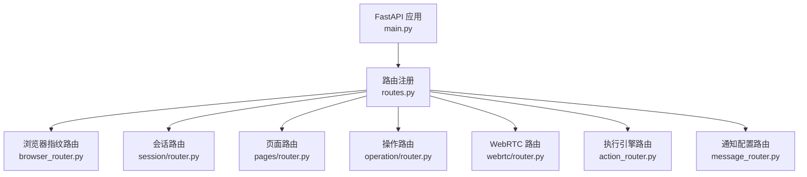
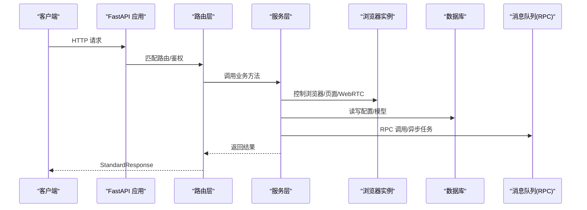
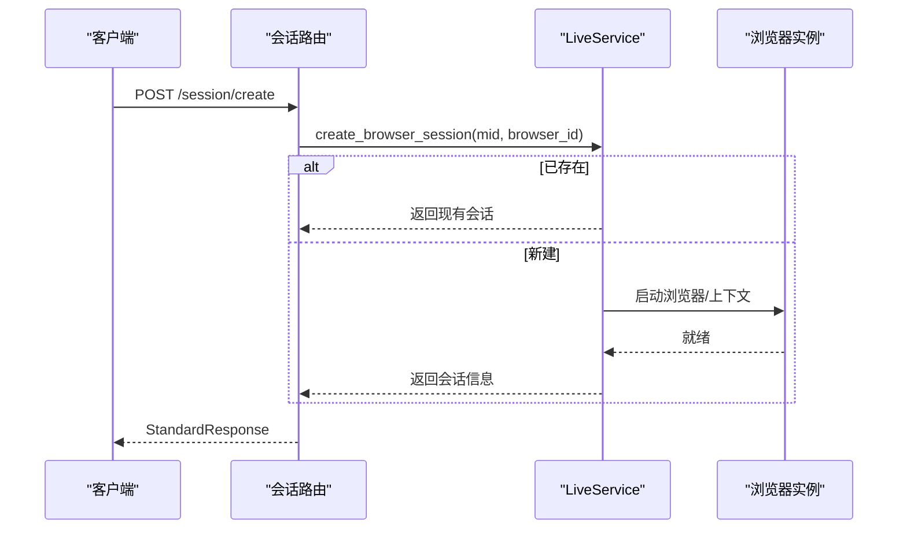
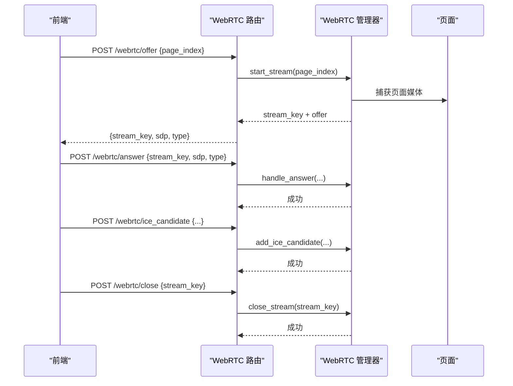
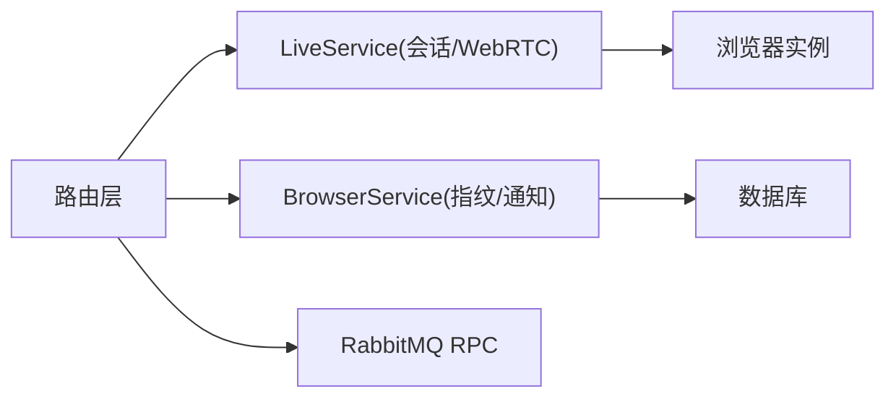

# RPA 浏览器服务 API

<cite>
**本文引用的文件**
- [main.py](file://RPA-Browser/main.py)
- [routes.py](file://RPA-Browser/app/routes.py)
- [config.py](file://RPA-Browser/app/config.py)
- [browser_router.py](file://RPA-Browser/app/controller/v1/browser/browser_router.py)
- [session/router.py](file://RPA-Browser/app/controller/v1/browser_control/session/router.py)
- [pages/router.py](file://RPA-Browser/app/controller/v1/browser_control/pages/router.py)
- [operation/router.py](file://RPA-Browser/app/controller/v1/browser_control/operation/router.py)
- [webrtc/router.py](file://RPA-Browser/app/controller/v1/browser_control/webrtc/router.py)
- [action_router.py](file://RPA-Browser/app/controller/v1/browser_control/execution/action_router.py)
- [message_router.py](file://RPA-Browser/app/controller/v1/browser/message_router.py)
</cite>

## 目录
1. [简介](#简介)
2. [项目结构](#项目结构)
3. [核心组件](#核心组件)
4. [架构总览](#架构总览)
5. [详细组件分析](#详细组件分析)
6. [依赖关系分析](#依赖关系分析)
7. [性能考量](#性能考量)
8. [故障排查指南](#故障排查指南)
9. [结论](#结论)
10. [附录：API 参考](#附录api-参考)

## 简介
本文件为 RPA 浏览器自动化服务的完整 API 接口文档，覆盖浏览器实例管理、页面导航与操作、会话生命周期、WebRTC 实时视频流、执行引擎（Action/工作流）、通知配置等能力。所有接口采用 RESTful 风格，统一响应格式；同时提供 WebRTC 端点用于浏览器屏幕的实时传输与远程控制。

## 项目结构
后端基于 FastAPI，入口在 main.py，通过 routes.py 集中注册路由与异常处理器。控制器按功能分层组织：
- 浏览器指纹与默认设置：app/controller/v1/browser/*
- 运行时控制（会话、页面、操作、WebRTC）：app/controller/v1/browser_control/*
- 执行引擎（Action/工作流）：app/controller/v1/browser_control/execution/*
- 通知配置：app/controller/v1/browser/message_router.py

图表来源
- [main.py:36-74](file://RPA-Browser/main.py#L36-L74)
- [routes.py:20-47](file://RPA-Browser/app/routes.py#L20-L47)

章节来源
- [main.py:36-74](file://RPA-Browser/main.py#L36-L74)
- [routes.py:20-47](file://RPA-Browser/app/routes.py#L20-L47)

## 核心组件
- 应用生命周期与启动流程：数据库迁移、依赖初始化、后台任务、RPC 客户端/服务端连接
- 路由与中间件：封禁拦截、统一异常处理、业务异常注册
- 配置中心：运行模式、代理、JWT、会话清理策略、WebRTC 超时、日志采集策略等
- 认证与鉴权：从请求头获取用户信息，校验浏览器资源归属
- 会话管理：创建/关闭/状态查询，自动清理闲置会话
- 页面管理：列表、切换、关闭
- 基础操作：打开 URL、执行 JS、获取页面信息、浏览器信息
- WebRTC：Offer/Answer/ICE Candidate/关闭/状态查询
- 执行引擎：系统预注册 Action 元数据、自定义 Action CRUD、标签/名称搜索、Fork
- 通知配置：Upsert/读取/删除/测试推送

章节来源
- [main.py:36-74](file://RPA-Browser/main.py#L36-L74)
- [routes.py:20-47](file://RPA-Browser/app/routes.py#L20-L47)
- [config.py:140-215](file://RPA-Browser/app/config.py#L140-L215)

## 架构总览

图表来源
- [main.py:36-74](file://RPA-Browser/main.py#L36-L74)
- [routes.py:20-47](file://RPA-Browser/app/routes.py#L20-L47)
- [config.py:140-215](file://RPA-Browser/app/config.py#L140-L215)

## 详细组件分析

### 浏览器指纹管理
- 生成随机指纹（不持久化）
- 创建或更新指纹（持久化）
- 读取/删除/重命名/分页列表/计数

典型行为
- 创建/更新时进行数量限制校验
- 仅允许操作当前用户拥有的指纹

章节来源
- [browser_router.py:36-252](file://RPA-Browser/app/controller/v1/browser/browser_router.py#L36-L252)

### 会话管理（创建/状态/关闭）
- 创建会话：若不存在则后台异步启动浏览器；存在则直接返回现有会话
- 状态查询：返回会话是否存在、浏览器是否运行、过期时间等
- 关闭会话：释放资源并返回结果

图表来源
- [session/router.py:23-91](file://RPA-Browser/app/controller/v1/browser_control/session/router.py#L23-L91)

章节来源
- [session/router.py:23-196](file://RPA-Browser/app/controller/v1/browser_control/session/router.py#L23-L196)

### 页面管理（列表/切换/关闭）
- 列出所有页面及激活状态
- 切换到指定索引页面
- 关闭指定索引页面（至少保留一个页面）

章节来源
- [pages/router.py:19-171](file://RPA-Browser/app/controller/v1/browser_control/pages/router.py#L19-L171)

### 基础操作（打开/关闭/切换/执行JS/获取信息）
- 打开页面：支持新建页或指定页索引
- 关闭页面：不能关闭最后一个页面
- 切换页面：将目标页置于前台
- 执行 JavaScript：在指定页执行脚本
- 获取页面信息：URL、标题、Cookie 数量
- 获取浏览器信息：版本、UA、是否无头、用户数据目录

章节来源
- [operation/router.py:21-247](file://RPA-Browser/app/controller/v1/browser_control/operation/router.py#L21-L247)

### WebRTC 实时视频流
- 创建 Offer：启动流并生成 SDP Offer
- 处理 Answer：接收客户端 SDP Answer
- 添加 ICE Candidate：完成网络连通性协商
- 关闭流：释放资源
- 查询状态：活跃流、空闲时长、总数

图表来源
- [webrtc/router.py:62-239](file://RPA-Browser/app/controller/v1/browser_control/webrtc/router.py#L62-L239)

章节来源
- [webrtc/router.py:23-239](file://RPA-Browser/app/controller/v1/browser_control/webrtc/router.py#L23-L239)

### 执行引擎（Action/工作流）
- 获取系统预注册 Action 元数据（只读）
- 自定义 Action 的创建/读取/更新/删除
- 标签与名称搜索、分页列表
- Fork 公开操作到个人空间
- 获取某操作的 Fork 版本列表

章节来源
- [action_router.py:44-526](file://RPA-Browser/app/controller/v1/browser_control/execution/action_router.py#L44-L526)

### 通知配置
- Upsert 通知配置（全局或按浏览器实例）
- 读取通知配置
- 删除通知配置
- 发送测试通知（验证渠道可用性）

章节来源
- [message_router.py:34-302](file://RPA-Browser/app/controller/v1/browser/message_router.py#L34-L302)

## 依赖关系分析
- 路由依赖：统一通过依赖注入获取认证信息与浏览器资源所有权校验
- 服务依赖：LiveService 维护会话与 WebRTC 管理器；BrowserService 负责指纹与通知配置
- 外部依赖：RabbitMQ RPC（HTTP Action 调用内部服务）、数据库（Alembic 迁移）、消息推送服务

图表来源
- [routes.py:20-47](file://RPA-Browser/app/routes.py#L20-L47)
- [main.py:36-74](file://RPA-Browser/main.py#L36-L74)

章节来源
- [routes.py:20-47](file://RPA-Browser/app/routes.py#L20-L47)
- [main.py:36-74](file://RPA-Browser/main.py#L36-L74)

## 性能考量
- 会话自动清理：可配置最大闲置时间与清理间隔，避免资源泄漏
- 页面数量限制：每个上下文最大页面数，防止内存占用过高
- WebRTC 空闲超时：长时间无活动的流将被回收
- 批量与分页：Action 列表、指纹列表均支持分页，减少单次负载
- 后台任务：创建会话采用后台任务，降低首屏延迟

章节来源
- [config.py:190-215](file://RPA-Browser/app/config.py#L190-L215)

## 故障排查指南
- 会话不存在：检查是否已创建会话或会话是否已过期
- 页面索引越界：确认页面列表长度与传入索引
- WebRTC 流不存在：先调用 Offer 再处理 Answer/ICE
- 数据库连接异常：检查迁移与连接参数，查看全局异常处理器返回
- 权限错误：确保携带正确的认证头且拥有浏览器资源访问权

章节来源
- [routes.py:35-47](file://RPA-Browser/app/routes.py#L35-L47)
- [session/router.py:94-196](file://RPA-Browser/app/controller/v1/browser_control/session/router.py#L94-L196)
- [webrtc/router.py:105-239](file://RPA-Browser/app/controller/v1/browser_control/webrtc/router.py#L105-L239)

## 结论
该 RPA 浏览器服务提供了完整的浏览器控制与自动化能力，涵盖指纹管理、会话生命周期、页面操作、WebRTC 实时流、执行引擎与通知配置。通过统一的响应格式与完善的异常处理，便于集成与扩展。建议在生产环境合理配置会话清理与 WebRTC 超时策略，并结合执行引擎实现复杂自动化流程。

## 附录：API 参考

说明
- 所有接口返回统一包装 StandardResponse
- 需要认证的接口需携带认证头以获取用户身份与资源权限
- 路径前缀由路由定义决定

### 浏览器指纹
- POST 生成随机指纹（不保存）
- POST 创建或更新指纹
- POST 读取指纹
- POST 删除指纹
- POST 统计指纹数量
- POST 分页列表
- POST 重命名指纹

章节来源
- [browser_router.py:36-252](file://RPA-Browser/app/controller/v1/browser/browser_router.py#L36-L252)

### 会话管理
- POST 创建会话
- POST 查询会话状态
- POST 关闭会话

章节来源
- [session/router.py:23-196](file://RPA-Browser/app/controller/v1/browser_control/session/router.py#L23-L196)

### 页面管理
- POST 获取页面列表
- POST 切换页面
- POST 关闭页面

章节来源
- [pages/router.py:19-171](file://RPA-Browser/app/controller/v1/browser_control/pages/router.py#L19-L171)

### 基础操作
- POST 打开页面
- POST 关闭页面
- POST 切换页面
- POST 执行 JavaScript
- POST 获取页面信息
- POST 获取浏览器信息

章节来源
- [operation/router.py:65-247](file://RPA-Browser/app/controller/v1/browser_control/operation/router.py#L65-L247)

### WebRTC
- POST 创建 Offer
- POST 处理 Answer
- POST 添加 ICE Candidate
- POST 关闭流
- POST 获取流状态

章节来源
- [webrtc/router.py:62-239](file://RPA-Browser/app/controller/v1/browser_control/webrtc/router.py#L62-L239)

### 执行引擎（Action）
- POST 获取系统预注册 Action 列表
- POST 创建自定义 Action
- POST 获取自定义 Action 详情
- POST 更新自定义 Action
- POST 删除自定义 Action
- POST 获取标签列表
- POST 搜索标签
- POST 搜索名称
- POST Fork 自定义 Action
- GET 获取某操作的 Fork 列表

章节来源
- [action_router.py:44-526](file://RPA-Browser/app/controller/v1/browser_control/execution/action_router.py#L44-L526)

### 通知配置
- POST Upsert 通知配置
- POST 读取通知配置
- POST 删除通知配置
- POST 测试通知

章节来源
- [message_router.py:34-302](file://RPA-Browser/app/controller/v1/browser/message_router.py#L34-L302)