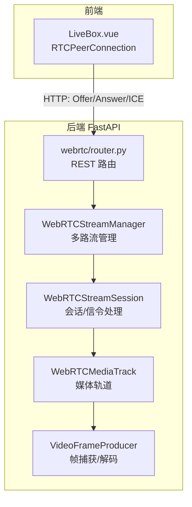
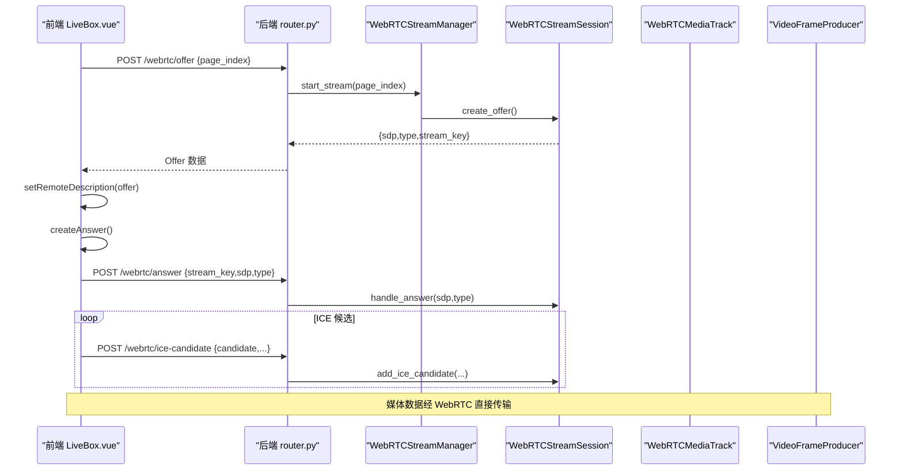
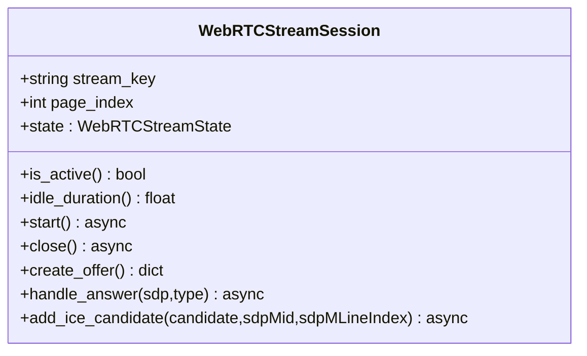
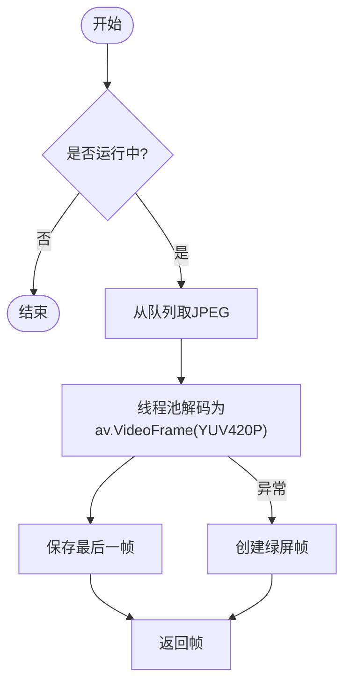
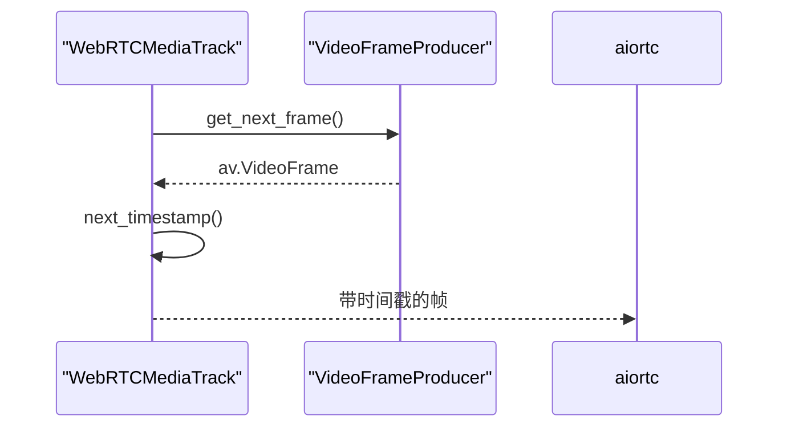
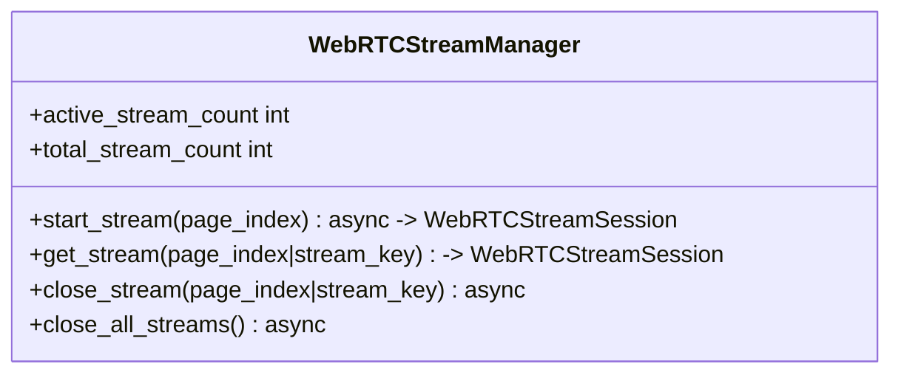
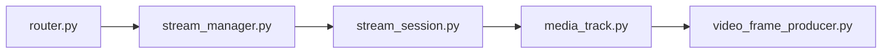

# WebRTC 流媒体 API

<cite>
**本文引用的文件**
- [RPA-Browser/app/services/RPA_browser/webrtc/stream_session.py](file://RPA-Browser/app/services/RPA_browser/webrtc/stream_session.py)
- [RPA-Browser/app/services/RPA_browser/webrtc/video_frame_producer.py](file://RPA-Browser/app/services/RPA_browser/webrtc/video_frame_producer.py)
- [RPA-Browser/app/services/RPA_browser/webrtc/media_track.py](file://RPA-Browser/app/services/RPA_browser/webrtc/media_track.py)
- [RPA-Browser/app/services/RPA_browser/webrtc/stream_manager.py](file://RPA-Browser/app/services/RPA_browser/webrtc/stream_manager.py)
- [RPA-Browser/app/controller/v1/browser_control/webrtc/router.py](file://RPA-Browser/app/controller/v1/browser_control/webrtc/router.py)
- [RPA-Browser/app/models/runtime/webrtc_models.py](file://RPA-Browser/app/models/runtime/webrtc_models.py)
- [RPA-Browser/app/config.py](file://RPA-Browser/app/config.py)
- [Vue3FrontEndDemoExercise/src/components/rpa-browser/LiveBox.vue](file://Vue3FrontEndDemoExercise/src/components/rpa-browser/LiveBox.vue)
- [Vue3FrontEndDemoExercise/src/api/browser/hey-api/types.gen.ts](file://Vue3FrontEndDemoExercise/src/api/browser/hey-api/types.gen.ts)
</cite>

## 目录
1. [简介](#简介)
2. [项目结构](#项目结构)
3. [核心组件](#核心组件)
4. [架构总览](#架构总览)
5. [详细组件分析](#详细组件分析)
6. [依赖关系分析](#依赖关系分析)
7. [性能与优化](#性能与优化)
8. [故障排查指南](#故障排查指南)
9. [结论](#结论)
10. [附录：API 接口规范](#附录api-接口规范)

## 简介
本文件面向使用本仓库实现“浏览器屏幕共享/视频流传输”的开发者，提供端到端的 WebRTC 流媒体 API 文档。内容涵盖：
- 浏览器端与后端的信令交互（Offer/Answer/ICE Candidate）
- 媒体轨道管理与帧捕获、编码、网络适配
- 多路流管理、闲置淘汰、分辨率与质量配置
- 质量监控、延迟优化、错误恢复等调优方案
- 移动端与跨平台部署注意事项

## 项目结构
本项目在后端（FastAPI + aiortc）提供 WebRTC 视频流能力，前端（Vue3）通过 REST 完成信令交换，并通过浏览器原生 RTCPeerConnection 建立 P2P 数据通道进行媒体传输。

图表来源
- [RPA-Browser/app/controller/v1/browser_control/webrtc/router.py:62-239](file://RPA-Browser/app/controller/v1/browser_control/webrtc/router.py#L62-L239)
- [RPA-Browser/app/services/RPA_browser/webrtc/stream_manager.py:24-138](file://RPA-Browser/app/services/RPA_browser/webrtc/stream_manager.py#L24-L138)
- [RPA-Browser/app/services/RPA_browser/webrtc/stream_session.py:67-235](file://RPA-Browser/app/services/RPA_browser/webrtc/stream_session.py#L67-L235)
- [RPA-Browser/app/services/RPA_browser/webrtc/media_track.py:14-69](file://RPA-Browser/app/services/RPA_browser/webrtc/media_track.py#L14-L69)
- [RPA-Browser/app/services/RPA_browser/webrtc/video_frame_producer.py:18-173](file://RPA-Browser/app/services/RPA_browser/webrtc/video_frame_producer.py#L18-L173)
- [Vue3FrontEndDemoExercise/src/components/rpa-browser/LiveBox.vue:165-259](file://Vue3FrontEndDemoExercise/src/components/rpa-browser/LiveBox.vue#L165-L259)

章节来源
- [RPA-Browser/app/controller/v1/browser_control/webrtc/router.py:62-239](file://RPA-Browser/app/controller/v1/browser_control/webrtc/router.py#L62-L239)
- [RPA-Browser/app/services/RPA_browser/webrtc/stream_manager.py:24-138](file://RPA-Browser/app/services/RPA_browser/webrtc/stream_manager.py#L24-L138)
- [RPA-Browser/app/services/RPA_browser/webrtc/stream_session.py:67-235](file://RPA-Browser/app/services/RPA_browser/webrtc/stream_session.py#L67-L235)
- [RPA-Browser/app/services/RPA_browser/webrtc/media_track.py:14-69](file://RPA-Browser/app/services/RPA_browser/webrtc/media_track.py#L14-L69)
- [RPA-Browser/app/services/RPA_browser/webrtc/video_frame_producer.py:18-173](file://RPA-Browser/app/services/RPA_browser/webrtc/video_frame_producer.py#L18-L173)
- [Vue3FrontEndDemoExercise/src/components/rpa-browser/LiveBox.vue:165-259](file://Vue3FrontEndDemoExercise/src/components/rpa-browser/LiveBox.vue#L165-L259)

## 核心组件
- WebRTCStreamSession：封装单个页面的 WebRTC 生命周期、状态机、信令处理（Offer/Answer/ICE）。
- VideoFrameProducer：基于 Playwright screencast 捕获页面帧，JPEG 解码为 av.VideoFrame（YUV420P），线程池避免阻塞事件循环。
- WebRTCMediaTrack：实现 aiortc 的视频轨道，将生产者帧以正确时间戳输出给 PeerConnection。
- WebRTCStreamManager：多路流管理，双向索引 O(1) 查找，LRU 淘汰闲置流，定期清理。
- REST 路由：暴露 Offer/Answer/ICE/Closed/Status 等接口，统一鉴权与响应。
- 前端 LiveBox：创建 RTCPeerConnection，发起 Offer/Answer，转发 ICE，渲染远端视频。

章节来源
- [RPA-Browser/app/services/RPA_browser/webrtc/stream_session.py:67-301](file://RPA-Browser/app/services/RPA_browser/webrtc/stream_session.py#L67-L301)
- [RPA-Browser/app/services/RPA_browser/webrtc/video_frame_producer.py:18-229](file://RPA-Browser/app/services/RPA_browser/webrtc/video_frame_producer.py#L18-L229)
- [RPA-Browser/app/services/RPA_browser/webrtc/media_track.py:14-69](file://RPA-Browser/app/services/RPA_browser/webrtc/media_track.py#L14-L69)
- [RPA-Browser/app/services/RPA_browser/webrtc/stream_manager.py:24-294](file://RPA-Browser/app/services/RPA_browser/webrtc/stream_manager.py#L24-L294)
- [RPA-Browser/app/controller/v1/browser_control/webrtc/router.py:62-239](file://RPA-Browser/app/controller/v1/browser_control/webrtc/router.py#L62-L239)
- [Vue3FrontEndDemoExercise/src/components/rpa-browser/LiveBox.vue:165-259](file://Vue3FrontEndDemoExercise/src/components/rpa-browser/LiveBox.vue#L165-L259)

## 架构总览
下图展示了从前端到后端的完整调用链：前端通过 REST 获取 Offer，设置远程描述并生成 Answer 回传；随后在连接过程中将 ICE Candidate 透传到后端；媒体数据通过 WebRTC 直接传输。

图表来源
- [RPA-Browser/app/controller/v1/browser_control/webrtc/router.py:62-174](file://RPA-Browser/app/controller/v1/browser_control/webrtc/router.py#L62-L174)
- [RPA-Browser/app/services/RPA_browser/webrtc/stream_session.py:202-268](file://RPA-Browser/app/services/RPA_browser/webrtc/stream_session.py#L202-L268)
- [RPA-Browser/app/services/RPA_browser/webrtc/stream_manager.py:82-138](file://RPA-Browser/app/services/RPA_browser/webrtc/stream_manager.py#L82-L138)
- [Vue3FrontEndDemoExercise/src/components/rpa-browser/LiveBox.vue:165-259](file://Vue3FrontEndDemoExercise/src/components/rpa-browser/LiveBox.vue#L165-L259)

## 详细组件分析

### 组件 A：WebRTCStreamSession（会话与信令）
- 职责：维护 RTCPeerConnection，管理状态机（INITIALIZING/ACTIVE/CLOSED/ERROR），处理 Offer/Answer/ICE，记录活跃时间用于闲置检测。
- 关键点：
  - 状态转换受保护，非法转换会记录警告。
  - 活动更新在关键路径（start/create_offer/handle_answer/add_ice_candidate）触发。
  - 支持关闭时幂等释放资源。

图表来源
- [RPA-Browser/app/services/RPA_browser/webrtc/stream_session.py:67-301](file://RPA-Browser/app/services/RPA_browser/webrtc/stream_session.py#L67-L301)

章节来源
- [RPA-Browser/app/services/RPA_browser/webrtc/stream_session.py:67-301](file://RPA-Browser/app/services/RPA_browser/webrtc/stream_session.py#L67-L301)

### 组件 B：VideoFrameProducer（帧捕获与解码）
- 职责：通过 Playwright screencast 捕获页面帧，异步队列缓冲，线程池解码 JPEG 为 av.VideoFrame（YUV420P），异常时返回绿屏帧保障连续性。
- 关键点：
  - 丢旧保新策略，避免队列拥塞。
  - 首次启动失败自动恢复（停止异常会话后重试）。
  - 初始化绿屏帧，避免首帧缺失。

图表来源
- [RPA-Browser/app/services/RPA_browser/webrtc/video_frame_producer.py:43-173](file://RPA-Browser/app/services/RPA_browser/webrtc/video_frame_producer.py#L43-L173)
- [RPA-Browser/app/services/RPA_browser/webrtc/video_frame_producer.py:175-218](file://RPA-Browser/app/services/RPA_browser/webrtc/video_frame_producer.py#L175-L218)

章节来源
- [RPA-Browser/app/services/RPA_browser/webrtc/video_frame_producer.py:18-229](file://RPA-Browser/app/services/RPA_browser/webrtc/video_frame_producer.py#L18-L229)

### 组件 C：WebRTCMediaTrack（媒体轨道）
- 职责：实现 aiortc 的视频轨道，按需从生产者拉取帧并赋予时间戳，结束时抛出 StopIteration 通知轨道终止。
- 关键点：
  - 使用父类 next_timestamp 自动处理 90kHz 时钟与时基。
  - 生产者停止时优雅结束轨道。

图表来源
- [RPA-Browser/app/services/RPA_browser/webrtc/media_track.py:14-69](file://RPA-Browser/app/services/RPA_browser/webrtc/media_track.py#L14-L69)

章节来源
- [RPA-Browser/app/services/RPA_browser/webrtc/media_track.py:14-69](file://RPA-Browser/app/services/RPA_browser/webrtc/media_track.py#L14-L69)

### 组件 D：WebRTCStreamManager（多路流管理）
- 职责：按 page_index 启动/关闭流，双向索引 O(1) 查找，LRU 淘汰闲置流，定期任务清理。
- 关键点：
  - 同页旧流自动淘汰，避免资源泄漏。
  - 空闲超时由配置驱动，默认 300 秒。
  - 支持批量关闭所有流。

图表来源
- [RPA-Browser/app/services/RPA_browser/webrtc/stream_manager.py:24-294](file://RPA-Browser/app/services/RPA_browser/webrtc/stream_manager.py#L24-L294)

章节来源
- [RPA-Browser/app/services/RPA_browser/webrtc/stream_manager.py:24-294](file://RPA-Browser/app/services/RPA_browser/webrtc/stream_manager.py#L24-L294)

### 组件 E：REST 路由（信令接口）
- 端点：
  - POST /webrtc/offer：创建 Offer，返回 sdp/type/stream_key
  - POST /webrtc/answer：处理 Answer
  - POST /webrtc/ice-candidate：添加 ICE Candidate
  - POST /webrtc/close：关闭指定流
  - POST /webrtc/status：查询当前会话的流状态
- 鉴权：通过依赖注入验证浏览器所有权。
- 错误码：统一使用 ResponseCode 返回业务错误。

章节来源
- [RPA-Browser/app/controller/v1/browser_control/webrtc/router.py:62-239](file://RPA-Browser/app/controller/v1/browser_control/webrtc/router.py#L62-L239)

### 组件 F：前端集成（LiveBox.vue）
- 行为：
  - 创建 RTCPeerConnection（STUN 服务器配置）
  - 调用 /webrtc/offer 获取 Offer，设置远程描述并生成 Answer 回传
  - 监听 ontrack 渲染视频
  - 转发 ICE Candidate 到后端
  - 连接状态变化时更新 UI

章节来源
- [Vue3FrontEndDemoExercise/src/components/rpa-browser/LiveBox.vue:165-259](file://Vue3FrontEndDemoExercise/src/components/rpa-browser/LiveBox.vue#L165-L259)

## 依赖关系分析
- 模块耦合：
  - router 依赖 manager/session，manager 依赖 session，session 依赖 track/producer。
  - 前端仅依赖 REST 接口与浏览器原生 WebRTC。
- 外部依赖：
  - aiortc（WebRTC 实现）
  - Playwright（页面截图/screencast）
  - av/PIL（帧格式转换）
- 潜在循环引用：
  - 通过 weakref 打破 Page ↔ Session 的循环引用。

图表来源
- [RPA-Browser/app/controller/v1/browser_control/webrtc/router.py:62-239](file://RPA-Browser/app/controller/v1/browser_control/webrtc/router.py#L62-L239)
- [RPA-Browser/app/services/RPA_browser/webrtc/stream_manager.py:24-138](file://RPA-Browser/app/services/RPA_browser/webrtc/stream_manager.py#L24-L138)
- [RPA-Browser/app/services/RPA_browser/webrtc/stream_session.py:67-235](file://RPA-Browser/app/services/RPA_browser/webrtc/stream_session.py#L67-L235)
- [RPA-Browser/app/services/RPA_browser/webrtc/media_track.py:14-69](file://RPA-Browser/app/services/RPA_browser/webrtc/media_track.py#L14-L69)
- [RPA-Browser/app/services/RPA_browser/webrtc/video_frame_producer.py:18-173](file://RPA-Browser/app/services/RPA_browser/webrtc/video_frame_producer.py#L18-L173)

章节来源
- [RPA-Browser/app/services/RPA_browser/webrtc/stream_session.py:32-65](file://RPA-Browser/app/services/RPA_browser/webrtc/stream_session.py#L32-L65)
- [RPA-Browser/app/services/RPA_browser/webrtc/stream_manager.py:24-71](file://RPA-Browser/app/services/RPA_browser/webrtc/stream_manager.py#L24-L71)

## 性能与优化
- 帧捕获与解码
  - 使用 Playwright screencast 捕获 JPEG，线程池解码为 YUV420P，避免阻塞事件循环。
  - 队列满时丢弃最旧帧，降低延迟抖动。
- 多路流管理
  - 双向索引 O(1) 查找，LRU 淘汰闲置流，减少内存占用。
  - 定期任务清理超时流，默认闲置 300 秒。
- 网络适配
  - 前端 STUN 服务器已配置，建议根据部署环境补充 TURN 服务器以提升穿透成功率。
- 质量与带宽
  - 可调整 quality（JPEG 质量）、frame_queue_size、idle_timeout 等参数平衡画质与带宽。
- 延迟优化
  - 合理设置帧队列大小，避免堆积；必要时降低质量或帧率。
- 错误恢复
  - 解码失败返回绿屏帧，保证播放连续性；Screencast 异常自动恢复。

章节来源
- [RPA-Browser/app/services/RPA_browser/webrtc/video_frame_producer.py:109-173](file://RPA-Browser/app/services/RPA_browser/webrtc/video_frame_producer.py#L109-L173)
- [RPA-Browser/app/services/RPA_browser/webrtc/stream_manager.py:228-267](file://RPA-Browser/app/services/RPA_browser/webrtc/stream_manager.py#L228-L267)
- [RPA-Browser/app/models/runtime/webrtc_models.py:41-58](file://RPA-Browser/app/models/runtime/webrtc_models.py#L41-L58)
- [RPA-Browser/app/config.py:202-203](file://RPA-Browser/app/config.py#L202-L203)
- [Vue3FrontEndDemoExercise/src/components/rpa-browser/LiveBox.vue:170-173](file://Vue3FrontEndDemoExercise/src/components/rpa-browser/LiveBox.vue#L170-L173)

## 故障排查指南
- 无法建立连接
  - 检查前端 STUN/TURN 配置是否正确。
  - 确认后端 /webrtc/offer 成功返回 sdp/type/stream_key。
- ICE 候选未生效
  - 确认前端 onicecandidate 回调正常触发并调用 /webrtc/ice-candidate。
  - 检查 candidate 字符串格式与 sdpMid/sdpMLineIndex 字段。
- 画面黑屏/卡顿
  - 查看 VideoFrameProducer 是否正常运行，队列是否积压。
  - 适当降低 quality 或 frame_queue_size。
- 流未释放导致资源占用
  - 调用 /webrtc/close 显式关闭；或等待闲置超时自动清理。
- 状态异常
  - 通过 /webrtc/status 查询各流的 state 与 idle_duration。

章节来源
- [RPA-Browser/app/controller/v1/browser_control/webrtc/router.py:105-174](file://RPA-Browser/app/controller/v1/browser_control/webrtc/router.py#L105-L174)
- [RPA-Browser/app/services/RPA_browser/webrtc/stream_session.py:237-268](file://RPA-Browser/app/services/RPA_browser/webrtc/stream_session.py#L237-L268)
- [RPA-Browser/app/services/RPA_browser/webrtc/video_frame_producer.py:175-218](file://RPA-Browser/app/services/RPA_browser/webrtc/video_frame_producer.py#L175-L218)
- [RPA-Browser/app/services/RPA_browser/webrtc/stream_manager.py:228-267](file://RPA-Browser/app/services/RPA_browser/webrtc/stream_manager.py#L228-L267)

## 结论
该实现以 FastAPI + aiortc 为核心，结合 Playwright 的 screencast 能力，提供了稳定高效的浏览器屏幕共享与视频流传输方案。通过多路流管理、闲置淘汰、线程池解码与错误恢复机制，兼顾了性能与可靠性。前端仅需关注信令与渲染，即可快速集成实时流媒体功能。

## 附录：API 接口规范
以下接口均位于浏览器控制域下，请求需携带浏览器身份认证信息。

- 创建 WebRTC Offer
  - 方法：POST
  - 路径：/webrtc/offer
  - 请求体：{ page_index?: number }
  - 响应：{ sdp: string, type: string, stream_key: string }
  - 说明：若会话不存在则自动创建；WebRTC 管理器内建可用。

- 处理 WebRTC Answer
  - 方法：POST
  - 路径：/webrtc/answer
  - 请求体：{ stream_key: string, sdp: string, type: string }
  - 说明：将客户端 Answer 设置到对应流。

- 添加 ICE Candidate
  - 方法：POST
  - 路径：/webrtc/ice-candidate
  - 请求体：{ stream_key: string, candidate: string, sdpMid: string, sdpMLineIndex: number }
  - 说明：解析 candidate 字符串并添加到 PeerConnection。

- 关闭 WebRTC 流
  - 方法：POST
  - 路径：/webrtc/close
  - 请求体：{ stream_key: string }
  - 说明：关闭指定流并清理资源。

- 获取 WebRTC 流状态
  - 方法：POST
  - 路径：/webrtc/status
  - 响应：{ enabled: boolean, active_streams: [{ stream_key, page_index, state, idle_duration }], total_streams: number }
  - 说明：查询当前会话的所有流及其状态。

前端类型定义参考：
- WebRtcOfferRequest/WebRtcAnswerRequest/WebRtcIceCandidateRequest/WebRtcCloseRequest 等类型见前端生成类型文件。

章节来源
- [RPA-Browser/app/controller/v1/browser_control/webrtc/router.py:23-42](file://RPA-Browser/app/controller/v1/browser_control/webrtc/router.py#L23-L42)
- [RPA-Browser/app/controller/v1/browser_control/webrtc/router.py:62-239](file://RPA-Browser/app/controller/v1/browser_control/webrtc/router.py#L62-L239)
- [Vue3FrontEndDemoExercise/src/api/browser/hey-api/types.gen.ts:6378-6436](file://Vue3FrontEndDemoExercise/src/api/browser/hey-api/types.gen.ts#L6378-L6436)