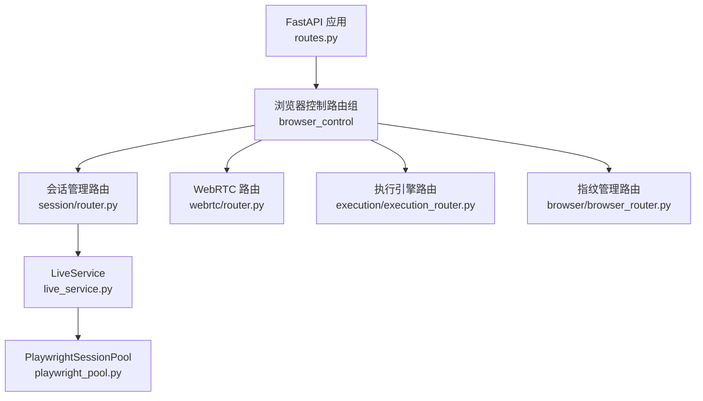
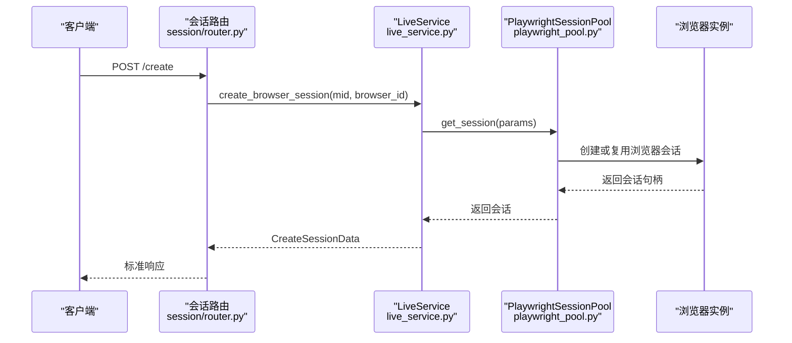
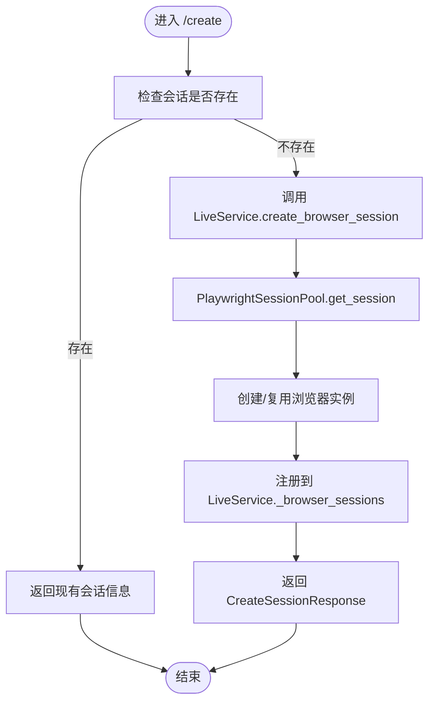
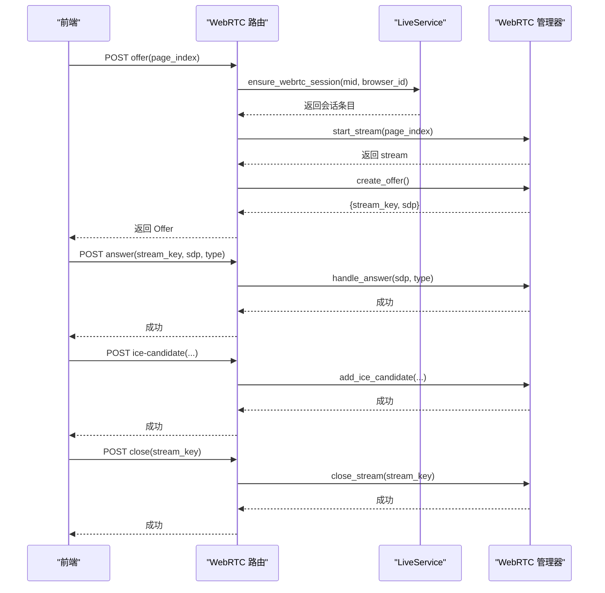
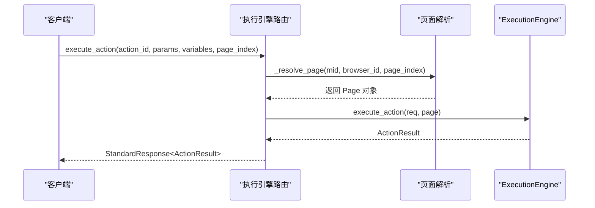
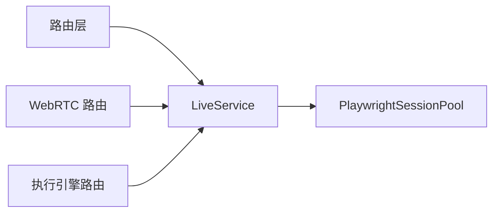

# 会话管理 API

<cite>
**本文引用的文件**
- [app/routes.py](file://RPA-Browser/app/routes.py)
- [app/controller/v1/browser_control/session/router.py](file://RPA-Browser/app/controller/v1/browser_control/session/router.py)
- [app/services/RPA_browser/session/live_service.py](file://RPA-Browser/app/services/RPA_browser/session/live_service.py)
- [app/services/RPA_browser/browser_session_pool/playwright_pool.py](file://RPA-Browser/app/services/RPA_browser/browser_session_pool/playwright_pool.py)
- [app/controller/v1/browser_control/webrtc/router.py](file://RPA-Browser/app/controller/v1/browser_control/webrtc/router.py)
- [app/controller/v1/browser_control/execution/execution_router.py](file://RPA-Browser/app/controller/v1/browser_control/execution/execution_router.py)
- [app/controller/v1/browser/browser_router.py](file://RPA-Browser/app/controller/v1/browser/browser_router.py)
</cite>

## 目录
1. [简介](#简介)
2. [项目结构](#项目结构)
3. [核心组件](#核心组件)
4. [架构总览](#架构总览)
5. [详细组件分析](#详细组件分析)
6. [依赖关系分析](#依赖关系分析)
7. [性能与优化](#性能与优化)
8. [故障排查指南](#故障排查指南)
9. [结论](#结论)
10. [附录：配置示例](#附录：配置示例)

## 简介
本接口文档面向浏览器会话的全生命周期管理，覆盖会话创建、状态查询、关闭销毁、多标签页操作、WebRTC 视频流、执行引擎（工作流/动作）等能力。同时提供会话池、连接复用、自动清理与恢复等运维相关能力说明，帮助使用者构建高可用、可观测的浏览器自动化系统。

## 项目结构
后端采用 FastAPI 模块化路由组织，会话管理与控制位于 browser_control 子模块，具体包括：
- 会话管理路由：创建、状态、关闭
- WebRTC 路由：Offer/Answer/ICE/关闭/状态
- 执行引擎路由：动作与工作流执行、预览与校验、单步执行
- 指纹管理路由：生成、增删改查、重命名、计数、分页
- 应用入口：统一注册路由与全局异常处理

图表来源
- [app/routes.py:20-48](file://RPA-Browser/app/routes.py#L20-L48)
- [app/controller/v1/browser_control/session/router.py:20-20](file://RPA-Browser/app/controller/v1/browser_control/session/router.py#L20-L20)
- [app/controller/v1/browser_control/webrtc/router.py:20-20](file://RPA-Browser/app/controller/v1/browser_control/webrtc/router.py#L20-L20)
- [app/controller/v1/browser_control/execution/execution_router.py:41-41](file://RPA-Browser/app/controller/v1/browser_control/execution/execution_router.py#L41-L41)
- [app/controller/v1/browser/browser_router.py:33-33](file://RPA-Browser/app/controller/v1/browser/browser_router.py#L33-L33)
- [app/services/RPA_browser/session/live_service.py:49-59](file://RPA-Browser/app/services/RPA_browser/session/live_service.py#L49-L59)
- [app/services/RPA_browser/browser_session_pool/playwright_pool.py:18-34](file://RPA-Browser/app/services/RPA_browser/browser_session_pool/playwright_pool.py#L18-L34)

章节来源
- [app/routes.py:20-48](file://RPA-Browser/app/routes.py#L20-L48)

## 核心组件
- LiveService：会话生命周期管理、状态机、清理策略、并发锁、WebRTC 就绪保障
- PlaywrightSessionPool：按 mid 维度的浏览器会话池化与复用、创建与释放
- 会话路由：HTTP 接口暴露会话创建、状态、关闭
- WebRTC 路由：视频流协商与生命周期管理
- 执行引擎路由：动作与工作流的执行、预览、校验、单步调试
- 指纹路由：浏览器指纹的生成、持久化与管理

章节来源
- [app/services/RPA_browser/session/live_service.py:49-59](file://RPA-Browser/app/services/RPA_browser/session/live_service.py#L49-L59)
- [app/services/RPA_browser/browser_session_pool/playwright_pool.py:18-34](file://RPA-Browser/app/services/RPA_browser/browser_session_pool/playwright_pool.py#L18-L34)
- [app/controller/v1/browser_control/session/router.py:20-20](file://RPA-Browser/app/controller/v1/browser_control/session/router.py#L20-L20)
- [app/controller/v1/browser_control/webrtc/router.py:20-20](file://RPA-Browser/app/controller/v1/browser_control/webrtc/router.py#L20-L20)
- [app/controller/v1/browser_control/execution/execution_router.py:41-41](file://RPA-Browser/app/controller/v1/browser_control/execution/execution_router.py#L41-L41)
- [app/controller/v1/browser/browser_router.py:33-33](file://RPA-Browser/app/controller/v1/browser/browser_router.py#L33-L33)

## 架构总览
下图展示了从 HTTP 请求到会话服务与底层浏览器实例的关键调用链。

图表来源
- [app/controller/v1/browser_control/session/router.py:23-91](file://RPA-Browser/app/controller/v1/browser_control/session/router.py#L23-L91)
- [app/services/RPA_browser/session/live_service.py:367-440](file://RPA-Browser/app/services/RPA_browser/session/live_service.py#L367-L440)
- [app/services/RPA_browser/browser_session_pool/playwright_pool.py:36-83](file://RPA-Browser/app/services/RPA_browser/browser_session_pool/playwright_pool.py#L36-L83)

## 详细组件分析

### 会话管理接口
- 创建会话
  - 路径与方法：POST /browser/session/create
  - 功能：独立于心跳的会话创建；若已存在则直接返回现有会话信息；否则异步创建并立即返回
  - 关键参数：通过认证头获取 mid 与 browser_id
  - 返回：CreateSessionResponse（包含 session_id、是否启动、状态、时间戳等）
- 查询状态
  - 路径与方法：POST /browser/session/status
  - 功能：统一查询会话是否存在、浏览器是否运行、生命周期状态、清理策略等
  - 返回：BrowserSessionStatus（含屏幕尺寸、视口大小、状态码与消息）
- 关闭会话
  - 路径与方法：POST /browser/session/close
  - 功能：主动释放浏览器资源；不存在时返回错误码
  - 返回：CloseSessionResponse（包含关闭时间与消息）

图表来源
- [app/controller/v1/browser_control/session/router.py:23-91](file://RPA-Browser/app/controller/v1/browser_control/session/router.py#L23-L91)
- [app/services/RPA_browser/session/live_service.py:367-440](file://RPA-Browser/app/services/RPA_browser/session/live_service.py#L367-L440)
- [app/services/RPA_browser/browser_session_pool/playwright_pool.py:36-83](file://RPA-Browser/app/services/RPA_browser/browser_session_pool/playwright_pool.py#L36-L83)

章节来源
- [app/controller/v1/browser_control/session/router.py:23-196](file://RPA-Browser/app/controller/v1/browser_control/session/router.py#L23-L196)
- [app/services/RPA_browser/session/live_service.py:442-499](file://RPA-Browser/app/services/RPA_browser/session/live_service.py#L442-L499)

### WebRTC 实时通信接口
- 创建 Offer
  - 路径与方法：POST /browser/webrtc/offer
  - 功能：确保会话存在并启动视频流，返回 SDP Offer
- 处理 Answer
  - 路径与方法：POST /browser/webrtc/answer
  - 功能：根据 stream_key 查找流并处理 SDP Answer
- 添加 ICE Candidate
  - 路径与方法：POST /browser/webrtc/ice-candidate
  - 功能：为指定流添加 ICE 候选
- 关闭流
  - 路径与方法：POST /browser/webrtc/close
  - 功能：关闭指定流并清理资源
- 查询状态
  - 路径与方法：POST /browser/webrtc/status
  - 功能：返回当前会话中所有活跃流的状态与统计

图表来源
- [app/controller/v1/browser_control/webrtc/router.py:62-239](file://RPA-Browser/app/controller/v1/browser_control/webrtc/router.py#L62-L239)
- [app/services/RPA_browser/session/live_service.py:501-530](file://RPA-Browser/app/services/RPA_browser/session/live_service.py#L501-L530)

章节来源
- [app/controller/v1/browser_control/webrtc/router.py:23-239](file://RPA-Browser/app/controller/v1/browser_control/webrtc/router.py#L23-L239)

### 执行引擎（动作与工作流）
- 执行单个动作
  - 路径与方法：POST /browser/control/actions/execute
  - 功能：在指定页面执行动作，支持变量注入与输出变量收集
- 执行工作流
  - 路径与方法：POST /browser/control/workflows/execute
  - 功能：支持 action_id 或 steps 两种模式；返回步骤级结果与摘要
- 预览与校验
  - 路径与方法：POST /browser/control/actions/preview、POST /browser/control/actions/validate
  - 功能：预览参数替换结果、校验参数完整性与合法性
- 单步执行
  - 路径与方法：POST /browser/control/actions/execute-step
  - 功能：对复合操作进行逐步执行，便于调试
- 系统 RPC 方法列表
  - 路径与方法：GET /browser/control/system-services/list
  - 功能：列出外部数据 Action 可选的 RPC 方法

图表来源
- [app/controller/v1/browser_control/execution/execution_router.py:97-134](file://RPA-Browser/app/controller/v1/browser_control/execution/execution_router.py#L97-L134)
- [app/controller/v1/browser_control/execution/execution_router.py:46-60](file://RPA-Browser/app/controller/v1/browser_control/execution/execution_router.py#L46-L60)

章节来源
- [app/controller/v1/browser_control/execution/execution_router.py:97-409](file://RPA-Browser/app/controller/v1/browser_control/execution/execution_router.py#L97-L409)

### 指纹管理（会话基础配置）
- 生成随机指纹（不持久化）
  - 路径与方法：POST /browser/fingerprint/gen-rand
  - 功能：临时指纹，用于测试或一次性使用
- 创建/更新指纹
  - 路径与方法：POST /browser/fingerprint/upsert
  - 功能：持久化保存指纹，可用于后续浏览器实例启动
- 读取/删除/计数/列表/重命名
  - 路径与方法：POST /browser/fingerprint/read/delete/count/list/rename
  - 功能：完整的指纹 CRUD 与分页查询

章节来源
- [app/controller/v1/browser/browser_router.py:36-252](file://RPA-Browser/app/controller/v1/browser/browser_router.py#L36-L252)

## 依赖关系分析
- 路由层依赖认证与安全校验（mid、browser_id 归属验证）
- 会话路由依赖 LiveService 进行会话生命周期管理
- LiveService 依赖 PlaywrightSessionPool 完成浏览器实例的创建与复用
- WebRTC 路由依赖 LiveService.ensure_webrtc_session 保证会话就绪
- 执行引擎路由依赖 LiveService 解析页面并传入 ExecutionEngine

图表来源
- [app/controller/v1/browser_control/session/router.py:20-20](file://RPA-Browser/app/controller/v1/browser_control/session/router.py#L20-L20)
- [app/services/RPA_browser/session/live_service.py:49-59](file://RPA-Browser/app/services/RPA_browser/session/live_service.py#L49-L59)
- [app/services/RPA_browser/browser_session_pool/playwright_pool.py:18-34](file://RPA-Browser/app/services/RPA_browser/browser_session_pool/playwright_pool.py#L18-L34)
- [app/controller/v1/browser_control/webrtc/router.py:20-20](file://RPA-Browser/app/controller/v1/browser_control/webrtc/router.py#L20-L20)
- [app/controller/v1/browser_control/execution/execution_router.py:41-41](file://RPA-Browser/app/controller/v1/browser_control/execution/execution_router.py#L41-L41)

章节来源
- [app/routes.py:20-48](file://RPA-Browser/app/routes.py#L20-L48)

## 性能与优化
- 会话池化与连接复用
  - 通过 PlaywrightSessionPool 按 mid 维度复用浏览器会话，减少重复创建开销
  - 支持批量释放与空闲回收
- 并发安全
  - LiveService 使用会话级锁避免竞态条件；全局锁保护锁字典本身
  - 创建流程采用“先快速检查 + 再加锁双重检查”的模式
- 自动清理与状态机
  - 基于过期时间、闲置超时、直播流超时的优先级策略进行清理
  - ACTIVE ↔ IDLE 状态转换，降低资源占用
- 重试与恢复
  - 创建失败时支持有限次重试，提升鲁棒性
- 建议
  - 合理设置会话过期与闲置阈值，平衡资源与响应速度
  - 在高并发场景下优先复用已有会话，避免频繁创建
  - 监控 WebRTC 流数量与空闲时长，及时释放无用流

[本节为通用性能指导，不直接分析具体文件]

## 故障排查指南
- 常见错误码与含义
  - 会话不存在：创建/关闭/查询前未创建或已过期
  - 浏览器未启动：会话存在但浏览器进程不可用
  - 页面索引越界：page_index 超出当前打开页面范围
  - WebRTC 流不存在：未先创建 Offer 或流已关闭
- 定位步骤
  - 使用 /status 确认会话与浏览器状态
  - 使用 /webrtc/status 查看活跃流与空闲时长
  - 检查 LiveService 日志中的清理原因与状态转换
  - 核对认证头是否正确传递 mid 与 browser_id
- 恢复策略
  - 关闭后重新创建会话
  - 调整清理策略与超时阈值
  - 增加重试次数或放宽页面索引校验

章节来源
- [app/controller/v1/browser_control/session/router.py:94-196](file://RPA-Browser/app/controller/v1/browser_control/session/router.py#L94-L196)
- [app/controller/v1/browser_control/webrtc/router.py:105-239](file://RPA-Browser/app/controller/v1/browser_control/webrtc/router.py#L105-L239)
- [app/services/RPA_browser/session/live_service.py:92-194](file://RPA-Browser/app/services/RPA_browser/session/live_service.py#L92-L194)

## 结论
本 API 体系围绕浏览器会话的生命周期展开，提供健壮的创建、状态管理、销毁与 WebRTC 实时通信能力，并通过执行引擎实现动作与工作流的灵活编排。配合会话池化、并发锁与自动清理策略，可在生产环境中稳定支撑多标签页、跨域共享与高并发场景。建议结合监控指标与日志完善可观测性，持续优化资源占用与响应延迟。

[本节为总结性内容，不直接分析具体文件]

## 附录：配置示例
以下为与会话管理相关的配置项说明与示例值，供部署与运维参考：
- 会话过期时间（秒）
  - 键名：browser_session_expiration_time
  - 示例：3600
  - 说明：会话最大存活时间，超过将触发清理
- 自动清理开关
  - 键名：browser_session_auto_cleanup
  - 示例：true
  - 说明：启用后按闲置与超时策略自动清理
- 最大闲置时间（秒）
  - 键名：browser_session_max_idle_time
  - 示例：1800
  - 说明：无活动且无连接达到该阈值将被清理
- 清理间隔（秒）
  - 键名：browser_session_cleanup_interval
  - 示例：300
  - 说明：后台扫描与清理的频率

章节来源
- [app/services/RPA_browser/session/live_service.py:408-421](file://RPA-Browser/app/services/RPA_browser/session/live_service.py#L408-L421)