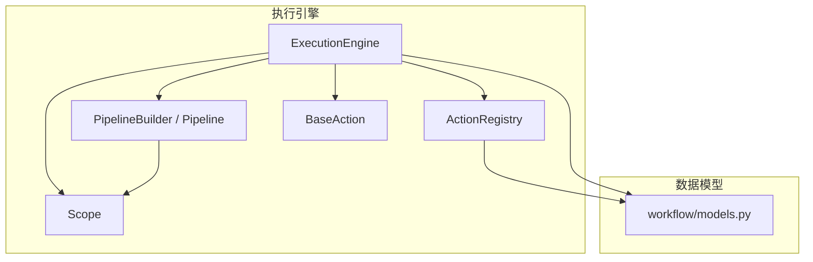
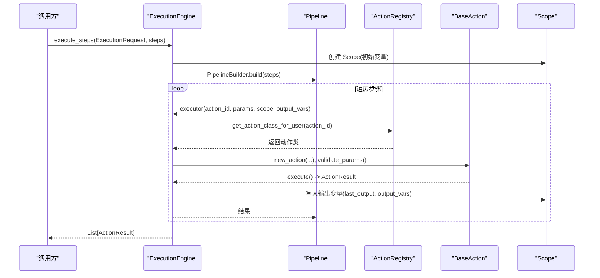
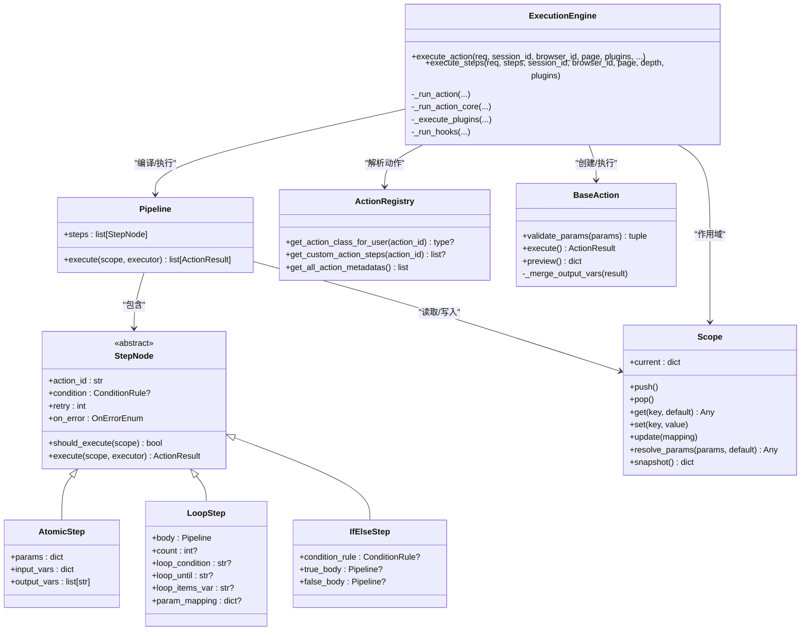
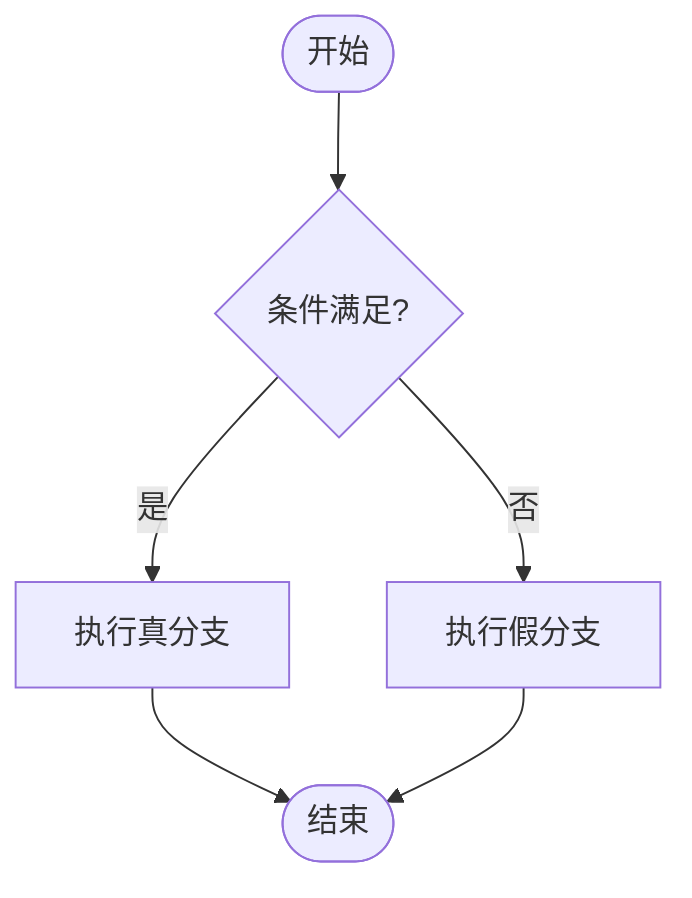

# 执行引擎 API

<cite>
**本文引用的文件**
- [engine.py](file://RPA-Browser/app/services/execution/engine.py)
- [pipeline.py](file://RPA-Browser/app/services/execution/pipeline.py)
- [action_registry.py](file://RPA-Browser/app/services/execution/action_registry.py)
- [models.py](file://RPA-Browser/app/models/workflow/models.py)
- [base.py](file://RPA-Browser/app/services/execution/actions/base.py)
- [scope.py](file://RPA-Browser/app/services/execution/scope.py)
</cite>

## 目录
1. [简介](#简介)
2. [项目结构](#项目结构)
3. [核心组件](#核心组件)
4. [架构总览](#架构总览)
5. [详细组件分析](#详细组件分析)
6. [依赖关系分析](#依赖关系分析)
7. [性能考量](#性能考量)
8. [故障排查指南](#故障排查指南)
9. [结论](#结论)
10. [附录](#附录)

## 简介
本文件面向“工作流执行引擎”的 API 与执行控制能力，覆盖自动化任务的编排、调度与执行控制。内容涵盖：
- 工作流的定义、版本管理、依赖解析等配置接口使用方法
- 动作注册、参数验证、错误处理等执行控制机制的接口规范
- 条件分支、循环控制、并行执行等复杂流程的编排示例
- 执行日志、性能监控、异常告警等运维监控接口的调用方法
- 任务队列管理、优先级调度、资源限制等企业级特性（在本仓库中通过模型与执行管线支持）

## 项目结构
执行引擎相关代码集中在 RPA-Browser 服务下，关键模块如下：
- 执行引擎入口：ExecutionEngine（单操作与工作流步骤执行）
- 管道与步骤：Pipeline、StepNode（AtomicStep/LoopStep/IfElseStep）
- 作用域变量：Scope（模板替换与作用域隔离）
- 动作注册中心：ActionRegistry（内置/自定义动作查找）
- 数据模型：WorkflowStepRequest/Response、CompositeAction*、Plugin* 等
- 动作基类：BaseAction（参数转换、输出变量合并、预览）

**图表来源**
- [engine.py:63-164](file://RPA-Browser/app/services/execution/engine.py#L63-L164)
- [pipeline.py:421-619](file://RPA-Browser/app/services/execution/pipeline.py#L421-L619)
- [scope.py:17-139](file://RPA-Browser/app/services/execution/scope.py#L17-L139)
- [action_registry.py:24-100](file://RPA-Browser/app/services/execution/action_registry.py#L24-L100)
- [models.py:38-141](file://RPA-Browser/app/models/workflow/models.py#L38-L141)

**章节来源**
- [engine.py:63-164](file://RPA-Browser/app/services/execution/engine.py#L63-L164)
- [pipeline.py:421-619](file://RPA-Browser/app/services/execution/pipeline.py#L421-L619)
- [scope.py:17-139](file://RPA-Browser/app/services/execution/scope.py#L17-L139)
- [action_registry.py:24-100](file://RPA-Browser/app/services/execution/action_registry.py#L24-L100)
- [models.py:38-141](file://RPA-Browser/app/models/workflow/models.py#L38-L141)

## 核心组件
- ExecutionEngine：提供 execute_action（单操作）、execute_steps（工作流步骤序列）两大入口；统一参数模板替换、插件钩子、超时与异常处理、执行日志采集。
- Pipeline + StepNode：将 WorkflowStep 编译为可执行 IR（原子步骤、循环、条件分支），支持 on_error 策略、重试、失败分支回退。
- Scope：变量作用域栈，支持 {{var}} 模板替换与作用域 push/pop 隔离。
- ActionRegistry：按 action_id 解析内置或自定义复合操作，并获取步骤列表。
- BaseAction：动作抽象，负责参数转换、输出变量合并、预览模式。
- workflow/models.py：定义工作流、复合操作、插件、执行请求/响应等数据结构。

**章节来源**
- [engine.py:63-164](file://RPA-Browser/app/services/execution/engine.py#L63-L164)
- [pipeline.py:67-499](file://RPA-Browser/app/services/execution/pipeline.py#L67-L499)
- [scope.py:17-139](file://RPA-Browser/app/services/execution/scope.py#L17-L139)
- [action_registry.py:24-100](file://RPA-Browser/app/services/execution/action_registry.py#L24-L100)
- [base.py:36-273](file://RPA-Browser/app/services/execution/actions/base.py#L36-L273)
- [models.py:38-141](file://RPA-Browser/app/models/workflow/models.py#L38-L141)

## 架构总览
执行引擎采用“无状态引擎 + 有状态作用域 + 可插拔动作”的设计：
- 请求进入 ExecutionEngine，构建 Scope 与 Pipeline
- Pipeline 遍历 StepNode，调用 executor（即 Engine._run_action）执行具体动作
- 动作通过 ActionRegistry 解析，BaseAction 完成参数校验与执行
- 插件系统通过 before_action/after_action/on_success/on_error/on_timeout 钩子扩展
- 所有执行路径统一记录 ActionLog，便于追踪与审计

**图表来源**
- [engine.py:111-164](file://RPA-Browser/app/services/execution/engine.py#L111-L164)
- [pipeline.py:503-619](file://RPA-Browser/app/services/execution/pipeline.py#L503-L619)
- [action_registry.py:30-84](file://RPA-Browser/app/services/execution/action_registry.py#L30-L84)
- [base.py:125-156](file://RPA-Browser/app/services/execution/actions/base.py#L125-L156)

## 详细组件分析

### 工作流定义与执行接口
- 工作流步骤定义：使用 WorkflowStepRequest/Response 描述单个步骤的参数、输入输出变量、条件、循环体等
- 执行工作流：WorkflowExecuteRequest 支持内联步骤或引用已保存的自定义操作
- 执行响应：WorkflowExecuteResponse 包含 execution_id、status、results、summary

典型字段说明（节选）：
- browser_id：浏览器实例标识
- action_id：可选，指定要执行的自定义操作
- steps：内联步骤列表（不提供 action_id 时使用）
- variables：变量池，供模板替换
- input_data：输入数据
- output_vars：输出变量名列表
- on_error：错误处理策略（stop/continue/retry）
- page_index：指定在哪个页面 tab 执行

**章节来源**
- [models.py:38-141](file://RPA-Browser/app/models/workflow/models.py#L38-L141)
- [models.py:126-221](file://RPA-Browser/app/models/workflow/models.py#L126-L221)

### 动作注册与元数据
- ActionRegistry.get_action_class_for_user：先查内置动作，再查用户自定义复合操作
- ActionRegistry.get_custom_action_steps：获取自定义操作的步骤列表，并确保每个 step 具备 action_type
- ActionRegistry.get_all_action_metadatas：获取所有内置动作的元数据（用于前端展示与校验）

**章节来源**
- [action_registry.py:24-100](file://RPA-Browser/app/services/execution/action_registry.py#L24-L100)

### 参数验证与模板替换
- 参数验证：BaseAction.validate_params 基于 params_model 进行 Pydantic 校验
- 模板替换：Scope.resolve_params 递归遍历参数树，替换 {{var}}，支持默认值策略
- 输入变量：AtomicStep.input_vars 在执行前合并到当前作用域，使后续步骤可引用

**章节来源**
- [base.py:205-226](file://RPA-Browser/app/services/execution/actions/base.py#L205-L226)
- [scope.py:83-129](file://RPA-Browser/app/services/execution/scope.py#L83-L129)
- [pipeline.py:96-121](file://RPA-Browser/app/services/execution/pipeline.py#L96-L121)

### 错误处理与重试
- 步骤级 on_error 策略：stop（默认）、continue、retry（配合 retry 次数）
- 失败分支 on_error_branch：可在失败时执行清理/告警等回退逻辑
- 循环迭代失败：根据 on_error 策略决定是否继续下一轮或停止

**章节来源**
- [pipeline.py:67-94](file://RPA-Browser/app/services/execution/pipeline.py#L67-L94)
- [pipeline.py:282-327](file://RPA-Browser/app/services/execution/pipeline.py#L282-L327)
- [pipeline.py:462-499](file://RPA-Browser/app/services/execution/pipeline.py#L462-L499)

### 条件分支与循环控制
- IfElseStep：根据 ConditionRule 选择 true_body 或 false_body 执行
- LoopStep：支持固定次数、while/until 条件、items 列表遍历，以及参数映射注入
- 安全条件评估：safe_evaluate_condition 用于循环条件判断

**章节来源**
- [pipeline.py:329-419](file://RPA-Browser/app/services/execution/pipeline.py#L329-L419)
- [pipeline.py:124-281](file://RPA-Browser/app/services/execution/pipeline.py#L124-L281)

### 插件系统与钩子
- 钩子类型：before_action、after_action、on_success、on_error、on_timeout
- 插件执行：_execute_plugins 根据 hook_type 过滤并执行对应自定义动作
- 插件上下文：传递 variables、_plugin_action_result、_plugin_config 等

**章节来源**
- [engine.py:364-448](file://RPA-Browser/app/services/execution/engine.py#L364-L448)
- [models.py:560-637](file://RPA-Browser/app/models/workflow/models.py#L560-L637)

### 执行日志与监控
- 统一埋点：_run_action 构造 ActionLogContext，记录 mid、action_id、source、execution_id、browser_id、session_id、started_at 等
- 日志选项：resolve_log_option 解析动作级日志配置（是否记录参数/结果/变量、保留天数等）
- 结果回填：log_ctx.action_name、params、variables 在动作完成后回填

**章节来源**
- [engine.py:168-235](file://RPA-Browser/app/services/execution/engine.py#L168-L235)
- [models.py:235-262](file://RPA-Browser/app/models/workflow/models.py#L235-L262)

### 预览与验证接口
- preview_action：对动作或复合操作进行模拟执行，返回 replaced_params、preview_variables、steps_preview 等
- validate_action：校验必填参数与复合操作子步骤完整性

**章节来源**
- [engine.py:468-647](file://RPA-Browser/app/services/execution/engine.py#L468-L647)

## 依赖关系分析
- ExecutionEngine 依赖 PipelineBuilder/Pipeline、ActionRegistry、Scope、BaseAction
- Pipeline 依赖 ConditionRule 与 OnErrorEnum，组合 AtomicStep/LoopStep/IfElseStep
- ActionRegistry 依赖数据库会话查询 CompositeActionModel，确保 action_type 一致性
- BaseAction 依赖 params_model/result_model 进行参数校验与结果建模

**图表来源**
- [engine.py:63-164](file://RPA-Browser/app/services/execution/engine.py#L63-L164)
- [pipeline.py:67-499](file://RPA-Browser/app/services/execution/pipeline.py#L67-L499)
- [action_registry.py:24-100](file://RPA-Browser/app/services/execution/action_registry.py#L24-L100)
- [base.py:36-273](file://RPA-Browser/app/services/execution/actions/base.py#L36-L273)
- [scope.py:17-139](file://RPA-Browser/app/services/execution/scope.py#L17-L139)

## 性能考量
- 时间复杂度：Pipeline.execute 为 O(N)，N 为步骤数（不含嵌套）
- 空间复杂度：Pipeline 存储结果列表 O(N)；Scope 使用栈式作用域，push/pop 开销低
- 模板替换：Scope.resolve_params 为 O(M)，M 为参数树字符串总长度
- 插件执行：按 hook_type 过滤后顺序执行，注意避免阻塞主流程
- 建议：
  - 合理设置 on_error 与 retry，避免无限重试
  - 控制循环体规模与条件表达式复杂度
  - 使用 output_vars 精确控制变量写入，减少全局污染

**章节来源**
- [pipeline.py:421-499](file://RPA-Browser/app/services/execution/pipeline.py#L421-L499)
- [scope.py:104-129](file://RPA-Browser/app/services/execution/scope.py#L104-L129)

## 故障排查指南
- 未找到操作：检查 action_id 是否为内置或自定义操作，确认 ActionRegistry 能解析
- 参数验证失败：核对 params_model 的必填项与格式要求
- 条件评估失败：检查 ConditionRule 语法与变量是否存在
- 插件失败：查看 _execute_plugins 日志，确认 custom_action_id 与 hook_type 匹配
- 超时：确认动作实现是否抛出 asyncio.TimeoutError，或调整 timeout 配置
- 日志缺失：确认 resolve_log_option 配置与 log_source 设置

**章节来源**
- [engine.py:237-362](file://RPA-Browser/app/services/execution/engine.py#L237-L362)
- [pipeline.py:76-94](file://RPA-Browser/app/services/execution/pipeline.py#L76-L94)
- [engine.py:364-448](file://RPA-Browser/app/services/execution/engine.py#L364-L448)

## 结论
本执行引擎以 Pipeline 为核心编排单元，结合 Scope 的作用域管理与 ActionRegistry 的动作解析，提供了稳定、可扩展的工作流执行能力。通过统一的错误处理、插件钩子与日志采集，满足企业级自动化场景对可靠性与可观测性的要求。

## 附录

### API 参考（基于模型定义）
- 工作流执行请求：WorkflowExecuteRequest
  - 关键字段：browser_id、action_id、steps、variables、input_data、output_vars、on_error、page_index
- 工作流步骤：WorkflowStepRequest
  - 关键字段：action_id、action_type、params、retry、condition、output_var、input_vars、output_vars、timeout、children、loop_count、loop_while、loop_until
- 复合操作：CompositeActionCreateRequest/UpdateRequest
  - 关键字段：name、parameters_schema、steps、tags、input_vars、output_vars、is_public、timeout、retry_on_error、retry_times、retry_delay、log_*
- 插件挂载：PluginCreateRequest/UpdateRequest
  - 关键字段：name、hook_type、custom_action_id、description、priority、is_public

**章节来源**
- [models.py:38-141](file://RPA-Browser/app/models/workflow/models.py#L38-L141)
- [models.py:235-290](file://RPA-Browser/app/models/workflow/models.py#L235-L290)
- [models.py:560-637](file://RPA-Browser/app/models/workflow/models.py#L560-L637)

### 复杂流程编排示例（概念性）
- 条件分支：使用 IfElseStep，根据 ConditionRule 选择不同子管道
- 循环控制：使用 LoopStep，支持 fixed_count、while/until、items 遍历与参数映射
- 并行执行：可通过多个独立 Pipeline 并发执行（由上层调度器协调），或在循环体内并行调用外部服务（需业务层实现）

[此图为概念流程图，不直接映射具体源码文件]