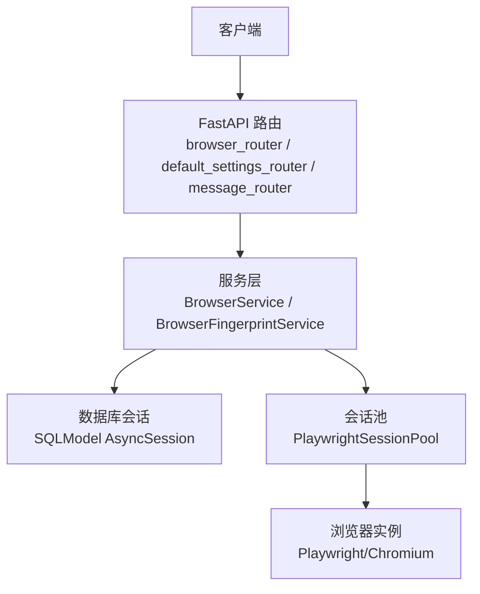
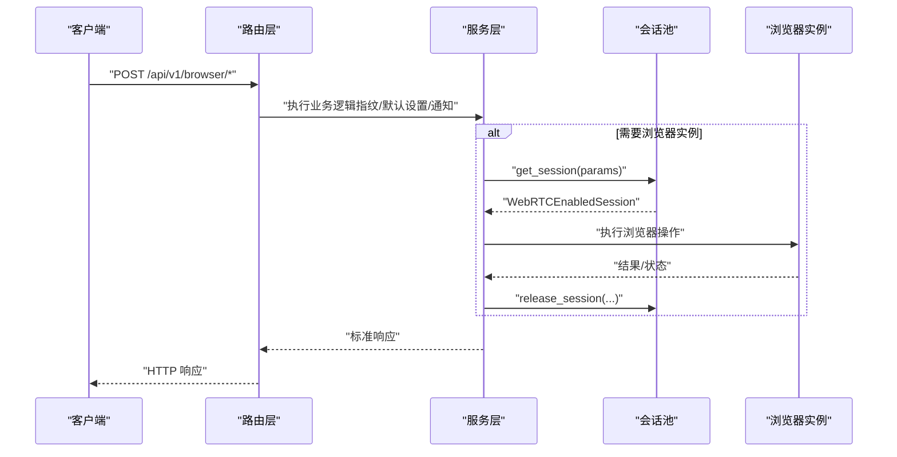
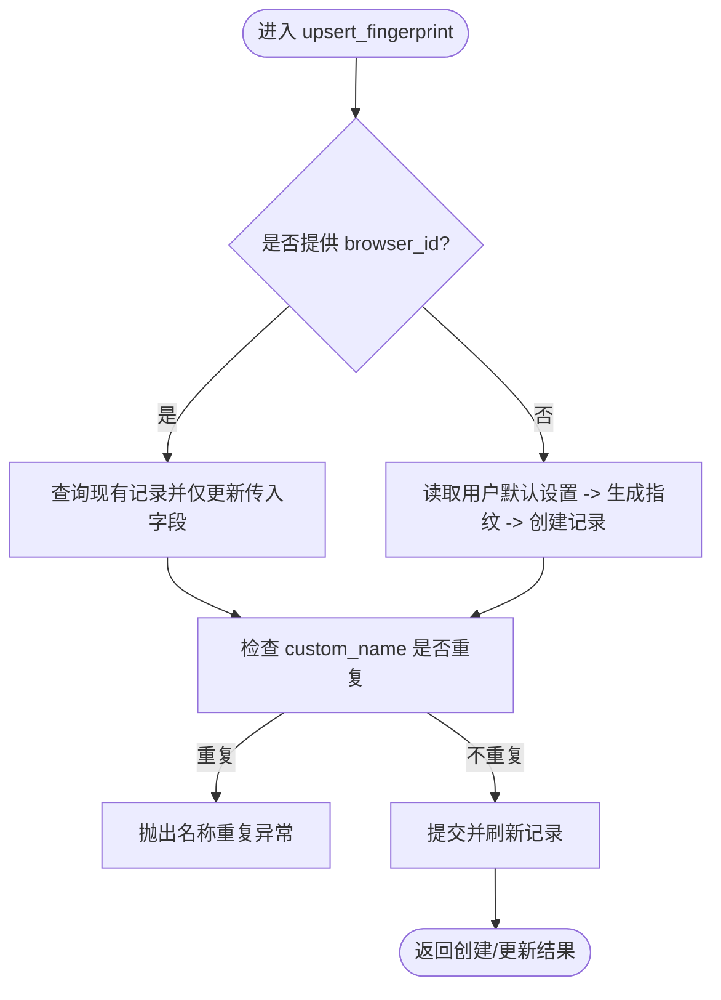
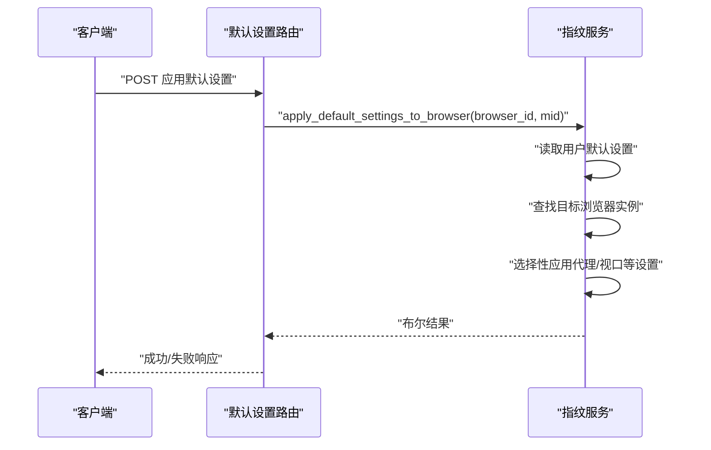
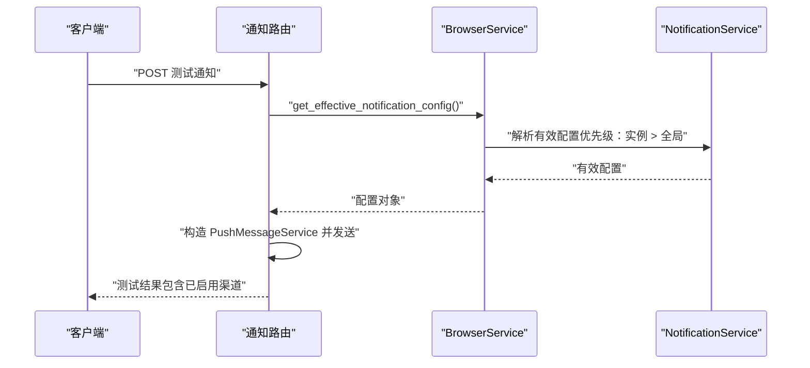
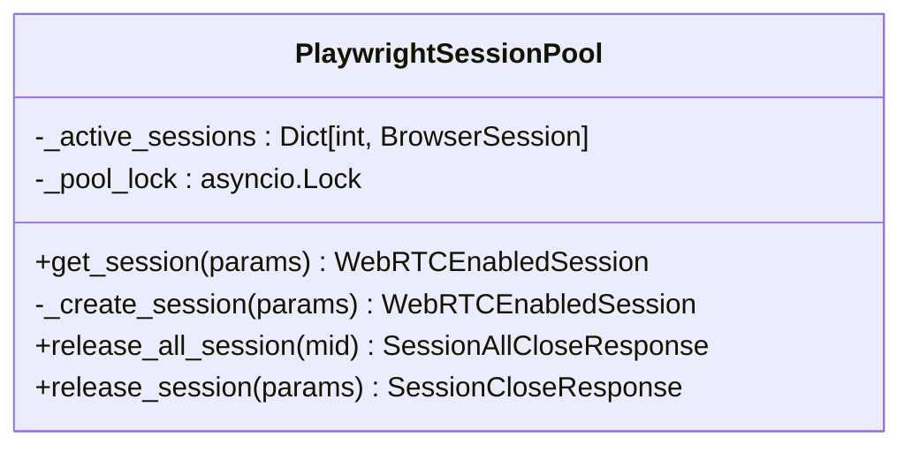
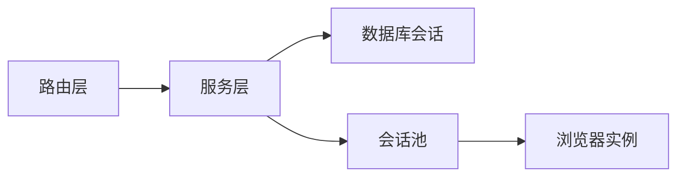

# 浏览器管理 API

<cite>
**本文引用的文件**
- [browser_router.py](file://RPA-Browser/app/controller/v1/browser/browser_router.py)
- [default_settings_router.py](file://RPA-Browser/app/controller/v1/browser/default_settings_router.py)
- [message_router.py](file://RPA-Browser/app/controller/v1/browser/message_router.py)
- [browser_service.py](file://RPA-Browser/app/services/RPA_browser/browser/browser_service.py)
- [browser_fingerprint_service.py](file://RPA-Browser/app/services/RPA_browser/fingerprint/browser_fingerprint_service.py)
- [playwright_pool.py](file://RPA-Browser/app/services/RPA_browser/browser_session_pool/playwright_pool.py)
</cite>

## 目录
1. [简介](#简介)
2. [项目结构](#项目结构)
3. [核心组件](#核心组件)
4. [架构总览](#架构总览)
5. [详细组件分析](#详细组件分析)
6. [依赖关系分析](#依赖关系分析)
7. [性能考虑](#性能考虑)
8. [故障排查指南](#故障排查指南)
9. [结论](#结论)
10. [附录：接口清单与示例](#附录接口清单与示例)

## 简介
本文件面向浏览器管理相关的 RESTful API，覆盖浏览器指纹生成、默认设置配置、浏览器实例生命周期（创建/启动/销毁）以及会话状态查询与资源清理等能力。文档以“请求-响应”形式说明各接口的用途、参数与返回结构，并给出典型调用流程与异常处理建议。同时提供代理、反检测、扩展插件等高级配置的调用思路与最佳实践。

## 项目结构
浏览器管理功能主要位于 RPA-Browser 模块中，采用 FastAPI 路由 + Service 服务层 + 会话池的三层组织方式：
- 控制器层（Controller/Router）：暴露 HTTP 接口，负责鉴权、入参校验、调用服务层并封装统一响应。
- 服务层（Service）：封装业务逻辑，如指纹生成、默认设置读写、通知配置管理等。
- 会话池（Session Pool）：维护浏览器实例的生命周期与并发访问控制。

图表来源
- [browser_router.py:36-251](file://RPA-Browser/app/controller/v1/browser/browser_router.py#L36-L251)
- [default_settings_router.py:45-154](file://RPA-Browser/app/controller/v1/browser/default_settings_router.py#L45-L154)
- [browser_service.py:20-114](file://RPA-Browser/app/services/RPA_browser/browser/browser_service.py#L20-L114)
- [browser_fingerprint_service.py:39-507](file://RPA-Browser/app/services/RPA_browser/fingerprint/browser_fingerprint_service.py#L39-L507)
- [playwright_pool.py:18-127](file://RPA-Browser/app/services/RPA_browser/browser_session_pool/playwright_pool.py#L18-L127)

章节来源
- [browser_router.py:1-252](file://RPA-Browser/app/controller/v1/browser/browser_router.py#L1-L252)
- [default_settings_router.py:1-155](file://RPA-Browser/app/controller/v1/browser/default_settings_router.py#L1-L155)
- [message_router.py:1-302](file://RPA-Browser/app/controller/v1/browser/message_router.py#L1-L302)
- [browser_service.py:1-114](file://RPA-Browser/app/services/RPA_browser/browser/browser_service.py#L1-L114)
- [browser_fingerprint_service.py:1-507](file://RPA-Browser/app/services/RPA_browser/fingerprint/browser_fingerprint_service.py#L1-L507)
- [playwright_pool.py:1-127](file://RPA-Browser/app/services/RPA_browser/browser_session_pool/playwright_pool.py#L1-L127)

## 核心组件
- 指纹管理路由：提供随机指纹生成、指纹持久化（upsert）、读取、删除、计数、分页列表、重命名等能力。
- 默认设置路由：提供用户级默认设置的获取、创建/更新、删除，以及将默认设置应用到指定浏览器实例的能力；并提供服务端预置默认值。
- 通知配置路由：提供通知配置的 upsert、读取、删除与测试发送，支持全局与按浏览器实例维度配置。
- 浏览器服务：封装指纹生成与通知相关能力，作为路由与下游服务的桥梁。
- 指纹服务：实现指纹的增删改查、名称唯一性校验、默认设置应用、数据落库与资源清理。
- 会话池：基于 mid 维度的浏览器会话池，提供会话获取、创建、释放与全量释放，保障并发安全与生命周期管理。

章节来源
- [browser_router.py:36-251](file://RPA-Browser/app/controller/v1/browser/browser_router.py#L36-L251)
- [default_settings_router.py:45-154](file://RPA-Browser/app/controller/v1/browser/default_settings_router.py#L45-L154)
- [message_router.py:34-302](file://RPA-Browser/app/controller/v1/browser/message_router.py#L34-L302)
- [browser_service.py:20-114](file://RPA-Browser/app/services/RPA_browser/browser/browser_service.py#L20-L114)
- [browser_fingerprint_service.py:39-507](file://RPA-Browser/app/services/RPA_browser/fingerprint/browser_fingerprint_service.py#L39-L507)
- [playwright_pool.py:18-127](file://RPA-Browser/app/services/RPA_browser/browser_session_pool/playwright_pool.py#L18-L127)

## 架构总览
浏览器管理的整体调用链如下：
- 客户端通过 FastAPI 路由发起请求。
- 路由进行鉴权与参数校验后，调用对应服务方法。
- 服务层完成业务逻辑（如指纹生成、默认设置应用、通知配置操作）。
- 需要浏览器运行时能力时，通过会话池获取或创建浏览器实例，并在完成后释放资源。

图表来源
- [browser_router.py:36-251](file://RPA-Browser/app/controller/v1/browser/browser_router.py#L36-L251)
- [default_settings_router.py:45-154](file://RPA-Browser/app/controller/v1/browser/default_settings_router.py#L45-L154)
- [playwright_pool.py:36-106](file://RPA-Browser/app/services/RPA_browser/browser_session_pool/playwright_pool.py#L36-L106)

## 详细组件分析

### 浏览器指纹管理接口
- 生成随机指纹（不保存）：用于临时使用或测试，支持自定义浏览器类型、操作系统、设备类型等。
- 创建或更新指纹（upsert）：根据是否携带 id 决定创建或更新；创建时会结合用户默认设置生成指纹并持久化。
- 读取指纹：按条件查询指纹信息。
- 删除指纹：永久删除指纹记录，并异步清理对应的 user_data_dir。
- 统计数量：统计当前用户的指纹总数。
- 分页列表：分页返回当前用户的指纹列表。
- 重命名：更新指纹的自定义名称，支持清空名称。

图表来源
- [browser_fingerprint_service.py:41-122](file://RPA-Browser/app/services/RPA_browser/fingerprint/browser_fingerprint_service.py#L41-L122)

章节来源
- [browser_router.py:36-251](file://RPA-Browser/app/controller/v1/browser/browser_router.py#L36-L251)
- [browser_fingerprint_service.py:41-122](file://RPA-Browser/app/services/RPA_browser/fingerprint/browser_fingerprint_service.py#L41-L122)

### 默认设置管理接口
- 获取用户默认设置：若未设置则返回空。
- 创建或更新默认设置：存在则更新，不存在则创建。
- 删除默认设置：成功返回 true，不存在返回 false。
- 应用默认设置到浏览器实例：将用户默认设置（如代理、视口等）应用到指定浏览器实例。
- 获取服务端预置默认值：返回服务器端默认配置值，用于前端兜底展示。

图表来源
- [default_settings_router.py:112-134](file://RPA-Browser/app/controller/v1/browser/default_settings_router.py#L112-L134)
- [browser_fingerprint_service.py:439-507](file://RPA-Browser/app/services/RPA_browser/fingerprint/browser_fingerprint_service.py#L439-L507)

章节来源
- [default_settings_router.py:45-154](file://RPA-Browser/app/controller/v1/browser/default_settings_router.py#L45-L154)
- [browser_fingerprint_service.py:351-507](file://RPA-Browser/app/services/RPA_browser/fingerprint/browser_fingerprint_service.py#L351-L507)

### 通知配置接口
- 创建或更新通知配置：支持全局或按浏览器实例维度配置。
- 读取通知配置：可查询全局默认或特定实例的配置。
- 删除通知配置：删除全局或特定实例配置。
- 测试推送通知：验证配置有效性，尝试所有启用渠道并返回发送结果。

图表来源
- [message_router.py:171-302](file://RPA-Browser/app/controller/v1/browser/message_router.py#L171-L302)
- [browser_service.py:58-67](file://RPA-Browser/app/services/RPA_browser/browser/browser_service.py#L58-L67)

章节来源
- [message_router.py:34-302](file://RPA-Browser/app/controller/v1/browser/message_router.py#L34-L302)
- [browser_service.py:20-114](file://RPA-Browser/app/services/RPA_browser/browser/browser_service.py#L20-L114)

### 浏览器会话生命周期管理
- 获取会话：优先复用已有会话，否则创建新会话。
- 创建会话：分阶段创建并校验有效性，防止竞态导致的无效会话。
- 释放会话：按 mid 释放单个或全部会话，确保资源回收。
- 并发安全：使用锁保护会话池操作，避免并发冲突。

图表来源
- [playwright_pool.py:18-127](file://RPA-Browser/app/services/RPA_browser/browser_session_pool/playwright_pool.py#L18-L127)

章节来源
- [playwright_pool.py:18-127](file://RPA-Browser/app/services/RPA_browser/browser_session_pool/playwright_pool.py#L18-L127)

## 依赖关系分析
- 路由层依赖服务层：路由仅做鉴权与参数校验，具体业务由服务层实现。
- 服务层依赖数据库与会话池：指纹与默认设置涉及数据库读写；浏览器运行期能力通过会话池管理。
- 会话池依赖浏览器运行时：会话池负责创建、复用与释放浏览器实例。

图表来源
- [browser_router.py:36-251](file://RPA-Browser/app/controller/v1/browser/browser_router.py#L36-L251)
- [browser_fingerprint_service.py:39-507](file://RPA-Browser/app/services/RPA_browser/fingerprint/browser_fingerprint_service.py#L39-L507)
- [playwright_pool.py:18-127](file://RPA-Browser/app/services/RPA_browser/browser_session_pool/playwright_pool.py#L18-L127)

章节来源
- [browser_router.py:36-251](file://RPA-Browser/app/controller/v1/browser/browser_router.py#L36-L251)
- [browser_fingerprint_service.py:39-507](file://RPA-Browser/app/services/RPA_browser/fingerprint/browser_fingerprint_service.py#L39-L507)
- [playwright_pool.py:18-127](file://RPA-Browser/app/services/RPA_browser/browser_session_pool/playwright_pool.py#L18-L127)

## 性能考虑
- 会话复用：通过会话池减少频繁创建浏览器的开销，提升吞吐。
- 并发安全：使用锁保护会话池关键路径，避免并发竞争导致的状态不一致。
- 异步 I/O：数据库与会话池均使用异步模型，降低阻塞等待。
- 资源清理：删除指纹时异步清理用户数据目录，避免磁盘占用增长。

[本节为通用指导，无需引用具体文件]

## 故障排查指南
- 名称重复：更新或重命名指纹时，若自定义名称与其他记录冲突，会抛出名称重复异常。请调整名称或先删除冲突项。
- 浏览器未启动：会话创建过程中若检测到浏览器已关闭，将抛出浏览器未启动异常。建议重试或检查上游关闭逻辑。
- 通知配置缺失：测试通知时若无有效配置，将返回未找到配置的提示。请先配置全局或实例级通知。
- 权限校验失败：涉及浏览器实例的操作需通过所有权校验，确保请求属于该浏览器实例的所有者。

章节来源
- [browser_fingerprint_service.py:93-112](file://RPA-Browser/app/services/RPA_browser/fingerprint/browser_fingerprint_service.py#L93-L112)
- [playwright_pool.py:73-78](file://RPA-Browser/app/services/RPA_browser/browser_session_pool/playwright_pool.py#L73-L78)
- [message_router.py:216-226](file://RPA-Browser/app/controller/v1/browser/message_router.py#L216-L226)

## 结论
本 API 体系围绕浏览器指纹、默认设置与通知配置提供了完整的生命周期管理能力，并通过会话池实现了浏览器实例的高效复用与资源清理。建议在集成时遵循以下实践：
- 使用默认设置统一管理代理、视口等常用配置，按需应用到实例。
- 在高频场景下复用会话，避免频繁创建销毁浏览器。
- 对敏感操作（删除、重命名）做好权限校验与二次确认。
- 通过通知配置及时获知任务执行结果与异常告警。

[本节为总结性内容，无需引用具体文件]

## 附录：接口清单与示例

### 浏览器指纹接口
- 生成随机指纹（不保存）
  - 方法：POST
  - 路径：/api/v1/browser/gen_rand_fingerprint
  - 请求体：可选的指纹创建参数（浏览器类型、操作系统、设备类型等）
  - 响应：标准响应，data 为生成的指纹初始化参数
  - 参考：[browser_router.py:36-61](file://RPA-Browser/app/controller/v1/browser/browser_router.py#L36-L61)

- 创建或更新指纹（upsert）
  - 方法：POST
  - 路径：/api/v1/browser/upsert_fingerprint
  - 请求体：指纹 upsert 参数（可含 id 表示更新）
  - 响应：标准响应，data 为创建/更新结果（含 browser_id 等）
  - 参考：[browser_router.py:64-96](file://RPA-Browser/app/controller/v1/browser/browser_router.py#L64-L96)

- 读取指纹
  - 方法：POST
  - 路径：/api/v1/browser/read_fingerprint
  - 请求体：按浏览器实例标识查询（通过依赖注入获取）
  - 响应：标准响应，data 为指纹查询结果或空
  - 参考：[browser_router.py:99-126](file://RPA-Browser/app/controller/v1/browser/browser_router.py#L99-L126)

- 删除指纹
  - 方法：POST
  - 路径：/api/v1/browser/delete_fingerprint
  - 请求体：按浏览器实例标识删除（通过依赖注入获取）
  - 响应：标准响应，data 为删除结果
  - 参考：[browser_router.py:129-163](file://RPA-Browser/app/controller/v1/browser/browser_router.py#L129-L163)

- 统计指纹数量
  - 方法：POST
  - 路径：/api/v1/browser/count_fingerprint
  - 请求体：无
  - 响应：标准响应，data 为整数计数
  - 参考：[browser_router.py:166-189](file://RPA-Browser/app/controller/v1/browser/browser_router.py#L166-L189)

- 分页列表
  - 方法：POST
  - 路径：/api/v1/browser/list_fingerprint
  - 请求体：分页参数（页码、每页数量）
  - 响应：标准响应，data 为分页结果（含总数、条目）
  - 参考：[browser_router.py:192-220](file://RPA-Browser/app/controller/v1/browser/browser_router.py#L192-L220)

- 重命名指纹
  - 方法：POST
  - 路径：/api/v1/browser/rename_fingerprint
  - 请求体：指纹 ID 与新名称
  - 响应：标准响应，data 为重命名结果
  - 参考：[browser_router.py:223-251](file://RPA-Browser/app/controller/v1/browser/browser_router.py#L223-L251)

章节来源
- [browser_router.py:36-251](file://RPA-Browser/app/controller/v1/browser/browser_router.py#L36-L251)
- [browser_fingerprint_service.py:41-122](file://RPA-Browser/app/services/RPA_browser/fingerprint/browser_fingerprint_service.py#L41-L122)

### 默认设置接口
- 获取用户默认设置
  - 方法：POST
  - 路径：/api/v1/user_browser_default_settings/get_settings
  - 请求体：占位符
  - 响应：标准响应，data 为用户默认设置或空
  - 参考：[default_settings_router.py:45-63](file://RPA-Browser/app/controller/v1/browser/default_settings_router.py#L45-L63)

- 创建或更新默认设置
  - 方法：POST
  - 路径：/api/v1/user_browser_default_settings/create_or_update_settings
  - 请求体：默认设置请求对象
  - 响应：标准响应，data 为创建/更新后的默认设置
  - 参考：[default_settings_router.py:66-82](file://RPA-Browser/app/controller/v1/browser/default_settings_router.py#L66-L82)

- 删除默认设置
  - 方法：POST
  - 路径：/api/v1/user_browser_default_settings/delete_settings
  - 请求体：占位符
  - 响应：标准响应，data 为布尔值
  - 参考：[default_settings_router.py:91-103](file://RPA-Browser/app/controller/v1/browser/default_settings_router.py#L91-L103)

- 应用默认设置到浏览器实例
  - 方法：POST
  - 路径：/api/v1/user_browser_default_settings/apply_settings
  - 请求体：按浏览器实例标识（通过依赖注入获取）
  - 响应：标准响应，data 为布尔值
  - 参考：[default_settings_router.py:112-134](file://RPA-Browser/app/controller/v1/browser/default_settings_router.py#L112-L134)

- 获取服务端预置默认值
  - 方法：POST
  - 路径：/api/v1/user_browser_default_settings/get_server_user_setting_defaults
  - 请求体：占位符
  - 响应：标准响应，data 为服务端默认设置
  - 参考：[default_settings_router.py:143-154](file://RPA-Browser/app/controller/v1/browser/default_settings_router.py#L143-L154)

章节来源
- [default_settings_router.py:45-154](file://RPA-Browser/app/controller/v1/browser/default_settings_router.py#L45-L154)
- [browser_fingerprint_service.py:351-507](file://RPA-Browser/app/services/RPA_browser/fingerprint/browser_fingerprint_service.py#L351-L507)

### 通知配置接口
- 创建或更新通知配置
  - 方法：POST
  - 路径：/api/v1/notify/upsert_notify_config
  - 请求体：通知配置创建对象（可含 browser_id）
  - 响应：标准响应，data 为操作结果
  - 参考：[message_router.py:34-90](file://RPA-Browser/app/controller/v1/browser/message_router.py#L34-L90)

- 读取通知配置
  - 方法：POST
  - 路径：/api/v1/notify/read_notify_config
  - 请求体：可选 browser_id
  - 响应：标准响应，data 为配置或空
  - 参考：[message_router.py:93-127](file://RPA-Browser/app/controller/v1/browser/message_router.py#L93-L127)

- 删除通知配置
  - 方法：POST
  - 路径：/api/v1/notify/delete_notify_config
  - 请求体：可选 browser_id
  - 响应：标准响应，data 为删除结果
  - 参考：[message_router.py:130-168](file://RPA-Browser/app/controller/v1/browser/message_router.py#L130-L168)

- 测试推送通知
  - 方法：POST
  - 路径：/api/v1/notify/test_notify
  - 请求体：标题、内容与可选 browser_id
  - 响应：标准响应，data 为测试结果（包含已启用渠道）
  - 参考：[message_router.py:171-302](file://RPA-Browser/app/controller/v1/browser/message_router.py#L171-L302)

章节来源
- [message_router.py:34-302](file://RPA-Browser/app/controller/v1/browser/message_router.py#L34-L302)
- [browser_service.py:20-114](file://RPA-Browser/app/services/RPA_browser/browser/browser_service.py#L20-L114)

### 浏览器实例生命周期（会话池）
- 获取或创建会话
  - 方法：内部调用（由上层服务触发）
  - 行为：优先复用已有会话，否则创建新会话并校验有效性
  - 参考：[playwright_pool.py:36-83](file://RPA-Browser/app/services/RPA_browser/browser_session_pool/playwright_pool.py#L36-L83)

- 释放单个会话
  - 方法：内部调用
  - 行为：按 mid 与 session 参数释放，若该 mid 无剩余会话则从池中移除
  - 参考：[playwright_pool.py:94-106](file://RPA-Browser/app/services/RPA_browser/browser_session_pool/playwright_pool.py#L94-L106)

- 释放全部会话
  - 方法：内部调用
  - 行为：释放指定 mid 的全部会话并返回汇总结果
  - 参考：[playwright_pool.py:85-92](file://RPA-Browser/app/services/RPA_browser/browser_session_pool/playwright_pool.py#L85-L92)

章节来源
- [playwright_pool.py:18-127](file://RPA-Browser/app/services/RPA_browser/browser_session_pool/playwright_pool.py#L18-L127)

### 高级配置示例（思路与要点）
- 代理设置
  - 通过默认设置中的代理字段，应用至浏览器实例；或在创建指纹时结合默认设置生成。
  - 参考：[browser_fingerprint_service.py:479-483](file://RPA-Browser/app/services/RPA_browser/fingerprint/browser_fingerprint_service.py#L479-L483)

- 反检测配置
  - 在指纹生成阶段结合默认设置与指纹参数，生成更贴近真实设备的指纹信息。
  - 参考：[browser_fingerprint_service.py:73-82](file://RPA-Browser/app/services/RPA_browser/fingerprint/browser_fingerprint_service.py#L73-L82)

- 扩展插件加载
  - 可在浏览器实例启动前通过会话池创建的上下文注入扩展参数（由上层服务控制），此处聚焦于管理与配置层面。
  - 参考：[playwright_pool.py:36-83](file://RPA-Browser/app/services/RPA_browser/browser_session_pool/playwright_pool.py#L36-L83)

[本节为概念性指导，无需额外引用]