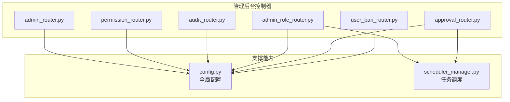
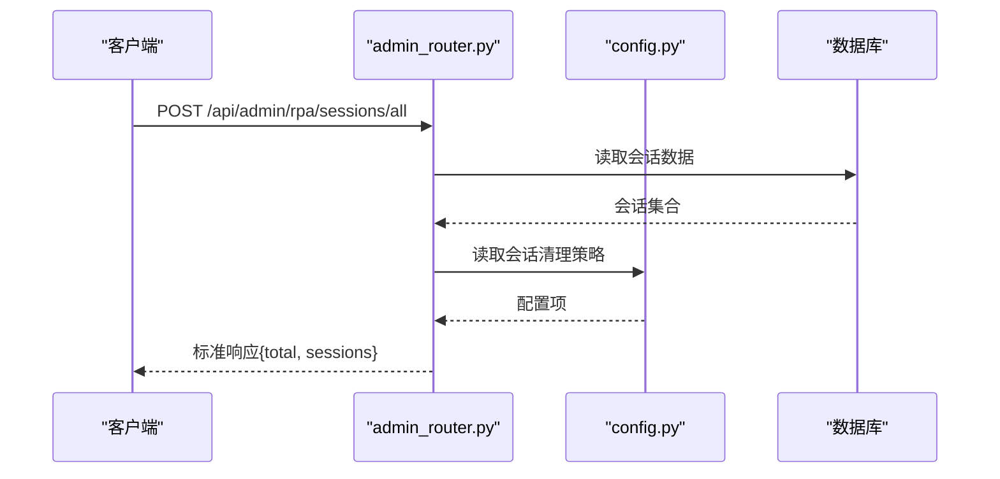
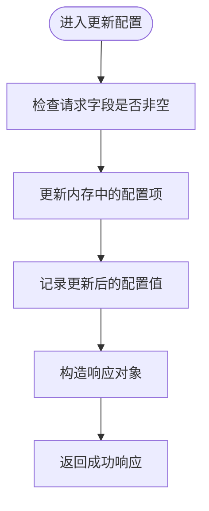
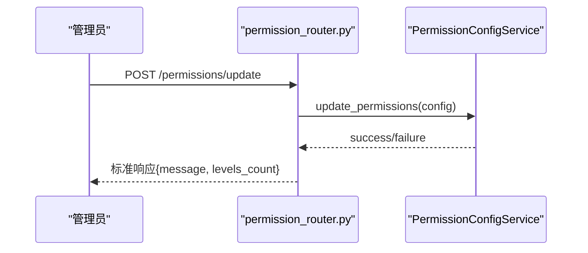
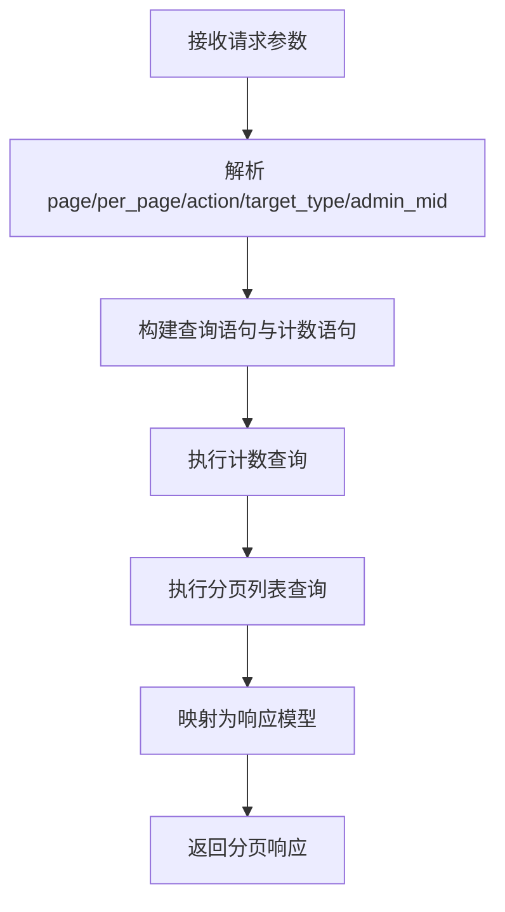
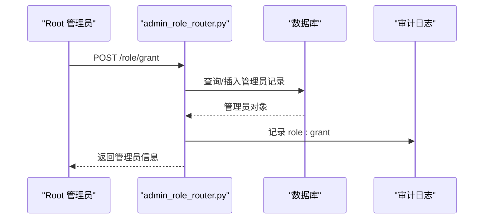
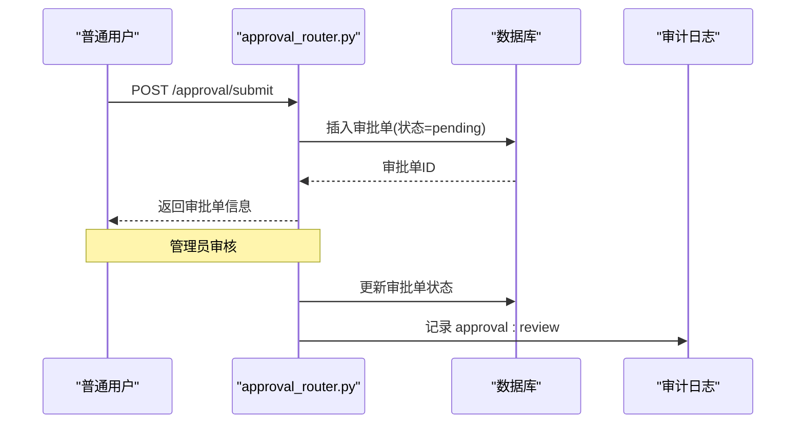
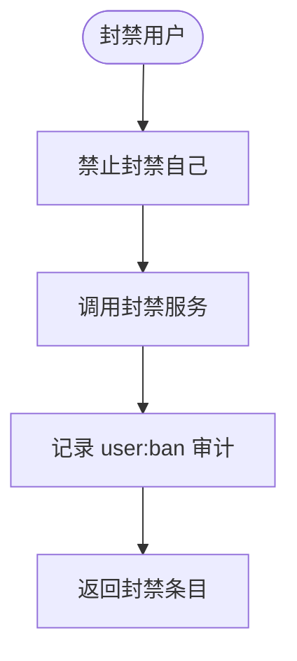
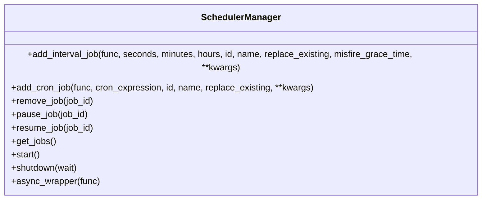
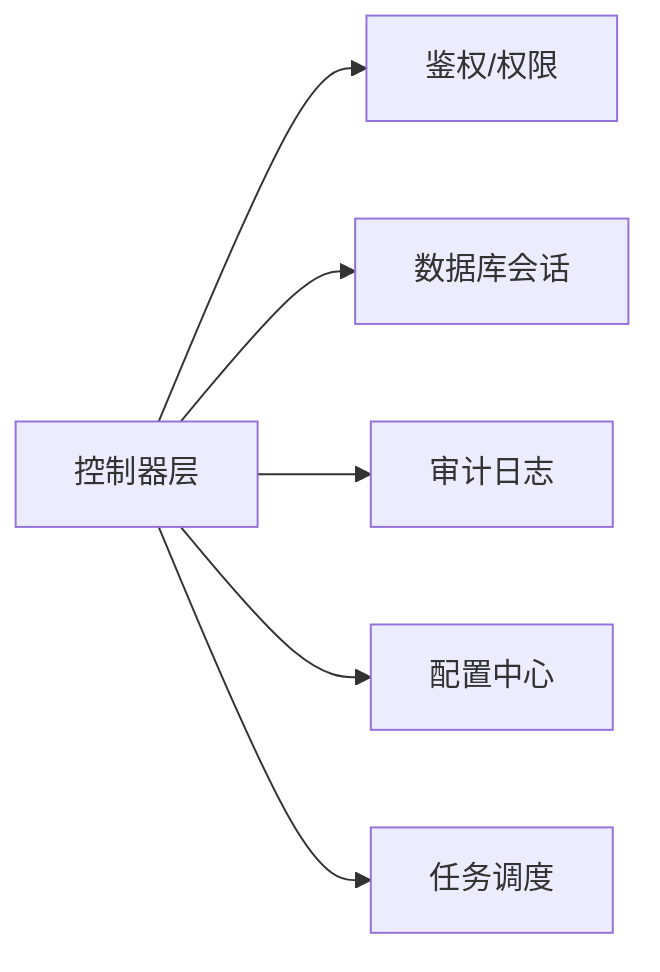

# 管理后台 API

<cite>
**本文引用的文件**
- [admin_router.py](file://RPA-Browser/app/controller/v1/admin/admin_router.py)
- [permission_router.py](file://RPA-Browser/app/controller/v1/admin/permission_router.py)
- [audit_router.py](file://RPA-Browser/app/controller/v1/admin/audit_router.py)
- [admin_role_router.py](file://RPA-Browser/app/controller/v1/admin/admin_role_router.py)
- [approval_router.py](file://RPA-Browser/app/controller/v1/admin/approval_router.py)
- [user_ban_router.py](file://RPA-Browser/app/controller/v1/admin/user_ban_router.py)
- [config.py](file://RPA-Browser/app/config.py)
- [scheduler_manager.py](file://RPA-Browser/app/scheduler_manager.py)
</cite>

## 目录
1. [简介](#简介)
2. [项目结构](#项目结构)
3. [核心组件](#核心组件)
4. [架构总览](#架构总览)
5. [详细组件分析](#详细组件分析)
6. [依赖关系分析](#依赖关系分析)
7. [性能与运维建议](#性能与运维建议)
8. [故障排查指南](#故障排查指南)
9. [结论](#结论)
10. [附录：接口清单与调用示例](#附录接口清单与调用示例)

## 简介
本文件面向 RPA 浏览器服务管理后台，聚焦系统管理、权限控制、审计日志等管理功能，提供管理员账户管理、角色权限分配、操作审计追踪、审批流、用户封禁管理等安全相关接口的使用方法；同时覆盖系统配置管理、任务调度、资源管理等运维能力。文档以“从概念到实现”的方式组织，便于不同技术背景的读者快速上手并深入理解。

## 项目结构
管理后台的控制器集中在 v1/admin 路由下，按职责拆分为多个子模块：
- 管理员会话与配置：admin_router.py
- 权限配置：permission_router.py
- 审计日志：audit_router.py
- 管理员角色管理：admin_role_router.py
- 审批流程：approval_router.py
- 用户封禁：user_ban_router.py
- 全局配置：config.py（含浏览器会话、迁移、工作流限制等）
- 任务调度：scheduler_manager.py（定时任务、间隔任务、Cron 表达式）

图表来源
- [admin_router.py:1-118](file://RPA-Browser/app/controller/v1/admin/admin_router.py#L1-L118)
- [permission_router.py:1-77](file://RPA-Browser/app/controller/v1/admin/permission_router.py#L1-L77)
- [audit_router.py:1-94](file://RPA-Browser/app/controller/v1/admin/audit_router.py#L1-L94)
- [admin_role_router.py:1-151](file://RPA-Browser/app/controller/v1/admin/admin_role_router.py#L1-L151)
- [approval_router.py:1-153](file://RPA-Browser/app/controller/v1/admin/approval_router.py#L1-L153)
- [user_ban_router.py:1-188](file://RPA-Browser/app/controller/v1/admin/user_ban_router.py#L1-L188)
- [config.py:140-215](file://RPA-Browser/app/config.py#L140-L215)
- [scheduler_manager.py:13-192](file://RPA-Browser/app/scheduler_manager.py#L13-L192)

章节来源
- [admin_router.py:1-118](file://RPA-Browser/app/controller/v1/admin/admin_router.py#L1-L118)
- [permission_router.py:1-77](file://RPA-Browser/app/controller/v1/admin/permission_router.py#L1-L77)
- [audit_router.py:1-94](file://RPA-Browser/app/controller/v1/admin/audit_router.py#L1-L94)
- [admin_role_router.py:1-151](file://RPA-Browser/app/controller/v1/admin/admin_role_router.py#L1-L151)
- [approval_router.py:1-153](file://RPA-Browser/app/controller/v1/admin/approval_router.py#L1-L153)
- [user_ban_router.py:1-188](file://RPA-Browser/app/controller/v1/admin/user_ban_router.py#L1-L188)
- [config.py:140-215](file://RPA-Browser/app/config.py#L140-L215)
- [scheduler_manager.py:13-192](file://RPA-Browser/app/scheduler_manager.py#L13-L192)

## 核心组件
- 管理员会话与配置：提供获取/更新浏览器会话配置、查看全量会话信息的能力，便于运维监控与调优。
- 权限配置：支持读取、更新、重置权限配置，用于动态调整系统访问策略。
- 审计日志：分页查询管理员操作审计记录，支持按动作、目标类型、管理员 ID 过滤。
- 管理员角色管理：root 专属授予/撤销管理员身份、列出管理员、查询当前用户角色状态。
- 审批流程：提交/查看/审核审批单，支持普通用户与管理员差异化可见性。
- 用户封禁：封禁/解封用户、查询封禁列表与状态，受细粒度权限控制。
- 任务调度：统一的定时任务管理器，支持间隔触发与 Cron 表达式，提供启停、暂停/恢复、查询能力。

章节来源
- [admin_router.py:19-118](file://RPA-Browser/app/controller/v1/admin/admin_router.py#L19-L118)
- [permission_router.py:14-77](file://RPA-Browser/app/controller/v1/admin/permission_router.py#L14-L77)
- [audit_router.py:19-94](file://RPA-Browser/app/controller/v1/admin/audit_router.py#L19-L94)
- [admin_role_router.py:27-151](file://RPA-Browser/app/controller/v1/admin/admin_role_router.py#L27-L151)
- [approval_router.py:31-153](file://RPA-Browser/app/controller/v1/admin/approval_router.py#L31-L153)
- [user_ban_router.py:57-188](file://RPA-Browser/app/controller/v1/admin/user_ban_router.py#L57-L188)
- [scheduler_manager.py:38-192](file://RPA-Browser/app/scheduler_manager.py#L38-L192)

## 架构总览
管理后台采用 FastAPI 路由模块化设计，各控制器通过依赖注入完成鉴权、数据库会话、权限校验等操作，统一返回标准响应体。配置集中管理，任务调度作为公共能力被多模块复用。

图表来源
- [admin_router.py:19-51](file://RPA-Browser/app/controller/v1/admin/admin_router.py#L19-L51)
- [config.py:190-194](file://RPA-Browser/app/config.py#L190-L194)

## 详细组件分析

### 管理员会话与配置（admin_router.py）
- 获取所有浏览器会话：返回会话总数与详细信息（如 mid、browser_id、创建时间、最后活跃、优先级、连接数、清理策略）。
- 获取浏览器会话配置：返回自动清理、最大闲置时间、清理间隔、过期时间等。
- 更新浏览器会话配置：仅内存生效，重启后恢复环境变量值；适合热调优。

图表来源
- [admin_router.py:76-118](file://RPA-Browser/app/controller/v1/admin/admin_router.py#L76-L118)

章节来源
- [admin_router.py:19-118](file://RPA-Browser/app/controller/v1/admin/admin_router.py#L19-L118)

### 权限配置（permission_router.py）
- 获取权限配置：返回当前权限层级与规则。
- 更新权限配置：提交新的权限配置，返回更新结果与层级数量。
- 重置权限配置：将权限配置恢复为默认值。

图表来源
- [permission_router.py:31-53](file://RPA-Browser/app/controller/v1/admin/permission_router.py#L31-L53)

章节来源
- [permission_router.py:14-77](file://RPA-Browser/app/controller/v1/admin/permission_router.py#L14-L77)

### 审计日志（audit_router.py）
- 获取操作审计列表：分页查询，支持按 action、target_type、admin_mid 过滤，返回标准化分页响应。

图表来源
- [audit_router.py:42-94](file://RPA-Browser/app/controller/v1/admin/audit_router.py#L42-L94)

章节来源
- [audit_router.py:19-94](file://RPA-Browser/app/controller/v1/admin/audit_router.py#L19-L94)

### 管理员角色管理（admin_role_router.py）
- 授予管理员：root 可授予或更新管理员权限，记录授予人与备注，写入审计日志。
- 撤销管理员：root 可撤销指定用户的管理员身份。
- 列出管理员：分页列出所有管理员。
- 查询当前角色：任意登录用户可查询自身角色状态，用于前端显隐控制。

图表来源
- [admin_role_router.py:27-71](file://RPA-Browser/app/controller/v1/admin/admin_role_router.py#L27-L71)

章节来源
- [admin_role_router.py:27-151](file://RPA-Browser/app/controller/v1/admin/admin_role_router.py#L27-L151)

### 审批流程（approval_router.py）
- 提交审批：任意登录用户可提交资源操作申请。
- 查看审批：管理员查看全部，普通用户仅查看自己提交的。
- 审核审批：管理员/root 对审批单进行批准或拒绝，记录审核人与备注。

图表来源
- [approval_router.py:31-57](file://RPA-Browser/app/controller/v1/admin/approval_router.py#L31-L57)
- [approval_router.py:106-135](file://RPA-Browser/app/controller/v1/admin/approval_router.py#L106-L135)

章节来源
- [approval_router.py:31-153](file://RPA-Browser/app/controller/v1/admin/approval_router.py#L31-L153)

### 用户封禁（user_ban_router.py）
- 封禁用户：支持永久/临时封禁，需 root 或 user:ban 权限。
- 解封用户：需 root 或 user:ban 权限。
- 查询封禁列表：分页查询，支持按 mid、status 过滤，需 root 或 user:ban / user:ban-view 权限。
- 查询封禁状态：返回指定用户当前封禁状态（临时封禁到期自动失效）。

图表来源
- [user_ban_router.py:57-88](file://RPA-Browser/app/controller/v1/admin/user_ban_router.py#L57-L88)

章节来源
- [user_ban_router.py:57-188](file://RPA-Browser/app/controller/v1/admin/user_ban_router.py#L57-L188)

### 任务调度（scheduler_manager.py）
- 添加间隔任务：支持 seconds/minutes/hours 维度。
- 添加 Cron 任务：支持标准 5 段 Cron 表达式。
- 任务管理：移除、暂停、恢复、查询任务。
- 装饰器：@interval_job 与 @cron_job 简化注册。

图表来源
- [scheduler_manager.py:13-192](file://RPA-Browser/app/scheduler_manager.py#L13-L192)

章节来源
- [scheduler_manager.py:38-192](file://RPA-Browser/app/scheduler_manager.py#L38-L192)

## 依赖关系分析
- 控制器层依赖：
  - 鉴权与权限：AuthInfo、require_admin、require_root、require_permission
  - 数据库会话：DatabaseSessionManager
  - 审计日志：log_admin_action
  - 配置：settings（来自 config.py）
- 配置中心：
  - 浏览器会话清理策略、页面数量限制、工作流嵌套深度、WebRTC 超时、Alembic 迁移开关等
- 任务调度：
  - 通过 SchedulerManager 统一管理后台任务，避免分散的定时器逻辑

图表来源
- [admin_role_router.py:1-23](file://RPA-Browser/app/controller/v1/admin/admin_role_router.py#L1-L23)
- [approval_router.py:1-27](file://RPA-Browser/app/controller/v1/admin/approval_router.py#L1-L27)
- [user_ban_router.py:1-35](file://RPA-Browser/app/controller/v1/admin/user_ban_router.py#L1-L35)
- [config.py:140-215](file://RPA-Browser/app/config.py#L140-L215)
- [scheduler_manager.py:13-192](file://RPA-Browser/app/scheduler_manager.py#L13-L192)

章节来源
- [admin_role_router.py:1-23](file://RPA-Browser/app/controller/v1/admin/admin_role_router.py#L1-L23)
- [approval_router.py:1-27](file://RPA-Browser/app/controller/v1/admin/approval_router.py#L1-L27)
- [user_ban_router.py:1-35](file://RPA-Browser/app/controller/v1/admin/user_ban_router.py#L1-L35)
- [config.py:140-215](file://RPA-Browser/app/config.py#L140-L215)
- [scheduler_manager.py:13-192](file://RPA-Browser/app/scheduler_manager.py#L13-L192)

## 性能与运维建议
- 浏览器会话清理：
  - 合理设置自动清理、最大闲置时间与清理间隔，避免资源泄漏与内存占用过高。
  - 如需持久化配置，请修改环境变量或配置文件，因为接口更新仅在内存中生效。
- 任务调度：
  - 使用 Cron 表达式时确保格式正确，避免无效任务导致启动失败。
  - 对耗时任务建议使用异步包装或队列机制，避免阻塞主事件循环。
- 审计日志：
  - 定期归档与清理历史审计记录，防止数据库膨胀影响查询性能。
- 权限配置：
  - 更新权限配置后进行回归测试，确保最小权限原则与业务需求一致。

[本节为通用指导，不直接分析具体文件]

## 故障排查指南
- 常见错误码：
  - 内部错误：当出现未捕获异常时返回内部错误，应结合日志定位问题。
  - 参数错误：非法参数或业务校验失败（如封禁自己）会返回参数错误。
  - 未找到：资源不存在（如撤销非管理员、审批单不存在）返回未找到。
  - 冲突：重复操作或状态不一致（如对已处理的审批单再次审核）返回冲突。
- 日志定位：
  - 关注控制器中的日志输出，尤其是关键操作的开始与结束、异常堆栈。
  - 审计日志可用于回溯管理员操作轨迹，辅助定位越权或误操作。
- 配置问题：
  - 若接口行为与预期不符，检查环境变量与运行时配置是否匹配。
  - 浏览器会话配置更新后需验证清理策略是否生效。

章节来源
- [admin_router.py:46-51](file://RPA-Browser/app/controller/v1/admin/admin_router.py#L46-L51)
- [permission_router.py:48-53](file://RPA-Browser/app/controller/v1/admin/permission_router.py#L48-L53)
- [audit_router.py:68-94](file://RPA-Browser/app/controller/v1/admin/audit_router.py#L68-L94)
- [admin_role_router.py:67-71](file://RPA-Browser/app/controller/v1/admin/admin_role_router.py#L67-L71)
- [approval_router.py:113-135](file://RPA-Browser/app/controller/v1/admin/approval_router.py#L113-L135)
- [user_ban_router.py:84-88](file://RPA-Browser/app/controller/v1/admin/user_ban_router.py#L84-L88)

## 结论
本管理后台围绕“安全可控、可观测、可运维”的目标，提供了完整的管理能力：管理员角色与权限、审计日志、审批流程、用户封禁、系统配置与任务调度。通过标准化的响应体与清晰的权限边界，既满足企业级治理需求，又便于扩展与维护。建议在生产环境启用严格的权限控制与审计策略，并结合任务调度与配置中心实现自动化运维。

[本节为总结性内容，不直接分析具体文件]

## 附录：接口清单与调用示例

### 管理员会话与配置
- 获取所有浏览器会话
  - 方法：POST
  - 路径：/api/admin/rpa/sessions/all
  - 说明：管理员查看全量浏览器会话信息
  - 参考：[admin_router.py:19-51](file://RPA-Browser/app/controller/v1/admin/admin_router.py#L19-L51)
- 获取浏览器会话配置
  - 方法：GET
  - 路径：/api/admin/rpa/config/browser-session
  - 说明：读取自动清理、闲置时间、清理间隔、过期时间
  - 参考：[admin_router.py:54-73](file://RPA-Browser/app/controller/v1/admin/admin_router.py#L54-L73)
- 更新浏览器会话配置
  - 方法：POST
  - 路径：/api/admin/rpa/config/browser-session
  - 说明：仅内存生效，重启后恢复环境变量值
  - 参考：[admin_router.py:76-118](file://RPA-Browser/app/controller/v1/admin/admin_router.py#L76-L118)

### 权限配置
- 获取权限配置
  - 方法：POST
  - 路径：/api/admin/rpa/permissions/get
  - 说明：读取当前权限层级与规则
  - 参考：[permission_router.py:14-28](file://RPA-Browser/app/controller/v1/admin/permission_router.py#L14-L28)
- 更新权限配置
  - 方法：POST
  - 路径：/api/admin/rpa/permissions/update
  - 说明：提交新配置，返回层级数量
  - 参考：[permission_router.py:31-53](file://RPA-Browser/app/controller/v1/admin/permission_router.py#L31-L53)
- 重置权限配置
  - 方法：POST
  - 路径：/api/admin/rpa/permissions/reset
  - 说明：恢复默认权限配置
  - 参考：[permission_router.py:56-77](file://RPA-Browser/app/controller/v1/admin/permission_router.py#L56-L77)

### 审计日志
- 获取操作审计列表
  - 方法：POST
  - 路径：/api/admin/rpa/audit/list
  - 说明：分页查询，支持 action、target_type、admin_mid 过滤
  - 参考：[audit_router.py:42-94](file://RPA-Browser/app/controller/v1/admin/audit_router.py#L42-L94)

### 管理员角色管理
- 授予管理员
  - 方法：POST
  - 路径：/api/admin/rpa/role/grant
  - 说明：仅 root 可操作，写入审计日志
  - 参考：[admin_role_router.py:27-71](file://RPA-Browser/app/controller/v1/admin/admin_role_router.py#L27-L71)
- 撤销管理员
  - 方法：POST
  - 路径：/api/admin/rpa/role/revoke
  - 说明：仅 root 可操作，写入审计日志
  - 参考：[admin_role_router.py:74-99](file://RPA-Browser/app/controller/v1/admin/admin_role_router.py#L74-L99)
- 列出管理员
  - 方法：POST
  - 路径：/api/admin/rpa/role/list
  - 说明：分页列出所有管理员
  - 参考：[admin_role_router.py:102-144](file://RPA-Browser/app/controller/v1/admin/admin_role_router.py#L102-L144)
- 查询当前角色
  - 方法：POST
  - 路径：/api/admin/rpa/role/me
  - 说明：任意登录用户可查询自身角色状态
  - 参考：[admin_role_router.py:147-151](file://RPA-Browser/app/controller/v1/admin/admin_role_router.py#L147-L151)

### 审批流程
- 提交审批
  - 方法：POST
  - 路径：/api/admin/rpa/approval/submit
  - 说明：任意登录用户可提交资源操作申请
  - 参考：[approval_router.py:31-57](file://RPA-Browser/app/controller/v1/admin/approval_router.py#L31-L57)
- 查看审批列表
  - 方法：POST
  - 路径：/api/admin/rpa/approval/list
  - 说明：管理员查看全部，普通用户仅看自己提交的
  - 参考：[approval_router.py:60-103](file://RPA-Browser/app/controller/v1/admin/approval_router.py#L60-L103)
- 审核审批
  - 方法：POST
  - 路径：/api/admin/rpa/approval/review
  - 说明：仅管理员/root，写入审计日志
  - 参考：[approval_router.py:106-135](file://RPA-Browser/app/controller/v1/admin/approval_router.py#L106-L135)

### 用户封禁
- 封禁用户
  - 方法：POST
  - 路径：/api/admin/rpa/ban/create
  - 说明：需 root 或 user:ban 权限，写入审计日志
  - 参考：[user_ban_router.py:57-88](file://RPA-Browser/app/controller/v1/admin/user_ban_router.py#L57-L88)
- 解封用户
  - 方法：POST
  - 路径：/api/admin/rpa/ban/lift
  - 说明：需 root 或 user:ban 权限，写入审计日志
  - 参考：[user_ban_router.py:91-109](file://RPA-Browser/app/controller/v1/admin/user_ban_router.py#L91-L109)
- 查询封禁列表
  - 方法：POST
  - 路径：/api/admin/rpa/ban/list
  - 说明：分页查询，需 root 或 user:ban / user:ban-view 权限
  - 参考：[user_ban_router.py:112-154](file://RPA-Browser/app/controller/v1/admin/user_ban_router.py#L112-L154)
- 查询封禁状态
  - 方法：POST
  - 路径：/api/admin/rpa/ban/status
  - 说明：返回指定用户当前封禁状态
  - 参考：[user_ban_router.py:157-184](file://RPA-Browser/app/controller/v1/admin/user_ban_router.py#L157-L184)

### 任务调度（运维工具）
- 添加间隔任务
  - 说明：通过 SchedulerManager.add_interval_job 注册周期性任务
  - 参考：[scheduler_manager.py:38-85](file://RPA-Browser/app/scheduler_manager.py#L38-L85)
- 添加 Cron 任务
  - 说明：通过 SchedulerManager.add_cron_job 注册 Cron 表达式任务
  - 参考：[scheduler_manager.py:87-125](file://RPA-Browser/app/scheduler_manager.py#L87-L125)
- 任务管理
  - 说明：移除、暂停、恢复、查询任务
  - 参考：[scheduler_manager.py:127-156](file://RPA-Browser/app/scheduler_manager.py#L127-L156)
- 启动与关闭
  - 说明：启动调度器与优雅关闭
  - 参考：[scheduler_manager.py:158-172](file://RPA-Browser/app/scheduler_manager.py#L158-L172)

章节来源
- [admin_router.py:19-118](file://RPA-Browser/app/controller/v1/admin/admin_router.py#L19-L118)
- [permission_router.py:14-77](file://RPA-Browser/app/controller/v1/admin/permission_router.py#L14-L77)
- [audit_router.py:42-94](file://RPA-Browser/app/controller/v1/admin/audit_router.py#L42-L94)
- [admin_role_router.py:27-151](file://RPA-Browser/app/controller/v1/admin/admin_role_router.py#L27-L151)
- [approval_router.py:31-153](file://RPA-Browser/app/controller/v1/admin/approval_router.py#L31-L153)
- [user_ban_router.py:57-188](file://RPA-Browser/app/controller/v1/admin/user_ban_router.py#L57-L188)
- [scheduler_manager.py:38-192](file://RPA-Browser/app/scheduler_manager.py#L38-L192)