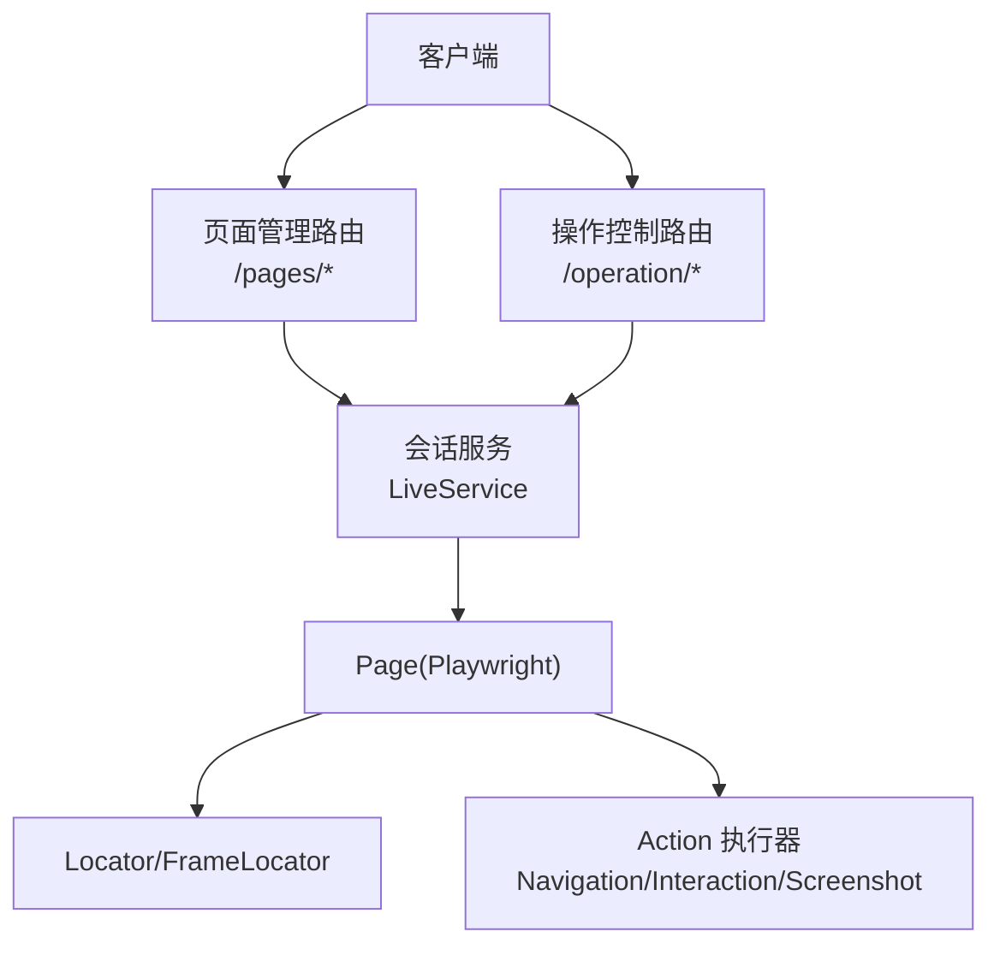
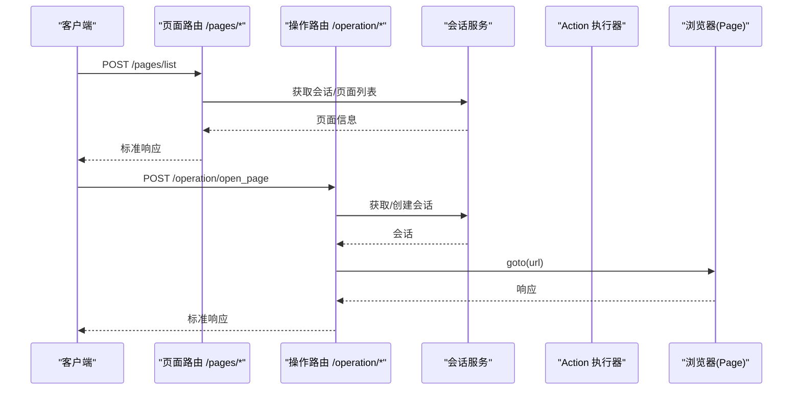
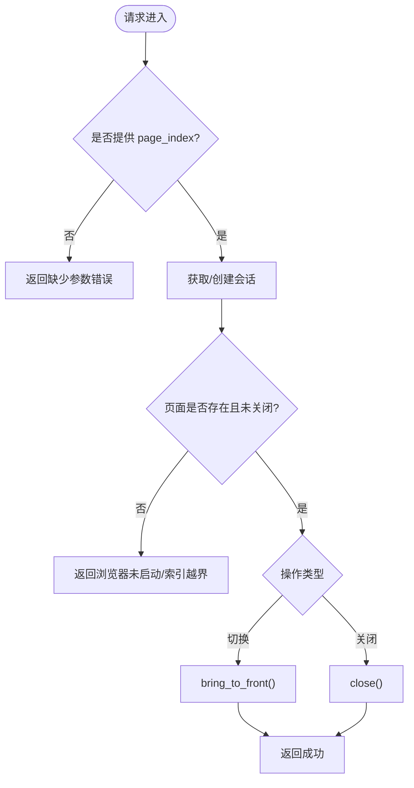
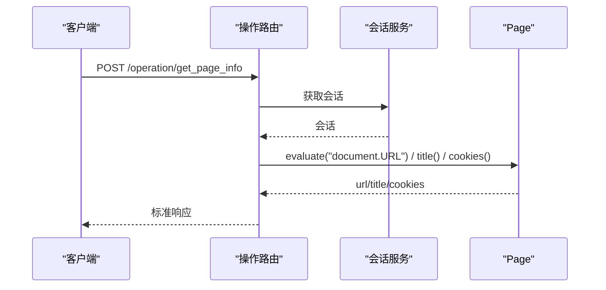
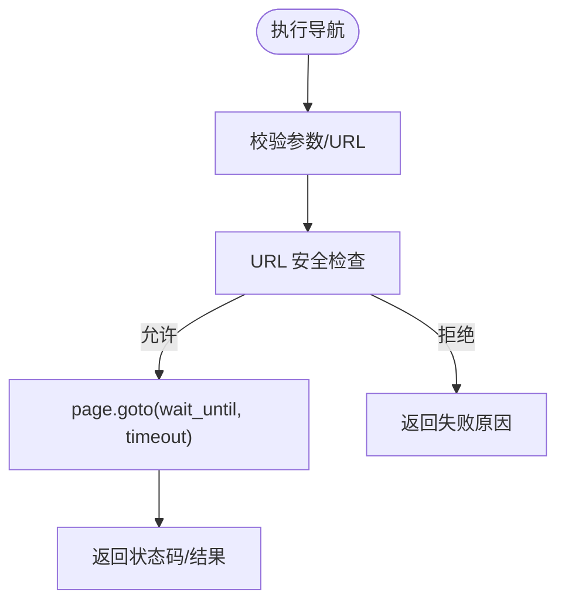
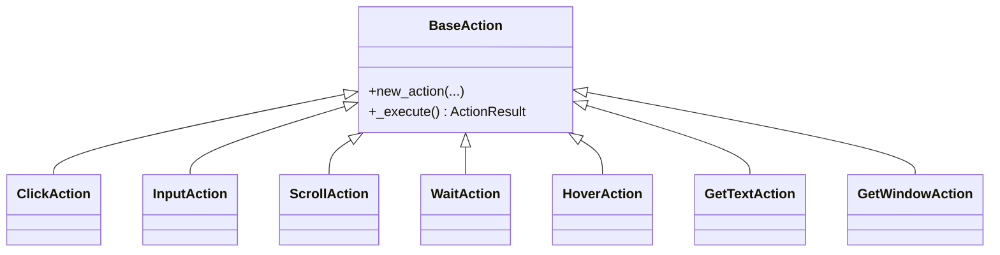
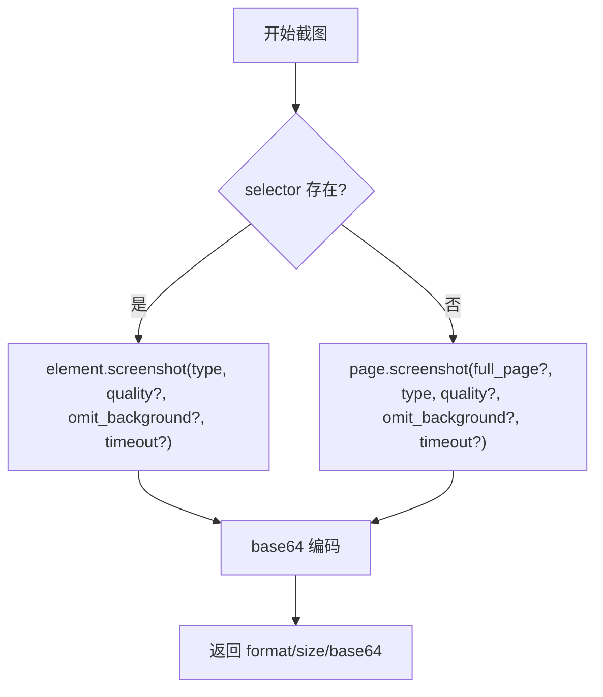
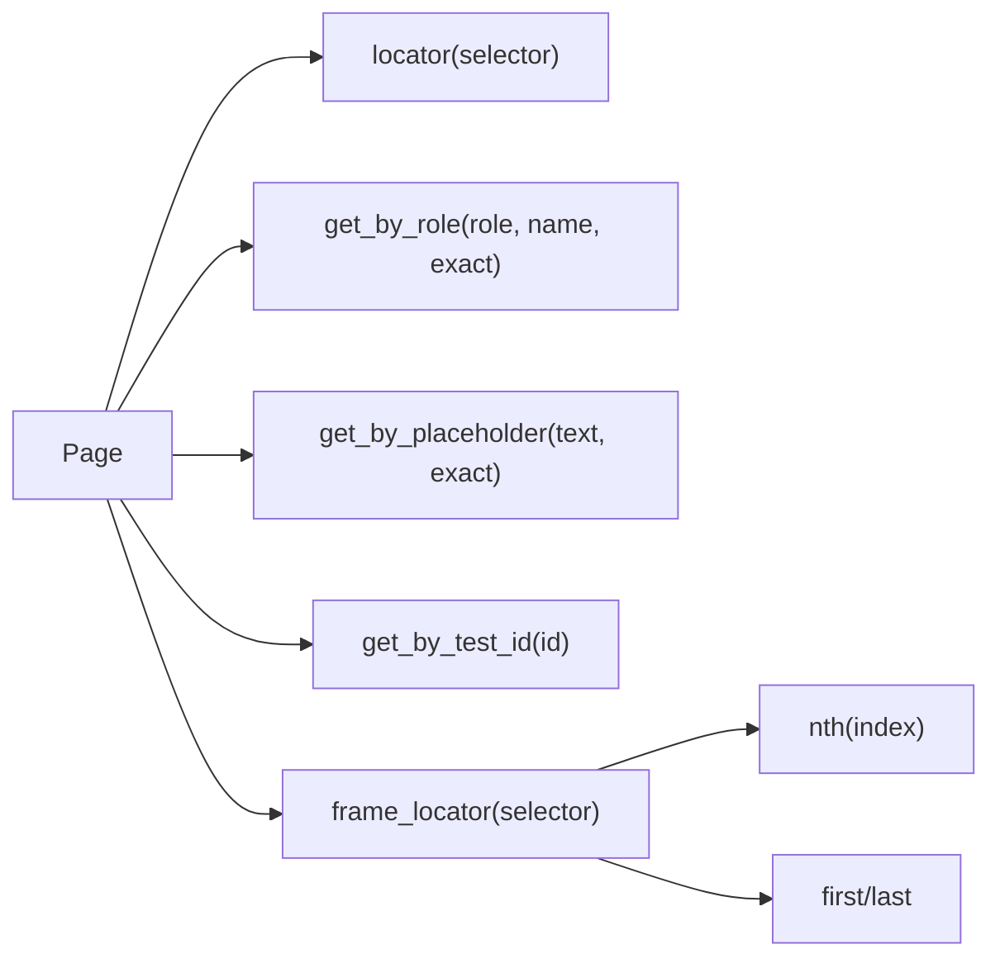
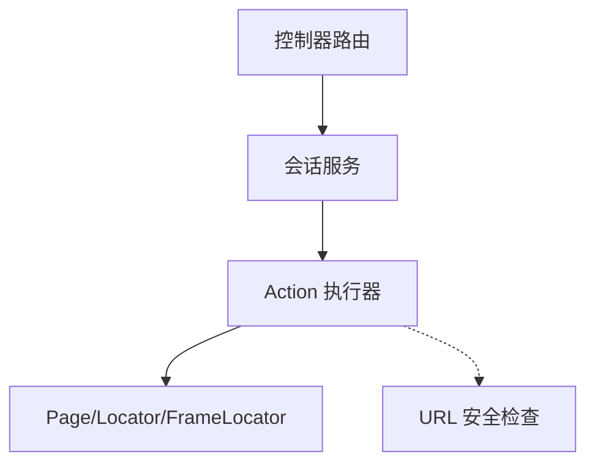

# 页面操作 API

<cite>
**本文引用的文件**
- [RPA-Browser/app/controller/v1/browser_control/pages/router.py](file://RPA-Browser/app/controller/v1/browser_control/pages/router.py)
- [RPA-Browser/app/controller/v1/browser_control/operation/router.py](file://RPA-Browser/app/controller/v1/browser_control/operation/router.py)
- [RPA-Browser/app/services/execution/actions/navigation.py](file://RPA-Browser/app/services/execution/actions/navigation.py)
- [RPA-Browser/app/services/execution/actions/interaction.py](file://RPA-Browser/app/services/execution/actions/interaction.py)
- [RPA-Browser/app/services/execution/actions/screenshot.py](file://RPA-Browser/app/services/execution/actions/screenshot.py)
- [RPA-Browser/botright/playwright_mock/page.py](file://RPA-Browser/botright/playwright_mock/page.py)
- [RPA-Browser/botright/playwright_mock/frame_locator.py](file://RPA-Browser/botright/playwright_mock/frame_locator.py)
- [RPA-Browser/test/actions/test_navigation.py](file://RPA-Browser/test/actions/test_navigation.py)
- [RPA-Browser/test/actions/test_screenshot.py](file://RPA-Browser/test/actions/test_screenshot.py)
</cite>

## 目录
1. [简介](#简介)
2. [项目结构](#项目结构)
3. [核心组件](#核心组件)
4. [架构总览](#架构总览)
5. [详细组件分析](#详细组件分析)
6. [依赖关系分析](#依赖关系分析)
7. [性能考虑](#性能考虑)
8. [故障排查指南](#故障排查指南)
9. [结论](#结论)
10. [附录：接口规范与示例](#附录：接口规范与示例)

## 简介
本文件面向“页面操作”相关 API，覆盖页面导航、元素定位、用户交互、截图与内容提取等能力。文档基于 RPA-Browser 后端实现，提供清晰的接口说明、调用流程、错误处理与最佳实践，帮助开发者快速集成并稳定运行自动化页面任务。

## 项目结构
RPA-Browser 将页面操作拆分为三层：
- 控制器层（Controller）：暴露 HTTP 路由，负责鉴权、参数校验与响应封装
- 执行层（Actions）：封装具体动作（导航、点击、输入、等待、截图等），统一返回 ActionResult
- 浏览器适配层（Playwright Mock）：对 Playwright 的 Page/Locator/FrameLocator 进行轻量封装，便于扩展与测试

图表来源
- [RPA-Browser/app/controller/v1/browser_control/pages/router.py:19-171](file://RPA-Browser/app/controller/v1/browser_control/pages/router.py#L19-L171)
- [RPA-Browser/app/controller/v1/browser_control/operation/router.py:65-247](file://RPA-Browser/app/controller/v1/browser_control/operation/router.py#L65-L247)
- [RPA-Browser/app/services/execution/actions/navigation.py:189-401](file://RPA-Browser/app/services/execution/actions/navigation.py#L189-L401)
- [RPA-Browser/app/services/execution/actions/interaction.py:18-597](file://RPA-Browser/app/services/execution/actions/interaction.py#L18-L597)
- [RPA-Browser/app/services/execution/actions/screenshot.py:15-101](file://RPA-Browser/app/services/execution/actions/screenshot.py#L15-L101)

章节来源
- [RPA-Browser/app/controller/v1/browser_control/pages/router.py:1-171](file://RPA-Browser/app/controller/v1/browser_control/pages/router.py#L1-L171)
- [RPA-Browser/app/controller/v1/browser_control/operation/router.py:1-247](file://RPA-Browser/app/controller/v1/browser_control/operation/router.py#L1-L247)

## 核心组件
- 页面管理路由：提供页面列表、切换、关闭等能力
- 操作控制路由：提供打开页面、关闭页面、切换页面、获取页面信息、浏览器信息等基础控制
- 导航 Action：Navigate/NewPage，含 URL 安全校验与等待策略
- 交互 Action：Click/Input/Scroll/Wait/Hover/GetText/GetWindow
- 截图 Action：支持页级/元素级截图，PNG/JPEG，透明背景等
- 选择器与定位：支持 CSS/XPath/Role/Placeholder/TestID 等多种定位方式

章节来源
- [RPA-Browser/app/controller/v1/browser_control/pages/router.py:19-171](file://RPA-Browser/app/controller/v1/browser_control/pages/router.py#L19-L171)
- [RPA-Browser/app/controller/v1/browser_control/operation/router.py:24-247](file://RPA-Browser/app/controller/v1/browser_control/operation/router.py#L24-L247)
- [RPA-Browser/app/services/execution/actions/navigation.py:20-401](file://RPA-Browser/app/services/execution/actions/navigation.py#L20-L401)
- [RPA-Browser/app/services/execution/actions/interaction.py:18-597](file://RPA-Browser/app/services/execution/actions/interaction.py#L18-L597)
- [RPA-Browser/app/services/execution/actions/screenshot.py:15-101](file://RPA-Browser/app/services/execution/actions/screenshot.py#L15-L101)
- [RPA-Browser/botright/playwright_mock/page.py:399-438](file://RPA-Browser/botright/playwright_mock/page.py#L399-L438)
- [RPA-Browser/botright/playwright_mock/frame_locator.py:34-89](file://RPA-Browser/botright/playwright_mock/frame_locator.py#L34-L89)

## 架构总览
页面操作的典型调用链：
- 客户端通过 /pages/* 或 /operation/* 发起请求
- 控制器完成鉴权与会话查找，必要时创建或复用浏览器会话
- 根据路由进入具体 Action 执行（导航、交互、截图等）
- Action 调用底层 Page/Locator/FrameLocator 完成真实操作
- 统一返回 StandardResponse，包含成功数据或错误码/消息

图表来源
- [RPA-Browser/app/controller/v1/browser_control/pages/router.py:19-57](file://RPA-Browser/app/controller/v1/browser_control/pages/router.py#L19-L57)
- [RPA-Browser/app/controller/v1/browser_control/operation/router.py:65-105](file://RPA-Browser/app/controller/v1/browser_control/operation/router.py#L65-L105)

## 详细组件分析

### 页面管理路由（/pages/*）
- 列出页面：返回当前浏览器实例的所有页面信息（URL、标题、是否激活等）
- 切换页面：将指定索引的页面置前；若使用 WebRTC 视频流需重新协商
- 关闭页面：关闭指定索引页面；若无页面则自动新建空白页

图表来源
- [RPA-Browser/app/controller/v1/browser_control/pages/router.py:60-171](file://RPA-Browser/app/controller/v1/browser_control/pages/router.py#L60-L171)

章节来源
- [RPA-Browser/app/controller/v1/browser_control/pages/router.py:19-171](file://RPA-Browser/app/controller/v1/browser_control/pages/router.py#L19-L171)

### 操作控制路由（/operation/*）
- 打开页面：在指定或新建页面中导航到 URL
- 关闭页面：关闭指定索引页面（至少保留一个）
- 切换页面：将指定索引页面置前
- 获取页面信息：返回 URL、标题、Cookie 数量等
- 获取浏览器信息：版本、UA、是否无头模式等

图表来源
- [RPA-Browser/app/controller/v1/browser_control/operation/router.py:172-201](file://RPA-Browser/app/controller/v1/browser_control/operation/router.py#L172-L201)

章节来源
- [RPA-Browser/app/controller/v1/browser_control/operation/router.py:24-247](file://RPA-Browser/app/controller/v1/browser_control/operation/router.py#L24-L247)

### 导航 Action（Navigate/NewPage）
- Navigate：校验 URL 格式与安全（协议白名单、禁止内网/回环/私有地址等），按 wait_until 与 timeout 导航
- NewPage：创建新页面，限制每上下文最大页面数，可带 URL 导航并激活页面

图表来源
- [RPA-Browser/app/services/execution/actions/navigation.py:20-187](file://RPA-Browser/app/services/execution/actions/navigation.py#L20-L187)
- [RPA-Browser/app/services/execution/actions/navigation.py:189-275](file://RPA-Browser/app/services/execution/actions/navigation.py#L189-L275)

章节来源
- [RPA-Browser/app/services/execution/actions/navigation.py:20-401](file://RPA-Browser/app/services/execution/actions/navigation.py#L20-L401)
- [RPA-Browser/test/actions/test_navigation.py:77-114](file://RPA-Browser/test/actions/test_navigation.py#L77-L114)

### 交互 Action（Click/Input/Scroll/Wait/Hover/GetText/GetWindow）
- Click：支持 selector 或坐标点击，支持双击、修饰键、延迟、强制点击、试验模式
- Input：支持 selector 填充或直接键盘输入
- Scroll：滚动至元素可见或回到顶部
- Wait：等待元素出现/消失/可用等，或固定时长等待
- Hover：悬停到元素或坐标
- GetText：获取元素文本集合并按分隔符拼接
- GetWindow：安全读取 window 对象属性（字符串化，避免函数调用）

图表来源
- [RPA-Browser/app/services/execution/actions/interaction.py:18-597](file://RPA-Browser/app/services/execution/actions/interaction.py#L18-L597)

章节来源
- [RPA-Browser/app/services/execution/actions/interaction.py:18-597](file://RPA-Browser/app/services/execution/actions/interaction.py#L18-L597)

### 截图 Action（Screenshot）
- 支持页级与元素级截图
- 支持 PNG/JPEG，JPEG 可设置质量，PNG 支持透明背景
- 返回 base64 编码的图片与格式、大小等信息

图表来源
- [RPA-Browser/app/services/execution/actions/screenshot.py:39-101](file://RPA-Browser/app/services/execution/actions/screenshot.py#L39-L101)

章节来源
- [RPA-Browser/app/services/execution/actions/screenshot.py:15-101](file://RPA-Browser/app/services/execution/actions/screenshot.py#L15-L101)
- [RPA-Browser/test/actions/test_screenshot.py:50-87](file://RPA-Browser/test/actions/test_screenshot.py#L50-L87)

### 元素选择器与定位
- 支持 CSS 选择器、XPath 表达式、角色选择器、占位符匹配、测试 ID 等
- FrameLocator 支持 nth/first/last 等组合定位，便于 iframe 场景

图表来源
- [RPA-Browser/botright/playwright_mock/page.py:399-438](file://RPA-Browser/botright/playwright_mock/page.py#L399-L438)
- [RPA-Browser/botright/playwright_mock/frame_locator.py:34-89](file://RPA-Browser/botright/playwright_mock/frame_locator.py#L34-L89)

章节来源
- [RPA-Browser/botright/playwright_mock/page.py:399-438](file://RPA-Browser/botright/playwright_mock/page.py#L399-L438)
- [RPA-Browser/botright/playwright_mock/frame_locator.py:34-89](file://RPA-Browser/botright/playwright_mock/frame_locator.py#L34-L89)

## 依赖关系分析
- 控制器依赖会话服务以获取/创建浏览器会话
- Action 依赖 Page/Locator/FrameLocator 完成具体操作
- 导航 Action 内置 URL 安全校验，防止访问内网/回环/私有地址等
- 截图 Action 依赖 Playwright 的 screenshot 能力，区分页级与元素级

图表来源
- [RPA-Browser/app/controller/v1/browser_control/pages/router.py:19-171](file://RPA-Browser/app/controller/v1/browser_control/pages/router.py#L19-L171)
- [RPA-Browser/app/controller/v1/browser_control/operation/router.py:65-247](file://RPA-Browser/app/controller/v1/browser_control/operation/router.py#L65-L247)
- [RPA-Browser/app/services/execution/actions/navigation.py:20-187](file://RPA-Browser/app/services/execution/actions/navigation.py#L20-L187)

章节来源
- [RPA-Browser/app/controller/v1/browser_control/pages/router.py:19-171](file://RPA-Browser/app/controller/v1/browser_control/pages/router.py#L19-L171)
- [RPA-Browser/app/controller/v1/browser_control/operation/router.py:65-247](file://RPA-Browser/app/controller/v1/browser_control/operation/router.py#L65-L247)
- [RPA-Browser/app/services/execution/actions/navigation.py:20-187](file://RPA-Browser/app/services/execution/actions/navigation.py#L20-L187)

## 性能考虑
- 导航时合理设置 wait_until 与 timeout，避免过长等待影响吞吐
- 新建页面受每上下文最大页面数限制，超出会主动回收旧页面
- 截图优先使用元素级截图减少渲染开销；全页截图仅在必要时使用
- 交互操作尽量使用精准选择器，减少重试与等待时间

## 故障排查指南
- 页面切换失败：检查 page_index 是否有效、浏览器是否已启动、是否处于关闭状态
- 导航失败：确认 URL 格式与安全策略（禁止内网/回环/私有地址）
- 交互失败：核对选择器有效性、元素是否可见/可交互、超时是否过短
- 截图失败：确认图片格式与参数兼容性（如 JPEG 需要 quality，PNG 才支持透明背景）

章节来源
- [RPA-Browser/app/controller/v1/browser_control/pages/router.py:83-117](file://RPA-Browser/app/controller/v1/browser_control/pages/router.py#L83-L117)
- [RPA-Browser/app/services/execution/actions/navigation.py:228-275](file://RPA-Browser/app/services/execution/actions/navigation.py#L228-L275)
- [RPA-Browser/app/services/execution/actions/interaction.py:43-124](file://RPA-Browser/app/services/execution/actions/interaction.py#L43-L124)
- [RPA-Browser/app/services/execution/actions/screenshot.py:57-101](file://RPA-Browser/app/services/execution/actions/screenshot.py#L57-L101)

## 结论
本套页面操作 API 提供了从页面管理、导航、交互到截图与内容提取的完整能力，并通过统一的 Action 模型与标准化响应简化集成。结合灵活的选择器与严格的安全策略，可在保证安全性的前提下高效完成复杂页面自动化任务。

## 附录：接口规范与示例

### 页面管理接口（/pages/*）
- POST /pages/list
  - 功能：获取浏览器所有页面列表
  - 认证：需要浏览器所有权验证
  - 返回：页面列表（包含 URL、标题、是否激活等）
- POST /pages/switch
  - 功能：切换到指定页面（page_index）
  - 注意：若使用 WebRTC 视频流，切换后需重新协商
- POST /pages/close
  - 功能：关闭指定页面（page_index）
  - 行为：若无页面则自动新建空白页

章节来源
- [RPA-Browser/app/controller/v1/browser_control/pages/router.py:19-171](file://RPA-Browser/app/controller/v1/browser_control/pages/router.py#L19-L171)

### 操作控制接口（/operation/*）
- POST /operation/open_page
  - 功能：打开或新建页面并导航到 URL
  - 参数：url、page_index（-1 表示新建）
- POST /operation/close_page
  - 功能：关闭指定页面（至少保留一个）
- POST /operation/switch_page
  - 功能：切换到指定页面
- POST /operation/get_page_info
  - 功能：获取页面信息（URL、标题、Cookie 数量）
- POST /browser/info
  - 功能：获取浏览器信息（版本、UA、是否无头等）

章节来源
- [RPA-Browser/app/controller/v1/browser_control/operation/router.py:24-247](file://RPA-Browser/app/controller/v1/browser_control/operation/router.py#L24-L247)

### 导航与交互（Action 层）
- 导航
  - Navigate：支持 wait_until、timeout、URL 安全校验
  - NewPage：创建新页面，可选 URL，自动激活
- 交互
  - Click：selector 或坐标，支持双击、修饰键、延迟、强制、试验模式
  - Input：selector 填充或键盘输入
  - Scroll：滚动至元素可见或回到顶部
  - Wait：等待元素状态或固定时长
  - Hover：悬停到元素或坐标
  - GetText：获取元素文本并拼接
  - GetWindow：安全读取 window 对象属性（字符串化）

章节来源
- [RPA-Browser/app/services/execution/actions/navigation.py:189-401](file://RPA-Browser/app/services/execution/actions/navigation.py#L189-L401)
- [RPA-Browser/app/services/execution/actions/interaction.py:18-597](file://RPA-Browser/app/services/execution/actions/interaction.py#L18-L597)

### 截图与内容提取
- 截图
  - 支持页级/元素级截图
  - 格式：PNG/JPEG；JPEG 支持 quality；PNG 支持透明背景
  - 返回：format、size、base64
- 内容提取
  - 通过 GetText 获取元素文本
  - 通过 GetWindow 安全读取 window 属性

章节来源
- [RPA-Browser/app/services/execution/actions/screenshot.py:15-101](file://RPA-Browser/app/services/execution/actions/screenshot.py#L15-L101)
- [RPA-Browser/app/services/execution/actions/interaction.py:438-597](file://RPA-Browser/app/services/execution/actions/interaction.py#L438-L597)
- [RPA-Browser/test/actions/test_screenshot.py:50-87](file://RPA-Browser/test/actions/test_screenshot.py#L50-L87)

### 选择器与高级场景
- 选择器
  - CSS/XPath：page.locator(selector)
  - 角色/占位符/测试 ID：get_by_role/get_by_placeholder/get_by_test_id
  - FrameLocator：nth/first/last 用于 iframe 场景
- 高级场景
  - 弹窗处理：可通过等待元素出现/消失或使用 role=dialog 的定位方式
  - iframe 切换：使用 frame_locator 进入子帧后再定位元素
  - 文件上传：通过 input[type=file] 的 locator 进行 fill 或配合系统对话框（视环境而定）

章节来源
- [RPA-Browser/botright/playwright_mock/page.py:399-438](file://RPA-Browser/botright/playwright_mock/page.py#L399-L438)
- [RPA-Browser/botright/playwright_mock/frame_locator.py:34-89](file://RPA-Browser/botright/playwright_mock/frame_locator.py#L34-L89)