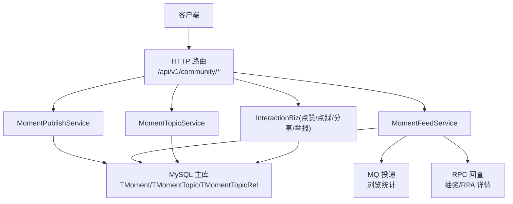
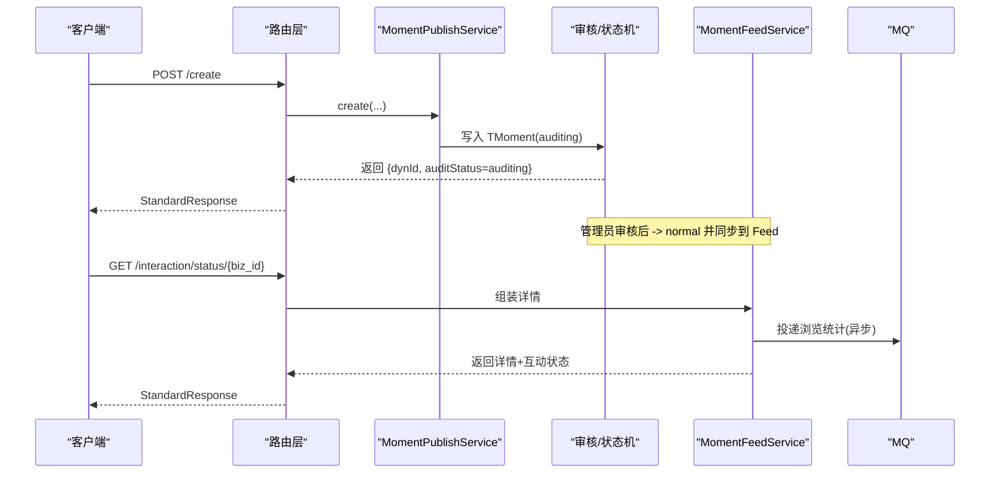
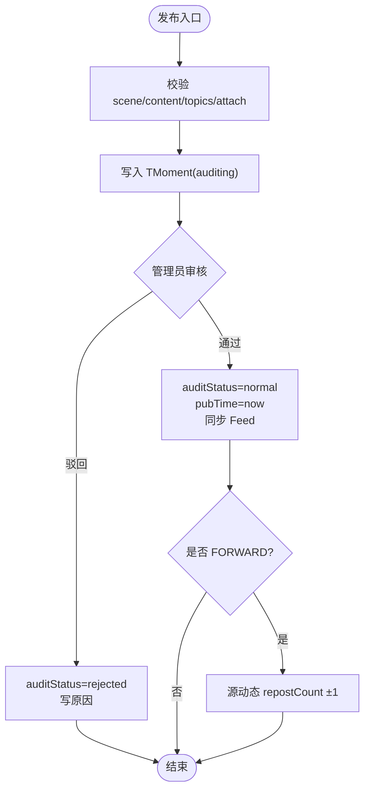
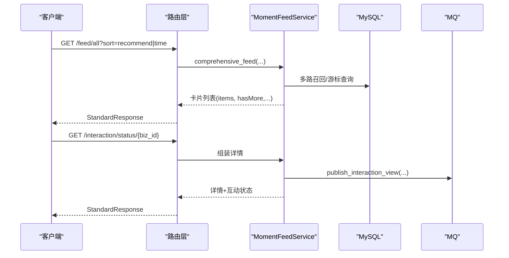
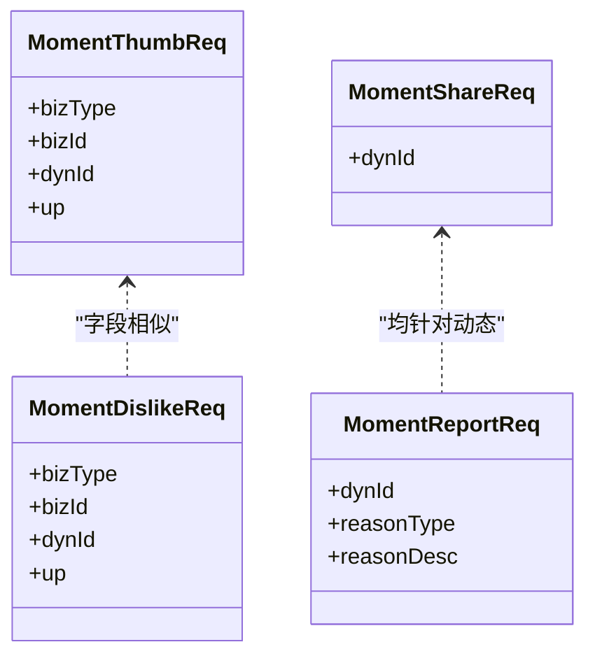
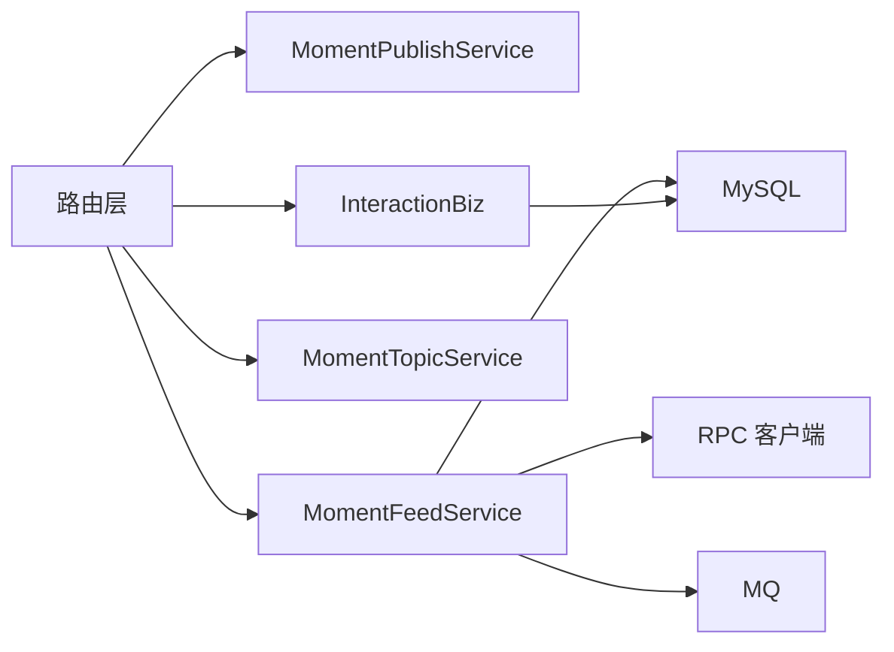

# 动态内容接口

<cite>
**本文引用的文件**
- [be-message-service/app/api/moment.py](file://be-message-service/app/api/moment.py)
- [be-message-service/app/services/moment/moment_feed.py](file://be-message-service/app/services/moment/moment_feed.py)
- [be-message-service/app/models/schemas/moment.py](file://be-message-service/app/models/schemas/moment.py)
- [be-message-service/app/models/db/moment_tbl.py](file://be-message-service/app/models/db/moment_tbl.py)
- [be-message-service/app/services/interaction_actions/dynamic/biz.py](file://be-message-service/app/services/interaction_actions/dynamic/biz.py)
- [be-bilibili-crawler/Service/GrpcModule/Grpc/GrpcProto/bilibili/dynamic/interfaces/feed/v1/api_pb2_grpc.py](file://be-bilibili-crawler/Service/GrpcModule/Grpc/GrpcProto/bilibili/dynamic/interfaces/feed/v1/api_pb2_grpc.py)
- [Vue3FrontEndDemoExercise/src/stores/moment.ts](file://Vue3FrontEndDemoExercise/src/stores/moment.ts)
</cite>

## 目录
1. [简介](#简介)
2. [项目结构](#项目结构)
3. [核心组件](#核心组件)
4. [架构总览](#架构总览)
5. [详细组件分析](#详细组件分析)
6. [依赖关系分析](#依赖关系分析)
7. [性能考量](#性能考量)
8. [故障排查指南](#故障排查指南)
9. [结论](#结论)
10. [附录：API 参考与调用示例](#附录api-参考与调用示例)

## 简介
本文件面向“动态内容”相关能力，覆盖动态发布、动态流获取、消息流处理、动态分类（话题）管理、内容审核流程等核心功能；同时记录动态数据模型、富文本支持、媒体文件处理特性，并提供调用示例与性能优化建议。系统采用 HTTP API 暴露业务入口，服务层负责领域逻辑，数据库以 MySQL 主库承载动态卡片及相关元数据，Feed 推荐引入 EdgeRank 算法，并通过 MQ 异步累计浏览等指标。

## 项目结构
- 路由层：FastAPI 路由集中定义社区（moment）接口，统一鉴权、参数校验与异常映射。
- 服务层：MomentPublishService、MomentFeedService、MomentTopicService 等按职责拆分。
- 数据模型：SQLModel ORM 定义动态主表、话题及关系、作者质量等。
- 交互与统计：点赞/点踩/分享/举报通过通用资源类分发，计数统一聚合。
- 外部集成：gRPC Proto 提供 B站动态接口契约；前端 store 缓存 Feed 与详情。

图表来源
- [be-message-service/app/api/moment.py:118-274](file://be-message-service/app/api/moment.py#L118-L274)
- [be-message-service/app/services/moment/moment_feed.py:775-800](file://be-message-service/app/services/moment/moment_feed.py#L775-L800)
- [be-message-service/app/models/db/moment_tbl.py:57-71](file://be-message-service/app/models/db/moment_tbl.py#L57-L71)

章节来源
- [be-message-service/app/api/moment.py:1-104](file://be-message-service/app/api/moment.py#L1-L104)
- [be-message-service/app/models/db/moment_tbl.py:1-16](file://be-message-service/app/models/db/moment_tbl.py#L1-L16)

## 核心组件
- 动态发布/编辑/删除/转发/置顶：POST /create, /edit, /remove, /repost, /space/top, /space/untop
- 互动：POST /thumb, /dislike, /share, /report；批量状态查询 GET /interaction/status, 单条详情 GET /interaction/status/{biz_id}
- 话题：GET /topic/square, /topic/hot-search, /topic/detail/{id}, /topic/feed/{id}；POST /topic/create；GET /topic/mine
- @与 POI：GET /at/list, /at/search, /poi/nearby, /poi/search
- 预校验：POST /create/check

章节来源
- [be-message-service/app/api/moment.py:118-274](file://be-message-service/app/api/moment.py#L118-L274)
- [be-message-service/app/api/moment.py:538-624](file://be-message-service/app/api/moment.py#L538-L624)
- [be-message-service/app/api/moment.py:630-800](file://be-message-service/app/api/moment.py#L630-L800)

## 架构总览
- 路由层统一封装请求上下文（IP/UA），调用服务层完成业务逻辑。
- 发布链路：创建/编辑后进入审核态，管理员审核通过后入 Feed；FORWARD 类型触发源动态 repostCount 变更。
- Feed 链路：综合页支持 recommend/time 两种排序；recommend 走多路召回 + EdgeRank 打分；time 使用游标分页。
- 详情链路：读取时投递浏览 MQ 异步累计，避免阻塞主链路。
- 话题链路：话题创建即审核，仅 normal 话题可被关联；话题 Feed 支持热门/最新排序。

图表来源
- [be-message-service/app/api/moment.py:118-135](file://be-message-service/app/api/moment.py#L118-L135)
- [be-message-service/app/services/interaction_actions/dynamic/biz.py:387-415](file://be-message-service/app/services/interaction_actions/dynamic/biz.py#L387-L415)
- [be-message-service/app/api/moment.py:567-604](file://be-message-service/app/api/moment.py#L567-L604)

## 详细组件分析

### 动态发布与编辑
- 发布场景：WORD/FORWARD；富文本节点支持 WORDS/AT/TOPIC/LINK/RESOURCE；附加卡 attach 只存 bizType+bizId，读取时 RPC 实时填充详情。
- 审核流程：新建为 auditing；管理员通过则 normal 并设置 pubTime；驳回写原因并通知作者。
- 转发联动：FORWARD 且源动态存在时，审核通过/驳回会相应增减源动态 repostCount。

图表来源
- [be-message-service/app/models/schemas/moment.py:101-117](file://be-message-service/app/models/schemas/moment.py#L101-L117)
- [be-message-service/app/services/interaction_actions/dynamic/biz.py:387-415](file://be-message-service/app/services/interaction_actions/dynamic/biz.py#L387-L415)
- [be-message-service/app/services/interaction_actions/dynamic/biz.py:431-465](file://be-message-service/app/services/interaction_actions/dynamic/biz.py#L431-L465)

章节来源
- [be-message-service/app/api/moment.py:118-155](file://be-message-service/app/api/moment.py#L118-L155)
- [be-message-service/app/models/schemas/moment.py:101-131](file://be-message-service/app/models/schemas/moment.py#L101-L131)
- [be-message-service/app/services/interaction_actions/dynamic/biz.py:387-465](file://be-message-service/app/services/interaction_actions/dynamic/biz.py#L387-L465)

### 动态流与详情
- 综合页 Feed：sort=recommend 走多路召回（热门/社交/话题/地理/协同过滤）+ EdgeRank 打分；sort=time 使用 historyOffset 游标分页。
- 个人空间 Feed：本人视角含 auditing/rejected（带状态标签），访客仅 normal；置顶优先。
- 详情：非作者且非 normal 返回空占位；详情访问触发浏览 MQ 异步累计。

图表来源
- [be-message-service/app/services/moment/moment_feed.py:775-800](file://be-message-service/app/services/moment/moment_feed.py#L775-L800)
- [be-message-service/app/api/moment.py:538-604](file://be-message-service/app/api/moment.py#L538-L604)

章节来源
- [be-message-service/app/services/moment/moment_feed.py:518-553](file://be-message-service/app/services/moment/moment_feed.py#L518-L553)
- [be-message-service/app/api/moment.py:538-604](file://be-message-service/app/api/moment.py#L538-L604)

### 互动管理（点赞/点踩/分享/举报）
- 点赞/点踩：幂等，返回当前用户态与计数；点踩当前仅支持动态资源。
- 分享：行为上报，非幂等，shareCount +1。
- 举报：记录举报信息，不改变 auditStatus。
- 批量状态：列表专用，不累计浏览；详情页专用，查询后投递浏览 MQ。

图表来源
- [be-message-service/app/models/schemas/moment.py:164-183](file://be-message-service/app/models/schemas/moment.py#L164-L183)
- [be-message-service/app/models/schemas/moment.py:222-242](file://be-message-service/app/models/schemas/moment.py#L222-L242)

章节来源
- [be-message-service/app/api/moment.py:280-380](file://be-message-service/app/api/moment.py#L280-L380)
- [be-message-service/app/api/moment.py:538-624](file://be-message-service/app/api/moment.py#L538-L624)

### 话题与分类管理
- 话题广场/热搜：仅展示 normal 话题。
- 话题详情：对齐 B 站 top_details 结构。
- 话题动态流：支持 hot/time 排序，复用综合页装配管线。
- 话题创建：创建即 auditing，需审核通过后方可关联。

章节来源
- [be-message-service/app/api/moment.py:630-743](file://be-message-service/app/api/moment.py#L630-L743)

### 数据模型与富文本
- 动态主表：包含 dynId、mid、dynType、contentText、contentJson、repostSrcDynId、topicId、bizType、bizRid 等。
- 话题关系：TMomentTopicRel 支持一条动态多话题（上限 5）。
- 富文本节点：WORDS/AT/TOPIC/LINK/RESOURCE；图片方案 MVP 仅外链 URL，不做下载存储。

章节来源
- [be-message-service/app/models/db/moment_tbl.py:57-71](file://be-message-service/app/models/db/moment_tbl.py#L57-L71)
- [be-message-service/app/models/db/moment_tbl.py:161-182](file://be-message-service/app/models/db/moment_tbl.py#L161-L182)
- [be-message-service/app/models/schemas/moment.py:30-52](file://be-message-service/app/models/schemas/moment.py#L30-L52)

### 消息流处理
- 浏览统计：详情页访问后投递 MQ，消费端去重累计（按 bizType+bizId+mid，跨天 +1）。
- 审核通知：驳回时向作者发送通知。

章节来源
- [be-message-service/app/api/moment.py:567-604](file://be-message-service/app/api/moment.py#L567-L604)
- [be-message-service/app/services/interaction_actions/dynamic/biz.py:431-465](file://be-message-service/app/services/interaction_actions/dynamic/biz.py#L431-L465)

## 依赖关系分析
- 路由依赖服务层：MomentPublishService、MomentFeedService、MomentTopicService。
- 服务层依赖数据库模型与枚举、评论系统实体、关注服务、RPC 客户端（抽奖/RPA）。
- gRPC Proto 提供 B站动态接口契约，供爬虫或上游服务参考。
- 前端 store 缓存 Feed 与详情，减少重复请求。

图表来源
- [be-message-service/app/api/moment.py:118-274](file://be-message-service/app/api/moment.py#L118-L274)
- [be-message-service/app/services/moment/moment_feed.py:775-800](file://be-message-service/app/services/moment/moment_feed.py#L775-L800)
- [be-bilibili-crawler/Service/GrpcModule/Grpc/GrpcProto/bilibili/dynamic/interfaces/feed/v1/api_pb2_grpc.py:64-68](file://be-bilibili-crawler/Service/GrpcModule/Grpc/GrpcProto/bilibili/dynamic/interfaces/feed/v1/api_pb2_grpc.py#L64-L68)

章节来源
- [be-message-service/app/api/moment.py:118-274](file://be-message-service/app/api/moment.py#L118-L274)
- [be-bilibili-crawler/Service/GrpcModule/Grpc/GrpcProto/bilibili/dynamic/interfaces/feed/v1/api_pb2_grpc.py:64-68](file://be-bilibili-crawler/Service/GrpcModule/Grpc/GrpcProto/bilibili/dynamic/interfaces/feed/v1/api_pb2_grpc.py#L64-L68)
- [Vue3FrontEndDemoExercise/src/stores/moment.ts:36-68](file://Vue3FrontEndDemoExercise/src/stores/moment.ts#L36-L68)

## 性能考量
- Feed 推荐：多路召回限制候选集大小，EdgeRank 应用层打分，避免热路径 COUNT 聚合。
- 批量装配：作者/话题/统计/评论主体批量 IN 查询，避免 N+1。
- 附件卡：只存 bizType+bizId，读取时批量 RPC 获取详情，弱依赖降级。
- 浏览统计：异步 MQ 投递，详情页不阻塞主链路。
- 前端缓存：store 缓存详情与 Feed 项，降低重复请求。

[本节为通用指导，无需特定文件引用]

## 故障排查指南
- 资源不存在：批量状态接口对缺失资源整体 400；详情页对缺失资源 400 且不投递浏览。
- 审核状态：非 normal 且非作者时详情返回空占位；作者本人可查看全部状态。
- 富文本节点：旧数据 RESOURCE 节点 bizType 可能为文字，装配层已兼容归一化。
- RPC 失败：抽奖/RPA 详情获取失败时降级保留原节点，不影响主流程。

章节来源
- [be-message-service/app/api/moment.py:382-415](file://be-message-service/app/api/moment.py#L382-L415)
- [be-message-service/app/api/moment.py:567-604](file://be-message-service/app/api/moment.py#L567-L604)
- [be-message-service/app/services/moment/moment_feed.py:167-185](file://be-message-service/app/services/moment/moment_feed.py#L167-L185)

## 结论
本接口体系围绕“动态”构建了完整的发布、流式检索、互动、话题管理与审核闭环。通过服务分层、批量装配、异步统计与 EdgeRank 推荐，兼顾了扩展性与性能。富文本与附加卡机制使内容表达更丰富，同时保持存储精简。建议在接入时遵循幂等与去重策略，合理利用缓存与分页游标，以获得稳定高效的体验。

[本节为总结性内容，无需特定文件引用]

## 附录：API 参考与调用示例

### 动态发布与编辑
- POST /api/v1/community/create
  - 请求体关键字段：scene、content（富文本节点数组）、attach（可选）、topics（可选）、option（可见范围等）
  - 响应：StandardResponse[MomentCreateResp]，包含 dynId、dynIdStr、auditStatus、dynType
- POST /api/v1/community/edit
  - 请求体关键字段：dynId、scene、content、attach、topics、option
  - 响应：StandardResponse[MomentEditResp]

章节来源
- [be-message-service/app/api/moment.py:118-155](file://be-message-service/app/api/moment.py#L118-L155)
- [be-message-service/app/models/schemas/moment.py:101-131](file://be-message-service/app/models/schemas/moment.py#L101-L131)

### 动态删除与转发
- POST /api/v1/community/remove
  - 请求体：dynId
  - 响应：StandardResponse[MomentRemoveResp]
- POST /api/v1/community/repost
  - 请求体：srcDynId、content（可选）
  - 响应：StandardResponse[MomentRepostResp]

章节来源
- [be-message-service/app/api/moment.py:158-228](file://be-message-service/app/api/moment.py#L158-L228)
- [be-message-service/app/models/schemas/moment.py:133-144](file://be-message-service/app/models/schemas/moment.py#L133-L144)

### 互动管理
- POST /api/v1/community/thumb
  - 请求体：bizType（默认 dynamic）、bizId/dynId、up
  - 响应：StandardResponse[MomentThumbResp]
- POST /api/v1/community/dislike
  - 请求体：bizType（当前仅 dynamic）、bizId/dynId、up
  - 响应：StandardResponse[MomentDislikeResp]
- POST /api/v1/community/share
  - 请求体：dynId
  - 响应：StandardResponse[MomentShareResp]
- POST /api/v1/community/report
  - 请求体：dynId、reasonType、reasonDesc（可选）
  - 响应：StandardResponse[MomentReportResp]

章节来源
- [be-message-service/app/api/moment.py:280-380](file://be-message-service/app/api/moment.py#L280-L380)
- [be-message-service/app/models/schemas/moment.py:164-242](file://be-message-service/app/models/schemas/moment.py#L164-L242)

### 互动状态查询
- GET /api/v1/community/interaction/status
  - 查询参数：bizType、bizIds（逗号分隔，限 50）
  - 响应：StandardResponse[InteractionStatusResp]
- GET /api/v1/community/interaction/status/{biz_id}
  - 查询参数：bizType
  - 响应：StandardResponse[InteractionStatusItem]

章节来源
- [be-message-service/app/api/moment.py:538-604](file://be-message-service/app/api/moment.py#L538-L604)

### 话题管理
- GET /api/v1/community/topic/square
  - 查询参数：page、page_size
  - 响应：StandardResponse[MomentTopicSquareResp]
- GET /api/v1/community/topic/hot-search
  - 查询参数：page、page_size
  - 响应：StandardResponse[MomentTopicSquareResp]
- GET /api/v1/community/topic/detail/{topicId}
  - 响应：StandardResponse[MomentTopicDetailResp]
- GET /api/v1/community/topic/feed/{topicId}
  - 查询参数：sort（hot/time）、history_offset、page、page_size
  - 响应：StandardResponse[MomentTopicFeedResp]
- POST /api/v1/community/topic/create
  - 请求体：topicName、topicCover（可选）、topicDesc（可选）
  - 响应：StandardResponse[MomentTopicCreateResp]
- GET /api/v1/community/topic/mine
  - 查询参数：page、page_size
  - 响应：StandardResponse[MomentTopicMineResp]

章节来源
- [be-message-service/app/api/moment.py:630-743](file://be-message-service/app/api/moment.py#L630-L743)
- [be-message-service/app/models/schemas/moment.py:384-529](file://be-message-service/app/models/schemas/moment.py#L384-L529)

### @与 POI
- GET /api/v1/community/at/list
  - 查询参数：page_size
  - 响应：StandardResponse[MomentAtListResp]
- GET /api/v1/community/at/search
  - 查询参数：keyword、page_size
  - 响应：StandardResponse[MomentAtSearchResp]
- GET /api/v1/community/poi/nearby
  - 查询参数：lat、lng、page、page_size
  - 响应：StandardResponse[MomentPoiResp]
- GET /api/v1/community/poi/search
  - 查询参数：keyword、page、page_size
  - 响应：StandardResponse[MomentPoiResp]

章节来源
- [be-message-service/app/api/moment.py:746-800](file://be-message-service/app/api/moment.py#L746-L800)
- [be-message-service/app/models/schemas/moment.py:454-490](file://be-message-service/app/models/schemas/moment.py#L454-L490)

### 预校验
- POST /api/v1/community/create/check
  - 请求体：scene
  - 响应：StandardResponse[MomentCreateCheckResp]

章节来源
- [be-message-service/app/api/moment.py:261-274](file://be-message-service/app/api/moment.py#L261-L274)
- [be-message-service/app/models/schemas/moment.py:152-156](file://be-message-service/app/models/schemas/moment.py#L152-L156)

### 前端调用示例（概念性）
- 获取 Feed 并缓存：
  - 调用 GET /api/v1/community/feed/all（或对应后端实现），将 items 存入 store 的 feedItems，并维护 hasMore/historyOffset。
- 缓存详情：
  - 调用 GET /api/v1/community/interaction/status/{biz_id}，将结果按 dynIdStr 缓存至 detailCache，便于详情页快速渲染。

章节来源
- [Vue3FrontEndDemoExercise/src/stores/moment.ts:36-68](file://Vue3FrontEndDemoExercise/src/stores/moment.ts#L36-L68)