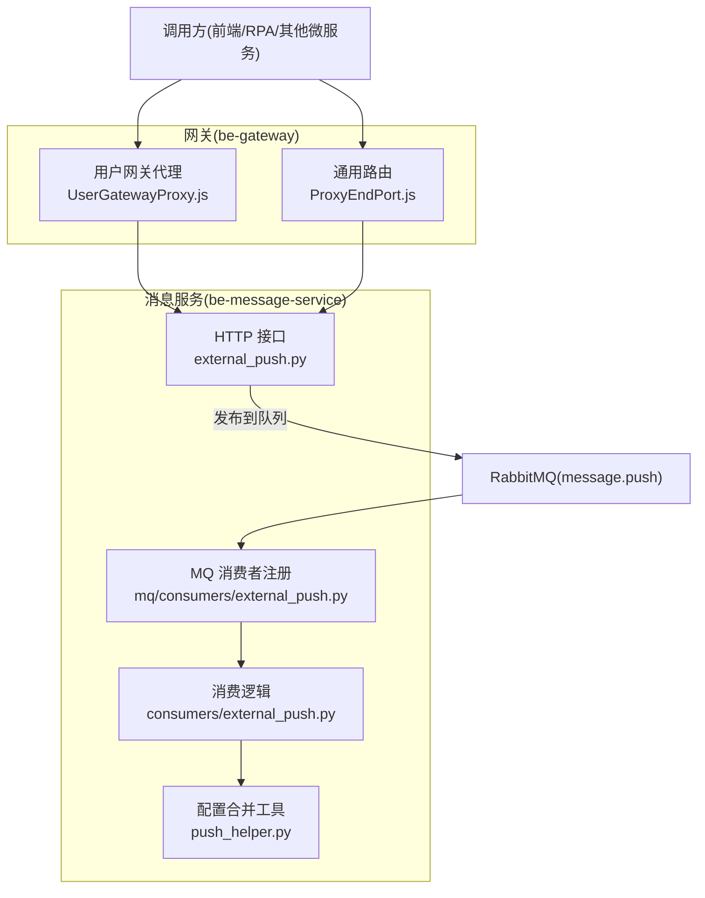
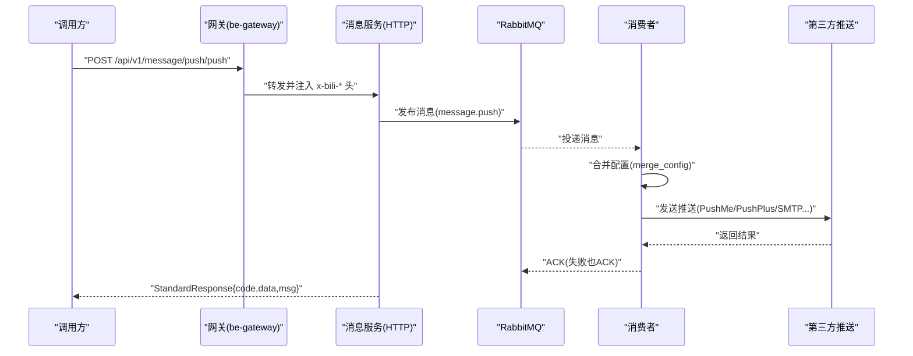
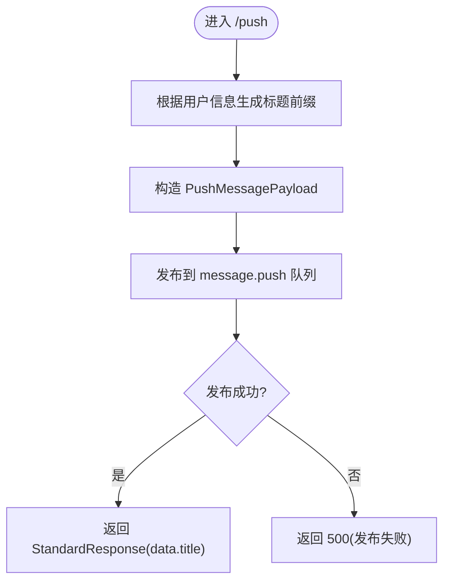
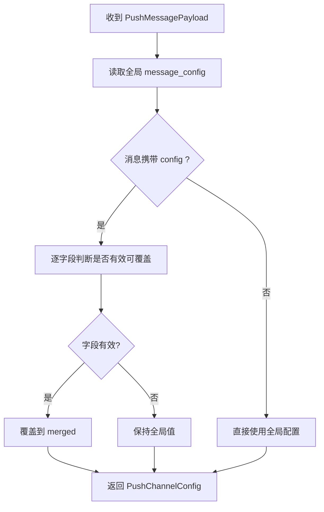
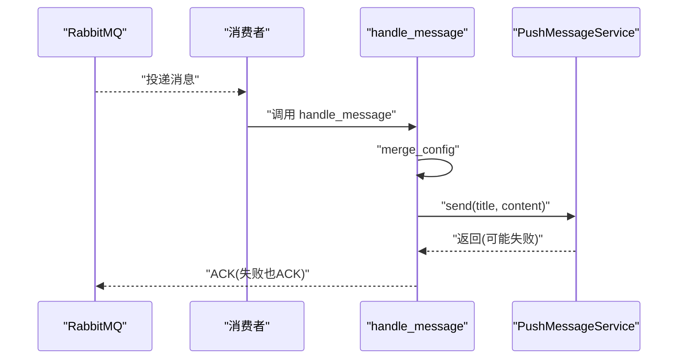
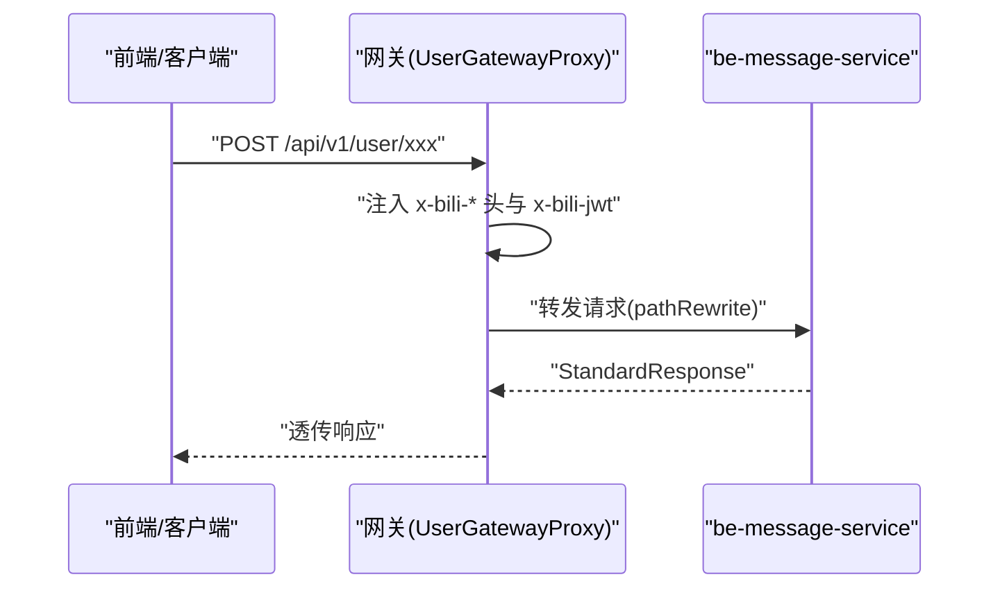
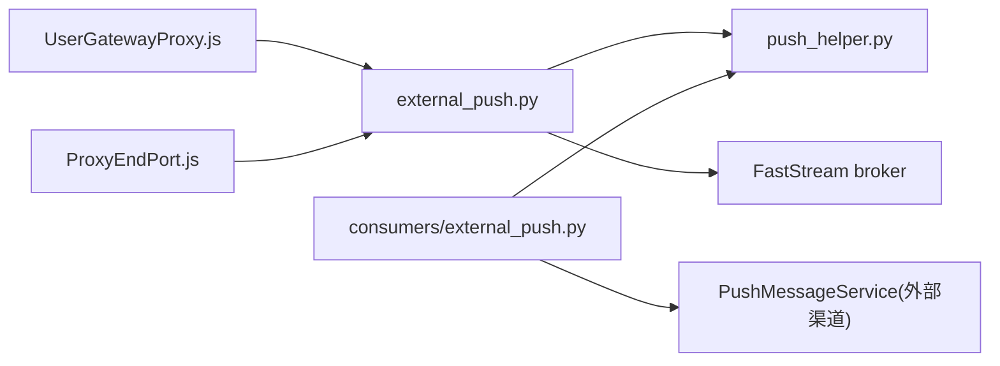

# 外部推送接口

<cite>
**本文引用的文件**
- [be-message-service/app/api/external_push.py](file://be-message-service/app/api/external_push.py)
- [be-message-service/app/consumers/external_push.py](file://be-message-service/app/consumers/external_push.py)
- [be-message-service/app/mq/consumers/external_push.py](file://be-message-service/app/mq/consumers/external_push.py)
- [be-message-service/app/services/message/external/push_helper.py](file://be-message-service/app/services/message/external/push_helper.py)
- [be-gateway/ExpressServerEnd/Controller/api/v1/user/UserGatewayProxy.js](file://be-gateway/ExpressServerEnd/Controller/api/v1/user/UserGatewayProxy.js)
- [be-gateway/ExpressServerEnd/Controller/ProxyEndPort.js](file://be-gateway/ExpressServerEnd/Controller/ProxyEndPort.js)
</cite>

## 目录
1. [简介](#简介)
2. [项目结构](#项目结构)
3. [核心组件](#核心组件)
4. [架构总览](#架构总览)
5. [详细组件分析](#详细组件分析)
6. [依赖关系分析](#依赖关系分析)
7. [性能与可靠性](#性能与可靠性)
8. [故障排查指南](#故障排查指南)
9. [结论](#结论)
10. [附录：API 参考与调用示例](#附录api-参考与调用示例)

## 简介
本文件面向“外部推送”和“用户网关代理”两大能力，提供端到端的接口文档与实现说明。内容涵盖：
- 第三方推送服务集成（PushMe、PushPlus、SMTP 等）
- 用户网关反向代理（统一将 /api/v1/user/* 转发至 be-message-service）
- 推送渠道配置合并策略、消息路由规则、失败重试机制
- 推送适配层、消息格式转换、状态回调处理
- 多渠道推送、网关代理、消息追踪的调用示例与排障建议

## 项目结构
围绕外部推送与网关代理的关键代码分布如下：
- be-message-service
  - HTTP 接口：app/api/external_push.py
  - MQ 消费者：app/consumers/external_push.py、app/mq/consumers/external_push.py
  - 推送辅助：app/services/message/external/push_helper.py
- be-gateway
  - 用户网关代理：ExpressServerEnd/Controller/api/v1/user/UserGatewayProxy.js
  - 通用网关路由：ExpressServerEnd/Controller/ProxyEndPort.js

图表来源
- [be-gateway/ExpressServerEnd/Controller/api/v1/user/UserGatewayProxy.js:1-64](file://be-gateway/ExpressServerEnd/Controller/api/v1/user/UserGatewayProxy.js#L1-L64)
- [be-gateway/ExpressServerEnd/Controller/ProxyEndPort.js:145-162](file://be-gateway/ExpressServerEnd/Controller/ProxyEndPort.js#L145-L162)
- [be-message-service/app/api/external_push.py:36-66](file://be-message-service/app/api/external_push.py#L36-L66)
- [be-message-service/app/mq/consumers/external_push.py:20-27](file://be-message-service/app/mq/consumers/external_push.py#L20-L27)
- [be-message-service/app/consumers/external_push.py:16-35](file://be-message-service/app/consumers/external_push.py#L16-L35)
- [be-message-service/app/services/message/external/push_helper.py:26-37](file://be-message-service/app/services/message/external/push_helper.py#L26-L37)

章节来源
- [be-message-service/app/api/external_push.py:1-162](file://be-message-service/app/api/external_push.py#L1-L162)
- [be-message-service/app/consumers/external_push.py:1-35](file://be-message-service/app/consumers/external_push.py#L1-L35)
- [be-message-service/app/mq/consumers/external_push.py:1-28](file://be-message-service/app/mq/consumers/external_push.py#L1-L28)
- [be-message-service/app/services/message/external/push_helper.py:1-52](file://be-message-service/app/services/message/external/push_helper.py#L1-L52)
- [be-gateway/ExpressServerEnd/Controller/api/v1/user/UserGatewayProxy.js:1-64](file://be-gateway/ExpressServerEnd/Controller/api/v1/user/UserGatewayProxy.js#L1-L64)
- [be-gateway/ExpressServerEnd/Controller/ProxyEndPort.js:1-165](file://be-gateway/ExpressServerEnd/Controller/ProxyEndPort.js#L1-L165)

## 核心组件
- 外部推送 HTTP 接口
  - POST /api/v1/message/push/push：投递一条推送到消息队列，由消费者异步分发到第三方渠道
  - POST /api/v1/message/push/test：立即发送测试推送（不经过队列），用于验证渠道配置
  - POST /api/v1/message/push/feedback：提交用户反馈，固定使用全局 message_config 推送到站长
- 推送配置合并
  - 以全局环境变量配置为基准，消息内 per-user 配置优先覆盖有效字段；模板占位符视为未设置，避免污染全局配置
- MQ 消费者
  - 订阅 message.push 队列，消费后构造 PushMessageService 并发送；失败不重投（ACK 丢弃）
- 用户网关代理
  - 将 /api/v1/user/* 原样转发到 be-message-service，注入可信 x-bili-* 头与原始 JWT（x-bili-jwt）
  - 通用 /api/v1 路由兜底转发，统一鉴权与用户信息注入

章节来源
- [be-message-service/app/api/external_push.py:36-162](file://be-message-service/app/api/external_push.py#L36-L162)
- [be-message-service/app/services/message/external/push_helper.py:12-37](file://be-message-service/app/services/message/external/push_helper.py#L12-L37)
- [be-message-service/app/consumers/external_push.py:16-35](file://be-message-service/app/consumers/external_push.py#L16-L35)
- [be-gateway/ExpressServerEnd/Controller/api/v1/user/UserGatewayProxy.js:1-64](file://be-gateway/ExpressServerEnd/Controller/api/v1/user/UserGatewayProxy.js#L1-L64)
- [be-gateway/ExpressServerEnd/Controller/ProxyEndPort.js:145-162](file://be-gateway/ExpressServerEnd/Controller/ProxyEndPort.js#L145-L162)

## 架构总览
外部推送采用“HTTP 入队 + 异步消费”的解耦模式：
- 调用方通过 be-gateway 或直连 be-message-service 调用推送接口
- be-message-service 将请求封装为消息并发布到 RabbitMQ（exchange=message_exchange, routing_key=message.push）
- 消费者按 channel 类型（PushMe/PushPlus/SMTP 等）执行发送，失败记录日志并丢弃，不阻塞主流程

图表来源
- [be-gateway/ExpressServerEnd/Controller/api/v1/user/UserGatewayProxy.js:28-62](file://be-gateway/ExpressServerEnd/Controller/api/v1/user/UserGatewayProxy.js#L28-L62)
- [be-message-service/app/api/external_push.py:36-66](file://be-message-service/app/api/external_push.py#L36-L66)
- [be-message-service/app/mq/consumers/external_push.py:20-27](file://be-message-service/app/mq/consumers/external_push.py#L20-L27)
- [be-message-service/app/consumers/external_push.py:16-35](file://be-message-service/app/consumers/external_push.py#L16-L35)

## 详细组件分析

### 外部推送 HTTP 接口
- 路由前缀：/api/v1/message/push
- 认证：微服务间互信，不做令牌校验；用户信息由网关注入的 x-bili-* 解析
- 主要端点
  - POST /push：投递推送消息到队列，返回包含标题的 data
  - POST /test：即时发送测试消息，便于验证渠道配置
  - POST /feedback：提交用户反馈，仅使用全局 message_config 发送到站长

图表来源
- [be-message-service/app/api/external_push.py:36-66](file://be-message-service/app/api/external_push.py#L36-L66)

章节来源
- [be-message-service/app/api/external_push.py:36-162](file://be-message-service/app/api/external_push.py#L36-L162)

### 推送配置合并与用户标签
- merge_config：以全局 message_config 为基准，消息内 config 优先覆盖有效字段；空值与模板占位符视为未设置
- format_user_label：根据用户 mid/name 生成标题前缀，便于区分推送来源

图表来源
- [be-message-service/app/services/message/external/push_helper.py:12-37](file://be-message-service/app/services/message/external/push_helper.py#L12-L37)

章节来源
- [be-message-service/app/services/message/external/push_helper.py:12-52](file://be-message-service/app/services/message/external/push_helper.py#L12-L52)

### MQ 消费者与失败处理
- 订阅 queue=message_queue，exchange=message_exchange，routing_key=message.push
- 消费策略：AckPolicy.ACK，失败也 ACK，消息直接丢弃，不重投
- 处理流程：合并配置 -> 构造 PushMessageService -> 发送 -> 异常捕获并记录错误日志

图表来源
- [be-message-service/app/mq/consumers/external_push.py:20-27](file://be-message-service/app/mq/consumers/external_push.py#L20-L27)
- [be-message-service/app/consumers/external_push.py:16-35](file://be-message-service/app/consumers/external_push.py#L16-L35)

章节来源
- [be-message-service/app/mq/consumers/external_push.py:1-28](file://be-message-service/app/mq/consumers/external_push.py#L1-L28)
- [be-message-service/app/consumers/external_push.py:1-35](file://be-message-service/app/consumers/external_push.py#L1-L35)

### 用户网关代理
- 路径：/api/v1/user/*
- 行为：原样转发到 be-message-service，pathRewrite 补回 /api/v1/user/
- 身份透传：注入 x-bili-* 可信头；额外透传原始 JWT（x-bili-jwt）供上游续期判断
- 通用兜底：/api/v1 路由最后匹配，统一注入用户信息并转发

图表来源
- [be-gateway/ExpressServerEnd/Controller/api/v1/user/UserGatewayProxy.js:28-62](file://be-gateway/ExpressServerEnd/Controller/api/v1/user/UserGatewayProxy.js#L28-L62)
- [be-gateway/ExpressServerEnd/Controller/ProxyEndPort.js:145-162](file://be-gateway/ExpressServerEnd/Controller/ProxyEndPort.js#L145-L162)

章节来源
- [be-gateway/ExpressServerEnd/Controller/api/v1/user/UserGatewayProxy.js:1-64](file://be-gateway/ExpressServerEnd/Controller/api/v1/user/UserGatewayProxy.js#L1-L64)
- [be-gateway/ExpressServerEnd/Controller/ProxyEndPort.js:1-165](file://be-gateway/ExpressServerEnd/Controller/ProxyEndPort.js#L1-L165)

## 依赖关系分析
- HTTP 接口依赖：
  - broker（FastStream）用于发布消息
  - CurrentUser 依赖解析用户信息
  - push_helper 进行配置合并与用户标签格式化
- 消费者依赖：
  - FastStream RabbitMQ 订阅器
  - push_helper 合并配置
  - PushMessageService 实际发送（内部按渠道降级与日志记录）
- 网关依赖：
  - http-proxy-middleware 进行反向代理
  - userInfoPreFetchMiddleware 预取用户信息
  - ProxyHelper 注入可信头与错误处理

图表来源
- [be-message-service/app/api/external_push.py:17-30](file://be-message-service/app/api/external_push.py#L17-L30)
- [be-message-service/app/consumers/external_push.py:8-13](file://be-message-service/app/consumers/external_push.py#L8-L13)
- [be-gateway/ExpressServerEnd/Controller/api/v1/user/UserGatewayProxy.js:13-26](file://be-gateway/ExpressServerEnd/Controller/api/v1/user/UserGatewayProxy.js#L13-L26)
- [be-gateway/ExpressServerEnd/Controller/ProxyEndPort.js:1-22](file://be-gateway/ExpressServerEnd/Controller/ProxyEndPort.js#L1-L22)

章节来源
- [be-message-service/app/api/external_push.py:17-30](file://be-message-service/app/api/external_push.py#L17-L30)
- [be-message-service/app/consumers/external_push.py:8-13](file://be-message-service/app/consumers/external_push.py#L8-L13)
- [be-gateway/ExpressServerEnd/Controller/api/v1/user/UserGatewayProxy.js:13-26](file://be-gateway/ExpressServerEnd/Controller/api/v1/user/UserGatewayProxy.js#L13-L26)
- [be-gateway/ExpressServerEnd/Controller/ProxyEndPort.js:1-22](file://be-gateway/ExpressServerEnd/Controller/ProxyEndPort.js#L1-L22)

## 性能与可靠性
- 异步解耦：HTTP 接口仅负责入队，发送在消费者中异步完成，降低请求延迟
- 失败不重投：消费者使用 AckPolicy.ACK，失败即丢弃，避免死循环与死信堆积
- 配置优先级：per-user 配置可覆盖全局配置，但模板占位符不会污染全局，保证稳定性
- 网关超时：默认 30s，RPA 相关路由延长至 180s，避免长耗时任务被中断

[本节为通用指导，无需特定文件引用]

## 故障排查指南
- 推送失败
  - 检查消费者日志中的“推送消费失败”记录，确认渠道配置是否正确
  - 使用 /api/v1/message/push/test 验证渠道连通性
- 无可用推送渠道
  - 若 test 返回“无可用推送渠道”，请检查 MESSAGE_CONFIG 或传入的 per-user config
- 消息未送达
  - 确认消息已发布到 message.push 队列，且消费者正常启动并订阅
  - 注意消费者失败会 ACK 丢弃，需在上游侧做必要重试或告警
- 网关转发问题
  - 检查 x-bili-* 头是否被正确注入，JWT 是否透传（x-bili-jwt）
  - 核对 pathRewrite 是否正确补回 /api/v1/user/ 或 /api/v1/

章节来源
- [be-message-service/app/consumers/external_push.py:28-35](file://be-message-service/app/consumers/external_push.py#L28-L35)
- [be-message-service/app/api/external_push.py:69-110](file://be-message-service/app/api/external_push.py#L69-L110)
- [be-gateway/ExpressServerEnd/Controller/api/v1/user/UserGatewayProxy.js:38-57](file://be-gateway/ExpressServerEnd/Controller/api/v1/user/UserGatewayProxy.js#L38-L57)

## 结论
外部推送模块通过“HTTP 入队 + 异步消费”的方式，实现了多渠道推送的统一接入与可靠交付；配合用户网关代理，实现了跨服务的身份透传与统一鉴权。配置合并策略保障了灵活性与安全性，失败不重投策略避免了队列污染。建议在业务侧结合测试接口与日志进行持续监控与排障。

[本节为总结性内容，无需特定文件引用]

## 附录：API 参考与调用示例

### 接口定义
- POST /api/v1/message/push/push
  - 功能：投递推送消息到队列
  - 请求体：PushMessage（title、content、push_type、config）
  - 响应：StandardResponse{code, data, msg}，data 包含 title
- POST /api/v1/message/push/test
  - 功能：立即发送测试推送
  - 请求体：TestPushRequest（title、content、push_type、config）
  - 响应：StandardResponse{code, data, msg}，data 包含 TestPushResponse(success, message)
- POST /api/v1/message/push/feedback
  - 功能：提交用户反馈（仅使用全局 message_config）
  - 请求体：FeedbackRequest（content、source、contact）
  - 响应：StandardResponse{code, data, msg}，data 包含 TestPushResponse(success, message)

章节来源
- [be-message-service/app/api/external_push.py:36-162](file://be-message-service/app/api/external_push.py#L36-L162)

### 调用示例（概念性）
- 推送消息
  - 方法：POST
  - 路径：/api/v1/message/push/push
  - 请求体示例：
    - {
        "title": "活动提醒",
        "content": "您有一项新任务待处理",
        "push_type": "text",
        "config": {
          "pushme_key": "<PUSHME_KEY>",
          "pushplus_token": "<PUSHPLUS_TOKEN>"
        }
      }
  - 说明：config 可为空，为空时回落全局 message_config；模板占位符不会被覆盖
- 测试推送
  - 方法：POST
  - 路径：/api/v1/message/push/test
  - 请求体示例：同 PushMessage
  - 用途：快速验证渠道配置是否生效
- 用户反馈
  - 方法：POST
  - 路径：/api/v1/message/push/feedback
  - 请求体示例：
    - {
        "content": "页面加载缓慢",
        "source": "首页",
        "contact": "user@example.com"
      }
  - 说明：固定使用全局 message_config，确保反馈到达站长

[本节为概念性示例，无需特定文件引用]

### 网关代理调用示例（概念性）
- 通过网关访问 be-message 的用户域接口
  - 方法：任意
  - 路径：/api/v1/user/{any_path}
  - 说明：网关自动注入 x-bili-* 头与 x-bili-jwt，并转发到 be-message-service
- 通用 /api/v1 路由
  - 方法：任意
  - 路径：/api/v1/{any_path}
  - 说明：兜底转发，统一鉴权与用户信息注入

章节来源
- [be-gateway/ExpressServerEnd/Controller/api/v1/user/UserGatewayProxy.js:28-62](file://be-gateway/ExpressServerEnd/Controller/api/v1/user/UserGatewayProxy.js#L28-L62)
- [be-gateway/ExpressServerEnd/Controller/ProxyEndPort.js:145-162](file://be-gateway/ExpressServerEnd/Controller/ProxyEndPort.js#L145-L162)