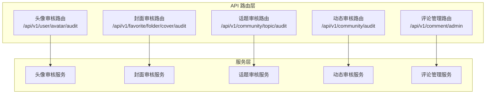
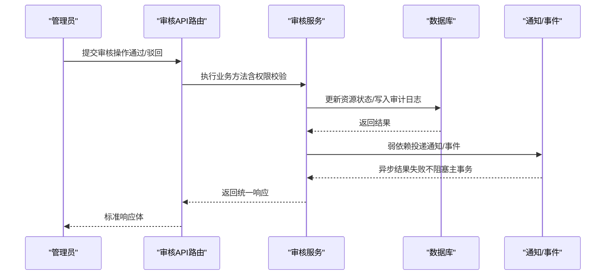
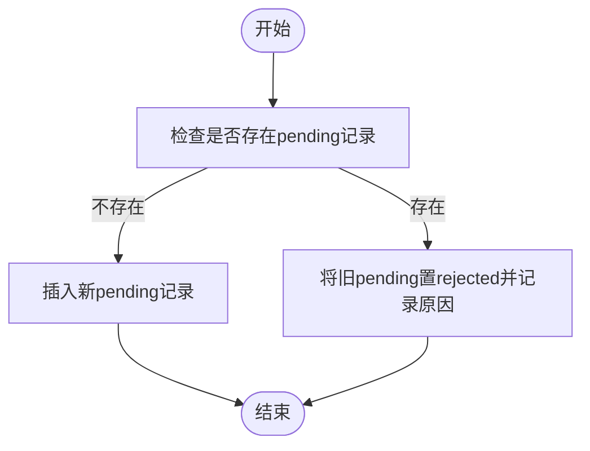
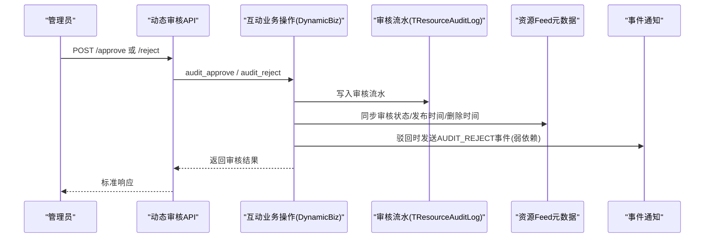
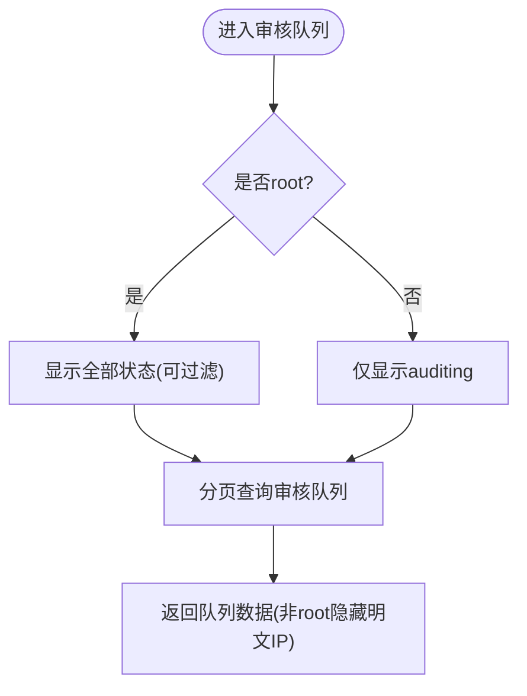
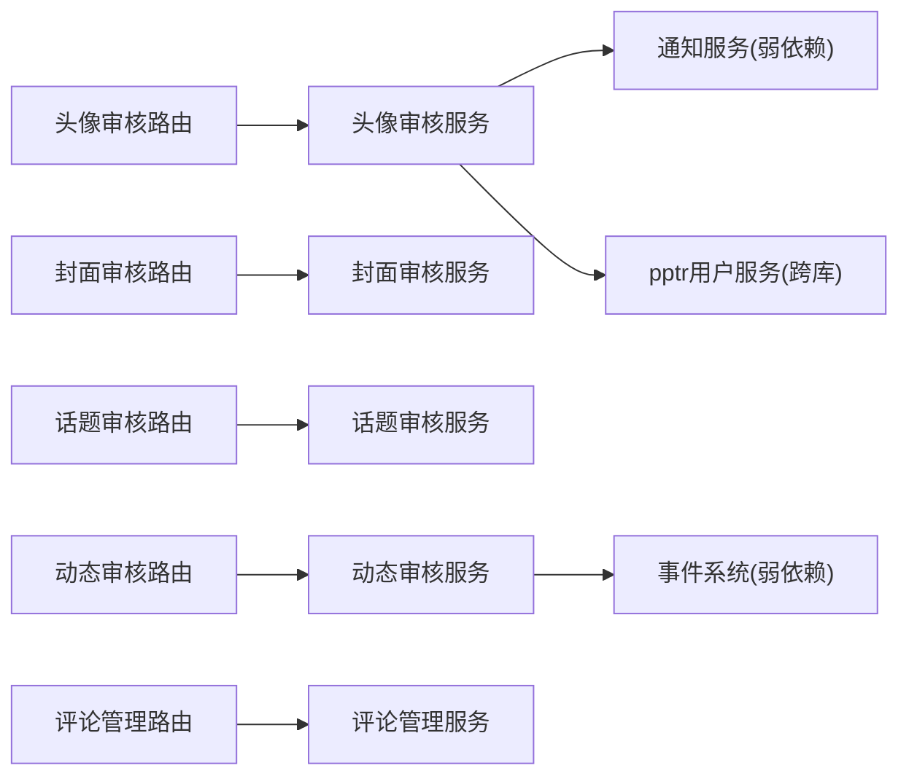

# 审核管理接口

<cite>
**本文引用的文件**
- [avatar_audit.py](file://be-message-service/app/api/avatar_audit.py)
- [folder_cover_audit.py](file://be-message-service/app/api/folder_cover_audit.py)
- [moment_topic_audit.py](file://be-message-service/app/api/moment_topic_audit.py)
- [moment_audit.py](file://be-message-service/app/api/moment_audit.py)
- [comment_admin.py](file://be-message-service/app/api/comment_admin.py)
- [avatar_audit_service.py](file://be-message-service/app/services/user/avatar_audit.py)
- [moment_audit_service.py](file://be-message-service/app/services/moment/moment_audit.py)
- [audit_source_schema.py](file://be-message-service/app/models/schemas/audit.py)
- [audit_source_utils.py](file://be-message-service/app/utils/audit_source.py)
</cite>

## 目录
1. [简介](#简介)
2. [项目结构](#项目结构)
3. [核心组件](#核心组件)
4. [架构总览](#架构总览)
5. [详细组件分析](#详细组件分析)
6. [依赖关系分析](#依赖关系分析)
7. [性能与可扩展性](#性能与可扩展性)
8. [故障排查指南](#故障排查指南)
9. [结论](#结论)
10. [附录：调用示例与管理最佳实践](#附录调用示例与管理最佳实践)

## 简介
本文件面向内容审核管理相关 API，覆盖头像审核、收藏夹封面审核、话题审核、动态审核与评论管理等能力。文档说明各接口的职责、权限、请求参数、响应结构、状态流转与通知机制，并提供审核工作流、批量操作、违规检测与内容过滤的集成建议与管理最佳实践。

## 项目结构
审核管理功能集中在 be-message-service 模块中，采用 FastAPI 路由 + 服务层（Service）+ 数据模型（Schema/DB）的分层设计：
- 路由层：定义 HTTP 端点、鉴权守卫（RootUser/MsgAdminUser）、参数校验与统一响应封装。
- 服务层：实现业务逻辑（队列查询、状态变更、统计、流水记录、通知投递等）。
- 模型层：Pydantic Schema 描述请求/响应；数据库表模型用于持久化。

**图表来源**
- [avatar_audit.py:1-100](file://be-message-service/app/api/avatar_audit.py#L1-L100)
- [folder_cover_audit.py:1-115](file://be-message-service/app/api/folder_cover_audit.py#L1-L115)
- [moment_topic_audit.py:1-83](file://be-message-service/app/api/moment_topic_audit.py#L1-L83)
- [moment_audit.py:1-157](file://be-message-service/app/api/moment_audit.py#L1-L157)
- [comment_admin.py:1-236](file://be-message-service/app/api/comment_admin.py#L1-L236)

**章节来源**
- [avatar_audit.py:1-100](file://be-message-service/app/api/avatar_audit.py#L1-L100)
- [folder_cover_audit.py:1-115](file://be-message-service/app/api/folder_cover_audit.py#L1-L115)
- [moment_topic_audit.py:1-83](file://be-message-service/app/api/moment_topic_audit.py#L1-L83)
- [moment_audit.py:1-157](file://be-message-service/app/api/moment_audit.py#L1-L157)
- [comment_admin.py:1-236](file://be-message-service/app/api/comment_admin.py#L1-L236)

## 核心组件
- 头像审核：支持“我的审核状态”、管理员待审列表、通过/驳回。通过后写入公开头像并通知用户；驳回保留旧头像并通知原因。
- 收藏夹封面审核：与头像审核一致，针对某收藏夹封面进行“先审后发”。
- 话题审核：创建话题进入审核队列，管理员通过/驳回；通过即发布，驳回通知创建者。
- 动态审核：提供待审列表、历史流水、统计、详情、通过/驳回；通过时更新可见性与计数，驳回时触发事件通知。
- 评论管理：支持单条/批量审核（通过/驳回/下架/恢复），审核队列按身份可见范围控制，支持查看原始 IP（root 专属）与内容来源跳转。

**章节来源**
- [avatar_audit.py:1-100](file://be-message-service/app/api/avatar_audit.py#L1-L100)
- [folder_cover_audit.py:1-115](file://be-message-service/app/api/folder_cover_audit.py#L1-L115)
- [moment_topic_audit.py:1-83](file://be-message-service/app/api/moment_topic_audit.py#L1-L83)
- [moment_audit.py:1-157](file://be-message-service/app/api/moment_audit.py#L1-L157)
- [comment_admin.py:1-236](file://be-message-service/app/api/comment_admin.py#L1-L236)

## 架构总览
审核流程遵循“先审后发”原则：用户或系统提交内容进入审核队列，管理员在管理端执行通过/驳回等操作，服务层完成状态变更、审计日志记录、必要的数据同步与通知投递。

**图表来源**
- [moment_audit.py:1-157](file://be-message-service/app/api/moment_audit.py#L1-L157)
- [avatar_audit_service.py:174-245](file://be-message-service/app/services/user/avatar_audit.py#L174-L245)
- [moment_audit_service.py:196-386](file://be-message-service/app/services/moment/moment_audit.py#L196-L386)

## 详细组件分析

### 头像审核
- 端点
  - GET /api/v1/user/avatar/audit/mine：当前用户查看本人头像审核状态。
  - GET /api/v1/user/avatar/audit/list：管理员待审列表（分页）。
  - POST /api/v1/user/avatar/audit/approve：审核通过（写公开头像 + 通知）。
  - POST /api/v1/user/avatar/audit/reject：审核驳回（保持旧头像 + 通知原因）。
- 权限：管理端接口仅 root 可访问。
- 关键行为
  - 同一时刻每人至多一条 pending；重复提交会作废旧 pending。
  - 审核通过/驳回为独立事务；通知为弱依赖，失败不回滚。
  - 写入公开头像跨库（pptr Postgres），失败记录告警并通知管理端人工介入。

**图表来源**
- [avatar_audit_service.py:64-107](file://be-message-service/app/services/user/avatar_audit.py#L64-L107)

**章节来源**
- [avatar_audit.py:1-100](file://be-message-service/app/api/avatar_audit.py#L1-L100)
- [avatar_audit_service.py:1-281](file://be-message-service/app/services/user/avatar_audit.py#L1-L281)

### 收藏夹封面审核
- 端点
  - GET /api/v1/favorite/folder/cover/audit/mine：查看某收藏夹封面审核状态。
  - GET /api/v1/favorite/folder/cover/audit/list：管理员待审封面列表（分页）。
  - POST /api/v1/favorite/folder/cover/audit/approve：审核通过（写封面 + 通知）。
  - POST /api/v1/favorite/folder/cover/audit/reject：审核驳回（保持原封面 + 通知）。
- 权限：管理端接口仅 root 可访问。
- 注意：folderId 需为合法整数，否则返回错误。

**章节来源**
- [folder_cover_audit.py:1-115](file://be-message-service/app/api/folder_cover_audit.py#L1-L115)

### 话题审核
- 端点
  - GET /api/v1/community/topic/audit/list：管理员话题待审列表（分页）。
  - POST /api/v1/community/topic/audit/approve：审核通过（状态改为正常并发布）。
  - POST /api/v1/community/topic/audit/reject：审核驳回（状态改为已驳回，通知创建者）。
- 权限：仅 root 可访问。

**章节来源**
- [moment_topic_audit.py:1-83](file://be-message-service/app/api/moment_topic_audit.py#L1-L83)

### 动态审核
- 端点
  - GET /api/v1/community/audit/list：管理员待审列表（可按状态筛选，默认 auditing）。
  - GET /api/v1/community/audit/statistics：动态审核总统计（按类型×状态聚合）。
  - GET /api/v1/community/audit/list/history：审核记录流水（按 dynId/操作员/时间段过滤）。
  - POST /api/v1/community/audit/approve：审核通过（→ normal + pubTime，FORWARD 场景源动态计数调整；不发通知）。
  - POST /api/v1/community/audit/reject：审核驳回（→ rejected + 原因，发驳回事件通知；FORWARD ∧ before=normal 时源动态计数调整）。
  - GET /api/v1/community/audit/{dynId}：单条动态审核详情（含历史流转）。
- 权限：全部接口仅 root 可访问。
- 关键点：审核操作对象化到 interaction_actions，本模块负责查询与辅助逻辑；审核动作会写通用资源审核流水表。

**图表来源**
- [moment_audit.py:1-157](file://be-message-service/app/api/moment_audit.py#L1-L157)
- [moment_audit_service.py:196-386](file://be-message-service/app/services/moment/moment_audit.py#L196-L386)

**章节来源**
- [moment_audit.py:1-157](file://be-message-service/app/api/moment_audit.py#L1-L157)
- [moment_audit_service.py:1-386](file://be-message-service/app/services/moment/moment_audit.py#L1-L386)

### 评论管理
- 端点
  - POST /api/v1/comment/admin/audit：单条审核（pass/reject/hidden/restore，仅 root）。
  - POST /api/v1/comment/admin/audit/batch：批量审核（同一操作作用于多条评论）。
  - GET /api/v1/comment/admin/audit：审核队列（root 可见全部状态；非 root 仅 auditing）。
  - GET /api/v1/comment/admin/source/{rpid}：评论内容来源（评论区归属、UP 主、可跳转地址）。
  - GET /api/v1/comment/admin/ip/{rpid}：查看原始 IP（IPv4/IPv6，仅 root）。
  - GET /api/v1/comment/admin/stats：评论区全局统计。
- 权限：审核操作仅 root；队列查看 MsgAdminUser，明文 IP 仅 root。
- 可见范围策略：非 root 管理员只能查看 auditing 状态；若显式请求其他状态直接拒绝。
- 内容来源：统一由工具构造，包含站内跳转与站外链接。

**图表来源**
- [comment_admin.py:123-178](file://be-message-service/app/api/comment_admin.py#L123-L178)

**章节来源**
- [comment_admin.py:1-236](file://be-message-service/app/api/comment_admin.py#L1-L236)
- [audit_source_schema.py:1-41](file://be-message-service/app/models/schemas/audit.py#L1-L41)
- [audit_source_utils.py:1-90](file://be-message-service/app/utils/audit_source.py#L1-L90)

## 依赖关系分析
- 路由与服务解耦：路由只负责入参校验、权限守卫与响应封装；具体业务逻辑下沉至 Service。
- 弱依赖通知：审核通过/驳回的通知与事件投递采用弱依赖，失败不影响主事务一致性。
- 跨库写入：头像审核通过时需写入 pptr Postgres 公开头像，失败记录告警并提示人工介入。
- 统一审计：动态审核使用通用资源审核流水表，便于追溯与统计。

**图表来源**
- [avatar_audit.py:1-100](file://be-message-service/app/api/avatar_audit.py#L1-L100)
- [folder_cover_audit.py:1-115](file://be-message-service/app/api/folder_cover_audit.py#L1-L115)
- [moment_topic_audit.py:1-83](file://be-message-service/app/api/moment_topic_audit.py#L1-L83)
- [moment_audit.py:1-157](file://be-message-service/app/api/moment_audit.py#L1-L157)
- [comment_admin.py:1-236](file://be-message-service/app/api/comment_admin.py#L1-L236)
- [avatar_audit_service.py:174-245](file://be-message-service/app/services/user/avatar_audit.py#L174-L245)
- [moment_audit_service.py:196-386](file://be-message-service/app/services/moment/moment_audit.py#L196-L386)

**章节来源**
- [avatar_audit_service.py:1-281](file://be-message-service/app/services/user/avatar_audit.py#L1-L281)
- [moment_audit_service.py:1-386](file://be-message-service/app/services/moment/moment_audit.py#L1-L386)

## 性能与可扩展性
- 分页与限制：所有列表接口均支持 page_num/page_size，并对 page_size 设置上限，避免大页查询。
- 聚合统计：动态审核统计使用单次 GROUP BY 聚合，避免循环 COUNT。
- 作者信息降级：取作者昵称/头像为弱依赖，失败时降级返回空，确保审核主流程不受影响。
- 跨库写入隔离：头像审核通过写公开头像失败仅告警，不阻塞主事务，提升可用性。
- 扩展建议
  - 引入规则引擎：在提交阶段接入关键词/正则/向量相似度等规则，自动标记高风险内容进入优先队列。
  - 异步任务：对大批量审核（如批量封禁/恢复）拆分为后台任务，前端轮询进度。
  - 缓存热点：热门队列/统计可加 Redis 缓存，降低数据库压力。

[本节为通用指导，无需特定文件引用]

## 故障排查指南
- 常见错误码
  - 400：参数非法（如 rpid/folderId 不合法、op 取值不在允许范围）。
  - 403：越权访问（非 root 尝试查看非 auditing 状态）。
  - 404：资源不存在或记录已处理（重复审核）。
- 定位要点
  - 审核队列：确认当前用户角色与可见状态范围。
  - 审核详情：查看历史流水，确认状态流转与操作人。
  - 通知失败：检查通知/事件系统的弱依赖日志，不影响主流程但需关注。
  - 跨库写入失败：头像审核通过后若公开头像未生效，检查 pptr 服务连接与告警日志。

**章节来源**
- [comment_admin.py:49-78](file://be-message-service/app/api/comment_admin.py#L49-L78)
- [comment_admin.py:123-178](file://be-message-service/app/api/comment_admin.py#L123-L178)
- [avatar_audit_service.py:174-245](file://be-message-service/app/services/user/avatar_audit.py#L174-L245)
- [moment_audit_service.py:301-386](file://be-message-service/app/services/moment/moment_audit.py#L301-L386)

## 结论
本审核管理 API 体系以“先审后发”为核心，覆盖头像、封面、话题、动态与评论等多类内容的审核需求。通过分层架构、弱依赖通知、统一审计流水与严格的权限控制，实现了高可用、可追溯、易扩展的内容治理方案。建议在生产环境结合规则引擎与异步任务进一步提升自动化与吞吐能力。

[本节为总结性内容，无需特定文件引用]

## 附录：调用示例与管理最佳实践

### 接口清单与用途
- 头像审核
  - GET /api/v1/user/avatar/audit/mine：查看本人头像审核状态。
  - GET /api/v1/user/avatar/audit/list：管理员待审列表。
  - POST /api/v1/user/avatar/audit/approve：审核通过。
  - POST /api/v1/user/avatar/audit/reject：审核驳回。
- 收藏夹封面审核
  - GET /api/v1/favorite/folder/cover/audit/mine：查看某收藏夹封面审核状态。
  - GET /api/v1/favorite/folder/cover/audit/list：管理员待审封面列表。
  - POST /api/v1/favorite/folder/cover/audit/approve：审核通过。
  - POST /api/v1/favorite/folder/cover/audit/reject：审核驳回。
- 话题审核
  - GET /api/v1/community/topic/audit/list：管理员待审话题列表。
  - POST /api/v1/community/topic/audit/approve：审核通过。
  - POST /api/v1/community/topic/audit/reject：审核驳回。
- 动态审核
  - GET /api/v1/community/audit/list：待审列表（可按状态筛选）。
  - GET /api/v1/community/audit/statistics：审核总统计。
  - GET /api/v1/community/audit/list/history：审核记录流水。
  - POST /api/v1/community/audit/approve：审核通过。
  - POST /api/v1/community/audit/reject：审核驳回。
  - GET /api/v1/community/audit/{dynId}：单条动态审核详情。
- 评论管理
  - POST /api/v1/comment/admin/audit：单条审核。
  - POST /api/v1/comment/admin/audit/batch：批量审核。
  - GET /api/v1/comment/admin/audit：审核队列。
  - GET /api/v1/comment/admin/source/{rpid}：内容来源。
  - GET /api/v1/comment/admin/ip/{rpid}：查看原始 IP（root）。
  - GET /api/v1/comment/admin/stats：评论统计。

**章节来源**
- [avatar_audit.py:1-100](file://be-message-service/app/api/avatar_audit.py#L1-L100)
- [folder_cover_audit.py:1-115](file://be-message-service/app/api/folder_cover_audit.py#L1-L115)
- [moment_topic_audit.py:1-83](file://be-message-service/app/api/moment_topic_audit.py#L1-L83)
- [moment_audit.py:1-157](file://be-message-service/app/api/moment_audit.py#L1-L157)
- [comment_admin.py:1-236](file://be-message-service/app/api/comment_admin.py#L1-L236)

### 审核工作流与状态管理
- 状态机
  - 头像/封面：pending → approved/rejected。
  - 话题：auditing → normal/rejected。
  - 动态：auditing/normal/rejected/hidden，支持撤回与恢复。
  - 评论：auditing/normal/rejected/hidden/deleted，支持恢复。
- 通知与事件
  - 头像/封面：通过/驳回均向用户发送系统通知。
  - 动态：驳回时发送 AUDIT_REJECT 事件；通过不发送通知。
- 审计追踪
  - 动态审核统一写入 TResourceAuditLog，支持按 dynId/操作员/时间段检索。

**章节来源**
- [avatar_audit_service.py:174-245](file://be-message-service/app/services/user/avatar_audit.py#L174-L245)
- [moment_audit_service.py:196-386](file://be-message-service/app/services/moment/moment_audit.py#L196-L386)
- [comment_admin.py:1-236](file://be-message-service/app/api/comment_admin.py#L1-L236)

### 批量审核操作
- 评论批量审核：POST /api/v1/comment/admin/audit/batch，传入 op 与 rpids，返回成功/失败明细。
- 注意事项：rpids 需为正整数；批量内部复用单条审核逻辑，逐条执行并收集结果。

**章节来源**
- [comment_admin.py:81-120](file://be-message-service/app/api/comment_admin.py#L81-L120)

### 违规检测与内容过滤（集成建议）
- 前置规则引擎：在提交入口接入关键词、正则、语义相似匹配，输出风险等级与标签，驱动审核优先级。
- 后置复核：高风险内容直接进入审核队列，低风险可快速过审或免审。
- 反馈闭环：审核结果回灌规则引擎，持续优化阈值与特征。

[本节为通用指导，无需特定文件引用]

### 管理最佳实践
- 权限最小化：严格区分 root 与普通管理员，限制可见范围与敏感字段（如明文 IP）。
- 幂等与防重：避免重复审核，服务端对已处理记录返回明确错误。
- 可观测性：完善审计流水与告警日志，便于问题回溯与容量规划。
- 容错设计：通知/事件/跨库写入采用弱依赖，保证主流程稳定。

[本节为通用指导，无需特定文件引用]