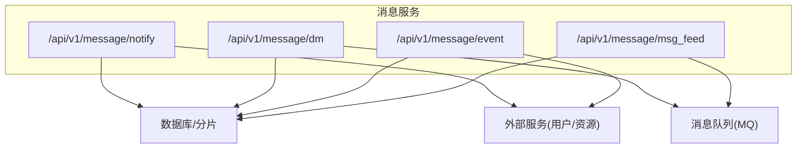
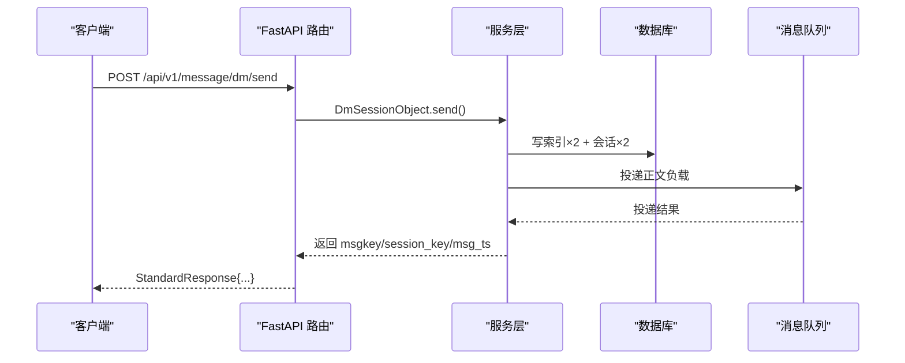
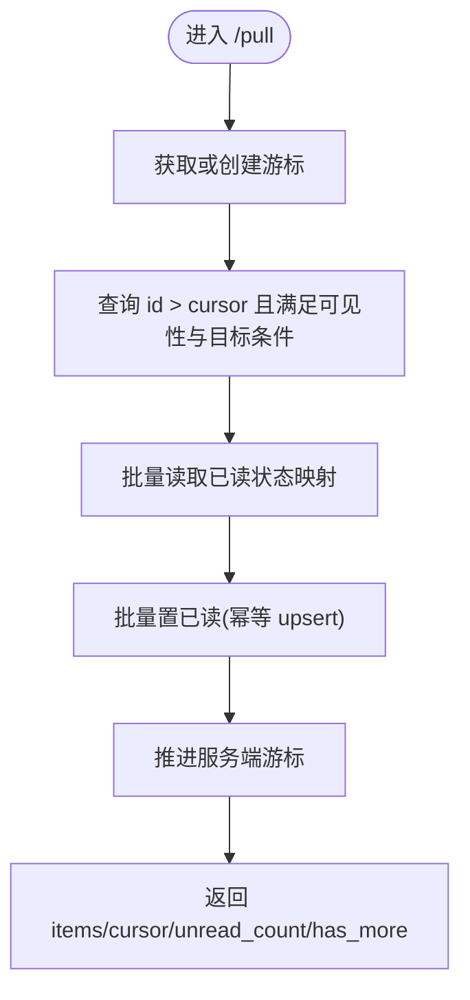
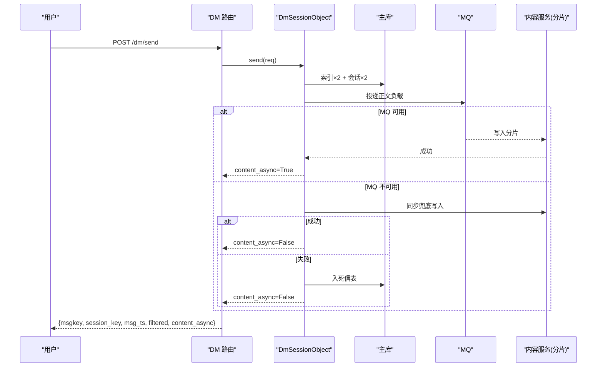
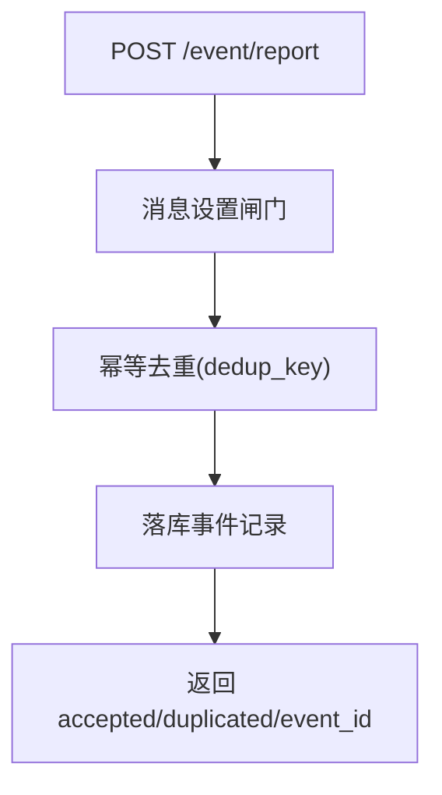
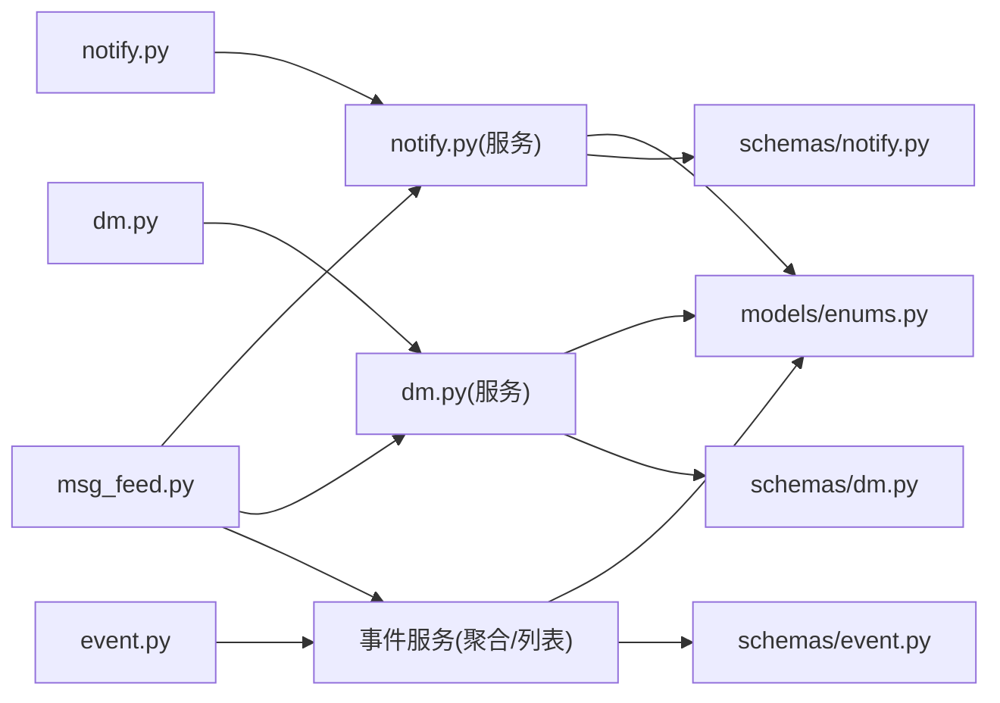

# 消息服务 API

<cite>
**本文引用的文件**
- [be-message-service/app/api/notify.py](file://be-message-service/app/api/notify.py)
- [be-message-service/app/api/dm.py](file://be-message-service/app/api/dm.py)
- [be-message-service/app/api/event.py](file://be-message-service/app/api/event.py)
- [be-message-service/app/api/msg_feed.py](file://be-message-service/app/api/msg_feed.py)
- [be-message-service/app/models/schemas/notify.py](file://be-message-service/app/models/schemas/notify.py)
- [be-message-service/app/models/schemas/dm.py](file://be-message-service/app/models/schemas/dm.py)
- [be-message-service/app/models/schemas/event.py](file://be-message-service/app/models/schemas/event.py)
- [be-message-service/app/models/enums.py](file://be-message-service/app/models/enums.py)
- [be-message-service/app/services/message/insite/notify.py](file://be-message-service/app/services/message/insite/notify.py)
- [be-message-service/app/services/message/dm/dm.py](file://be-message-service/app/services/message/dm/dm.py)
</cite>

## 目录
1. [简介](#简介)
2. [项目结构](#项目结构)
3. [核心组件](#核心组件)
4. [架构总览](#架构总览)
5. [详细组件分析](#详细组件分析)
6. [依赖关系分析](#依赖关系分析)
7. [性能考量](#性能考量)
8. [故障排查指南](#故障排查指南)
9. [结论](#结论)
10. [附录：API 规范与示例](#附录api-规范与示例)

## 简介
本文件为“消息推送服务”的完整 API 接口文档，覆盖站内消息、系统通知、私信处理、事件提醒等能力。文档包含：
- RESTful API 规范（路径、方法、请求体、响应体、状态码）
- 消息模型定义与枚举
- 推送渠道配置与路由规则（基于模块路由键）
- 安全认证机制（网关可信头）
- 高级功能：消息订阅、批量发送、消息模板管理（以现有能力为准）
- 调用示例与最佳实践

## 项目结构
消息服务位于 be-message-service，采用 FastAPI 模块化路由组织：
- /api/v1/message/notify：系统通知（管理员发布/修改/撤回；用户拉取/分页/未读）
- /api/v1/message/dm：私信（发送/会话/消息/删除/撤回/已读/未读）
- /api/v1/message/event：事件提醒（上报/聚合/列表/已读/未读）
- /api/v1/message/msg_feed：跨模块聚合（全站未读数汇总、活跃心跳）

图表来源
- [be-message-service/app/api/notify.py:1-217](file://be-message-service/app/api/notify.py#L1-L217)
- [be-message-service/app/api/dm.py:1-208](file://be-message-service/app/api/dm.py#L1-L208)
- [be-message-service/app/api/event.py:1-162](file://be-message-service/app/api/event.py#L1-L162)
- [be-message-service/app/api/msg_feed.py:1-66](file://be-message-service/app/api/msg_feed.py#L1-L66)

章节来源
- [be-message-service/app/api/notify.py:1-217](file://be-message-service/app/api/notify.py#L1-L217)
- [be-message-service/app/api/dm.py:1-208](file://be-message-service/app/api/dm.py#L1-L208)
- [be-message-service/app/api/event.py:1-162](file://be-message-service/app/api/event.py#L1-L162)
- [be-message-service/app/api/msg_feed.py:1-66](file://be-message-service/app/api/msg_feed.py#L1-L66)

## 核心组件
- 系统通知服务：面向管理员发布/修改/撤回通知；面向用户增量拉取、历史分页、未读计数；支持定时发布与过期时间；读取即已读。
- 私信服务：写扩散索引+会话行，正文异步落库到月度分表；陌生人过滤、审核态、撤回/删除、已读水位、死信补偿。
- 事件提醒：点赞/回复/@提及三类互动；幂等去重、消息设置闸门、聚合展示、明细列表、按类型/分组/时间粒度已读。
- 聚合入口：一次获取各模块未读数，活跃心跳用于实时/批量分流策略。

章节来源
- [be-message-service/app/services/message/insite/notify.py:1-668](file://be-message-service/app/services/message/insite/notify.py#L1-L668)
- [be-message-service/app/services/message/dm/dm.py:1-800](file://be-message-service/app/services/message/dm/dm.py#L1-L800)
- [be-message-service/app/api/event.py:1-162](file://be-message-service/app/api/event.py#L1-L162)
- [be-message-service/app/api/msg_feed.py:1-66](file://be-message-service/app/api/msg_feed.py#L1-L66)

## 架构总览
消息服务通过 FastAPI 暴露统一前缀 /api/v1/message/* 的 REST 接口，内部按模块拆分路由与服务层。数据层使用 SQLModel/SQLAlchemy 访问 MySQL，私信正文走 MQ 异步写入月度分表，并具备死信重试。认证由上游网关注入可信 x-bili-* 头，服务侧不做令牌校验。

图表来源
- [be-message-service/app/api/dm.py:58-83](file://be-message-service/app/api/dm.py#L58-L83)
- [be-message-service/app/services/message/dm/dm.py:253-361](file://be-message-service/app/services/message/dm/dm.py#L253-L361)

## 详细组件分析

### 系统通知（/api/v1/message/notify）
- 用户侧
  - GET /pull：增量拉取，游标语义，自动标记已读，返回 unread_count
  - GET /list：历史分页，自动标记已读，is_read 为本次读取前快照
  - GET /unread：未读总数
  - GET /system：模仿 B 站 system_notify/get 结构
- 管理员侧
  - POST /admin/create：发布通知（可定时/草稿）
  - POST /admin/update/{notify_id}：修改草稿/内容
  - POST /admin/revoke/{notify_id}：撤回通知
  - GET /admin/list：管理端分页列表
  - POST /delete：仅管理员，逐用户软删（不可见）

关键行为
- 目标受众：全体/角色/等级/VIP/自定义 mid 列表
- 可见性：已发布 + 生效时间 + 未过期
- 幂等与防重复：拉取游标 + 已读唯一索引 + 投递标记 dispatched
- 读取即已读：pull/list/system 返回前批量置已读

图表来源
- [be-message-service/app/services/message/insite/notify.py:347-415](file://be-message-service/app/services/message/insite/notify.py#L347-L415)
- [be-message-service/app/services/message/insite/notify.py:499-532](file://be-message-service/app/services/message/insite/notify.py#L499-L532)

章节来源
- [be-message-service/app/api/notify.py:46-137](file://be-message-service/app/api/notify.py#L46-L137)
- [be-message-service/app/api/notify.py:143-213](file://be-message-service/app/api/notify.py#L143-L213)
- [be-message-service/app/models/schemas/notify.py:12-120](file://be-message-service/app/models/schemas/notify.py#L12-L120)
- [be-message-service/app/models/schemas/notify.py:125-192](file://be-message-service/app/models/schemas/notify.py#L125-L192)
- [be-message-service/app/services/message/insite/notify.py:55-105](file://be-message-service/app/services/message/insite/notify.py#L55-L105)
- [be-message-service/app/services/message/insite/notify.py:113-216](file://be-message-service/app/services/message/insite/notify.py#L113-L216)
- [be-message-service/app/services/message/insite/notify.py:347-477](file://be-message-service/app/services/message/insite/notify.py#L347-L477)

### 私信（/api/v1/message/dm）
- 发送：POST /send
  - 写扩散：索引×2 + 会话×2 同步落库
  - 正文异步落库至月度分表（失败降级/死信）
  - 陌生人过滤、封禁检查、审核态
- 会话：GET /sessions、POST /session/delete
- 消息：GET /messages（msgkey 游标翻页）、POST /delete（仅自己视角）
- 撤回：POST /recall（双方不可见，物理清除正文，受时间窗口限制）
- 已读：POST /ack（清零未读，抬高 ack_msgkey）
- 未读：GET /unread

图表来源
- [be-message-service/app/api/dm.py:58-83](file://be-message-service/app/api/dm.py#L58-L83)
- [be-message-service/app/services/message/dm/dm.py:253-361](file://be-message-service/app/services/message/dm/dm.py#L253-L361)
- [be-message-service/app/services/message/dm/dm.py:453-473](file://be-message-service/app/services/message/dm/dm.py#L453-L473)

章节来源
- [be-message-service/app/api/dm.py:58-204](file://be-message-service/app/api/dm.py#L58-L204)
- [be-message-service/app/models/schemas/dm.py:19-134](file://be-message-service/app/models/schemas/dm.py#L19-L134)
- [be-message-service/app/services/message/dm/dm.py:201-361](file://be-message-service/app/services/message/dm/dm.py#L201-L361)
- [be-message-service/app/services/message/dm/dm.py:476-577](file://be-message-service/app/services/message/dm/dm.py#L476-L577)
- [be-message-service/app/services/message/dm/dm.py:581-668](file://be-message-service/app/services/message/dm/dm.py#L581-L668)

### 事件提醒（/api/v1/message/event）
- 上报：POST /report（业务方调用，mid 显式指定）
  - 消息设置闸门 → 自赞过滤 → 幂等去重 → 落库
- 聚合：GET /aggregate（按 source_type + source_id 分组卡片）
- 列表：GET /list（对齐 B 站 msgfeed 结构）
- 已读：POST /read（id/类型/分组/时间戳四种粒度）
- 未读：GET /unread（like/reply/at 及 total）

图表来源
- [be-message-service/app/api/event.py:34-50](file://be-message-service/app/api/event.py#L34-L50)
- [be-message-service/app/models/schemas/event.py:44-75](file://be-message-service/app/models/schemas/event.py#L44-L75)

章节来源
- [be-message-service/app/api/event.py:34-158](file://be-message-service/app/api/event.py#L34-L158)
- [be-message-service/app/models/schemas/event.py:44-281](file://be-message-service/app/models/schemas/event.py#L44-L281)

### 聚合入口（/api/v1/message/msg_feed）
- GET /unread：一次汇总 like/reply/at/notify/dm 未读及 total
- POST /heartbeat：上报活跃心跳，用于实时/批量分流

章节来源
- [be-message-service/app/api/msg_feed.py:26-62](file://be-message-service/app/api/msg_feed.py#L26-L62)

## 依赖关系分析
- 路由层依赖服务层：notify/dm/event/msg_feed 路由分别调用对应 Service
- 服务层依赖数据层：SQLModel/SQLAlchemy 访问 MySQL；私信正文通过 MQ 路由到月度分表
- 枚举与模型：统一在 models/enums.py 与 schemas/* 中定义，保证前后端契约一致
- 外部依赖：用户/资源信息读取时回查用户服务或资源服务，避免冗余存储

图表来源
- [be-message-service/app/api/notify.py:1-217](file://be-message-service/app/api/notify.py#L1-L217)
- [be-message-service/app/api/dm.py:1-208](file://be-message-service/app/api/dm.py#L1-L208)
- [be-message-service/app/api/event.py:1-162](file://be-message-service/app/api/event.py#L1-L162)
- [be-message-service/app/api/msg_feed.py:1-66](file://be-message-service/app/api/msg_feed.py#L1-L66)
- [be-message-service/app/models/enums.py:1-412](file://be-message-service/app/models/enums.py#L1-L412)

章节来源
- [be-message-service/app/models/enums.py:16-23](file://be-message-service/app/models/enums.py#L16-L23)

## 性能考量
- 私信正文异步化：同步链路只写定长索引与会话行，RT 不受正文长度影响；正文走 MQ 异步落库，失败降级/死信补偿
- 游标翻页：私信使用 msgkey 游标倒序翻页，深翻页不退化；通知使用 id 游标增量拉取
- 读取即已读：减少额外写操作，提升吞吐
- 并发安全：私信写扩散存在 MySQL 死锁风险，内置重试；会话 upsert 原子更新消除竞态
- 聚合接口：/msg_feed/unread 合并多次查询，降低前端请求次数

[本节为通用性能建议，不直接分析具体文件]

## 故障排查指南
- 私信发送失败
  - 检查封禁状态与陌生人过滤设置
  - 查看 content_async 标志：False 表示已降级同步或进入死信
  - 死信表重试任务会补偿未写入正文的消息
- 私信撤回失败
  - 确认仅发送者可撤回且在时间窗口内
  - 若已删除则无法撤回
- 通知未显示
  - 检查是否已发布、是否在生效时间范围内、是否已过期
  - 检查目标受众条件是否匹配当前用户
  - 检查用户是否关闭系统通知设置
- 事件提醒未收到
  - 检查上报是否命中消息设置闸门与幂等去重
  - 确认聚合/列表是否正确筛选 event_type

章节来源
- [be-message-service/app/services/message/dm/dm.py:161-195](file://be-message-service/app/services/message/dm/dm.py#L161-L195)
- [be-message-service/app/services/message/dm/dm.py:596-651](file://be-message-service/app/services/message/dm/dm.py#L596-L651)
- [be-message-service/app/services/message/insite/notify.py:89-105](file://be-message-service/app/services/message/insite/notify.py#L89-L105)
- [be-message-service/app/services/message/insite/notify.py:219-259](file://be-message-service/app/services/message/insite/notify.py#L219-L259)

## 结论
本消息服务提供完整的站内消息、系统通知、私信与事件提醒能力，采用读写分离、游标翻页、异步化与幂等设计，兼顾高可用与高性能。通过统一的聚合入口简化前端集成，配合网关可信认证保障安全。

[本节为总结性内容，不直接分析具体文件]

## 附录：API 规范与示例

### 安全认证
- 认证方式：完全依赖上游 nodejs-pptr 注入的 x-bili-* 请求头，服务侧不做令牌校验
- 适用范围：所有 /api/v1/message/* 接口

章节来源
- [be-message-service/app/api/notify.py:14-16](file://be-message-service/app/api/notify.py#L14-L16)

### 系统通知 API
- GET /api/v1/message/notify/pull
  - 参数：cursor(int|None), limit(int 1..100)
  - 响应：StandardResponse[NotifyPullResp]
- GET /api/v1/message/notify/list
  - 参数：page_num(int>=1), page_size(int 1..100)
  - 响应：StandardResponse[NotifyListResp]
- GET /api/v1/message/notify/unread
  - 响应：StandardResponse[int]
- GET /api/v1/message/notify/system
  - 参数：page_num(int>=1), page_size(int 1..100)
  - 响应：BiliSystemNotifyResp
- POST /api/v1/message/notify/admin/create
  - 请求体：NotifyCreateReq
  - 响应：StandardResponse[NotifyAdminItem]
- POST /api/v1/message/notify/admin/update/{notify_id}
  - 请求体：NotifyUpdateReq
  - 响应：StandardResponse[NotifyAdminItem]
- POST /api/v1/message/notify/admin/revoke/{notify_id}
  - 响应：StandardResponse[bool]
- GET /api/v1/message/notify/admin/list
  - 参数：page_num, page_size, status(可选)
  - 响应：StandardResponse[NotifyAdminListResp]
- POST /api/v1/message/notify/delete
  - 请求体：NotifyDeleteReq
  - 响应：StandardResponse[int]

章节来源
- [be-message-service/app/api/notify.py:46-137](file://be-message-service/app/api/notify.py#L46-L137)
- [be-message-service/app/api/notify.py:143-213](file://be-message-service/app/api/notify.py#L143-L213)
- [be-message-service/app/models/schemas/notify.py:12-120](file://be-message-service/app/models/schemas/notify.py#L12-L120)
- [be-message-service/app/models/schemas/notify.py:125-192](file://be-message-service/app/models/schemas/notify.py#L125-L192)

### 私信 API
- POST /api/v1/message/dm/send
  - 请求体：DmSendReq
  - 响应：StandardResponse[DmSendResp]
- GET /api/v1/message/dm/sessions
  - 参数：relation(normal|stranger|None), page_num, page_size
  - 响应：StandardResponse[DmSessionListResp]
- POST /api/v1/message/dm/session/delete
  - 请求体：DmSessionDeleteReq
  - 响应：StandardResponse[DmOperationResp]
- GET /api/v1/message/dm/messages
  - 参数：talker_mid(StrInt), cursor(str|None), page_size
  - 响应：StandardResponse[DmMessageListResp]
- POST /api/v1/message/dm/delete
  - 请求体：DmDeleteReq
  - 响应：StandardResponse[DmOperationResp]
- POST /api/v1/message/dm/recall
  - 请求体：DmRecallReq
  - 响应：StandardResponse[DmOperationResp]
- POST /api/v1/message/dm/ack
  - 请求体：DmAckReq
  - 响应：StandardResponse[DmOperationResp]
- GET /api/v1/message/dm/unread
  - 响应：StandardResponse[int]

章节来源
- [be-message-service/app/api/dm.py:58-204](file://be-message-service/app/api/dm.py#L58-L204)
- [be-message-service/app/models/schemas/dm.py:19-134](file://be-message-service/app/models/schemas/dm.py#L19-L134)

### 事件提醒 API
- POST /api/v1/message/event/report
  - 请求体：EventReportReq
  - 响应：StandardResponse[EventReportResp]
- GET /api/v1/message/event/aggregate
  - 参数：event_type(可选), page_num, page_size, only_unread(bool)
  - 响应：StandardResponse[EventAggregateResp]
- GET /api/v1/message/event/list
  - 参数：event_type(可选), cursor_id(int|None), page_size, only_unread(bool)
  - 响应：StandardResponse[EventListResp]
- POST /api/v1/message/event/read
  - 请求体：EventReadReq
  - 响应：StandardResponse[EventReadResp]
- POST /api/v1/message/event/delete
  - 请求体：EventReadReq
  - 响应：StandardResponse[int]
- GET /api/v1/message/event/unread
  - 响应：StandardResponse[dict]

章节来源
- [be-message-service/app/api/event.py:34-158](file://be-message-service/app/api/event.py#L34-L158)
- [be-message-service/app/models/schemas/event.py:44-281](file://be-message-service/app/models/schemas/event.py#L44-L281)

### 聚合入口 API
- GET /api/v1/message/msg_feed/unread
  - 响应：StandardResponse[EventUnreadResp]
- POST /api/v1/message/msg_feed/heartbeat
  - 响应：StandardResponse[UserActivityResp]

章节来源
- [be-message-service/app/api/msg_feed.py:26-62](file://be-message-service/app/api/msg_feed.py#L26-L62)

### 消息模型与枚举要点
- 通知模型：NotifyCreateReq/NotifyUpdateReq/NotifyItem/NotifyAdminItem/NotifyPullResp/NotifyListResp/NotifyAdminListResp/NotifyDeleteReq
- 私信模型：DmSendReq/DmSendResp/DmSessionItem/DmMessageItem/DmMessageListResp/DmDeleteReq/DmRecallReq/DmAckReq/DmSessionDeleteReq
- 事件模型：EventReportReq/EventReportResp/EventItem/EventAggregateItem/EventMsgfeedContent/EventMsgfeedItem/EventListResp/EventReadReq/EventReadResp/EventUnreadResp
- 枚举：NotifyStatusEnum/NotifyTargetTypeEnum/NotifyLevelEnum、DmMsgTypeEnum/DmMsgStatusEnum/DmRelationEnum/DmAuditStateEnum、InteractionActionTypeEnum/InteractionBizTypeEnum（来自 bili-common）

章节来源
- [be-message-service/app/models/schemas/notify.py:12-120](file://be-message-service/app/models/schemas/notify.py#L12-L120)
- [be-message-service/app/models/schemas/dm.py:19-134](file://be-message-service/app/models/schemas/dm.py#L19-L134)
- [be-message-service/app/models/schemas/event.py:44-281](file://be-message-service/app/models/schemas/event.py#L44-L281)
- [be-message-service/app/models/enums.py:28-94](file://be-message-service/app/models/enums.py#L28-L94)

### 推送渠道配置与路由规则
- 模块路由键：PUSH=1, NOTIFY=2, EVENT=3, DM=4（用于消息路由的第二段）
- 私信正文：通过 MQ 投递到月度分表；失败时降级同步写入或进入死信表等待补偿
- 通知投递：定时任务扫描 dispatched=False 的通知，解析目标 mid 后投递

章节来源
- [be-message-service/app/models/enums.py:16-23](file://be-message-service/app/models/enums.py#L16-L23)
- [be-message-service/app/services/message/dm/dm.py:453-473](file://be-message-service/app/services/message/dm/dm.py#L453-L473)
- [be-message-service/app/services/message/insite/notify.py:565-615](file://be-message-service/app/services/message/insite/notify.py#L565-L615)

### 高级功能与最佳实践
- 消息订阅：通过 /msg_feed/heartbeat 上报活跃，实现实时推送；非活跃用户转为批量推送
- 批量发送：管理员可使用 /notify/admin/create 进行定向投放（target_type=CUSTOM，target_value 逗号分隔 mid 列表）
- 消息模板：通知内容以 content/jump_url 表达，可在管理端维护不同场景的标题与正文
- 幂等与去重：事件上报使用 dedup_key；通知投递使用 dispatched 标记；私信正文失败有死信补偿
- 最佳实践
  - 前端使用游标翻页（通知 id 游标、私信 msgkey 游标），避免 offset 分页问题
  - 打开聊天页自动已读，减少红点残留
  - 聚合接口 /msg_feed/unread 一次性获取多模块未读，减少请求次数

章节来源
- [be-message-service/app/api/msg_feed.py:48-62](file://be-message-service/app/api/msg_feed.py#L48-L62)
- [be-message-service/app/services/message/insite/notify.py:565-615](file://be-message-service/app/services/message/insite/notify.py#L565-L615)
- [be-message-service/app/services/message/dm/dm.py:550-577](file://be-message-service/app/services/message/dm/dm.py#L550-L577)