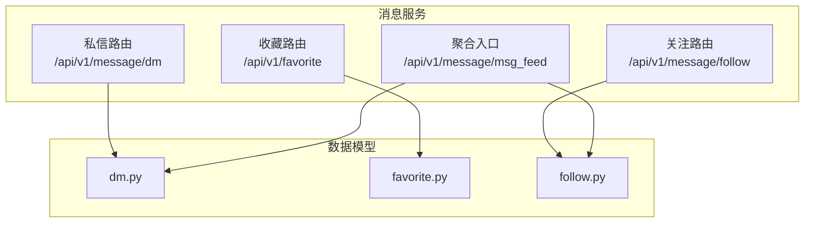
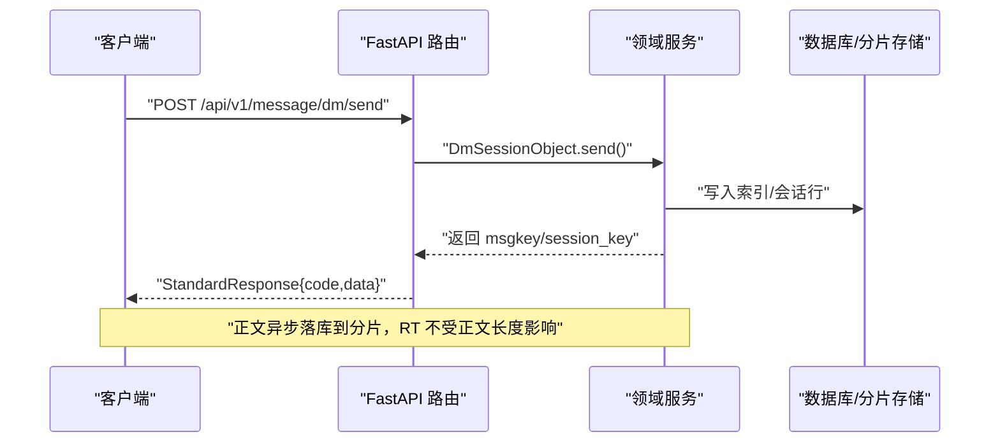
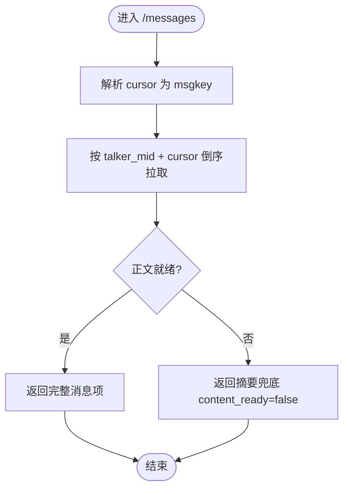
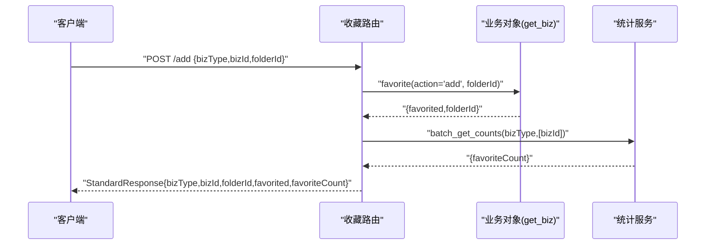
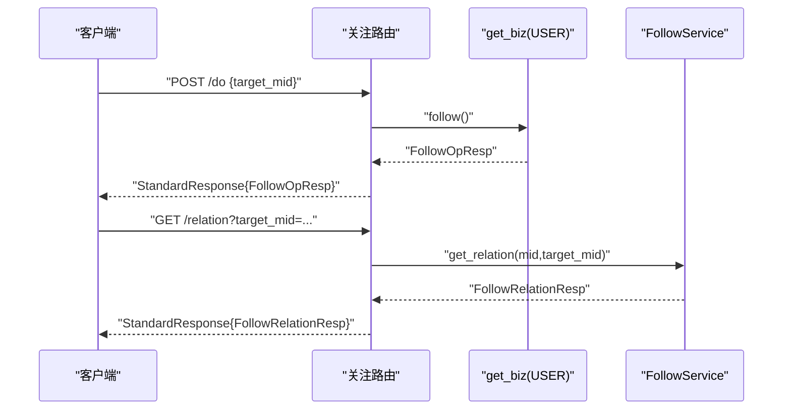
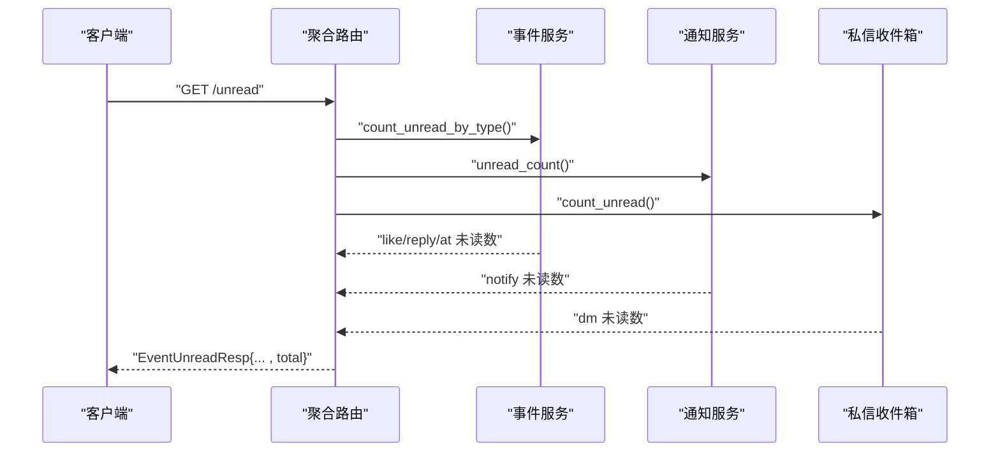
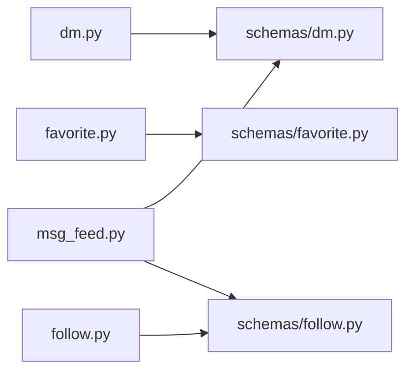

# 用户消息接口

<cite>
**本文引用的文件**
- [be-message-service/app/api/dm.py](file://be-message-service/app/api/dm.py)
- [be-message-service/app/api/favorite.py](file://be-message-service/app/api/favorite.py)
- [be-message-service/app/api/follow.py](file://be-message-service/app/api/follow.py)
- [be-message-service/app/api/msg_feed.py](file://be-message-service/app/api/msg_feed.py)
- [be-message-service/app/models/schemas/dm.py](file://be-message-service/app/models/schemas/dm.py)
- [be-message-service/app/models/schemas/favorite.py](file://be-message-service/app/models/schemas/favorite.py)
- [be-message-service/app/models/schemas/follow.py](file://be-message-service/app/models/schemas/follow.py)
</cite>

## 目录
1. [简介](#简介)
2. [项目结构](#项目结构)
3. [核心组件](#核心组件)
4. [架构总览](#架构总览)
5. [详细组件分析](#详细组件分析)
6. [依赖关系分析](#依赖关系分析)
7. [性能考虑](#性能考虑)
8. [故障排查指南](#故障排查指南)
9. [结论](#结论)
10. [附录](#附录)

## 简介
本文件面向“私信（DM）、收藏、关注”等用户交互功能的 RESTful API，覆盖以下能力：
- 私信会话管理：发送、拉取聊天记录、删除/撤回、标记已读、未读统计、会话列表与陌生人分组。
- 收藏系统：收藏夹 CRUD、资源收藏/取消、按收藏夹分页查询、公开可见性设置与公开读取。
- 用户关系：关注/取关、拉黑/解除拉黑、关系查询、关注与粉丝列表及计数。
- 聚合入口：一次获取全站未读数汇总、上报活跃心跳用于推送策略分流。

所有接口统一返回标准响应体，包含 code、msg、data 字段；需要登录的接口通过认证依赖注入当前用户上下文。

## 项目结构
消息相关能力集中在 be-message-service 模块中，采用 FastAPI 路由组织：
- 私信：/api/v1/message/dm
- 收藏：/api/v1/favorite
- 关注：/api/v1/message/follow
- 聚合：/api/v1/message/msg_feed

请求/响应模型定义在 app/models/schemas 下，分别对应 dm.py、favorite.py、follow.py。

图表来源
- [be-message-service/app/api/dm.py:1-208](file://be-message-service/app/api/dm.py#L1-L208)
- [be-message-service/app/api/favorite.py:1-342](file://be-message-service/app/api/favorite.py#L1-L342)
- [be-message-service/app/api/follow.py:1-193](file://be-message-service/app/api/follow.py#L1-L193)
- [be-message-service/app/api/msg_feed.py:1-66](file://be-message-service/app/api/msg_feed.py#L1-L66)

章节来源
- [be-message-service/app/api/dm.py:1-208](file://be-message-service/app/api/dm.py#L1-L208)
- [be-message-service/app/api/favorite.py:1-342](file://be-message-service/app/api/favorite.py#L1-L342)
- [be-message-service/app/api/follow.py:1-193](file://be-message-service/app/api/follow.py#L1-L193)
- [be-message-service/app/api/msg_feed.py:1-66](file://be-message-service/app/api/msg_feed.py#L1-L66)

## 核心组件
- 私信模块：提供私信发送、会话列表、聊天记录翻页、删除/撤回、已读标记、未读总数等能力。
- 收藏模块：提供收藏夹创建/更新/删除/列表、资源收藏/取消、收藏夹内容分页、公开可见性设置与公开读取。
- 关注模块：提供关注/取关、拉黑/解除拉黑、关系查询、关注/粉丝列表与计数。
- 聚合入口：一次聚合各模块未读数，支持活跃心跳上报以影响推送策略。

章节来源
- [be-message-service/app/api/dm.py:1-208](file://be-message-service/app/api/dm.py#L1-L208)
- [be-message-service/app/api/favorite.py:1-342](file://be-message-service/app/api/favorite.py#L1-L342)
- [be-message-service/app/api/follow.py:1-193](file://be-message-service/app/api/follow.py#L1-L193)
- [be-message-service/app/api/msg_feed.py:1-66](file://be-message-service/app/api/msg_feed.py#L1-L66)

## 架构总览
下图展示前端调用消息服务的典型流程：认证后访问各路由，路由层校验参数并调用领域服务完成业务逻辑，最终返回标准响应。

图表来源
- [be-message-service/app/api/dm.py:58-83](file://be-message-service/app/api/dm.py#L58-L83)

章节来源
- [be-message-service/app/api/dm.py:58-83](file://be-message-service/app/api/dm.py#L58-L83)

## 详细组件分析

### 私信（DM）接口
- 基础约定
  - 路径前缀：/api/v1/message/dm
  - 认证：需登录（RequiredUser）
  - 数字 ID：mid/msgkey 等以字符串传输，避免 JS 精度丢失
  - 分页：聊天记录使用 msgkey 游标倒序翻页

- 接口清单
  - POST /send：发送私信
    - 请求体：receiver_mid、content、msg_type、可选 receiver_name/receiver_avatar
    - 响应：msgkey、session_key、msg_ts、filtered、content_async
    - 说明：同步写双方索引与会话行，正文异步落分片；若对方关闭陌生人私信则 filtered=true
  - GET /sessions：会话列表
    - 查询参数：relation（normal/stranger/不传）、page_num、page_size
    - 响应：items、total、unread_total、stranger_unread
  - POST /session/delete：删除会话（仅自己不可见）
    - 请求体：talker_mid
    - 响应：affected、message
  - GET /messages：聊天记录
    - 查询参数：talker_mid、cursor（上一页最小 msgkey）、page_size
    - 响应：items、cursor、has_more、talker_mid、session_key
  - POST /delete：删除消息（仅自己视角）
    - 请求体：msgkeys[]
    - 响应：affected、message
  - POST /recall：撤回消息（双方不可见，受时间窗口限制）
    - 请求体：msgkey
    - 响应：affected、message
  - POST /ack：标记会话已读
    - 请求体：talker_mid、ack_msgkey（可选）
    - 响应：affected、message
  - GET /unread：私信未读总数
    - 响应：int

- 错误码与异常
  - 400：参数非法或业务校验失败（如 msgkeys 为空、msgkey 格式非法）
  - 403：账号被封禁私信功能
  - 500：服务端异常

- 调用示例（文字描述）
  - 发送私信：携带接收者 mid、文本内容，收到 msgkey 后可用于后续撤回/状态同步
  - 拉取聊天记录：首屏不传 cursor，后续传入本页最小 msgkey 继续翻页
  - 标记已读：传入 talker_mid 与 ack_msgkey（可空表示全部已读）

图表来源
- [be-message-service/app/api/dm.py:121-145](file://be-message-service/app/api/dm.py#L121-L145)

章节来源
- [be-message-service/app/api/dm.py:58-204](file://be-message-service/app/api/dm.py#L58-L204)
- [be-message-service/app/models/schemas/dm.py:19-134](file://be-message-service/app/models/schemas/dm.py#L19-L134)

### 收藏（Favorite）接口
- 基础约定
  - 路径前缀：/api/v1/favorite
  - 认证：需登录（RequiredUser）
  - 资源标识：bizId 为雪花 ID（字符串），bizType 指定资源类型

- 接口清单
  - 收藏夹 CRUD
    - POST /folder/create：创建收藏夹（封面先审后发）
      - 请求体：name、description、coverUrl
      - 响应：folderId、name、description、isDefault、favoriteCount、coverAuditStatus
    - POST /folder/update：更新收藏夹
      - 请求体：folderId、name、description、coverUrl
    - POST /folder/delete：删除收藏夹
      - 请求体：folderId
    - GET /folder/list：我的收藏夹列表（自动确保默认收藏夹存在）
      - 响应：list<FavoriteFolderResp>
  - 收藏/取消
    - POST /add：收藏资源到指定收藏夹
      - 请求体：bizType、bizId、folderId
      - 响应：bizType、bizId、folderId、favorited、favoriteCount
    - POST /remove：从收藏夹取消收藏
      - 请求体：bizType、bizId、folderId
      - 响应：同上
  - 收藏夹内容
    - GET /list：某收藏夹下的资源列表（支持 bizType 过滤、分页）
      - 查询参数：folderId、bizType、page、pageSize
      - 响应：folderId、total、items
    - GET /items：同 /list，语义更强调明细
  - 资源所在收藏夹
    - GET /dyn/folders：当前用户将某资源收藏在哪些收藏夹
      - 查询参数：bizId、bizType
      - 响应：bizType、bizId、folderIds[]
  - 主页可见性设置
    - GET /setting：查询是否显示收藏
      - 响应：showFavorites
    - POST /setting：设置是否显示收藏
      - 请求体：showFavorites
  - 他人主页公开读（无需登录）
    - GET /user/folders：某用户公开的收藏夹列表
      - 查询参数：mid
      - 响应：list<FavoriteFolderResp>|null
    - GET /user/dynamics：某用户某收藏夹下的公开资源
      - 查询参数：mid、folderId、page、pageSize
      - 响应：FavoriteListResp|null

- 错误码与异常
  - 400：参数非法（如 folderId/bizId 不合法）
  - 403：该用户未公开收藏/该收藏夹不公开或不存在
  - 422：封面 URL 下载校验失败

- 调用示例（文字描述）
  - 收藏动态：传入 bizType=动态、bizId=动态ID、folderId=目标收藏夹ID
  - 查看公开收藏：传入目标用户 mid 与 folderId 分页获取公开资源

图表来源
- [be-message-service/app/api/favorite.py:152-178](file://be-message-service/app/api/favorite.py#L152-L178)

章节来源
- [be-message-service/app/api/favorite.py:70-342](file://be-message-service/app/api/favorite.py#L70-L342)
- [be-message-service/app/models/schemas/favorite.py:1-342](file://be-message-service/app/models/schemas/favorite.py#L1-L342)

### 关注（Follow）接口
- 基础约定
  - 路径前缀：/api/v1/message/follow
  - 认证：需登录（CurrentUser）
  - 目标用户：target_mid（StrInt）

- 接口清单
  - 写操作
    - POST /do：关注用户（幂等；若此前拉黑过对方则翻转为关注；若对方已拉黑你则拒绝）
      - 请求体：target_mid
      - 响应：FollowOpResp
    - POST /undo：取关用户（幂等；保留 blocked 记录）
      - 请求体：target_mid
      - 响应：FollowOpResp
    - POST /block：拉黑用户（幂等；关注→拉黑；同时删除对方对自己的 following）
      - 请求体：target_mid
      - 响应：FollowOpResp
    - POST /unblock：解除拉黑（幂等；保留 following 记录）
      - 请求体：target_mid
      - 响应：FollowOpResp
  - 关系查询
    - GET /relation：查询我与某用户的关系
      - 查询参数：target_mid
      - 响应：Following/Followed_by/Mutual/I_blocked/Blocked_by
    - GET /count：关注/粉丝/互相关注数
      - 响应：following_count、follower_count、mutual_count
    - GET /following/list：我的关注列表（按关注时间倒序，含 mutual）
      - 查询参数：page_num、page_size
      - 响应：FollowListResp
    - GET /followers/list：我的粉丝列表（按关注时间倒序，含 mutual）
      - 查询参数：page_num、page_size
      - 响应：FollowListResp

- 错误码与异常
  - 400：业务校验失败（如被对方拉黑时尝试关注）

- 调用示例（文字描述）
  - 关注某人：传入 target_mid，若成功返回 status=following
  - 拉黑某人：传入 target_mid，若成功返回 status=blocked

图表来源
- [be-message-service/app/api/follow.py:35-54](file://be-message-service/app/api/follow.py#L35-L54)
- [be-message-service/app/api/follow.py:123-140](file://be-message-service/app/api/follow.py#L123-L140)

章节来源
- [be-message-service/app/api/follow.py:35-190](file://be-message-service/app/api/follow.py#L35-L190)
- [be-message-service/app/models/schemas/follow.py:21-113](file://be-message-service/app/models/schemas/follow.py#L21-L113)

### 聚合入口（消息中心红点与心跳）
- 路径前缀：/api/v1/message/msg_feed
- 接口清单
  - GET /unread：一次拿到系统通知/点赞/回复/@/私信的全部未读数
    - 响应：like、reply、at、notify、dm、total
  - POST /heartbeat：上报活跃心跳（用于实时/批量推送策略）
    - 响应：UserActivityResp

- 调用示例（文字描述）
  - 页面加载时调用 /unread 渲染顶部红点
  - 轮询期间周期性调用 /heartbeat 保持活跃

图表来源
- [be-message-service/app/api/msg_feed.py:26-45](file://be-message-service/app/api/msg_feed.py#L26-L45)

章节来源
- [be-message-service/app/api/msg_feed.py:1-66](file://be-message-service/app/api/msg_feed.py#L1-L66)

## 依赖关系分析
- 路由层依赖
  - 认证依赖：RequiredUser/CurrentUser 注入当前用户
  - 数据库会话：SessionDep
  - 领域服务：DmInbox/DmSessionObject、FavoriteFolderAction、FollowService、InteractionStatService 等
- 数据模型
  - 请求/响应体由 SQLModel 定义，保证前后端契约一致
- 外部依赖
  - 消息正文异步落库（MQ/分片存储）
  - 统计计数（TInteractionStat）

图表来源
- [be-message-service/app/api/dm.py:1-208](file://be-message-service/app/api/dm.py#L1-L208)
- [be-message-service/app/api/favorite.py:1-342](file://be-message-service/app/api/favorite.py#L1-L342)
- [be-message-service/app/api/follow.py:1-193](file://be-message-service/app/api/follow.py#L1-L193)
- [be-message-service/app/api/msg_feed.py:1-66](file://be-message-service/app/api/msg_feed.py#L1-L66)

章节来源
- [be-message-service/app/api/dm.py:1-208](file://be-message-service/app/api/dm.py#L1-L208)
- [be-message-service/app/api/favorite.py:1-342](file://be-message-service/app/api/favorite.py#L1-L342)
- [be-message-service/app/api/follow.py:1-193](file://be-message-service/app/api/follow.py#L1-L193)
- [be-message-service/app/api/msg_feed.py:1-66](file://be-message-service/app/api/msg_feed.py#L1-L66)

## 性能考虑
- 私信发送采用写扩散：同步仅写索引与会话行，正文异步落分片，降低 RT 并避免大正文阻塞。
- 聊天记录使用 msgkey 游标翻页，避免 offset 深翻页退化。
- 聚合未读数一次性返回多模块计数，减少前端多次请求。
- 收藏计数通过批量化查询提升效率。

[本节为通用性能建议，不直接分析具体文件]

## 故障排查指南
- 常见错误码
  - 400：参数非法或业务校验失败（如 msgkeys 为空、msgkey 格式非法、folderId/bizId 不合法）
  - 403：账号被封禁私信功能；用户未公开收藏或收藏夹不公开
  - 422：封面 URL 下载校验失败
  - 500：服务端异常
- 排查步骤
  - 检查请求参数类型与必填项（mid/msgkey/folderId/bizId 等）
  - 确认登录态与权限（RequiredUser/CurrentUser）
  - 对私信：核对 msgkey 是否为字符串、是否在撤回时间窗口内
  - 对收藏：确认 bizType 与 bizId 匹配、文件夹是否存在
  - 对关注：确认目标用户是否拉黑了自己
- 日志定位
  - 私信发送失败会记录异常日志，便于定位 MQ/分片写入问题

章节来源
- [be-message-service/app/api/dm.py:70-83](file://be-message-service/app/api/dm.py#L70-L83)
- [be-message-service/app/api/favorite.py:103-134](file://be-message-service/app/api/favorite.py#L103-L134)
- [be-message-service/app/api/follow.py:49-75](file://be-message-service/app/api/follow.py#L49-L75)

## 结论
本接口文档覆盖了私信、收藏、关注三大用户交互能力的核心 API，明确了请求参数、响应结构、错误码与认证要求，并提供流程图与序列图帮助理解数据流与调用顺序。建议前端遵循：
- 使用字符串传递长整型 ID（mid/msgkey/folderId/bizId）
- 使用 msgkey 游标进行聊天记录翻页
- 通过聚合接口获取未读数，配合心跳维持推送策略
- 对收藏封面等敏感资源做好校验与降级处理

[本节为总结性内容，不直接分析具体文件]

## 附录
- 术语
  - msgkey：消息全局唯一键（雪花 ID），以字符串传输
  - session_key：会话键（小mid_大mid）
  - bizType/bizId：资源类型与资源 ID
  - StrInt：兼容前端字符串传参的整数类型
- 最佳实践
  - 发送私信后缓存 msgkey，用于撤回/状态同步
  - 聊天列表首次加载不传 cursor，后续传入本页最小 msgkey
  - 收藏封面上传前做格式/大小校验，失败时走降级
  - 关注/拉黑操作注意幂等性与状态翻转规则

[本节为补充信息，不直接分析具体文件]