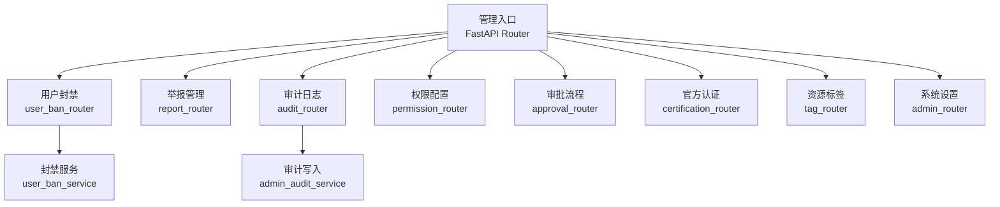
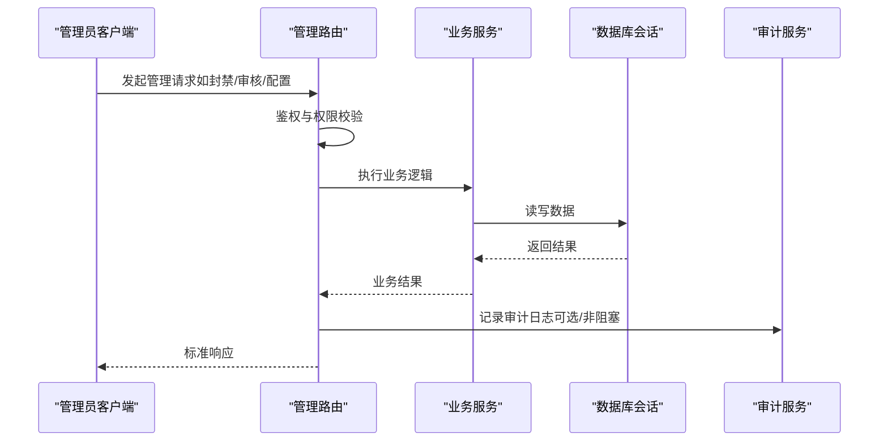
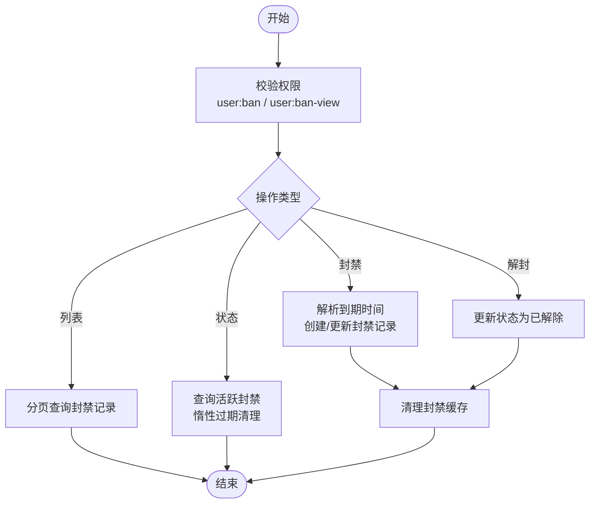
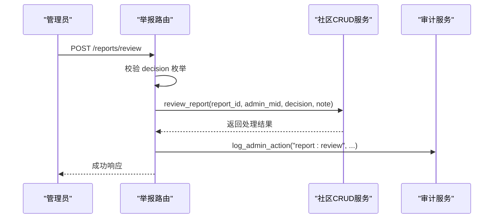
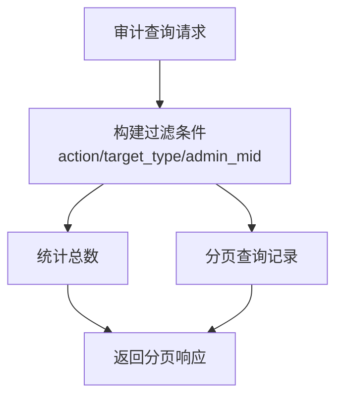
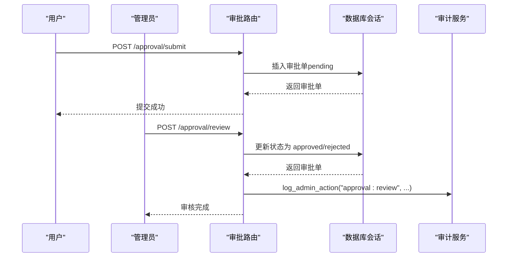
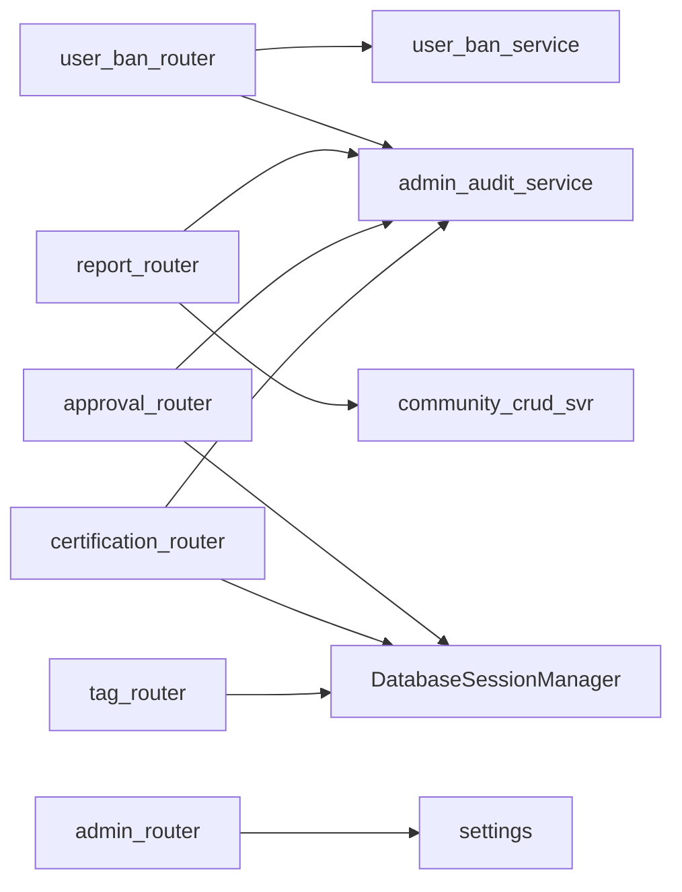

# 系统管理接口

<cite>
**本文引用的文件**
- [admin_router.py](file://RPA-Browser/app/controller/v1/admin/admin_router.py)
- [user_ban_router.py](file://RPA-Browser/app/controller/v1/admin/user_ban_router.py)
- [report_router.py](file://RPA-Browser/app/controller/v1/admin/report_router.py)
- [audit_router.py](file://RPA-Browser/app/controller/v1/admin/audit_router.py)
- [permission_router.py](file://RPA-Browser/app/controller/v1/admin/permission_router.py)
- [approval_router.py](file://RPA-Browser/app/controller/v1/admin/approval_router.py)
- [certification_router.py](file://RPA-Browser/app/controller/v1/admin/certification_router.py)
- [tag_router.py](file://RPA-Browser/app/controller/v1/admin/tag_router.py)
- [user_ban_service.py](file://RPA-Browser/app/services/user_ban.py)
- [admin_audit_service.py](file://RPA-Browser/app/services/admin_audit.py)
</cite>

## 目录
1. [简介](#简介)
2. [项目结构](#项目结构)
3. [核心组件](#核心组件)
4. [架构总览](#架构总览)
5. [详细组件分析](#详细组件分析)
6. [依赖关系分析](#依赖关系分析)
7. [性能考虑](#性能考虑)
8. [故障排查指南](#故障排查指南)
9. [结论](#结论)
10. [附录：调用示例与安全建议](#附录：调用示例与安全建议)

## 简介
本文件面向系统管理员与运维人员，系统化梳理并说明后台管理系统中的关键 API，涵盖消息治理、用户封禁、举报处理、系统设置、权限配置、审批流、官方认证与资源标签等能力。文档同时给出权限控制策略、审计记录机制、批量查询与分页、以及监控告警相关的实践建议，并提供集成与运维调用的参考路径。

## 项目结构
后端管理功能集中在 RPA-Browser 的 v1 管理路由中，按业务域拆分为多个 Router：
- 管理员概览与浏览器会话配置：admin_router
- 用户封禁管理：user_ban_router + user_ban_service
- 举报审核：report_router
- 操作审计日志：audit_router + admin_audit_service
- 权限配置：permission_router
- 审批流程：approval_router
- 官方认证：certification_router
- 资源标签：tag_router

图表来源
- [admin_router.py:1-118](file://RPA-Browser/app/controller/v1/admin/admin_router.py#L1-L118)
- [user_ban_router.py:1-188](file://RPA-Browser/app/controller/v1/admin/user_ban_router.py#L1-L188)
- [report_router.py:1-206](file://RPA-Browser/app/controller/v1/admin/report_router.py#L1-L206)
- [audit_router.py:1-94](file://RPA-Browser/app/controller/v1/admin/audit_router.py#L1-L94)
- [permission_router.py:1-77](file://RPA-Browser/app/controller/v1/admin/permission_router.py#L1-L77)
- [approval_router.py:1-153](file://RPA-Browser/app/controller/v1/admin/approval_router.py#L1-L153)
- [certification_router.py:1-133](file://RPA-Browser/app/controller/v1/admin/certification_router.py#L1-L133)
- [tag_router.py:1-225](file://RPA-Browser/app/controller/v1/admin/tag_router.py#L1-L225)
- [user_ban_service.py:1-183](file://RPA-Browser/app/services/user_ban.py#L1-L183)
- [admin_audit_service.py:1-44](file://RPA-Browser/app/services/admin_audit.py#L1-L44)

章节来源
- [admin_router.py:1-118](file://RPA-Browser/app/controller/v1/admin/admin_router.py#L1-L118)
- [user_ban_router.py:1-188](file://RPA-Browser/app/controller/v1/admin/user_ban_router.py#L1-L188)
- [report_router.py:1-206](file://RPA-Browser/app/controller/v1/admin/report_router.py#L1-L206)
- [audit_router.py:1-94](file://RPA-Browser/app/controller/v1/admin/audit_router.py#L1-L94)
- [permission_router.py:1-77](file://RPA-Browser/app/controller/v1/admin/permission_router.py#L1-L77)
- [approval_router.py:1-153](file://RPA-Browser/app/controller/v1/admin/approval_router.py#L1-L153)
- [certification_router.py:1-133](file://RPA-Browser/app/controller/v1/admin/certification_router.py#L1-L133)
- [tag_router.py:1-225](file://RPA-Browser/app/controller/v1/admin/tag_router.py#L1-L225)
- [user_ban_service.py:1-183](file://RPA-Browser/app/services/user_ban.py#L1-L183)
- [admin_audit_service.py:1-44](file://RPA-Browser/app/services/admin_audit.py#L1-L44)

## 核心组件
- 管理员概览与系统设置
  - 获取所有浏览器会话信息（管理员）
  - 获取/更新浏览器会话配置（仅内存生效，重启恢复）
- 用户封禁
  - 封禁/解封用户（支持永久与临时），分页查询封禁记录，查询当前封禁状态
  - 服务层提供惰性过期与内存缓存，供中间件快速拦截
- 举报管理
  - 分页查询举报列表，支持按有效性、资源类型筛选
  - 审核决策：忽略、警告、下架；标记无效快捷操作
- 操作审计
  - 分页查询管理员操作审计日志，支持按动作、目标类型、管理员过滤
- 权限配置
  - 获取/更新/重置权限配置（管理员）
- 审批流程
  - 提交审批（登录用户）、查看审批（管理员查看全部，普通用户仅自己）、审核审批（管理员）
- 官方认证
  - 标注/撤销官方认证（管理员），查询认证列表（登录用户可读）
- 资源标签
  - 标签 CRUD、资源关联/解绑、按资源查询标签（写受限管理员，读开放）

章节来源
- [admin_router.py:19-117](file://RPA-Browser/app/controller/v1/admin/admin_router.py#L19-L117)
- [user_ban_router.py:57-184](file://RPA-Browser/app/controller/v1/admin/user_ban_router.py#L57-L184)
- [report_router.py:87-206](file://RPA-Browser/app/controller/v1/admin/report_router.py#L87-L206)
- [audit_router.py:42-94](file://RPA-Browser/app/controller/v1/admin/audit_router.py#L42-L94)
- [permission_router.py:14-77](file://RPA-Browser/app/controller/v1/admin/permission_router.py#L14-L77)
- [approval_router.py:31-153](file://RPA-Browser/app/controller/v1/admin/approval_router.py#L31-L153)
- [certification_router.py:25-133](file://RPA-Browser/app/controller/v1/admin/certification_router.py#L25-L133)
- [tag_router.py:33-225](file://RPA-Browser/app/controller/v1/admin/tag_router.py#L33-L225)

## 架构总览
管理端采用 FastAPI 路由分层，统一通过依赖注入完成鉴权与权限校验，核心业务下沉至 service 层，数据访问通过数据库会话管理器进行。审计日志在关键写操作后异步落库，失败不阻断主流程。

图表来源
- [user_ban_router.py:57-109](file://RPA-Browser/app/controller/v1/admin/user_ban_router.py#L57-L109)
- [report_router.py:148-180](file://RPA-Browser/app/controller/v1/admin/report_router.py#L148-L180)
- [approval_router.py:106-135](file://RPA-Browser/app/controller/v1/admin/approval_router.py#L106-L135)
- [admin_audit_service.py:13-44](file://RPA-Browser/app/services/admin_audit.py#L13-L44)

## 详细组件分析

### 用户封禁管理
- 能力
  - 封禁用户：支持永久或临时（到期时间或时长），自动覆盖已有活跃封禁
  - 解封用户：将状态置为已解除，记录解封人与原因
  - 封禁列表：分页查询，支持按用户 mid、状态过滤
  - 封禁状态：查询当前是否处于封禁中（临时封禁惰性过期）
- 权限
  - 封禁/解封需 root 或 user:ban 权限
  - 列表/状态可结合 user:ban-view 权限
- 数据流
  - 路由接收请求 -> 权限校验 -> 调用服务层 -> 写入数据库 -> 清理封禁缓存 -> 记录审计日志

图表来源
- [user_ban_router.py:57-184](file://RPA-Browser/app/controller/v1/admin/user_ban_router.py#L57-L184)
- [user_ban_service.py:33-183](file://RPA-Browser/app/services/user_ban.py#L33-L183)

章节来源
- [user_ban_router.py:57-184](file://RPA-Browser/app/controller/v1/admin/user_ban_router.py#L57-L184)
- [user_ban_service.py:33-183](file://RPA-Browser/app/services/user_ban.py#L33-L183)

### 举报管理
- 能力
  - 举报列表：分页查询，支持 is_valid、resource_type 筛选
  - 审核举报：ignore/warn/takedown，记录审核备注与管理员
  - 标记无效：快捷标记为 ignore
- 权限
  - 全部操作需管理员/root
- 数据流
  - 路由接收请求 -> 权限校验 -> 调用社区 CRUD 服务 -> 写入审核结果 -> 记录审计日志

图表来源
- [report_router.py:148-180](file://RPA-Browser/app/controller/v1/admin/report_router.py#L148-L180)
- [admin_audit_service.py:13-44](file://RPA-Browser/app/services/admin_audit.py#L13-L44)

章节来源
- [report_router.py:87-206](file://RPA-Browser/app/controller/v1/admin/report_router.py#L87-L206)

### 操作审计日志
- 能力
  - 分页查询管理员操作审计日志，支持 action、target_type、admin_mid 过滤
- 权限
  - 仅管理员/root
- 数据流
  - 路由构建查询条件 -> 执行计数与分页查询 -> 组装响应

图表来源
- [audit_router.py:42-94](file://RPA-Browser/app/controller/v1/admin/audit_router.py#L42-L94)

章节来源
- [audit_router.py:42-94](file://RPA-Browser/app/controller/v1/admin/audit_router.py#L42-L94)

### 权限配置
- 能力
  - 获取权限配置
  - 更新权限配置
  - 重置为默认值
- 权限
  - 管理员
- 数据流
  - 路由调用权限配置服务 -> 返回/更新/重置 -> 统一响应

章节来源
- [permission_router.py:14-77](file://RPA-Browser/app/controller/v1/admin/permission_router.py#L14-L77)

### 审批流程
- 能力
  - 提交审批：任意登录用户
  - 查看审批：管理员查看全部，普通用户仅自己提交的
  - 审核审批：管理员/root，状态必须为 approved 或 rejected
- 权限
  - 提交：登录用户
  - 查看：管理员/本人
  - 审核：管理员/root
- 数据流
  - 路由接收请求 -> 权限校验 -> 写入审批单或更新状态 -> 记录审计日志

图表来源
- [approval_router.py:31-153](file://RPA-Browser/app/controller/v1/admin/approval_router.py#L31-L153)
- [admin_audit_service.py:13-44](file://RPA-Browser/app/services/admin_audit.py#L13-L44)

章节来源
- [approval_router.py:31-153](file://RPA-Browser/app/controller/v1/admin/approval_router.py#L31-L153)

### 官方认证
- 能力
  - 标注官方认证：已存在则更新
  - 撤销官方认证：删除认证记录
  - 查询认证列表：支持按 target_type/target_id 筛选
- 权限
  - 写：管理员/root
  - 读：任意登录用户
- 数据流
  - 路由接收请求 -> 权限校验 -> 写入/删除认证记录 -> 记录审计日志

章节来源
- [certification_router.py:25-133](file://RPA-Browser/app/controller/v1/admin/certification_router.py#L25-L133)

### 资源标签
- 能力
  - 标签 CRUD：创建、更新、删除（级联清理关联）
  - 资源关联/解绑：去重保护
  - 按资源查询标签：JOIN 查询
- 权限
  - 写：管理员/root
  - 读：任意登录用户
- 数据流
  - 路由接收请求 -> 权限校验 -> 写入/删除关联 -> 返回结果

章节来源
- [tag_router.py:33-225](file://RPA-Browser/app/controller/v1/admin/tag_router.py#L33-L225)

### 系统设置（浏览器会话）
- 能力
  - 获取所有浏览器会话信息（管理员）
  - 获取/更新浏览器会话配置（仅内存生效，重启恢复）
- 权限
  - 管理员
- 数据流
  - 路由读取 LiveService 会话字典或 settings 配置 -> 返回/更新 -> 记录日志

章节来源
- [admin_router.py:19-117](file://RPA-Browser/app/controller/v1/admin/admin_router.py#L19-L117)

## 依赖关系分析
- 路由层依赖
  - 鉴权与权限：AuthInfo、require_permission、require_admin、get_admin_status
  - 数据库会话：DatabaseSessionManager
  - 审计服务：log_admin_action
- 服务层依赖
  - 封禁服务：user_ban_service（含内存缓存与惰性过期）
  - 社区 CRUD：community_crud_svr（举报相关）
- 外部依赖
  - 配置：settings（浏览器会话配置）
  - 模型：各模块 SQLModel 模型（UserBan、ResourceReport、ApprovalRequest、Certification、ResourceTag 等）

图表来源
- [user_ban_router.py:57-184](file://RPA-Browser/app/controller/v1/admin/user_ban_router.py#L57-L184)
- [report_router.py:87-206](file://RPA-Browser/app/controller/v1/admin/report_router.py#L87-L206)
- [approval_router.py:31-153](file://RPA-Browser/app/controller/v1/admin/approval_router.py#L31-L153)
- [certification_router.py:25-133](file://RPA-Browser/app/controller/v1/admin/certification_router.py#L25-L133)
- [tag_router.py:33-225](file://RPA-Browser/app/controller/v1/admin/tag_router.py#L33-L225)
- [admin_router.py:19-117](file://RPA-Browser/app/controller/v1/admin/admin_router.py#L19-L117)
- [admin_audit_service.py:13-44](file://RPA-Browser/app/services/admin_audit.py#L13-L44)

章节来源
- [user_ban_router.py:57-184](file://RPA-Browser/app/controller/v1/admin/user_ban_router.py#L57-L184)
- [report_router.py:87-206](file://RPA-Browser/app/controller/v1/admin/report_router.py#L87-L206)
- [approval_router.py:31-153](file://RPA-Browser/app/controller/v1/admin/approval_router.py#L31-L153)
- [certification_router.py:25-133](file://RPA-Browser/app/controller/v1/admin/certification_router.py#L25-L133)
- [tag_router.py:33-225](file://RPA-Browser/app/controller/v1/admin/tag_router.py#L33-L225)
- [admin_router.py:19-117](file://RPA-Browser/app/controller/v1/admin/admin_router.py#L19-L117)
- [admin_audit_service.py:13-44](file://RPA-Browser/app/services/admin_audit.py#L13-L44)

## 性能考虑
- 封禁状态查询
  - 使用内存缓存（TTL 30s）降低高频查询压力，适合中间件拦截场景
  - 惰性过期：查询时若发现临时封禁已过期，直接落库更新状态，避免定时任务
- 分页与过滤
  - 列表类接口均提供分页参数（page/per_page），减少单次响应体积
  - 支持多维度过滤（如举报 is_valid、resource_type；审计 action/target_type/admin_mid）
- 配置更新
  - 浏览器会话配置更新仅在内存生效，避免频繁持久化带来的开销；重启恢复环境变量配置
- 审计日志
  - 审计写入失败不影响主流程，保证高可用

章节来源
- [user_ban_service.py:20-71](file://RPA-Browser/app/services/user_ban.py#L20-L71)
- [user_ban_service.py:33-58](file://RPA-Browser/app/services/user_ban.py#L33-L58)
- [report_router.py:102-138](file://RPA-Browser/app/controller/v1/admin/report_router.py#L102-L138)
- [audit_router.py:68-94](file://RPA-Browser/app/controller/v1/admin/audit_router.py#L68-L94)
- [admin_router.py:76-117](file://RPA-Browser/app/controller/v1/admin/admin_router.py#L76-L117)
- [admin_audit_service.py:29-44](file://RPA-Browser/app/services/admin_audit.py#L29-L44)

## 故障排查指南
- 封禁相关
  - 临时封禁未生效：检查 expired_at 与当前时间；确认惰性过期逻辑是否已将状态更新为 expired
  - 封禁状态不一致：确认缓存 TTL 是否命中；必要时手动清除缓存或等待刷新
- 举报审核
  - 审核失败：检查 decision 是否为合法枚举；确认举报记录是否存在且未被处理
- 审计日志缺失
  - 审计写入失败会记录警告但不影响主流程；检查数据库连接与写入异常
- 权限问题
  - 权限不足：确认当前用户是否具备所需权限（如 user:ban、user:ban-view、管理员角色）
- 配置更新
  - 配置未持久化：浏览器会话配置更新仅内存生效，重启恢复；如需永久修改请更新环境变量

章节来源
- [user_ban_service.py:33-71](file://RPA-Browser/app/services/user_ban.py#L33-L71)
- [report_router.py:148-180](file://RPA-Browser/app/controller/v1/admin/report_router.py#L148-L180)
- [admin_audit_service.py:29-44](file://RPA-Browser/app/services/admin_audit.py#L29-L44)
- [admin_router.py:76-117](file://RPA-Browser/app/controller/v1/admin/admin_router.py#L76-L117)

## 结论
本系统管理接口围绕“安全可控、可审计、可扩展”的原则设计，通过细粒度权限控制、完善的审计记录、高效的封禁机制与灵活的配置管理能力，支撑日常运营与治理工作。建议在集成时严格遵循权限与审计要求，并结合分页与过滤优化查询性能。

## 附录：调用示例与安全建议
- 调用示例（以路径与参数为主，不包含具体代码）
  - 用户封禁
    - 封禁用户：POST /ban/create，参数包含 mid、ban_type、expired_at/duration_minutes、reason、note
    - 解封用户：POST /ban/lift，参数包含 mid、reason
    - 封禁列表：POST /ban/list，参数 page、per_page、mid、status
    - 封禁状态：POST /ban/status，参数 mid
  - 举报管理
    - 举报列表：POST /reports/list，参数 page、per_page、is_valid、resource_type
    - 审核举报：POST /reports/review，参数 report_id、decision（ignore/warn/takedown）、review_note
    - 标记无效：POST /reports/mark-invalid，参数 report_id、review_note
  - 操作审计
    - 审计列表：POST /audit/list，参数 page、per_page、action、target_type、admin_mid
  - 权限配置
    - 获取权限：POST /permissions/get
    - 更新权限：POST /permissions/update，传入 PermissionConfigList
    - 重置权限：POST /permissions/reset
  - 审批流程
    - 提交审批：POST /approval/submit，参数 resource_type、resource_id、action、title、description
    - 查看审批：POST /approval/list，参数 page、per_page、status、resource_type
    - 审核审批：POST /approval/review，参数 approval_id、status（approved/rejected）、review_note
  - 官方认证
    - 标注认证：POST /certification/certify，参数 target_type、target_id、note
    - 撤销认证：POST /certification/revoke，参数 target_type、target_id
    - 认证列表：POST /certification/list，参数 page、per_page、target_type、target_id
  - 资源标签
    - 创建标签：POST /tag/create，参数 name、color
    - 更新标签：POST /tag/update，参数 id、name、color
    - 删除标签：POST /tag/delete，参数 id
    - 关联标签：POST /tag/attach，参数 tag_id、target_type、target_id
    - 移除标签：POST /tag/detach，参数 tag_id、target_type、target_id
    - 按资源查标签：POST /tag/list-by-target，参数 target_type、target_id
  - 系统设置
    - 获取会话：POST /sessions/all
    - 获取配置：GET /config/browser-session
    - 更新配置：POST /config/browser-session，参数 auto_cleanup、max_idle_time、cleanup_interval、expiration_time
- 安全管理建议
  - 最小权限原则：仅授予必要权限（如 user:ban、user:ban-view、管理员角色）
  - 强审计：所有写操作均记录审计日志，便于追溯与合规
  - 输入校验：对敏感参数（如 mid、duration_minutes、expired_at）进行严格校验
  - 防越权：列表查询需根据身份过滤（如普通用户仅看自己的审批）
  - 缓存一致性：封禁状态变更后立即清理缓存，避免延迟导致的状态不一致
  - 配置安全：浏览器会话配置更新仅内存生效，避免误改持久化配置

章节来源
- [user_ban_router.py:57-184](file://RPA-Browser/app/controller/v1/admin/user_ban_router.py#L57-L184)
- [report_router.py:87-206](file://RPA-Browser/app/controller/v1/admin/report_router.py#L87-L206)
- [audit_router.py:42-94](file://RPA-Browser/app/controller/v1/admin/audit_router.py#L42-L94)
- [permission_router.py:14-77](file://RPA-Browser/app/controller/v1/admin/permission_router.py#L14-L77)
- [approval_router.py:31-153](file://RPA-Browser/app/controller/v1/admin/approval_router.py#L31-L153)
- [certification_router.py:25-133](file://RPA-Browser/app/controller/v1/admin/certification_router.py#L25-L133)
- [tag_router.py:33-225](file://RPA-Browser/app/controller/v1/admin/tag_router.py#L33-L225)
- [admin_router.py:19-117](file://RPA-Browser/app/controller/v1/admin/admin_router.py#L19-L117)
- [user_ban_service.py:20-71](file://RPA-Browser/app/services/user_ban.py#L20-L71)
- [admin_audit_service.py:13-44](file://RPA-Browser/app/services/admin_audit.py#L13-L44)