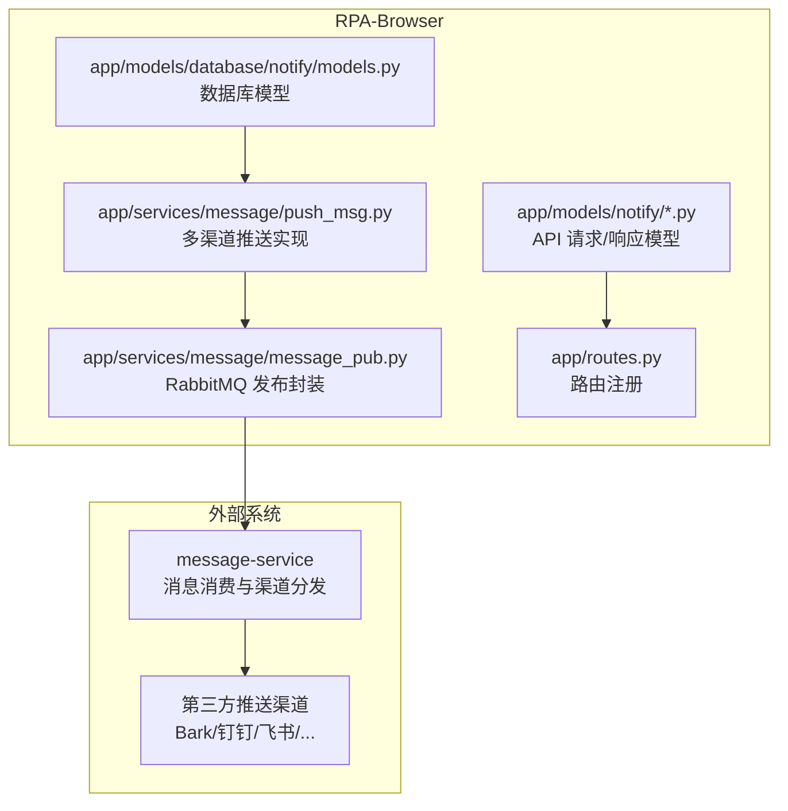
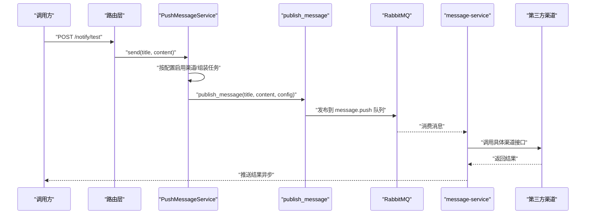
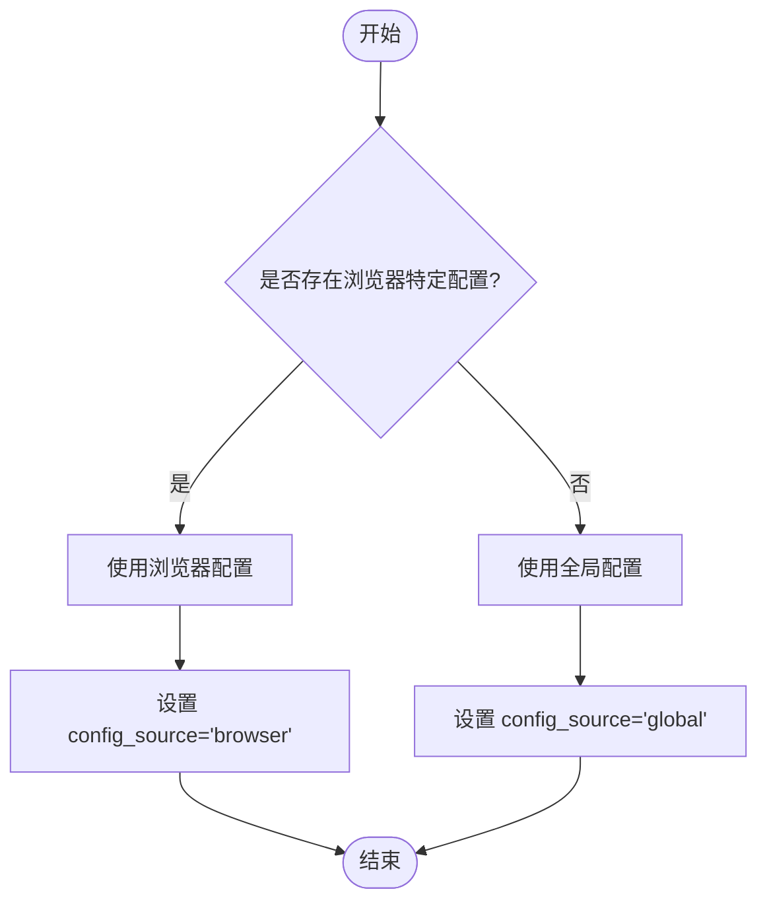
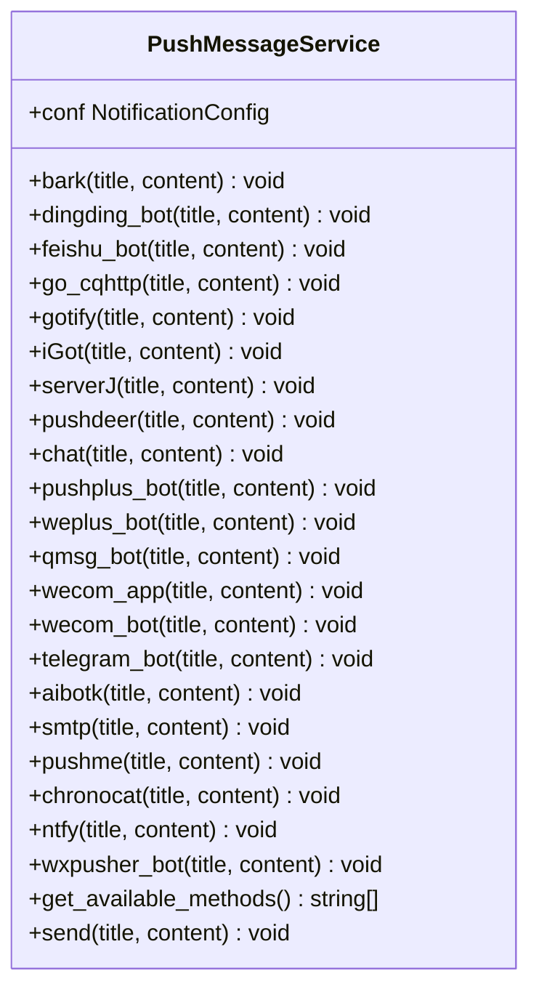
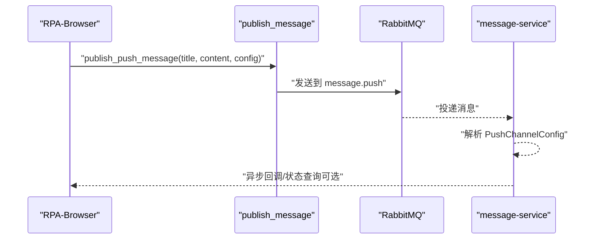
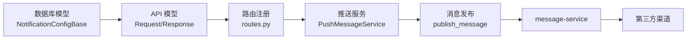

# 系统通知接口

<cite>
**本文引用的文件**
- [RPA-Browser/app/models/database/notify/models.py](file://RPA-Browser/app/models/database/notify/models.py)
- [RPA-Browser/app/models/notify/models.py](file://RPA-Browser/app/models/notify/models.py)
- [RPA-Browser/app/models/notify/request_models.py](file://RPA-Browser/app/models/notify/request_models.py)
- [RPA-Browser/app/models/notify/response_models.py](file://RPA-Browser/app/models/notify/response_models.py)
- [RPA-Browser/app/services/message/message_pub.py](file://RPA-Browser/app/services/message/message_pub.py)
- [RPA-Browser/app/services/message/push_msg.py](file://RPA-Browser/app/services/message/push_msg.py)
- [RPA-Browser/app/routes.py](file://RPA-Browser/app/routes.py)
</cite>

## 目录
1. [简介](#简介)
2. [项目结构](#项目结构)
3. [核心组件](#核心组件)
4. [架构总览](#架构总览)
5. [详细组件分析](#详细组件分析)
6. [依赖关系分析](#依赖关系分析)
7. [性能考量](#性能考量)
8. [故障排查指南](#故障排查指南)
9. [结论](#结论)
10. [附录：API 参考与集成示例](#附录api-参考与集成示例)

## 简介
本文件面向“系统通知与事件提醒”能力，覆盖以下主题：
- 通知类型与优先级：统一的主题标识、渠道优先级与并发推送策略。
- 推送渠道配置：支持 Bark、钉钉、飞书、Server酱、PushDeer、PushPlus、企业微信、Telegram、SMTP、Ntfy、WxPusher、Chronocat、Webhook 等。
- 消息模板管理：通过主题前缀与内容拼装实现模板化输出；支持一言（hitokoto）增强文案。
- 事件订阅与消息推送：基于 RabbitMQ 的异步发布，由 message-service 消费并分发到第三方渠道。
- 通知优先级处理、批量推送、定时发送机制说明与最佳实践。
- 调用示例与集成指南：从浏览器实例级配置到全局配置的生效逻辑，以及测试推送流程。

## 项目结构
RPA-Browser 服务中，通知相关代码主要分布在以下位置：
- 数据模型：数据库表模型与 API 请求/响应模型定义。
- 推送服务：统一推送入口与多渠道实现。
- 消息发布：将推送请求发布至 RabbitMQ 队列，交由 message-service 消费。
- 路由注册：应用启动时挂载控制器路由（通知相关路由通常位于 admin 或 browser 模块）。

图表来源
- [RPA-Browser/app/models/database/notify/models.py:13-157](file://RPA-Browser/app/models/database/notify/models.py#L13-L157)
- [RPA-Browser/app/models/notify/request_models.py:10-42](file://RPA-Browser/app/models/notify/request_models.py#L10-L42)
- [RPA-Browser/app/models/notify/response_models.py:13-167](file://RPA-Browser/app/models/notify/response_models.py#L13-L167)
- [RPA-Browser/app/services/message/push_msg.py:44-800](file://RPA-Browser/app/services/message/push_msg.py#L44-L800)
- [RPA-Browser/app/services/message/message_pub.py:1-41](file://RPA-Browser/app/services/message/message_pub.py#L1-L41)
- [RPA-Browser/app/routes.py:20-48](file://RPA-Browser/app/routes.py#L20-L48)

章节来源
- [RPA-Browser/app/routes.py:20-48](file://RPA-Browser/app/routes.py#L20-L48)

## 核心组件
- 通知配置模型
  - 数据库模型：NotificationConfigBase/NotificationConfig，包含 mid、browser_id 及多通道配置字段。
  - API 模型：创建/更新/读取/删除通知配置的请求与响应模型。
- 推送服务
  - PushMessageService：统一入口，按配置启用各渠道方法，支持并发任务与一言附加。
- 消息发布
  - publish_message：将推送请求以 fire-and-forget 方式发布到 RabbitMQ 的 message.push 队列，交由 message-service 消费。

章节来源
- [RPA-Browser/app/models/database/notify/models.py:13-157](file://RPA-Browser/app/models/database/notify/models.py#L13-L157)
- [RPA-Browser/app/models/notify/models.py:13-107](file://RPA-Browser/app/models/notify/models.py#L13-L107)
- [RPA-Browser/app/models/notify/request_models.py:10-42](file://RPA-Browser/app/models/notify/request_models.py#L10-L42)
- [RPA-Browser/app/models/notify/response_models.py:13-167](file://RPA-Browser/app/models/notify/response_models.py#L13-L167)
- [RPA-Browser/app/services/message/push_msg.py:44-800](file://RPA-Browser/app/services/message/push_msg.py#L44-L800)
- [RPA-Browser/app/services/message/message_pub.py:1-41](file://RPA-Browser/app/services/message/message_pub.py#L1-L41)

## 架构总览
通知推送的整体流程如下：
- 业务侧调用通知接口（如测试推送），构造标题与内容。
- 根据浏览器实例 ID 解析有效配置（优先使用浏览器特定配置，否则回退到全局配置）。
- 通过 PushMessageService.send 选择启用的渠道，并行构建任务列表并执行。
- 对于需要跨服务分发的场景，通过 publish_message 将消息发布到 RabbitMQ，由 message-service 消费后投递到第三方渠道。

图表来源
- [RPA-Browser/app/services/message/push_msg.py:763-800](file://RPA-Browser/app/services/message/push_msg.py#L763-L800)
- [RPA-Browser/app/services/message/message_pub.py:27-41](file://RPA-Browser/app/services/message/message_pub.py#L27-L41)

## 详细组件分析

### 通知配置模型与优先级
- 数据库模型字段
  - mid：用户标识（BIGINT）。
  - browser_id：可选的浏览器实例标识，为空表示全局配置。
  - hitokoto：是否附加一言。
  - 各渠道配置字段：Bark、钉钉、飞书、Server酱、PushDeer、PushPlus、企业微信、Telegram、SMTP、Ntfy、WxPusher、Chronocat、自定义 Webhook 等。
- 优先级规则
  - 若存在浏览器特定配置，则使用该配置；否则使用全局配置。
  - 响应模型中包含 effective_browser_id 与 config_source 字段，用于标识实际生效的配置来源。

图表来源
- [RPA-Browser/app/models/database/notify/models.py:13-157](file://RPA-Browser/app/models/database/notify/models.py#L13-L157)
- [RPA-Browser/app/models/notify/response_models.py:26-167](file://RPA-Browser/app/models/notify/response_models.py#L26-L167)

章节来源
- [RPA-Browser/app/models/database/notify/models.py:13-157](file://RPA-Browser/app/models/database/notify/models.py#L13-L157)
- [RPA-Browser/app/models/notify/response_models.py:26-167](file://RPA-Browser/app/models/notify/response_models.py#L26-L167)

### 推送服务与多渠道实现
- 统一入口
  - PushMessageService.send：根据配置动态启用各渠道方法，构建并发任务列表，依次执行。
  - 支持附加一言（hitokoto）到内容末尾。
- 渠道方法
  - bark、dingding_bot、feishu_bot、go_cqhttp、gotify、iGot、serverJ、pushdeer、chat、pushplus_bot、weplus_bot、qmsg_bot、wecom_app、wecom_bot、telegram_bot、aibotk、smtp、pushme、chronocat、ntfy、wxpusher_bot。
- 错误处理
  - 每个渠道方法内部对响应进行判断，记录成功/失败日志；部分渠道提供重试或兼容旧接口的逻辑。

图表来源
- [RPA-Browser/app/services/message/push_msg.py:44-800](file://RPA-Browser/app/services/message/push_msg.py#L44-L800)

章节来源
- [RPA-Browser/app/services/message/push_msg.py:44-800](file://RPA-Browser/app/services/message/push_msg.py#L44-L800)

### 消息发布与事件订阅
- 发布端
  - publish_message：将推送请求发布到 RabbitMQ 的 message.push 队列，采用 fire-and-forget 模式，不等待消费结果。
  - 复用本服务的 rabbitmq_url 配置，确保连接一致性。
- 消费端
  - message-service 负责消费队列消息，并根据 PushChannelConfig 完成实际推送。
- 事件订阅
  - 通过队列解耦生产与消费，便于扩展新的推送渠道与监听器。

图表来源
- [RPA-Browser/app/services/message/message_pub.py:1-41](file://RPA-Browser/app/services/message/message_pub.py#L1-L41)

章节来源
- [RPA-Browser/app/services/message/message_pub.py:1-41](file://RPA-Browser/app/services/message/message_pub.py#L1-L41)

### 通知类型与模板管理
- 主题标识
  - PushSubject：定义信息、成功、警告、失败四类主题前缀，便于在告警/通知中区分消息性质。
- 模板拼装
  - 统一采用“[主题] 标题\n\n内容”格式；支持附加一言提升可读性。
- 渠道差异
  - 不同渠道对标题、内容、富文本、附件等支持程度不同，需按渠道特性调整内容格式。

章节来源
- [RPA-Browser/app/services/message/push_msg.py:23-42](file://RPA-Browser/app/services/message/push_msg.py#L23-L42)
- [RPA-Browser/app/services/message/push_msg.py:763-772](file://RPA-Browser/app/services/message/push_msg.py#L763-L772)

### 通知优先级与批量推送
- 优先级
  - Gotify：支持 priority 字段控制优先级。
  - Ntfy：支持 Priority 头与主题级别优先级。
- 批量推送
  - send 方法会遍历所有可用方法，按配置启用多个渠道，形成并发任务列表，实现批量推送。
  - 建议在高并发场景下限制并发度，避免对第三方渠道造成压力。

章节来源
- [RPA-Browser/app/services/message/push_msg.py:178-200](file://RPA-Browser/app/services/message/push_msg.py#L178-L200)
- [RPA-Browser/app/services/message/push_msg.py:642-689](file://RPA-Browser/app/services/message/push_msg.py#L642-L689)
- [RPA-Browser/app/services/message/push_msg.py:763-800](file://RPA-Browser/app/services/message/push_msg.py#L763-L800)

### 定时发送机制
- 当前实现未内置定时调度；可通过外部调度器（如 APScheduler、Celery Beat）触发通知接口或发布消息到队列。
- 建议在调度任务中携带 PushChannelConfig，以便 message-service 按目标用户或实例进行精准推送。

[本节为概念性说明，不直接分析具体文件]

## 依赖关系分析
- 模型依赖
  - API 响应模型依赖数据库基础模型，保证字段一致性与序列化安全。
- 服务依赖
  - PushMessageService 依赖 httpx_client 与各渠道 HTTP 接口；依赖 loguru 进行日志记录。
  - publish_message 依赖 bili_common.core.message_pub 与 settings.rabbitmq_url。
- 路由依赖
  - routes.py 集中注册控制器路由与异常处理器，确保统一错误处理与中间件接入。

图表来源
- [RPA-Browser/app/models/database/notify/models.py:13-157](file://RPA-Browser/app/models/database/notify/models.py#L13-L157)
- [RPA-Browser/app/models/notify/request_models.py:10-42](file://RPA-Browser/app/models/notify/request_models.py#L10-L42)
- [RPA-Browser/app/models/notify/response_models.py:13-167](file://RPA-Browser/app/models/notify/response_models.py#L13-L167)
- [RPA-Browser/app/services/message/push_msg.py:44-800](file://RPA-Browser/app/services/message/push_msg.py#L44-L800)
- [RPA-Browser/app/services/message/message_pub.py:1-41](file://RPA-Browser/app/services/message/message_pub.py#L1-L41)
- [RPA-Browser/app/routes.py:20-48](file://RPA-Browser/app/routes.py#L20-L48)

章节来源
- [RPA-Browser/app/routes.py:20-48](file://RPA-Browser/app/routes.py#L20-L48)

## 性能考量
- 并发推送：send 方法构建任务列表，可并行执行多个渠道推送，注意控制并发度以避免第三方限流。
- 超时与重试：HTTP 请求设置合理超时；对关键渠道可增加重试与退避策略。
- 日志与监控：利用 loguru 记录渠道调用结果，结合指标采集定位瓶颈。
- 队列解耦：通过 RabbitMQ 异步发布，降低同步阻塞，提高吞吐。

[本节提供通用指导，不直接分析具体文件]

## 故障排查指南
- 渠道配置缺失
  - 检查对应渠道必填字段是否配置完整（如 token、key、url 等）。
- 网络与认证失败
  - 核对渠道地址、代理配置（如 Telegram 代理）、鉴权头是否正确。
- 响应码异常
  - 查看渠道返回码与错误信息，必要时降级或切换备用渠道。
- 队列消费失败
  - 检查 message-service 运行状态与队列绑定；确认消息格式与 PushChannelConfig 正确。

章节来源
- [RPA-Browser/app/services/message/push_msg.py:111-140](file://RPA-Browser/app/services/message/push_msg.py#L111-L140)
- [RPA-Browser/app/services/message/push_msg.py:441-477](file://RPA-Browser/app/services/message/push_msg.py#L441-L477)
- [RPA-Browser/app/services/message/push_msg.py:521-566](file://RPA-Browser/app/services/message/push_msg.py#L521-L566)

## 结论
本系统通过统一的配置模型与推送服务，实现了多通道、高可用的通知能力。借助 RabbitMQ 的消息队列，生产与消费解耦，便于扩展与运维。建议在生产环境中完善监控与告警，合理配置并发与重试策略，确保通知及时可靠送达。

[本节为总结性内容，不直接分析具体文件]

## 附录：API 参考与集成示例
- 通知配置操作
  - 创建/更新：使用 NotificationConfigCreate/Update 模型提交配置。
  - 删除：使用 NotificationConfigDeleteResp 作为响应模型。
  - 读取有效配置：根据 browser_id 获取生效配置，返回 effective_browser_id 与 config_source。
- 测试推送
  - 使用 TestNotificationRequest/TestNotificationResponse 进行端到端验证，返回 sent_channels 列表。
- 集成要点
  - 在业务侧调用 publish_message 或 PushMessageService.send，传入标题、内容与配置。
  - 如需跨服务推送，确保 RabbitMQ 连接与 message-service 正常。
  - 定时任务可通过外部调度器触发上述接口或发布消息。

章节来源
- [RPA-Browser/app/models/notify/models.py:13-107](file://RPA-Browser/app/models/notify/models.py#L13-L107)
- [RPA-Browser/app/models/notify/request_models.py:10-42](file://RPA-Browser/app/models/notify/request_models.py#L10-L42)
- [RPA-Browser/app/models/notify/response_models.py:13-167](file://RPA-Browser/app/models/notify/response_models.py#L13-L167)
- [RPA-Browser/app/services/message/message_pub.py:27-41](file://RPA-Browser/app/services/message/message_pub.py#L27-L41)
- [RPA-Browser/app/services/message/push_msg.py:763-800](file://RPA-Browser/app/services/message/push_msg.py#L763-L800)