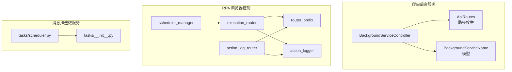
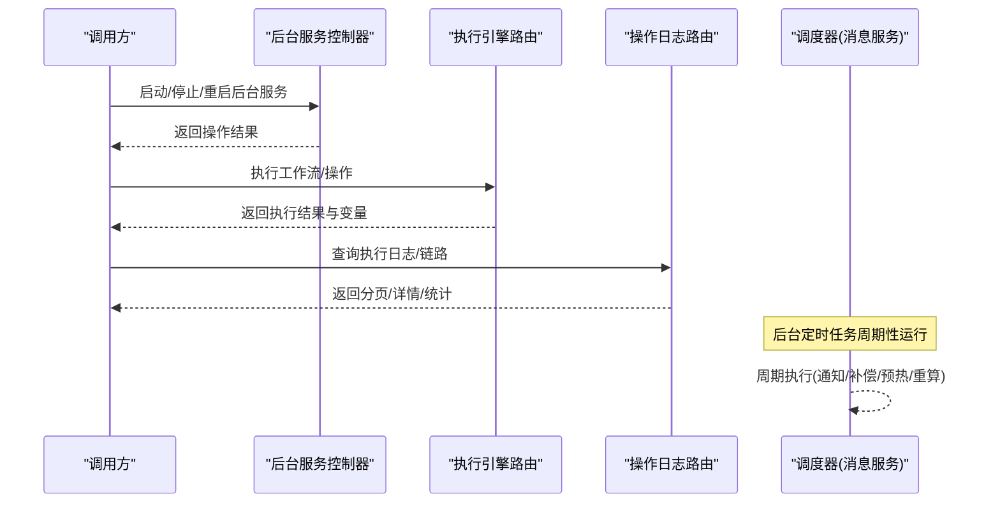
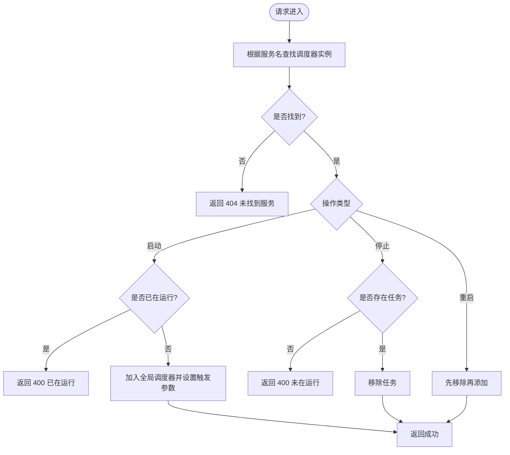
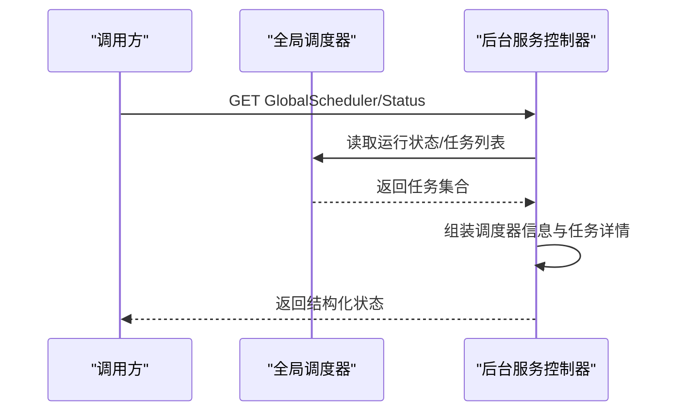
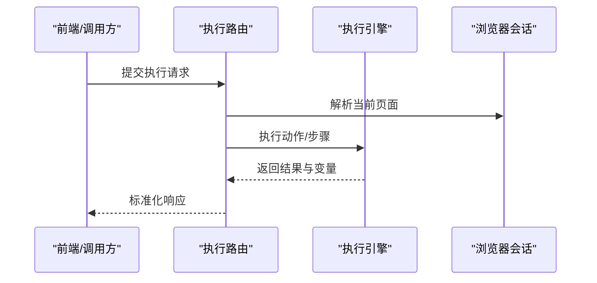
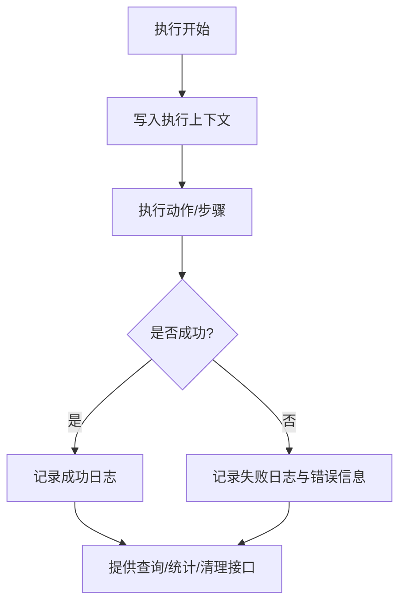
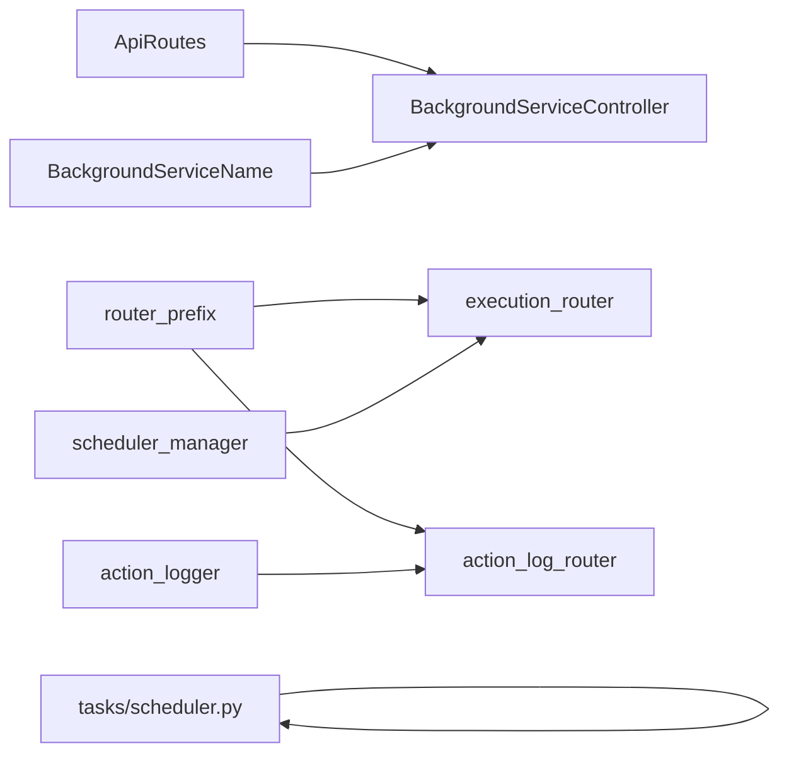

# 任务管理接口

<cite>
**本文引用的文件**
- [BackgroundServiceController.py](file://be-bilibili-crawler/controller/v1/background_service/BackgroundServiceController.py)
- [ApiRoutes/__init__.py](file://be-bilibili-crawler/ApiRoutes/__init__.py)
- [background_service_model.py](file://be-bilibili-crawler/Models/v1/background_service/background_service_model.py)
- [scheduler_manager.py](file://RPA-Browser/app/scheduler_manager.py)
- [execution_router.py](file://RPA-Browser/app/controller/v1/browser_control/execution/execution_router.py)
- [action_log_router.py](file://RPA-Browser/app/controller/v1/browser_control/execution/action_log_router.py)
- [router_prefix.py](file://RPA-Browser/app/models/router/router_prefix.py)
- [action_logger.py](file://RPA-Browser/app/services/execution/action_logger.py)
- [scheduler.py](file://be-message-service/app/tasks/scheduler.py)
- [__init__.py](file://be-message-service/app/tasks/__init__.py)
</cite>

## 目录
1. [简介](#简介)
2. [项目结构](#项目结构)
3. [核心组件](#核心组件)
4. [架构总览](#架构总览)
5. [详细组件分析](#详细组件分析)
6. [依赖关系分析](#依赖关系分析)
7. [性能与稳定性](#性能与稳定性)
8. [故障排查指南](#故障排查指南)
9. [结论](#结论)
10. [附录：接口清单与示例](#附录接口清单与示例)

## 简介
本文件面向后台服务控制、任务调度与状态监控的运维场景，系统化梳理并文档化以下能力：
- 后台爬虫服务的启动、停止、重启
- 全局定时任务的查询与详细状态
- 浏览器操作执行（单步/工作流）与执行日志查询
- 消息推送微服务的定时任务生命周期（启动/关闭）
- 常见任务生命周期管理与运维监控的使用示例

## 项目结构
围绕“任务管理”的核心代码分布在三个子系统中：
- 爬虫后台服务控制器：提供后台爬虫服务的启停、重启以及全局调度器状态查询
- RPA 浏览器控制：提供工作流/操作的执行、预览、验证、单步执行，以及执行日志的查询与管理
- 消息推送微服务：定义并注册系统级定时任务（通知投递标记、死信重试、分片预热、评论热度重算等），并提供调度器的启动与关闭

**图表来源**
- [BackgroundServiceController.py:44-273](file://be-bilibili-crawler/controller/v1/background_service/BackgroundServiceController.py#L44-L273)
- [ApiRoutes/__init__.py:127-139](file://be-bilibili-crawler/ApiRoutes/__init__.py#L127-L139)
- [background_service_model.py:10-25](file://be-bilibili-crawler/Models/v1/background_service/background_service_model.py#L10-L25)
- [execution_router.py:97-233](file://RPA-Browser/app/controller/v1/browser_control/execution/execution_router.py#L97-L233)
- [action_log_router.py:36-158](file://RPA-Browser/app/controller/v1/browser_control/execution/action_log_router.py#L36-L158)
- [router_prefix.py:38-85](file://RPA-Browser/app/models/router/router_prefix.py#L38-L85)
- [scheduler_manager.py:13-172](file://RPA-Browser/app/scheduler_manager.py#L13-L172)
- [scheduler.py:51-302](file://be-message-service/app/tasks/scheduler.py#L51-L302)

**章节来源**
- [BackgroundServiceController.py:44-273](file://be-bilibili-crawler/controller/v1/background_service/BackgroundServiceController.py#L44-L273)
- [execution_router.py:97-233](file://RPA-Browser/app/controller/v1/browser_control/execution/execution_router.py#L97-L233)
- [action_log_router.py:36-158](file://RPA-Browser/app/controller/v1/browser_control/execution/action_log_router.py#L36-L158)
- [scheduler_manager.py:13-172](file://RPA-Browser/app/scheduler_manager.py#L13-L172)
- [scheduler.py:51-302](file://be-message-service/app/tasks/scheduler.py#L51-L302)

## 核心组件
- 后台服务控制器：封装了后台爬虫服务的启停、重启、全局任务列表与详细状态查询
- 执行引擎路由：暴露工作流/操作的执行、预览、验证、单步执行等 API
- 操作日志路由：提供执行日志的分页查询、详情、按批次链路、删除、清空与统计
- 调度管理器：统一的 APScheduler 封装，支持间隔/Cron 任务注册、暂停/恢复、启停
- 消息服务定时任务：集中定义并注册系统级定时任务，提供调度器启动/关闭

**章节来源**
- [BackgroundServiceController.py:92-206](file://be-bilibili-crawler/controller/v1/background_service/BackgroundServiceController.py#L92-L206)
- [execution_router.py:97-233](file://RPA-Browser/app/controller/v1/browser_control/execution/execution_router.py#L97-L233)
- [action_log_router.py:36-158](file://RPA-Browser/app/controller/v1/browser_control/execution/action_log_router.py#L36-L158)
- [scheduler_manager.py:38-172](file://RPA-Browser/app/scheduler_manager.py#L38-L172)
- [scheduler.py:251-302](file://be-message-service/app/tasks/scheduler.py#L251-L302)

## 架构总览
下图展示了从前端/调用方到后端各层的关键交互：请求进入控制器后，可能触发后台服务控制、执行引擎或日志查询；同时系统内存在独立的定时任务调度器在后台运行。

**图表来源**
- [BackgroundServiceController.py:92-206](file://be-bilibili-crawler/controller/v1/background_service/BackgroundServiceController.py#L92-L206)
- [execution_router.py:97-233](file://RPA-Browser/app/controller/v1/browser_control/execution/execution_router.py#L97-L233)
- [action_log_router.py:36-158](file://RPA-Browser/app/controller/v1/browser_control/execution/action_log_router.py#L36-L158)
- [scheduler.py:251-302](file://be-message-service/app/tasks/scheduler.py#L251-L302)

## 详细组件分析

### 后台服务控制（启动/停止/重启/状态）
- 功能要点
  - 启动：根据服务名称枚举查找对应调度器实例，若未运行则加入全局调度器并立即触发一次
  - 停止：若任务已存在则移除
  - 重启：先移除再添加，确保幂等
  - 状态：获取全局调度器基本信息与每个任务的详细信息（含执行信息）
- 关键路径
  - 启动/停止/重启：POST /api/v1/background_service/BackgroundService/{Start,Stop,Restart}
  - 全局任务列表：GET /api/v1/background_service/GlobalSchedule/GetJobs
  - 全局调度器详细状态：GET /api/v1/background_service/GlobalScheduler/Status
  - 后台服务状态聚合：GET /api/v1/background_service/BackgroundService/AllStat

**图表来源**
- [BackgroundServiceController.py:92-206](file://be-bilibili-crawler/controller/v1/background_service/BackgroundServiceController.py#L92-L206)

**章节来源**
- [BackgroundServiceController.py:92-206](file://be-bilibili-crawler/controller/v1/background_service/BackgroundServiceController.py#L92-L206)
- [ApiRoutes/__init__.py:127-139](file://be-bilibili-crawler/ApiRoutes/__init__.py#L127-L139)
- [background_service_model.py:10-25](file://be-bilibili-crawler/Models/v1/background_service/background_service_model.py#L10-L25)

### 任务调度与状态监控（全局调度器）
- 功能要点
  - 获取所有任务字符串表示
  - 获取调度器运行状态、时区、执行器数量、任务数
  - 对每个任务附加执行信息（如爬虫名称、默认间隔、上次执行时间）
- 关键路径
  - GET /api/v1/background_service/GlobalSchedule/GetJobs
  - GET /api/v1/background_service/GlobalScheduler/Status

**图表来源**
- [BackgroundServiceController.py:209-273](file://be-bilibili-crawler/controller/v1/background_service/BackgroundServiceController.py#L209-L273)

**章节来源**
- [BackgroundServiceController.py:209-273](file://be-bilibili-crawler/controller/v1/background_service/BackgroundServiceController.py#L209-L273)

### 浏览器操作与工作流执行
- 功能要点
  - 执行单个操作：传入 action_id、参数、变量、页面索引等
  - 执行工作流：支持 action_id 或 steps 两种模式，可启用插件
  - 预览/验证：在不实际执行的情况下预览参数替换与校验
  - 单步执行：用于复合操作的逐步调试
- 关键路径
  - POST /browser/control/actions/execute
  - POST /browser/control/workflows/execute
  - POST /browser/control/actions/preview
  - POST /browser/control/actions/validate
  - POST /browser/control/actions/execute-step

**图表来源**
- [execution_router.py:97-233](file://RPA-Browser/app/controller/v1/browser_control/execution/execution_router.py#L97-L233)

**章节来源**
- [execution_router.py:97-233](file://RPA-Browser/app/controller/v1/browser_control/execution/execution_router.py#L97-L233)
- [router_prefix.py:38-85](file://RPA-Browser/app/models/router/router_prefix.py#L38-L85)

### 执行日志与异常处理
- 功能要点
  - 日志采集：在执行过程中记录参数、结果、变量、错误信息、耗时、页面 URL 等
  - 日志查询：分页列表、详情、按 execution_id 拉取完整链路、批量删除、条件清空、统计
- 关键路径
  - POST /browser/control/action-logs/list
  - POST /browser/control/action-logs/get
  - POST /browser/control/action-logs/by-execution
  - POST /browser/control/action-logs/delete
  - POST /browser/control/action-logs/clear
  - POST /browser/control/action-logs/stats

**图表来源**
- [action_logger.py:177-213](file://RPA-Browser/app/services/execution/action_logger.py#L177-L213)
- [action_log_router.py:36-158](file://RPA-Browser/app/controller/v1/browser_control/execution/action_log_router.py#L36-L158)

**章节来源**
- [action_logger.py:177-213](file://RPA-Browser/app/services/execution/action_logger.py#L177-L213)
- [action_log_router.py:36-158](file://RPA-Browser/app/controller/v1/browser_control/execution/action_log_router.py#L36-L158)

### 消息服务定时任务（系统级）
- 功能要点
  - 统一注册多个定时任务：通知投递标记、私信死信重试、内容分片预热、评论热度重算
  - 通过配置开关控制是否启用调度器
  - 提供 start_scheduler/shutdown_scheduler 进行生命周期管理
- 关键行为
  - 使用 max_instances=1 + coalesce=True 避免堆积与并发压垮
  - misfire_grace_time 放宽错过执行的宽限，减少噪音告警

**章节来源**
- [scheduler.py:51-302](file://be-message-service/app/tasks/scheduler.py#L51-L302)
- [__init__.py:1-14](file://be-message-service/app/tasks/__init__.py#L1-L14)

## 依赖关系分析
- 后台服务控制器依赖 ApiRoutes 中的路径与标签枚举，以及 BackgroundServiceName 枚举
- 执行路由依赖 router_prefix 中定义的浏览器控制路径
- 日志路由同样依赖 router_prefix 的路径定义，并通过 action_logger 持久化执行数据
- 调度管理器为 RPA 侧提供统一的 APScheduler 封装
- 消息服务定时任务独立于浏览器控制，负责系统级维护任务

**图表来源**
- [ApiRoutes/__init__.py:127-139](file://be-bilibili-crawler/ApiRoutes/__init__.py#L127-L139)
- [background_service_model.py:10-25](file://be-bilibili-crawler/Models/v1/background_service/background_service_model.py#L10-L25)
- [router_prefix.py:38-85](file://RPA-Browser/app/models/router/router_prefix.py#L38-L85)
- [execution_router.py:97-233](file://RPA-Browser/app/controller/v1/browser_control/execution/execution_router.py#L97-L233)
- [action_log_router.py:36-158](file://RPA-Browser/app/controller/v1/browser_control/execution/action_log_router.py#L36-L158)
- [scheduler_manager.py:13-172](file://RPA-Browser/app/scheduler_manager.py#L13-L172)
- [scheduler.py:251-302](file://be-message-service/app/tasks/scheduler.py#L251-L302)

**章节来源**
- [ApiRoutes/__init__.py:127-139](file://be-bilibili-crawler/ApiRoutes/__init__.py#L127-L139)
- [background_service_model.py:10-25](file://be-bilibili-crawler/Models/v1/background_service/background_service_model.py#L10-L25)
- [router_prefix.py:38-85](file://RPA-Browser/app/models/router/router_prefix.py#L38-L85)
- [execution_router.py:97-233](file://RPA-Browser/app/controller/v1/browser_control/execution/execution_router.py#L97-L233)
- [action_log_router.py:36-158](file://RPA-Browser/app/controller/v1/browser_control/execution/action_log_router.py#L36-L158)
- [scheduler_manager.py:13-172](file://RPA-Browser/app/scheduler_manager.py#L13-L172)
- [scheduler.py:251-302](file://be-message-service/app/tasks/scheduler.py#L251-L302)

## 性能与稳定性
- 后台服务控制
  - 启动/停止/重启均基于全局调度器任务 ID 进行幂等操作，避免重复注册
  - 通过 misfire_grace_time 与 max_instances=1 降低抖动与并发压力
- 执行引擎
  - 无状态执行引擎，上下文由 Scope/Pipeline 携带，便于扩展与水平扩展
  - 工作流执行采用 Pipeline 左折叠方式，复杂度 O(N)
- 日志采集
  - 仅记录必要字段（参数、结果、变量、错误、耗时），避免过大负载
  - 支持按 execution_id 拉取完整链路，便于问题定位
- 消息服务定时任务
  - 批量更新采用分批 commit（每批 500 条），降低锁持有时间与连接占用
  - 计数对账已移除，避免高并发下全量对账导致的接口阻塞

[本节为通用性能讨论，不直接分析具体文件]

## 故障排查指南
- 后台服务控制
  - 启动失败：检查服务名是否正确、是否已在运行、全局调度器是否可用
  - 停止失败：确认任务是否存在、调度器是否处于运行状态
- 执行引擎
  - 页面解析失败：检查浏览器会话是否存在、页面索引是否有效
  - 操作未找到：检查 action_id 是否已注册、权限是否通过
- 日志查询
  - 无日志：确认执行时是否开启日志采集、mid 与 browser_id 是否正确
  - 链路不完整：使用 by-execution 接口拉取同一 execution_id 的所有日志
- 消息服务定时任务
  - 任务未执行：检查调度器是否启动、配置开关是否启用
  - 任务堆积：确认 misfire_grace_time 与 coalesce 配置是否合理

**章节来源**
- [BackgroundServiceController.py:92-206](file://be-bilibili-crawler/controller/v1/background_service/BackgroundServiceController.py#L92-L206)
- [execution_router.py:46-61](file://RPA-Browser/app/controller/v1/browser_control/execution/execution_router.py#L46-L61)
- [action_log_router.py:36-158](file://RPA-Browser/app/controller/v1/browser_control/execution/action_log_router.py#L36-L158)
- [scheduler.py:251-302](file://be-message-service/app/tasks/scheduler.py#L251-L302)

## 结论
本仓库提供了完善的任务管理能力：后台服务控制、执行引擎与日志体系、以及系统级定时任务。通过统一的调度器与标准化的响应模型，能够支撑任务的生命周期管理与运维监控。建议在生产环境结合日志与状态接口建立告警与自愈机制，确保任务稳定运行。

[本节为总结性内容，不直接分析具体文件]

## 附录：接口清单与示例

### 后台服务控制
- 启动特定后台爬虫服务
  - 方法：POST
  - 路径：/api/v1/background_service/BackgroundService/Start
  - 查询参数：background_service_name（枚举值）
  - 成功响应：包含 code/msg/data 的标准响应
  - 失败响应：404（未找到服务）、400（已在运行）、500（异常）
- 停止特定后台爬虫服务
  - 方法：POST
  - 路径：/api/v1/background_service/BackgroundService/Stop
  - 查询参数：background_service_name（枚举值）
  - 成功响应：标准响应
  - 失败响应：404（未找到服务）、400（未在运行）、500（异常）
- 重启特定后台爬虫服务
  - 方法：POST
  - 路径：/api/v1/background_service/BackgroundService/Restart
  - 查询参数：background_service_name（枚举值）
  - 成功响应：标准响应
  - 失败响应：404（未找到服务）、500（异常）
- 全局定时任务列表
  - 方法：GET
  - 路径：/api/v1/background_service/GlobalSchedule/GetJobs
  - 响应：任务字符串列表
- 全局定时任务详细状态
  - 方法：GET
  - 路径：/api/v1/background_service/GlobalScheduler/Status
  - 响应：调度器信息与任务详情（含执行信息）
- 后台服务状态聚合
  - 方法：GET
  - 路径：/api/v1/background_service/BackgroundService/AllStat
  - 响应：各服务的状态聚合

**章节来源**
- [BackgroundServiceController.py:92-206](file://be-bilibili-crawler/controller/v1/background_service/BackgroundServiceController.py#L92-L206)
- [BackgroundServiceController.py:209-273](file://be-bilibili-crawler/controller/v1/background_service/BackgroundServiceController.py#L209-L273)
- [ApiRoutes/__init__.py:127-139](file://be-bilibili-crawler/ApiRoutes/__init__.py#L127-L139)
- [background_service_model.py:10-25](file://be-bilibili-crawler/Models/v1/background_service/background_service_model.py#L10-L25)

### 执行与工作流
- 执行单个操作
  - 方法：POST
  - 路径：/browser/control/actions/execute
  - 请求体：action_id、params、variables、input_vars、output_vars、page_index 等
  - 响应：success、data、error、execution_time、action_id、action_name、variables、replaced_params
- 执行工作流
  - 方法：POST
  - 路径：/browser/control/workflows/execute
  - 请求体：action_id 或 workflow_id 或 steps、variables、input_data、output_vars、page_index 等
  - 响应：execution_id、results（每项包含 success、data、error、execution_time、action_id、action_name、variables、replaced_params）、summary
- 预览参数替换结果
  - 方法：POST
  - 路径：/browser/control/actions/preview
  - 请求体：action_id、params、input_vars
  - 响应：action_id、action_name、is_composite、steps_preview、replaced_params、found_params、preview_result、preview_variables
- 验证操作参数
  - 方法：POST
  - 路径：/browser/control/actions/validate
  - 请求体：action_id、params
  - 响应：valid、action_id、action_name、missing_params、invalid_params、errors
- 单步执行操作
  - 方法：POST
  - 路径：/browser/control/actions/execute-step
  - 请求体：action_id、params、variables、step_index、page_index
  - 响应：step_index、action_id、action_name、result（同执行响应）

**章节来源**
- [execution_router.py:97-233](file://RPA-Browser/app/controller/v1/browser_control/execution/execution_router.py#L97-L233)
- [execution_router.py:239-297](file://RPA-Browser/app/controller/v1/browser_control/execution/execution_router.py#L239-L297)
- [execution_router.py:303-388](file://RPA-Browser/app/controller/v1/browser_control/execution/execution_router.py#L303-L388)
- [router_prefix.py:38-85](file://RPA-Browser/app/models/router/router_prefix.py#L38-L85)

### 执行日志
- 查询操作日志列表
  - 方法：POST
  - 路径：/browser/control/action-logs/list
  - 请求体：page、per_page、action_id、execution_id、workflow_id、browser_id、source、status、success、keyword、started_after、started_before、order_desc
  - 响应：分页结构（page、per_page、total、items）
- 获取单条日志详情
  - 方法：POST
  - 路径：/browser/control/action-logs/get
  - 请求体：log_id
  - 响应：日志详情
- 按执行批次查询完整链路
  - 方法：POST
  - 路径：/browser/control/action-logs/by-execution
  - 请求体：execution_id
  - 响应：日志项列表
- 批量删除日志
  - 方法：POST
  - 路径：/browser/control/action-logs/delete
  - 请求体：log_ids
  - 响应：deleted 数量
- 按条件清空日志
  - 方法：POST
  - 路径：/browser/control/action-logs/clear
  - 请求体：筛选条件（同列表）
  - 响应：deleted 数量
- 操作日志统计
  - 方法：POST
  - 路径：/browser/control/action-logs/stats
  - 请求体：days（可选，默认 7）
  - 响应：按 action 聚合的统计数据

**章节来源**
- [action_log_router.py:36-158](file://RPA-Browser/app/controller/v1/browser_control/execution/action_log_router.py#L36-L158)
- [router_prefix.py:76-82](file://RPA-Browser/app/models/router/router_prefix.py#L76-L82)

### 消息服务定时任务（生命周期）
- 启动调度器
  - 入口：start_scheduler()
  - 作用：注册并启动系统级定时任务（通知投递标记、死信重试、分片预热、评论热度重算）
- 关闭调度器
  - 入口：shutdown_scheduler()
  - 作用：安全关闭调度器

**章节来源**
- [scheduler.py:251-302](file://be-message-service/app/tasks/scheduler.py#L251-L302)
- [__init__.py:1-14](file://be-message-service/app/tasks/__init__.py#L1-L14)