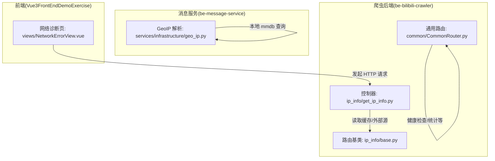
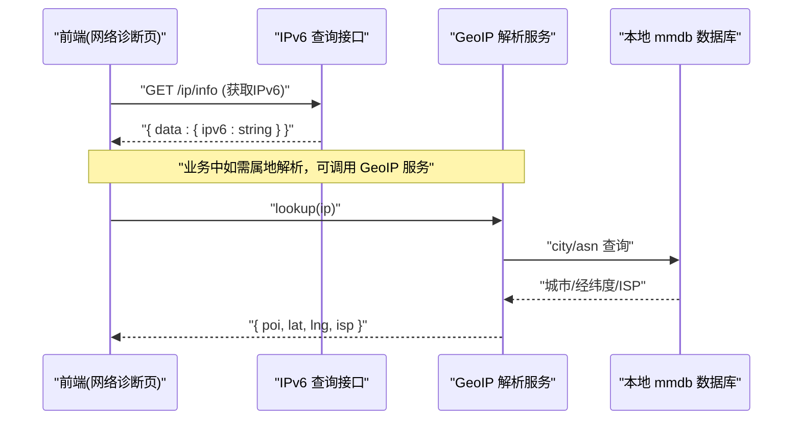
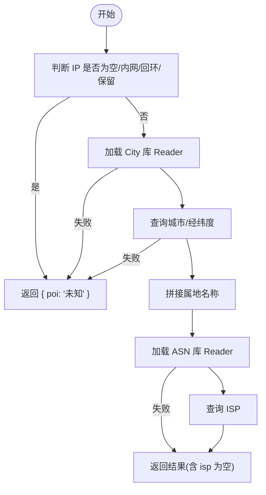
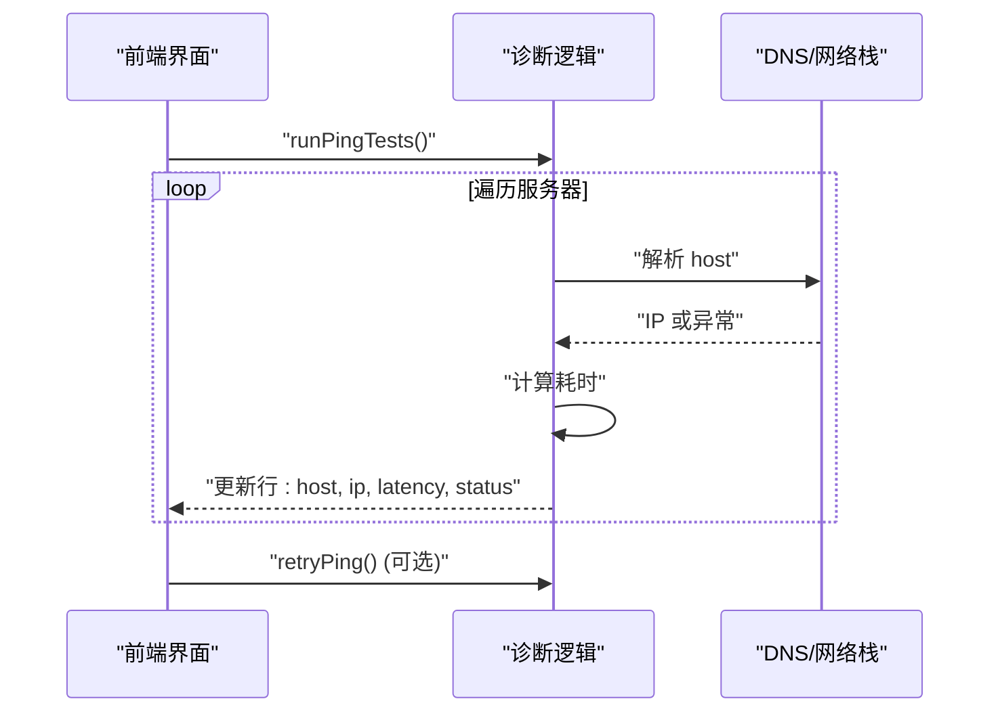
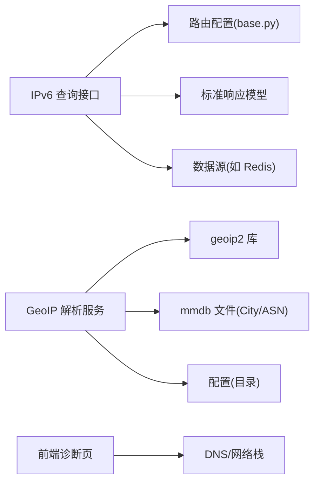

# 工具类接口

<cite>
**本文引用的文件**
- [get_ip_info.py](file://be-bilibili-crawler/controller/v1/ip_info/get_ip_info.py)
- [base.py](file://be-bilibili-crawler/controller/v1/ip_info/base.py)
- [CommonRouter.py](file://be-bilibili-crawler/controller/common/CommonRouter.py)
- [geo_ip.py](file://be-message-service/app/services/infrastructure/geo_ip.py)
- [NetworkErrorView.vue](file://Vue3FrontEndDemoExercise/src/views/NetworkErrorView.vue)
</cite>

## 目录
1. [简介](#简介)
2. [项目结构](#项目结构)
3. [核心组件](#核心组件)
4. [架构总览](#架构总览)
5. [详细组件分析](#详细组件分析)
6. [依赖关系分析](#依赖关系分析)
7. [性能考虑](#性能考虑)
8. [故障排查指南](#故障排查指南)
9. [结论](#结论)
10. [附录](#附录)

## 简介
本章节面向“工具类”相关 API，聚焦以下能力：
- IP 地址信息查询（IPv6）
- 地理位置解析（基于本地 mmdb 的属地、经纬度与 ISP 信息）
- 网络连通性检测（前端侧 ping 诊断）

文档将说明各接口的用途、参数校验、响应格式、错误处理机制，并提供请求与响应的示例，覆盖常见使用场景。

## 项目结构
围绕工具类能力的代码主要分布在三个位置：
- be-bilibili-crawler：提供 IPv6 查询接口与通用路由模板
- be-message-service：提供 GeoIP 属地解析服务（City/ASN）
- Vue3FrontEndDemoExercise：提供前端网络诊断页面（ping 测试）

图表来源
- [get_ip_info.py:1-17](file://be-bilibili-crawler/controller/v1/ip_info/get_ip_info.py#L1-L17)
- [base.py:1-14](file://be-bilibili-crawler/controller/v1/ip_info/base.py#L1-L14)
- [CommonRouter.py:1-175](file://be-bilibili-crawler/controller/common/CommonRouter.py#L1-L175)
- [geo_ip.py:1-134](file://be-message-service/app/services/infrastructure/geo_ip.py#L1-L134)
- [NetworkErrorView.vue:99-232](file://Vue3FrontEndDemoExercise/src/views/NetworkErrorView.vue#L99-L232)

章节来源
- [get_ip_info.py:1-17](file://be-bilibili-crawler/controller/v1/ip_info/get_ip_info.py#L1-L17)
- [base.py:1-14](file://be-bilibili-crawler/controller/v1/ip_info/base.py#L1-L14)
- [CommonRouter.py:1-175](file://be-bilibili-crawler/controller/common/CommonRouter.py#L1-L175)
- [geo_ip.py:1-134](file://be-message-service/app/services/infrastructure/geo_ip.py#L1-L134)
- [NetworkErrorView.vue:99-232](file://Vue3FrontEndDemoExercise/src/views/NetworkErrorView.vue#L99-L232)

## 核心组件
- IPv6 查询接口：返回当前可用的 IPv6 地址（来源于 Redis 或空字符串）
- GeoIP 解析服务：根据客户端 IP 解析属地（国家/省/市）、经纬度与运营商（ISP），失败时降级为“未知”
- 前端网络诊断：对多个目标主机进行 DNS 解析与耗时测量，展示连通性与延迟

章节来源
- [get_ip_info.py:1-17](file://be-bilibili-crawler/controller/v1/ip_info/get_ip_info.py#L1-L17)
- [geo_ip.py:1-134](file://be-message-service/app/services/infrastructure/geo_ip.py#L1-L134)
- [NetworkErrorView.vue:99-232](file://Vue3FrontEndDemoExercise/src/views/NetworkErrorView.vue#L99-L232)

## 架构总览
下图展示了从前端到后端的工具类调用链路，以及内部数据流：

图表来源
- [get_ip_info.py:1-17](file://be-bilibili-crawler/controller/v1/ip_info/get_ip_info.py#L1-L17)
- [geo_ip.py:1-134](file://be-message-service/app/services/infrastructure/geo_ip.py#L1-L134)

## 详细组件分析

### IPv6 查询接口
- 功能：获取当前可用的 IPv6 地址
- 路径与方法：GET /ip/info（由 base.py 中的 prefix 与 tags 配置）
- 请求参数：无
- 响应模型：标准响应体，data.ipv6 为字符串（可能为空）
- 错误处理：未定义业务异常；若底层读取失败，通常返回空字符串
- 典型请求示例：
  - GET /ip/info
- 典型响应示例：
  - { "code": 0, "msg": "success", "data": { "ipv6": "2001:db8::1" } }
  - { "code": 0, "msg": "success", "data": { "ipv6": "" } }

章节来源
- [get_ip_info.py:1-17](file://be-bilibili-crawler/controller/v1/ip_info/get_ip_info.py#L1-L17)
- [base.py:1-14](file://be-bilibili-crawler/controller/v1/ip_info/base.py#L1-L14)

### 地理位置解析（GeoIP）
- 功能：根据 IP 解析属地（国家/省/市）、经纬度与 ISP
- 入口函数：lookup(ip)、lookup_poi(ip)
- 输入参数：
  - ip: 可选字符串；为空或内网/回环/保留地址时直接返回“未知”
- 输出结果：
  - GeoIpResult：包含 poi（属地名称）、lat/lng（经纬度，可能为空）、isp（运营商，可能为空）
- 降级策略：mmdb 缺失、解析失败、非公网 IP 均返回“未知”，不抛异常
- 依赖资源：
  - City 库：GeoLite2-City.mmdb
  - ASN 库：GeoLite2-ASN.mmdb
- 典型调用示例（伪代码）：
  - lookup("1.2.3.4") -> { poi: "浙江 杭州", lat: 30.25, lng: 120.16, isp: "中国电信" }
  - lookup_poi("1.2.3.4") -> "浙江 杭州"

图表来源
- [geo_ip.py:1-134](file://be-message-service/app/services/infrastructure/geo_ip.py#L1-L134)

章节来源
- [geo_ip.py:1-134](file://be-message-service/app/services/infrastructure/geo_ip.py#L1-L134)

### 网络连通性检测（前端诊断）
- 功能：对多个目标主机执行 DNS 解析与耗时测量，展示状态与延迟
- 触发方式：页面挂载后自动执行；支持手动重试
- 关键流程：
  - 遍历服务器列表
  - 区分本机与外部主机
  - 记录解析到的 IP、耗时、成功/失败状态
- 输出字段：host、ip、latency(ms)、status(success/error/pending)
- 错误处理：捕获异常并标记失败；超时或不可达视为失败

图表来源
- [NetworkErrorView.vue:99-232](file://Vue3FrontEndDemoExercise/src/views/NetworkErrorView.vue#L99-L232)

章节来源
- [NetworkErrorView.vue:99-232](file://Vue3FrontEndDemoExercise/src/views/NetworkErrorView.vue#L99-L232)

### 通用健康检查与统计（辅助工具）
- 健康检查：GET /health（用于验证服务存活与依赖连接）
- LLM 统计：GET /llm/stats（返回云端 LLM 实例的使用统计）
- 这些接口可作为系统可用性自检与监控的基础

章节来源
- [CommonRouter.py:1-175](file://be-bilibili-crawler/controller/common/CommonRouter.py#L1-L175)

## 依赖关系分析
- IPv6 查询接口依赖：
  - 路由前缀与标签（base.py）
  - 统一响应模型（StandardResponse）
  - 数据源（Redis 或其他缓存/服务）
- GeoIP 解析服务依赖：
  - geoip2 库与本地 mmdb 文件
  - 配置项（mmdb 目录）
- 前端诊断依赖：
  - 浏览器 DNS 解析能力
  - 计时与异常捕获

图表来源
- [base.py:1-14](file://be-bilibili-crawler/controller/v1/ip_info/base.py#L1-L14)
- [get_ip_info.py:1-17](file://be-bilibili-crawler/controller/v1/ip_info/get_ip_info.py#L1-L17)
- [geo_ip.py:1-134](file://be-message-service/app/services/infrastructure/geo_ip.py#L1-L134)
- [NetworkErrorView.vue:99-232](file://Vue3FrontEndDemoExercise/src/views/NetworkErrorView.vue#L99-L232)

章节来源
- [base.py:1-14](file://be-bilibili-crawler/controller/v1/ip_info/base.py#L1-L14)
- [get_ip_info.py:1-17](file://be-bilibili-crawler/controller/v1/ip_info/get_ip_info.py#L1-L17)
- [geo_ip.py:1-134](file://be-message-service/app/services/infrastructure/geo_ip.py#L1-L134)
- [NetworkErrorView.vue:99-232](file://Vue3FrontEndDemoExercise/src/views/NetworkErrorView.vue#L99-L232)

## 性能考虑
- IPv6 查询：
  - 建议缓存热点 IPv6，减少重复查询开销
  - 控制并发与超时，避免阻塞主线程
- GeoIP 解析：
  - mmdb Reader 懒加载且进程级缓存，避免频繁打开文件
  - 对非公网 IP 快速返回“未知”，减少无效查询
  - 合理设置 mmdb 目录权限与磁盘 IO 性能
- 前端诊断：
  - 批量请求时注意并发限制，避免触发浏览器限流
  - 对超时与异常做快速失败，提升用户体验

[本节为通用指导，无需特定文件引用]

## 故障排查指南
- IPv6 查询返回空：
  - 检查数据源是否可用（如 Redis）
  - 确认路由前缀与路径是否正确
- GeoIP 解析结果为“未知”：
  - 确认 mmdb 文件存在且可读
  - 确认传入 IP 为公网地址
  - 查看日志中关于 mmdb 缺失或未命中的提示
- 前端诊断全部失败：
  - 检查 DNS 解析是否正常
  - 检查目标主机是否可达
  - 查看控制台异常与网络面板

章节来源
- [get_ip_info.py:1-17](file://be-bilibili-crawler/controller/v1/ip_info/get_ip_info.py#L1-L17)
- [geo_ip.py:1-134](file://be-message-service/app/services/infrastructure/geo_ip.py#L1-L134)
- [NetworkErrorView.vue:99-232](file://Vue3FrontEndDemoExercise/src/views/NetworkErrorView.vue#L99-L232)

## 结论
本工具类提供了三类实用能力：IPv6 查询、GeoIP 属地解析与前端网络诊断。通过统一的响应模型与降级策略，确保在异常情况下仍能提供稳定结果。建议在集成时关注缓存、超时与日志，以获得更好的性能与可观测性。

[本节为总结，无需特定文件引用]

## 附录
- 常用接口速查
  - IPv6 查询：GET /ip/info
  - 健康检查：GET /health
  - LLM 统计：GET /llm/stats
- 数据模型参考
  - 标准响应体：{ code, msg, data }
  - IPv6 响应：data.ipv6 为字符串
  - GeoIP 结果：{ poi, lat, lng, isp }

[本节为补充信息，无需特定文件引用]