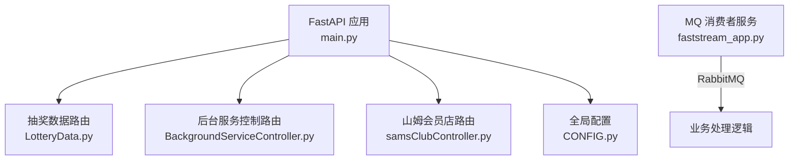
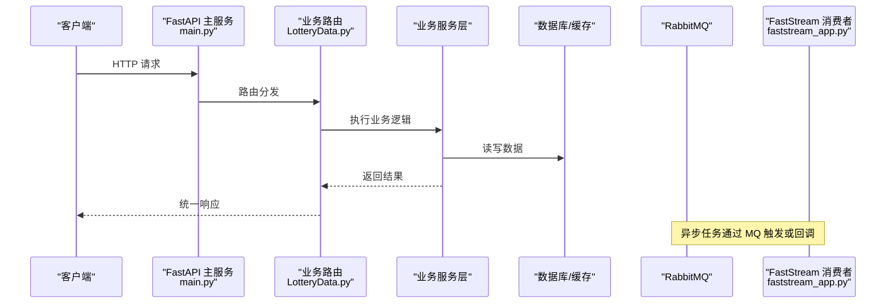
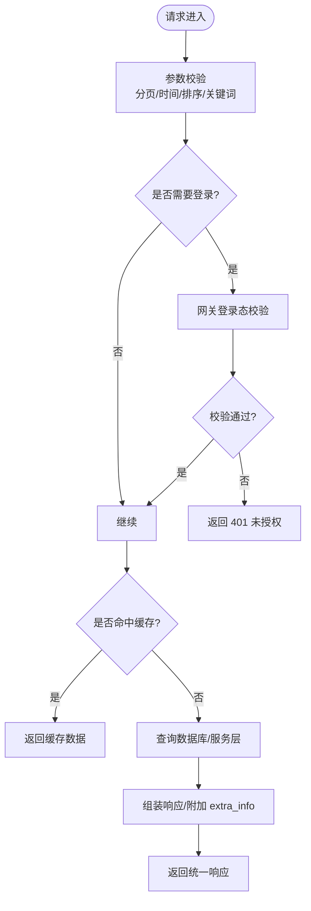
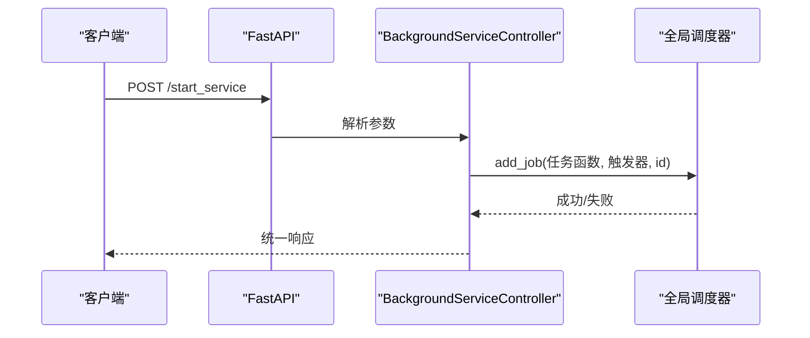
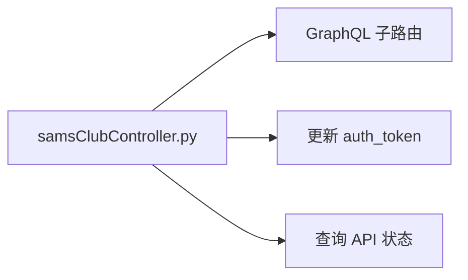
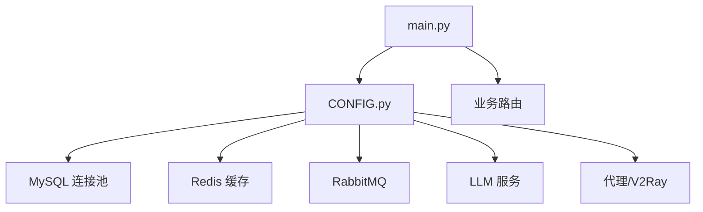

# 数据采集接口

<cite>
**本文引用的文件**
- [main.py](file://be-bilibili-crawler/main.py)
- [CONFIG.py](file://be-bilibili-crawler/CONFIG.py)
- [LotteryData.py](file://be-bilibili-crawler/controller/v1/lotttery_database/bili/LotteryData.py)
- [BackgroundServiceController.py](file://be-bilibili-crawler/controller/v1/background_service/BackgroundServiceController.py)
- [samsClubController.py](file://be-bilibili-crawler/controller/v1/samsClub/samsClubController.py)
- [faststream_app.py](file://be-bilibili-crawler/faststream_app.py)
</cite>

## 目录
1. [简介](#简介)
2. [项目结构](#项目结构)
3. [核心组件](#核心组件)
4. [架构总览](#架构总览)
5. [详细组件分析](#详细组件分析)
6. [依赖关系分析](#依赖关系分析)
7. [性能考虑](#性能考虑)
8. [故障排查指南](#故障排查指南)
9. [结论](#结论)
10. [附录：API 规范与示例](#附录api-规范与示例)

## 简介
本接口文档面向数据采集相关功能，覆盖 B 站动态采集、官方抽奖数据获取、山姆会员店数据采集等核心能力。文档聚焦 RESTful API 的请求参数验证、响应数据格式、错误处理机制，并说明数据采集任务的启动、监控与结果获取方法。同时提供常见使用场景（动态抓取、评论获取、用户信息收集）的调用流程与示例。

## 项目结构
后端服务基于 FastAPI 构建，入口在 main.py，集中注册各业务路由；配置集中在 CONFIG.py；具体业务路由包括：
- 抽奖数据查询与入库：controller/v1/lotttery_database/bili/LotteryData.py
- 后台任务调度与控制：controller/v1/background_service/BackgroundServiceController.py
- 山姆会员店数据采集：controller/v1/samsClub/samsClubController.py
- 消息队列消费者服务：faststream_app.py（独立端口，用于 MQ 消费）

图表来源
- [main.py:48-60](file://be-bilibili-crawler/main.py#L48-L60)
- [LotteryData.py:78-79](file://be-bilibili-crawler/controller/v1/lotttery_database/bili/LotteryData.py#L78-L79)
- [BackgroundServiceController.py:34-34](file://be-bilibili-crawler/controller/v1/background_service/BackgroundServiceController.py#L34-L34)
- [samsClubController.py:8-8](file://be-bilibili-crawler/controller/v1/samsClub/samsClubController.py#L8-L8)
- [faststream_app.py:39-41](file://be-bilibili-crawler/faststream_app.py#L39-L41)
- [CONFIG.py:225-277](file://be-bilibili-crawler/CONFIG.py#L225-L277)

章节来源
- [main.py:48-60](file://be-bilibili-crawler/main.py#L48-L60)
- [CONFIG.py:225-277](file://be-bilibili-crawler/CONFIG.py#L225-L277)

## 核心组件
- 统一响应模型：所有接口返回统一包装结构，包含 code、msg、data。
- 缓存策略：部分查询接口启用内存缓存（如 180 秒），降低数据库压力。
- 鉴权与网关：第三方抽奖动态提交与列表接口通过网关注入登录态校验。
- 后台任务：支持异步执行耗时任务（如解析动态详情、入库）。
- 调度器：提供后台爬虫服务的启停、重启与状态查询。

章节来源
- [LotteryData.py:96-131](file://be-bilibili-crawler/controller/v1/lotttery_database/bili/LotteryData.py#L96-L131)
- [LotteryData.py:375-433](file://be-bilibili-crawler/controller/v1/lotttery_database/bili/LotteryData.py#L375-L433)
- [BackgroundServiceController.py:92-131](file://be-bilibili-crawler/controller/v1/background_service/BackgroundServiceController.py#L92-L131)

## 架构总览
系统由 FastAPI 主服务与 FastStream 消费者服务组成，前者暴露 REST API，后者负责消息队列消费与异步数据处理。配置中心统一管理数据库、缓存、代理、LLM 等外部依赖。

图表来源
- [main.py:48-60](file://be-bilibili-crawler/main.py#L48-L60)
- [LotteryData.py:96-131](file://be-bilibili-crawler/controller/v1/lotttery_database/bili/LotteryData.py#L96-L131)
- [faststream_app.py:39-41](file://be-bilibili-crawler/faststream_app.py#L39-L41)

## 详细组件分析

### B 站动态与抽奖数据接口（LotteryData）
- 功能范围
  - 预约抽奖、官方抽奖、充电抽奖、直播抽奖、话题抽奖的查询与分页
  - 动态提交解析入库（官方/预约/充电/第三方）
  - 关键词搜索与元数据筛选参数获取
  - 爬虫状态查询（单个/全部）
- 关键特性
  - 高级筛选：时间预设、发布时间区间、收录时间区间、参与者数量区间、关键词、排序字段与方向
  - 缓存：部分查询接口启用短期缓存
  - 鉴权：第三方抽奖动态提交与列表需登录态（网关注入）
  - 后台任务：提交后异步处理动态详情与解析入库

图表来源
- [LotteryData.py:96-131](file://be-bilibili-crawler/controller/v1/lotttery_database/bili/LotteryData.py#L96-L131)
- [LotteryData.py:496-582](file://be-bilibili-crawler/controller/v1/lotttery_database/bili/LotteryData.py#L496-L582)

章节来源
- [LotteryData.py:96-131](file://be-bilibili-crawler/controller/v1/lotttery_database/bili/LotteryData.py#L96-L131)
- [LotteryData.py:134-170](file://be-bilibili-crawler/controller/v1/lotttery_database/bili/LotteryData.py#L134-L170)
- [LotteryData.py:173-207](file://be-bilibili-crawler/controller/v1/lotttery_database/bili/LotteryData.py#L173-L207)
- [LotteryData.py:210-226](file://be-bilibili-crawler/controller/v1/lotttery_database/bili/LotteryData.py#L210-L226)
- [LotteryData.py:229-247](file://be-bilibili-crawler/controller/v1/lotttery_database/bili/LotteryData.py#L229-L247)
- [LotteryData.py:250-303](file://be-bilibili-crawler/controller/v1/lotttery_database/bili/LotteryData.py#L250-L303)
- [LotteryData.py:309-340](file://be-bilibili-crawler/controller/v1/lotttery_database/bili/LotteryData.py#L309-L340)
- [LotteryData.py:343-372](file://be-bilibili-crawler/controller/v1/lotttery_database/bili/LotteryData.py#L343-L372)
- [LotteryData.py:375-433](file://be-bilibili-crawler/controller/v1/lotttery_database/bili/LotteryData.py#L375-L433)
- [LotteryData.py:436-453](file://be-bilibili-crawler/controller/v1/lotttery_database/bili/LotteryData.py#L436-L453)
- [LotteryData.py:456-493](file://be-bilibili-crawler/controller/v1/lotttery_database/bili/LotteryData.py#L456-L493)
- [LotteryData.py:496-582](file://be-bilibili-crawler/controller/v1/lotttery_database/bili/LotteryData.py#L496-L582)
- [LotteryData.py:585-625](file://be-bilibili-crawler/controller/v1/lotttery_database/bili/LotteryData.py#L585-L625)

### 后台服务与任务调度（BackgroundServiceController）
- 功能范围
  - 启动/停止/重启指定后台爬虫服务
  - 查询全局定时任务与详细状态
  - 查询代理状态与后台服务统计
- 关键特性
  - 通过调度器管理任务生命周期，避免重复运行
  - 提供任务执行信息与调度器运行状态

图表来源
- [BackgroundServiceController.py:92-131](file://be-bilibili-crawler/controller/v1/background_service/BackgroundServiceController.py#L92-L131)
- [BackgroundServiceController.py:209-273](file://be-bilibili-crawler/controller/v1/background_service/BackgroundServiceController.py#L209-L273)

章节来源
- [BackgroundServiceController.py:44-64](file://be-bilibili-crawler/controller/v1/background_service/BackgroundServiceController.py#L44-L64)
- [BackgroundServiceController.py:67-89](file://be-bilibili-crawler/controller/v1/background_service/BackgroundServiceController.py#L67-L89)
- [BackgroundServiceController.py:92-131](file://be-bilibili-crawler/controller/v1/background_service/BackgroundServiceController.py#L92-L131)
- [BackgroundServiceController.py:134-164](file://be-bilibili-crawler/controller/v1/background_service/BackgroundServiceController.py#L134-L164)
- [BackgroundServiceController.py:167-206](file://be-bilibili-crawler/controller/v1/background_service/BackgroundServiceController.py#L167-L206)
- [BackgroundServiceController.py:209-273](file://be-bilibili-crawler/controller/v1/background_service/BackgroundServiceController.py#L209-L273)

### 山姆会员店数据采集（SamsClub）
- 功能范围
  - 更新认证令牌（auth_token）
  - 暴露 GraphQL 子路由（用于复杂查询）
  - 查询 API 状态
- 关键特性
  - 通过独立控制器挂载 GraphQL 应用
  - 提供健康检查式状态接口

图表来源
- [samsClubController.py:11-27](file://be-bilibili-crawler/controller/v1/samsClub/samsClubController.py#L11-L27)

章节来源
- [samsClubController.py:11-27](file://be-bilibili-crawler/controller/v1/samsClub/samsClubController.py#L11-L27)

### 消息队列消费者服务（FastStream）
- 功能范围
  - 独立 FastAPI 应用，仅包含路由注册与缓存初始化
  - 作为 RabbitMQ 消费者/发布者的承载服务
- 关键特性
  - 与主服务解耦，便于扩展 MQ 处理能力

章节来源
- [faststream_app.py:34-46](file://be-bilibili-crawler/faststream_app.py#L34-L46)

## 依赖关系分析
- 配置依赖
  - 数据库连接池、Redis、RabbitMQ、LLM、代理等通过 CONFIG.py 集中管理
  - 多数据库 URI 与 Redis DB 索引按业务隔离
- 运行时依赖
  - FastAPI 中间件记录请求日志（调试模式）
  - 全局异常处理器统一返回错误码与推送告警

图表来源
- [CONFIG.py:225-277](file://be-bilibili-crawler/CONFIG.py#L225-L277)
- [CONFIG.py:330-483](file://be-bilibili-crawler/CONFIG.py#L330-L483)
- [main.py:48-60](file://be-bilibili-crawler/main.py#L48-L60)

章节来源
- [CONFIG.py:225-277](file://be-bilibili-crawler/CONFIG.py#L225-L277)
- [CONFIG.py:330-483](file://be-bilibili-crawler/CONFIG.py#L330-L483)

## 性能考虑
- 缓存策略：查询类接口采用短期缓存（如 180 秒），减少数据库压力
- 并发与批处理：批量提交接口使用并行聚合，提升吞吐
- 连接池：SQLAlchemy 连接池配置避免陈旧连接与资源耗尽
- 日志与监控：中间件记录请求耗时与详情（调试模式），便于定位瓶颈

[本节为通用指导，不直接分析具体文件]

## 故障排查指南
- 全局异常处理
  - 捕获未处理异常，记录请求 URL、方法、客户端 IP 与堆栈
  - 统一返回 500 错误码与错误消息，并推送告警
- 常见问题
  - 登录态校验失败：第三方接口需携带网关注入的登录头，否则返回 401
  - 参数校验失败：分页、时间戳、枚举值等需符合约束
  - 任务重复运行：调度器会检测已有任务，避免重复添加

章节来源
- [main.py:63-112](file://be-bilibili-crawler/main.py#L63-L112)
- [LotteryData.py:375-433](file://be-bilibili-crawler/controller/v1/lotttery_database/bili/LotteryData.py#L375-L433)
- [BackgroundServiceController.py:92-131](file://be-bilibili-crawler/controller/v1/background_service/BackgroundServiceController.py#L92-L131)

## 结论
本数据采集服务以 FastAPI 为核心，提供统一的 RESTful API 与异步处理能力，覆盖 B 站动态与抽奖数据、山姆会员店数据采集等场景。通过集中配置、缓存与调度器，实现高可用与可扩展的数据采集流水线。建议在生产环境开启必要鉴权、合理设置缓存与连接池参数，并结合监控与告警保障稳定性。

[本节为总结性内容，不直接分析具体文件]

## 附录：API 规范与示例

### 统一响应格式
- 结构
  - code: 整数，业务状态码（0 表示成功）
  - msg: 字符串，提示信息
  - data: 任意类型，业务数据
- 错误码
  - 500：服务端异常（全局异常处理器）
  - 401：未授权（网关登录态校验失败）
  - 400：参数错误或业务冲突（如任务已在运行）
  - 404：资源或服务不存在

章节来源
- [main.py:94-112](file://be-bilibili-crawler/main.py#L94-L112)
- [BackgroundServiceController.py:92-131](file://be-bilibili-crawler/controller/v1/background_service/BackgroundServiceController.py#L92-L131)

### B 站动态与抽奖数据接口

#### 获取预约抽奖数据
- 方法：POST
- 路径：/v1/lottery/get_reserve_lottery（由 RouterPaths 定义）
- 请求体：分页与高级筛选参数（页码、每页大小、时间预设/起止、发送者 UID、参与者数量区间、关键词、排序字段与方向、是否大奖）
- 响应：分页结果（items + total），附带额外信息（extra_info）
- 缓存：启用短期缓存

章节来源
- [LotteryData.py:96-131](file://be-bilibili-crawler/controller/v1/lotttery_database/bili/LotteryData.py#L96-L131)

#### 获取官方抽奖数据
- 方法：POST
- 路径：/v1/lottery/get_official_lottery
- 请求体：同预约抽奖的高级筛选参数
- 响应：分页结果（items + total）
- 缓存：启用短期缓存

章节来源
- [LotteryData.py:134-170](file://be-bilibili-crawler/controller/v1/lotttery_database/bili/LotteryData.py#L134-L170)

#### 获取充电抽奖数据
- 方法：POST
- 路径：/v1/lottery/get_charge_lottery
- 请求体：同预约抽奖的高级筛选参数
- 响应：分页结果（items + total）
- 缓存：启用短期缓存

章节来源
- [LotteryData.py:173-207](file://be-bilibili-crawler/controller/v1/lotttery_database/bili/LotteryData.py#L173-L207)

#### 获取直播抽奖数据
- 方法：POST
- 路径：/v1/lottery/get_live_lottery
- 请求体：分页参数（page_num, page_size）
- 响应：分页结果（items + total）
- 缓存：启用短期缓存

章节来源
- [LotteryData.py:210-226](file://be-bilibili-crawler/controller/v1/lotttery_database/bili/LotteryData.py#L210-L226)

#### 获取话题抽奖数据
- 方法：POST
- 路径：/v1/lottery/get_topic_lottery
- 请求体：分页参数与关键词
- 响应：分页结果（items + total）
- 缓存：启用短期缓存

章节来源
- [LotteryData.py:229-247](file://be-bilibili-crawler/controller/v1/lotttery_database/bili/LotteryData.py#L229-L247)

#### 获取所有抽奖信息
- 方法：POST
- 路径：/v1/lottery/get_all_lottery
- 查询参数：收录时间预设/起止、发布时间预设/起止、页码、每页大小
- 响应：AllLotteryResp（含分页与过滤后的数据）

章节来源
- [LotteryData.py:250-303](file://be-bilibili-crawler/controller/v1/lotttery_database/bili/LotteryData.py#L250-L303)

#### 提交抽奖动态（官方/预约/充电）
- 方法：POST
- 路径：/v1/lottery/add_dynamic_lottery
- 请求体：dynamic_id_or_url
- 响应：AddDynamicLotteryResp（解析结果）
- 缓存：写入缓存（长时）

章节来源
- [LotteryData.py:309-340](file://be-bilibili-crawler/controller/v1/lotttery_database/bili/LotteryData.py#L309-L340)

#### 批量提交抽奖动态
- 方法：POST
- 路径：/v1/lottery/bulk_add_dynamic_lottery
- 请求体：dynamic_id_or_urls（数组）
- 响应：list[AddDynamicLotteryResp]

章节来源
- [LotteryData.py:326-340](file://be-bilibili-crawler/controller/v1/lotttery_database/bili/LotteryData.py#L326-L340)

#### 提交话题抽奖
- 方法：POST
- 路径：/v1/lottery/add_topic_lottery
- 请求体：topic_id
- 响应：AddTopicLotteryResp

章节来源
- [LotteryData.py:343-372](file://be-bilibili-crawler/controller/v1/lotttery_database/bili/LotteryData.py#L343-L372)

#### 批量提交话题抽奖
- 方法：POST
- 路径：/v1/lottery/bulk_add_topic_lottery
- 请求体：topic_ids（数组）
- 响应：list[AddTopicLotteryResp]

章节来源
- [LotteryData.py:360-372](file://be-bilibili-crawler/controller/v1/lotttery_database/bili/LotteryData.py#L360-L372)

#### 提交第三方抽奖动态（需登录）
- 方法：POST
- 路径：/v1/lottery/add_others_lot_dyn
- 请求体：dynamic_id_or_url
- 响应：AddDynamicLotteryResp
- 鉴权：需要网关注入的登录态
- 后台任务：异步处理动态详情与解析入库

章节来源
- [LotteryData.py:375-433](file://be-bilibili-crawler/controller/v1/lotttery_database/bili/LotteryData.py#L375-L433)

#### 批量提交第三方抽奖动态（需登录）
- 方法：POST
- 路径：/v1/lottery/bulk_add_others_lot_dyn
- 请求体：dynamic_id_or_urls（数组）
- 响应：list[AddDynamicLotteryResp]
- 鉴权：需要网关注入的登录态
- 后台任务：异步处理每个动态

章节来源
- [LotteryData.py:405-433](file://be-bilibili-crawler/controller/v1/lotttery_database/bili/LotteryData.py#L405-L433)

#### 关键词搜索抽奖信息
- 方法：POST
- 路径：/v1/lottery/search_lottery_by_keyword
- 请求体：分页参数（page_num, page_size）与 keyword
- 响应：分页结果（items + total）

章节来源
- [LotteryData.py:436-453](file://be-bilibili-crawler/controller/v1/lotttery_database/bili/LotteryData.py#L436-L453)

#### 查询单个爬虫状态
- 方法：GET
- 路径：/v1/lottery/get_single_scrapy_status
- 查询参数：scrapy_name（枚举）
- 响应：TypeScrapyStatus

章节来源
- [LotteryData.py:456-474](file://be-bilibili-crawler/controller/v1/lotttery_database/bili/LotteryData.py#L456-L474)

#### 查询所有爬虫状态
- 方法：GET
- 路径：/v1/lottery/get_all_lot_scrapy_status
- 响应：AllLotScrapyStatusResp

章节来源
- [LotteryData.py:477-493](file://be-bilibili-crawler/controller/v1/lotttery_database/bili/LotteryData.py#L477-L493)

#### 获取第三方抽奖动态列表（需登录）
- 方法：POST
- 路径：/v1/lottery/get_others_lot_dyn_list
- 查询参数：分页、排序字段与方向、是否只返回抽奖动态、时间预设/起止
- 响应：分页结果（items + total），附带 extra_info（奖品名称、是否大奖、是否需要评论/转发、抽奖时间、类型、预测时间等）
- 鉴权：需要网关注入的登录态

章节来源
- [LotteryData.py:496-582](file://be-bilibili-crawler/controller/v1/lotttery_database/bili/LotteryData.py#L496-L582)

#### 获取筛选参数元数据
- 方法：GET
- 路径：/v1/lottery/get_lottery_filter_params
- 响应：各接口的筛选参数元数据（供前端动态生成 UI）

章节来源
- [LotteryData.py:585-625](file://be-bilibili-crawler/controller/v1/lotttery_database/bili/LotteryData.py#L585-L625)

### 后台服务与任务调度接口

#### 启动特定后台服务
- 方法：POST
- 路径：/v1/background/start_service
- 查询参数：background_service_name（枚举）
- 响应：操作结果（成功/失败/已运行）

章节来源
- [BackgroundServiceController.py:92-131](file://be-bilibili-crawler/controller/v1/background_service/BackgroundServiceController.py#L92-L131)

#### 停止特定后台服务
- 方法：POST
- 路径：/v1/background/stop_service
- 查询参数：background_service_name（枚举）
- 响应：操作结果（成功/失败/未运行）

章节来源
- [BackgroundServiceController.py:134-164](file://be-bilibili-crawler/controller/v1/background_service/BackgroundServiceController.py#L134-L164)

#### 重启特定后台服务
- 方法：POST
- 路径：/v1/background/restart_service
- 查询参数：background_service_name（枚举）
- 响应：操作结果（成功/失败）

章节来源
- [BackgroundServiceController.py:167-206](file://be-bilibili-crawler/controller/v1/background_service/BackgroundServiceController.py#L167-L206)

#### 查询全局定时任务
- 方法：GET
- 路径：/v1/background/global_jobs
- 响应：任务列表

章节来源
- [BackgroundServiceController.py:54-64](file://be-bilibili-crawler/controller/v1/background_service/BackgroundServiceController.py#L54-L64)

#### 查询全局调度器详细状态
- 方法：GET
- 路径：/v1/background/global_scheduler_status
- 响应：调度器信息与任务详情（含执行信息）

章节来源
- [BackgroundServiceController.py:209-273](file://be-bilibili-crawler/controller/v1/background_service/BackgroundServiceController.py#L209-L273)

### 山姆会员店数据采集接口

#### 更新认证令牌
- 方法：POST
- 路径：/v1/samsclub/set_new_auth_token
- 请求体：auth_token（字符串）
- 响应：成功提示

章节来源
- [samsClubController.py:11-19](file://be-bilibili-crawler/controller/v1/samsClub/samsClubController.py#L11-L19)

#### GraphQL 子路由
- 路径前缀：/graphql
- 用途：复杂查询与数据聚合

章节来源
- [samsClubController.py:22-22](file://be-bilibili-crawler/controller/v1/samsClub/samsClubController.py#L22-L22)

#### 查询 API 状态
- 方法：GET
- 路径：/v1/samsclub/api_status
- 响应：SamsClubApiStatus

章节来源
- [samsClubController.py:25-27](file://be-bilibili-crawler/controller/v1/samsClub/samsClubController.py#L25-L27)

### 常见使用场景示例

#### 动态抓取（官方/预约/充电）
- 步骤
  - 调用“提交抽奖动态”接口，传入 dynamic_id_or_url
  - 等待后台任务解析并入库
  - 通过“获取官方/预约/充电抽奖数据”接口分页查询结果
- 注意
  - 部分接口启用缓存，首次查询可能稍慢
  - 批量提交可提升效率

章节来源
- [LotteryData.py:309-340](file://be-bilibili-crawler/controller/v1/lotttery_database/bili/LotteryData.py#L309-L340)
- [LotteryData.py:134-170](file://be-bilibili-crawler/controller/v1/lotttery_database/bili/LotteryData.py#L134-L170)
- [LotteryData.py:96-131](file://be-bilibili-crawler/controller/v1/lotttery_database/bili/LotteryData.py#L96-L131)
- [LotteryData.py:173-207](file://be-bilibili-crawler/controller/v1/lotttery_database/bili/LotteryData.py#L173-L207)

#### 评论获取（第三方抽奖动态列表）
- 步骤
  - 调用“获取第三方抽奖动态列表”接口，设置 is_lot=true 与时间筛选
  - 查看 extra_info 中的 prize_names 与 lottery_time
- 注意
  - 需要登录态
  - 支持排序与分页

章节来源
- [LotteryData.py:496-582](file://be-bilibili-crawler/controller/v1/lotttery_database/bili/LotteryData.py#L496-L582)

#### 用户信息收集（通过动态与抽奖关联）
- 步骤
  - 通过“获取所有抽奖信息”接口，结合 sender_uid 与动态 ID 进行关联
  - 使用“关键词搜索”进一步筛选目标用户
- 注意
  - 大数据量建议使用分页与时间预设

章节来源
- [LotteryData.py:250-303](file://be-bilibili-crawler/controller/v1/lotttery_database/bili/LotteryData.py#L250-L303)
- [LotteryData.py:436-453](file://be-bilibili-crawler/controller/v1/lotttery_database/bili/LotteryData.py#L436-L453)