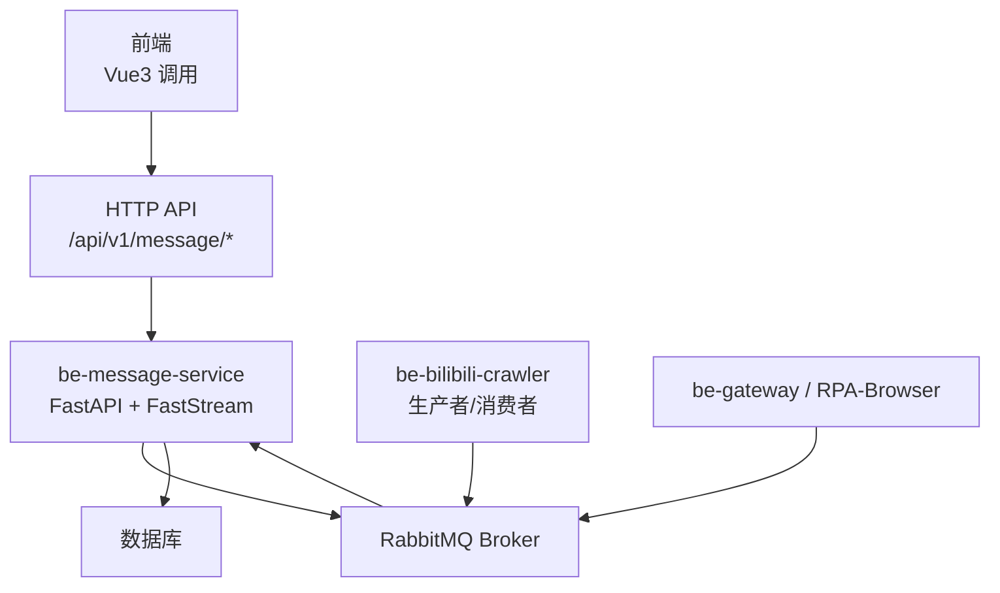
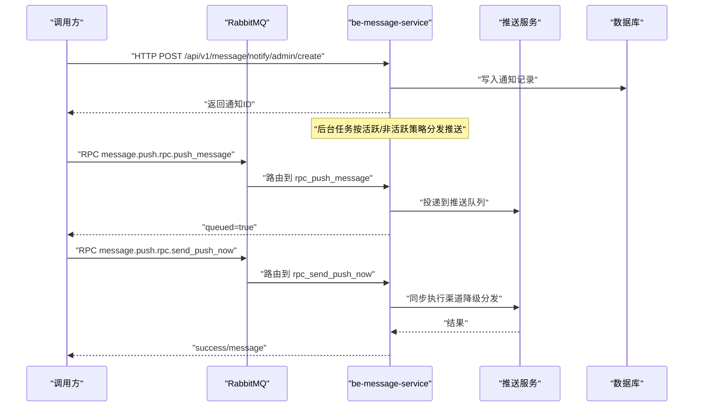
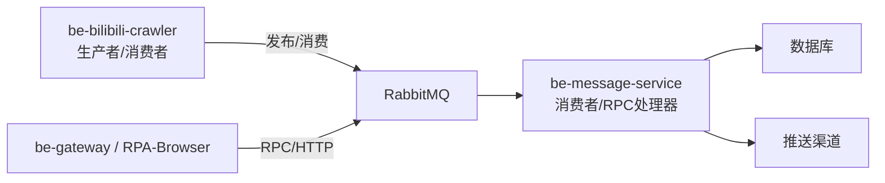

# 消息队列与RPC接口

<cite>
**本文引用的文件**
- [be-message-service/app/api/notify.py](file://be-message-service/app/api/notify.py)
- [be-message-service/app/api/event.py](file://be-message-service/app/api/event.py)
- [be-message-service/app/mq/router.py](file://be-message-service/app/mq/router.py)
- [be-message-service/app/mq/rpc_external_push.py](file://be-message-service/app/mq/rpc_external_push.py)
- [be-message-service/app/mq/rpc_pptr_user.py](file://be-message-service/app/mq/rpc_pptr_user.py)
- [be-bilibili-crawler/Service/MQ/base/BasicAsyncClient.py](file://be-bilibili-crawler/Service/MQ/base/BasicAsyncClient.py)
- [be-bilibili-crawler/Models/MQ/BaseMQModel.py](file://be-bilibili-crawler/Models/MQ/BaseMQModel.py)
- [be-bilibili-crawler/Models/MQ/MQRouterModels.py](file://be-bilibili-crawler/Models/MQ/MQRouterModels.py)
- [be-bilibili-crawler/test/test_mq.py](file://be-bilibili-crawler/test/test_mq.py)
- [Vue3FrontEndDemoExercise/src/api/bili_lottery_data/hey-api/services/消息推送微服务Service.gen.ts](file://Vue3FrontEndDemoExercise/src/api/bili_lottery_data/hey-api/services/消息推送微服务Service.gen.ts)
</cite>

## 目录
1. [简介](#简介)
2. [项目结构](#项目结构)
3. [核心组件](#核心组件)
4. [架构总览](#架构总览)
5. [详细组件分析](#详细组件分析)
6. [依赖关系分析](#依赖关系分析)
7. [性能考虑](#性能考虑)
8. [故障排查指南](#故障排查指南)
9. [结论](#结论)
10. [附录：接口清单与示例](#附录接口清单与示例)

## 简介
本文件面向“消息队列与RPC通信”的API文档，覆盖以下能力：
- RabbitMQ 消息发布/订阅、路由键配置、重试机制
- RPC 服务调用（通过 RabbitMQ 同步调用）
- 数据同步相关接口（用户信息、等级、导航等）
- 系统通知与互动事件的消息化流程
- 前端对消息推送服务的调用入口

文档提供请求/响应示例路径、错误处理策略、常见使用场景与最佳实践。

## 项目结构
本项目围绕 be-message-service（消息与RPC服务端）、be-bilibili-crawler（消息生产者/消费者基类）、以及前端调用生成代码组织。RabbitMQ 作为统一消息总线，HTTP 接口用于管理端与终端交互，RPC 用于服务间调用。

图表来源
- [be-message-service/app/mq/router.py:1-57](file://be-message-service/app/mq/router.py#L1-L57)
- [be-bilibili-crawler/Service/MQ/base/BasicAsyncClient.py:303-361](file://be-bilibili-crawler/Service/MQ/base/BasicAsyncClient.py#L303-L361)

章节来源
- [be-message-service/app/mq/router.py:1-57](file://be-message-service/app/mq/router.py#L1-L57)
- [be-bilibili-crawler/Service/MQ/base/BasicAsyncClient.py:303-361](file://be-bilibili-crawler/Service/MQ/base/BasicAsyncClient.py#L303-L361)

## 核心组件
- 消息路由与Broker生命周期管理：RabbitRouter 统一管理 broker 启动/停止、定时任务钩子，供 publisher/RPC/健康检查共用单一 broker。
- 外部推送RPC：通过 RabbitMQ 暴露 push_message/send_push_now 两个方法，分别对应异步投递与同步立即发送。
- pptr 用户RPC：提供用户信息查询、创建、更新、等级、导航、搜索等能力，供网关/爬虫等服务调用。
- 消息生产者基类：提供连接、交换器、队列声明、绑定、QoS、消费、确认/拒绝、重连等通用能力，并包含发布重试装饰器。
- 消息模型与路由键：集中定义队列名、交换器名、路由键，支持动态拼接路由键以匹配通配符订阅。

章节来源
- [be-message-service/app/mq/router.py:1-57](file://be-message-service/app/mq/router.py#L1-L57)
- [be-message-service/app/mq/rpc_external_push.py:1-128](file://be-message-service/app/mq/rpc_external_push.py#L1-L128)
- [be-message-service/app/mq/rpc_pptr_user.py:1-407](file://be-message-service/app/mq/rpc_pptr_user.py#L1-L407)
- [be-bilibili-crawler/Service/MQ/base/BasicAsyncClient.py:15-47](file://be-bilibili-crawler/Service/MQ/base/BasicAsyncClient.py#L15-L47)
- [be-bilibili-crawler/Models/MQ/BaseMQModel.py:1-74](file://be-bilibili-crawler/Models/MQ/BaseMQModel.py#L1-L74)

## 架构总览
消息与RPC的整体协作如下：
- 生产端（爬虫/网关/其他服务）通过 HTTP 或 RabbitMQ 将消息投递到指定 exchange/routing_key。
- be-message-service 通过 FastStream 注册消费者与RPC处理器，执行业务逻辑后落库或触发下游渠道推送。
- 前端通过HTTP访问消息中心接口；同时可通过生成的TS客户端调用消息推送测试接口。

图表来源
- [be-message-service/app/api/notify.py:143-163](file://be-message-service/app/api/notify.py#L143-L163)
- [be-message-service/app/mq/rpc_external_push.py:45-76](file://be-message-service/app/mq/rpc_external_push.py#L45-L76)
- [be-message-service/app/mq/rpc_external_push.py:79-121](file://be-message-service/app/mq/rpc_external_push.py#L79-L121)

## 详细组件分析

### 系统通知HTTP接口（/api/v1/message/notify）
- 功能：管理员发布/修改/撤回通知；普通用户拉取增量、分页查看历史、查询未读数；读取即已读。
- 关键端点：
  - GET /pull：游标式增量拉取，自动推进游标，避免重复消费。
  - GET /list：分页历史列表，返回前自动置为已读。
  - GET /unread：未读数。
  - GET /system：模仿B站系统通知格式。
  - POST /admin/create：发布通知（支持草稿/定时）。
  - POST /admin/update/{id}：修改通知。
  - POST /admin/revoke/{id}：撤回通知。
  - GET /admin/list：管理员列表。
- 幂等性：HTTP层不做幂等判重；RPC层 publish_notify 走 create_idempotent，便于调用方超时重试不重复打扰用户。

章节来源
- [be-message-service/app/api/notify.py:46-137](file://be-message-service/app/api/notify.py#L46-L137)
- [be-message-service/app/api/notify.py:143-213](file://be-message-service/app/api/notify.py#L143-L213)

### 互动事件HTTP接口（/api/v1/message/event）
- 功能：上报点赞/回复/@事件；聚合展示；明细列表；标记已读；删除；各类型未读数。
- 关键端点：
  - POST /report：内部服务上报事件，经过设置闸门、自赞过滤、幂等去重、落库。
  - GET /aggregate：聚合卡片列表（消息中心首页）。
  - GET /list：B站式聚合列表，含 latest/total/unread_count 等字段。
  - POST /read：精确/类型/分组粒度已读。
  - POST /delete：批量删除。
  - GET /unread：各类型未读数。

章节来源
- [be-message-service/app/api/event.py:34-50](file://be-message-service/app/api/event.py#L34-L50)
- [be-message-service/app/api/event.py:53-114](file://be-message-service/app/api/event.py#L53-L114)
- [be-message-service/app/api/event.py:117-158](file://be-message-service/app/api/event.py#L117-L158)

### RabbitMQ路由与Broker生命周期
- RabbitRouter 负责 broker 生命周期管理，after_startup 启动调度器，on_broker_shutdown 关闭调度器。
- 单一 broker 实例供 publisher/RPC/健康检查复用，避免多连接。

章节来源
- [be-message-service/app/mq/router.py:1-57](file://be-message-service/app/mq/router.py#L1-L57)

### 外部推送RPC（message.push.rpc.*）
- 方法：
  - push_message：异步投递推送消息到队列，不阻塞调用方。
  - send_push_now：同步立即发送，适合测试/低频即时提醒。
- 路由键：message.push.rpc.<method_name>
- 失败处理：统一 error_response/success_response 封装。

章节来源
- [be-message-service/app/mq/rpc_external_push.py:1-128](file://be-message-service/app/mq/rpc_external_push.py#L1-L128)

### pptr用户RPC（message.pptr.rpc.*）
- 方法：get_user_info/get_user_card/create_user/update_user_info/get_user_level/set_user_level/set_user_detail/set_user_role/search_users/add_exp/add_daily_login_exp/add_username_record/get_user_nav
- 路由键：message.pptr.rpc.<method_name>
- 业务：用户档案、等级计算、导航信息、经验值、昵称历史等。

章节来源
- [be-message-service/app/mq/rpc_pptr_user.py:1-407](file://be-message-service/app/mq/rpc_pptr_user.py#L1-L407)

### 消息生产者基类与重试机制
- BasicMessageSender：声明交换器/队列/绑定，支持 extra_routing_key 动态拼接路由键。
- 重试装饰器 _mq_retry_wrapper：异常时重试N次，超过阈值告警并退出。
- 编码：msgpack 二进制序列化。

章节来源
- [be-bilibili-crawler/Service/MQ/base/BasicAsyncClient.py:15-47](file://be-bilibili-crawler/Service/MQ/base/BasicAsyncClient.py#L15-L47)
- [be-bilibili-crawler/Service/MQ/base/BasicAsyncClient.py:303-361](file://be-bilibili-crawler/Service/MQ/base/BasicAsyncClient.py#L303-L361)

### 消息模型与路由键
- QueueName/ExchangeName/RoutingKey：集中枚举，便于统一管理。
- MQPropBase：构造 RabbitQueue（routing_key 带 .# 通配），并提供 get_publish_routing_key(suffix) 动态拼接。

章节来源
- [be-bilibili-crawler/Models/MQ/BaseMQModel.py:1-74](file://be-bilibili-crawler/Models/MQ/BaseMQModel.py#L1-L74)
- [be-bilibili-crawler/Models/MQ/MQRouterModels.py:1-37](file://be-bilibili-crawler/Models/MQ/MQRouterModels.py#L1-L37)

### 前端消息推送调用
- 前端通过生成的TS客户端调用 /test_push_error 接口，验证异常 -> RabbitMQ -> message-service -> 推送链路。

章节来源
- [Vue3FrontEndDemoExercise/src/api/bili_lottery_data/hey-api/services/消息推送微服务Service.gen.ts:8-21](file://Vue3FrontEndDemoExercise/src/api/bili_lottery_data/hey-api/services/消息推送微服务Service.gen.ts#L8-L21)

## 依赖关系分析
- 模块耦合：
  - be-message-service 通过 FastStream 注册消费者与RPC处理器，依赖 bili_common 的模型与路由键工具。
  - be-bilibili-crawler 通过 pika 直接操作 RabbitMQ，提供基础收发能力与重试。
  - 前端通过HTTP访问消息中心，并通过TS客户端调用消息推送测试接口。
- 外部依赖：
  - RabbitMQ Broker：消息总线。
  - 数据库：持久化通知、事件、用户信息等。
  - 推送渠道：PushMe/PushPlus等（由消息服务内部实现）。

图表来源
- [be-message-service/app/mq/router.py:1-57](file://be-message-service/app/mq/router.py#L1-L57)
- [be-bilibili-crawler/Service/MQ/base/BasicAsyncClient.py:303-361](file://be-bilibili-crawler/Service/MQ/base/BasicAsyncClient.py#L303-L361)

章节来源
- [be-message-service/app/mq/router.py:1-57](file://be-message-service/app/mq/router.py#L1-L57)
- [be-bilibili-crawler/Service/MQ/base/BasicAsyncClient.py:303-361](file://be-bilibili-crawler/Service/MQ/base/BasicAsyncClient.py#L303-L361)

## 性能考虑
- QoS与预取：消费者设置 prefetch_count=20，平衡吞吐与内存占用。
- 重试与退避：发布重试装饰器默认最大5次，间隔30秒，失败告警。
- 游标式拉取：通知拉取使用游标语义，天然避免重复消费。
- 聚合展示：互动事件按来源实体聚合，减少前端渲染压力。
- 单broker复用：publisher/RPC/健康检查共用同一broker，降低连接开销。

[本节为通用指导，无需特定文件引用]

## 故障排查指南
- 发布失败重试耗尽：检查 _mq_retry_wrapper 日志与告警，确认MQ连通性与目标队列存在。
- 消费者未消费：确认队列绑定路由键匹配（如 testRouter.#），检查消费者是否启动。
- 路由键错误：确保 extra_routing_key 为字符串且正确拼接，否则回退到默认key。
- 推送失败：send_push_now 返回 success=false 时检查 MESSAGE_CONFIG 或传入 config。

章节来源
- [be-bilibili-crawler/Service/MQ/base/BasicAsyncClient.py:15-47](file://be-bilibili-crawler/Service/MQ/base/BasicAsyncClient.py#L15-L47)
- [be-bilibili-crawler/Service/MQ/base/BasicAsyncClient.py:335-354](file://be-bilibili-crawler/Service/MQ/base/BasicAsyncClient.py#L335-L354)
- [be-message-service/app/mq/rpc_external_push.py:87-121](file://be-message-service/app/mq/rpc_external_push.py#L87-L121)

## 结论
本项目通过 RabbitMQ 统一消息总线，结合 FastAPI/FastStream 提供HTTP与RPC双通道能力。消息侧强调幂等、游标拉取、聚合展示；RPC侧聚焦服务间解耦与标准化契约。建议在生产环境关注重试策略、路由键规范、QoS调优与监控告警。

[本节为总结，无需特定文件引用]

## 附录：接口清单与示例

### 系统通知（HTTP）
- GET /api/v1/message/notify/pull
  - 参数：cursor, limit
  - 响应：StandardResponse[NotifyPullResp]
  - 说明：游标式增量拉取，读取即已读
- GET /api/v1/message/notify/list
  - 参数：page_num, page_size
  - 响应：StandardResponse[NotifyListResp]
- GET /api/v1/message/notify/unread
  - 响应：StandardResponse[int]
- GET /api/v1/message/notify/system
  - 参数：page_num, page_size
  - 响应：BiliSystemNotifyResp
- POST /api/v1/message/notify/admin/create
  - 请求体：NotifyCreateReq
  - 响应：StandardResponse[NotifyAdminItem]
- POST /api/v1/message/notify/admin/update/{notify_id}
  - 请求体：NotifyUpdateReq
  - 响应：StandardResponse[NotifyAdminItem]
- POST /api/v1/message/notify/admin/revoke/{notify_id}
  - 响应：StandardResponse[bool]
- GET /api/v1/message/notify/admin/list
  - 参数：page_num, page_size, status
  - 响应：StandardResponse[NotifyAdminListResp]

章节来源
- [be-message-service/app/api/notify.py:46-213](file://be-message-service/app/api/notify.py#L46-L213)

### 互动事件（HTTP）
- POST /api/v1/message/event/report
  - 请求体：EventReportReq
  - 响应：StandardResponse[EventReportResp]
- GET /api/v1/message/event/aggregate
  - 参数：event_type, page_num, page_size, only_unread
  - 响应：StandardResponse[EventAggregateResp]
- GET /api/v1/message/event/list
  - 参数：event_type, cursor_id, page_size, only_unread
  - 响应：StandardResponse[EventListResp]
- POST /api/v1/message/event/read
  - 请求体：EventReadReq
  - 响应：StandardResponse[EventReadResp]
- POST /api/v1/message/event/delete
  - 请求体：EventReadReq
  - 响应：StandardResponse[int]
- GET /api/v1/message/event/unread
  - 响应：StandardResponse[dict]

章节来源
- [be-message-service/app/api/event.py:34-158](file://be-message-service/app/api/event.py#L34-L158)

### 外部推送RPC（RabbitMQ）
- 路由键：message.push.rpc.push_message
  - 请求：PushRpcSendParams
  - 响应：StandardResponse[PushRpcSendResult]
  - 行为：异步投递推送消息
- 路由键：message.push.rpc.send_push_now
  - 请求：PushRpcSendNowParams
  - 响应：StandardResponse[PushRpcSendNowResult]
  - 行为：同步立即发送

章节来源
- [be-message-service/app/mq/rpc_external_push.py:45-121](file://be-message-service/app/mq/rpc_external_push.py#L45-L121)

### pptr用户RPC（RabbitMQ）
- 路由键：message.pptr.rpc.get_user_info
  - 请求：PptrGetUserInfoParams
  - 响应：StandardResponse[PptrUserProfile]
- 路由键：message.pptr.rpc.create_user
  - 请求：PptrCreateUserParams
  - 响应：StandardResponse[PptrCreateUserResult]
- 路由键：message.pptr.rpc.get_user_level
  - 请求：PptrGetUserLevelParams
  - 响应：StandardResponse[PptrUserLevelInfo]
- 路由键：message.pptr.rpc.add_exp
  - 请求：PptrAddExpParams
  - 响应：StandardResponse[PptrAddExpResult]
- 路由键：message.pptr.rpc.get_user_nav
  - 请求：PptrGetUserNavParams
  - 响应：StandardResponse[导航数据]

章节来源
- [be-message-service/app/mq/rpc_pptr_user.py:97-389](file://be-message-service/app/mq/rpc_pptr_user.py#L97-L389)

### 消息生产者示例（爬虫侧）
- 使用 MQPropBase 获取路由键：get_publish_routing_key(suffix)
- 使用 BasicMessageSender 发送消息：send_message(body, extra_routing_key)
- 重试机制：_mq_retry_wrapper(max_retries=5, delay=30)

章节来源
- [be-bilibili-crawler/Models/MQ/BaseMQModel.py:38-74](file://be-bilibili-crawler/Models/MQ/BaseMQModel.py#L38-L74)
- [be-bilibili-crawler/Service/MQ/base/BasicAsyncClient.py:303-361](file://be-bilibili-crawler/Service/MQ/base/BasicAsyncClient.py#L303-L361)
- [be-bilibili-crawler/Service/MQ/base/BasicAsyncClient.py:15-47](file://be-bilibili-crawler/Service/MQ/base/BasicAsyncClient.py#L15-L47)

### 前端调用示例
- 调用 /test_push_error 验证推送链路

章节来源
- [Vue3FrontEndDemoExercise/src/api/bili_lottery_data/hey-api/services/消息推送微服务Service.gen.ts:8-21](file://Vue3FrontEndDemoExercise/src/api/bili_lottery_data/hey-api/services/消息推送微服务Service.gen.ts#L8-L21)