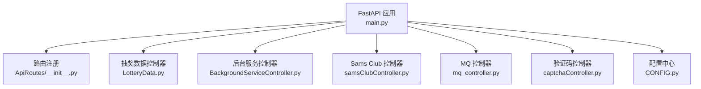
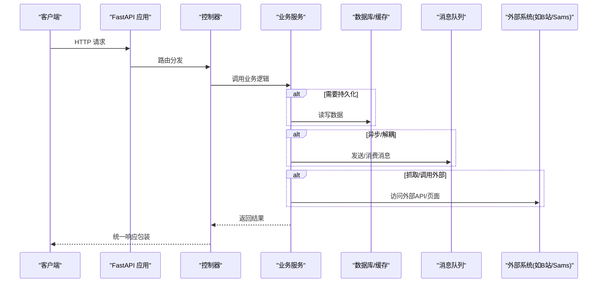
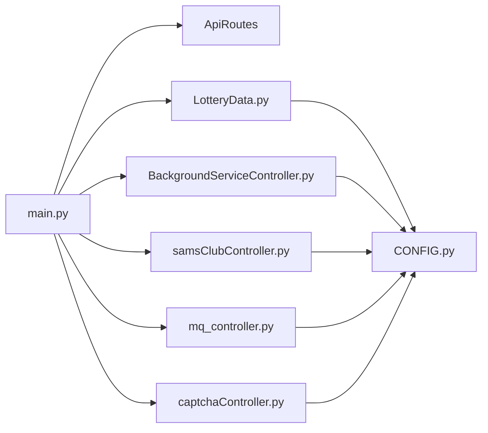

# 爬虫服务 API

<cite>
**本文引用的文件**
- [main.py](file://be-bilibili-crawler/main.py)
- [CONFIG.py](file://be-bilibili-crawler/CONFIG.py)
- [ApiRoutes/__init__.py](file://be-bilibili-crawler/ApiRoutes/__init__.py)
- [controller/v1/lotttery_database/bili/LotteryData.py](file://be-bilibili-crawler/controller/v1/lotttery_database/bili/LotteryData.py)
- [controller/v1/background_service/BackgroundServiceController.py](file://be-bilibili-crawler/controller/v1/background_service/BackgroundServiceController.py)
- [controller/v1/samsClub/samsClubController.py](file://be-bilibili-crawler/controller/v1/samsClub/samsClubController.py)
- [controller/v1/mq/mq_controller.py](file://be-bilibili-crawler/controller/v1/mq/mq_controller.py)
- [controller/v1/captcha/captchaController.py](file://be-bilibili-crawler/controller/v1/captcha/captchaController.py)
- [Models/MQ/MQRouterModels.py](file://be-bilibili-crawler/Models/MQ/MQRouterModels.py)
- [Models/v1/samsclub/api_model.py](file://be-bilibili-crawler/Models/v1/samsclub/api_model.py)
</cite>

## 目录
1. [简介](#简介)
2. [项目结构](#项目结构)
3. [核心组件](#核心组件)
4. [架构总览](#架构总览)
5. [详细接口说明](#详细接口说明)
6. [依赖关系分析](#依赖关系分析)
7. [性能与可用性](#性能与可用性)
8. [故障排查指南](#故障排查指南)
9. [结论](#结论)
10. [附录：认证与错误码](#附录：认证与错误码)

## 简介
本文件为“爬虫服务”的完整 RESTful API 文档，覆盖数据采集、任务管理、数据处理等核心能力，重点包括：
- B 站动态采集（官方抽奖、预约抽奖、充电抽奖、话题抽奖、直播抽奖、第三方抽奖动态）
- 山姆会员店数据采集（GraphQL 与状态查询）
- 后台任务调度控制（启动/停止/重启定时任务，查看全局调度器状态）
- 消息队列集成（RabbitMQ 发布/消费测试）
- 验证码生成与校验
- 统一响应格式、参数校验、错误处理机制与认证授权方式

所有接口均遵循统一的响应包装模型，便于前端或下游系统统一解析。

## 项目结构
后端基于 FastAPI 构建，路由通过集中枚举统一管理，控制器按功能域划分（抽奖数据、后台服务、Sams Club、MQ、验证码等），并通过主应用入口注册路由、异常处理与中间件。

图表来源
- [main.py:48-59](file://be-bilibili-crawler/main.py#L48-L59)
- [ApiRoutes/__init__.py:26-169](file://be-bilibili-crawler/ApiRoutes/__init__.py#L26-L169)

章节来源
- [main.py:48-59](file://be-bilibili-crawler/main.py#L48-L59)
- [ApiRoutes/__init__.py:26-169](file://be-bilibili-crawler/ApiRoutes/__init__.py#L26-L169)

## 核心组件
- 路由与命名空间：通过 ApiRoutes 集中定义前缀、标签、路径与名称，保证接口组织一致性与可维护性。
- 控制器层：
  - 抽奖数据：提供获取、提交、搜索、状态查询等接口。
  - 后台服务：提供代理状态、全局任务列表、服务启停、调度器状态等。
  - Sams Club：更新认证令牌、GraphQL 子路由、API 状态查询。
  - MQ：RabbitMQ 消费者与测试发布接口。
  - 验证码：生成与校验。
- 配置与基础设施：数据库连接池、Redis、RabbitMQ、LLM、推送渠道等集中在 CONFIG.py。
- 统一响应：所有接口返回统一包装体，包含 code、msg、data 等字段。

章节来源
- [ApiRoutes/__init__.py:26-169](file://be-bilibili-crawler/ApiRoutes/__init__.py#L26-L169)
- [CONFIG.py:225-277](file://be-bilibili-crawler/CONFIG.py#L225-L277)
- [controller/v1/lotttery_database/bili/LotteryData.py:96-626](file://be-bilibili-crawler/controller/v1/lotttery_database/bili/LotteryData.py#L96-L626)
- [controller/v1/background_service/BackgroundServiceController.py:44-274](file://be-bilibili-crawler/controller/v1/background_service/BackgroundServiceController.py#L44-L274)
- [controller/v1/samsClub/samsClubController.py:11-28](file://be-bilibili-crawler/controller/v1/samsClub/samsClubController.py#L11-L28)
- [controller/v1/mq/mq_controller.py:37-169](file://be-bilibili-crawler/controller/v1/mq/mq_controller.py#L37-L169)
- [controller/v1/captcha/captchaController.py:15-33](file://be-bilibili-crawler/controller/v1/captcha/captchaController.py#L15-L33)

## 架构总览
整体采用“控制器 -> 服务 -> 数据源/外部系统”的分层架构，结合缓存、消息队列与后台调度器实现高吞吐与异步处理能力。

图表来源
- [main.py:48-59](file://be-bilibili-crawler/main.py#L48-L59)
- [controller/v1/lotttery_database/bili/LotteryData.py:96-626](file://be-bilibili-crawler/controller/v1/lotttery_database/bili/LotteryData.py#L96-L626)
- [controller/v1/mq/mq_controller.py:37-169](file://be-bilibili-crawler/controller/v1/mq/mq_controller.py#L37-L169)

## 详细接口说明

### 通用约定
- 基础路径：各模块前缀见 ApiRoutes，例如 /api/v1/lottery_database/bili、/api/v1/background_service、/api/v1/samsClub、/api/v1/captcha。
- 统一响应体：code、msg、data。成功时 code=0；失败时根据场景返回具体错误码。
- 分页参数：多数列表接口支持 page_num、page_size，部分支持时间范围与排序。
- 认证授权：部分接口需登录态（由网关注入 x-bili-* 头校验），未登录将返回 401。

章节来源
- [ApiRoutes/__init__.py:26-169](file://be-bilibili-crawler/ApiRoutes/__init__.py#L26-L169)
- [controller/v1/lotttery_database/bili/LotteryData.py:375-433](file://be-bilibili-crawler/controller/v1/lotttery_database/bili/LotteryData.py#L375-L433)

### B 站抽奖数据接口（/api/v1/lottery_database/bili）
- 获取预约抽奖
  - 方法/路径：POST /GetReserveLottery
  - 入参：高级筛选分页参数（状态、时间、关键词、参与人数区间、是否大奖等）
  - 出参：分页结果（items, total）
  - 说明：当页码或每页数为 0 时返回 SVM 判定过的必抽数据；否则返回分页全部数据
  - 缓存：启用短期缓存
- 获取官方抽奖
  - 方法/路径：POST /GetOfficialLottery
  - 入参：同预约抽奖的高级筛选
  - 出参：分页结果
  - 缓存：启用短期缓存
- 获取充电抽奖
  - 方法/路径：POST /GetChargeLottery
  - 入参：同预约抽奖的高级筛选
  - 出参：分页结果
  - 缓存：启用短期缓存
- 获取直播抽奖
  - 方法/路径：POST /GetLiveLottery
  - 入参：分页参数
  - 出参：分页结果
  - 缓存：启用短期缓存
- 获取话题抽奖
  - 方法/路径：POST /GetTopicLottery
  - 入参：分页+关键词
  - 出参：分页结果
  - 缓存：启用短期缓存
- 获取所有抽奖
  - 方法/路径：GET /GetAllLottery
  - 入参：收录时间/发布时间快捷筛选与精确时间范围、分页
  - 出参：聚合后的抽奖信息
- 提交抽奖动态（官方/预约/充电）
  - 方法/路径：POST /AddDynamicLottery
  - 入参：dynamic_id_or_url
  - 出参：解析结果
  - 缓存：写入后短期缓存
- 批量提交抽奖动态
  - 方法/路径：POST /BulkAddDynamicLottery
  - 入参：dynamic_id_or_urls 列表
  - 出参：解析结果列表
  - 并发：并行处理
- 提交话题抽奖
  - 方法/路径：POST /AddTopicLottery
  - 入参：topic_id
  - 出参：解析结果
- 批量提交话题抽奖
  - 方法/路径：POST /BulkAddTopicLottery
  - 入参：topic_ids 列表
  - 出参：解析结果列表
- 提交第三方抽奖动态（需登录）
  - 方法/路径：POST /AddOthersLotDyn
  - 入参：dynamic_id_or_url
  - 出参：解析结果
  - 说明：校验通过后加入后台任务进行详情获取与入库
- 批量提交第三方抽奖动态（需登录）
  - 方法/路径：POST /BulkAddOthersLotDyn
  - 入参：dynamic_id_or_urls 列表
  - 出参：解析结果列表
  - 说明：并行校验并加入后台任务
- 关键词搜索
  - 方法/路径：POST /SearchLotteryByKeyword
  - 入参：keyword、分页
  - 出参：分页结果
- 查询单个爬虫状态
  - 方法/路径：GET /GetSingleScrapyStatus
  - 入参：scrapy_name（枚举）
  - 出参：对应爬虫实时状态
- 获取所有爬虫状态
  - 方法/路径：GET /GetAllLotScrapyStatus
  - 出参：多类爬虫状态汇总
- 获取第三方抽奖动态列表（需登录）
  - 方法/路径：POST /GetOthersLotDynList
  - 入参：分页、排序、时间筛选（快捷/精确）、是否仅抽奖动态
  - 出参：分页结果，附带 extra_info（奖品名、是否大奖、是否需要评论/转发、开奖时间等）
- 获取筛选参数元数据
  - 方法/路径：GET /GetLotteryFilterParams
  - 出参：各接口的筛选参数元数据（用于前端动态生成筛选 UI）

章节来源
- [controller/v1/lotttery_database/bili/LotteryData.py:96-626](file://be-bilibili-crawler/controller/v1/lotttery_database/bili/LotteryData.py#L96-L626)
- [ApiRoutes/__init__.py:95-116](file://be-bilibili-crawler/ApiRoutes/__init__.py#L95-L116)

### 后台服务与任务调度（/api/v1/background_service）
- 获取代理状态
  - 方法/路径：GET /GetProxyStatus
  - 出参：代理数据库/缓存状态
- 获取全局定时任务
  - 方法/路径：GET /GlobalSchedule/GetJobs
  - 出参：任务列表
- 获取后台服务状态
  - 方法/路径：GET /BackgroundService/AllStat
  - 出参：各调度器的执行信息
- 启动特定后台服务
  - 方法/路径：POST /BackgroundService/Start
  - 入参：background_service_name（枚举）
  - 出参：操作结果
- 停止特定后台服务
  - 方法/路径：POST /BackgroundService/Stop
  - 入参：background_service_name（枚举）
  - 出参：操作结果
- 重启特定后台服务
  - 方法/路径：POST /BackgroundService/Restart
  - 入参：background_service_name（枚举）
  - 出参：操作结果
- 获取全局调度器详细状态
  - 方法/路径：GET /GlobalScheduler/Status
  - 出参：调度器信息与任务详情（含下次运行时间、执行信息等）

章节来源
- [controller/v1/background_service/BackgroundServiceController.py:44-274](file://be-bilibili-crawler/controller/v1/background_service/BackgroundServiceController.py#L44-L274)
- [ApiRoutes/__init__.py:127-139](file://be-bilibili-crawler/ApiRoutes/__init__.py#L127-L139)

### 山姆会员店数据采集（/api/v1/samsClub）
- 更新 auth_token
  - 方法/路径：POST /set_new_auth_token
  - 入参：auth_token（字符串）
  - 出参：成功提示
- GraphQL 子路由
  - 路径：/graphql（挂载在 samsClub 路由下）
  - 说明：通过 GraphQL 查询/操作 Sams Club 数据
- 查询 API 状态
  - 方法/路径：GET /samsclub_api_status
  - 出参：SamsClubApiStatus（包含当前状态等）

章节来源
- [controller/v1/samsClub/samsClubController.py:11-28](file://be-bilibili-crawler/controller/v1/samsClub/samsClubController.py#L11-L28)
- [ApiRoutes/__init__.py:145-148](file://be-bilibili-crawler/ApiRoutes/__init__.py#L145-L148)
- [Models/v1/samsclub/api_model.py:10-41](file://be-bilibili-crawler/Models/v1/samsclub/api_model.py#L10-L41)

### 消息队列（RabbitMQ）
- 消费者（订阅多个队列）
  - 官方/预约/充电抽奖数据
  - 按动态ID插入/更新抽奖数据
  - 话题抽奖数据
  - Milvus 向量库同步
  - 优惠券信息
  - 奖品提取（B站官方/动态详情）
  - 测试消息消费
- 测试发布
  - 方法/路径：POST /rabbitmq_test_publish
  - 入参：可选消息体
  - 出参：测试消息模型
  - 说明：用于验证 RabbitMQ 链路是否正常

章节来源
- [controller/v1/mq/mq_controller.py:37-169](file://be-bilibili-crawler/controller/v1/mq/mq_controller.py#L37-L169)
- [Models/MQ/MQRouterModels.py:1-37](file://be-bilibili-crawler/Models/MQ/MQRouterModels.py#L1-L37)
- [ApiRoutes/__init__.py:150-152](file://be-bilibili-crawler/ApiRoutes/__init__.py#L150-L152)

### 验证码
- 生成验证码
  - 方法/路径：GET /gen
  - 出参：captcha_id、image（Base64）
- 验证验证码
  - 方法/路径：POST /verify
  - 入参：captcha_id、input_text
  - 出参：验证结果（code、message）

章节来源
- [controller/v1/captcha/captchaController.py:15-33](file://be-bilibili-crawler/controller/v1/captcha/captchaController.py#L15-L33)
- [ApiRoutes/__init__.py:141-143](file://be-bilibili-crawler/ApiRoutes/__init__.py#L141-L143)

### 使用示例（请求/响应）
以下为常见场景的请求与响应示例（以 JSON 示意）：

- 获取预约抽奖（分页+筛选）
  - 请求：POST /api/v1/lottery_database/bili/GetReserveLottery
  - 请求体示例：
    {
      "page_num": 1,
      "page_size": 20,
      "status": "finished",
      "start_ts": 1710000000,
      "end_ts": 1710086400,
      "keyword": "iPhone",
      "min_participants": 100,
      "max_participants": 5000,
      "created_at_preset": "7d",
      "pub_time_preset": "3d",
      "sort_by": "created_at",
      "sort_order": "desc",
      "is_grand_prize": true
    }
  - 响应示例：
    {
      "code": 0,
      "msg": "success",
      "data": {
        "items": [],
        "total": 0
      }
    }

- 提交第三方抽奖动态（需登录）
  - 请求：POST /api/v1/lottery_database/bili/AddOthersLotDyn
  - 请求体示例：
    {
      "dynamic_id_or_url": "https://www.bilibili.com/dynamic/123456"
    }
  - 响应示例：
    {
      "code": 0,
      "msg": "success",
      "data": {
        "dynamic_id": "123456",
        "lot_round_id": "abc123"
      }
    }

- 启动后台服务
  - 请求：POST /api/v1/background_service/BackgroundService/Start
  - 查询参数：background_service_name=reserve
  - 响应示例：
    {
      "code": 0,
      "msg": "成功启动服务 reserve",
      "data": null
    }

- 更新 Sams Club auth_token
  - 请求：POST /api/v1/samsClub/set_new_auth_token
  - 查询参数：auth_token=YOUR_TOKEN
  - 响应示例：
    {
      "code": 0,
      "msg": "success",
      "data": "更新成功！"
    }

- 发布 RabbitMQ 测试消息
  - 请求：POST /api/v1/rabbitmq_test_publish
  - 请求体示例：
    {
      "a": 1710000000,
      "b": "test message",
      "c": {"key": "value"},
      "d": ["item1", "item2"]
    }
  - 响应示例：
    {
      "code": 0,
      "msg": "success",
      "data": {
        "a": 1710000000,
        "b": "publish `...` to rabbitmq test!",
        "c": {"key": "value"},
        "d": ["publish `...` to rabbitmq test!"]
      }
    }

章节来源
- [controller/v1/lotttery_database/bili/LotteryData.py:96-626](file://be-bilibili-crawler/controller/v1/lotttery_database/bili/LotteryData.py#L96-L626)
- [controller/v1/background_service/BackgroundServiceController.py:92-206](file://be-bilibili-crawler/controller/v1/background_service/BackgroundServiceController.py#L92-L206)
- [controller/v1/samsClub/samsClubController.py:11-28](file://be-bilibili-crawler/controller/v1/samsClub/samsClubController.py#L11-L28)
- [controller/v1/mq/mq_controller.py:157-164](file://be-bilibili-crawler/controller/v1/mq/mq_controller.py#L157-L164)

## 依赖关系分析
- 路由注册：主应用将各控制器路由挂载到 FastAPI 实例，统一暴露对外接口。
- 配置依赖：数据库、Redis、RabbitMQ、LLM、代理等通过 CONFIG 集中管理，确保环境隔离与可配置。
- 缓存策略：读取类接口普遍启用短期缓存，降低数据库压力。
- 消息队列：通过 FastStream 订阅/发布消息，实现异步解耦与扩展。
- 认证授权：部分接口依赖网关鉴权，未登录拒绝访问。

图表来源
- [main.py:48-59](file://be-bilibili-crawler/main.py#L48-L59)
- [ApiRoutes/__init__.py:26-169](file://be-bilibili-crawler/ApiRoutes/__init__.py#L26-L169)
- [CONFIG.py:225-277](file://be-bilibili-crawler/CONFIG.py#L225-L277)

章节来源
- [main.py:48-59](file://be-bilibili-crawler/main.py#L48-L59)
- [CONFIG.py:225-277](file://be-bilibili-crawler/CONFIG.py#L225-L277)

## 性能与可用性
- 缓存：读取接口普遍启用短期缓存（如 180 秒），减少重复查询。
- 并发：批量提交接口使用并行处理，提升吞吐。
- 连接池：数据库连接池配置合理，避免连接泄漏与超时。
- 异步：后台任务与消息队列解耦耗时操作，提高响应速度。
- 监控：提供全局调度器状态与后台服务状态接口，便于运维观测。

章节来源
- [controller/v1/lotttery_database/bili/LotteryData.py:96-626](file://be-bilibili-crawler/controller/v1/lotttery_database/bili/LotteryData.py#L96-L626)
- [controller/v1/background_service/BackgroundServiceController.py:209-274](file://be-bilibili-crawler/controller/v1/background_service/BackgroundServiceController.py#L209-L274)
- [CONFIG.py:381-419](file://be-bilibili-crawler/CONFIG.py#L381-L419)

## 故障排查指南
- 全局异常处理：未捕获异常会记录日志并返回统一错误响应，同时触发告警推送。
- 调试模式：开启后可在中间件中输出请求耗时、IP、方法、路径、状态码与响应体，便于定位问题。
- 推送链路测试：提供故意抛错接口，用于验证消息推送微服务链路是否正常。
- 常见问题：
  - 401 未登录：检查网关是否正确注入 x-bili-* 头。
  - 400 参数错误：检查分页、时间戳、枚举值是否符合规范。
  - 500 服务器错误：查看日志与告警内容，确认外部依赖是否可用。

章节来源
- [main.py:63-112](file://be-bilibili-crawler/main.py#L63-L112)
- [controller/common/CommonRouter.py:57-94](file://be-bilibili-crawler/controller/common/CommonRouter.py#L57-L94)

## 结论
本爬虫服务提供了完善的 RESTful API，覆盖 B 站动态采集、官方抽奖数据获取、山姆会员店数据采集、后台任务调度与消息队列集成等核心能力。通过统一响应、参数校验、缓存与异步处理，兼顾了易用性与高性能。建议在生产环境中结合网关鉴权、监控与告警，确保稳定运行。

## 附录：认证与错误码
- 认证授权
  - 部分接口需要登录态（如第三方抽奖动态相关），由网关注入 x-bili-* 头进行校验。
  - 未登录或校验失败将返回 401。
- 错误码
  - 0：成功
  - 400：参数错误或资源不存在
  - 401：未登录或鉴权失败
  - 500：服务器内部错误
- 统一响应体
  - code：状态码
  - msg：提示信息
  - data：业务数据

章节来源
- [controller/v1/lotttery_database/bili/LotteryData.py:375-433](file://be-bilibili-crawler/controller/v1/lotttery_database/bili/LotteryData.py#L375-L433)
- [main.py:94-112](file://be-bilibili-crawler/main.py#L94-L112)