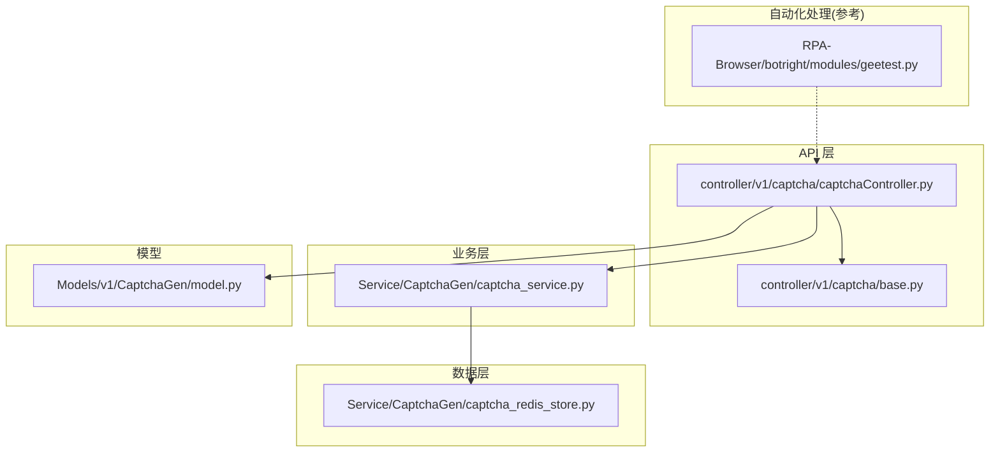
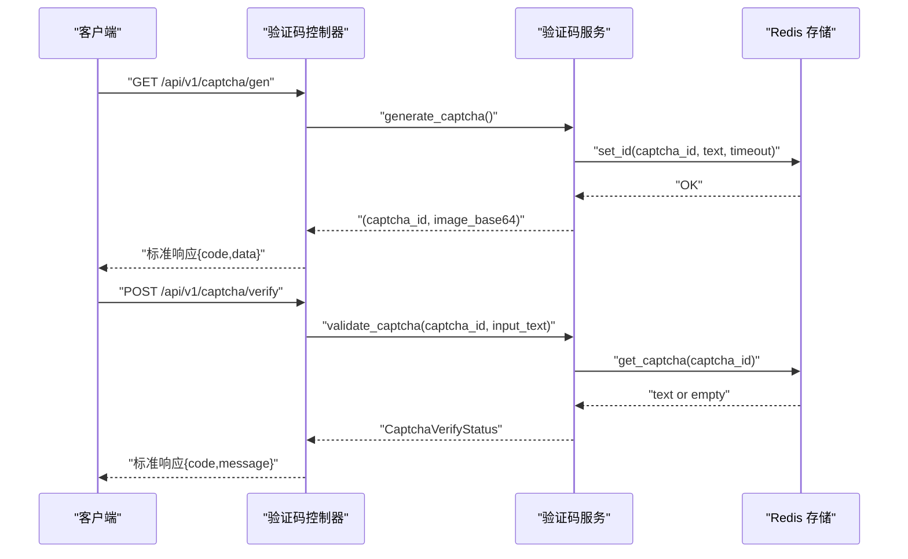
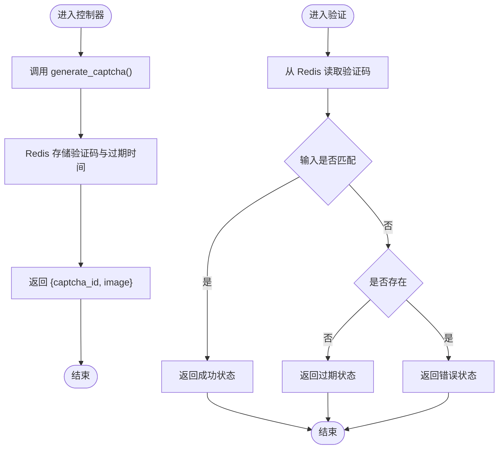
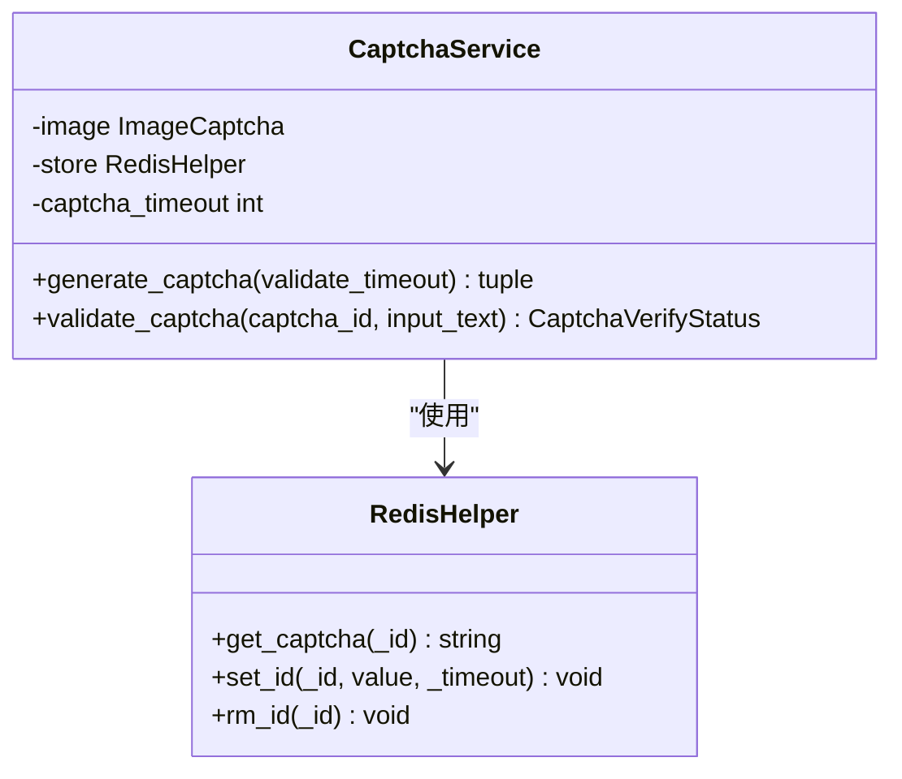
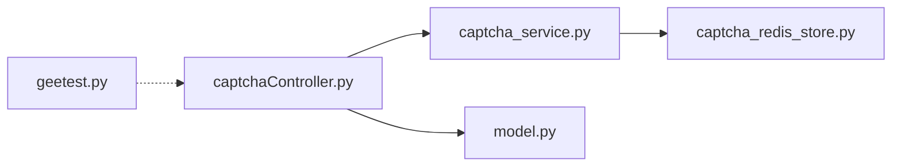

# 验证码服务接口

<cite>
**本文引用的文件**
- [captchaController.py](file://be-bilibili-crawler/controller/v1/captcha/captchaController.py)
- [captcha_service.py](file://be-bilibili-crawler/Service/CaptchaGen/captcha_service.py)
- [captcha_redis_store.py](file://be-bilibili-crawler/Service/CaptchaGen/captcha_redis_store.py)
- [model.py](file://be-bilibili-crawler/Models/v1/CaptchaGen/model.py)
- [base.py](file://be-bilibili-crawler/controller/v1/captcha/base.py)
- [test_captcha.py](file://be-bilibili-crawler/test/test_captcha.py)
- [geetest.py](file://RPA-Browser/botright/modules/geetest.py)
</cite>

## 目录
1. [简介](#简介)
2. [项目结构](#项目结构)
3. [核心组件](#核心组件)
4. [架构总览](#架构总览)
5. [详细组件分析](#详细组件分析)
6. [依赖关系分析](#依赖关系分析)
7. [性能与可用性](#性能与可用性)
8. [故障排查指南](#故障排查指南)
9. [结论](#结论)
10. [附录：API 规范与示例](#附录api-规范与示例)

## 简介
本接口文档面向验证码服务，覆盖验证码生成、识别（自动化处理）、验证等能力。当前仓库实现了基于文本的验证码生成与校验接口，并包含极验验证码（滑块、点选等）的自动化处理逻辑。文档将说明：
- 验证码生命周期管理：生成、存储、过期、清理
- 状态查询与结果获取：通过统一响应码和消息体返回
- 请求与响应示例：涵盖完整流程与错误处理
- 多种验证码类型：文本验证码（已实现）、极验验证码（自动化处理参考）

## 项目结构
验证码相关代码主要位于 be-bilibili-crawler 模块中，采用控制器-服务-存储的分层设计；RPA-Browser 模块提供极验验证码的自动化处理参考实现。

图表来源
- [captchaController.py:1-33](file://be-bilibili-crawler/controller/v1/captcha/captchaController.py#L1-L33)
- [captcha_service.py:1-57](file://be-bilibili-crawler/Service/CaptchaGen/captcha_service.py#L1-L57)
- [captcha_redis_store.py:1-23](file://be-bilibili-crawler/Service/CaptchaGen/captcha_redis_store.py#L1-L23)
- [model.py:1-60](file://be-bilibili-crawler/Models/v1/CaptchaGen/model.py#L1-L60)
- [base.py:1-12](file://be-bilibili-crawler/controller/v1/captcha/base.py#L1-L12)
- [geetest.py:1-369](file://RPA-Browser/botright/modules/geetest.py#L1-L369)

章节来源
- [captchaController.py:1-33](file://be-bilibili-crawler/controller/v1/captcha/captchaController.py#L1-L33)
- [captcha_service.py:1-57](file://be-bilibili-crawler/Service/CaptchaGen/captcha_service.py#L1-L57)
- [captcha_redis_store.py:1-23](file://be-bilibili-crawler/Service/CaptchaGen/captcha_redis_store.py#L1-L23)
- [model.py:1-60](file://be-bilibili-crawler/Models/v1/CaptchaGen/model.py#L1-L60)
- [base.py:1-12](file://be-bilibili-crawler/controller/v1/captcha/base.py#L1-L12)
- [geetest.py:1-369](file://RPA-Browser/botright/modules/geetest.py#L1-L369)

## 核心组件
- 控制器（Controller）：暴露 HTTP 接口，负责参数绑定与响应封装
- 服务（Service）：实现验证码生成与校验的核心逻辑
- 存储（RedisHelper）：使用 Redis 缓存验证码及其有效期
- 模型（Model）：定义请求/响应结构与状态枚举
- 自动化处理（Geetest）：在浏览器环境中自动完成极验验证码交互

章节来源
- [captchaController.py:1-33](file://be-bilibili-crawler/controller/v1/captcha/captchaController.py#L1-L33)
- [captcha_service.py:1-57](file://be-bilibili-crawler/Service/CaptchaGen/captcha_service.py#L1-L57)
- [captcha_redis_store.py:1-23](file://be-bilibili-crawler/Service/CaptchaGen/captcha_redis_store.py#L1-L23)
- [model.py:1-60](file://be-bilibili-crawler/Models/v1/CaptchaGen/model.py#L1-L60)
- [geetest.py:1-369](file://RPA-Browser/botright/modules/geetest.py#L1-L369)

## 架构总览
验证码服务采用分层架构：
- API 层：FastAPI 路由，统一响应格式
- 业务层：验证码生成与校验策略
- 数据层：Redis 存储验证码与过期时间
- 自动化层：浏览器端自动处理极验验证码（滑块、点选等）

图表来源
- [captchaController.py:15-32](file://be-bilibili-crawler/controller/v1/captcha/captchaController.py#L15-L32)
- [captcha_service.py:23-51](file://be-bilibili-crawler/Service/CaptchaGen/captcha_service.py#L23-L51)
- [captcha_redis_store.py:8-19](file://be-bilibili-crawler/Service/CaptchaGen/captcha_redis_store.py#L8-L19)

## 详细组件分析

### 控制器：验证码接口
- 生成验证码接口
  - 方法：GET
  - 路径：/api/v1/captcha/gen
  - 功能：生成随机验证码图片（Base64）与唯一 ID，写入 Redis 并设置过期时间
  - 响应：标准响应体，data 包含 captcha_id 与 image
- 验证验证码接口
  - 方法：POST
  - 路径：/api/v1/captcha/verify
  - 请求体：captcha_id、input_text
  - 功能：从 Redis 读取验证码文本，忽略空格进行大小写不敏感比对
  - 响应：标准响应体，code/message 表示验证结果

图表来源
- [captchaController.py:15-32](file://be-bilibili-crawler/controller/v1/captcha/captchaController.py#L15-L32)
- [captcha_service.py:23-51](file://be-bilibili-crawler/Service/CaptchaGen/captcha_service.py#L23-L51)
- [captcha_redis_store.py:8-19](file://be-bilibili-crawler/Service/CaptchaGen/captcha_redis_store.py#L8-L19)

章节来源
- [captchaController.py:15-32](file://be-bilibili-crawler/controller/v1/captcha/captchaController.py#L15-L32)
- [base.py:5-11](file://be-bilibili-crawler/controller/v1/captcha/base.py#L5-L11)

### 服务：验证码生成与校验
- 生成验证码
  - 生成 4 位随机字符（数字+字母）
  - 使用图像库生成图片并转为 Base64
  - 生成唯一 ID 并写入 Redis，设置过期时间（默认 600 秒）
- 校验验证码
  - 从 Redis 读取验证码文本
  - 去除输入中的空格并进行大小写不敏感比较
  - 返回统一的状态对象（VALID/INVALID/EXPIRED），对应不同 code 与 message

图表来源
- [captcha_service.py:14-51](file://be-bilibili-crawler/Service/CaptchaGen/captcha_service.py#L14-L51)
- [captcha_redis_store.py:4-22](file://be-bilibili-crawler/Service/CaptchaGen/captcha_redis_store.py#L4-L22)

章节来源
- [captcha_service.py:14-51](file://be-bilibili-crawler/Service/CaptchaGen/captcha_service.py#L14-L51)
- [captcha_redis_store.py:4-22](file://be-bilibili-crawler/Service/CaptchaGen/captcha_redis_store.py#L4-L22)

### 模型：请求/响应与状态
- 生成响应 CaptchaGenResp：包含 captcha_id 与 image
- 验证请求 CaptchaVerifyReq：包含 captcha_id 与 input_text
- 验证状态 CaptchaVerifyStatusEnum：VALID、INVALID、EXPIRED
- 状态映射 CaptchaVerifyStatus：将状态映射为 code 与 message，并提供 success 判断

章节来源
- [model.py:6-52](file://be-bilibili-crawler/Models/v1/CaptchaGen/model.py#L6-L52)

### 自动化处理：极验验证码（滑块、点选等）
- 支持类型：滑块验证码、图标点选、九宫格、五子棋、图标粉碎等
- 处理方式：通过 Playwright 定位元素、截图、图像处理计算偏移或坐标，模拟鼠标操作完成验证
- 结果获取：监听网络请求或页面属性以获取验证通过后的 token/validate 值
- 注意：该部分为浏览器端自动化处理参考实现，非 HTTP 接口

章节来源
- [geetest.py:72-148](file://RPA-Browser/botright/modules/geetest.py#L72-L148)
- [geetest.py:180-346](file://RPA-Browser/botright/modules/geetest.py#L180-L346)

## 依赖关系分析
- 控制器依赖服务与模型
- 服务依赖 Redis 存储
- 自动化处理与控制器无直接耦合，但可作为整体验证码解决方案的一部分

图表来源
- [captchaController.py:1-33](file://be-bilibili-crawler/controller/v1/captcha/captchaController.py#L1-L33)
- [captcha_service.py:1-57](file://be-bilibili-crawler/Service/CaptchaGen/captcha_service.py#L1-L57)
- [captcha_redis_store.py:1-23](file://be-bilibili-crawler/Service/CaptchaGen/captcha_redis_store.py#L1-L23)
- [model.py:1-60](file://be-bilibili-crawler/Models/v1/CaptchaGen/model.py#L1-L60)
- [geetest.py:1-369](file://RPA-Browser/botright/modules/geetest.py#L1-L369)

章节来源
- [captchaController.py:1-33](file://be-bilibili-crawler/controller/v1/captcha/captchaController.py#L1-L33)
- [captcha_service.py:1-57](file://be-bilibili-crawler/Service/CaptchaGen/captcha_service.py#L1-L57)
- [captcha_redis_store.py:1-23](file://be-bilibili-crawler/Service/CaptchaGen/captcha_redis_store.py#L1-L23)
- [model.py:1-60](file://be-bilibili-crawler/Models/v1/CaptchaGen/model.py#L1-L60)
- [geetest.py:1-369](file://RPA-Browser/botright/modules/geetest.py#L1-L369)

## 性能与可用性
- 生成验证码
  - 图片生成使用线程池执行，避免阻塞事件循环
  - Base64 编码用于前端直接渲染，减少额外传输开销
- 存储与过期
  - Redis 键带过期时间，避免长期占用内存
  - 建议合理设置验证码有效期（默认 600 秒）
- 校验性能
  - 字符串比较前去除空格，降低误判率
  - 大小写不敏感比较提升用户体验
- 可扩展性
  - 可接入更多验证码类型（如极验）作为后端服务扩展
  - 可通过配置调整图片尺寸、字符集、超时等参数

[本节为通用指导，无需具体文件引用]

## 故障排查指南
- 常见问题
  - 验证码过期：当 Redis 中不存在对应 key 时，返回 EXPIRED 状态
  - 验证码错误：输入与存储不一致时，返回 INVALID 状态
  - 请求参数缺失：FastAPI 会返回 422 校验错误
- 排查步骤
  - 检查 Redis 连接与键是否存在
  - 确认验证码生成与存储是否成功
  - 核对请求体字段是否完整且符合模型定义
- 日志与测试
  - 使用单元测试验证接口行为与响应结构
  - 关注异常堆栈与 Redis 操作日志

章节来源
- [test_captcha.py:24-88](file://be-bilibili-crawler/test/test_captcha.py#L24-L88)
- [model.py:16-52](file://be-bilibili-crawler/Models/v1/CaptchaGen/model.py#L16-L52)

## 结论
本验证码服务提供了简洁可靠的文本验证码生成与校验能力，并通过 Redis 实现生命周期管理。同时，RPA-Browser 模块提供了极验验证码的自动化处理参考，便于在浏览器场景中集成更复杂的验证码流程。建议在生产环境结合业务需求配置合适的验证码有效期与重试策略，并完善监控与告警机制。

[本节为总结，无需具体文件引用]

## 附录：API 规范与示例

### 接口列表
- 生成验证码
  - 方法：GET
  - 路径：/api/v1/captcha/gen
  - 描述：生成验证码图片（Base64）与唯一 ID
- 验证验证码
  - 方法：POST
  - 路径：/api/v1/captcha/verify
  - 描述：校验用户输入的验证码是否正确

章节来源
- [captchaController.py:15-32](file://be-bilibili-crawler/controller/v1/captcha/captchaController.py#L15-L32)
- [base.py:5-11](file://be-bilibili-crawler/controller/v1/captcha/base.py#L5-L11)

### 请求与响应规范
- 生成验证码响应 data 字段
  - captcha_id：字符串，唯一标识本次验证码
  - image：字符串，Base64 编码的图片数据
- 验证验证码请求体
  - captcha_id：字符串，与生成接口返回一致
  - input_text：字符串，用户输入的验证码内容
- 验证验证码响应
  - code：整数，0 表示成功，其他表示失败或过期
  - message：字符串，提示信息

章节来源
- [model.py:6-52](file://be-bilibili-crawler/Models/v1/CaptchaGen/model.py#L6-L52)

### 请求示例与响应示例
- 生成验证码
  - 请求：GET /api/v1/captcha/gen
  - 响应示例：
    - code: 0
    - data:
      - captcha_id: "abc123"
      - image: "iVBORw0KGgoAAAANSUhEUgAA..."
- 验证验证码
  - 请求：POST /api/v1/captcha/verify
  - 请求体示例：
    - captcha_id: "abc123"
    - input_text: "ABCD"
  - 响应示例（正确）：
    - code: 0
    - data: ""
  - 响应示例（错误）：
    - code: 400
    - data: "验证码错误，请重新输入！"
  - 响应示例（过期）：
    - code: 2
    - data: "验证码已过期，请重新获取！"

章节来源
- [captchaController.py:15-32](file://be-bilibili-crawler/controller/v1/captcha/captchaController.py#L15-L32)
- [model.py:16-52](file://be-bilibili-crawler/Models/v1/CaptchaGen/model.py#L16-L52)

### 验证码生命周期管理
- 生成：创建随机验证码文本与图片，写入 Redis 并设置过期时间
- 存储：Redis 键格式为 captcha:id:{id}，值为验证码文本
- 过期：超过有效期后无法获取到验证码文本，视为过期
- 清理：Redis 自动过期删除；也可通过 rm_id 主动删除

章节来源
- [captcha_service.py:23-39](file://be-bilibili-crawler/Service/CaptchaGen/captcha_service.py#L23-L39)
- [captcha_redis_store.py:8-22](file://be-bilibili-crawler/Service/CaptchaGen/captcha_redis_store.py#L8-L22)

### 状态查询与结果获取
- 状态枚举：VALID、INVALID、EXPIRED
- 状态映射：
  - VALID -> code: 0, message: ""
  - INVALID -> code: 400, message: "验证码错误，请重新输入！"
  - EXPIRED -> code: 2, message: "验证码已过期，请重新获取！"
- 结果获取：通过验证接口的响应码与消息体获取最终结果

章节来源
- [model.py:16-52](file://be-bilibili-crawler/Models/v1/CaptchaGen/model.py#L16-L52)

### 错误处理机制
- 参数校验失败：返回 422 状态码，提示缺少必填字段
- 验证码过期：返回指定 code 与消息，提示重新获取
- 验证码错误：返回指定 code 与消息，提示重新输入
- 内部异常：建议在网关或服务层统一捕获并返回友好提示

章节来源
- [test_captcha.py:80-88](file://be-bilibili-crawler/test/test_captcha.py#L80-L88)
- [model.py:16-52](file://be-bilibili-crawler/Models/v1/CaptchaGen/model.py#L16-L52)