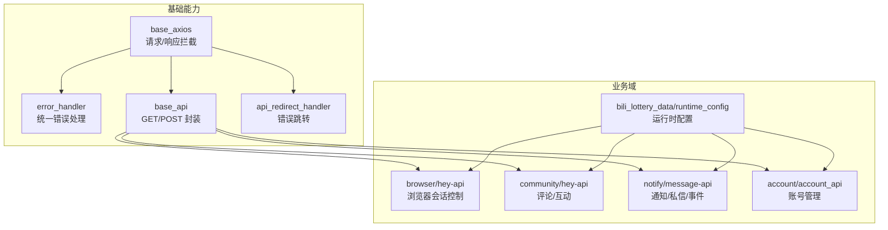
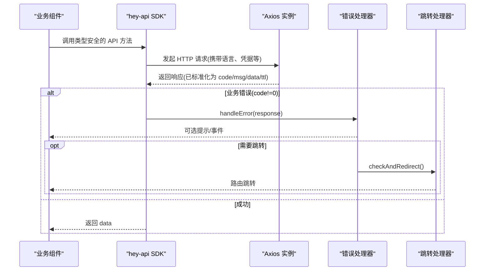
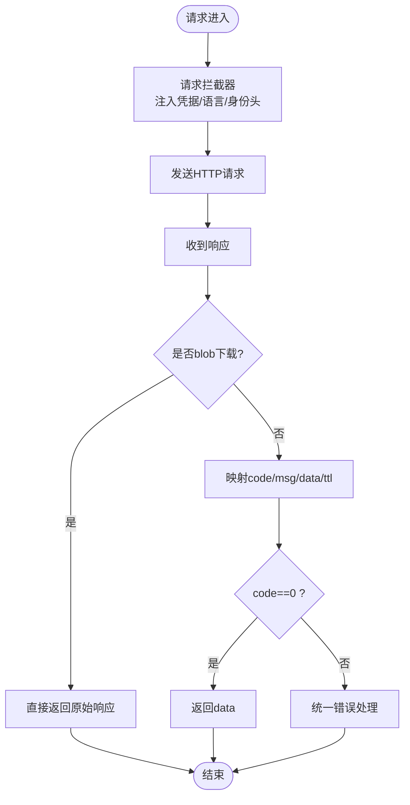
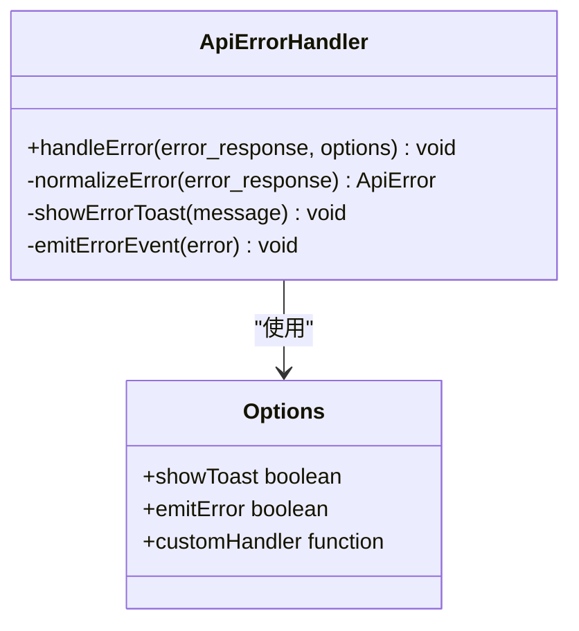
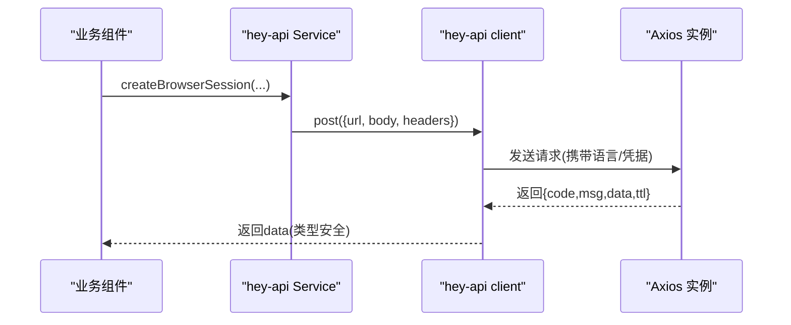
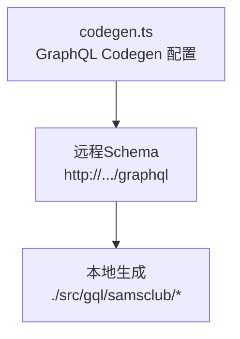
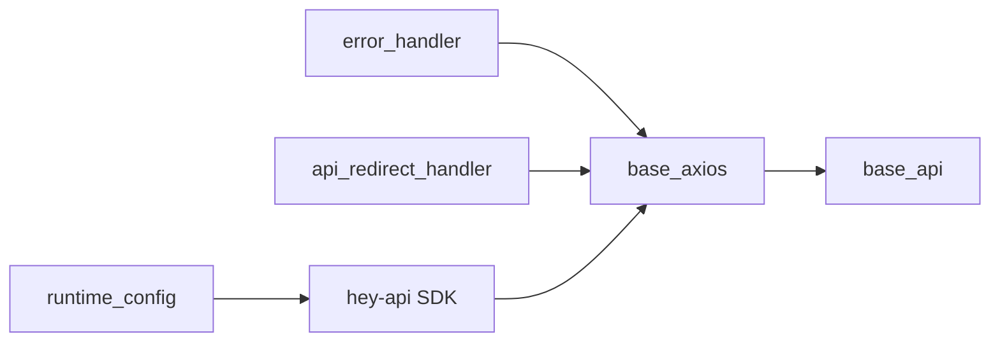

# API 集成

<cite>
**本文引用的文件**
- [base_axios.ts](file://Vue3FrontEndDemoExercise/src/api/base_axios/base_axios.ts)
- [error_handler.ts](file://Vue3FrontEndDemoExercise/src/api/base_axios/error_handler.ts)
- [base_api.ts](file://Vue3FrontEndDemoExercise/src/api/base_axios/base_api.ts)
- [api_redirect_handler.ts](file://Vue3FrontEndDemoExercise/src/api/base_axios/api_redirect_handler.ts)
- [runtime_config.ts（抽奖数据）](file://Vue3FrontEndDemoExercise/src/api/bili_lottery_data/runtime_config.ts)
- [浏览器会话控制Service.gen.ts](file://Vue3FrontEndDemoExercise/src/api/browser/hey-api/services/浏览器会话控制Service.gen.ts)
- [CommentService.gen.ts](file://Vue3FrontEndDemoExercise/src/api/community/hey-api/services/CommentService.gen.ts)
- [message-api.ts](file://Vue3FrontEndDemoExercise/src/api/notify/message-api.ts)
- [account_api.ts](file://Vue3FrontEndDemoExercise/src/api/account/account_api.ts)
- [codegen.ts](file://Vue3FrontEndDemoExercise/codegen.ts)
</cite>

## 目录
1. [简介](#简介)
2. [项目结构](#项目结构)
3. [核心组件](#核心组件)
4. [架构总览](#架构总览)
5. [详细组件分析](#详细组件分析)
6. [依赖关系分析](#依赖关系分析)
7. [性能与可靠性](#性能与可靠性)
8. [故障排查指南](#故障排查指南)
9. [结论](#结论)
10. [附录](#附录)

## 简介
本技术文档面向前端 API 集成层，系统性说明基于 Axios 的 HTTP 客户端封装、请求拦截器与响应处理器、统一错误处理机制；并详解 hey-api 自动生成的类型安全 API 客户端在浏览器控制、社区互动、消息推送等业务模块中的使用方法与运行时配置。同时给出接口版本管理、请求重试与缓存策略的建议方案，以及调试工具、Mock 数据生成与性能监控的实践方法，帮助开发者高效集成后端服务。

## 项目结构
前端 API 集成层主要位于 Vue3FrontEndDemoExercise/src/api 下，按“基础能力 + 业务域”组织：
- base_axios：Axios 实例创建、请求/响应拦截器、统一错误处理、BaseApi 基类、错误跳转处理器
- 各业务域：browser（RPA 浏览器）、community（评论等社区能力）、notify（通知/私信/事件）、account（账号管理）、bili_lottery_data（抽奖数据）等
- 每个业务域通常包含 hey-api 自动生成代码与 runtime_config 运行时配置，用于注入语言、凭证、超时等全局行为

图表来源
- [base_axios.ts:1-88](file://Vue3FrontEndDemoExercise/src/api/base_axios/base_axios.ts#L1-L88)
- [error_handler.ts:1-145](file://Vue3FrontEndDemoExercise/src/api/base_axios/error_handler.ts#L1-L145)
- [base_api.ts:1-80](file://Vue3FrontEndDemoExercise/src/api/base_axios/base_api.ts#L1-L80)
- [api_redirect_handler.ts:1-170](file://Vue3FrontEndDemoExercise/src/api/base_axios/api_redirect_handler.ts#L1-L170)
- [runtime_config.ts（抽奖数据）:1-17](file://Vue3FrontEndDemoExercise/src/api/bili_lottery_data/runtime_config.ts#L1-L17)

章节来源
- [base_axios.ts:1-88](file://Vue3FrontEndDemoExercise/src/api/base_axios/base_axios.ts#L1-L88)
- [error_handler.ts:1-145](file://Vue3FrontEndDemoExercise/src/api/base_axios/error_handler.ts#L1-L145)
- [base_api.ts:1-80](file://Vue3FrontEndDemoExercise/src/api/base_axios/base_api.ts#L1-L80)
- [api_redirect_handler.ts:1-170](file://Vue3FrontEndDemoExercise/src/api/base_axios/api_redirect_handler.ts#L1-L170)
- [runtime_config.ts（抽奖数据）:1-17](file://Vue3FrontEndDemoExercise/src/api/bili_lottery_data/runtime_config.ts#L1-L17)

## 核心组件
- Axios 实例与拦截器
  - 请求拦截器：注入跨域 Cookie、用户标识与角色头、当前语言 Accept-Language
  - 响应拦截器：标准化响应体为 code/msg/data/ttl，非 0 时进入统一错误处理
- 统一错误处理
  - 支持显示提示、事件派发、自定义处理器
  - 提供 withErrorHandler 包装函数，便于对任意异步 API 进行错误收敛
- BaseApi 基类
  - 提供 _get/_post 及带错误处理的变体，简化业务调用
- 错误跳转处理器
  - 根据 URL 模式与错误码触发确认或直接跳转，内置认证失败、服务器错误等预设

章节来源
- [base_axios.ts:27-84](file://Vue3FrontEndDemoExercise/src/api/base_axios/base_axios.ts#L27-L84)
- [error_handler.ts:27-145](file://Vue3FrontEndDemoExercise/src/api/base_axios/error_handler.ts#L27-L145)
- [base_api.ts:13-79](file://Vue3FrontEndDemoExercise/src/api/base_axios/base_api.ts#L13-L79)
- [api_redirect_handler.ts:36-170](file://Vue3FrontEndDemoExercise/src/api/base_axios/api_redirect_handler.ts#L36-L170)

## 架构总览
下图展示了从业务组件到 hey-api SDK 再到 Axios 实例的请求链路，以及统一错误处理与跳转流程。

图表来源
- [base_axios.ts:48-84](file://Vue3FrontEndDemoExercise/src/api/base_axios/base_axios.ts#L48-L84)
- [error_handler.ts:46-108](file://Vue3FrontEndDemoExercise/src/api/base_axios/error_handler.ts#L46-L108)
- [api_redirect_handler.ts:49-125](file://Vue3FrontEndDemoExercise/src/api/base_axios/api_redirect_handler.ts#L49-L125)

## 详细组件分析

### Axios 客户端与拦截器
- 请求阶段
  - 启用跨域 Cookie 携带
  - 注入 x-bili-mid/x-bili-level/x-bili-role 等身份头
  - 注入 Accept-Language 以支持后端 i18n
- 响应阶段
  - 将后端统一响应体映射为 response.code/response.msg/response.ttl/response.data
  - 非 0 错误码进入统一错误处理，避免重复提示

图表来源
- [base_axios.ts:27-84](file://Vue3FrontEndDemoExercise/src/api/base_axios/base_axios.ts#L27-L84)

章节来源
- [base_axios.ts:27-84](file://Vue3FrontEndDemoExercise/src/api/base_axios/base_axios.ts#L27-L84)

### 统一错误处理
- 标准化错误对象：兼容 Axios 错误、后端标准错误、网络异常
- 可配置：是否弹窗、是否派发事件、自定义处理器
- 便捷包装：withErrorHandler 可对任意异步函数进行错误收敛

图表来源
- [error_handler.ts:27-145](file://Vue3FrontEndDemoExercise/src/api/base_axios/error_handler.ts#L27-L145)

章节来源
- [error_handler.ts:27-145](file://Vue3FrontEndDemoExercise/src/api/base_axios/error_handler.ts#L27-L145)

### BaseApi 基类
- 提供 GET/POST 封装，拼接 path
- 提供带错误处理的变体，自动检查 code 并调用统一错误处理
- 提供 withErrorHandling 高阶函数，便于子类复用

章节来源
- [base_api.ts:13-79](file://Vue3FrontEndDemoExercise/src/api/base_axios/base_api.ts#L13-L79)

### 错误跳转处理器
- 支持按 URL 模式与错误码过滤触发
- 支持确认框或自动跳转，内置认证失败、服务器错误等预设
- 可在跳转前后执行回调

章节来源
- [api_redirect_handler.ts:36-170](file://Vue3FrontEndDemoExercise/src/api/base_axios/api_redirect_handler.ts#L36-L170)

### hey-api 自动生成的 API 客户端
- 类型安全：SDK 基于 OpenAPI 生成，参数、响应、错误类型均受 TS 约束
- 运行时配置：通过 runtime_config 注入 baseUrl、timeout、credentials、onRequest 等
- 典型用法：
  - 浏览器控制：会话创建/状态查询/关闭
  - 社区互动：评论列表、详情、点赞点踩、举报、@搜索、置顶
  - 消息推送：通知列表/未读/删除、事件列表/已读、私信会话/消息、设置

图表来源
- [浏览器会话控制Service.gen.ts:8-69](file://Vue3FrontEndDemoExercise/src/api/browser/hey-api/services/浏览器会话控制Service.gen.ts#L8-L69)
- [runtime_config.ts（抽奖数据）:4-16](file://Vue3FrontEndDemoExercise/src/api/bili_lottery_data/runtime_config.ts#L4-L16)
- [base_axios.ts:27-84](file://Vue3FrontEndDemoExercise/src/api/base_axios/base_axios.ts#L27-L84)

章节来源
- [浏览器会话控制Service.gen.ts:8-69](file://Vue3FrontEndDemoExercise/src/api/browser/hey-api/services/浏览器会话控制Service.gen.ts#L8-L69)
- [CommentService.gen.ts:8-182](file://Vue3FrontEndDemoExercise/src/api/community/hey-api/services/CommentService.gen.ts#L8-L182)
- [runtime_config.ts（抽奖数据）:4-16](file://Vue3FrontEndDemoExercise/src/api/bili_lottery_data/runtime_config.ts#L4-L16)

### 业务模块 API 服务设计

#### 浏览器控制（RPA 浏览器）
- 会话生命周期：创建、状态查询、关闭
- 特点：独立会话创建接口，与心跳解耦；若浏览器未运行则异步创建任务并立即返回

章节来源
- [浏览器会话控制Service.gen.ts:8-69](file://Vue3FrontEndDemoExercise/src/api/browser/hey-api/services/浏览器会话控制Service.gen.ts#L8-L69)

#### 社区互动（评论）
- 功能：发表评论、删除、列表、详情、计数、楼中楼展开、点赞/点踩/取消、举报、@搜索、置顶
- 鉴权：通过 x-bili-* 头识别登录用户；作者信息按需回捞，减少冗余存储

章节来源
- [CommentService.gen.ts:8-182](file://Vue3FrontEndDemoExercise/src/api/community/hey-api/services/CommentService.gen.ts#L8-L182)

#### 消息推送（通知/私信/事件）
- 统一封装层：仅在此处调用 hey-api SDK，集中错误处理、类型收敛与未读联动
- 能力：通知列表/未读/删除、管理员发布/修改/撤回、事件列表/已读/删除、私信会话/消息/发送/已读、消息设置
- 注意：鉴权依赖上游网关注入的 x-bili-* 头

章节来源
- [message-api.ts:1-423](file://Vue3FrontEndDemoExercise/src/api/notify/message-api.ts#L1-L423)

#### 账号管理
- 能力：获取所有账号、新增账号、查询账号信息与运行状态、保存设置、获取消息会话
- 使用 hey-api 生成的 client 直接调用

章节来源
- [account_api.ts:1-78](file://Vue3FrontEndDemoExercise/src/api/account/account_api.ts#L1-L78)

### 概念性概览
下图展示 GraphQL 代码生成配置，用于拉取远端 schema 并生成类型化客户端代码，便于强类型调用。

图表来源
- [codegen.ts:1-18](file://Vue3FrontEndDemoExercise/codegen.ts#L1-L18)

## 依赖关系分析
- 基础层依赖
  - base_axios 依赖 error_handler 与 stores（用户导航、国际化）
  - base_api 依赖 base_axios 与 error_handler
  - api_redirect_handler 依赖路由与 UI 组件库
- 业务层依赖
  - 各业务域通过 hey-api SDK 调用后端接口
  - runtime_config 注入全局请求行为（语言、凭据、超时等）

图表来源
- [base_axios.ts:10-14](file://Vue3FrontEndDemoExercise/src/api/base_axios/base_axios.ts#L10-L14)
- [base_api.ts:9-11](file://Vue3FrontEndDemoExercise/src/api/base_axios/base_api.ts#L9-L11)
- [runtime_config.ts（抽奖数据）:1-16](file://Vue3FrontEndDemoExercise/src/api/bili_lottery_data/runtime_config.ts#L1-L16)

章节来源
- [base_axios.ts:10-14](file://Vue3FrontEndDemoExercise/src/api/base_axios/base_axios.ts#L10-L14)
- [base_api.ts:9-11](file://Vue3FrontEndDemoExercise/src/api/base_axios/base_api.ts#L9-L11)
- [runtime_config.ts（抽奖数据）:1-16](file://Vue3FrontEndDemoExercise/src/api/bili_lottery_data/runtime_config.ts#L1-L16)

## 性能与可靠性
- 版本管理
  - 建议通过 baseURL 或路径前缀区分 v1/v2，结合路由守卫与灰度开关实现平滑升级
  - 在 runtime_config 中集中维护版本常量，便于统一切换
- 请求重试
  - 建议在 axios 拦截器中针对幂等 GET 或特定错误码实施指数退避重试
  - 限制最大重试次数与退避上限，避免雪崩
- 缓存策略
  - 读多写少接口可使用内存缓存（如 LRU），配合版本号与失效键
  - 大文件或图片下载走 blob 分支，避免二次解析
- 并发与节流
  - 对高频轮询（如心跳、未读数）做节流与去抖
  - 长列表分页加载采用游标翻页，减少全量刷新
- 监控埋点
  - 在响应拦截器中记录耗时、状态码、URL、错误堆栈，上报至监控系统
  - 关键业务接口增加成功率、P95/P99 指标

[本节为通用指导，不直接分析具体文件]

## 故障排查指南
- 常见问题定位
  - 跨域 Cookie 未携带：检查 withCredentials/credentials 配置
  - 语言未生效：检查 Accept-Language 注入逻辑
  - 统一错误未提示：检查 code 是否为 0 与错误处理器是否被调用
  - 跳转不生效：检查路由可用性与跳转前置条件
- 快速验证
  - 使用浏览器 Network 面板查看请求头与响应体
  - 在错误处理器中打印规范化后的 ApiError
  - 使用 api_redirect_handler 的预设快速验证认证/服务器错误场景

章节来源
- [base_axios.ts:27-84](file://Vue3FrontEndDemoExercise/src/api/base_axios/base_axios.ts#L27-L84)
- [error_handler.ts:46-108](file://Vue3FrontEndDemoExercise/src/api/base_axios/error_handler.ts#L46-L108)
- [api_redirect_handler.ts:132-170](file://Vue3FrontEndDemoExercise/src/api/base_axios/api_redirect_handler.ts#L132-L170)

## 结论
本集成层通过 Axios 拦截器与统一错误处理，实现了跨域凭据、国际化、身份头的集中注入与错误收敛；借助 hey-api 生成类型安全的 SDK，显著降低前后端契约漂移风险；通过模块化业务封装，提升了浏览器控制、社区互动、消息推送等能力的可维护性与扩展性。配合版本管理、重试与缓存策略，以及完善的调试与监控手段，可为生产环境提供稳定高效的 API 集成体验。

## 附录
- 常用配置要点
  - 运行时配置：baseUrl、timeout、credentials、onRequest 注入语言
  - 错误处理：showToast、emitError、customHandler
  - 跳转策略：按 URL 模式与错误码精准触发
- 参考文件
  - [runtime_config.ts（抽奖数据）:4-16](file://Vue3FrontEndDemoExercise/src/api/bili_lottery_data/runtime_config.ts#L4-L16)
  - [error_handler.ts:118-145](file://Vue3FrontEndDemoExercise/src/api/base_axios/error_handler.ts#L118-L145)
  - [api_redirect_handler.ts:132-170](file://Vue3FrontEndDemoExercise/src/api/base_axios/api_redirect_handler.ts#L132-L170)