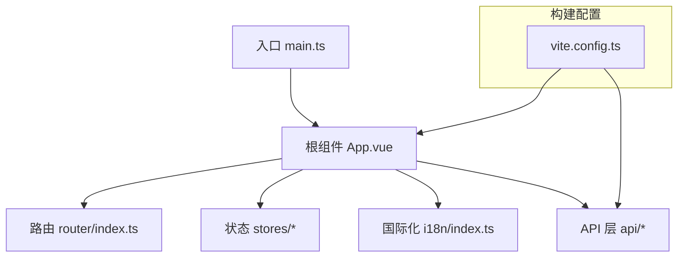
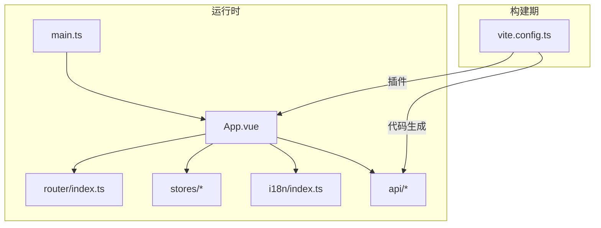
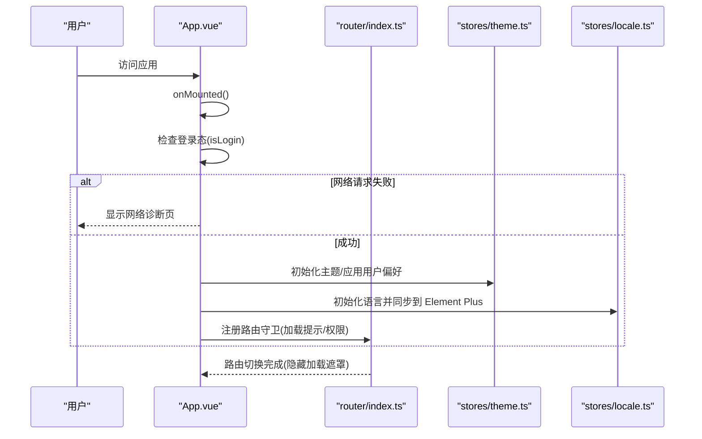
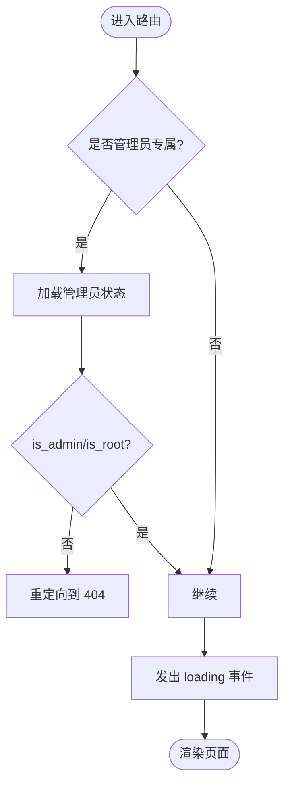
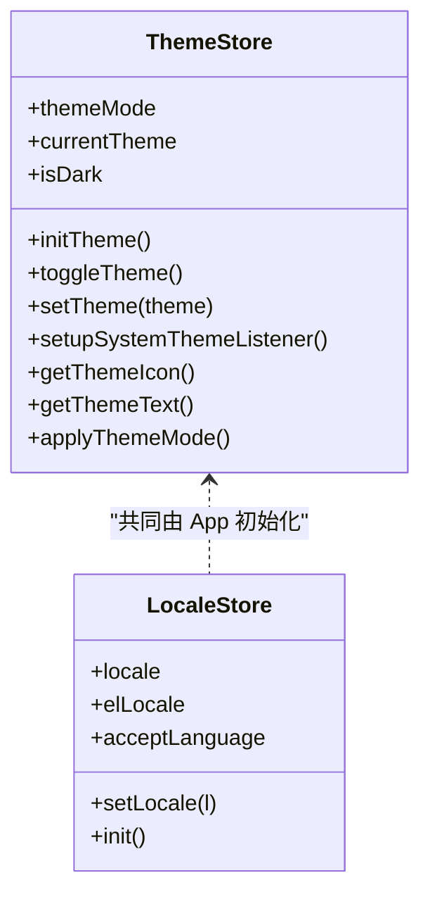
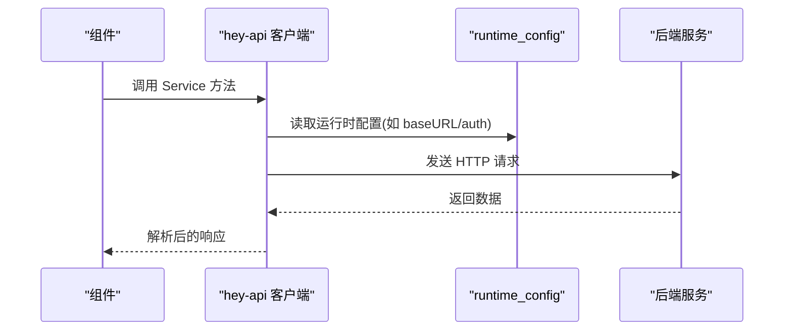
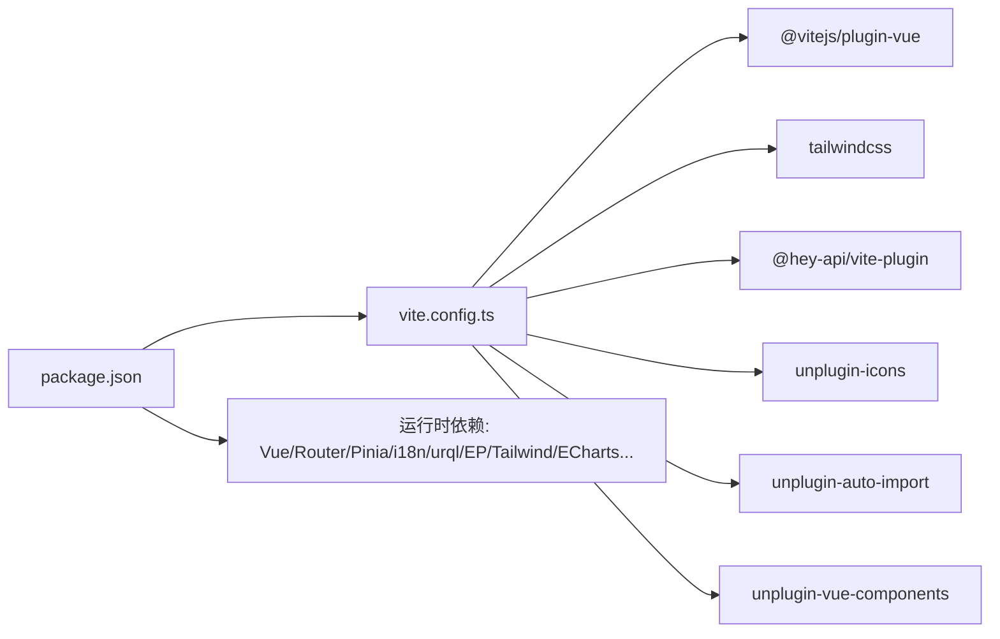

# 前端应用

<cite>
**本文引用的文件**
- [package.json](file://Vue3FrontEndDemoExercise/package.json)
- [vite.config.ts](file://Vue3FrontEndDemoExercise/vite.config.ts)
- [main.ts](file://Vue3FrontEndDemoExercise/src/main.ts)
- [App.vue](file://Vue3FrontEndDemoExercise/src/App.vue)
- [router/index.ts](file://Vue3FrontEndDemoExercise/src/router/index.ts)
- [stores/index.ts](file://Vue3FrontEndDemoExercise/src/stores/index.ts)
- [stores/theme.ts](file://Vue3FrontEndDemoExercise/src/stores/theme.ts)
- [stores/locale.ts](file://Vue3FrontEndDemoExercise/src/stores/locale.ts)
- [i18n/index.ts](file://Vue3FrontEndDemoExercise/src/i18n/index.ts)
</cite>

## 目录
1. [简介](#简介)
2. [项目结构](#项目结构)
3. [核心组件](#核心组件)
4. [架构总览](#架构总览)
5. [详细组件分析](#详细组件分析)
6. [依赖分析](#依赖分析)
7. [性能考虑](#性能考虑)
8. [故障排查指南](#故障排查指南)
9. [结论](#结论)
10. [附录](#附录)

## 简介
本文件为基于 Vue3 + TypeScript + Vite 的前端应用开发文档，覆盖 RPA 控制台、数据展示界面与管理后台的功能实现与工程化配置。重点包括：
- 组件结构与组织方式
- 状态管理（Pinia）与国际化（vue-i18n）
- 路由配置与权限控制
- API 集成（OpenAPI 代码生成、GraphQL/urql、Axios）
- 构建与开发工具链（Vite、Tailwind、Element Plus、自动导入与图标）
- 性能优化与调试技巧

## 项目结构
前端工程位于 Vue3FrontEndDemoExercise 目录，采用功能域划分与通用组件分层结合的组织方式：
- src/views：页面级视图（RPA 控制台、消息中心、动态广场、管理后台等）
- src/components：业务与通用组件（容器、表格、反馈、搜索、用户头像等）
- src/stores：全局状态（主题、语言、用户偏好、业务模块状态）
- src/api：接口层（OpenAPI 自动生成客户端、GraphQL 查询、自定义封装）
- src/i18n：多语言资源与初始化
- src/router：路由定义与守卫
- vite.config.ts：构建与插件配置（自动导入、图标、Sitemap、Tailwind、hey-api 代码生成）

图表来源
- [main.ts:1-60](file://Vue3FrontEndDemoExercise/src/main.ts#L1-L60)
- [App.vue:1-214](file://Vue3FrontEndDemoExercise/src/App.vue#L1-L214)
- [router/index.ts:1-793](file://Vue3FrontEndDemoExercise/src/router/index.ts#L1-L793)
- [vite.config.ts:1-179](file://Vue3FrontEndDemoExercise/vite.config.ts#L1-L179)

章节来源
- [package.json:1-95](file://Vue3FrontEndDemoExercise/package.json#L1-L95)
- [vite.config.ts:1-179](file://Vue3FrontEndDemoExercise/vite.config.ts#L1-L179)

## 核心组件
- 应用壳与生命周期
  - 入口 main.ts 注册 Pinia、Router、i18n、Head、urql、Casdoor SDK、Element Plus 图标，并初始化主题与用户偏好。
  - 根组件 App.vue 负责全局布局、登录态检查、网络错误诊断页、主题与尺寸监听、国际化同步、全局加载遮罩与滚动按钮。
- 路由与导航
  - router/index.ts 集中定义所有路由与元信息（标题、描述、是否需要登录、是否管理员可见、排序等），并提供 beforeEach/afterEach 钩子用于权限校验与加载提示。
- 状态管理
  - stores/index.ts 创建 Pinia 实例并启用持久化插件。
  - stores/theme.ts 提供主题模式（亮/暗/自动）、系统主题监听、持久化与切换逻辑。
  - stores/locale.ts 维护当前语言、Element Plus 语言包映射、Accept-Language 头值，并与 vue-i18n 同步。
- 国际化
  - i18n/index.ts 定义支持的语言集合、检测策略、默认回退语言，并聚合各命名空间文案。

章节来源
- [main.ts:1-60](file://Vue3FrontEndDemoExercise/src/main.ts#L1-L60)
- [App.vue:1-214](file://Vue3FrontEndDemoExercise/src/App.vue#L1-L214)
- [router/index.ts:1-793](file://Vue3FrontEndDemoExercise/src/router/index.ts#L1-L793)
- [stores/index.ts:1-19](file://Vue3FrontEndDemoExercise/src/stores/index.ts#L1-L19)
- [stores/theme.ts:1-123](file://Vue3FrontEndDemoExercise/src/stores/theme.ts#L1-L123)
- [stores/locale.ts:1-64](file://Vue3FrontEndDemoExercise/src/stores/locale.ts#L1-L64)
- [i18n/index.ts:1-39](file://Vue3FrontEndDemoExercise/src/i18n/index.ts#L1-L39)

## 架构总览
前端以 Vue3 为框架，使用 TypeScript 进行类型约束，Vite 作为构建工具。通过 Pinia 管理全局状态，vue-router 管理页面路由，vue-i18n 提供多语言，urql 处理 GraphQL，axios/ofetch 处理 REST API。样式体系基于 Tailwind CSS 与 Element Plus，并通过 unplugin 系列实现自动导入与图标注册。OpenAPI 通过 hey-api 插件按服务拆分生成客户端代码，便于统一调用。

图表来源
- [main.ts:1-60](file://Vue3FrontEndDemoExercise/src/main.ts#L1-L60)
- [App.vue:1-214](file://Vue3FrontEndDemoExercise/src/App.vue#L1-L214)
- [router/index.ts:1-793](file://Vue3FrontEndDemoExercise/src/router/index.ts#L1-L793)
- [vite.config.ts:1-179](file://Vue3FrontEndDemoExercise/vite.config.ts#L1-L179)

## 详细组件分析

### 应用壳与生命周期（App.vue）
- 职责
  - 挂载全局 UI 容器、头部栏、滚动区域与 RouterView。
  - 首次加载时检查登录态，若网络请求失败则显示网络诊断页。
  - 初始化主题与用户偏好，监听系统主题变化与窗口尺寸变化。
  - 注入全局打开登录弹窗能力，供任意层级触发。
  - 同步国际化到 Element Plus 语言包。
- 关键流程
  - onMounted 中执行登录态检查、主题初始化、事件监听与统计脚本加载。
  - afterEach 路由守卫中在 Casdoor 回调返回后刷新用户信息。
  - provide/inject 暴露全局登录弹窗方法。

图表来源
- [App.vue:1-214](file://Vue3FrontEndDemoExercise/src/App.vue#L1-L214)
- [router/index.ts:746-788](file://Vue3FrontEndDemoExercise/src/router/index.ts#L746-L788)
- [stores/theme.ts:1-123](file://Vue3FrontEndDemoExercise/src/stores/theme.ts#L1-L123)
- [stores/locale.ts:1-64](file://Vue3FrontEndDemoExercise/src/stores/locale.ts#L1-L64)

章节来源
- [App.vue:1-214](file://Vue3FrontEndDemoExercise/src/App.vue#L1-L214)

### 路由与权限控制（router/index.ts）
- 路由组织
  - 首页、抽奖数据、山姆会员店、用户中心、RPA 浏览器、消息中心、动态广场、管理后台等。
  - 每个路由包含 meta：标题、描述、图标、是否需要登录、是否管理员可见、排序、是否在首页展示等。
- 权限与加载
  - beforeEach：对 adminOnly/requiresAdmin/requiresMessageRoot 的页面进行身份校验；非授权时重定向至 404。
  - 子路由切换不重复显示 loading；进入路由前发出 loading 事件，完成后隐藏。
- 典型页面
  - RPA 控制台：指纹列表、创建/编辑、流式控制台、社区、动作与工作流管理、日志。
  - 管理后台：通知、私信、评论审核、权限、举报、动态/话题审核、头像/封面审核等。

图表来源
- [router/index.ts:746-788](file://Vue3FrontEndDemoExercise/src/router/index.ts#L746-L788)

章节来源
- [router/index.ts:1-793](file://Vue3FrontEndDemoExercise/src/router/index.ts#L1-L793)

### 状态管理（Pinia）
- 主题状态（theme.ts）
  - 支持亮/暗/自动三种模式，自动跟随系统主题，持久化到 localStorage。
  - 提供切换、设置、获取图标与文本等方法。
- 语言状态（locale.ts）
  - 维护当前语言、Element Plus 语言包映射、Accept-Language 值。
  - 初始化时同步到 vue-i18n，并持久化。
- 全局 Pinia 实例（stores/index.ts）
  - 启用 pinia-plugin-persistedstate，实现 store 自动持久化。

图表来源
- [stores/theme.ts:1-123](file://Vue3FrontEndDemoExercise/src/stores/theme.ts#L1-L123)
- [stores/locale.ts:1-64](file://Vue3FrontEndDemoExercise/src/stores/locale.ts#L1-L64)
- [stores/index.ts:1-19](file://Vue3FrontEndDemoExercise/src/stores/index.ts#L1-L19)

章节来源
- [stores/theme.ts:1-123](file://Vue3FrontEndDemoExercise/src/stores/theme.ts#L1-L123)
- [stores/locale.ts:1-64](file://Vue3FrontEndDemoExercise/src/stores/locale.ts#L1-L64)
- [stores/index.ts:1-19](file://Vue3FrontEndDemoExercise/src/stores/index.ts#L1-L19)

### 国际化（vue-i18n）
- 支持语言：zh-CN、en、zh-TW、ja、ko。
- 检测策略：根据 navigator.language 推断，默认 zh-CN。
- 聚合命名空间：common、generated、user、changelog、lottery、callback、sams、message、rpa。
- 与 Element Plus 联动：通过 locale store 同步语言包。

章节来源
- [i18n/index.ts:1-39](file://Vue3FrontEndDemoExercise/src/i18n/index.ts#L1-L39)
- [stores/locale.ts:1-64](file://Vue3FrontEndDemoExercise/src/stores/locale.ts#L1-L64)

### API 集成
- OpenAPI 代码生成（hey-api）
  - 从后端 openapi.json 生成 TypeScript 客户端与服务类，按 tag 拆分为 services/*。
  - 输出路径：src/api/browser/hey-api、src/api/bili_lottery_data/hey-api、src/api/community/hey-api。
  - 运行时配置路径：对应 runtime_config.ts。
- GraphQL（urql）
  - 在 main.ts 中初始化 urql，使用 cacheExchange 与 fetchExchange，URL 来自环境变量。
- Axios/ofetch
  - 基础封装位于 base_axios 与 ofetch 使用于 hey-api 生成的客户端。
- 业务 API
  - 用户、反馈、通知、抽奖数据、山姆会员店等模块 API 集中在 src/api 下。

图表来源
- [vite.config.ts:85-154](file://Vue3FrontEndDemoExercise/vite.config.ts#L85-L154)
- [main.ts:27-32](file://Vue3FrontEndDemoExercise/src/main.ts#L27-L32)

章节来源
- [vite.config.ts:85-154](file://Vue3FrontEndDemoExercise/vite.config.ts#L85-L154)
- [main.ts:27-32](file://Vue3FrontEndDemoExercise/src/main.ts#L27-L32)

### RPA 控制台
- 路由与页面
  - /app/rpa-browser 下包含指纹列表、创建/编辑、流式控制台、社区、动作与工作流管理、日志等子路由。
- 功能要点
  - 指纹管理：增删改查与预览。
  - 流式控制台：实时查看浏览器操作与执行结果。
  - 工作流与动作：可视化编排与执行。
  - 日志：操作审计与问题定位。

章节来源
- [router/index.ts:347-469](file://Vue3FrontEndDemoExercise/src/router/index.ts#L347-L469)

### 数据展示界面
- 路由与页面
  - /app/lot-data 聚合 B站抽奖数据相关页面，含官方/预约/充电/话题等分类与排行榜。
  - /app/samsclub/info 展示山姆会员店商品数据。
- 功能要点
  - 列表与卡片展示、搜索筛选、详情与评论。
  - 图表与统计（ECharts）。

章节来源
- [router/index.ts:129-307](file://Vue3FrontEndDemoExercise/src/router/index.ts#L129-L307)

### 管理后台
- 路由与页面
  - /app/admin 聚合管理功能：通知、私信、评论、权限、举报、动态/话题审核、头像/封面审核等。
- 权限控制
  - 需要管理员或特定角色（requiresAdmin/requiresMessageRoot），否则重定向到 404。

章节来源
- [router/index.ts:609-733](file://Vue3FrontEndDemoExercise/src/router/index.ts#L609-L733)
- [router/index.ts:746-788](file://Vue3FrontEndDemoExercise/src/router/index.ts#L746-L788)

## 依赖分析
- 构建与插件
  - Vite、@vitejs/plugin-vue、@vitejs/plugin-vue-jsx、vite-plugin-sitemap、tailwindcss、unplugin-icons、unplugin-auto-import、unplugin-vue-components、hey-api/vite-plugin、vite-svg-loader。
- 运行时依赖
  - Vue3、Vue Router、Pinia、pinia-plugin-persistedstate、vue-i18n、@urql/vue、Element Plus、Tailwind/DaisyUI、ECharts、Flv.js、Mitt、Sanitize-html、Casdoor SDK、Clarity 等。
- 开发依赖
  - TypeScript、ESLint、Prettier、Playwright、graphql-codegen、@hey-api/openapi-ts 等。

图表来源
- [package.json:1-95](file://Vue3FrontEndDemoExercise/package.json#L1-L95)
- [vite.config.ts:1-179](file://Vue3FrontEndDemoExercise/vite.config.ts#L1-L179)

章节来源
- [package.json:1-95](file://Vue3FrontEndDemoExercise/package.json#L1-L95)
- [vite.config.ts:1-179](file://Vue3FrontEndDemoExercise/vite.config.ts#L1-L179)

## 性能考虑
- 构建优化
  - 使用 Vite 按需加载与 Tree-shaking；SVG 仅做组件化转换，禁用 svgo 以避免崩溃。
  - 启用 Sitemap 生成，利于 SEO。
- 运行时优化
  - KeepAlive 缓存常用页面，减少重复渲染。
  - 主题与语言持久化，避免重复计算与请求。
  - 使用 @vueuse/core 的 useDebounceFn 防抖窗口 resize。
- 网络优化
  - 通过 hey-api 生成类型安全的客户端，减少手写错误。
  - urql 使用 cacheExchange 提升 GraphQL 查询性能。
  - 代理配置将 /api 转发至后端，避免跨域问题。

[本节为通用指导，不直接分析具体文件]

## 故障排查指南
- 网络错误诊断
  - App.vue 在登录态检查失败时显示 NetworkErrorView，便于快速定位网络问题。
- 权限拦截
  - 管理后台与消息 root 页面在非授权时重定向到 404，确认路由 meta 与 store 状态是否正确。
- 主题与语言
  - 若主题未生效，检查 theme store 的 persist 与系统主题监听；若语言未切换，检查 locale store 与 i18n 同步。
- 构建与代码生成
  - 若 hey-api 未生成客户端，检查 vite.config.ts 中的输入地址与输出路径；确保后端 openapi.json 可访问。
- 调试工具
  - 启用 vite-plugin-vue-devtools 辅助组件调试；使用 ESLint/Prettier 保持代码质量。

章节来源
- [App.vue:64-75](file://Vue3FrontEndDemoExercise/src/App.vue#L64-L75)
- [router/index.ts:746-788](file://Vue3FrontEndDemoExercise/src/router/index.ts#L746-L788)
- [stores/theme.ts:1-123](file://Vue3FrontEndDemoExercise/src/stores/theme.ts#L1-L123)
- [stores/locale.ts:1-64](file://Vue3FrontEndDemoExercise/src/stores/locale.ts#L1-L64)
- [vite.config.ts:85-154](file://Vue3FrontEndDemoExercise/vite.config.ts#L85-L154)

## 结论
本项目以 Vue3 + TypeScript + Vite 为核心，结合 Pinia、vue-i18n、urql、hey-api 等现代化工具，构建了可扩展、类型安全、易于维护的前端架构。RPA 控制台、数据展示与管理后台三大模块通过清晰的路由与状态管理实现解耦，配合 Tailwind 与 Element Plus 形成一致的 UI 体验。遵循本文档的规范与实践，开发者可快速上手并高效迭代。

[本节为总结性内容，不直接分析具体文件]

## 附录
- 开发命令
  - 开发：pnpm dev
  - 构建：pnpm build
  - 类型检查：pnpm type-check
  - 代码风格：pnpm lint / pnpm format
  - GraphQL 代码生成：pnpm graphqlgen
- 环境变量
  - GRAPH_API：GraphQL 服务端点
  - CASDOOR_*：Casdoor 认证相关配置
  - CLARITY_ID：Clarity 埋点 ID
- 别名
  - @、@api、@views、@utils、@comp、@assets

章节来源
- [package.json:6-17](file://Vue3FrontEndDemoExercise/package.json#L6-L17)
- [main.ts:27-53](file://Vue3FrontEndDemoExercise/src/main.ts#L27-L53)
- [vite.config.ts:156-164](file://Vue3FrontEndDemoExercise/vite.config.ts#L156-L164)