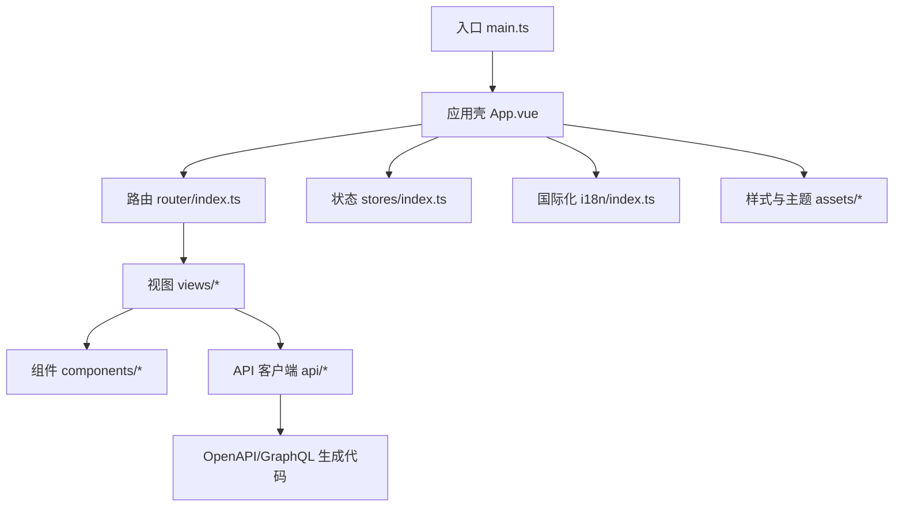
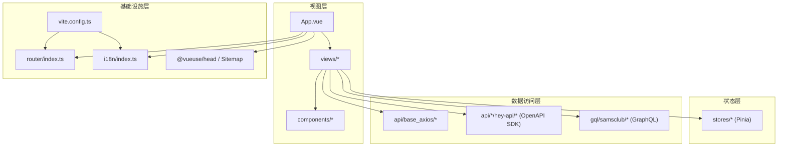
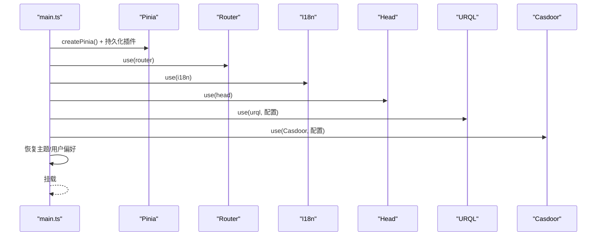
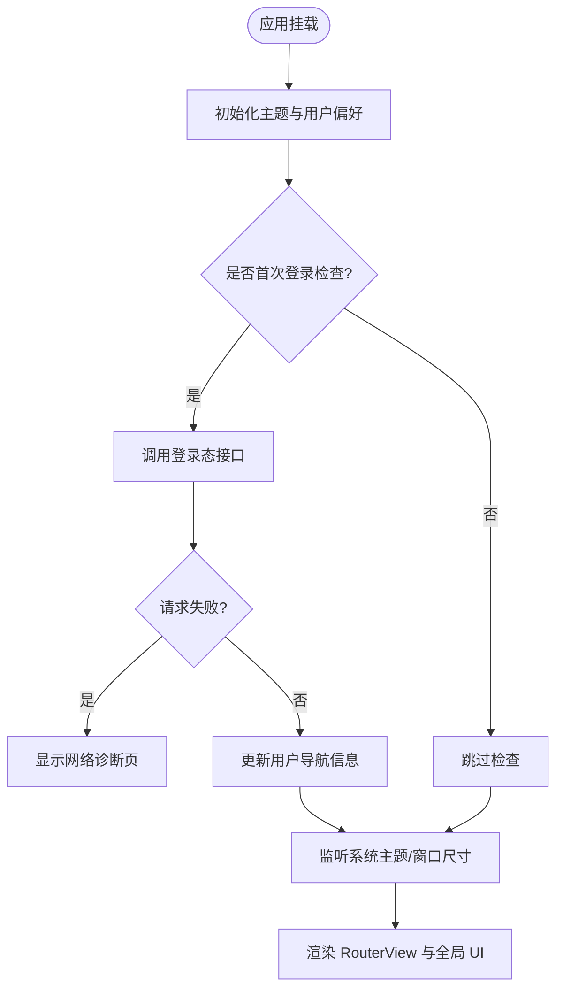
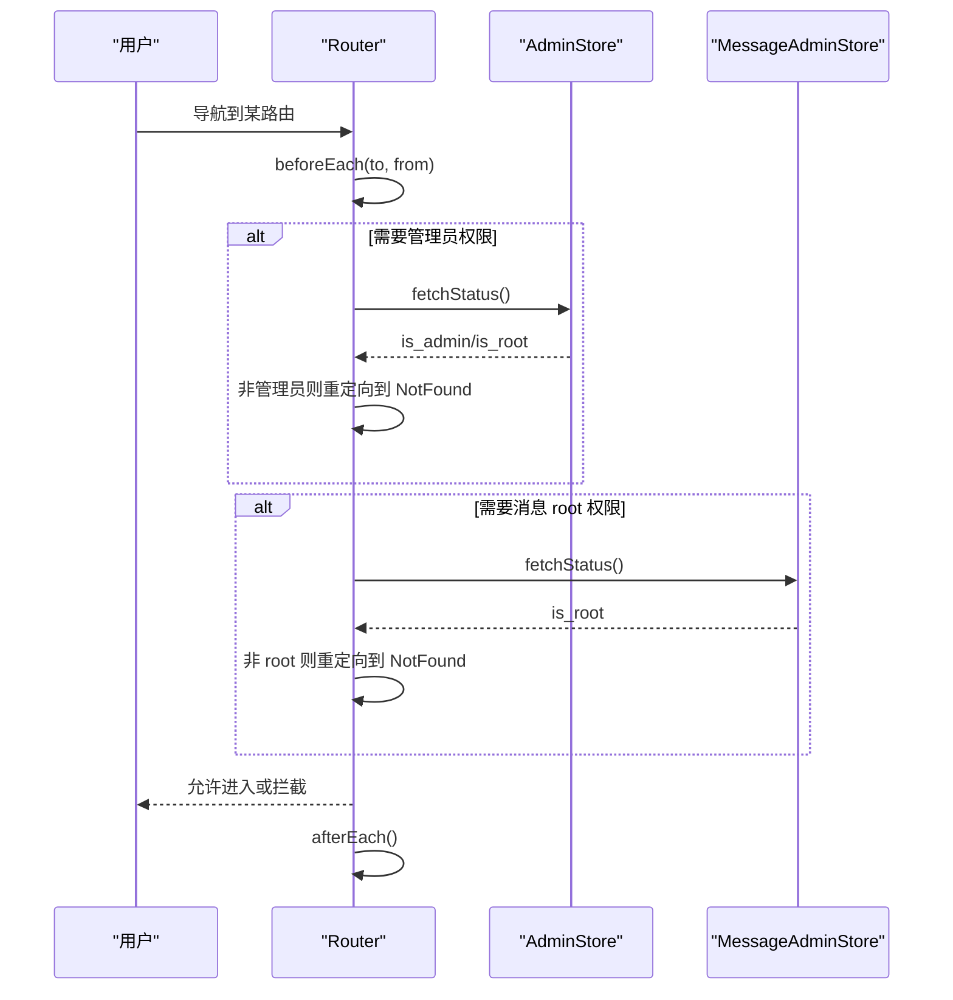
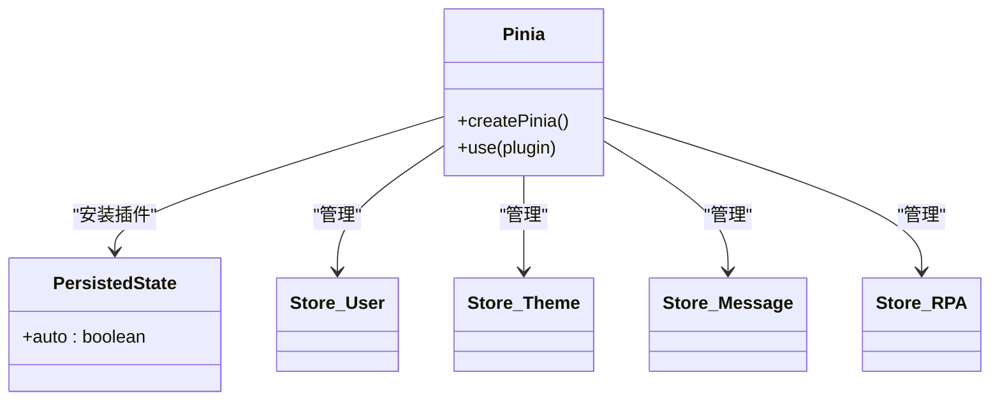
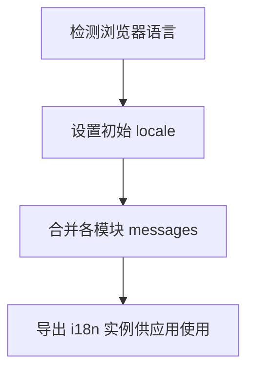
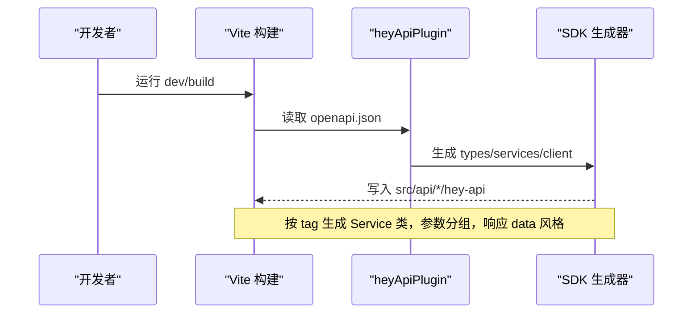
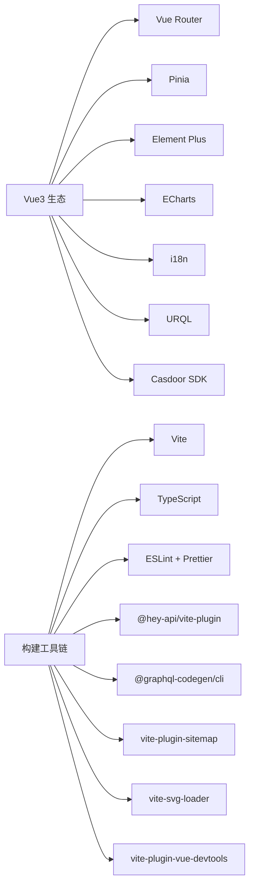

# 前端架构设计

<cite>
**本文引用的文件**
- [package.json](file://Vue3FrontEndDemoExercise/package.json)
- [vite.config.ts](file://Vue3FrontEndDemoExercise/vite.config.ts)
- [main.ts](file://Vue3FrontEndDemoExercise/src/main.ts)
- [App.vue](file://Vue3FrontEndDemoExercise/src/App.vue)
- [router/index.ts](file://Vue3FrontEndDemoExercise/src/router/index.ts)
- [models/router/index.ts](file://Vue3FrontEndDemoExercise/src/models/router/index.ts)
- [stores/index.ts](file://Vue3FrontEndDemoExercise/src/stores/index.ts)
- [i18n/index.ts](file://Vue3FrontEndDemoExercise/src/i18n/index.ts)
- [codegen.ts](file://Vue3FrontEndDemoExercise/codegen.ts)
- [.eslintrc.cjs](file://Vue3FrontEndDemoExercise/.eslintrc.cjs)
- [.prettierrc](file://Vue3FrontEndDemoExercise/.prettierrc)
- [tsconfig.json](file://Vue3FrontEndDemoExercise/tsconfig.json)
</cite>

## 目录
1. [简介](#简介)
2. [项目结构](#项目结构)
3. [核心组件](#核心组件)
4. [架构总览](#架构总览)
5. [详细组件分析](#详细组件分析)
6. [依赖分析](#依赖分析)
7. [性能考虑](#性能考虑)
8. [故障排查指南](#故障排查指南)
9. [结论](#结论)
10. [附录](#附录)

## 简介
本文件面向基于 Vue3 + TypeScript + Vite 的前端应用，系统化阐述技术选型、整体架构模式、目录组织原则与模块化设计思想。重点覆盖：
- 自动导入与组件注册、类型定义管理、构建优化策略
- 开发环境配置、环境变量管理与多环境部署方案
- 代码规范（ESLint）与格式化（Prettier）规则
- 路由、状态管理、国际化、API 客户端生成等关键模块的协作关系与最佳实践

## 项目结构
前端工程位于 Vue3FrontEndDemoExercise 目录，采用“按功能域划分”的目录组织方式：
- src/api：按业务域拆分 API 客户端（含 OpenAPI/GraphQL 生成的 SDK），以及统一的 axios 基础封装
- src/components：通用 UI 组件与业务组件分层（CommonCompo、业务域组件如 rpa-browser、message、moment 等）
- src/views：页面级视图，配合路由进行懒加载
- src/stores：Pinia 状态管理，按领域拆分 store
- src/composables：可复用组合式逻辑
- src/utils：工具函数与事件总线等
- src/i18n：多语言资源与初始化
- src/models：类型定义、注入键、路由元类型等
- src/assets：样式、主题、图片与 SVG
- vite.config.ts：构建与插件配置（自动导入、图标、Tailwind、OpenAPI 客户端生成、代理、别名等）
- tsconfig.*：TypeScript 编译与路径映射
- package.json：脚本命令、依赖与开发依赖

图表来源
- [main.ts:18-59](file://Vue3FrontEndDemoExercise/src/main.ts#L18-L59)
- [App.vue:1-214](file://Vue3FrontEndDemoExercise/src/App.vue#L1-L214)
- [router/index.ts:742-793](file://Vue3FrontEndDemoExercise/src/router/index.ts#L742-L793)
- [stores/index.ts:9-19](file://Vue3FrontEndDemoExercise/src/stores/index.ts#L9-L19)
- [i18n/index.ts:1-39](file://Vue3FrontEndDemoExercise/src/i18n/index.ts#L1-L39)

章节来源
- [package.json:6-17](file://Vue3FrontEndDemoExercise/package.json#L6-L17)
- [vite.config.ts:30-178](file://Vue3FrontEndDemoExercise/vite.config.ts#L30-L178)
- [tsconfig.json:11-33](file://Vue3FrontEndDemoExercise/tsconfig.json#L11-L33)

## 核心组件
- 应用启动与插件装配：在 main.ts 中创建并挂载 Pinia、Router、I18n、Head、URQL、Casdoor 等插件，并在挂载前恢复主题与用户偏好
- 应用壳：App.vue 负责全局布局、登录态检查、网络错误兜底、系统主题监听、窗口尺寸响应、国际化同步 Element Plus 语言等
- 路由：集中式路由表，使用懒加载与 meta 描述控制菜单、权限、缓存与显示策略；提供 beforeEach/afterEach 守卫处理管理员权限与加载提示
- 状态管理：Pinia + persistedstate 持久化，按领域拆分子 store（用户、主题、消息、RPA 管理等）
- 国际化：vue-i18n 支持多语言，运行时检测浏览器语言并合并各模块文案
- API 客户端：通过 hey-api 从后端 OpenAPI 生成 TypeScript SDK，并按服务（tag）拆分到 services 目录；同时保留 GraphQL codegen 用于特定服务

章节来源
- [main.ts:18-59](file://Vue3FrontEndDemoExercise/src/main.ts#L18-L59)
- [App.vue:1-214](file://Vue3FrontEndDemoExercise/src/App.vue#L1-L214)
- [router/index.ts:106-793](file://Vue3FrontEndDemoExercise/src/router/index.ts#L106-L793)
- [stores/index.ts:9-19](file://Vue3FrontEndDemoExercise/src/stores/index.ts#L9-L19)
- [i18n/index.ts:1-39](file://Vue3FrontEndDemoExercise/src/i18n/index.ts#L1-L39)
- [vite.config.ts:85-154](file://Vue3FrontEndDemoExercise/vite.config.ts#L85-L154)
- [codegen.ts:1-18](file://Vue3FrontEndDemoExercise/codegen.ts#L1-L18)

## 架构总览
前端采用“视图层 + 状态层 + 数据访问层 + 基础设施层”的分层架构：
- 视图层：Vue 组件与页面，负责渲染与交互
- 状态层：Pinia store 管理跨组件共享状态，结合持久化插件实现本地存储
- 数据访问层：统一 axios 封装与 OpenAPI/GraphQL 生成的 SDK，屏蔽底层差异
- 基础设施层：Vite 构建、路由、国际化、主题、监控（Clarity）、SEO（Head/Sitemap）

图表来源
- [main.ts:18-59](file://Vue3FrontEndDemoExercise/src/main.ts#L18-L59)
- [App.vue:1-214](file://Vue3FrontEndDemoExercise/src/App.vue#L1-L214)
- [router/index.ts:742-793](file://Vue3FrontEndDemoExercise/src/router/index.ts#L742-L793)
- [stores/index.ts:9-19](file://Vue3FrontEndDemoExercise/src/stores/index.ts#L9-L19)
- [i18n/index.ts:1-39](file://Vue3FrontEndDemoExercise/src/i18n/index.ts#L1-L39)
- [vite.config.ts:30-178](file://Vue3FrontEndDemoExercise/vite.config.ts#L30-L178)

## 详细组件分析

### 应用启动与插件装配（main.ts）
- 创建并启用 Pinia、Router、I18n、Head、URQL、Casdoor 插件
- 在挂载前恢复主题与用户偏好，初始化 Clarity 监控
- 批量注册 Element Plus 图标，避免手动引入

图表来源
- [main.ts:18-59](file://Vue3FrontEndDemoExercise/src/main.ts#L18-L59)

章节来源
- [main.ts:1-60](file://Vue3FrontEndDemoExercise/src/main.ts#L1-L60)

### 应用壳与全局行为（App.vue）
- 全局 SEO 标题与描述设置
- 登录态检查与网络异常兜底（NetworkErrorView）
- 主题与用户偏好初始化、系统主题监听、窗口尺寸变化处理
- 全局登录弹窗、滚动按钮、KeepAlive 缓存策略

图表来源
- [App.vue:21-165](file://Vue3FrontEndDemoExercise/src/App.vue#L21-L165)

章节来源
- [App.vue:1-214](file://Vue3FrontEndDemoExercise/src/App.vue#L1-L214)

### 路由与权限控制（router/index.ts）
- 集中式路由表，使用懒加载与 meta 控制菜单、权限、缓存与显示
- beforeEach 守卫：管理员/root 权限校验，未授权伪装 404；子路由切换不触发 loading
- afterEach：隐藏全局 loading

图表来源
- [router/index.ts:747-788](file://Vue3FrontEndDemoExercise/src/router/index.ts#L747-L788)
- [models/router/index.ts:6-49](file://Vue3FrontEndDemoExercise/src/models/router/index.ts#L6-L49)

章节来源
- [router/index.ts:106-793](file://Vue3FrontEndDemoExercise/src/router/index.ts#L106-L793)
- [models/router/index.ts:1-117](file://Vue3FrontEndDemoExercise/src/models/router/index.ts#L1-L117)

### 状态管理（Pinia + 持久化）
- 使用 Pinia 作为状态容器，并通过 pinia-plugin-persistedstate 实现自动持久化
- 按领域拆分 store（用户、主题、消息、RPA 管理等），便于维护与测试

图表来源
- [stores/index.ts:9-19](file://Vue3FrontEndDemoExercise/src/stores/index.ts#L9-L19)

章节来源
- [stores/index.ts:1-19](file://Vue3FrontEndDemoExercise/src/stores/index.ts#L1-L19)

### 国际化（vue-i18n）
- 支持多语言（zh-CN、en、zh-TW、ja、ko），默认根据浏览器语言检测
- 合并公共与生成文案，运行时可通过 locale store 切换

图表来源
- [i18n/index.ts:1-39](file://Vue3FrontEndDemoExercise/src/i18n/index.ts#L1-L39)

章节来源
- [i18n/index.ts:1-39](file://Vue3FrontEndDemoExercise/src/i18n/index.ts#L1-L39)

### API 客户端与类型生成
- OpenAPI 客户端：通过 hey-api 插件从多个后端 openapi.json 生成 TypeScript SDK，按 tag 拆分为 Service，并输出至对应目录
- GraphQL 客户端：通过 @graphql-codegen/cli 生成 samsclub 的类型与查询
- 统一运行时配置：为不同服务的 SDK 提供独立的 runtime_config

图表来源
- [vite.config.ts:85-154](file://Vue3FrontEndDemoExercise/vite.config.ts#L85-L154)
- [codegen.ts:1-18](file://Vue3FrontEndDemoExercise/codegen.ts#L1-L18)

章节来源
- [vite.config.ts:85-154](file://Vue3FrontEndDemoExercise/vite.config.ts#L85-L154)
- [codegen.ts:1-18](file://Vue3FrontEndDemoExercise/codegen.ts#L1-L18)

### 构建与开发体验优化
- 自动导入：unplugin-auto-import 自动导入 Vue 相关函数，减少样板代码
- 组件自动注册：unplugin-vue-components + IconsResolver + ElementPlusResolver 自动注册组件与图标
- 图标按需加载：unplugin-icons 自动安装与按需引入
- Tailwind CSS：@tailwindcss/vite 集成，配合 prettier 插件格式化
- SVG 组件化：vite-svg-loader 将 SVG 转为组件，禁用 svgo 以避免特定场景崩溃
- 站点地图：vite-plugin-sitemap 生成 sitemap
- 开发工具：vite-plugin-vue-devtools 提升调试体验
- 别名：统一 @、@api、@views、@utils、@comp、@assets 路径映射

章节来源
- [vite.config.ts:30-84](file://Vue3FrontEndDemoExercise/vite.config.ts#L30-L84)
- [vite.config.ts:156-178](file://Vue3FrontEndDemoExercise/vite.config.ts#L156-L178)

## 依赖分析
- 运行时依赖：Vue3、Vue Router、Pinia、Element Plus、ECharts、Axios、i18n、URQL、Casdoor SDK、Tailwind/DaisyUI、Monaco/Vditor 编辑器等
- 构建与开发依赖：Vite、TypeScript、ESLint、Prettier、@hey-api/vite-plugin、@graphql-codegen/cli、vite-plugin-sitemap、vite-svg-loader、vite-plugin-vue-devtools 等
- 脚本命令：dev/build/test/preview/lint/format/graphqlgen 等

图表来源
- [package.json:19-91](file://Vue3FrontEndDemoExercise/package.json#L19-L91)

章节来源
- [package.json:6-91](file://Vue3FrontEndDemoExercise/package.json#L6-L91)

## 性能考虑
- 路由懒加载：所有视图组件通过动态 import 实现按需加载，减少首屏体积
- 组件与图标按需注册：通过 unplugin-vue-components 与 unplugin-icons 仅引入使用的组件与图标
- 构建优化：禁用 SVG 的 svgo 优化以避免崩溃；使用 vite-plugin-sitemap 生成静态资源；Tailwind 按需生成样式
- 状态持久化：pinia-plugin-persistedstate 减少重复初始化开销
- 缓存策略：URQL 使用 cache-and-network 交换策略，兼顾实时性与性能
- 开发体验：Vue DevTools 与 Vite 热更新提升迭代效率

[本节为通用性能建议，无需具体文件引用]

## 故障排查指南
- 网络错误兜底：App.vue 在登录态检查失败时显示 NetworkErrorView，便于快速定位网络问题
- 管理员权限拦截：router.beforeEach 对 adminOnly/requiresAdmin/requiresMessageRoot 进行校验，未授权时跳转 404
- 主题与语言：确保在挂载前恢复主题与用户偏好；语言切换需同步 Element Plus 的 locale
- 构建与生成：若 OpenAPI/GraphQL 生成失败，检查 vite.config.ts 中的输入地址与输出路径，以及 codegen.ts 的 schema 地址
- 代理与反代：开发服务器代理 /api 到后端；生产环境通过 Nginx 反代时需放行 allowedHosts

章节来源
- [App.vue:64-75](file://Vue3FrontEndDemoExercise/src/App.vue#L64-L75)
- [router/index.ts:747-788](file://Vue3FrontEndDemoExercise/src/router/index.ts#L747-L788)
- [vite.config.ts:166-178](file://Vue3FrontEndDemoExercise/vite.config.ts#L166-L178)

## 结论
本项目以 Vue3 + TypeScript + Vite 为核心，采用模块化与领域驱动的目录组织，结合 OpenAPI/GraphQL 代码生成、自动导入与组件注册、Pinia 状态管理与持久化、多语言与主题体系，构建了高内聚、低耦合、易扩展的前端架构。通过严格的路由权限控制与完善的构建优化，既保证了开发体验，也提升了生产环境的性能与可维护性。

[本节为总结性内容，无需具体文件引用]

## 附录

### 技术栈选择原因
- Vue3 + TypeScript：更好的类型安全与大型项目管理能力
- Vite：极速开发与构建，丰富的插件生态
- Pinia：轻量且符合 Composition API 的状态管理
- Element Plus + Tailwind：高效构建一致化的 UI 与响应式布局
- hey-api + @graphql-codegen：前后端契约驱动，自动生成类型与客户端，降低对接成本
- vue-i18n：完善的多语言支持与运行时切换

[本节为概念说明，无需具体文件引用]

### 环境变量与多环境部署
- 开发环境：vite.config.ts 中 server.proxy 将 /api 转发至本地后端；allowedHosts 支持域名反代访问
- 构建产物：通过 npm scripts 的 --mode 区分环境与变量注入
- 运行时配置：URQL、Casdoor 等插件通过 import.meta.env 读取环境变量
- 站点地图：vite-plugin-sitemap 根据 hostname 生成 sitemap

章节来源
- [vite.config.ts:39-44](file://Vue3FrontEndDemoExercise/vite.config.ts#L39-L44)
- [vite.config.ts:166-178](file://Vue3FrontEndDemoExercise/vite.config.ts#L166-L178)
- [main.ts:27-39](file://Vue3FrontEndDemoExercise/src/main.ts#L27-L39)

### 代码规范与格式化
- ESLint：基于 @vue/eslint-config-typescript 与 eslint:recommended，适配 Vue3 与 TS
- Prettier：统一代码风格，集成 tailwindcss 插件，保持 HTML/TS/Vue 格式一致
- 脚本命令：lint 与 format 命令一键执行

章节来源
- [.eslintrc.cjs:4-15](file://Vue3FrontEndDemoExercise/.eslintrc.cjs#L4-L15)
- [.prettierrc:1-11](file://Vue3FrontEndDemoExercise/.prettierrc#L1-L11)
- [package.json:15-16](file://Vue3FrontEndDemoExercise/package.json#L15-L16)

### 类型定义与路径映射
- 路由元类型：CustomRouteMeta 与 CustomRouteRecordRaw 扩展路由配置，统一管理标题、图标、权限、排序等
- TypeScript 路径映射：tsconfig.json 配置 @ 指向 src，简化导入路径
- GraphQL 类型：通过 codegen.ts 指定 schema 与输出目录，生成强类型查询与类型

章节来源
- [models/router/index.ts:6-49](file://Vue3FrontEndDemoExercise/src/models/router/index.ts#L6-L49)
- [tsconfig.json:11-33](file://Vue3FrontEndDemoExercise/tsconfig.json#L11-L33)
- [codegen.ts:1-18](file://Vue3FrontEndDemoExercise/codegen.ts#L1-L18)