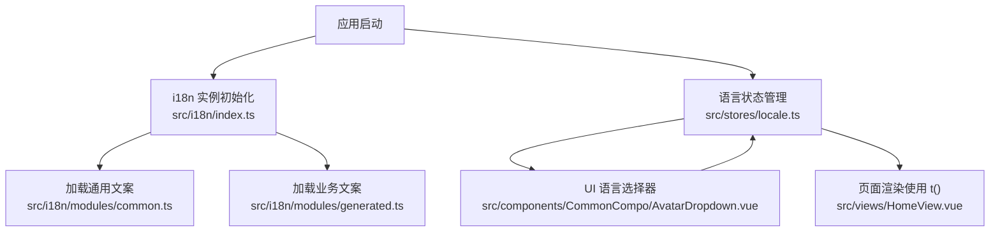
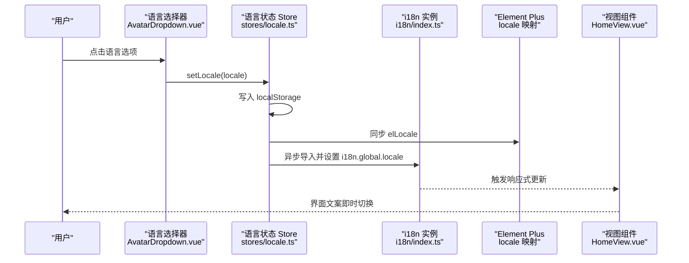
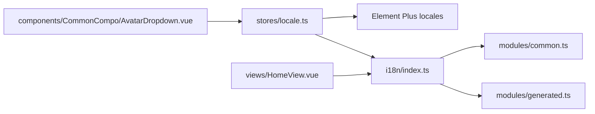

# 国际化支持

<cite>
**本文引用的文件**
- [src/i18n/index.ts](file://Vue3FrontEndDemoExercise/src/i18n/index.ts)
- [src/stores/locale.ts](file://Vue3FrontEndDemoExercise/src/stores/locale.ts)
- [src/i18n/modules/common.ts](file://Vue3FrontEndDemoExercise/src/i18n/modules/common.ts)
- [src/i18n/modules/generated.ts](file://Vue3FrontEndDemoExercise/src/i18n/modules/generated.ts)
- [src/components/CommonCompo/AvatarDropdown.vue](file://Vue3FrontEndDemoExercise/src/components/CommonCompo/AvatarDropdown.vue)
- [src/views/HomeView.vue](file://Vue3FrontEndDemoExercise/src/views/HomeView.vue)
- [docs/i18n-plan.md](file://Vue3FrontEndDemoExercise/docs/i18n-plan.md)
</cite>

## 目录
1. [简介](#简介)
2. [项目结构](#项目结构)
3. [核心组件](#核心组件)
4. [架构总览](#架构总览)
5. [详细组件分析](#详细组件分析)
6. [依赖关系分析](#依赖关系分析)
7. [性能考虑](#性能考虑)
8. [故障排查指南](#故障排查指南)
9. [结论](#结论)
10. [附录](#附录)

## 简介
本文件为前端国际化（i18n）的完整实现文档，基于 vue-i18n 构建多语言支持。内容涵盖：
- 语言包组织与翻译文件管理
- 动态语言切换流程（含 Element Plus 联动）
- i18n 配置与各语言文件结构（中文、英文、繁体中文、日文、韩文）
- 组件中如何使用 t() 进行文本替换与插值
- 语言包更新流程、翻译质量检查与性能优化方案
- 最佳实践与常见问题解决方案

## 项目结构
前端 i18n 采用“集中式初始化 + 模块化文案 + 运行时状态管理”的组织方式：
- 入口初始化：在 src/i18n/index.ts 创建 i18n 实例，合并各模块消息对象，并设置默认语言与回退策略
- 文案模块：common.ts 提供全局通用文案；generated.ts 按命名空间（home、network、user、changelog、lottery、callback、sams、message、rpa 等）组织业务文案
- 运行时状态：stores/locale.ts 使用 Pinia 管理当前语言、Element Plus locale 同步、持久化到 localStorage，并提供 setLocale 方法
- UI 交互：AvatarDropdown.vue 提供语言选择器，调用 store.setLocale 完成切换
- 视图示例：HomeView.vue 展示如何在模板中使用 t() 获取文案

**图表来源**
- [src/i18n/index.ts:1-39](file://Vue3FrontEndDemoExercise/src/i18n/index.ts#L1-L39)
- [src/i18n/modules/common.ts:1-200](file://Vue3FrontEndDemoExercise/src/i18n/modules/common.ts#L1-L200)
- [src/i18n/modules/generated.ts:1-800](file://Vue3FrontEndDemoExercise/src/i18n/modules/generated.ts#L1-L800)
- [src/stores/locale.ts:1-64](file://Vue3FrontEndDemoExercise/src/stores/locale.ts#L1-L64)
- [src/components/CommonCompo/AvatarDropdown.vue:220-240](file://Vue3FrontEndDemoExercise/src/components/CommonCompo/AvatarDropdown.vue#L220-L240)
- [src/views/HomeView.vue:1-15](file://Vue3FrontEndDemoExercise/src/views/HomeView.vue#L1-L15)

**章节来源**
- [src/i18n/index.ts:1-39](file://Vue3FrontEndDemoExercise/src/i18n/index.ts#L1-L39)
- [src/i18n/modules/common.ts:1-200](file://Vue3FrontEndDemoExercise/src/i18n/modules/common.ts#L1-L200)
- [src/i18n/modules/generated.ts:1-800](file://Vue3FrontEndDemoExercise/src/i18n/modules/generated.ts#L1-L800)
- [src/stores/locale.ts:1-64](file://Vue3FrontEndDemoExercise/src/stores/locale.ts#L1-L64)
- [src/components/CommonCompo/AvatarDropdown.vue:220-240](file://Vue3FrontEndDemoExercise/src/components/CommonCompo/AvatarDropdown.vue#L220-L240)
- [src/views/HomeView.vue:1-15](file://Vue3FrontEndDemoExercise/src/views/HomeView.vue#L1-L15)
- [docs/i18n-plan.md:1-63](file://Vue3FrontEndDemoExercise/docs/i18n-plan.md#L1-L63)

## 核心组件
- i18n 实例与消息合并：负责创建 vue-i18n 实例、检测浏览器语言、合并 common 与 generated 等多模块消息，并设置 fallback 与警告开关
- 语言状态存储：Pinia store 维护当前语言、Element Plus 语言包映射、Accept-Language 计算属性、持久化与同步到 i18n 实例
- 语言选择器：下拉菜单提供语言选项，调用 store.setLocale 完成切换并保持下拉展开
- 视图中的文案使用：通过 useI18n().t() 获取文案，支持命名空间 key 与插值参数

**章节来源**
- [src/i18n/index.ts:1-39](file://Vue3FrontEndDemoExercise/src/i18n/index.ts#L1-L39)
- [src/stores/locale.ts:1-64](file://Vue3FrontEndDemoExercise/src/stores/locale.ts#L1-L64)
- [src/components/CommonCompo/AvatarDropdown.vue:220-240](file://Vue3FrontEndDemoExercise/src/components/CommonCompo/AvatarDropdown.vue#L220-L240)
- [src/views/HomeView.vue:1-15](file://Vue3FrontEndDemoExercise/src/views/HomeView.vue#L1-L15)

## 架构总览
下图展示了从用户操作到界面文案更新的完整链路，包括语言检测、store 状态变更、i18n 实例同步以及 Element Plus 联动。

**图表来源**
- [src/components/CommonCompo/AvatarDropdown.vue:220-240](file://Vue3FrontEndDemoExercise/src/components/CommonCompo/AvatarDropdown.vue#L220-L240)
- [src/stores/locale.ts:19-55](file://Vue3FrontEndDemoExercise/src/stores/locale.ts#L19-L55)
- [src/i18n/index.ts:9-36](file://Vue3FrontEndDemoExercise/src/i18n/index.ts#L9-L36)
- [src/views/HomeView.vue:1-15](file://Vue3FrontEndDemoExercise/src/views/HomeView.vue#L1-L15)

## 详细组件分析

### i18n 初始化与消息合并
- 支持的语言集合：zh-CN、en、zh-TW、ja、ko
- 浏览器语言检测：根据 navigator.language 推断首选语言，区分 zh-CN 与 zh-TW
- 初始语言：detectLocale() 结果作为默认语言
- 消息合并：将 common 与多个命名空间（generated、userNs、changelogNs、lotteryNs、callbackNs、samsNs、messageNs、rpaNs）合并到 messages 对象
- 回退与警告：fallbackLocale 设置为 zh-CN，关闭 missingWarn 与 fallbackWarn 以避免控制台噪音

**章节来源**
- [src/i18n/index.ts:1-39](file://Vue3FrontEndDemoExercise/src/i18n/index.ts#L1-L39)

### 语言状态管理（Pinia Store）
- 语言检测：与 i18n 一致，优先使用浏览器语言
- Element Plus 联动：elLocaleMap 映射当前语言到对应语言包
- 持久化：使用 persist 插件将 locale 保存到 localStorage
- 同步逻辑：setLocale 更新 document.documentElement.lang，并通过动态 import 获取 i18n 实例后设置 global.locale
- Accept-Language：暴露 acceptLanguage 计算属性用于请求头注入

**章节来源**
- [src/stores/locale.ts:1-64](file://Vue3FrontEndDemoExercise/src/stores/locale.ts#L1-L64)

### 语言选择器（AvatarDropdown）
- 语言选项：与 SUPPORTED_LOCALES 对齐，显示本地化标签
- 交互：打开语言 Popover，选择语言后调用 localeStore.setLocale
- 保持展开：通过 popperRef.onOpen() 维持下拉菜单可见性

**章节来源**
- [src/components/CommonCompo/AvatarDropdown.vue:220-240](file://Vue3FrontEndDemoExercise/src/components/CommonCompo/AvatarDropdown.vue#L220-L240)
- [src/components/CommonCompo/AvatarDropdown.vue:434-463](file://Vue3FrontEndDemoExercise/src/components/CommonCompo/AvatarDropdown.vue#L434-L463)

### 视图中的文案使用（HomeView）
- 引入 useI18n：通过 t('namespace.key') 获取文案
- 示例用法：首页标题、按钮文案、提示框文案均通过 t() 获取
- 插值语法：可在 t() 第二个参数传入对象，如 t('key', { name })

**章节来源**
- [src/views/HomeView.vue:1-15](file://Vue3FrontEndDemoExercise/src/views/HomeView.vue#L1-L15)
- [src/views/HomeView.vue:52-82](file://Vue3FrontEndDemoExercise/src/views/HomeView.vue#L52-L82)
- [src/views/HomeView.vue:114-138](file://Vue3FrontEndDemoExercise/src/views/HomeView.vue#L114-L138)
- [src/views/HomeView.vue:144-214](file://Vue3FrontEndDemoExercise/src/views/HomeView.vue#L144-L214)
- [src/views/HomeView.vue:217-280](file://Vue3FrontEndDemoExercise/src/views/HomeView.vue#L217-L280)

### 文案模块结构
- common.ts：通用文案（确认、取消、保存、删除、搜索、加载中、提交、关闭、返回、刷新、暂无数据、错误、成功、警告、请选择、请输入、确认删除、确定、全部、是、否、复制、已复制、重试、更多、名称、状态、时间、操作、登录、退出登录、用户、设置、语言），覆盖五种语言
- generated.ts：按命名空间分组（home、network、user、changelog、lottery、callback、sams、message、rpa 等），每种语言下 key 集合保持一致

**章节来源**
- [src/i18n/modules/common.ts:1-200](file://Vue3FrontEndDemoExercise/src/i18n/modules/common.ts#L1-L200)
- [src/i18n/modules/generated.ts:1-800](file://Vue3FrontEndDemoExercise/src/i18n/modules/generated.ts#L1-L800)

## 依赖关系分析
- i18n 实例依赖：vue-i18n、common 模块、generated 模块及多个命名空间模块
- Store 依赖：Pinia、Element Plus 多语言包、i18n 实例（动态导入）
- 组件依赖：AvatarDropdown 依赖 store 与 i18n 类型定义；HomeView 依赖 useI18n

**图表来源**
- [src/i18n/index.ts:1-39](file://Vue3FrontEndDemoExercise/src/i18n/index.ts#L1-L39)
- [src/i18n/modules/common.ts:1-200](file://Vue3FrontEndDemoExercise/src/i18n/modules/common.ts#L1-L200)
- [src/i18n/modules/generated.ts:1-800](file://Vue3FrontEndDemoExercise/src/i18n/modules/generated.ts#L1-L800)
- [src/stores/locale.ts:1-64](file://Vue3FrontEndDemoExercise/src/stores/locale.ts#L1-L64)
- [src/components/CommonCompo/AvatarDropdown.vue:220-240](file://Vue3FrontEndDemoExercise/src/components/CommonCompo/AvatarDropdown.vue#L220-L240)
- [src/views/HomeView.vue:1-15](file://Vue3FrontEndDemoExercise/src/views/HomeView.vue#L1-L15)

**章节来源**
- [src/i18n/index.ts:1-39](file://Vue3FrontEndDemoExercise/src/i18n/index.ts#L1-L39)
- [src/stores/locale.ts:1-64](file://Vue3FrontEndDemoExercise/src/stores/locale.ts#L1-L64)
- [src/components/CommonCompo/AvatarDropdown.vue:220-240](file://Vue3FrontEndDemoExercise/src/components/CommonCompo/AvatarDropdown.vue#L220-L240)
- [src/views/HomeView.vue:1-15](file://Vue3FrontEndDemoExercise/src/views/HomeView.vue#L1-L15)

## 性能考虑
- 延迟加载 i18n 实例：在 store.setLocale 中通过动态 import 获取 i18n，避免首屏阻塞
- 关闭缺失警告：missingWarn 与 fallbackWarn 设为 false，减少控制台开销
- 合理拆分文案：按命名空间组织，便于按需加载与维护
- 持久化最小化：仅持久化 locale 字符串，避免冗余存储
- 浏览器语言检测：仅在初始化时执行一次，避免重复计算

[本节为通用指导，无需具体文件引用]

## 故障排查指南
- 语言未生效：
  - 检查 store.setLocale 是否被调用，且传入的 locale 是否在 SUPPORTED_LOCALES 中
  - 确认 i18n 实例的 messages 是否包含该语言的对应命名空间
- 文案缺失或回退：
  - 检查 generated 与 common 模块中是否存在对应 key
  - 确认 fallbackLocale 是否正确设置为 zh-CN
- Element Plus 文案不同步：
  - 检查 elLocaleMap 是否包含当前语言的映射
  - 确认 store 初始化时是否调用了 setLocale
- 下拉菜单行为异常：
  - 检查 AvatarDropdown 中 handleKeepDropdownOpen 与 popperRef.onOpen 的使用
- 路由或页面文案未更新：
  - 确保组件内使用 useI18n().t() 获取文案，而非硬编码字符串

**章节来源**
- [src/stores/locale.ts:19-55](file://Vue3FrontEndDemoExercise/src/stores/locale.ts#L19-L55)
- [src/i18n/index.ts:9-36](file://Vue3FrontEndDemoExercise/src/i18n/index.ts#L9-L36)
- [src/components/CommonCompo/AvatarDropdown.vue:220-240](file://Vue3FrontEndDemoExercise/src/components/CommonCompo/AvatarDropdown.vue#L220-L240)
- [src/views/HomeView.vue:1-15](file://Vue3FrontEndDemoExercise/src/views/HomeView.vue#L1-L15)

## 结论
本项目通过集中式 i18n 初始化、模块化文案组织与 Pinia 状态管理，实现了稳定、可扩展的多语言支持。语言切换流程清晰，Element Plus 联动完善，视图层统一使用 t() 获取文案，具备良好的可维护性与扩展性。建议继续遵循命名规范与分批改造计划，持续完善文案覆盖与质量检查。

[本节为总结性内容，无需具体文件引用]

## 附录

### 语言包更新流程
- 新增文案：在对应命名空间模块中添加 key，并在所有语言文件中补齐翻译
- 修改文案：更新所有语言文件的对应 key，确保语义一致
- 验证：运行类型检查与 lint，确保无报错；手动切换语言验证 UI 表现

**章节来源**
- [docs/i18n-plan.md:23-54](file://Vue3FrontEndDemoExercise/docs/i18n-plan.md#L23-L54)

### 翻译质量检查
- Key 一致性：确保各语言文件 key 集合完全一致
- 回退策略：缺失 key 时回退到 zh-CN，避免空白
- 工具辅助：可使用 grep 查找残留中文，结合 type-check 与 lint 保证代码质量

**章节来源**
- [docs/i18n-plan.md:56-63](file://Vue3FrontEndDemoExercise/docs/i18n-plan.md#L56-L63)

### 最佳实践
- 命名空间分层：按业务模块划分 key，避免冲突
- 通用文案复用：common.* 集中管理基础词汇
- 插值语法：使用 t('key', { param }) 传递变量
- 复数与列表：优先使用 v-for 与数组，避免拼接句子
- 持久化与同步：使用 store 统一管理语言状态，并持久化到 localStorage

**章节来源**
- [docs/i18n-plan.md:23-41](file://Vue3FrontEndDemoExercise/docs/i18n-plan.md#L23-L41)
- [src/stores/locale.ts:19-55](file://Vue3FrontEndDemoExercise/src/stores/locale.ts#L19-L55)