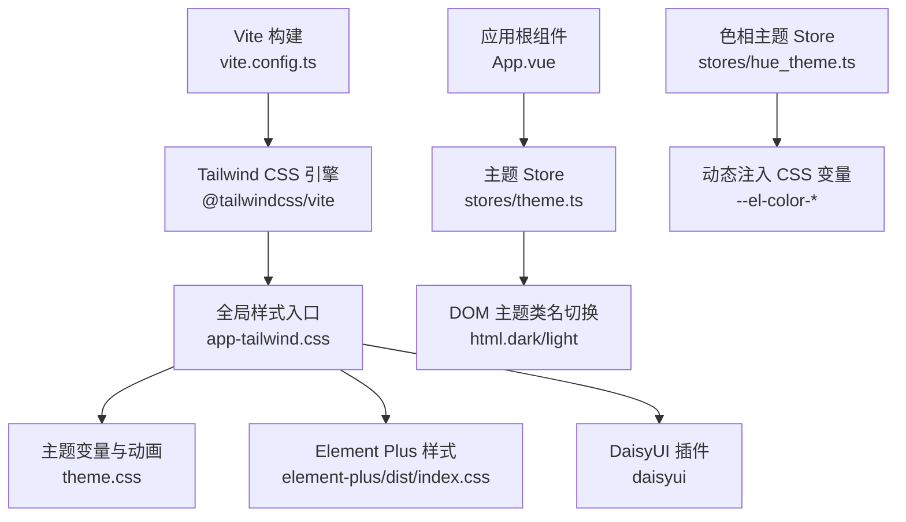
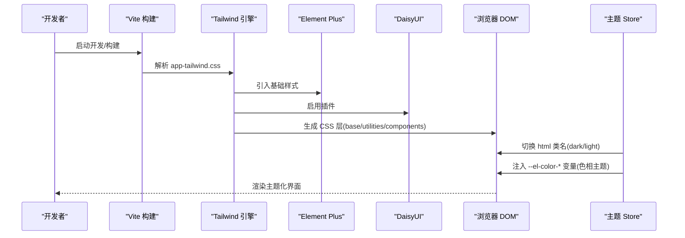
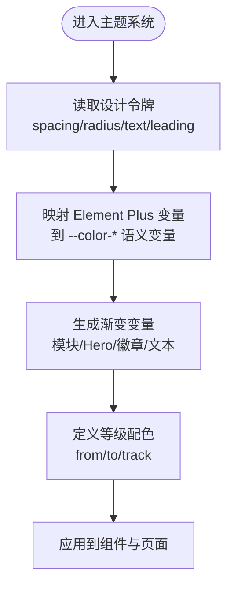
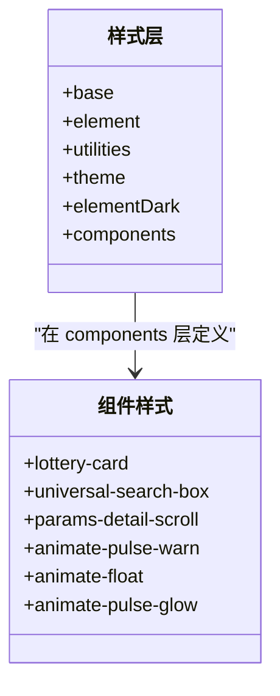
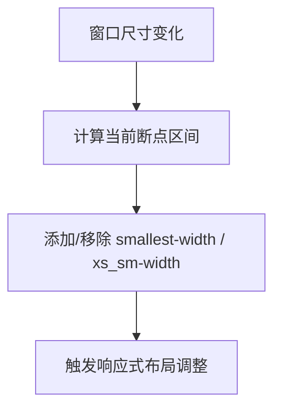
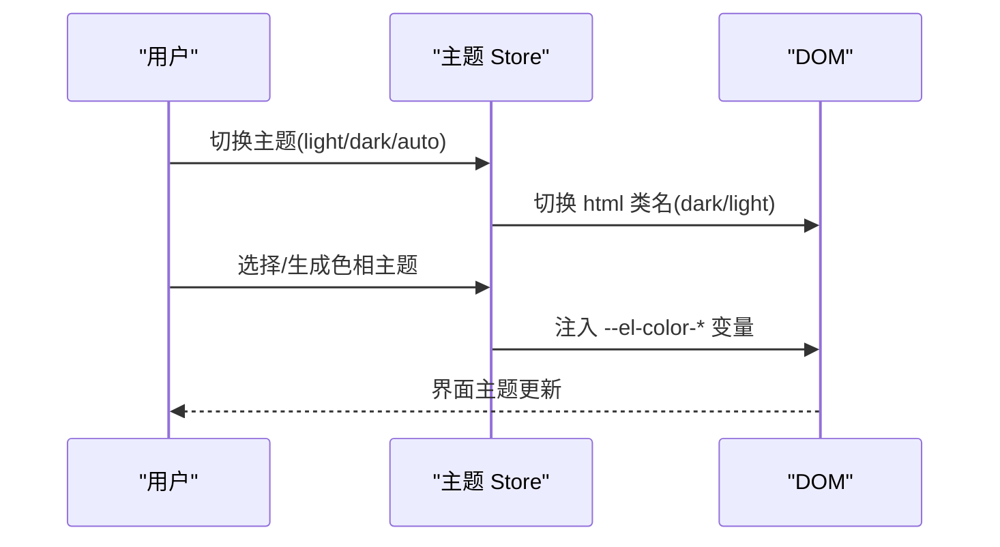
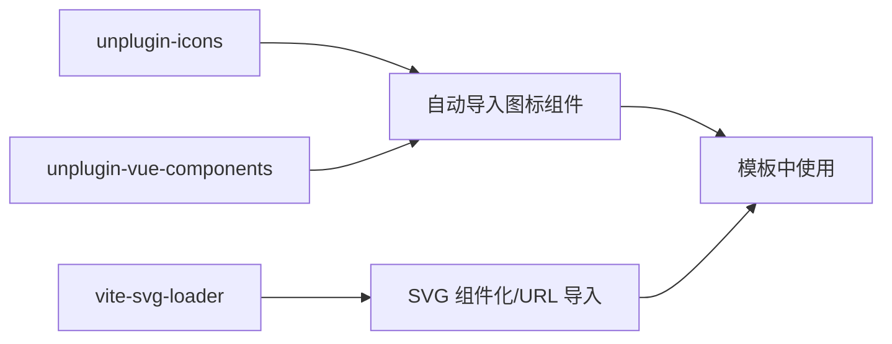
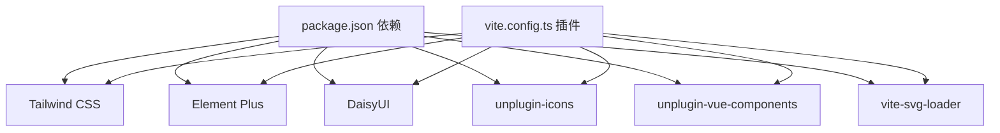

# 样式系统

<cite>
**本文引用的文件**
- [package.json](file://Vue3FrontEndDemoExercise/package.json)
- [vite.config.ts](file://Vue3FrontEndDemoExercise/vite.config.ts)
- [app-tailwind.css](file://Vue3FrontEndDemoExercise/src/assets/app-tailwind.css)
- [theme.css](file://Vue3FrontEndDemoExercise/src/assets/theme.css)
- [App.vue](file://Vue3FrontEndDemoExercise/src/App.vue)
- [theme.ts](file://Vue3FrontEndDemoExercise/src/stores/theme.ts)
- [hue_theme.ts](file://Vue3FrontEndDemoExercise/src/stores/hue_theme.ts)
</cite>

## 目录
1. [简介](#简介)
2. [项目结构](#项目结构)
3. [核心组件](#核心组件)
4. [架构总览](#架构总览)
5. [详细组件分析](#详细组件分析)
6. [依赖关系分析](#依赖关系分析)
7. [性能考量](#性能考量)
8. [故障排查指南](#故障排查指南)
9. [结论](#结论)
10. [附录](#附录)

## 简介
本指南面向前端开发者，系统化介绍本项目基于 Tailwind CSS 的原子化样式体系与主题方案。内容涵盖：
- 自定义主题配置（设计令牌、颜色、间距、字体、圆角）
- 响应式设计与断点策略
- 全局样式组织（base/utilities/components 层级、Element Plus 集成、暗色模式）
- 组件样式隔离与复用（CSS Modules/Scoped CSS 的使用建议）
- 图标资源管理、图片优化与多主题切换
- 样式调试工具与性能优化技巧

## 项目结构
前端工程位于 Vue3FrontEndDemoExercise 目录，样式相关的关键位置如下：
- 入口样式与层定义：src/assets/app-tailwind.css
- 主题变量与动画：src/assets/theme.css
- Vite 构建与插件：vite.config.ts
- 包管理与依赖：package.json
- 应用根组件与初始化：src/App.vue
- 主题状态管理：src/stores/theme.ts、src/stores/hue_theme.ts

图表来源
- [vite.config.ts:31-84](file://Vue3FrontEndDemoExercise/vite.config.ts#L31-L84)
- [app-tailwind.css:1-8](file://Vue3FrontEndDemoExercise/src/assets/app-tailwind.css#L1-L8)
- [theme.css:1-478](file://Vue3FrontEndDemoExercise/src/assets/theme.css#L1-L478)
- [theme.ts:10-19](file://Vue3FrontEndDemoExercise/src/stores/theme.ts#L10-L19)
- [hue_theme.ts:27-43](file://Vue3FrontEndDemoExercise/src/stores/hue_theme.ts#L27-L43)

章节来源
- [package.json:19-84](file://Vue3FrontEndDemoExercise/package.json#L19-L84)
- [vite.config.ts:31-84](file://Vue3FrontEndDemoExercise/vite.config.ts#L31-L84)
- [app-tailwind.css:1-8](file://Vue3FrontEndDemoExercise/src/assets/app-tailwind.css#L1-L8)

## 核心组件
- 全局样式分层与导入
  - 使用 @layer base, element, utilities, theme, elementDark, components 明确优先级
  - 引入 Element Plus 亮/暗样式，并通过 layer(elementDark) 在暗色时覆盖
  - 启用 DaisyUI 与 Typography 插件，统一 UI 风格
- 主题变量与设计令牌
  - 通过 @theme 块集中声明 spacing、radius、text、leading、组件尺寸等
  - 将 Element Plus 变量映射到项目语义化变量（如 --color-primary）
  - 预置多种渐变（模块、Hero Banner、徽章、文本）与用户等级配色
- 实用类与组件样式
  - utilities 层提供 size-*、bg-gradient-* 等常用组合类
  - components 层封装业务组件样式（卡片、抽屉、搜索框、滚动条、特效）
  - 定义关键帧动画（脉冲、浮动、发光、金色流光边框等）
- 响应式与断点
  - 使用 Tailwind 内置断点与自定义最小宽度类（smallest-width、xs_sm-width）
  - 在 App.vue 中根据窗口宽度动态添加/移除 class，控制布局行为
- 多主题与暗色模式
  - stores/theme.ts 使用 VueUse 的 useDark/usePreferredDark/useStorage 管理主题
  - stores/hue_theme.ts 动态设置 --el-color-* 变量实现主色系替换
  - App.vue 挂载时初始化主题并监听系统偏好变化

章节来源
- [app-tailwind.css:1-238](file://Vue3FrontEndDemoExercise/src/assets/app-tailwind.css#L1-L238)
- [app-tailwind.css:240-800](file://Vue3FrontEndDemoExercise/src/assets/app-tailwind.css#L240-L800)
- [theme.css:1-478](file://Vue3FrontEndDemoExercise/src/assets/theme.css#L1-L478)
- [theme.ts:10-77](file://Vue3FrontEndDemoExercise/src/stores/theme.ts#L10-L77)
- [hue_theme.ts:27-43](file://Vue3FrontEndDemoExercise/src/stores/hue_theme.ts#L27-L43)
- [App.vue:79-106](file://Vue3FrontEndDemoExercise/src/App.vue#L79-L106)

## 架构总览
整体样式架构以 Tailwind 为核心，结合 Element Plus 与 DaisyUI，通过 Vite 插件链进行编译与按需加载；主题变量集中在 theme.css，运行时由 Pinia store 动态注入或切换。

图表来源
- [vite.config.ts:31-84](file://Vue3FrontEndDemoExercise/vite.config.ts#L31-L84)
- [app-tailwind.css:1-8](file://Vue3FrontEndDemoExercise/src/assets/app-tailwind.css#L1-L8)
- [theme.ts:10-19](file://Vue3FrontEndDemoExercise/src/stores/theme.ts#L10-L19)
- [hue_theme.ts:27-43](file://Vue3FrontEndDemoExercise/src/stores/hue_theme.ts#L27-L43)

## 详细组件分析

### 主题系统与变量体系
- 设计令牌
  - 间距：--spacing-*（4px 基准）
  - 圆角：--radius-*（从 xs 到 full）
  - 字号与行高：--text-* 与 --leading-*
  - 组件尺寸：--el-component-size-*、--el-input-height-* 等
- 颜色体系
  - 主色/成功/警告/危险/错误/信息 系列变量
  - 文本/边框/填充/背景 语义化变量
  - 渐变变量：模块、Hero Banner、徽章、文本、数据展示等
- 用户等级配色
  - 为每个等级定义 from/to/track 变量，配合 utilities 层类名快速使用

图表来源
- [theme.css:1-189](file://Vue3FrontEndDemoExercise/src/assets/theme.css#L1-L189)
- [theme.css:190-478](file://Vue3FrontEndDemoExercise/src/assets/theme.css#L190-L478)

章节来源
- [theme.css:1-478](file://Vue3FrontEndDemoExercise/src/assets/theme.css#L1-L478)

### 全局样式分层与组件样式
- 分层策略
  - base：重置 html/body 与通用最小宽度
  - element：Element Plus 基础样式
  - utilities：size-*、bg-gradient-* 等可复用类
  - theme：主题变量与动画
  - elementDark：暗色覆盖层
  - components：业务组件样式（卡片、抽屉、搜索框、滚动条、特效）
- 组件样式示例
  - 抽奖卡片：lottery-card、lottery-card-grand-prize（金色流光边框）
  - 搜索框：universal-search-box（聚焦态阴影与边框）
  - 滚动条：params-detail-scroll（自定义轨道与滑块）
  - 动画：pulse-warn、float、pulse-glow、grand-prize-shimmer/glow

图表来源
- [app-tailwind.css:1-8](file://Vue3FrontEndDemoExercise/src/assets/app-tailwind.css#L1-L8)
- [app-tailwind.css:32-238](file://Vue3FrontEndDemoExercise/src/assets/app-tailwind.css#L32-L238)
- [app-tailwind.css:240-800](file://Vue3FrontEndDemoExercise/src/assets/app-tailwind.css#L240-L800)

章节来源
- [app-tailwind.css:1-800](file://Vue3FrontEndDemoExercise/src/assets/app-tailwind.css#L1-L800)

### 响应式设计实现
- 断点与最小宽度
  - 使用 Tailwind 内置断点与自定义类 smallest-width、xs_sm-width
  - App.vue 根据窗口宽度动态添加/移除 class，控制布局行为
- 网格与自适应列
  - 使用 grid-template-columns: repeat(auto-fit, minmax(...)) 实现自适应卡片布局

图表来源
- [app-tailwind.css:18-24](file://Vue3FrontEndDemoExercise/src/assets/app-tailwind.css#L18-L24)
- [app-tailwind.css:244-252](file://Vue3FrontEndDemoExercise/src/assets/app-tailwind.css#L244-L252)
- [App.vue:114-154](file://Vue3FrontEndDemoExercise/src/App.vue#L114-L154)

章节来源
- [App.vue:114-154](file://Vue3FrontEndDemoExercise/src/App.vue#L114-L154)
- [app-tailwind.css:244-252](file://Vue3FrontEndDemoExercise/src/assets/app-tailwind.css#L244-L252)

### 多主题切换与色相主题
- 明暗主题
  - stores/theme.ts 使用 useDark 在 html 上切换 dark/light 类名
  - 支持 light/dark/auto 三种模式，自动跟随系统偏好
- 色相主题
  - stores/hue_theme.ts 动态设置 --el-color-* 变量，实现主色系替换
  - 支持历史记录、随机生成、恢复默认、本地持久化

图表来源
- [theme.ts:10-77](file://Vue3FrontEndDemoExercise/src/stores/theme.ts#L10-L77)
- [hue_theme.ts:27-43](file://Vue3FrontEndDemoExercise/src/stores/hue_theme.ts#L27-L43)

章节来源
- [theme.ts:10-113](file://Vue3FrontEndDemoExercise/src/stores/theme.ts#L10-L113)
- [hue_theme.ts:27-178](file://Vue3FrontEndDemoExercise/src/stores/hue_theme.ts#L27-L178)

### 图标资源管理
- 自动导入与注册
  - vite.config.ts 启用 unplugin-icons 与 unplugin-vue-components
  - 自动注册 Iconep（Element Plus 图标集），并在模板中以 <IconEpXxx /> 形式使用
- SVG 处理
  - 使用 vite-svg-loader 将 SVG 转为组件或 URL，禁用 svgo 以避免特定路径崩溃

图表来源
- [vite.config.ts:45-76](file://Vue3FrontEndDemoExercise/vite.config.ts#L45-L76)

章节来源
- [vite.config.ts:45-76](file://Vue3FrontEndDemoExercise/vite.config.ts#L45-L76)

### 图片优化与安全区适配
- 图片
  - 使用 vite-svg-loader 将 SVG 作为组件或 URL 导入，减少请求与体积
  - 背景图在 App.vue 中根据主题切换不同资源
- 安全区内边距
  - theme.css 提供 safe-area-padding 类，适配刘海屏/底部横条设备

章节来源
- [vite.config.ts:33-38](file://Vue3FrontEndDemoExercise/vite.config.ts#L33-L38)
- [App.vue:42-45](file://Vue3FrontEndDemoExercise/src/App.vue#L42-L45)
- [theme.css:521-528](file://Vue3FrontEndDemoExercise/src/assets/theme.css#L521-L528)

### 组件样式隔离与复用策略
- Scoped CSS
  - 推荐在 .vue 组件中使用 <style scoped> 避免样式泄漏
- CSS Modules
  - 如需更严格的命名空间隔离，可使用 CSS Modules（需额外配置）
- 复用策略
  - 将通用样式放入 utilities/components 层，通过类名复用
  - 复杂组件样式尽量拆分为独立模块，保持单一职责

[本节为概念性说明，不直接分析具体文件]

## 依赖关系分析
- 构建与插件
  - Vite + Vue 插件链
  - Tailwind CSS 4.x 与 @tailwindcss/vite 插件
  - Element Plus（样式按需引入关闭，统一由全局样式管理）
  - DaisyUI 与 Typography 插件
  - unplugin-icons、unplugin-vue-components（图标与组件自动注册）
  - vite-svg-loader（SVG 处理）
- 运行时依赖
  - VueUse（useDark、usePreferredDark、useStorage）
  - Pinia（主题状态管理）

图表来源
- [package.json:19-84](file://Vue3FrontEndDemoExercise/package.json#L19-L84)
- [vite.config.ts:31-84](file://Vue3FrontEndDemoExercise/vite.config.ts#L31-L84)

章节来源
- [package.json:19-84](file://Vue3FrontEndDemoExercise/package.json#L19-L84)
- [vite.config.ts:31-84](file://Vue3FrontEndDemoExercise/vite.config.ts#L31-L84)

## 性能考量
- 样式体积与加载
  - 使用 Tailwind 的按需生成与分层，减少无用样式
  - 关闭 Element Plus 样式自动导入，统一由全局样式管理，避免重复
- 动画与重绘
  - 合理使用 transform/opacity 动画，避免频繁触发 layout
  - 大背景图建议使用懒加载与合适的压缩格式
- 构建优化
  - 生产构建开启代码压缩与 Tree Shaking
  - 对 SVG 使用组件化导入，减少网络请求

[本节提供通用指导，不直接分析具体文件]

## 故障排查指南
- 主题未生效
  - 检查 html 是否包含 dark/light 类名
  - 确认 stores/theme.ts 已调用 initTheme 与 setupSystemThemeListener
- 色相主题无效
  - 检查 stores/hue_theme.ts 是否正确注入 --el-color-* 变量
  - 确认 Element Plus 样式已加载且未被覆盖
- 样式冲突
  - 利用 @layer 优先级，必要时在 components 层覆盖
  - 使用浏览器开发者工具检查最终计算样式与层顺序
- 图标不显示
  - 确认 unplugin-icons 与 unplugin-vue-components 已正确配置
  - 检查图标集合是否启用（如 ep）

章节来源
- [theme.ts:31-77](file://Vue3FrontEndDemoExercise/src/stores/theme.ts#L31-L77)
- [hue_theme.ts:27-43](file://Vue3FrontEndDemoExercise/src/stores/hue_theme.ts#L27-L43)
- [app-tailwind.css:1-8](file://Vue3FrontEndDemoExercise/src/assets/app-tailwind.css#L1-L8)
- [vite.config.ts:45-76](file://Vue3FrontEndDemoExercise/vite.config.ts#L45-L76)

## 结论
本项目采用 Tailwind CSS 原子化样式体系，结合 Element Plus 与 DaisyUI，形成统一、可扩展的主题系统。通过集中化的设计令牌、分层样式与运行时主题切换，既保证了视觉一致性，又提升了开发效率。配合图标与图片的资源管理策略以及性能优化实践，能够构建美观且高性能的用户界面。

## 附录
- 最佳实践
  - 优先使用 utilities 层类名，避免重复定义
  - 复杂组件样式放入 components 层，保持清晰边界
  - 主题变量集中管理，避免硬编码颜色值
  - 使用响应式类与媒体查询结合，确保多端体验一致
- 参考路径
  - 主题变量：theme.css
  - 全局样式：app-tailwind.css
  - 构建配置：vite.config.ts
  - 主题状态：stores/theme.ts、stores/hue_theme.ts
  - 应用初始化：App.vue

[本节为补充信息，不直接分析具体文件]