# 状态管理

<cite>
**本文引用的文件**
- [src/stores/index.ts](file://Vue3FrontEndDemoExercise/src/stores/index.ts)
- [src/stores/theme.ts](file://Vue3FrontEndDemoExercise/src/stores/theme.ts)
- [src/stores/user_pref.ts](file://Vue3FrontEndDemoExercise/src/stores/user_pref.ts)
- [src/stores/locale.ts](file://Vue3FrontEndDemoExercise/src/stores/locale.ts)
- [src/stores/message_unread.ts](file://Vue3FrontEndDemoExercise/src/stores/message_unread.ts)
- [src/stores/rpa_admin.ts](file://Vue3FrontEndDemoExercise/src/stores/rpa_admin.ts)
- [src/stores/message_admin.ts](file://Vue3FrontEndDemoExercise/src/stores/message_admin.ts)
- [src/stores/jwt_token.ts](file://Vue3FrontEndDemoExercise/src/stores/jwt_token.ts)
- [src/composables/useAuditReasons.ts](file://Vue3FrontEndDemoExercise/src/composables/useAuditReasons.ts)
- [src/composables/useBrowserSessionState.ts](file://Vue3FrontEndDemoExercise/src/composables/useBrowserSessionState.ts)
- [src/composables/useUserBrief.ts](file://Vue3FrontEndDemoExercise/src/composables/useUserBrief.ts)
</cite>

## 目录
1. [简介](#简介)
2. [项目结构](#项目结构)
3. [核心组件](#核心组件)
4. [架构总览](#架构总览)
5. [详细组件分析](#详细组件分析)
6. [依赖关系分析](#依赖关系分析)
7. [性能考虑](#性能考虑)
8. [故障排查指南](#故障排查指南)
9. [结论](#结论)
10. [附录](#附录)

## 简介
本指南面向前端开发者，系统化阐述基于 Pinia 的状态管理模式与实现。内容覆盖 Store 的组织方式、数据流向、业务模块（用户信息、主题设置、消息通知、RPA 管理等）的设计思路；深入解析 Composables 组合式函数（如 useAuditReasons、useBrowserSessionState、useUserBrief）的实现原理；并提供状态持久化策略、跨模块同步机制、性能优化方案，以及调试与测试方法，帮助维护复杂的前端状态逻辑。

## 项目结构
前端采用 Vue 3 + Pinia 的组合式开发模式：
- 全局 Pinia 实例在 stores/index.ts 中创建并启用持久化插件。
- 各业务域以独立 store 文件组织，职责单一、边界清晰。
- 组合式函数 composables 封装可复用的状态与副作用逻辑，供组件与 store 复用。
- 通过 @vueuse/core 等工具库简化主题、系统偏好、存储等常见场景。

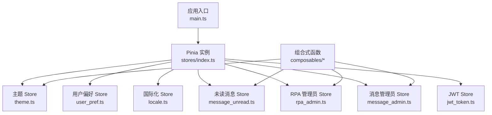

图表来源
- [src/stores/index.ts:9-18](file://Vue3FrontEndDemoExercise/src/stores/index.ts#L9-L18)
- [src/stores/theme.ts:1-123](file://Vue3FrontEndDemoExercise/src/stores/theme.ts#L1-L123)
- [src/stores/user_pref.ts:1-51](file://Vue3FrontEndDemoExercise/src/stores/user_pref.ts#L1-L51)
- [src/stores/locale.ts:1-64](file://Vue3FrontEndDemoExercise/src/stores/locale.ts#L1-L64)
- [src/stores/message_unread.ts:1-80](file://Vue3FrontEndDemoExercise/src/stores/message_unread.ts#L1-L80)
- [src/stores/rpa_admin.ts:1-48](file://Vue3FrontEndDemoExercise/src/stores/rpa_admin.ts#L1-L48)
- [src/stores/message_admin.ts:1-54](file://Vue3FrontEndDemoExercise/src/stores/message_admin.ts#L1-L54)
- [src/stores/jwt_token.ts:1-31](file://Vue3FrontEndDemoExercise/src/stores/jwt_token.ts#L1-L31)

章节来源
- [src/stores/index.ts:9-18](file://Vue3FrontEndDemoExercise/src/stores/index.ts#L9-L18)

## 核心组件
- 主题设置 Store：集中管理明/暗/自动主题模式，结合系统偏好与本地持久化，提供切换与图标/文案获取能力。
- 用户偏好 Store：管理字体尺寸主题，动态应用到根节点，支持持久化。
- 国际化 Store：检测并切换语言，注入 Element Plus 语言包与 vue-i18n，暴露 Accept-Language 头值。
- 未读消息 Store：聚合多模块未读数，提供汇总刷新、总计计算与重置。
- RPA 管理员 Store：拉取当前用户在 RPA 管理端的角色与权限，含 in-flight 去重与加载态。
- 消息管理员 Store：拉取当前用户在消息管理端的身份与权限，兼容 SDK 响应格式。
- JWT Store：保存 Token 与刷新时间戳，提供按日刷新判断。

章节来源
- [src/stores/theme.ts:1-123](file://Vue3FrontEndDemoExercise/src/stores/theme.ts#L1-L123)
- [src/stores/user_pref.ts:1-51](file://Vue3FrontEndDemoExercise/src/stores/user_pref.ts#L1-L51)
- [src/stores/locale.ts:1-64](file://Vue3FrontEndDemoExercise/src/stores/locale.ts#L1-L64)
- [src/stores/message_unread.ts:1-80](file://Vue3FrontEndDemoExercise/src/stores/message_unread.ts#L1-L80)
- [src/stores/rpa_admin.ts:1-48](file://Vue3FrontEndDemoExercise/src/stores/rpa_admin.ts#L1-L48)
- [src/stores/message_admin.ts:1-54](file://Vue3FrontEndDemoExercise/src/stores/message_admin.ts#L1-L54)
- [src/stores/jwt_token.ts:1-31](file://Vue3FrontEndDemoExercise/src/stores/jwt_token.ts#L1-L31)

## 架构总览
整体数据流遵循“组件触发 → Store 变更 → 副作用处理 → 视图更新”的单向数据流：
- 组件调用 Store 方法或 Composables API 发起操作。
- Store 内部使用 ref/computed 管理状态，必要时调用后端接口。
- 通过 pinia-plugin-persistedstate 将关键状态持久化到 localStorage。
- 组合式函数封装跨组件共享的缓存、状态机与副作用，降低耦合。

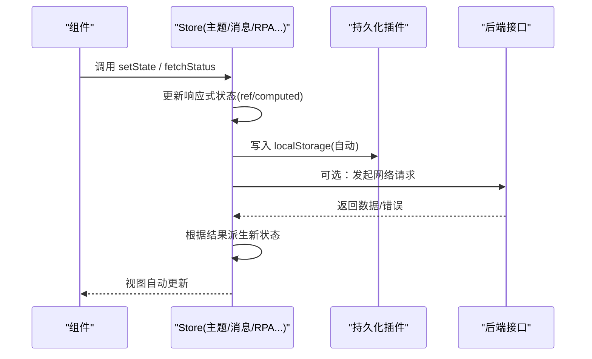

图表来源
- [src/stores/index.ts:9-18](file://Vue3FrontEndDemoExercise/src/stores/index.ts#L9-L18)
- [src/stores/theme.ts:1-123](file://Vue3FrontEndDemoExercise/src/stores/theme.ts#L1-L123)
- [src/stores/message_unread.ts:1-80](file://Vue3FrontEndDemoExercise/src/stores/message_unread.ts#L1-L80)
- [src/stores/rpa_admin.ts:1-48](file://Vue3FrontEndDemoExercise/src/stores/rpa_admin.ts#L1-L48)
- [src/stores/message_admin.ts:1-54](file://Vue3FrontEndDemoExercise/src/stores/message_admin.ts#L1-L54)

## 详细组件分析

### 主题设置 Store（theme.ts）
- 职责：管理明/暗/自动主题模式，联动系统偏好，持久化选择。
- 关键点：
  - 使用 @vueuse/core 的 useDark/usePreferredDark/useStorage 简化主题与系统偏好处理。
  - computed 派生当前主题字符串与效果字符串，便于模板绑定。
  - 提供切换、设置、初始化、系统监听等方法。
  - 配置 persist 将 theme-mode 持久化。

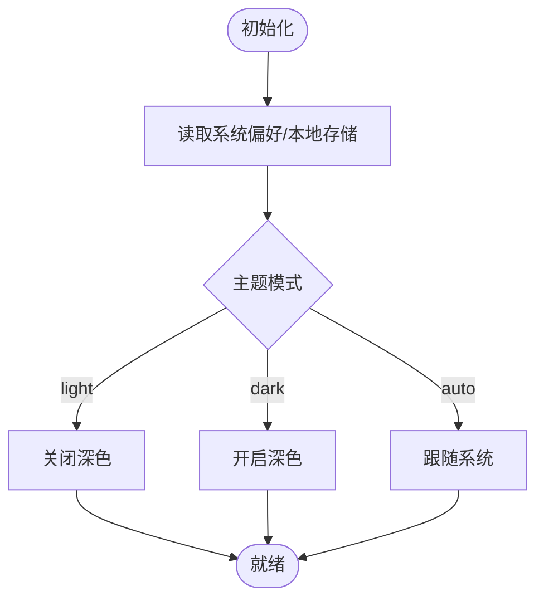

图表来源
- [src/stores/theme.ts:1-123](file://Vue3FrontEndDemoExercise/src/stores/theme.ts#L1-L123)

章节来源
- [src/stores/theme.ts:1-123](file://Vue3FrontEndDemoExercise/src/stores/theme.ts#L1-L123)

### 用户偏好 Store（user_pref.ts）
- 职责：管理字体尺寸主题，动态应用到 document.documentElement 的 font-size。
- 关键点：
  - 定义 SizeTheme 类型，提供 setSizeTheme 与 applyThemes。
  - 通过 persist 将 sizeTheme 持久化。

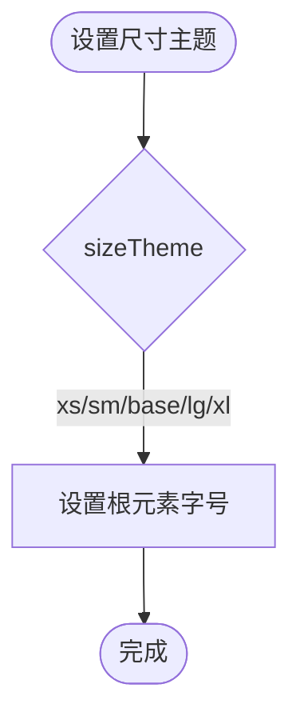

图表来源
- [src/stores/user_pref.ts:1-51](file://Vue3FrontEndDemoExercise/src/stores/user_pref.ts#L1-L51)

章节来源
- [src/stores/user_pref.ts:1-51](file://Vue3FrontEndDemoExercise/src/stores/user_pref.ts#L1-L51)

### 国际化 Store（locale.ts）
- 职责：检测并切换语言，注入 Element Plus 语言包，同步 vue-i18n，暴露 Accept-Language。
- 关键点：
  - detectLocale 从 navigator.language 推断默认语言。
  - setLocale 更新 locale、document.lang 与 i18n.global.locale。
  - 通过 persist 持久化 locale-store。

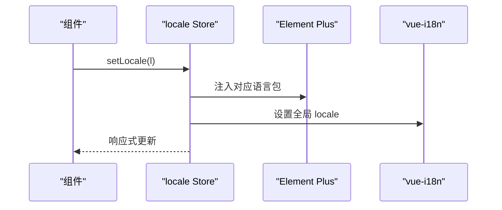

图表来源
- [src/stores/locale.ts:1-64](file://Vue3FrontEndDemoExercise/src/stores/locale.ts#L1-L64)

章节来源
- [src/stores/locale.ts:1-64](file://Vue3FrontEndDemoExercise/src/stores/locale.ts#L1-L64)

### 未读消息 Store（message_unread.ts）
- 职责：聚合事件类（点赞/回复/@）、通知、私信的未读数，提供汇总刷新与总计计算。
- 关键点：
  - 提供 applySummary 一次性覆盖各未读数，并计算 eventUnread。
  - totalUnread 用于顶部徽标显示。
  - reset 用于登出或清理。
  - 通过 persist 持久化 message-unread。

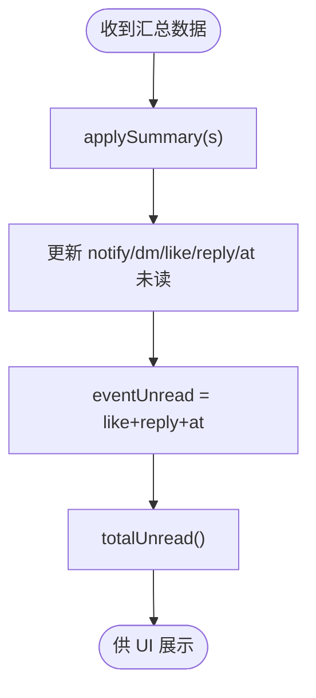

图表来源
- [src/stores/message_unread.ts:1-80](file://Vue3FrontEndDemoExercise/src/stores/message_unread.ts#L1-L80)

章节来源
- [src/stores/message_unread.ts:1-80](file://Vue3FrontEndDemoExercise/src/stores/message_unread.ts#L1-L80)

### RPA 管理员 Store（rpa_admin.ts）
- 职责：获取当前用户在 RPA 管理端的角色与权限，包含 in-flight 去重与加载态。
- 关键点：
  - fetchStatus 使用模块级变量防抖并发请求，避免重复拉取。
  - 成功时更新 status，失败时回退默认值，finally 标记 loaded。
  - reset 用于登出或会话失效后恢复初始态。

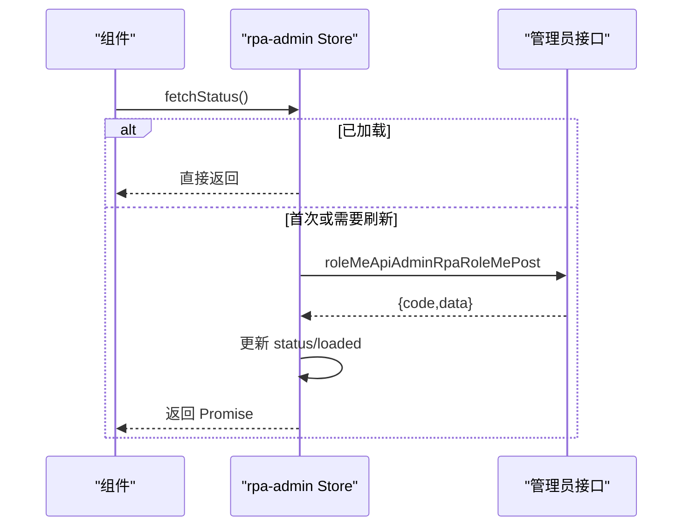

图表来源
- [src/stores/rpa_admin.ts:1-48](file://Vue3FrontEndDemoExercise/src/stores/rpa_admin.ts#L1-L48)

章节来源
- [src/stores/rpa_admin.ts:1-48](file://Vue3FrontEndDemoExercise/src/stores/rpa_admin.ts#L1-L48)

### 消息管理员 Store（message_admin.ts）
- 职责：获取当前用户在消息管理端的身份与权限，兼容 SDK 响应格式。
- 关键点：
  - fetchStatus 调用 myStatusApiV1MessageAdminMeGet，解析 data 字段。
  - 异常或空数据时回退默认值，finally 标记 loaded。
  - reset 用于清理状态。

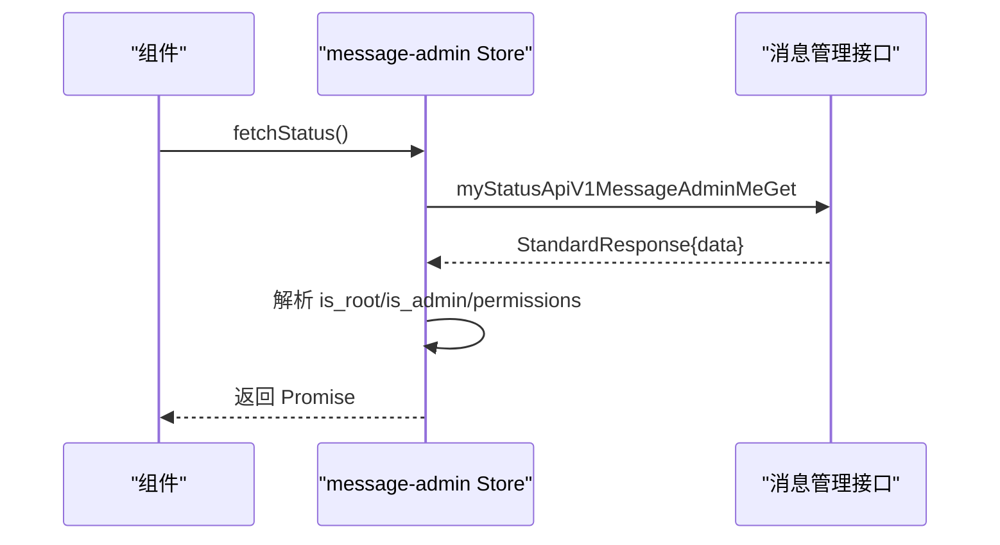

图表来源
- [src/stores/message_admin.ts:1-54](file://Vue3FrontEndDemoExercise/src/stores/message_admin.ts#L1-L54)

章节来源
- [src/stores/message_admin.ts:1-54](file://Vue3FrontEndDemoExercise/src/stores/message_admin.ts#L1-L54)

### JWT Store（jwt_token.ts）
- 职责：保存 Token 与刷新时间戳，提供按日刷新判断。
- 关键点：
  - save_jwt_token 同时记录时间与 token。
  - is_need_jwt_refresh 比较日期决定是否刷新。
  - delete_jwt_token 用于登出清理。

章节来源
- [src/stores/jwt_token.ts:1-31](file://Vue3FrontEndDemoExercise/src/stores/jwt_token.ts#L1-L31)

### 组合式函数：useAuditReasons
- 职责：维护审核默认原因列表（评论/私信共用），本地持久化。
- 关键点：
  - 单例 ref 保证跨组件共享。
  - watch reasons 深监听并写入 localStorage。
  - 提供 add/remove/ensureSaved 方法，支持去重与空值过滤。

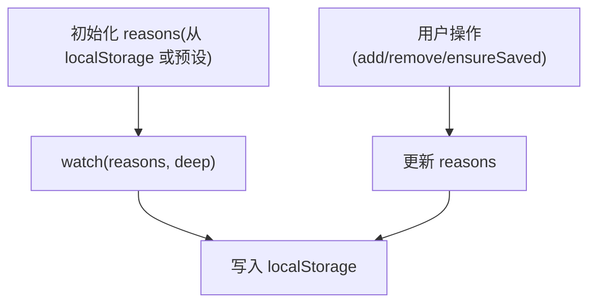

图表来源
- [src/composables/useAuditReasons.ts:1-74](file://Vue3FrontEndDemoExercise/src/composables/useAuditReasons.ts#L1-L74)

章节来源
- [src/composables/useAuditReasons.ts:1-74](file://Vue3FrontEndDemoExercise/src/composables/useAuditReasons.ts#L1-L74)

### 组合式函数：useBrowserSessionState
- 职责：浏览器会话 UI 状态机，映射后端生命周期状态，兼容旧代码字符串 ref。
- 关键点：
  - ALLOWED_TRANSITIONS 限制合法状态转换。
  - transition 统一更新 uiState/lifecycle/error 并同步 browserSessionStatus。
  - onSessionStarting/onSessionCreated/onSessionStartFailed/onSessionStopped/onSessionStopFailed/onStatusResponse 分别处理不同回调。
  - ERROR_CODE_HANDLERS 将特定错误码映射为状态与标签。

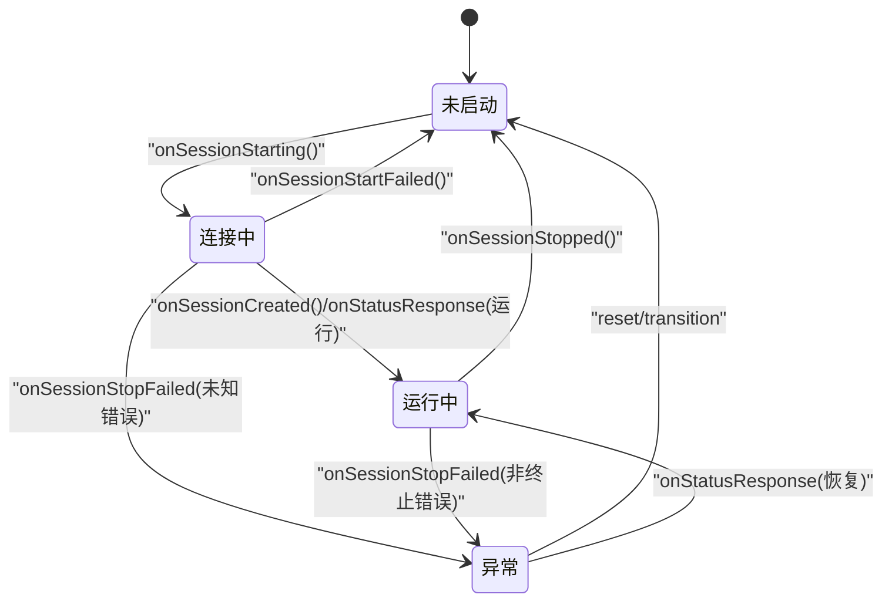

图表来源
- [src/composables/useBrowserSessionState.ts:1-207](file://Vue3FrontEndDemoExercise/src/composables/useBrowserSessionState.ts#L1-L207)

章节来源
- [src/composables/useBrowserSessionState.ts:1-207](file://Vue3FrontEndDemoExercise/src/composables/useBrowserSessionState.ts#L1-L207)

### 组合式函数：useUserBrief
- 职责：按 mid 批量查询用户信息，维护跨页面共享的响应式缓存。
- 关键点：
  - userCache 使用 reactive Map，同一 mid 只查一次。
  - fetchUserBriefs 去重后批量请求，兼容 SDK 返回格式。
  - 失败不阻断主流程，降级显示 mid。

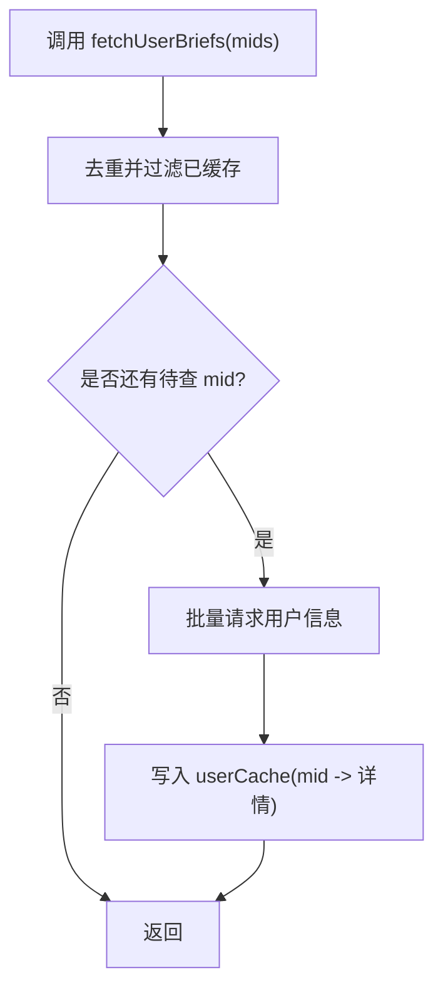

图表来源
- [src/composables/useUserBrief.ts:1-42](file://Vue3FrontEndDemoExercise/src/composables/useUserBrief.ts#L1-L42)

章节来源
- [src/composables/useUserBrief.ts:1-42](file://Vue3FrontEndDemoExercise/src/composables/useUserBrief.ts#L1-L42)

## 依赖关系分析
- Pinia 实例与插件：
  - 通过 createPinia 创建实例，并使用 pinia-plugin-persistedstate 启用自动持久化。
- 主题与系统偏好：
  - 依赖 @vueuse/core 的 useDark/usePreferredDark/useStorage 进行主题与系统偏好管理。
- 国际化：
  - 依赖 element-plus 的语言包与 vue-i18n 的全局实例。
- 网络请求：
  - 通过 hey-api 生成的 SDK 调用后端接口（如管理员、消息、RPA 相关）。
- 组合式函数：
  - 与 models/rpa_browser/session_state 等模型协作，提供状态映射与标签。

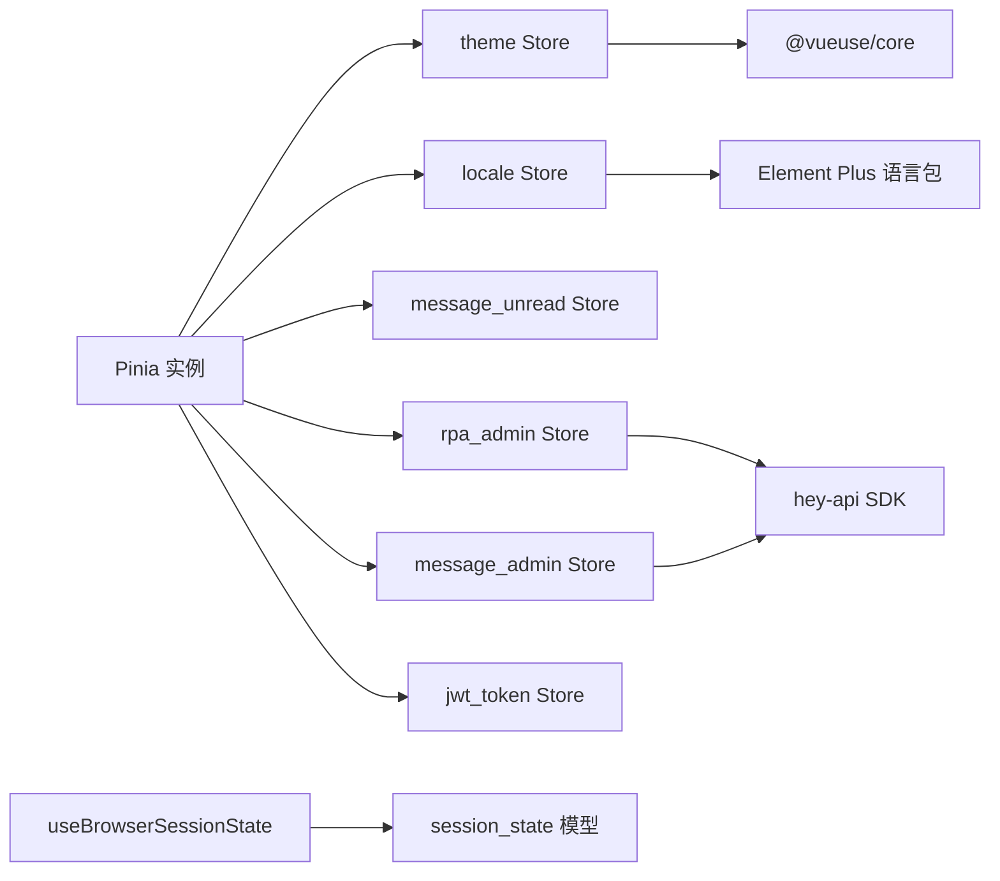

图表来源
- [src/stores/index.ts:9-18](file://Vue3FrontEndDemoExercise/src/stores/index.ts#L9-L18)
- [src/stores/theme.ts:1-123](file://Vue3FrontEndDemoExercise/src/stores/theme.ts#L1-L123)
- [src/stores/locale.ts:1-64](file://Vue3FrontEndDemoExercise/src/stores/locale.ts#L1-L64)
- [src/stores/rpa_admin.ts:1-48](file://Vue3FrontEndDemoExercise/src/stores/rpa_admin.ts#L1-L48)
- [src/stores/message_admin.ts:1-54](file://Vue3FrontEndDemoExercise/src/stores/message_admin.ts#L1-L54)
- [src/composables/useBrowserSessionState.ts:1-207](file://Vue3FrontEndDemoExercise/src/composables/useBrowserSessionState.ts#L1-L207)

章节来源
- [src/stores/index.ts:9-18](file://Vue3FrontEndDemoExercise/src/stores/index.ts#L9-L18)

## 性能考虑
- 请求去重与节流：
  - rpa_admin Store 使用模块级 fetchPromise 避免并发重复请求。
- 局部更新与细粒度响应式：
  - 使用 ref/computed 精确更新，减少不必要的重渲染。
- 缓存复用：
  - useUserBrief 使用 Map 缓存用户信息，避免重复请求。
- 持久化策略：
  - 仅对必要状态启用 persist（如 theme、locale、user-pref、message-unread），避免过度 IO。
- 懒加载与按需引入：
  - 国际化语言包按需 import，减少首屏体积。
- 状态合并与批量更新：
  - message_unread Store 提供 applySummary 一次性覆盖多个未读数，减少多次响应式更新。

[本节为通用指导，无需具体文件引用]

## 故障排查指南
- 主题切换无效：
  - 检查 theme Store 的 toggle/set/init 是否正确调用，确认系统偏好监听是否生效。
- 国际化未生效：
  - 确认 setLocale 是否更新了 document.lang 与 i18n.global.locale，检查语言包是否正确导入。
- 未读数不更新：
  - 确认 applySummary 是否被正确调用，检查数据来源与字段映射。
- RPA/消息管理员权限不显示：
  - 检查 fetchStatus 是否成功，确认 SDK 响应结构与解析逻辑，查看 loaded 标志位。
- 会话状态卡死：
  - 检查 useBrowserSessionState 的状态转换是否合法，确认 onStatusResponse 分支逻辑。
- 默认原因丢失：
  - 检查 localStorage 读写是否被拦截（隐私模式），确认 watch 深监听是否触发。

章节来源
- [src/stores/theme.ts:1-123](file://Vue3FrontEndDemoExercise/src/stores/theme.ts#L1-L123)
- [src/stores/locale.ts:1-64](file://Vue3FrontEndDemoExercise/src/stores/locale.ts#L1-L64)
- [src/stores/message_unread.ts:1-80](file://Vue3FrontEndDemoExercise/src/stores/message_unread.ts#L1-L80)
- [src/stores/rpa_admin.ts:1-48](file://Vue3FrontEndDemoExercise/src/stores/rpa_admin.ts#L1-L48)
- [src/stores/message_admin.ts:1-54](file://Vue3FrontEndDemoExercise/src/stores/message_admin.ts#L1-L54)
- [src/composables/useBrowserSessionState.ts:1-207](file://Vue3FrontEndDemoExercise/src/composables/useBrowserSessionState.ts#L1-L207)
- [src/composables/useAuditReasons.ts:1-74](file://Vue3FrontEndDemoExercise/src/composables/useAuditReasons.ts#L1-L74)

## 结论
本项目采用清晰的 Pinia Store 分层与组合式函数封装，实现了主题、国际化、未读消息、管理员权限、RPA 会话等核心状态的可维护管理。通过持久化插件、状态机、缓存与去重策略，兼顾了用户体验与性能。建议后续继续完善错误上报、单元测试与端到端测试，进一步提升稳定性与可测性。

[本节为总结性内容，无需具体文件引用]

## 附录
- 状态调试建议：
  - 使用浏览器 DevTools 的 Pinia 插件查看状态树与变更记录。
  - 在关键 Store 中增加日志输出（如 fetchStatus 前后），辅助定位问题。
- 测试方法：
  - 针对 Store 编写单元测试，模拟接口返回与异常路径，验证状态变化。
  - 针对 Composables 编写集成测试，验证状态机转换与缓存行为。
  - 使用 Mock 服务隔离后端依赖，确保测试稳定。

[本节为通用指导，无需具体文件引用]