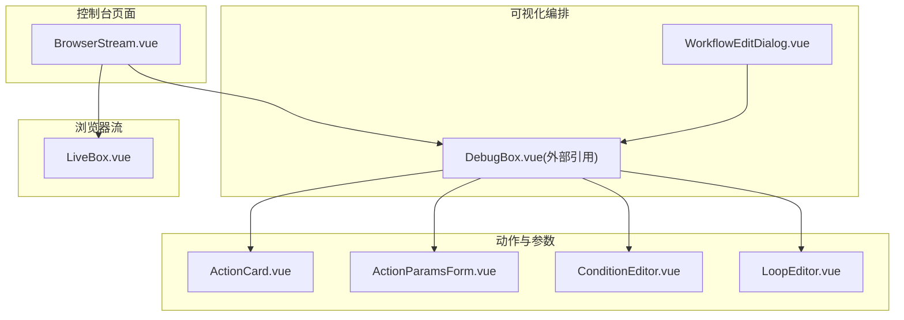
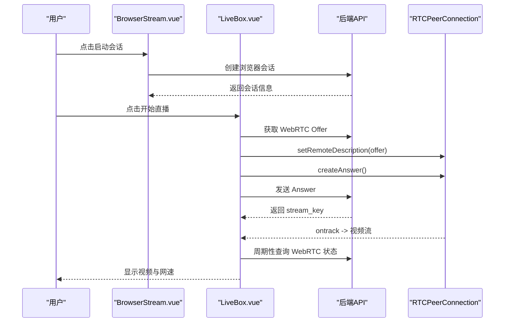
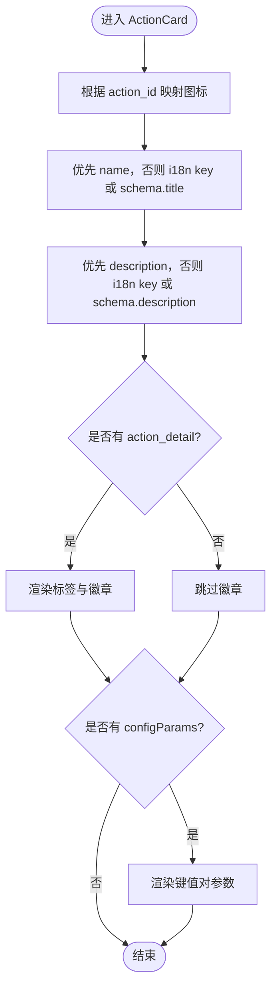
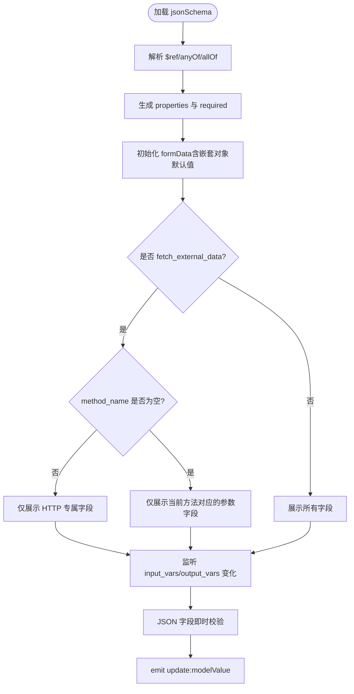
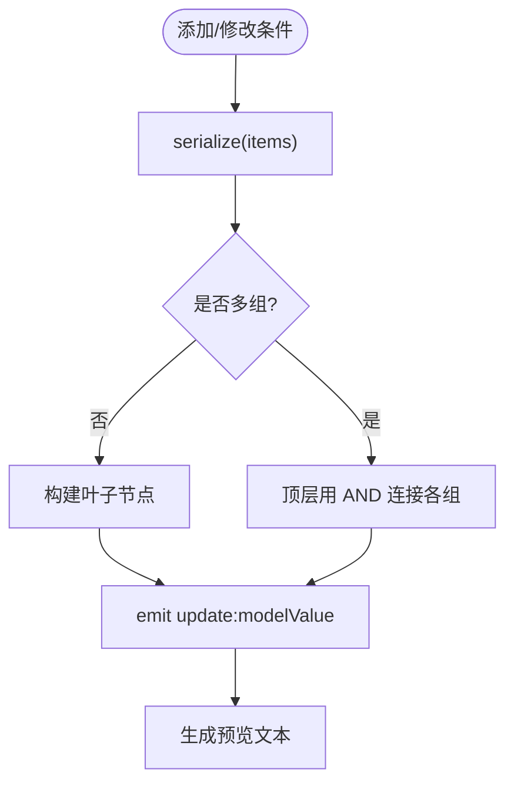
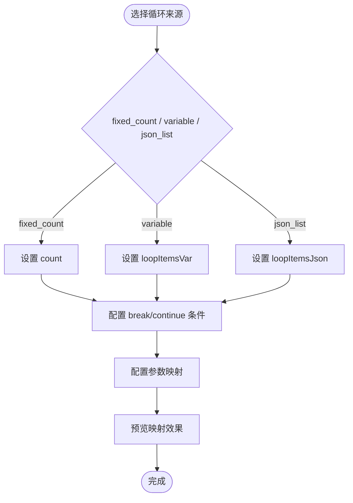
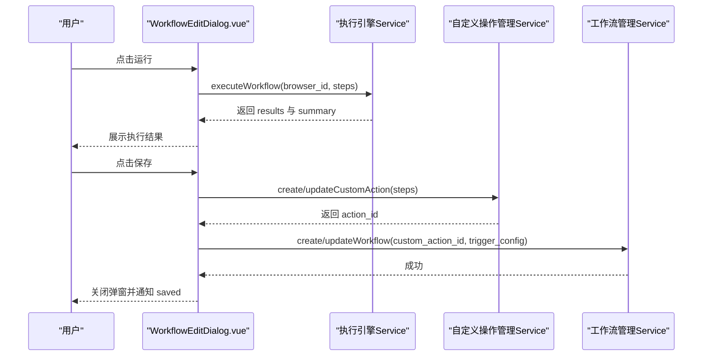
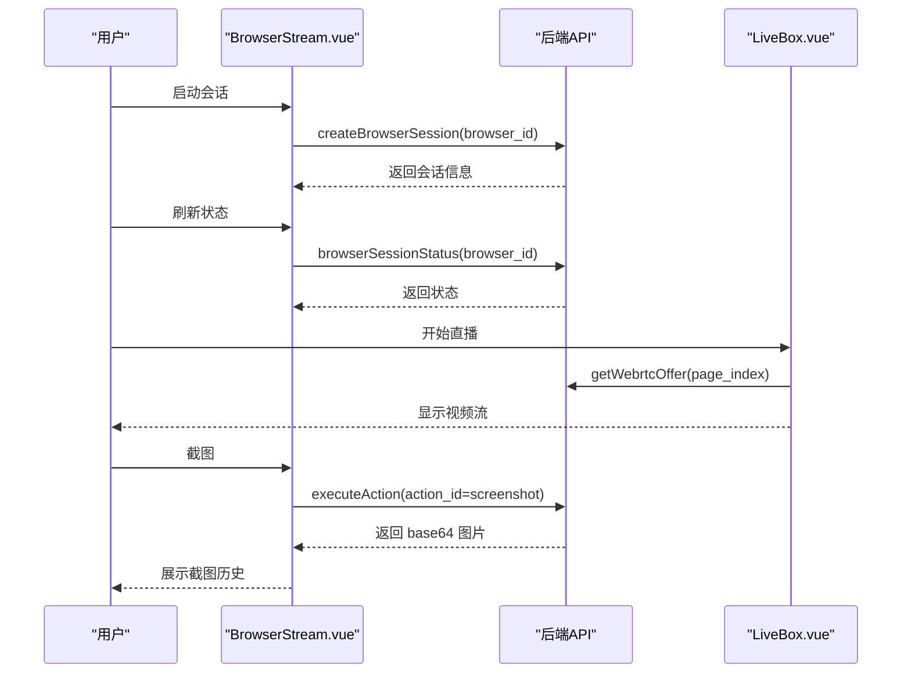
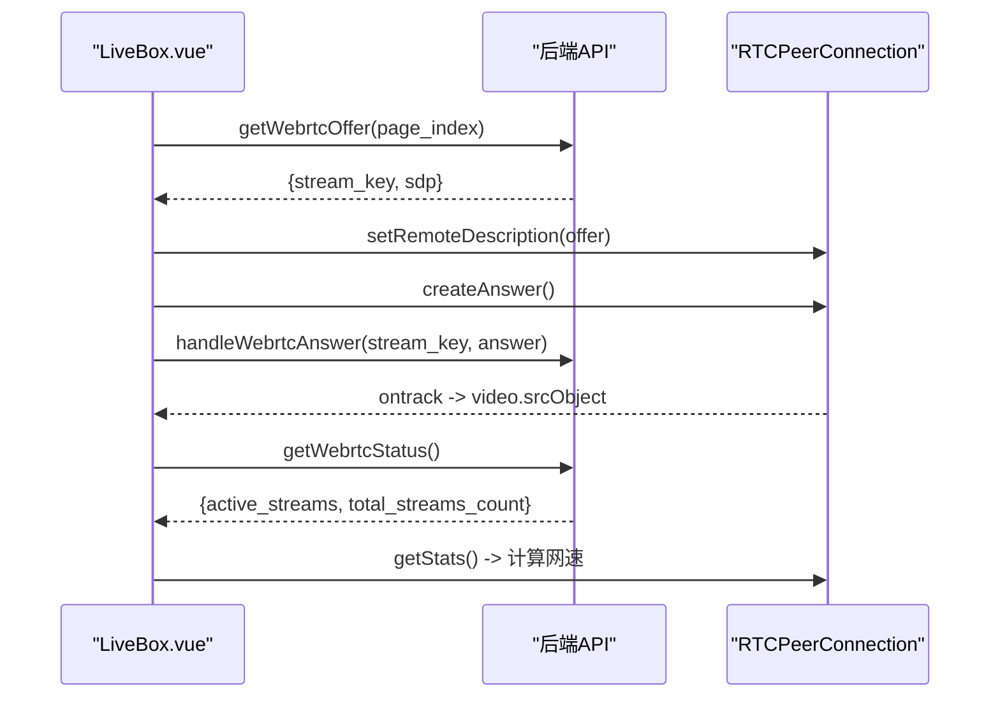
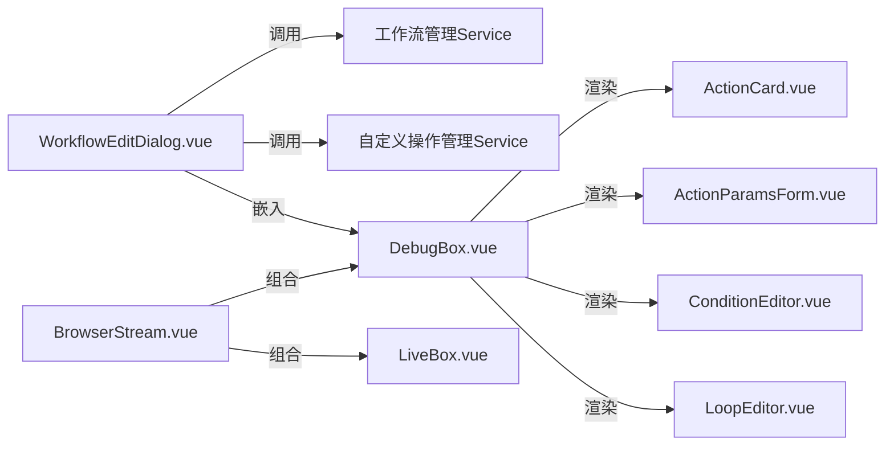

# RPA 浏览器组件

<cite>
**本文引用的文件**
- [ActionCard.vue](file://Vue3FrontEndDemoExercise/src/components/rpa-browser/ActionCard.vue)
- [ActionParamsForm.vue](file://Vue3FrontEndDemoExercise/src/components/rpa-browser/ActionParamsForm.vue)
- [ConditionEditor.vue](file://Vue3FrontEndDemoExercise/src/components/rpa-browser/ConditionEditor.vue)
- [LoopEditor.vue](file://Vue3FrontEndDemoExercise/src/components/rpa-browser/LoopEditor.vue)
- [WorkflowEditDialog.vue](file://Vue3FrontEndDemoExercise/src/components/rpa-browser/WorkflowEditDialog.vue)
- [BrowserStream.vue](file://Vue3FrontEndDemoExercise/src/views/rpa-browser/BrowserStream.vue)
- [LiveBox.vue](file://Vue3FrontEndDemoExercise/src/components/rpa-browser/LiveBox.vue)
- [debugbox-types.ts](file://Vue3FrontEndDemoExercise/src/components/rpa-browser/debugbox-types.ts)
</cite>

## 目录
1. [简介](#简介)
2. [项目结构](#项目结构)
3. [核心组件](#核心组件)
4. [架构总览](#架构总览)
5. [详细组件分析](#详细组件分析)
6. [依赖关系分析](#依赖关系分析)
7. [性能考虑](#性能考虑)
8. [故障排查指南](#故障排查指南)
9. [结论](#结论)
10. [附录](#附录)

## 简介
本技术文档聚焦于 RPA 浏览器控制台的前端组件实现，覆盖动作卡片的数据绑定与参数传递、动态参数表单的生成与校验、条件编辑器的逻辑构建与表达式解析、循环编辑器的迭代控制；并深入解析工作流编辑器的可视化编排与状态管理，以及浏览器流的视频流处理与实时通信机制。同时总结组件间通信模式、事件处理机制以及与后端服务的交互方式（含 WebRTC 与 HTTP API），并提供调试技巧与常见问题解决方案，帮助开发者理解与扩展 RPA 功能。

## 项目结构
RPA 浏览器相关前端代码主要位于 Vue3 工程下的 rpa-browser 目录：
- 组件层：ActionCard、ActionParamsForm、ConditionEditor、LoopEditor、WorkflowEditDialog、LiveBox 等
- 视图层：BrowserStream 页面作为控制台入口，组合 LiveBox 与 DebugBox（调试面板）
- 类型定义：debugbox-types.ts 统一描述条件规则、循环配置、步骤项等数据结构

图表来源
- [BrowserStream.vue:489-495](file://Vue3FrontEndDemoExercise/src/views/rpa-browser/BrowserStream.vue#L489-L495)
- [WorkflowEditDialog.vue:498-507](file://Vue3FrontEndDemoExercise/src/components/rpa-browser/WorkflowEditDialog.vue#L498-L507)

章节来源
- [BrowserStream.vue:406-497](file://Vue3FrontEndDemoExercise/src/views/rpa-browser/BrowserStream.vue#L406-L497)
- [WorkflowEditDialog.vue:382-507](file://Vue3FrontEndDemoExercise/src/components/rpa-browser/WorkflowEditDialog.vue#L382-L507)

## 核心组件
- ActionCard：动作卡片的展示与数据绑定，支持图标、标题、描述、标签与元信息徽章，以及插件配置参数的显示。
- ActionParamsForm：基于 JSON Schema 的动态参数表单生成器，支持嵌套对象、枚举、时间戳、字典键值对、JSON 编辑器、HTTP/RPC 模式切换与字段可见性控制。
- ConditionEditor：结构化条件编辑器，将 UI 列表序列化为后端 ConditionRule，支持 AND/OR 分组、NOT 取反与预览文本。
- LoopEditor：循环参数配置编辑器，支持固定次数、变量列表、JSON 列表三种来源，提供 break/continue 条件与参数映射能力。
- WorkflowEditDialog：工作流编辑器弹窗，负责元信息编辑、步骤可视化编排（通过 DebugBox）、运行与保存（两步：先保存自定义操作，再保存工作流）。
- BrowserStream：浏览器控制台页面，负责会话生命周期、WebRTC 状态、截图、工具箱与页面管理。
- LiveBox：浏览器屏幕直播组件，封装 WebRTC Offer/Answer 流程、ICE 候选交换、页面标签管理与带宽统计。

章节来源
- [ActionCard.vue:1-196](file://Vue3FrontEndDemoExercise/src/components/rpa-browser/ActionCard.vue#L1-L196)
- [ActionParamsForm.vue:1-802](file://Vue3FrontEndDemoExercise/src/components/rpa-browser/ActionParamsForm.vue#L1-L802)
- [ConditionEditor.vue:1-450](file://Vue3FrontEndDemoExercise/src/components/rpa-browser/ConditionEditor.vue#L1-L450)
- [LoopEditor.vue:1-367](file://Vue3FrontEndDemoExercise/src/components/rpa-browser/LoopEditor.vue#L1-L367)
- [WorkflowEditDialog.vue:1-568](file://Vue3FrontEndDemoExercise/src/components/rpa-browser/WorkflowEditDialog.vue#L1-L568)
- [BrowserStream.vue:1-579](file://Vue3FrontEndDemoExercise/src/views/rpa-browser/BrowserStream.vue#L1-L579)
- [LiveBox.vue:1-601](file://Vue3FrontEndDemoExercise/src/components/rpa-browser/LiveBox.vue#L1-L601)
- [debugbox-types.ts:1-164](file://Vue3FrontEndDemoExercise/src/components/rpa-browser/debugbox-types.ts#L1-L164)

## 架构总览
RPA 控制台采用“页面 + 弹窗 + 子组件”的分层组织：
- BrowserStream 作为控制台入口，管理浏览器会话状态、WebRTC 连接与页面切换，并通过 provide/inject 向子组件共享状态。
- WorkflowEditDialog 承载工作流编辑与执行，内部集成 DebugBox 进行可视化编排，调用后端工作流与自定义操作接口完成保存与运行。
- ActionCard/ActionParamsForm/ConditionEditor/LoopEditor 作为可复用单元，被 DebugBox 在拖拽编排时按需挂载，完成参数表单渲染与条件/循环配置。
- LiveBox 负责浏览器屏幕的实时视频流，使用 WebRTC 与后端服务建立 P2P 通道，并通过 HTTP API 获取页面信息与状态。

图表来源
- [BrowserStream.vue:132-168](file://Vue3FrontEndDemoExercise/src/views/rpa-browser/BrowserStream.vue#L132-L168)
- [LiveBox.vue:165-259](file://Vue3FrontEndDemoExercise/src/components/rpa-browser/LiveBox.vue#L165-L259)
- [LiveBox.vue:409-464](file://Vue3FrontEndDemoExercise/src/components/rpa-browser/LiveBox.vue#L409-L464)

## 详细组件分析

### ActionCard 动作卡片
- 数据绑定：接收 action_id、json_schema、name、description、action_detail 与 configParams，动态计算图标、标题与描述，优先使用自定义名称与描述。
- 元信息展示：当存在 action_detail 时，渲染标签与徽章（公开、已验证、点赞数）。
- 插件参数：configParams 以键值对形式展示，过滤空值。

图表来源
- [ActionCard.vue:27-146](file://Vue3FrontEndDemoExercise/src/components/rpa-browser/ActionCard.vue#L27-L146)
- [ActionCard.vue:149-196](file://Vue3FrontEndDemoExercise/src/components/rpa-browser/ActionCard.vue#L149-L196)

章节来源
- [ActionCard.vue:1-196](file://Vue3FrontEndDemoExercise/src/components/rpa-browser/ActionCard.vue#L1-L196)

### ActionParamsForm 参数表单
- JSON Schema 解析：递归解析 $ref、anyOf、allOf，合并外层 title/description/default，避免继承枚举类名作为字段标题。
- 字段类型映射：字符串、数字、布尔、对象、数组、枚举、时间戳、JSON 编辑器、字典键值对。
- 特殊模式：fetch_external_data 的 HTTP 与 RPC 模式分离，按 method_name 动态显示对应参数字段，切换方法时清空旧参数并重新初始化默认值。
- 输入/输出变量：维护 input_vars 与 output_vars，双向同步到父组件。
- 校验与反馈：JSON 字段即时解析并显示错误信息。

图表来源
- [ActionParamsForm.vue:50-149](file://Vue3FrontEndDemoExercise/src/components/rpa-browser/ActionParamsForm.vue#L50-L149)
- [ActionParamsForm.vue:380-464](file://Vue3FrontEndDemoExercise/src/components/rpa-browser/ActionParamsForm.vue#L380-L464)
- [ActionParamsForm.vue:466-500](file://Vue3FrontEndDemoExercise/src/components/rpa-browser/ActionParamsForm.vue#L466-L500)

章节来源
- [ActionParamsForm.vue:1-802](file://Vue3FrontEndDemoExercise/src/components/rpa-browser/ActionParamsForm.vue#L1-L802)

### ConditionEditor 条件编辑器
- UI 模型：扁平列表 ConditionItem，包含 field、conditionValueType、conditionValue、logic、negate。
- 序列化：将列表按连续相同 logic 分组，构建后端 ConditionRule（AND/OR 分组，NOT 包装）。
- 反序列化：递归将 ConditionRule 摊平为 UI 列表，处理 NOT of group 场景。
- 预览：生成可读的条件表达式文本，便于用户确认逻辑。

图表来源
- [ConditionEditor.vue:71-139](file://Vue3FrontEndDemoExercise/src/components/rpa-browser/ConditionEditor.vue#L71-L139)
- [ConditionEditor.vue:143-198](file://Vue3FrontEndDemoExercise/src/components/rpa-browser/ConditionEditor.vue#L143-L198)
- [ConditionEditor.vue:258-288](file://Vue3FrontEndDemoExercise/src/components/rpa-browser/ConditionEditor.vue#L258-L288)

章节来源
- [ConditionEditor.vue:1-450](file://Vue3FrontEndDemoExercise/src/components/rpa-browser/ConditionEditor.vue#L1-L450)

### LoopEditor 循环编辑器
- 循环来源：固定次数、从变量获取列表、直接输入 JSON 列表。
- 变量命名：loop_item、loop_index 可自定义。
- 控制条件：break 与 continue 条件复用 ConditionEditor，每次迭代前评估。
- 参数映射：将循环项字段映射到循环体内步骤的参数，支持点分隔路径与效果预览。

图表来源
- [LoopEditor.vue:39-72](file://Vue3FrontEndDemoExercise/src/components/rpa-browser/LoopEditor.vue#L39-L72)
- [LoopEditor.vue:74-111](file://Vue3FrontEndDemoExercise/src/components/rpa-browser/LoopEditor.vue#L74-L111)
- [LoopEditor.vue:185-218](file://Vue3FrontEndDemoExercise/src/components/rpa-browser/LoopEditor.vue#L185-L218)
- [LoopEditor.vue:235-364](file://Vue3FrontEndDemoExercise/src/components/rpa-browser/LoopEditor.vue#L235-L364)

章节来源
- [LoopEditor.vue:1-367](file://Vue3FrontEndDemoExercise/src/components/rpa-browser/LoopEditor.vue#L1-L367)

### WorkflowEditDialog 工作流编辑器
- 元信息：名称、描述、公开、启用、触发方式（手动/定时 Cron）。
- 步骤编排：通过 DebugBox 进行可视化拖拽与参数配置，打开弹窗时反序列化后端 steps 为 DroppedItem[]。
- 运行：调用执行引擎接口，传入步骤与变量，展示每步结果与汇总。
- 保存：两步流程——先创建/更新自定义操作（获取 action_id），再创建/更新工作流（关联 custom_action_id）。

图表来源
- [WorkflowEditDialog.vue:218-270](file://Vue3FrontEndDemoExercise/src/components/rpa-browser/WorkflowEditDialog.vue#L218-L270)
- [WorkflowEditDialog.vue:272-374](file://Vue3FrontEndDemoExercise/src/components/rpa-browser/WorkflowEditDialog.vue#L272-L374)
- [WorkflowEditDialog.vue:95-130](file://Vue3FrontEndDemoExercise/src/components/rpa-browser/WorkflowEditDialog.vue#L95-L130)

章节来源
- [WorkflowEditDialog.vue:1-568](file://Vue3FrontEndDemoExercise/src/components/rpa-browser/WorkflowEditDialog.vue#L1-L568)

### BrowserStream 浏览器流页面
- 会话管理：创建/关闭浏览器会话，轮询会话状态，失败时提示并过渡到错误状态。
- WebRTC 状态：查询 WebRTC 状态，展示连接数与连接状态。
- 页面管理：获取页面列表，新增/关闭/切换页面，切换后如需直播则重建 WebRTC 连接。
- 截图：调用执行引擎截图动作，收集历史截图并支持预览与删除。
- 工具与调试：打开工具箱（ToolboxPanel）与调试面板（DebugBox），提供最小化与恢复能力。

图表来源
- [BrowserStream.vue:132-222](file://Vue3FrontEndDemoExercise/src/views/rpa-browser/BrowserStream.vue#L132-L222)
- [BrowserStream.vue:264-319](file://Vue3FrontEndDemoExercise/src/views/rpa-browser/BrowserStream.vue#L264-L319)
- [BrowserStream.vue:351-394](file://Vue3FrontEndDemoExercise/src/views/rpa-browser/BrowserStream.vue#L351-L394)

章节来源
- [BrowserStream.vue:1-579](file://Vue3FrontEndDemoExercise/src/views/rpa-browser/BrowserStream.vue#L1-L579)

### LiveBox 视频流组件
- WebRTC 握手：获取 Offer，设置远程描述，创建 Answer 并发送，交换 ICE 候选。
- 页面管理：获取页面列表，新增/关闭/切换页面，切换后重建直播连接。
- 带宽统计：周期性查询 RTCPeerConnection stats，计算上传/下载速率。
- 状态同步：监听连接状态变化，更新 isStreaming 与 webrtcStatus，并向父组件广播。

图表来源
- [LiveBox.vue:165-259](file://Vue3FrontEndDemoExercise/src/components/rpa-browser/LiveBox.vue#L165-L259)
- [LiveBox.vue:409-464](file://Vue3FrontEndDemoExercise/src/components/rpa-browser/LiveBox.vue#L409-L464)

章节来源
- [LiveBox.vue:1-601](file://Vue3FrontEndDemoExercise/src/components/rpa-browser/LiveBox.vue#L1-L601)

## 依赖关系分析
- 组件耦合：
  - WorkflowEditDialog 依赖 DebugBox（外部引用）进行步骤编排，并通过业务处理器调用工作流与自定义操作服务。
  - BrowserStream 组合 LiveBox 与 DebugBox，通过 provide/inject 共享会话状态与流状态。
  - ActionParamsForm 依赖 JSON Schema 与 Element Plus 组件，支持复杂表单逻辑。
  - ConditionEditor 与 LoopEditor 共用 ConditionRule 类型，确保前后端一致。
- 外部依赖：
  - WebRTC 用于浏览器屏幕实时传输。
  - HTTP API 用于会话管理、页面操作、动作执行与工作流保存/运行。
- 潜在循环依赖：无直接循环导入，组件间通过 props/emit/provide-inject 解耦。

图表来源
- [WorkflowEditDialog.vue:498-507](file://Vue3FrontEndDemoExercise/src/components/rpa-browser/WorkflowEditDialog.vue#L498-L507)
- [BrowserStream.vue:489-495](file://Vue3FrontEndDemoExercise/src/views/rpa-browser/BrowserStream.vue#L489-L495)

章节来源
- [WorkflowEditDialog.vue:1-568](file://Vue3FrontEndDemoExercise/src/components/rpa-browser/WorkflowEditDialog.vue#L1-L568)
- [BrowserStream.vue:1-579](file://Vue3FrontEndDemoExercise/src/views/rpa-browser/BrowserStream.vue#L1-L579)

## 性能考虑
- WebRTC 带宽监控：LiveBox 每秒查询 stats，计算上传/下载速率，避免频繁 DOM 更新。
- 状态刷新节流：BrowserStream 使用防抖函数刷新会话状态，减少不必要的请求。
- 表单初始化优化：ActionParamsForm 在 JSON Schema 变化时深度监听并重新初始化 formData，避免重复计算。
- 条件序列化分组：ConditionEditor 按连续相同 logic 分组，降低后端解析复杂度。
- 循环参数映射：LoopEditor 提供映射预览，减少运行时错误与调试成本。

[本节为通用指导，不直接分析具体文件]

## 故障排查指南
- 浏览器会话启动失败：
  - 检查网络与权限，确认用户登录态；查看会话创建接口返回码与消息。
  - 参考：[BrowserStream.vue:132-168](file://Vue3FrontEndDemoExercise/src/views/rpa-browser/BrowserStream.vue#L132-L168)
- WebRTC 连接失败：
  - 检查 Offer/Answer 流程与 ICE 候选交换；确认 STUN 服务器可达。
  - 参考：[LiveBox.vue:165-259](file://Vue3FrontEndDemoExercise/src/components/rpa-browser/LiveBox.vue#L165-L259)
- 参数表单校验错误：
  - 检查 JSON 字段格式与必填项；查看 ActionParamsForm 的错误状态与提示信息。
  - 参考：[ActionParamsForm.vue:466-500](file://Vue3FrontEndDemoExercise/src/components/rpa-browser/ActionParamsForm.vue#L466-L500)
- 条件逻辑不符合预期：
  - 使用 ConditionEditor 预览文本核对 AND/OR/NOT 组合；检查字段名与值类型。
  - 参考：[ConditionEditor.vue:258-288](file://Vue3FrontEndDemoExercise/src/components/rpa-browser/ConditionEditor.vue#L258-L288)
- 循环映射未生效：
  - 确认 sourcePath 与 targetParam 配置正确；检查 loop_item 变量名与嵌套路径。
  - 参考：[LoopEditor.vue:235-364](file://Vue3FrontEndDemoExercise/src/components/rpa-browser/LoopEditor.vue#L235-L364)
- 工作流保存失败：
  - 分步排查：先保存自定义操作，再保存工作流；查看业务处理器返回与错误消息。
  - 参考：[WorkflowEditDialog.vue:272-374](file://Vue3FrontEndDemoExercise/src/components/rpa-browser/WorkflowEditDialog.vue#L272-L374)

章节来源
- [BrowserStream.vue:132-222](file://Vue3FrontEndDemoExercise/src/views/rpa-browser/BrowserStream.vue#L132-L222)
- [LiveBox.vue:165-259](file://Vue3FrontEndDemoExercise/src/components/rpa-browser/LiveBox.vue#L165-L259)
- [ActionParamsForm.vue:466-500](file://Vue3FrontEndDemoExercise/src/components/rpa-browser/ActionParamsForm.vue#L466-L500)
- [ConditionEditor.vue:258-288](file://Vue3FrontEndDemoExercise/src/components/rpa-browser/ConditionEditor.vue#L258-L288)
- [LoopEditor.vue:235-364](file://Vue3FrontEndDemoExercise/src/components/rpa-browser/LoopEditor.vue#L235-L364)
- [WorkflowEditDialog.vue:272-374](file://Vue3FrontEndDemoExercise/src/components/rpa-browser/WorkflowEditDialog.vue#L272-L374)

## 结论
本方案通过模块化组件与清晰的职责划分，实现了 RPA 浏览器的可视化编排与实时控制。ActionCard 与 ActionParamsForm 提供了灵活的动作参数配置；ConditionEditor 与 LoopEditor 增强了流程控制能力；WorkflowEditDialog 整合了工作流的生命周期管理；BrowserStream 与 LiveBox 构建了稳定的视频流通道。整体架构具备良好的可扩展性与可维护性，适合进一步扩展更多动作类型与控制逻辑。

[本节为总结性内容，不直接分析具体文件]

## 附录
- 类型定义参考：
  - 条件规则与循环配置：[debugbox-types.ts:3-83](file://Vue3FrontEndDemoExercise/src/components/rpa-browser/debugbox-types.ts#L3-L83)
  - 步骤项与动作详情：[debugbox-types.ts:85-138](file://Vue3FrontEndDemoExercise/src/components/rpa-browser/debugbox-types.ts#L85-L138)

章节来源
- [debugbox-types.ts:1-164](file://Vue3FrontEndDemoExercise/src/components/rpa-browser/debugbox-types.ts#L1-L164)