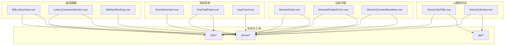
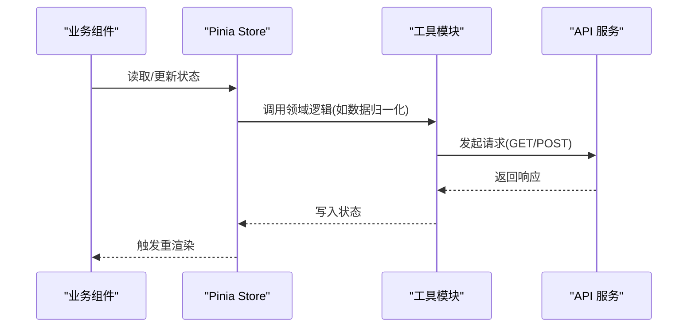
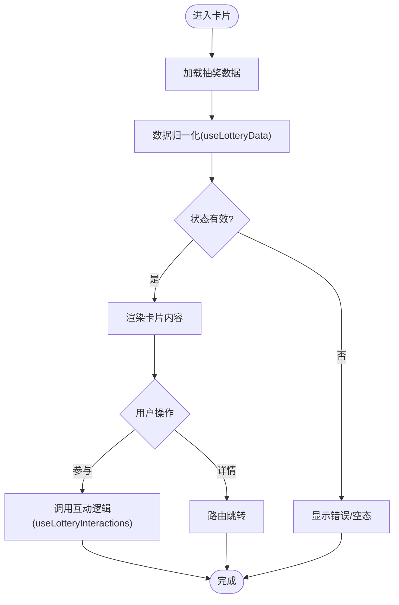
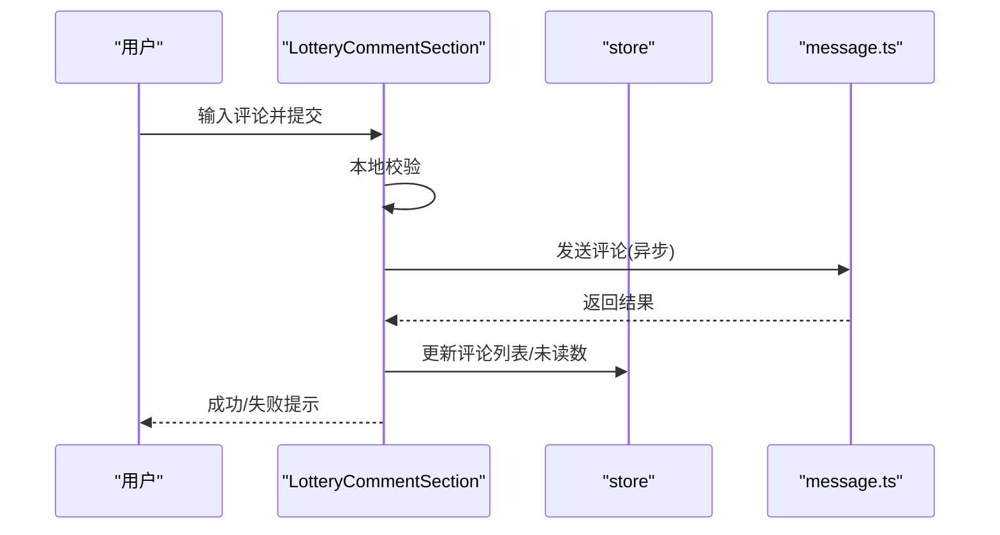
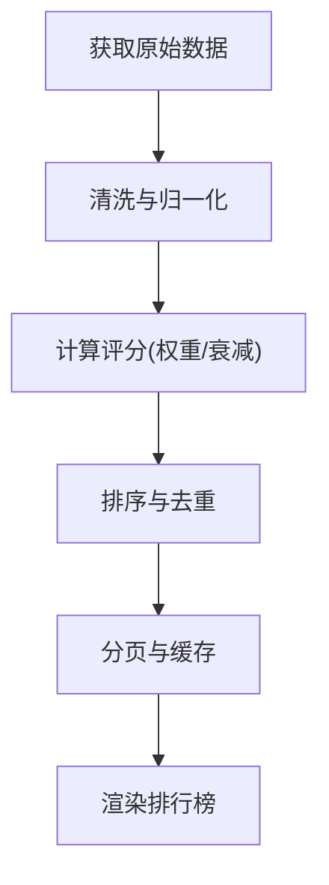
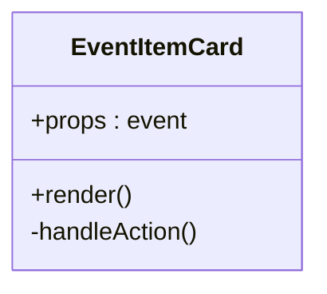
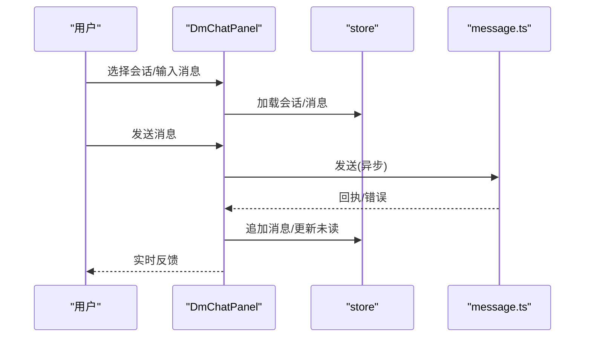
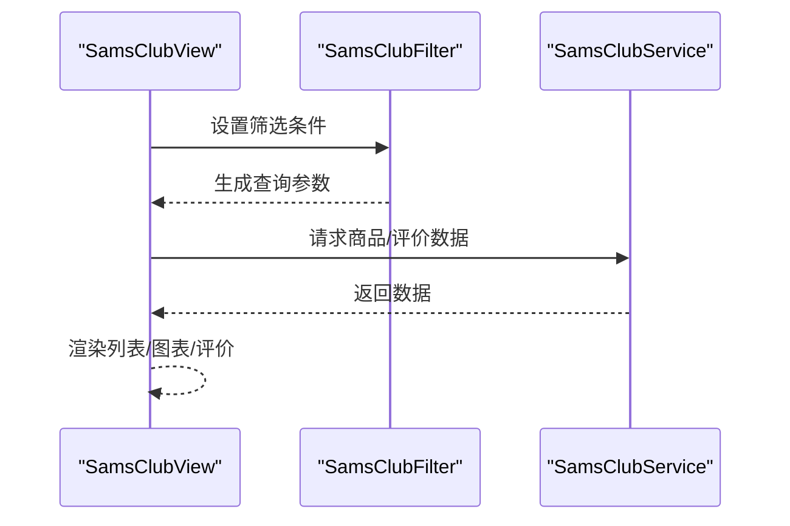
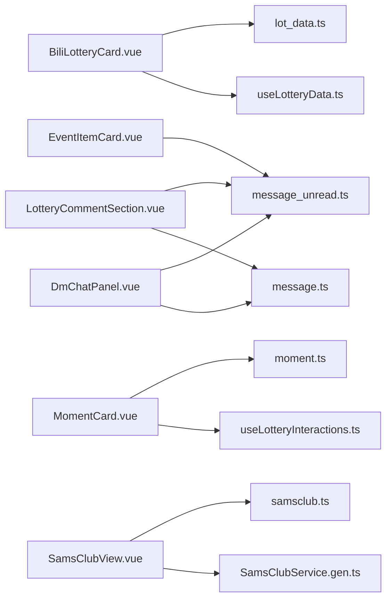

# 业务组件

<cite>
**本文引用的文件**
- [BiliLotteryCard.vue](file://Vue3FrontEndDemoExercise/src/components/lottery_data/bili_data/BiliLotteryCard.vue)
- [BiliLotteryCardContainer.vue](file://Vue3FrontEndDemoExercise/src/components/lottery_data/bili_data/BiliLotteryCardContainer.vue)
- [LotteryCommentSection.vue](file://Vue3FrontEndDemoExercise/src/components/lottery_data/LotteryCommentSection.vue)
- [BiliAtariRanking.vue](file://Vue3FrontEndDemoExercise/src/components/lottery_data/BiliAtariRanking.vue)
- [EventItemCard.vue](file://Vue3FrontEndDemoExercise/src/components/message/EventItemCard.vue)
- [DmChatPanel.vue](file://Vue3FrontEndDemoExercise/src/components/message/DmChatPanel.vue)
- [UserCard.vue](file://Vue3FrontEndDemoExercise/src/components/message/UserCard.vue)
- [MomentCard.vue](file://Vue3FrontEndDemoExercise/src/components/moment/MomentCard.vue)
- [MomentPublishForm.vue](file://Vue3FrontEndDemoExercise/src/components/moment/MomentPublishForm.vue)
- [MomentContentRenderer.vue](file://Vue3FrontEndDemoExercise/src/components/moment/MomentContentRenderer.vue)
- [SamsClubFilter.vue](file://Vue3FrontEndDemoExercise/src/components/SamsClubCompo/SamsClubFilter.vue)
- [SamsClubView.vue](file://Vue3FrontEndDemoExercise/src/views/SamsClubView.vue)
- [SamsClubService.gen.ts](file://Vue3FrontEndDemoExercise/src/api/bili_lottery_data/hey-api/services/SamsClubService.gen.ts)
- [samsclub.ts](file://Vue3FrontEndDemoExercise/src/stores/samsclub.ts)
- [message_unread.ts](file://Vue3FrontEndDemoExercise/src/stores/message_unread.ts)
- [moment.ts](file://Vue3FrontEndDemoExercise/src/stores/moment.ts)
- [lot_data.ts](file://Vue3FrontEndDemoExercise/src/stores/lot_data.ts)
- [useLotteryData.ts](file://Vue3FrontEndDemoExercise/src/utils/useLotteryData.ts)
- [useLotteryInteractions.ts](file://Vue3FrontEndDemoExercise/src/utils/useLotteryInteractions.ts)
- [message.ts](file://Vue3FrontEndDemoExercise/src/utils/message.ts)
</cite>

## 目录
1. [简介](#简介)
2. [项目结构](#项目结构)
3. [核心组件](#核心组件)
4. [架构总览](#架构总览)
5. [详细组件分析](#详细组件分析)
6. [依赖关系分析](#依赖关系分析)
7. [性能考虑](#性能考虑)
8. [故障排查指南](#故障排查指南)
9. [结论](#结论)
10. [附录](#附录)

## 简介
本指南面向业务组件开发者，聚焦以下能力：
- 抽奖数据相关组件：BiliLotteryCard（抽奖卡片展示）、LotteryCommentSection（评论交互）、BiliAtariRanking（排行榜算法）
- 消息系统组件：EventItemCard（事件类型化）、DmChatPanel（私信收发）、UserCard（用户信息展示）
- 动态内容组件：MomentCard（动态渲染）、MomentPublishForm（富文本发布）、MomentContentRenderer（Markdown 支持）
- 山姆会员店组件：商品展示、价格图表、用户评价
- 状态管理与 API 集成：统一 store 与接口调用约定

## 项目结构
前端采用 Vue 3 + TypeScript，按“功能域”组织组件与 store：
- components/lottery_data：抽奖数据展示与交互
- components/message：消息系统（事件卡、私信面板、用户卡片）
- components/moment：动态内容（卡片、发布表单、内容渲染）
- components/SamsClubCompo：山姆会员店筛选与视图
- stores：全局状态（消息未读、动态、抽奖数据、山姆等）
- utils：通用逻辑（抽奖数据、互动、消息工具）
- api：API 客户端与服务封装（含 SamsClubService）

**图示来源**
- [BiliLotteryCard.vue:1-200](file://Vue3FrontEndDemoExercise/src/components/lottery_data/bili_data/BiliLotteryCard.vue#L1-L200)
- [LotteryCommentSection.vue:1-200](file://Vue3FrontEndDemoExercise/src/components/lottery_data/LotteryCommentSection.vue#L1-L200)
- [BiliAtariRanking.vue:1-200](file://Vue3FrontEndDemoExercise/src/components/lottery_data/BiliAtariRanking.vue#L1-L200)
- [EventItemCard.vue:1-200](file://Vue3FrontEndDemoExercise/src/components/message/EventItemCard.vue#L1-L200)
- [DmChatPanel.vue:1-200](file://Vue3FrontEndDemoExercise/src/components/message/DmChatPanel.vue#L1-L200)
- [UserCard.vue:1-200](file://Vue3FrontEndDemoExercise/src/components/message/UserCard.vue#L1-L200)
- [MomentCard.vue:1-200](file://Vue3FrontEndDemoExercise/src/components/moment/MomentCard.vue#L1-L200)
- [MomentPublishForm.vue:1-200](file://Vue3FrontEndDemoExercise/src/components/moment/MomentPublishForm.vue#L1-L200)
- [MomentContentRenderer.vue:1-200](file://Vue3FrontEndDemoExercise/src/components/moment/MomentContentRenderer.vue#L1-L200)
- [SamsClubFilter.vue:1-200](file://Vue3FrontEndDemoExercise/src/components/SamsClubCompo/SamsClubFilter.vue#L1-L200)
- [SamsClubView.vue:1-200](file://Vue3FrontEndDemoExercise/src/views/SamsClubView.vue#L1-L200)

**章节来源**
- [BiliLotteryCard.vue:1-200](file://Vue3FrontEndDemoExercise/src/components/lottery_data/bili_data/BiliLotteryCard.vue#L1-L200)
- [LotteryCommentSection.vue:1-200](file://Vue3FrontEndDemoExercise/src/components/lottery_data/LotteryCommentSection.vue#L1-L200)
- [BiliAtariRanking.vue:1-200](file://Vue3FrontEndDemoExercise/src/components/lottery_data/BiliAtariRanking.vue#L1-L200)
- [EventItemCard.vue:1-200](file://Vue3FrontEndDemoExercise/src/components/message/EventItemCard.vue#L1-L200)
- [DmChatPanel.vue:1-200](file://Vue3FrontEndDemoExercise/src/components/message/DmChatPanel.vue#L1-L200)
- [UserCard.vue:1-200](file://Vue3FrontEndDemoExercise/src/components/message/UserCard.vue#L1-L200)
- [MomentCard.vue:1-200](file://Vue3FrontEndDemoExercise/src/components/moment/MomentCard.vue#L1-L200)
- [MomentPublishForm.vue:1-200](file://Vue3FrontEndDemoExercise/src/components/moment/MomentPublishForm.vue#L1-L200)
- [MomentContentRenderer.vue:1-200](file://Vue3FrontEndDemoExercise/src/components/moment/MomentContentRenderer.vue#L1-L200)
- [SamsClubFilter.vue:1-200](file://Vue3FrontEndDemoExercise/src/components/SamsClubCompo/SamsClubFilter.vue#L1-L200)
- [SamsClubView.vue:1-200](file://Vue3FrontEndDemoExercise/src/views/SamsClubView.vue#L1-L200)

## 核心组件
- 抽奖数据
  - BiliLotteryCard：负责抽奖卡片的数据展示与基础交互入口
  - LotteryCommentSection：评论列表、输入、提交、分页与错误处理
  - BiliAtariRanking：排行榜数据聚合与排序算法实现
- 消息系统
  - EventItemCard：基于事件类型的类型化渲染（如通知、私信、系统消息）
  - DmChatPanel：私信会话管理、消息发送、接收与滚动加载
  - UserCard：用户头像、昵称、等级等基本信息展示
- 动态内容
  - MomentCard：动态条目渲染（标题、正文、媒体、互动计数）
  - MomentPublishForm：富文本编辑、校验、发布流程
  - MomentContentRenderer：Markdown 解析与安全渲染
- 山姆会员店
  - SamsClubFilter：筛选条件与查询参数组装
  - SamsClubView：商品列表、价格图表、用户评价展示

**章节来源**
- [BiliLotteryCard.vue:1-200](file://Vue3FrontEndDemoExercise/src/components/lottery_data/bili_data/BiliLotteryCard.vue#L1-L200)
- [LotteryCommentSection.vue:1-200](file://Vue3FrontEndDemoExercise/src/components/lottery_data/LotteryCommentSection.vue#L1-L200)
- [BiliAtariRanking.vue:1-200](file://Vue3FrontEndDemoExercise/src/components/lottery_data/BiliAtariRanking.vue#L1-L200)
- [EventItemCard.vue:1-200](file://Vue3FrontEndDemoExercise/src/components/message/EventItemCard.vue#L1-L200)
- [DmChatPanel.vue:1-200](file://Vue3FrontEndDemoExercise/src/components/message/DmChatPanel.vue#L1-L200)
- [UserCard.vue:1-200](file://Vue3FrontEndDemoExercise/src/components/message/UserCard.vue#L1-L200)
- [MomentCard.vue:1-200](file://Vue3FrontEndDemoExercise/src/components/moment/MomentCard.vue#L1-L200)
- [MomentPublishForm.vue:1-200](file://Vue3FrontEndDemoExercise/src/components/moment/MomentPublishForm.vue#L1-L200)
- [MomentContentRenderer.vue:1-200](file://Vue3FrontEndDemoExercise/src/components/moment/MomentContentRenderer.vue#L1-L200)
- [SamsClubFilter.vue:1-200](file://Vue3FrontEndDemoExercise/src/components/SamsClubCompo/SamsClubFilter.vue#L1-L200)
- [SamsClubView.vue:1-200](file://Vue3FrontEndDemoExercise/src/views/SamsClubView.vue#L1-L200)

## 架构总览
- 组件层：各业务组件通过 props/emits 或组合式函数协作
- 状态层：Pinia store 集中管理跨组件共享状态（消息未读、动态、抽奖数据、山姆数据）
- 工具层：utils 提供领域逻辑（抽奖数据处理、互动、消息工具）
- API 层：统一的 HTTP/GQL 客户端与服务封装（如 SamsClubService）

**图示来源**
- [useLotteryData.ts:1-200](file://Vue3FrontEndDemoExercise/src/utils/useLotteryData.ts#L1-L200)
- [useLotteryInteractions.ts:1-200](file://Vue3FrontEndDemoExercise/src/utils/useLotteryInteractions.ts#L1-L200)
- [message.ts:1-200](file://Vue3FrontEndDemoExercise/src/utils/message.ts#L1-L200)
- [SamsClubService.gen.ts:1-200](file://Vue3FrontEndDemoExercise/src/api/bili_lottery_data/hey-api/services/SamsClubService.gen.ts#L1-L200)
- [samsclub.ts:1-200](file://Vue3FrontEndDemoExercise/src/stores/samsclub.ts#L1-L200)
- [message_unread.ts:1-200](file://Vue3FrontEndDemoExercise/src/stores/message_unread.ts#L1-L200)
- [moment.ts:1-200](file://Vue3FrontEndDemoExercise/src/stores/moment.ts#L1-L200)
- [lot_data.ts:1-200](file://Vue3FrontEndDemoExercise/src/stores/lot_data.ts#L1-L200)

## 详细组件分析

### 抽奖数据组件
#### BiliLotteryCard（抽奖卡片）
- 职责：展示抽奖活动关键信息（标题、时间、参与方式、状态），承载进入详情页或参与入口
- 数据流：从 lot_data store 获取数据，必要时调用 useLotteryData 进行数据归一化
- 交互：点击跳转详情、参与抽奖、分享等

**图示来源**
- [BiliLotteryCard.vue:1-200](file://Vue3FrontEndDemoExercise/src/components/lottery_data/bili_data/BiliLotteryCard.vue#L1-L200)
- [useLotteryData.ts:1-200](file://Vue3FrontEndDemoExercise/src/utils/useLotteryData.ts#L1-L200)
- [useLotteryInteractions.ts:1-200](file://Vue3FrontEndDemoExercise/src/utils/useLotteryInteractions.ts#L1-L200)
- [lot_data.ts:1-200](file://Vue3FrontEndDemoExercise/src/stores/lot_data.ts#L1-L200)

**章节来源**
- [BiliLotteryCard.vue:1-200](file://Vue3FrontEndDemoExercise/src/components/lottery_data/bili_data/BiliLotteryCard.vue#L1-L200)
- [BiliLotteryCardContainer.vue:1-200](file://Vue3FrontEndDemoExercise/src/components/lottery_data/bili_data/BiliLotteryCardContainer.vue#L1-L200)
- [useLotteryData.ts:1-200](file://Vue3FrontEndDemoExercise/src/utils/useLotteryData.ts#L1-L200)
- [lot_data.ts:1-200](file://Vue3FrontEndDemoExercise/src/stores/lot_data.ts#L1-L200)

#### LotteryCommentSection（评论区域）
- 职责：评论列表展示、新增评论、分页加载、错误提示
- 数据流：从 store 拉取评论，提交时调用消息工具或 API 服务
- 交互：输入校验、提交成功反馈、失败重试

**图示来源**
- [LotteryCommentSection.vue:1-200](file://Vue3FrontEndDemoExercise/src/components/lottery_data/LotteryCommentSection.vue#L1-L200)
- [message.ts:1-200](file://Vue3FrontEndDemoExercise/src/utils/message.ts#L1-L200)
- [message_unread.ts:1-200](file://Vue3FrontEndDemoExercise/src/stores/message_unread.ts#L1-L200)

**章节来源**
- [LotteryCommentSection.vue:1-200](file://Vue3FrontEndDemoExercise/src/components/lottery_data/LotteryCommentSection.vue#L1-L200)

#### BiliAtariRanking（排行榜）
- 职责：聚合抽奖相关指标，计算排名并展示
- 算法要点：权重评分、去重、分页与缓存策略
- 输出：有序列表、统计摘要、刷新机制

**图示来源**
- [BiliAtariRanking.vue:1-200](file://Vue3FrontEndDemoExercise/src/components/lottery_data/BiliAtariRanking.vue#L1-L200)
- [useLotteryData.ts:1-200](file://Vue3FrontEndDemoExercise/src/utils/useLotteryData.ts#L1-L200)

**章节来源**
- [BiliAtariRanking.vue:1-200](file://Vue3FrontEndDemoExercise/src/components/lottery_data/BiliAtariRanking.vue#L1-L200)

### 消息系统组件
#### EventItemCard（事件卡片）
- 职责：根据事件类型渲染不同样式与动作（通知、私信、系统消息）
- 类型化处理：基于枚举/类型字段分支渲染，确保可扩展性

**图示来源**
- [EventItemCard.vue:1-200](file://Vue3FrontEndDemoExercise/src/components/message/EventItemCard.vue#L1-L200)

**章节来源**
- [EventItemCard.vue:1-200](file://Vue3FrontEndDemoExercise/src/components/message/EventItemCard.vue#L1-L200)

#### DmChatPanel（私信面板）
- 职责：会话选择、消息列表、发送消息、滚动加载历史
- 数据流：store 维护会话与消息，工具层处理发送与错误重试

**图示来源**
- [DmChatPanel.vue:1-200](file://Vue3FrontEndDemoExercise/src/components/message/DmChatPanel.vue#L1-L200)
- [message.ts:1-200](file://Vue3FrontEndDemoExercise/src/utils/message.ts#L1-L200)
- [message_unread.ts:1-200](file://Vue3FrontEndDemoExercise/src/stores/message_unread.ts#L1-L200)

**章节来源**
- [DmChatPanel.vue:1-200](file://Vue3FrontEndDemoExercise/src/components/message/DmChatPanel.vue#L1-L200)

#### UserCard（用户信息）
- 职责：展示用户头像、昵称、等级、关注数等
- 数据来源：store 或工具层获取用户信息

**章节来源**
- [UserCard.vue:1-200](file://Vue3FrontEndDemoExercise/src/components/message/UserCard.vue#L1-L200)

### 动态内容组件
#### MomentCard（动态卡片）
- 职责：渲染动态标题、正文、媒体、互动计数
- 数据流：从 moment store 获取动态条目，必要时调用工具进行内容预处理

**章节来源**
- [MomentCard.vue:1-200](file://Vue3FrontEndDemoExercise/src/components/moment/MomentCard.vue#L1-L200)
- [moment.ts:1-200](file://Vue3FrontEndDemoExercise/src/stores/moment.ts#L1-L200)

#### MomentPublishForm（发布表单）
- 职责：富文本编辑、内容校验、发布提交
- 交互：草稿保存、错误提示、发布成功回调

**章节来源**
- [MomentPublishForm.vue:1-200](file://Vue3FrontEndDemoExercise/src/components/moment/MomentPublishForm.vue#L1-L200)

#### MomentContentRenderer（内容渲染器）
- 职责：Markdown 解析与安全渲染，支持图片、链接、代码块等
- 安全：过滤危险标签、外链白名单

**章节来源**
- [MomentContentRenderer.vue:1-200](file://Vue3FrontEndDemoExercise/src/components/moment/MomentContentRenderer.vue#L1-L200)

### 山姆会员店组件
#### 商品展示与筛选
- SamsClubFilter：筛选条件（分类、价格区间、评分等）与查询参数组装
- SamsClubView：商品列表、分页、加载状态

#### 价格图表
- 在视图层集成图表库，展示价格趋势或对比

#### 用户评价
- 展示评价列表、评分分布、回复与点赞

**图示来源**
- [SamsClubFilter.vue:1-200](file://Vue3FrontEndDemoExercise/src/components/SamsClubCompo/SamsClubFilter.vue#L1-L200)
- [SamsClubView.vue:1-200](file://Vue3FrontEndDemoExercise/src/views/SamsClubView.vue#L1-L200)
- [SamsClubService.gen.ts:1-200](file://Vue3FrontEndDemoExercise/src/api/bili_lottery_data/hey-api/services/SamsClubService.gen.ts#L1-L200)
- [samsclub.ts:1-200](file://Vue3FrontEndDemoExercise/src/stores/samsclub.ts#L1-L200)

**章节来源**
- [SamsClubFilter.vue:1-200](file://Vue3FrontEndDemoExercise/src/components/SamsClubCompo/SamsClubFilter.vue#L1-L200)
- [SamsClubView.vue:1-200](file://Vue3FrontEndDemoExercise/src/views/SamsClubView.vue#L1-L200)
- [SamsClubService.gen.ts:1-200](file://Vue3FrontEndDemoExercise/src/api/bili_lottery_data/hey-api/services/SamsClubService.gen.ts#L1-L200)
- [samsclub.ts:1-200](file://Vue3FrontEndDemoExercise/src/stores/samsclub.ts#L1-L200)

## 依赖关系分析
- 组件对 store 的依赖：
  - 抽奖：lot_data.ts
  - 消息：message_unread.ts
  - 动态：moment.ts
  - 山姆：samsclub.ts
- 组件对工具的依赖：
  - 抽奖：useLotteryData.ts、useLotteryInteractions.ts
  - 消息：message.ts
- 组件对 API 的依赖：
  - 山姆：SamsClubService.gen.ts

**图示来源**
- [BiliLotteryCard.vue:1-200](file://Vue3FrontEndDemoExercise/src/components/lottery_data/bili_data/BiliLotteryCard.vue#L1-L200)
- [LotteryCommentSection.vue:1-200](file://Vue3FrontEndDemoExercise/src/components/lottery_data/LotteryCommentSection.vue#L1-L200)
- [EventItemCard.vue:1-200](file://Vue3FrontEndDemoExercise/src/components/message/EventItemCard.vue#L1-L200)
- [DmChatPanel.vue:1-200](file://Vue3FrontEndDemoExercise/src/components/message/DmChatPanel.vue#L1-L200)
- [MomentCard.vue:1-200](file://Vue3FrontEndDemoExercise/src/components/moment/MomentCard.vue#L1-L200)
- [SamsClubView.vue:1-200](file://Vue3FrontEndDemoExercise/src/views/SamsClubView.vue#L1-L200)
- [lot_data.ts:1-200](file://Vue3FrontEndDemoExercise/src/stores/lot_data.ts#L1-L200)
- [message_unread.ts:1-200](file://Vue3FrontEndDemoExercise/src/stores/message_unread.ts#L1-L200)
- [moment.ts:1-200](file://Vue3FrontEndDemoExercise/src/stores/moment.ts#L1-L200)
- [samsclub.ts:1-200](file://Vue3FrontEndDemoExercise/src/stores/samsclub.ts#L1-L200)
- [useLotteryData.ts:1-200](file://Vue3FrontEndDemoExercise/src/utils/useLotteryData.ts#L1-L200)
- [useLotteryInteractions.ts:1-200](file://Vue3FrontEndDemoExercise/src/utils/useLotteryInteractions.ts#L1-L200)
- [message.ts:1-200](file://Vue3FrontEndDemoExercise/src/utils/message.ts#L1-L200)
- [SamsClubService.gen.ts:1-200](file://Vue3FrontEndDemoExercise/src/api/bili_lottery_data/hey-api/services/SamsClubService.gen.ts#L1-L200)

**章节来源**
- [lot_data.ts:1-200](file://Vue3FrontEndDemoExercise/src/stores/lot_data.ts#L1-L200)
- [message_unread.ts:1-200](file://Vue3FrontEndDemoExercise/src/stores/message_unread.ts#L1-L200)
- [moment.ts:1-200](file://Vue3FrontEndDemoExercise/src/stores/moment.ts#L1-L200)
- [samsclub.ts:1-200](file://Vue3FrontEndDemoExercise/src/stores/samsclub.ts#L1-L200)
- [useLotteryData.ts:1-200](file://Vue3FrontEndDemoExercise/src/utils/useLotteryData.ts#L1-L200)
- [useLotteryInteractions.ts:1-200](file://Vue3FrontEndDemoExercise/src/utils/useLotteryInteractions.ts#L1-L200)
- [message.ts:1-200](file://Vue3FrontEndDemoExercise/src/utils/message.ts#L1-L200)
- [SamsClubService.gen.ts:1-200](file://Vue3FrontEndDemoExercise/src/api/bili_lottery_data/hey-api/services/SamsClubService.gen.ts#L1-L200)

## 性能考虑
- 列表渲染：使用虚拟滚动或分页加载，避免一次性渲染大量数据
- 网络请求：合并请求、防抖/节流、缓存策略（store 层）
- 渲染优化：惰性加载、按需引入、减少不必要的 re-render
- 资源优化：图片懒加载、压缩与 CDN
- 错误恢复：超时重试、降级展示、用户友好提示

[本节为通用指导，不直接分析具体文件]

## 故障排查指南
- 抽奖数据异常
  - 检查 useLotteryData 的数据归一化逻辑与错误分支
  - 确认 lot_data store 的状态更新是否触发
- 评论提交失败
  - 检查 message.ts 的错误处理与重试逻辑
  - 确认 message_unread store 的未读数更新
- 私信面板无消息
  - 检查 DmChatPanel 的会话加载与消息追加逻辑
  - 验证 store 中会话与消息状态
- 动态发布失败
  - 检查 MomentPublishForm 的校验与提交流程
  - 确认 moment store 的同步与回滚
- 山姆数据为空
  - 检查 SamsClubView 的筛选参数与 SamsClubService 的请求
  - 查看 samsclub store 的数据装载与错误状态

**章节来源**
- [useLotteryData.ts:1-200](file://Vue3FrontEndDemoExercise/src/utils/useLotteryData.ts#L1-L200)
- [message.ts:1-200](file://Vue3FrontEndDemoExercise/src/utils/message.ts#L1-L200)
- [message_unread.ts:1-200](file://Vue3FrontEndDemoExercise/src/stores/message_unread.ts#L1-L200)
- [DmChatPanel.vue:1-200](file://Vue3FrontEndDemoExercise/src/components/message/DmChatPanel.vue#L1-L200)
- [MomentPublishForm.vue:1-200](file://Vue3FrontEndDemoExercise/src/components/moment/MomentPublishForm.vue#L1-L200)
- [moment.ts:1-200](file://Vue3FrontEndDemoExercise/src/stores/moment.ts#L1-L200)
- [SamsClubView.vue:1-200](file://Vue3FrontEndDemoExercise/src/views/SamsClubView.vue#L1-L200)
- [SamsClubService.gen.ts:1-200](file://Vue3FrontEndDemoExercise/src/api/bili_lottery_data/hey-api/services/SamsClubService.gen.ts#L1-L200)
- [samsclub.ts:1-200](file://Vue3FrontEndDemoExercise/src/stores/samsclub.ts#L1-L200)

## 结论
本指南梳理了抽奖、消息、动态与山姆会员店四大业务域的组件实现与协作方式。通过清晰的组件职责划分、统一的状态管理与工具抽象，以及稳健的 API 集成模式，开发者可快速扩展与维护相关业务功能。建议在实际开发中遵循：
- 组件单一职责与高内聚
- 状态集中管理、工具逻辑复用
- 网络请求与错误处理的标准化
- 性能与可访问性优先

[本节为总结，不直接分析具体文件]

## 附录
- 推荐实践
  - 使用组合式函数封装复杂逻辑（如抽奖数据、互动、消息）
  - 在 store 中定义清晰的状态边界与副作用
  - 对外暴露稳定的 API 服务接口，便于测试与替换
- 常见问题
  - 数据不同步：检查 store 更新路径与组件订阅
  - 重复请求：增加去重与缓存
  - 渲染卡顿：分页/虚拟化与懒加载

[本节为补充说明，不直接分析具体文件]