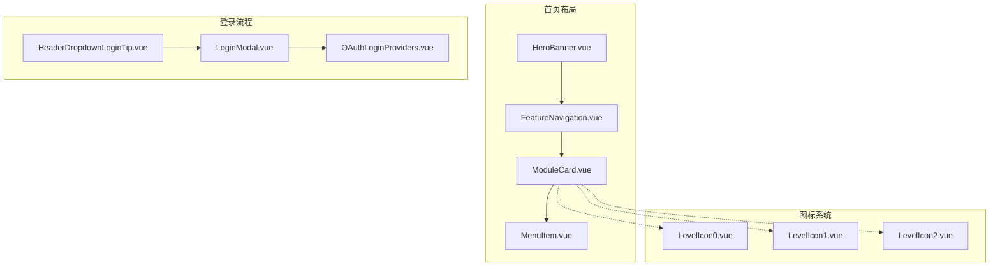
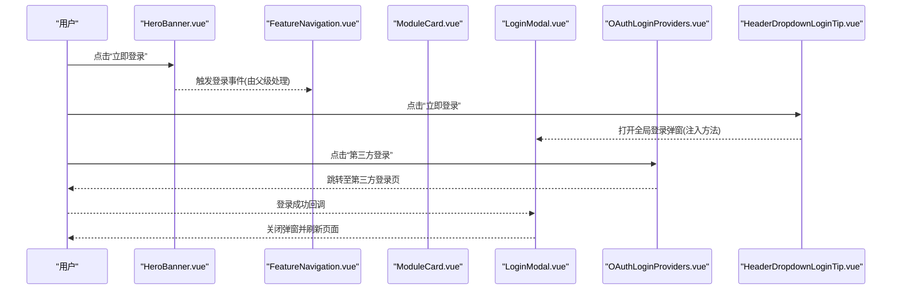
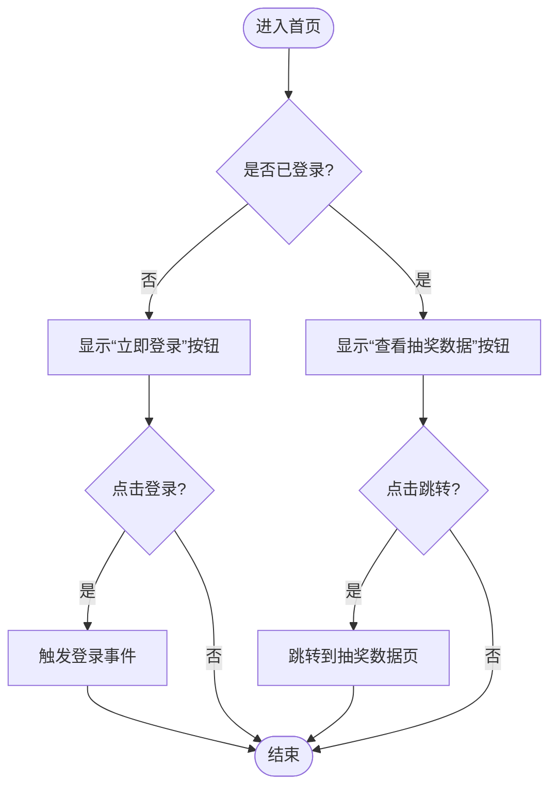
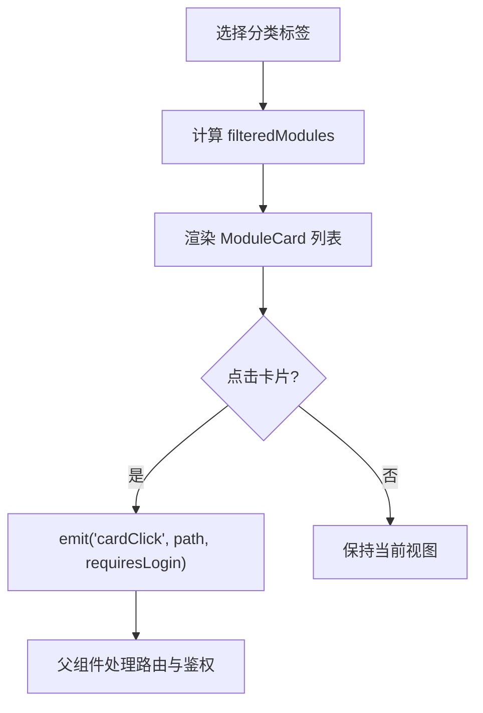
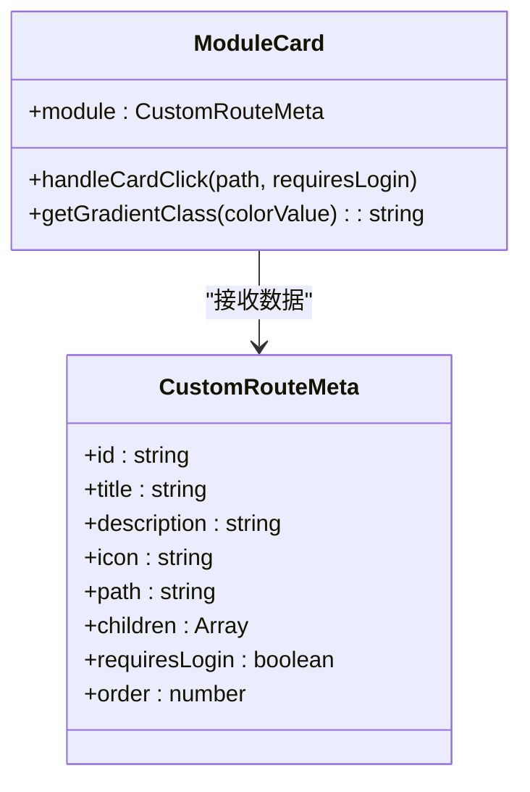
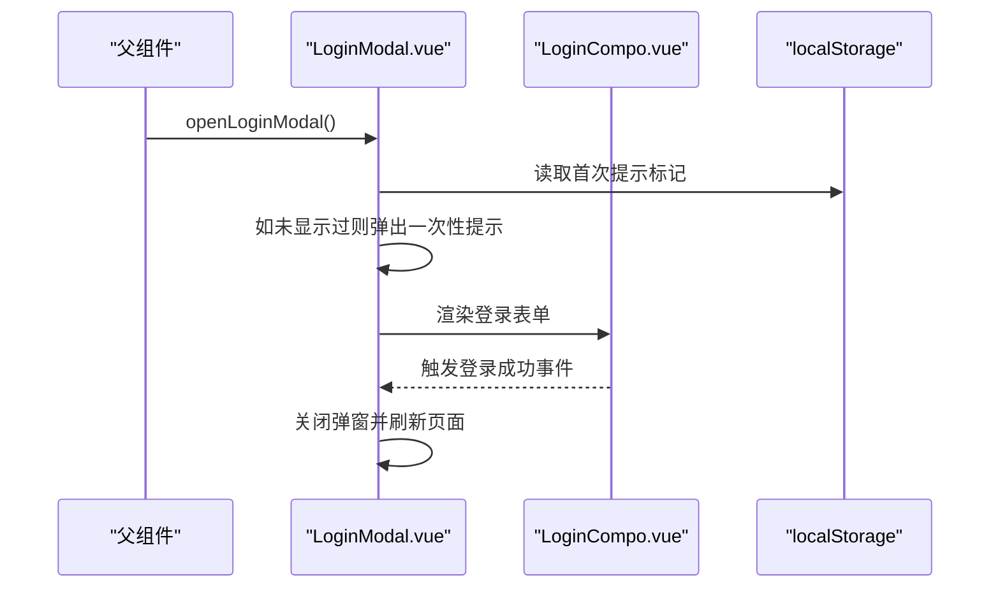
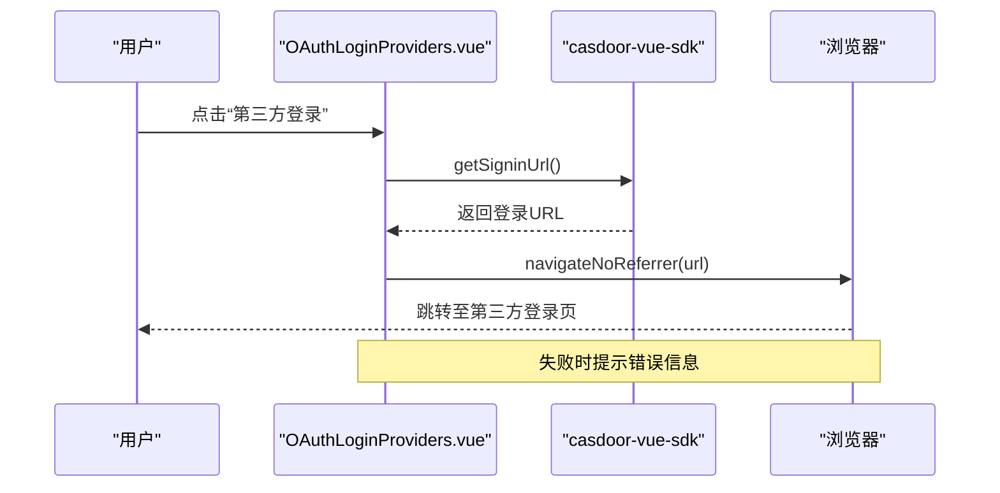
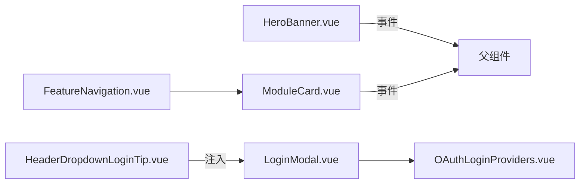

# 布局组件

<cite>
**本文引用的文件**
- [HeroBanner.vue](file://Vue3FrontEndDemoExercise/src/components/home/HeroBanner.vue)
- [FeatureNavigation.vue](file://Vue3FrontEndDemoExercise/src/components/home/FeatureNavigation.vue)
- [ModuleCard.vue](file://Vue3FrontEndDemoExercise/src/components/home/ModuleCard.vue)
- [LoginModal.vue](file://Vue3FrontEndDemoExercise/src/components/login_page/compo/LoginModal.vue)
- [OAuthLoginProviders.vue](file://Vue3FrontEndDemoExercise/src/components/login_page/compo/OAuthLoginProviders.vue)
- [HeaderDropdownLoginTip.vue](file://Vue3FrontEndDemoExercise/src/components/login_page/compo/HeaderDropdownLoginTip.vue)
- [LevelIcon0.vue](file://Vue3FrontEndDemoExercise/src/components/icons/LevelIcon0.vue)
- [LevelIcon1.vue](file://Vue3FrontEndDemoExercise/src/components/icons/LevelIcon1.vue)
- [LevelIcon2.vue](file://Vue3FrontEndDemoExercise/src/components/icons/LevelIcon2.vue)
- [MenuItem.vue](file://Vue3FrontEndDemoExercise/src/components/home/MenuItem.vue)
</cite>

## 目录
1. [简介](#简介)
2. [项目结构](#项目结构)
3. [核心组件](#核心组件)
4. [架构总览](#架构总览)
5. [详细组件分析](#详细组件分析)
6. [依赖关系分析](#依赖关系分析)
7. [性能与响应式最佳实践](#性能与响应式最佳实践)
8. [故障排查指南](#故障排查指南)
9. [结论](#结论)
10. [附录](#附录)

## 简介
本设计指南聚焦于前端 Vue3 项目的布局与认证相关组件，覆盖首页布局（英雄横幅、功能导航、模块卡片）、登录流程（模态框状态管理、第三方 OAuth 集成、下拉登录提示）以及图标系统（等级图标视觉层次与语义化使用）。同时提供响应式布局的最佳实践与组件组合复用技巧，帮助团队在一致的设计语言下高效构建可维护的界面。

## 项目结构
本项目的前端采用按功能域组织组件的方式：
- 首页布局组件位于 home 目录，包含 HeroBanner、FeatureNavigation、ModuleCard、MenuItem 等。
- 登录相关组件位于 login_page/compo 目录，包含 LoginModal、OAuthLoginProviders、HeaderDropdownLoginTip 等。
- 图标组件位于 icons 目录，包含 LevelIcon0-6 等级图标及若干功能性图标。

图表来源
- [HeroBanner.vue:1-49](file://Vue3FrontEndDemoExercise/src/components/home/HeroBanner.vue#L1-L49)
- [FeatureNavigation.vue:1-66](file://Vue3FrontEndDemoExercise/src/components/home/FeatureNavigation.vue#L1-L66)
- [ModuleCard.vue:1-107](file://Vue3FrontEndDemoExercise/src/components/home/ModuleCard.vue#L1-L107)
- [LoginModal.vue:1-78](file://Vue3FrontEndDemoExercise/src/components/login_page/compo/LoginModal.vue#L1-L78)
- [OAuthLoginProviders.vue:1-51](file://Vue3FrontEndDemoExercise/src/components/login_page/compo/OAuthLoginProviders.vue#L1-L51)
- [HeaderDropdownLoginTip.vue:1-48](file://Vue3FrontEndDemoExercise/src/components/login_page/compo/HeaderDropdownLoginTip.vue#L1-L48)
- [LevelIcon0.vue:1-7](file://Vue3FrontEndDemoExercise/src/components/icons/LevelIcon0.vue#L1-L7)
- [LevelIcon1.vue:1-7](file://Vue3FrontEndDemoExercise/src/components/icons/LevelIcon1.vue#L1-L7)
- [LevelIcon2.vue:1-7](file://Vue3FrontEndDemoExercise/src/components/icons/LevelIcon2.vue#L1-L7)

章节来源
- [HeroBanner.vue:1-49](file://Vue3FrontEndDemoExercise/src/components/home/HeroBanner.vue#L1-L49)
- [FeatureNavigation.vue:1-66](file://Vue3FrontEndDemoExercise/src/components/home/FeatureNavigation.vue#L1-L66)
- [ModuleCard.vue:1-107](file://Vue3FrontEndDemoExercise/src/components/home/ModuleCard.vue#L1-L107)
- [LoginModal.vue:1-78](file://Vue3FrontEndDemoExercise/src/components/login_page/compo/LoginModal.vue#L1-L78)
- [OAuthLoginProviders.vue:1-51](file://Vue3FrontEndDemoExercise/src/components/login_page/compo/OAuthLoginProviders.vue#L1-L51)
- [HeaderDropdownLoginTip.vue:1-48](file://Vue3FrontEndDemoExercise/src/components/login_page/compo/HeaderDropdownLoginTip.vue#L1-L48)
- [LevelIcon0.vue:1-7](file://Vue3FrontEndDemoExercise/src/components/icons/LevelIcon0.vue#L1-L7)
- [LevelIcon1.vue:1-7](file://Vue3FrontEndDemoExercise/src/components/icons/LevelIcon1.vue#L1-L7)
- [LevelIcon2.vue:1-7](file://Vue3FrontEndDemoExercise/src/components/icons/LevelIcon2.vue#L1-L7)

## 核心组件
- 英雄横幅（HeroBanner）：负责展示品牌信息与主行动按钮；根据登录状态切换“立即登录”或“查看抽奖数据”；通过事件向父级触发登录入口。
- 功能导航（FeatureNavigation）：提供分类筛选（全部/抽奖数据/浏览器管理/山姆会员商店），渲染模块卡片列表，并处理卡片点击事件以进行路由跳转与鉴权判断。
- 模块卡片（ModuleCard）：统一展示模块标题、描述、子项列表或直接访问按钮；支持颜色渐变映射与悬停动效；将点击事件上抛给父级。
- 菜单项（MenuItem）：递归渲染多级菜单；桌面端单击跳转，移动端对子菜单标题采用双击跳转以避免误触；统一封装路由跳转逻辑。

章节来源
- [HeroBanner.vue:1-49](file://Vue3FrontEndDemoExercise/src/components/home/HeroBanner.vue#L1-L49)
- [FeatureNavigation.vue:1-66](file://Vue3FrontEndDemoExercise/src/components/home/FeatureNavigation.vue#L1-L66)
- [ModuleCard.vue:1-107](file://Vue3FrontEndDemoExercise/src/components/home/ModuleCard.vue#L1-L107)
- [MenuItem.vue:1-99](file://Vue3FrontEndDemoExercise/src/components/home/MenuItem.vue#L1-L99)

## 架构总览
首页布局由 HeroBanner 作为首屏引导，FeatureNavigation 承载功能入口与筛选，ModuleCard 作为内容单元，MenuItem 用于多级导航。登录流程通过全局事件与注入方式联动：HeaderDropdownLoginTip 触发全局登录弹窗，LoginModal 管理弹窗状态并内嵌登录表单，OAuthLoginProviders 集成第三方登录 SDK。

图表来源
- [HeroBanner.vue:1-49](file://Vue3FrontEndDemoExercise/src/components/home/HeroBanner.vue#L1-L49)
- [FeatureNavigation.vue:1-66](file://Vue3FrontEndDemoExercise/src/components/home/FeatureNavigation.vue#L1-L66)
- [ModuleCard.vue:1-107](file://Vue3FrontEndDemoExercise/src/components/home/ModuleCard.vue#L1-L107)
- [LoginModal.vue:1-78](file://Vue3FrontEndDemoExercise/src/components/login_page/compo/LoginModal.vue#L1-L78)
- [OAuthLoginProviders.vue:1-51](file://Vue3FrontEndDemoExercise/src/components/login_page/compo/OAuthLoginProviders.vue#L1-L51)
- [HeaderDropdownLoginTip.vue:1-48](file://Vue3FrontEndDemoExercise/src/components/login_page/compo/HeaderDropdownLoginTip.vue#L1-L48)

## 详细组件分析

### 英雄横幅（HeroBanner）
- 视觉效果：使用渐变背景与居中对齐排版，标题与副标题突出品牌信息；按钮根据登录状态动态切换。
- 交互设计：未登录时显示“立即登录”，已登录时显示“查看抽奖数据”并直接跳转；点击登录按钮通过事件向父级通知，便于上层统一处理登录入口。
- 可访问性：按钮具备明确文案与图标，适配移动端换行与间距调整。

图表来源
- [HeroBanner.vue:1-49](file://Vue3FrontEndDemoExercise/src/components/home/HeroBanner.vue#L1-L49)

章节来源
- [HeroBanner.vue:1-49](file://Vue3FrontEndDemoExercise/src/components/home/HeroBanner.vue#L1-L49)

### 功能导航（FeatureNavigation）
- 交互设计：顶部提供分类单选组（全部/抽奖数据/浏览器管理/山姆会员商店），通过 v-model 双向绑定当前激活标签；下方网格渲染 ModuleCard 列表。
- 数据处理：基于 activeTab 计算 filteredModules，实现按类别过滤；卡片点击事件携带目标路径与是否需要登录标志，交由父级统一处理路由与鉴权。
- 响应式：移动端单列布局，桌面端多列自适应。

图表来源
- [FeatureNavigation.vue:1-66](file://Vue3FrontEndDemoExercise/src/components/home/FeatureNavigation.vue#L1-L66)

章节来源
- [FeatureNavigation.vue:1-66](file://Vue3FrontEndDemoExercise/src/components/home/FeatureNavigation.vue#L1-L66)

### 模块卡片（ModuleCard）
- 展示逻辑：头部区域显示图标与标题，支持主题渐变映射；主体区域显示描述，若存在子项则渲染子项列表，否则显示“立即访问”按钮。
- 交互细节：子项点击携带父模块的 requiresLogin 标志；悬停时轻微位移与边框高亮提升可点击性。
- 样式策略：通过 CSS 变量到 Tailwind class 的映射表，集中管理渐变主题，便于扩展与维护。

图表来源
- [ModuleCard.vue:1-107](file://Vue3FrontEndDemoExercise/src/components/home/ModuleCard.vue#L1-L107)

章节来源
- [ModuleCard.vue:1-107](file://Vue3FrontEndDemoExercise/src/components/home/ModuleCard.vue#L1-L107)

### 登录模态框（LoginModal）
- 状态管理：使用本地 ref 控制弹窗显隐；首次打开时检查 localStorage 标记并给出一次性提示；暴露 openLoginModal 供外部调用。
- 事件监听：监听全局事件 needLogin 自动打开弹窗；登录成功后关闭弹窗并刷新页面。
- 组合模式：内部嵌入 LoginCompo 完成具体登录逻辑，Footer 提供关闭操作。

图表来源
- [LoginModal.vue:1-78](file://Vue3FrontEndDemoExercise/src/components/login_page/compo/LoginModal.vue#L1-L78)

章节来源
- [LoginModal.vue:1-78](file://Vue3FrontEndDemoExercise/src/components/login_page/compo/LoginModal.vue#L1-L78)

### 第三方登录（OAuthLoginProviders）
- 集成方式：使用 casdoor-vue-sdk 提供的 useCasdoor 获取登录 URL，并通过 navigateNoReferrer 安全跳转；加载状态通过 loading 控制按钮反馈。
- 错误处理：捕获异常并通过消息组件提示失败原因，确保用户体验。

图表来源
- [OAuthLoginProviders.vue:1-51](file://Vue3FrontEndDemoExercise/src/components/login_page/compo/OAuthLoginProviders.vue#L1-L51)

章节来源
- [OAuthLoginProviders.vue:1-51](file://Vue3FrontEndDemoExercise/src/components/login_page/compo/OAuthLoginProviders.vue#L1-L51)

### 登录提示下拉菜单（HeaderDropdownLoginTip）
- 交互设计：展示登录后权益与注册引导；通过注入的全局方法打开登录弹窗，避免组件间紧耦合。
- 资源组织：使用 SVG 组件化资源，配合 Element Plus 图标容器统一风格。

章节来源
- [HeaderDropdownLoginTip.vue:1-48](file://Vue3FrontEndDemoExercise/src/components/login_page/compo/HeaderDropdownLoginTip.vue#L1-L48)

### 菜单项（MenuItem）
- 交互设计：递归渲染多级菜单；桌面端单击即跳转；移动端对子菜单标题采用双击跳转，避免展开后误触；顶层叶子项与子菜单首项在移动端需区分行为。
- 路由跳转：封装统一 navigate 函数，忽略重复导航与取消错误，提升健壮性。

章节来源
- [MenuItem.vue:1-99](file://Vue3FrontEndDemoExercise/src/components/home/MenuItem.vue#L1-L99)

### 图标系统（LevelIcon0-6）
- 视觉层次：等级图标以统一的尺寸与比例呈现，不同等级通过填充色差异体现层级（例如白底+灰/绿/金等），形成清晰的等级识别。
- 语义化使用：建议将等级图标用于用户等级、权限等级或进度标识；结合文本与色彩对比保证可读性；在暗色模式下注意对比度与可访问性。
- 扩展规范：新增等级图标应遵循相同 viewBox 与尺寸约定，保持对齐与一致性；命名遵循 LevelIconN 序列。

章节来源
- [LevelIcon0.vue:1-7](file://Vue3FrontEndDemoExercise/src/components/icons/LevelIcon0.vue#L1-L7)
- [LevelIcon1.vue:1-7](file://Vue3FrontEndDemoExercise/src/components/icons/LevelIcon1.vue#L1-L7)
- [LevelIcon2.vue:1-7](file://Vue3FrontEndDemoExercise/src/components/icons/LevelIcon2.vue#L1-L7)

## 依赖关系分析
- 组件耦合：
  - FeatureNavigation 依赖 ModuleCard 进行内容渲染，并通过事件解耦路由与鉴权逻辑。
  - HeroBanner 通过事件与父级通信，不直接持有登录状态，降低耦合。
  - LoginModal 与 OAuthLoginProviders 通过 SDK 与全局事件协作，职责清晰。
- 外部依赖：
  - Element Plus 提供 UI 基础组件（按钮、卡片、对话框、菜单等）。
  - casdoor-vue-sdk 提供第三方登录能力。
  - vue-router 用于页面跳转。
- 潜在循环依赖：当前组件间为单向依赖，未发现循环引用风险。

图表来源
- [HeroBanner.vue:1-49](file://Vue3FrontEndDemoExercise/src/components/home/HeroBanner.vue#L1-L49)
- [FeatureNavigation.vue:1-66](file://Vue3FrontEndDemoExercise/src/components/home/FeatureNavigation.vue#L1-L66)
- [ModuleCard.vue:1-107](file://Vue3FrontEndDemoExercise/src/components/home/ModuleCard.vue#L1-L107)
- [LoginModal.vue:1-78](file://Vue3FrontEndDemoExercise/src/components/login_page/compo/LoginModal.vue#L1-L78)
- [OAuthLoginProviders.vue:1-51](file://Vue3FrontEndDemoExercise/src/components/login_page/compo/OAuthLoginProviders.vue#L1-L51)
- [HeaderDropdownLoginTip.vue:1-48](file://Vue3FrontEndDemoExercise/src/components/login_page/compo/HeaderDropdownLoginTip.vue#L1-L48)

## 性能与响应式最佳实践
- 移动端适配
  - 使用弹性布局与栅格系统，确保在小屏幕下单列展示，在大屏幕下多列自适应。
  - 对子菜单标题在移动端采用双击跳转，避免误触；顶层叶子项与首项行为差异化处理。
  - 图片与 SVG 资源按需加载，减少首屏体积。
- 断点处理
  - 利用 Tailwind 的响应式前缀在不同断点切换布局与字号；保持关键交互元素在移动端易于点击。
  - 针对表格、卡片等密集信息区域，在小屏下隐藏次要信息，保留核心内容。
- 性能优化
  - 列表渲染使用 key 稳定标识，避免不必要的重渲染。
  - 复杂计算（如过滤模块）使用 computed 缓存结果。
  - 第三方登录跳转使用无 referer 策略，保护隐私并减少不必要的数据传输。
  - 对渐变与阴影等视觉特效，合理使用 transition 与 transform，避免触发重排重绘。

[本节为通用指导，无需特定文件来源]

## 故障排查指南
- 登录弹窗无法打开
  - 检查全局事件 needLogin 是否正确触发；确认注入的全局登录方法可用。
  - 验证 localStorage 中首次提示标记是否影响弹窗逻辑。
- 第三方登录失败
  - 检查 SDK 配置与网络环境；捕获并提示错误信息。
  - 确认 navigateNoReferrer 是否被拦截或限制。
- 卡片点击无效
  - 确认父组件是否正确监听 cardClick 事件并处理路由与鉴权。
  - 检查 requiresLogin 标志与路由守卫是否匹配。
- 菜单跳转异常
  - 忽略重复导航与取消错误；检查路由是否存在与权限校验。

章节来源
- [LoginModal.vue:1-78](file://Vue3FrontEndDemoExercise/src/components/login_page/compo/LoginModal.vue#L1-L78)
- [OAuthLoginProviders.vue:1-51](file://Vue3FrontEndDemoExercise/src/components/login_page/compo/OAuthLoginProviders.vue#L1-L51)
- [FeatureNavigation.vue:1-66](file://Vue3FrontEndDemoExercise/src/components/home/FeatureNavigation.vue#L1-L66)
- [ModuleCard.vue:1-107](file://Vue3FrontEndDemoExercise/src/components/home/ModuleCard.vue#L1-L107)
- [MenuItem.vue:1-99](file://Vue3FrontEndDemoExercise/src/components/home/MenuItem.vue#L1-L99)

## 结论
本指南围绕首页布局、登录流程与图标系统，提供了组件职责划分、交互设计与响应式策略的系统化说明。通过事件驱动与注入机制，实现了松耦合与高复用；借助主题映射与统一图标规范，保证了视觉一致性与可扩展性。建议在后续迭代中持续完善路由守卫与权限体系，并引入更丰富的无障碍特性以提升整体体验。

[本节为总结性内容，无需特定文件来源]

## 附录
- 组件组合模式
  - 父组件聚合多个布局组件（HeroBanner、FeatureNavigation），并通过事件总线或 props/emits 协调交互。
  - 登录流程通过全局事件与注入方法解耦，便于在多入口复用。
- 布局复用技巧
  - 使用统一的卡片与渐变主题，减少重复样式。
  - 通过 computed 与条件渲染实现灵活的模块展示。
  - 在菜单与导航中抽象公共跳转逻辑，统一错误处理与日志记录。

[本节为补充说明，无需特定文件来源]