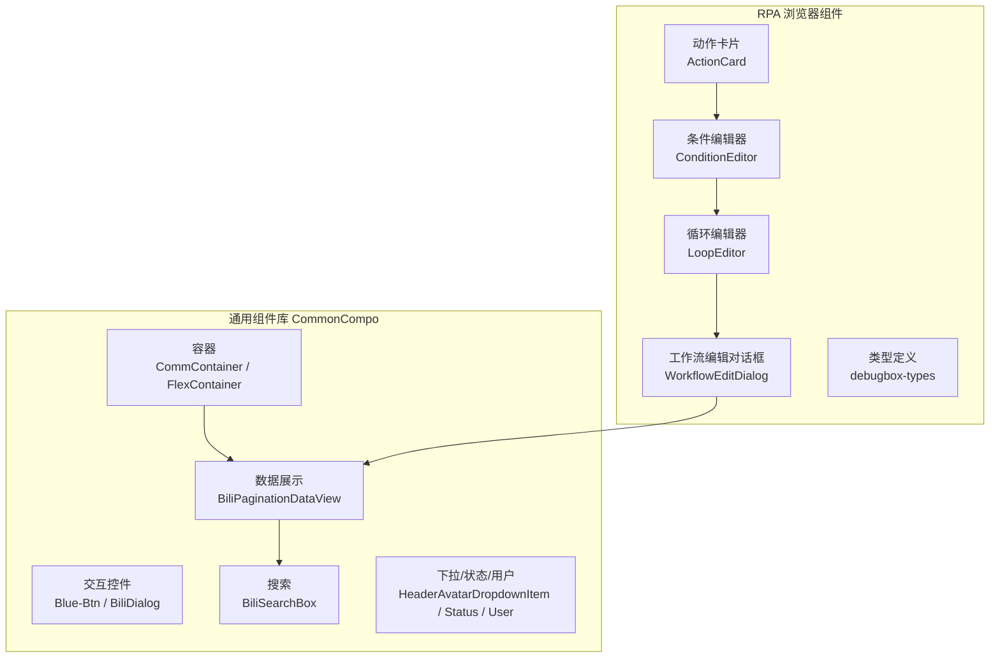
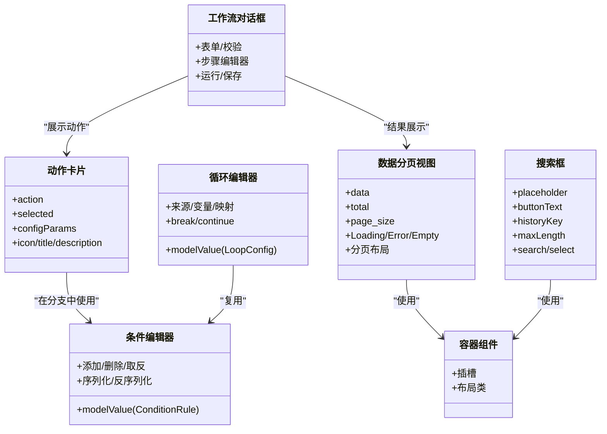
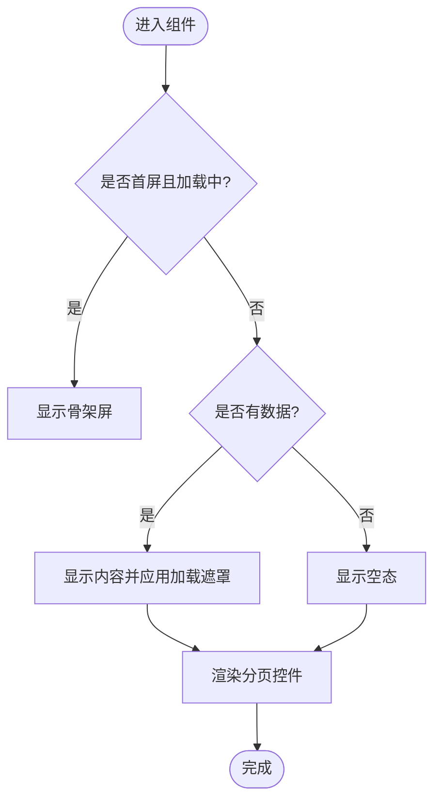
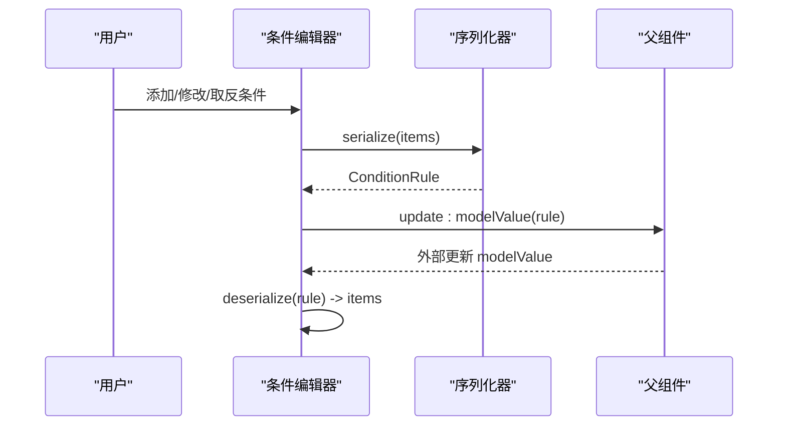
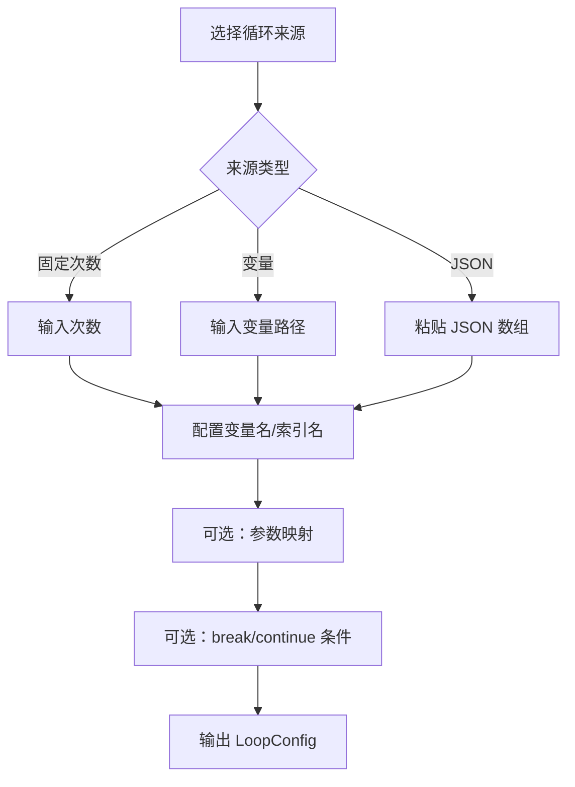
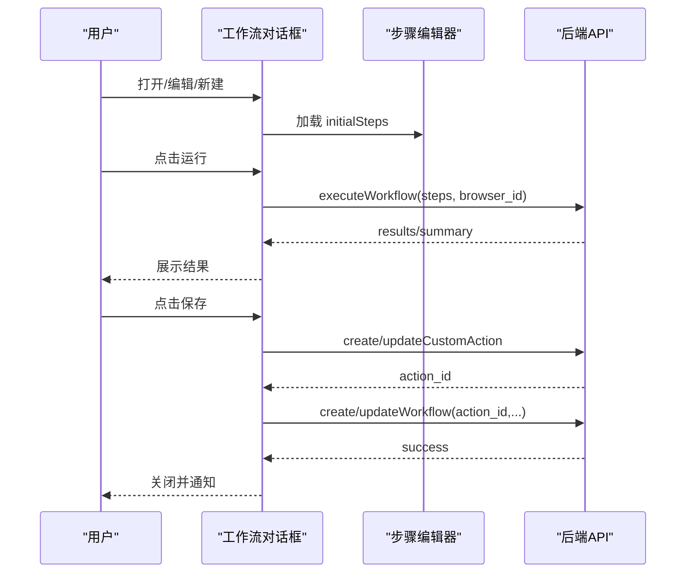
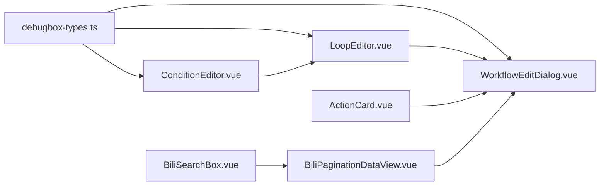

# 组件系统

<cite>
**本文引用的文件**
- [package.json](file://Vue3FrontEndDemoExercise/package.json)
- [CommContainer.vue](file://Vue3FrontEndDemoExercise/src/components/CommonCompo/Bili-Container-Compo/CommContainer.vue)
- [FlexContainer.vue](file://Vue3FrontEndDemoExercise/src/components/CommonCompo/Bili-Container-Compo/FlexContainer.vue)
- [BiliPaginationDataView.vue](file://Vue3FrontEndDemoExercise/src/components/CommonCompo/Bili-DataTable-Compo/BiliPaginationDataView.vue)
- [HeaderAvatarDropdownItem.vue](file://Vue3FrontEndDemoExercise/src/components/CommonCompo/Bili-DropDown-Compo/HeaderAvatarDropdownItem.vue)
- [BiliSearchBox.vue](file://Vue3FrontEndDemoExercise/src/components/CommonCompo/Bili-Search-Compo/BiliSearchBox.vue)
- [Blue-Btn.vue](file://Vue3FrontEndDemoExercise/src/components/CommonCompo/Bili-Interact-Compo/Blue-Btn.vue)
- [BiliDialog.vue](file://Vue3FrontEndDemoExercise/src/components/CommonCompo/Bili-Feedback-Compo/BiliDialog.vue)
- [ActionCard.vue](file://Vue3FrontEndDemoExercise/src/components/rpa-browser/ActionCard.vue)
- [ConditionEditor.vue](file://Vue3FrontEndDemoExercise/src/components/rpa-browser/ConditionEditor.vue)
- [LoopEditor.vue](file://Vue3FrontEndDemoExercise/src/components/rpa-browser/LoopEditor.vue)
- [WorkflowEditDialog.vue](file://Vue3FrontEndDemoExercise/src/components/rpa-browser/WorkflowEditDialog.vue)
- [debugbox-types.ts](file://Vue3FrontEndDemoExercise/src/components/rpa-browser/debugbox-types.ts)
</cite>

## 目录
1. [简介](#简介)
2. [项目结构](#项目结构)
3. [核心组件](#核心组件)
4. [架构总览](#架构总览)
5. [详细组件分析](#详细组件分析)
6. [依赖关系分析](#依赖关系分析)
7. [性能考虑](#性能考虑)
8. [故障排查指南](#故障排查指南)
9. [结论](#结论)
10. [附录](#附录)

## 简介
本指南面向前端开发者，系统化阐述本项目的组件分层架构与开发规范，覆盖基础组件、业务组件与页面组件的设计原则；重点解析通用组件库 CommonCompo（容器、数据表格、下拉菜单、搜索框等）以及 RPA 浏览器相关复杂交互组件（动作卡片、条件编辑器、循环编辑器、工作流编辑器等）。文档同时提供命名约定、Props 设计、事件处理、样式组织、测试策略与性能优化建议，帮助构建高质量可复用组件。

## 项目结构
前端采用 Vue3 + TypeScript 技术栈，组件按领域与职责划分：
- CommonCompo：通用 UI 能力（容器、反馈、交互、搜索、状态、用户头像、分页数据视图等）
- rpa-browser：RPA 工作流可视化编辑与执行相关组件（动作卡片、条件/循环编辑器、调试面板、工作流对话框等）
- 其他业务组件：消息、动态、抽奖数据等

图表来源
- [CommContainer.vue:1-7](file://Vue3FrontEndDemoExercise/src/components/CommonCompo/Bili-Container-Compo/CommContainer.vue#L1-L7)
- [FlexContainer.vue:1-7](file://Vue3FrontEndDemoExercise/src/components/CommonCompo/Bili-Container-Compo/FlexContainer.vue#L1-L7)
- [BiliPaginationDataView.vue:1-151](file://Vue3FrontEndDemoExercise/src/components/CommonCompo/Bili-DataTable-Compo/BiliPaginationDataView.vue#L1-L151)
- [BiliSearchBox.vue:1-51](file://Vue3FrontEndDemoExercise/src/components/CommonCompo/Bili-Search-Compo/BiliSearchBox.vue#L1-L51)
- [ActionCard.vue:1-196](file://Vue3FrontEndDemoExercise/src/components/rpa-browser/ActionCard.vue#L1-L196)
- [ConditionEditor.vue:1-450](file://Vue3FrontEndDemoExercise/src/components/rpa-browser/ConditionEditor.vue#L1-L450)
- [LoopEditor.vue:1-367](file://Vue3FrontEndDemoExercise/src/components/rpa-browser/LoopEditor.vue#L1-L367)
- [WorkflowEditDialog.vue:1-568](file://Vue3FrontEndDemoExercise/src/components/rpa-browser/WorkflowEditDialog.vue#L1-L568)
- [debugbox-types.ts:1-164](file://Vue3FrontEndDemoExercise/src/components/rpa-browser/debugbox-types.ts#L1-L164)

章节来源
- [package.json:1-95](file://Vue3FrontEndDemoExercise/package.json#L1-L95)

## 核心组件
- 容器组件：提供统一布局与响应式行为，便于组合内容区域与工具栏
- 数据表格/分页视图：封装首屏骨架、加载态、错误态、空态与分页控制，保持滚动位置稳定
- 搜索框：统一搜索历史、最大长度、按钮文案与扩展插槽
- 交互与反馈：按钮、对话框、空态、错误提示等
- RPA 动作卡片：根据 action_id 映射图标、标题与描述，支持自定义名称/描述与元信息标签
- 条件编辑器：将扁平 UI 列表序列化为后端 ConditionRule，支持 AND/OR 分组与 NOT 取反
- 循环编辑器：配置循环来源、变量名、参数映射与 break/continue 条件
- 工作流编辑对话框：聚合表单、步骤编辑器、运行与保存流程，对接后端 API

章节来源
- [CommContainer.vue:1-7](file://Vue3FrontEndDemoExercise/src/components/CommonCompo/Bili-Container-Compo/CommContainer.vue#L1-L7)
- [FlexContainer.vue:1-7](file://Vue3FrontEndDemoExercise/src/components/CommonCompo/Bili-Container-Compo/FlexContainer.vue#L1-L7)
- [BiliPaginationDataView.vue:1-151](file://Vue3FrontEndDemoExercise/src/components/CommonCompo/Bili-DataTable-Compo/BiliPaginationDataView.vue#L1-L151)
- [BiliSearchBox.vue:1-51](file://Vue3FrontEndDemoExercise/src/components/CommonCompo/Bili-Search-Compo/BiliSearchBox.vue#L1-L51)
- [Blue-Btn.vue:1-22](file://Vue3FrontEndDemoExercise/src/components/CommonCompo/Bili-Interact-Compo/Blue-Btn.vue#L1-L22)
- [BiliDialog.vue:1-31](file://Vue3FrontEndDemoExercise/src/components/CommonCompo/Bili-Feedback-Compo/BiliDialog.vue#L1-L31)
- [ActionCard.vue:1-196](file://Vue3FrontEndDemoExercise/src/components/rpa-browser/ActionCard.vue#L1-L196)
- [ConditionEditor.vue:1-450](file://Vue3FrontEndDemoExercise/src/components/rpa-browser/ConditionEditor.vue#L1-L450)
- [LoopEditor.vue:1-367](file://Vue3FrontEndDemoExercise/src/components/rpa-browser/LoopEditor.vue#L1-L367)
- [WorkflowEditDialog.vue:1-568](file://Vue3FrontEndDemoExercise/src/components/rpa-browser/WorkflowEditDialog.vue#L1-L568)

## 架构总览
组件分层遵循“基础 → 业务 → 页面”的分层思想：
- 基础层：容器、反馈、交互、搜索等通用能力
- 业务层：数据表格、排行榜、用户信息等跨页面复用组件
- 页面/场景层：RPA 工作流编辑、消息、动态等业务页面组件

图表来源
- [BiliPaginationDataView.vue:1-151](file://Vue3FrontEndDemoExercise/src/components/CommonCompo/Bili-DataTable-Compo/BiliPaginationDataView.vue#L1-L151)
- [BiliSearchBox.vue:1-51](file://Vue3FrontEndDemoExercise/src/components/CommonCompo/Bili-Search-Compo/BiliSearchBox.vue#L1-L51)
- [ActionCard.vue:1-196](file://Vue3FrontEndDemoExercise/src/components/rpa-browser/ActionCard.vue#L1-L196)
- [ConditionEditor.vue:1-450](file://Vue3FrontEndDemoExercise/src/components/rpa-browser/ConditionEditor.vue#L1-L450)
- [LoopEditor.vue:1-367](file://Vue3FrontEndDemoExercise/src/components/rpa-browser/LoopEditor.vue#L1-L367)
- [WorkflowEditDialog.vue:1-568](file://Vue3FrontEndDemoExercise/src/components/rpa-browser/WorkflowEditDialog.vue#L1-L568)

## 详细组件分析

### 通用容器组件
- CommContainer：提供全高、弹性布局的容器，适合承载页面主体内容
- FlexContainer：基于 Flex 的容器，默认纵向布局，作为数据视图与表单的基础容器

最佳实践
- 通过插槽注入内容，避免在容器内硬编码布局
- 结合 Tailwind 语义化类名，保证主题一致性与可维护性

章节来源
- [CommContainer.vue:1-7](file://Vue3FrontEndDemoExercise/src/components/CommonCompo/Bili-Container-Compo/CommContainer.vue#L1-L7)
- [FlexContainer.vue:1-7](file://Vue3FrontEndDemoExercise/src/components/CommonCompo/Bili-Container-Compo/FlexContainer.vue#L1-L7)

### 数据分页视图（BiliPaginationDataView）
功能要点
- 首屏骨架：首次无数据时显示骨架屏，切换分页不销毁表格，保留横向滚动位置
- 加载态：已有数据时使用遮罩加载，避免重渲染抖动
- 错误态：自动清空数据（可配置），并提供重试入口
- 空态：无数据且非错误/非加载时显示空态
- 分页布局：根据屏幕尺寸动态调整布局

关键 Props/Emits
- Props：data、total、page_size、autoHandleError
- v-model：EmptyMsg、ErrorMsg、CurrentPage、Loading、Error
- Emits：onMounted、retryOnError、update:data、update:total

图表来源
- [BiliPaginationDataView.vue:1-151](file://Vue3FrontEndDemoExercise/src/components/CommonCompo/Bili-DataTable-Compo/BiliPaginationDataView.vue#L1-L151)

章节来源
- [BiliPaginationDataView.vue:1-151](file://Vue3FrontEndDemoExercise/src/components/CommonCompo/Bili-DataTable-Compo/BiliPaginationDataView.vue#L1-L151)

### 搜索框（BiliSearchBox）
- 封装 UniversalSearchBox，暴露 search/select 事件
- 支持搜索历史、最大长度、按钮文案、占位符等配置
- 通过 ref 暴露 loadHistory/clearHistory 方法

使用建议
- 父组件监听 search/select 事件，实现查询或选择逻辑
- 合理设置 historyKey 以隔离不同页面的历史记录

章节来源
- [BiliSearchBox.vue:1-51](file://Vue3FrontEndDemoExercise/src/components/CommonCompo/Bili-Search-Compo/BiliSearchBox.vue#L1-L51)

### 下拉菜单项（HeaderAvatarDropdownItem）
- 轻量级插槽容器，用于头部下拉菜单中的条目

章节来源
- [HeaderAvatarDropdownItem.vue:1-7](file://Vue3FrontEndDemoExercise/src/components/CommonCompo/Bili-DropDown-Compo/HeaderAvatarDropdownItem.vue#L1-L7)

### 交互与反馈（Blue-Btn / BiliDialog）
- Blue-Btn：带过渡动画的按钮，支持激活态与显隐控制
- BiliDialog：基于 Element Plus 的对话框，封装成功态内容与确定操作

章节来源
- [Blue-Btn.vue:1-22](file://Vue3FrontEndDemoExercise/src/components/CommonCompo/Bili-Interact-Compo/Blue-Btn.vue#L1-L22)
- [BiliDialog.vue:1-31](file://Vue3FrontEndDemoExercise/src/components/CommonCompo/Bili-Feedback-Compo/BiliDialog.vue#L1-L31)

### RPA 动作卡片（ActionCard）
- 根据 action_id 映射图标、标题与描述，优先使用自定义 name/description
- 支持 action_detail 元信息（公开、已验证、点赞数等）与插件配置参数展示

使用建议
- 传入标准化 action 对象，确保 action_id 与 json_schema 完整
- 对长描述使用截断，避免布局溢出

章节来源
- [ActionCard.vue:1-196](file://Vue3FrontEndDemoExercise/src/components/rpa-browser/ActionCard.vue#L1-L196)

### 条件编辑器（ConditionEditor）
- 将 UI 列表序列化为后端 ConditionRule，支持 AND/OR 分组与 NOT 取反
- 提供预览文本，便于用户理解最终规则
- 双向绑定 modelValue，内部更新时避免重复反序列化

图表来源
- [ConditionEditor.vue:1-450](file://Vue3FrontEndDemoExercise/src/components/rpa-browser/ConditionEditor.vue#L1-L450)
- [debugbox-types.ts:1-164](file://Vue3FrontEndDemoExercise/src/components/rpa-browser/debugbox-types.ts#L1-L164)

章节来源
- [ConditionEditor.vue:1-450](file://Vue3FrontEndDemoExercise/src/components/rpa-browser/ConditionEditor.vue#L1-L450)
- [debugbox-types.ts:1-164](file://Vue3FrontEndDemoExercise/src/components/rpa-browser/debugbox-types.ts#L1-L164)

### 循环编辑器（LoopEditor）
- 支持固定次数、变量引用、JSON 列表三种来源
- 提供 break/continue 条件（复用 ConditionEditor）
- 参数映射：将循环项字段注入到子步骤参数中，提供实时预览

图表来源
- [LoopEditor.vue:1-367](file://Vue3FrontEndDemoExercise/src/components/rpa-browser/LoopEditor.vue#L1-L367)
- [debugbox-types.ts:1-164](file://Vue3FrontEndDemoExercise/src/components/rpa-browser/debugbox-types.ts#L1-L164)

章节来源
- [LoopEditor.vue:1-367](file://Vue3FrontEndDemoExercise/src/components/rpa-browser/LoopEditor.vue#L1-L367)
- [debugbox-types.ts:1-164](file://Vue3FrontEndDemoExercise/src/components/rpa-browser/debugbox-types.ts#L1-L164)

### 工作流编辑对话框（WorkflowEditDialog）
- 管理元信息（名称、描述、公开、启用、触发方式）
- 集成步骤编辑器（DebugBox），支持从后端加载 steps 并转换为前端 DroppedItem[]
- 运行工作流：调用执行引擎 API，展示步骤级结果与摘要
- 保存工作流：先保存/更新复合操作，再保存/更新工作流

图表来源
- [WorkflowEditDialog.vue:1-568](file://Vue3FrontEndDemoExercise/src/components/rpa-browser/WorkflowEditDialog.vue#L1-L568)

章节来源
- [WorkflowEditDialog.vue:1-568](file://Vue3FrontEndDemoExercise/src/components/rpa-browser/WorkflowEditDialog.vue#L1-L568)

## 依赖关系分析
- 组件间耦合度低：容器与数据视图解耦，搜索框独立封装
- RPA 组件复用性强：ConditionEditor 被 LoopEditor 复用；ActionCard 与 WorkflowEditDialog 协作
- 类型集中管理：debugbox-types.ts 统一前后端数据结构

图表来源
- [debugbox-types.ts:1-164](file://Vue3FrontEndDemoExercise/src/components/rpa-browser/debugbox-types.ts#L1-L164)
- [ConditionEditor.vue:1-450](file://Vue3FrontEndDemoExercise/src/components/rpa-browser/ConditionEditor.vue#L1-L450)
- [LoopEditor.vue:1-367](file://Vue3FrontEndDemoExercise/src/components/rpa-browser/LoopEditor.vue#L1-L367)
- [WorkflowEditDialog.vue:1-568](file://Vue3FrontEndDemoExercise/src/components/rpa-browser/WorkflowEditDialog.vue#L1-L568)
- [ActionCard.vue:1-196](file://Vue3FrontEndDemoExercise/src/components/rpa-browser/ActionCard.vue#L1-L196)
- [BiliPaginationDataView.vue:1-151](file://Vue3FrontEndDemoExercise/src/components/CommonCompo/Bili-DataTable-Compo/BiliPaginationDataView.vue#L1-L151)
- [BiliSearchBox.vue:1-51](file://Vue3FrontEndDemoExercise/src/components/CommonCompo/Bili-Search-Compo/BiliSearchBox.vue#L1-L51)

章节来源
- [debugbox-types.ts:1-164](file://Vue3FrontEndDemoExercise/src/components/rpa-browser/debugbox-types.ts#L1-L164)

## 性能考虑
- 列表与分页
  - 首屏骨架与加载遮罩分离，避免切换分页时销毁表格导致滚动丢失
  - 仅在必要时重新计算分页布局，减少重排
- 条件与循环编辑器
  - 使用 computed 缓存预览文本与映射结果
  - 批量更新模型值，避免频繁触发深层 watch
- 搜索框
  - 限制历史条数与输入长度，降低存储与渲染压力
- 工作流运行
  - 分步结果折叠展示，按需展开详情，减少 DOM 体积
- 通用
  - 合理使用插槽与局部注册，避免全局污染
  - 使用 Tailwind 原子类，减少 CSS 体积

[本节为通用指导，无需具体文件来源]

## 故障排查指南
- 数据分页视图
  - 错误态未清空数据：检查 autoHandleError 与 watch(error) 逻辑
  - 翻页后滚动位置异常：确认 nextTick 与 scrollIntoView 的使用时机
- 条件编辑器
  - 序列化结果不符合预期：核对 logic 分组与 negate 标记
  - 外部更新未生效：确认 isInternalUpdate 标志与 watch 的 immediate 选项
- 循环编辑器
  - JSON 列表无效：使用预览提示定位格式问题
  - 参数映射未生效：检查 sourcePath 与 targetParam 的对应关系
- 工作流对话框
  - 运行失败：查看 stepResults 中的 error 与 execution_time
  - 保存失败：区分“创建/更新复合操作”与“创建/更新工作流”两步的错误来源

章节来源
- [BiliPaginationDataView.vue:1-151](file://Vue3FrontEndDemoExercise/src/components/CommonCompo/Bili-DataTable-Compo/BiliPaginationDataView.vue#L1-L151)
- [ConditionEditor.vue:1-450](file://Vue3FrontEndDemoExercise/src/components/rpa-browser/ConditionEditor.vue#L1-L450)
- [LoopEditor.vue:1-367](file://Vue3FrontEndDemoExercise/src/components/rpa-browser/LoopEditor.vue#L1-L367)
- [WorkflowEditDialog.vue:1-568](file://Vue3FrontEndDemoExercise/src/components/rpa-browser/WorkflowEditDialog.vue#L1-L568)

## 结论
本项目组件体系清晰、职责明确：CommonCompo 提供稳定的基础能力，RPA 浏览器组件聚焦复杂交互与流程编排。通过统一的类型定义、良好的 Props/事件设计与合理的性能优化策略，能够高效支撑多业务场景的可复用组件建设。建议在后续迭代中继续完善单元测试与视觉回归测试，进一步提升组件质量与稳定性。

[本节为总结，无需具体文件来源]

## 附录

### 组件开发规范（建议）
- 命名约定
  - 组件文件：大驼峰命名（如 BiliPaginationDataView.vue）
  - 目录：按领域划分（CommonCompo、rpa-browser）
- Props 设计
  - 使用 defineProps 与 withDefaults，提供默认值与类型约束
  - 对外暴露最小必要接口，复杂状态通过 v-model 双向绑定
- 事件处理
  - 使用 defineEmits 明确事件签名，避免 any
  - 对异步操作进行错误捕获与用户提示
- 样式组织
  - 优先使用 Tailwind 原子类，保持风格一致
  - 复杂样式抽取为独立模块或使用 CSS 变量

[本节为通用规范，无需具体文件来源]

### 组件测试策略（建议）
- 单元测试
  - 针对条件编辑器：验证序列化/反序列化正确性
  - 针对循环编辑器：验证 JSON 列表解析与参数映射
- 集成测试
  - 工作流对话框：模拟运行与保存流程，断言 API 调用与状态变化
- 视觉回归
  - 对分页视图、动作卡片、编辑器界面进行截图对比

[本节为通用测试建议，无需具体文件来源]