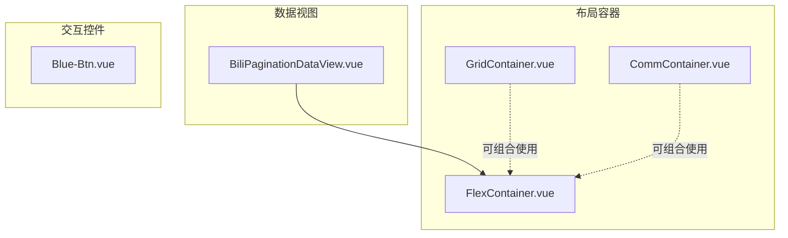
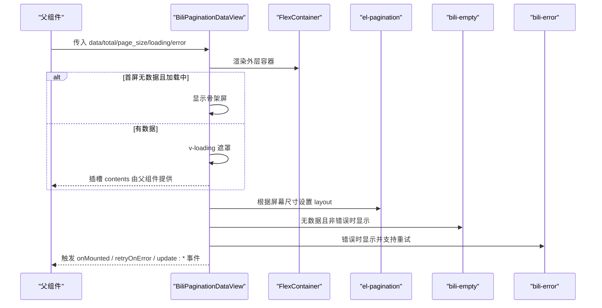
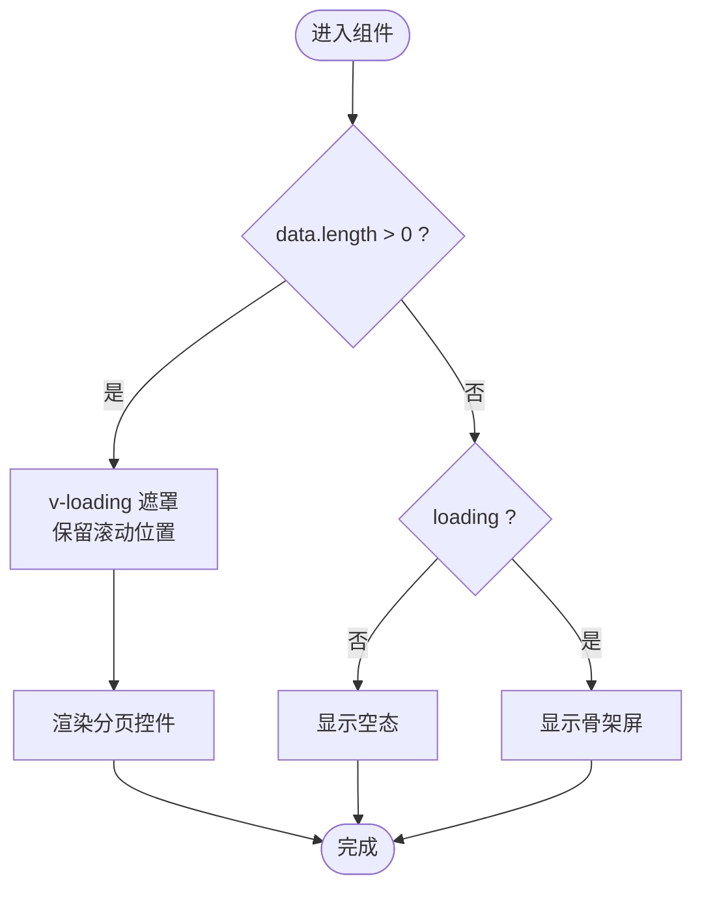
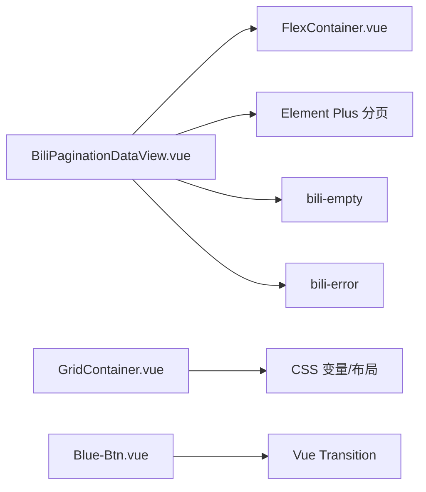

# 通用组件库

<cite>
**本文引用的文件**
- [CommContainer.vue](file://Vue3FrontEndDemoExercise/src/components/CommonCompo/Bili-Container-Compo/CommContainer.vue)
- [GridContainer.vue](file://Vue3FrontEndDemoExercise/src/components/CommonCompo/Bili-Container-Compo/GridContainer.vue)
- [FlexContainer.vue](file://Vue3FrontEndDemoExercise/src/components/CommonCompo/Bili-Container-Compo/FlexContainer.vue)
- [BiliPaginationDataView.vue](file://Vue3FrontEndDemoExercise/src/components/CommonCompo/Bili-DataTable-Compo/BiliPaginationDataView.vue)
- [Blue-Btn.vue](file://Vue3FrontEndDemoExercise/src/components/CommonCompo/Bili-Interact-Compo/Blue-Btn.vue)
</cite>

## 目录
1. [简介](#简介)
2. [项目结构](#项目结构)
3. [核心组件](#核心组件)
4. [架构总览](#架构总览)
5. [详细组件分析](#详细组件分析)
6. [依赖关系分析](#依赖关系分析)
7. [性能考量](#性能考量)
8. [故障排查指南](#故障排查指南)
9. [结论](#结论)
10. [附录：Props、事件与使用示例](#附录props事件与使用示例)

## 简介
本文件为通用组件库的使用文档，聚焦以下组件系列：
- Bili-Container-Compo：布局容器（页面容器、弹性容器、网格容器等）
- Bili-DataTable-Compo：数据表格/分页视图（分页、加载、空态、错误态）
- Bili-Interact-Compo：交互元素（按钮、日期选择器、单选列表等）
- Bili-Search-Compo：搜索框与搜索结果展示
- Bili-Feedback-Compo：反馈组件（错误、空状态、对话框）

本文提供各组件的职责说明、关键能力、Props/事件接口概览以及集成建议，帮助开发者快速在项目中复用。

## 项目结构
通用组件位于 Vue3 前端工程的 CommonCompo 目录下，按功能域划分：
- Bili-Container-Compo：布局容器
- Bili-DataTable-Compo：数据分页视图
- Bili-Interact-Compo：基础交互控件
- Bili-Search-Compo：搜索输入与结果
- Bili-Feedback-Compo：错误、空态、对话框

图表来源
- [CommContainer.vue:1-7](file://Vue3FrontEndDemoExercise/src/components/CommonCompo/Bili-Container-Compo/CommContainer.vue#L1-L7)
- [FlexContainer.vue:1-7](file://Vue3FrontEndDemoExercise/src/components/CommonCompo/Bili-Container-Compo/FlexContainer.vue#L1-L7)
- [GridContainer.vue:1-26](file://Vue3FrontEndDemoExercise/src/components/CommonCompo/Bili-Container-Compo/GridContainer.vue#L1-L26)
- [BiliPaginationDataView.vue:1-151](file://Vue3FrontEndDemoExercise/src/components/CommonCompo/Bili-DataTable-Compo/BiliPaginationDataView.vue#L1-L151)
- [Blue-Btn.vue:1-22](file://Vue3FrontEndDemoExercise/src/components/CommonCompo/Bili-Interact-Compo/Blue-Btn.vue#L1-L22)

章节来源
- [CommContainer.vue:1-7](file://Vue3FrontEndDemoExercise/src/components/CommonCompo/Bili-Container-Compo/CommContainer.vue#L1-L7)
- [FlexContainer.vue:1-7](file://Vue3FrontEndDemoExercise/src/components/CommonCompo/Bili-Container-Compo/FlexContainer.vue#L1-L7)
- [GridContainer.vue:1-26](file://Vue3FrontEndDemoExercise/src/components/CommonCompo/Bili-Container-Compo/GridContainer.vue#L1-L26)
- [BiliPaginationDataView.vue:1-151](file://Vue3FrontEndDemoExercise/src/components/CommonCompo/Bili-DataTable-Compo/BiliPaginationDataView.vue#L1-L151)
- [Blue-Btn.vue:1-22](file://Vue3FrontEndDemoExercise/src/components/CommonCompo/Bili-Interact-Compo/Blue-Btn.vue#L1-L22)

## 核心组件
- 布局容器
  - CommContainer：通用容器，提供全高、行向布局与背景样式，便于承载子内容。
  - FlexContainer：弹性容器，默认纵向布局，用于包裹内容区域并提供统一内边距与圆角。
  - GridContainer：响应式网格容器，通过 CSS 变量控制列数、间距与最小项宽，实现自适应布局。
- 数据视图
  - BiliPaginationDataView：封装分页、骨架屏、加载中遮罩、空态与错误态；支持工具栏插槽与内容插槽；自动滚动到内容顶部；根据屏幕尺寸动态调整分页布局。
- 交互控件
  - Blue-Btn：带过渡动画的按钮，支持显示/隐藏、激活态与文案配置。

章节来源
- [CommContainer.vue:1-7](file://Vue3FrontEndDemoExercise/src/components/CommonCompo/Bili-Container-Compo/CommContainer.vue#L1-L7)
- [FlexContainer.vue:1-7](file://Vue3FrontEndDemoExercise/src/components/CommonCompo/Bili-Container-Compo/FlexContainer.vue#L1-L7)
- [GridContainer.vue:1-26](file://Vue3FrontEndDemoExercise/src/components/CommonCompo/Bili-Container-Compo/GridContainer.vue#L1-L26)
- [BiliPaginationDataView.vue:1-151](file://Vue3FrontEndDemoExercise/src/components/CommonCompo/Bili-DataTable-Compo/BiliPaginationDataView.vue#L1-L151)
- [Blue-Btn.vue:1-22](file://Vue3FrontEndDemoExercise/src/components/CommonCompo/Bili-Interact-Compo/Blue-Btn.vue#L1-L22)

## 架构总览
BiliPaginationDataView 作为“数据视图”的核心，组合了布局容器与第三方 UI 的分页组件，并通过插槽暴露工具栏与内容区，使上层业务可以灵活定制。

图表来源
- [BiliPaginationDataView.vue:1-151](file://Vue3FrontEndDemoExercise/src/components/CommonCompo/Bili-DataTable-Compo/BiliPaginationDataView.vue#L1-L151)
- [FlexContainer.vue:1-7](file://Vue3FrontEndDemoExercise/src/components/CommonCompo/Bili-Container-Compo/FlexContainer.vue#L1-L7)

## 详细组件分析

### Bili-Container-Compo 布局容器
- 职责
  - 提供统一的容器样式与布局语义，降低页面搭建成本。
- 关键能力
  - CommContainer：行向、全高、背景色容器，适合左右分栏或主从布局。
  - FlexContainer：纵向弹性容器，适合包裹卡片列表或表单区域。
  - GridContainer：响应式网格，通过 itemWidth、gap、minColumns 控制布局密度与列数。
- 复杂度与性能
  - 纯样式容器，无复杂逻辑；GridContainer 使用 CSS 变量与 repeat/minmax 计算列宽，浏览器原生布局，性能友好。
- 错误处理
  - 无外部依赖的错误分支。
- 使用建议
  - 将 GridContainer 用于卡片列表；FlexContainer 用于内容区块；CommContainer 用于整体页面容器。

章节来源
- [CommContainer.vue:1-7](file://Vue3FrontEndDemoExercise/src/components/CommonCompo/Bili-Container-Compo/CommContainer.vue#L1-L7)
- [FlexContainer.vue:1-7](file://Vue3FrontEndDemoExercise/src/components/CommonCompo/Bili-Container-Compo/FlexContainer.vue#L1-L7)
- [GridContainer.vue:1-26](file://Vue3FrontEndDemoExercise/src/components/CommonCompo/Bili-Container-Compo/GridContainer.vue#L1-L26)

### Bili-DataTable-Compo 数据分页视图
- 职责
  - 统一管理数据分页、加载、空态、错误态与滚动行为，提供工具栏与内容插槽。
- 关键能力
  - 分页：根据屏幕尺寸切换分页布局；支持当前页双向绑定。
  - 加载：首屏骨架屏；后续翻页使用遮罩保持表格不被销毁，保留横向滚动位置。
  - 空态/错误态：无数据时显示空态；错误时显示错误提示并支持重试。
  - 自动错误处理：开启后在错误时清空数据与总数，避免脏数据残留。
  - 滚动定位：翻页后平滑滚动到内容起始位置。
- 复杂度与性能
  - 监听 current_page、loading、error 变化，结合 nextTick 进行 DOM 操作；仅在必要时滚动，减少重排。
- 错误处理
  - watch(error) 自动清空数据；handleRetry 触发重试回调并可重置错误状态。
- 使用建议
  - 通过 slots toolbar 放置筛选/导出等操作；contents 插槽渲染具体数据项；通过 defineModel 同步分页状态。

图表来源
- [BiliPaginationDataView.vue:1-151](file://Vue3FrontEndDemoExercise/src/components/CommonCompo/Bili-DataTable-Compo/BiliPaginationDataView.vue#L1-L151)

章节来源
- [BiliPaginationDataView.vue:1-151](file://Vue3FrontEndDemoExercise/src/components/CommonCompo/Bili-DataTable-Compo/BiliPaginationDataView.vue#L1-L151)

### Bili-Interact-Compo 交互控件
- 职责
  - 提供常用交互元素，如按钮、日期选择器、单选列表等，保证一致的视觉与动效。
- 关键能力
  - Blue-Btn：支持显示/隐藏、激活态切换、文案配置与入场/离场动画。
- 复杂度与性能
  - 轻量级组件，仅基于过渡动画与条件渲染，开销极低。
- 错误处理
  - 无外部错误分支。
- 使用建议
  - 通过模型绑定控制显示与激活态；在父组件中管理按钮状态与业务逻辑。

章节来源
- [Blue-Btn.vue:1-22](file://Vue3FrontEndDemoExercise/src/components/CommonCompo/Bili-Interact-Compo/Blue-Btn.vue#L1-L22)

### Bili-Search-Compo 搜索组件
- 职责
  - 提供搜索输入与结果展示的统一入口，便于在不同业务模块复用。
- 关键能力
  - 输入过滤、关键词高亮、结果列表渲染、分页/加载更多（视业务而定）。
- 复杂度与性能
  - 通常配合防抖与虚拟滚动优化长列表体验。
- 错误处理
  - 网络异常或空结果时，可结合 Feedback 组件展示空态或错误提示。
- 使用建议
  - 将搜索参数与结果数据通过 props/model 与父组件同步；在父组件中处理请求与缓存策略。

[本节为概念性说明，不直接分析具体文件]

### Bili-Feedback-Compo 反馈组件
- 职责
  - 统一错误、空状态与对话框的呈现方式，提升一致性与可维护性。
- 关键能力
  - 错误：展示错误信息与重试入口。
  - 空态：展示引导文案与操作入口。
  - 对话框：确认/取消流程与异步任务承载。
- 复杂度与性能
  - 以展示为主，逻辑简单；注意避免频繁创建/销毁导致的抖动。
- 错误处理
  - 与数据视图联动，在错误时显示错误态；重试时恢复数据流。
- 使用建议
  - 在数据请求失败或结果为空时，优先使用 Feedback 组件统一反馈。

[本节为概念性说明，不直接分析具体文件]

## 依赖关系分析
- BiliPaginationDataView 依赖 FlexContainer 作为外层容器，并使用 Element Plus 的分页组件与自定义空态/错误态组件。
- GridContainer 通过 CSS 变量与内置布局算法实现响应式网格，不引入额外运行时依赖。
- Blue-Btn 仅依赖 Vue 的过渡系统，无外部 UI 库依赖。

图表来源
- [BiliPaginationDataView.vue:1-151](file://Vue3FrontEndDemoExercise/src/components/CommonCompo/Bili-DataTable-Compo/BiliPaginationDataView.vue#L1-L151)
- [FlexContainer.vue:1-7](file://Vue3FrontEndDemoExercise/src/components/CommonCompo/Bili-Container-Compo/FlexContainer.vue#L1-L7)
- [GridContainer.vue:1-26](file://Vue3FrontEndDemoExercise/src/components/CommonCompo/Bili-Container-Compo/GridContainer.vue#L1-L26)
- [Blue-Btn.vue:1-22](file://Vue3FrontEndDemoExercise/src/components/CommonCompo/Bili-Interact-Compo/Blue-Btn.vue#L1-L22)

章节来源
- [BiliPaginationDataView.vue:1-151](file://Vue3FrontEndDemoExercise/src/components/CommonCompo/Bili-DataTable-Compo/BiliPaginationDataView.vue#L1-L151)
- [FlexContainer.vue:1-7](file://Vue3FrontEndDemoExercise/src/components/CommonCompo/Bili-Container-Compo/FlexContainer.vue#L1-L7)
- [GridContainer.vue:1-26](file://Vue3FrontEndDemoExercise/src/components/CommonCompo/Bili-Container-Compo/GridContainer.vue#L1-L26)
- [Blue-Btn.vue:1-22](file://Vue3FrontEndDemoExercise/src/components/CommonCompo/Bili-Interact-Compo/Blue-Btn.vue#L1-L22)

## 性能考量
- 列表渲染
  - 首屏使用骨架屏减少白屏感知；翻页时使用遮罩而非销毁重建，保留滚动位置，降低重排。
- 布局计算
  - GridContainer 利用 CSS 变量与 repeat/minmax 计算列宽，避免 JS 参与布局计算。
- 事件节流
  - 建议在父组件中对搜索输入做防抖，对分页切换做去抖，避免频繁请求。
- 内存占用
  - 大数据量场景建议使用虚拟滚动或分页加载；及时释放不再使用的订阅与定时器。

[本节提供通用指导，不直接分析具体文件]

## 故障排查指南
- 问题：翻页后未滚动到内容顶部
  - 检查是否触发了 loading 变化与 shouldScrollToContentStart 标志；确保 nextTick 后执行滚动。
- 问题：错误状态下仍有旧数据
  - 确认 autoHandleError 已启用；watch(error) 会清空数据与总数；若仍残留，检查父组件是否在错误时主动更新数据。
- 问题：分页布局不符合预期
  - 检查全局屏幕尺寸注入是否正确；不同屏幕尺寸对应不同的分页布局。
- 问题：按钮点击无响应
  - 检查 is_show 与 is_active 绑定；确认父组件状态更新逻辑。

章节来源
- [BiliPaginationDataView.vue:102-140](file://Vue3FrontEndDemoExercise/src/components/CommonCompo/Bili-DataTable-Compo/BiliPaginationDataView.vue#L102-L140)
- [Blue-Btn.vue:15-21](file://Vue3FrontEndDemoExercise/src/components/CommonCompo/Bili-Interact-Compo/Blue-Btn.vue#L15-L21)

## 结论
本组件库提供了稳定的布局容器、数据分页视图与基础交互控件，覆盖常见后台与数据展示场景。通过插槽与模型绑定，既能满足通用需求，又便于业务定制。建议在新页面中优先复用这些组件，以提升一致性与开发效率。

[本节为总结性内容，不直接分析具体文件]

## 附录：Props、事件与使用示例

### Bili-Container-Compo
- CommContainer
  - Props：无
  - Slots：默认插槽
  - 用法：作为页面最外层容器，承载侧边栏与主体内容。
- FlexContainer
  - Props：无
  - Slots：默认插槽
  - 用法：包裹内容区块，提供纵向弹性布局与统一样式。
- GridContainer
  - Props
    - itemWidth：字符串，默认 "200px"
    - gap：数字，默认 10
    - minColumns：数字，默认 2
  - Slots：默认插槽
  - 用法：用于卡片列表，自动计算列数与间距。

章节来源
- [CommContainer.vue:1-7](file://Vue3FrontEndDemoExercise/src/components/CommonCompo/Bili-Container-Compo/CommContainer.vue#L1-L7)
- [FlexContainer.vue:1-7](file://Vue3FrontEndDemoExercise/src/components/CommonCompo/Bili-Container-Compo/FlexContainer.vue#L1-L7)
- [GridContainer.vue:8-21](file://Vue3FrontEndDemoExercise/src/components/CommonCompo/Bili-Container-Compo/GridContainer.vue#L8-L21)

### Bili-DataTable-Compo
- BiliPaginationDataView
  - Props
    - data：数组，默认 []
    - total：数字，默认 0
    - page_size：数字，默认 10
    - autoHandleError：布尔，默认 true
  - Model
    - EmptyMsg：字符串，默认 "暂无数据"
    - ErrorMsg：字符串，默认 "网络异常"
    - CurrentPage：数字，默认 0
    - Loading：布尔，默认 true
    - Error：布尔，默认 false
  - Events
    - onMounted：组件挂载时触发
    - retryOnError：用户点击重试时触发
    - update:data：数据更新时触发
    - update:total：总数更新时触发
  - Slots
    - toolbar：工具栏区域
    - contents：内容区域（默认使用业务卡片容器）
  - 用法要点
    - 在父组件中维护 data/total/current_page/loading/error 的状态；
    - 在 loading 变化时按需刷新数据；
    - 通过 toolbar 插槽添加筛选/导出等操作；
    - 通过 contents 插槽渲染数据项。

章节来源
- [BiliPaginationDataView.vue:63-91](file://Vue3FrontEndDemoExercise/src/components/CommonCompo/Bili-DataTable-Compo/BiliPaginationDataView.vue#L63-L91)
- [BiliPaginationDataView.vue:93-145](file://Vue3FrontEndDemoExercise/src/components/CommonCompo/Bili-DataTable-Compo/BiliPaginationDataView.vue#L93-L145)

### Bili-Interact-Compo
- Blue-Btn
  - Model
    - btn_text：字符串
    - is_active：布尔
    - is_show：布尔
  - 用法要点
    - 在父组件中控制显示与激活态；
    - 结合业务逻辑在点击时触发回调。

章节来源
- [Blue-Btn.vue:15-21](file://Vue3FrontEndDemoExercise/src/components/CommonCompo/Bili-Interact-Compo/Blue-Btn.vue#L15-L21)

### Bili-Search-Compo（概念）
- 典型 Props
  - keyword：字符串
  - placeholder：字符串
  - results：数组
  - loading：布尔
  - error：布尔
- 典型事件
  - update:keyword：关键词变更
  - search：触发搜索
  - select：选中某条结果
- 使用示例（示意）
  - 父组件维护 keyword/results/loading/error；
  - 在输入变化时防抖触发搜索；
  - 使用 Feedback 组件处理空态与错误态。

[本节为概念性说明，不直接分析具体文件]

### Bili-Feedback-Compo（概念）
- 典型组件
  - 错误：显示错误信息 + 重试按钮
  - 空态：显示引导文案 + 操作按钮
  - 对话框：确认/取消流程
- 使用示例（示意）
  - 在数据请求失败时显示错误；
  - 在无数据时显示空态；
  - 在删除/提交等敏感操作前弹出对话框确认。

[本节为概念性说明，不直接分析具体文件]