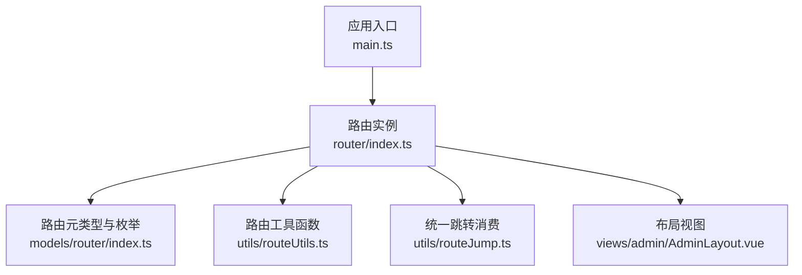
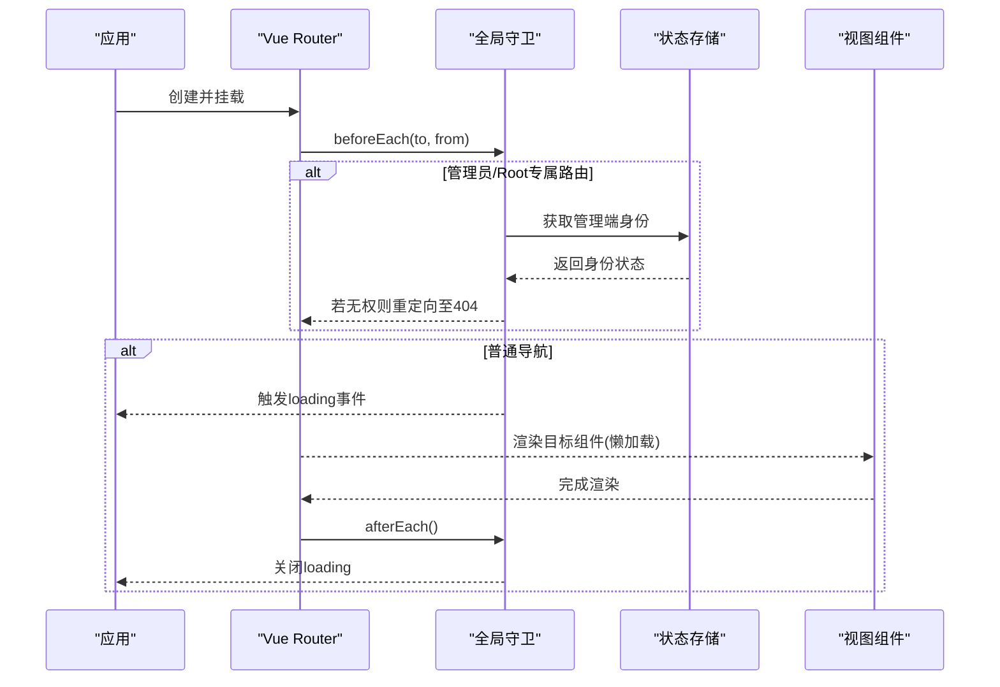
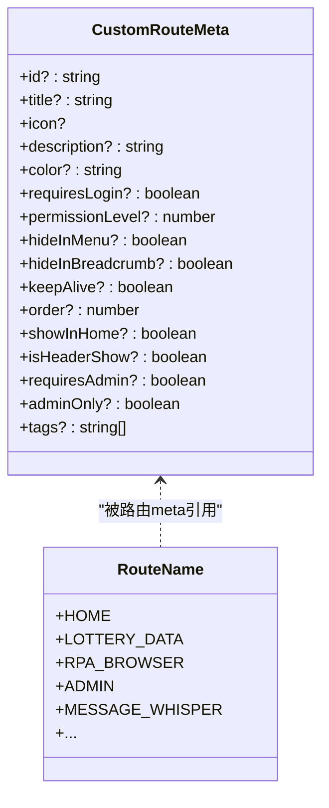
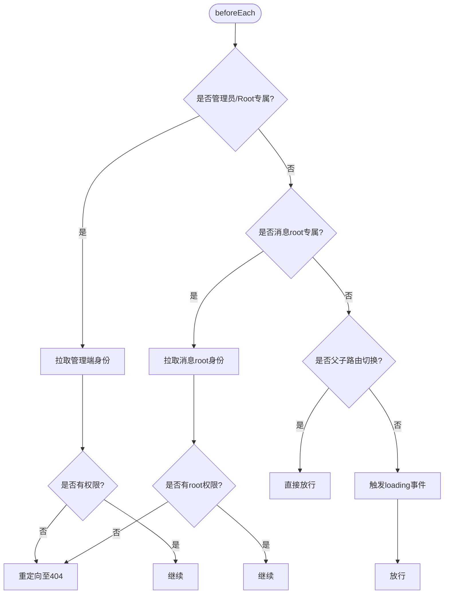
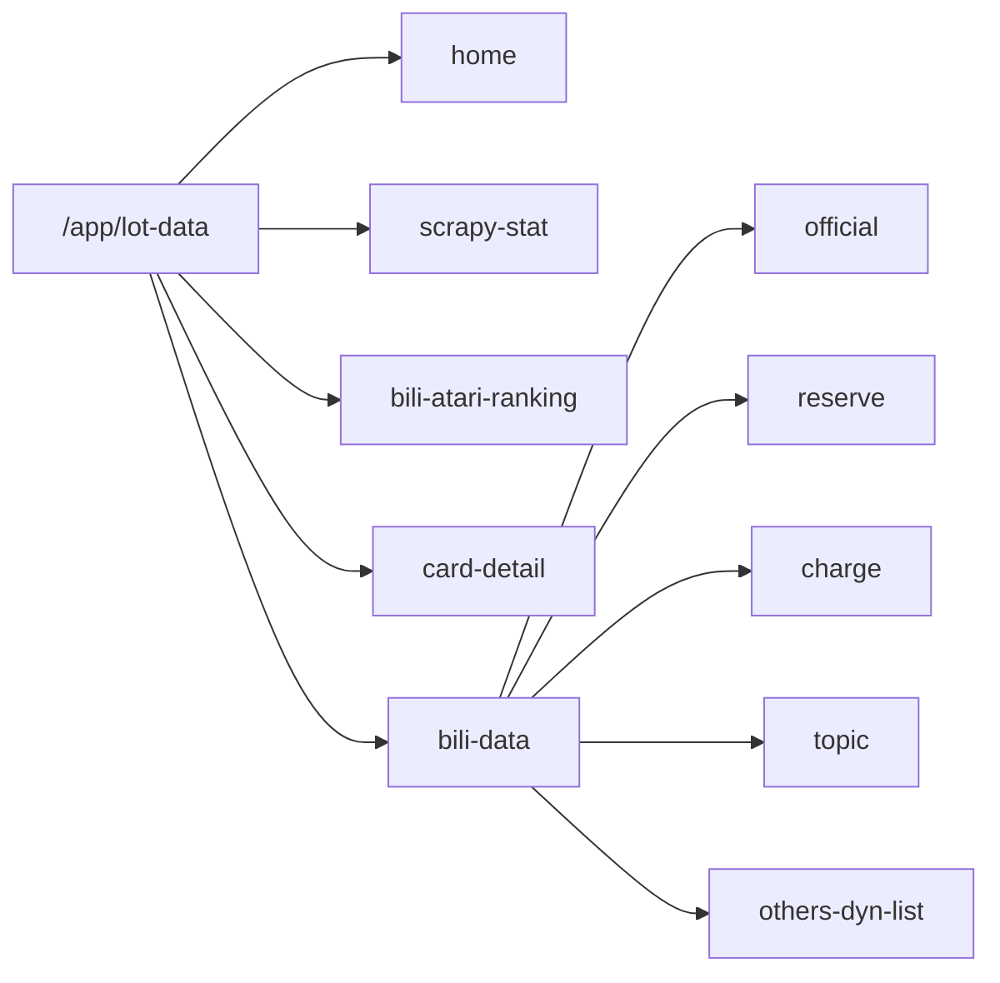
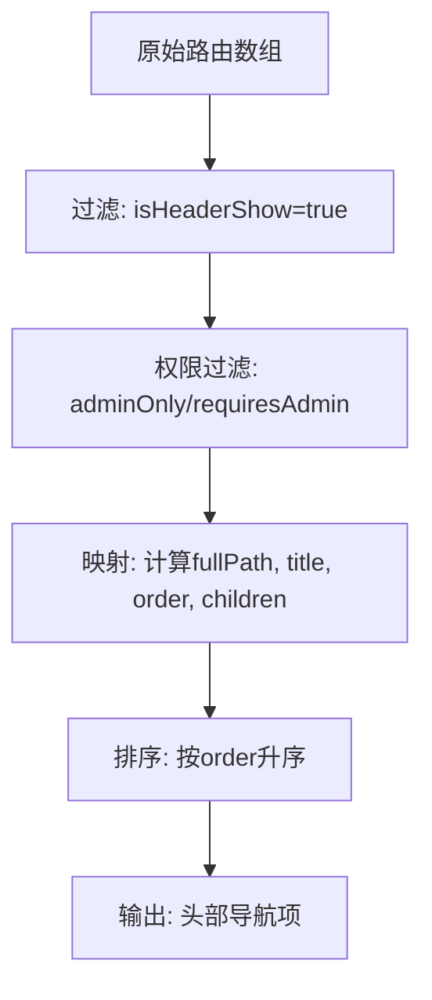
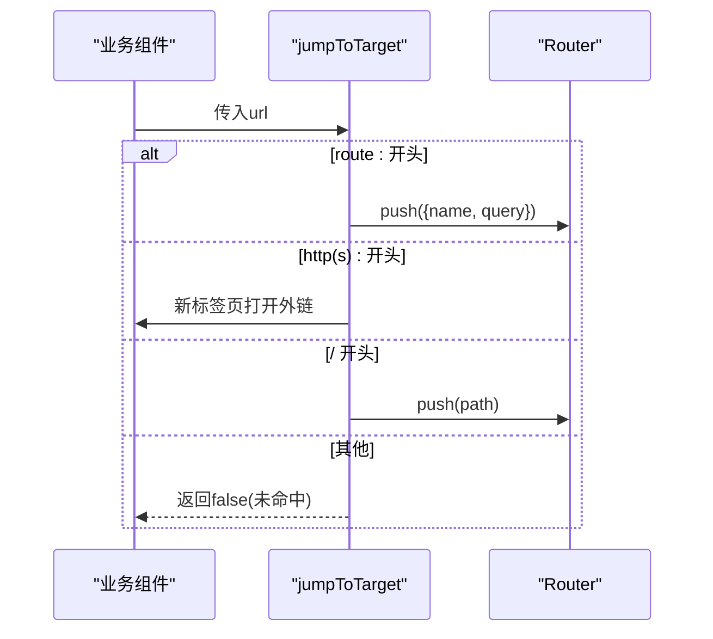
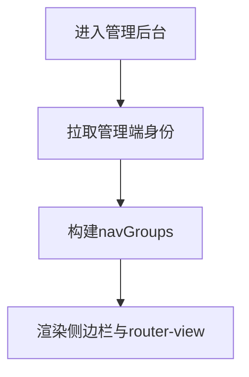
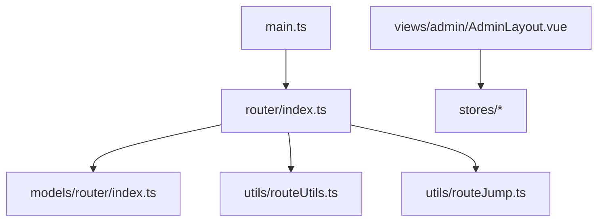

# 路由导航

<cite>
**本文引用的文件**
- [src/router/index.ts](file://Vue3FrontEndDemoExercise/src/router/index.ts)
- [src/models/router/index.ts](file://Vue3FrontEndDemoExercise/src/models/router/index.ts)
- [src/utils/routeUtils.ts](file://Vue3FrontEndDemoExercise/src/utils/routeUtils.ts)
- [src/utils/routeJump.ts](file://Vue3FrontEndDemoExercise/src/utils/routeJump.ts)
- [src/views/admin/AdminLayout.vue](file://Vue3FrontEndDemoExercise/src/views/admin/AdminLayout.vue)
- [src/main.ts](file://Vue3FrontEndDemoExercise/src/main.ts)
</cite>

## 目录
1. [简介](#简介)
2. [项目结构](#项目结构)
3. [核心组件](#核心组件)
4. [架构总览](#架构总览)
5. [详细组件分析](#详细组件分析)
6. [依赖关系分析](#依赖关系分析)
7. [性能考虑](#性能考虑)
8. [故障排查指南](#故障排查指南)
9. [结论](#结论)
10. [附录](#附录)

## 简介
本文件为前端路由导航系统的配置与实现文档，聚焦于 Vue Router 在项目中的使用方式，涵盖：
- 路由守卫、权限控制（登录态、管理员/Root）
- 动态路由与嵌套路由的组织方式
- 模块划分：管理后台、消息中心、RPA 控制台等
- 路由懒加载、代码分割与性能优化策略
- 面包屑导航、标签页管理与导航体验优化
- 路由调试工具与常见问题定位

## 项目结构
本项目的前端基于 Vue 3 + TypeScript，路由定义集中在单一入口文件中，并通过类型扩展统一元数据；同时提供工具函数用于生成头部导航、首页入口以及统一跳转消费。

**图示来源**
- [src/main.ts:18-25](file://Vue3FrontEndDemoExercise/src/main.ts#L18-L25)
- [src/router/index.ts:742-745](file://Vue3FrontEndDemoExercise/src/router/index.ts#L742-L745)
- [src/models/router/index.ts:1-49](file://Vue3FrontEndDemoExercise/src/models/router/index.ts#L1-L49)
- [src/utils/routeUtils.ts:28-65](file://Vue3FrontEndDemoExercise/src/utils/routeUtils.ts#L28-L65)
- [src/utils/routeJump.ts:46-63](file://Vue3FrontEndDemoExercise/src/utils/routeJump.ts#L46-L63)
- [src/views/admin/AdminLayout.vue:1-5](file://Vue3FrontEndDemoExercise/src/views/admin/AdminLayout.vue#L1-L5)

**章节来源**
- [src/main.ts:18-25](file://Vue3FrontEndDemoExercise/src/main.ts#L18-L25)
- [src/router/index.ts:742-745](file://Vue3FrontEndDemoExercise/src/router/index.ts#L742-L745)

## 核心组件
- 路由定义与守卫：集中式路由表、全局前置/后置守卫、懒加载组件、重定向与嵌套路由组织。
- 元数据模型：自定义 meta 字段描述标题、图标、排序、是否显示在首页/头部、是否需要登录或管理员权限等。
- 路由工具：生成头部导航项、首页入口模块、路径拼接与排序。
- 统一跳转：解析后端下发的跳转目标（站内路由名、外部链接、历史路径），统一执行跳转。
- 管理后台布局：根据当前用户身份动态渲染侧边栏分组与菜单项。

**章节来源**
- [src/router/index.ts:106-741](file://Vue3FrontEndDemoExercise/src/router/index.ts#L106-L741)
- [src/models/router/index.ts:6-49](file://Vue3FrontEndDemoExercise/src/models/router/index.ts#L6-L49)
- [src/utils/routeUtils.ts:28-65](file://Vue3FrontEndDemoExercise/src/utils/routeUtils.ts#L28-L65)
- [src/utils/routeJump.ts:28-63](file://Vue3FrontEndDemoExercise/src/utils/routeJump.ts#L28-L63)
- [src/views/admin/AdminLayout.vue:15-78](file://Vue3FrontEndDemoExercise/src/views/admin/AdminLayout.vue#L15-L78)

## 架构总览
下图展示了路由从初始化到导航执行的完整链路，包括守卫拦截、权限校验、加载提示与页面切换。

**图示来源**
- [src/router/index.ts:747-788](file://Vue3FrontEndDemoExercise/src/router/index.ts#L747-L788)
- [src/router/index.ts:742-745](file://Vue3FrontEndDemoExercise/src/router/index.ts#L742-L745)

## 详细组件分析

### 路由定义与元数据
- 路由表采用懒加载方式引入组件，减少首屏体积。
- 通过自定义 meta 字段表达：
  - 展示控制：是否在首页/头部显示、是否隐藏、是否缓存
  - 权限控制：是否需要登录、是否需要管理员/root、是否仅管理员可见
  - 展示信息：标题、图标、描述、颜色、排序权重
- 使用统一的 RouteName 枚举管理路由名称，避免硬编码字符串。

**图示来源**
- [src/models/router/index.ts:6-49](file://Vue3FrontEndDemoExercise/src/models/router/index.ts#L6-L49)
- [src/models/router/index.ts:51-114](file://Vue3FrontEndDemoExercise/src/models/router/index.ts#L51-L114)

**章节来源**
- [src/router/index.ts:106-741](file://Vue3FrontEndDemoExercise/src/router/index.ts#L106-L741)
- [src/models/router/index.ts:6-49](file://Vue3FrontEndDemoExercise/src/models/router/index.ts#L6-L49)
- [src/models/router/index.ts:51-114](file://Vue3FrontEndDemoExercise/src/models/router/index.ts#L51-L114)

### 路由守卫与权限控制
- 管理员/Root专属路由：在进入前检查管理端身份，未授权时伪装为“页面不存在”（重定向至404）。
- 消息管理端 root 专属路由：同样进行 root 校验，未授权重定向至404。
- 子路由切换优化：同一父路由下的子路由切换不显示 loading。
- 全局加载提示：进入新路由时触发 loading 事件，完成后关闭。

**图示来源**
- [src/router/index.ts:747-788](file://Vue3FrontEndDemoExercise/src/router/index.ts#L747-L788)

**章节来源**
- [src/router/index.ts:747-788](file://Vue3FrontEndDemoExercise/src/router/index.ts#L747-L788)

### 嵌套路由与模块组织
- 抽奖数据模块：包含首页、爬虫状态、名人堂、B站数据分类（官方、预约、充电、话题、第三方动态）等子路由。
- 用户中心模块：仪表盘、基本信息设置、记录、黑名单、注销等子路由。
- RPA 浏览器模块：指纹列表、创建/编辑、Stream控制台、社区广场、动作与工作流管理、操作日志等。
- 消息中心模块：我的消息（含私信聊天）、回复我的、@我的、收到的赞、系统通知、消息设置。
- 动态模块：动态广场、话题广场、话题动态、动态详情、我的空间、用户空间。
- 管理后台模块：概览、RPA管理、通知管理、私信审核、评论审核、权限管理、举报审核、动态/话题审核、头像/封面审核等。

**图示来源**
- [src/router/index.ts:130-290](file://Vue3FrontEndDemoExercise/src/router/index.ts#L130-L290)

**章节来源**
- [src/router/index.ts:130-290](file://Vue3FrontEndDemoExercise/src/router/index.ts#L130-L290)

### 头部导航与首页入口生成
- 头部导航：过滤出 isHeaderShow 为 true 的路由，并根据 requiresAdmin/adminOnly 对管理员专属入口进行显隐控制，按 order 排序。
- 首页入口：过滤出 id 存在且 showInHome 为 true 的模块，递归收集其子路由中 showInHome 为 true 的项，并按 order 排序。
- 路径处理：统一处理父级路径与子路径拼接，避免多余斜杠。

**图示来源**
- [src/utils/routeUtils.ts:28-65](file://Vue3FrontEndDemoExercise/src/utils/routeUtils.ts#L28-L65)

**章节来源**
- [src/utils/routeUtils.ts:28-65](file://Vue3FrontEndDemoExercise/src/utils/routeUtils.ts#L28-L65)

### 统一跳转消费（后端下发目标）
- 支持三种形态：
  - 站内路由名跳转：route:{name}?{query}
  - 外部链接：http(s)://... 在新标签页打开
  - 历史路径：/app/... 直接 push
- 解析后统一调用 router.push 或打开外链，避免分散逻辑。

**图示来源**
- [src/utils/routeJump.ts:28-63](file://Vue3FrontEndDemoExercise/src/utils/routeJump.ts#L28-L63)

**章节来源**
- [src/utils/routeJump.ts:28-63](file://Vue3FrontEndDemoExercise/src/utils/routeJump.ts#L28-L63)

### 管理后台布局与菜单渲染
- 根据当前用户身份（RPA管理员/root、消息管理端root）动态构建侧边栏分组与菜单项。
- 仅在具备相应权限时渲染对应菜单，确保前后端一致的安全策略。

**图示来源**
- [src/views/admin/AdminLayout.vue:15-78](file://Vue3FrontEndDemoExercise/src/views/admin/AdminLayout.vue#L15-L78)

**章节来源**
- [src/views/admin/AdminLayout.vue:15-78](file://Vue3FrontEndDemoExercise/src/views/admin/AdminLayout.vue#L15-L78)

## 依赖关系分析
- main.ts 负责应用初始化，注册 Pinia、路由、国际化、Head、GraphQL客户端、Casdoor插件等。
- router/index.ts 作为路由中枢，依赖 models/router/index.ts 的类型与枚举，依赖 utils 的工具函数，并在守卫中访问 stores 以获取管理端身份。
- AdminLayout.vue 依赖 stores 的状态来决定菜单渲染。

**图示来源**
- [src/main.ts:18-25](file://Vue3FrontEndDemoExercise/src/main.ts#L18-L25)
- [src/router/index.ts:742-745](file://Vue3FrontEndDemoExercise/src/router/index.ts#L742-L745)
- [src/views/admin/AdminLayout.vue:15-20](file://Vue3FrontEndDemoExercise/src/views/admin/AdminLayout.vue#L15-L20)

**章节来源**
- [src/main.ts:18-25](file://Vue3FrontEndDemoExercise/src/main.ts#L18-L25)
- [src/router/index.ts:742-745](file://Vue3FrontEndDemoExercise/src/router/index.ts#L742-L745)
- [src/views/admin/AdminLayout.vue:15-20](file://Vue3FrontEndDemoExercise/src/views/admin/AdminLayout.vue#L15-L20)

## 性能考虑
- 路由懒加载：所有页面组件均采用动态 import，降低首屏体积，提升初始加载速度。
- 子路由切换优化：同一父路由下的子路由切换不显示 loading，减少不必要的交互反馈。
- 菜单与入口生成：通过工具函数一次性过滤与排序，避免重复计算。
- 建议：
  - 对超大组件可进一步拆分或按需加载资源
  - 结合 keepAlive 对高频切换页面做缓存（需配合 meta.keepAlive）
  - 利用路由元数据的 order 字段稳定排序，避免频繁重排

[本节为通用性能建议，无需特定文件来源]

## 故障排查指南
- 404 伪装：管理员/Root 专属路由无权限时会被重定向至 404，检查管理端身份是否正确加载。
- 菜单不显示：确认路由 meta 中 isHeaderShow/showInHome 是否开启，以及 requiresAdmin/adminOnly 是否符合当前身份。
- 跳转异常：检查后端下发的跳转目标格式是否为 route:{name}?{query}，或历史路径是否以 / 开头。
- 加载提示异常：检查 beforeEach/afterEach 是否正确触发 loading 事件。

**章节来源**
- [src/router/index.ts:747-788](file://Vue3FrontEndDemoExercise/src/router/index.ts#L747-L788)
- [src/utils/routeJump.ts:28-63](file://Vue3FrontEndDemoExercise/src/utils/routeJump.ts#L28-L63)

## 结论
本项目通过集中式路由定义、严格的元数据模型与守卫机制，实现了清晰的路由结构与安全的权限控制；借助工具函数统一管理头部导航与首页入口，并提供统一跳转消费入口，提升了可维护性与一致性。懒加载与子路由切换优化保障了良好的用户体验。后续可结合 keepAlive、更细粒度的代码分割与路由级错误边界进一步提升性能与健壮性。

[本节为总结性内容，无需特定文件来源]

## 附录
- 路由元数据字段说明（节选）
  - title：页面标题
  - icon：菜单图标组件
  - description：页面描述
  - color：主题色
  - requiresLogin：是否需要登录
  - requiresAdmin/adminOnly：管理员/Root 专属
  - hideInMenu/hideInBreadcrumb：隐藏菜单/面包屑
  - keepAlive：是否缓存页面
  - order：排序权重
  - showInHome/isHeaderShow：是否在首页/头部显示

**章节来源**
- [src/models/router/index.ts:6-49](file://Vue3FrontEndDemoExercise/src/models/router/index.ts#L6-L49)