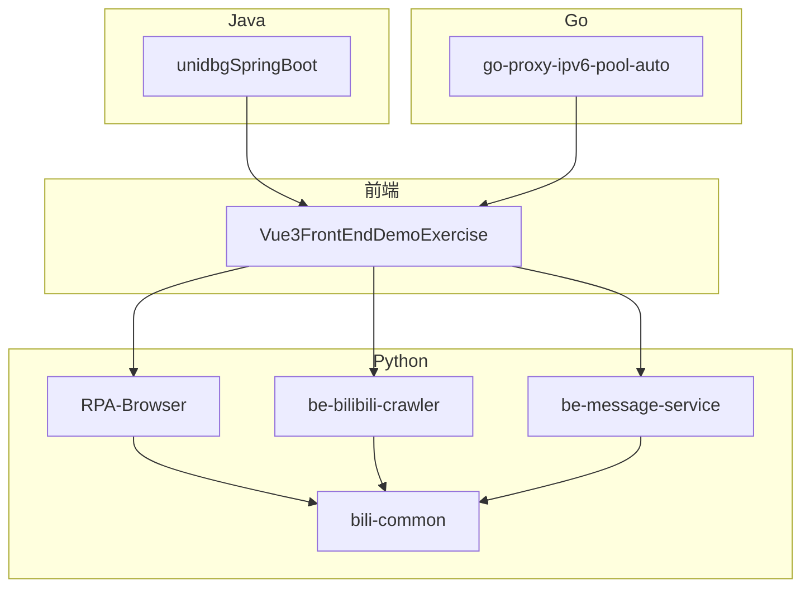
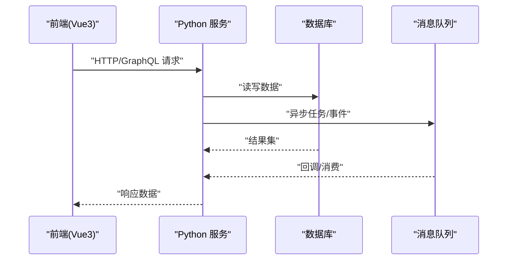
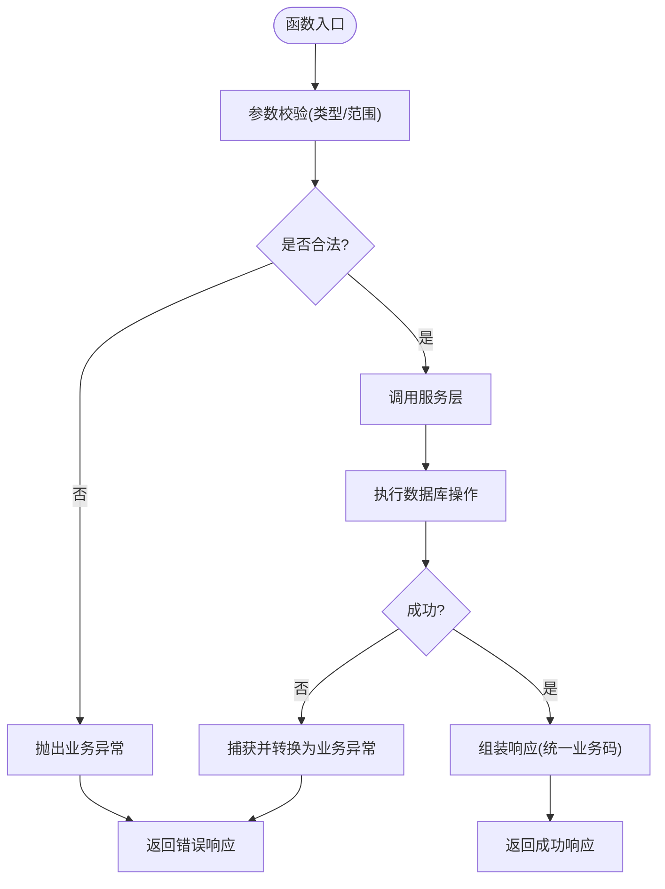
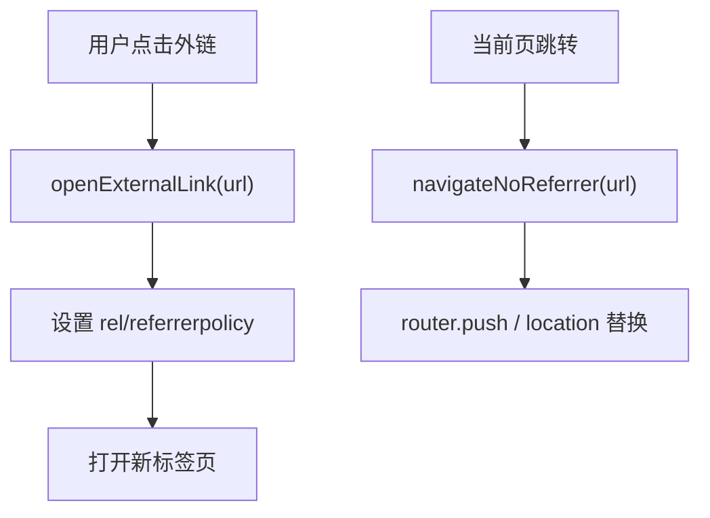
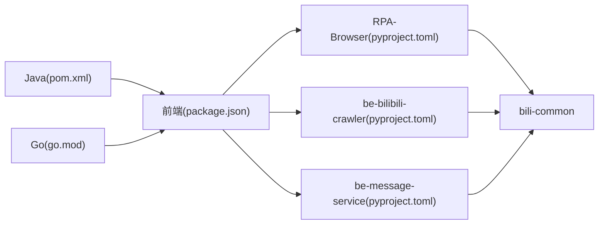

# 代码规范

<cite>
**本文引用的文件**
- [RPA-Browser/pyproject.toml](file://RPA-Browser/pyproject.toml)
- [be-bilibili-crawler/pyproject.toml](file://be-bilibili-crawler/pyproject.toml)
- [be-message-service/pyproject.toml](file://be-message-service/pyproject.toml)
- [Vue3FrontEndDemoExercise/.eslintrc.cjs](file://Vue3FrontEndDemoExercise/.eslintrc.cjs)
- [Vue3FrontEndDemoExercise/.prettierrc](file://Vue3FrontEndDemoExercise/.prettierrc)
- [Vue3FrontEndDemoExercise/package.json](file://Vue3FrontEndDemoExercise/package.json)
- [go-proxy-ipv6-pool-auto/go-proxy-ipv6-pool/go.mod](file://go-proxy-ipv6-pool-auto/go-proxy-ipv6-pool/go.mod)
- [unidbgSpringBoot/pom.xml](file://unidbgSpringBoot/pom.xml)
- [RPA-Browser/.codebuddy/rules/python-venv-activation.mdc](file://RPA-Browser/.codebuddy/rules/python-venv-activation.mdc)
- [RPA-Browser/.codebuddy/rules/python语法.mdc](file://RPA-Browser/.codebuddy/rules/python语法.mdc)
- [RPA-Browser/.codebuddy/rules/typehint.mdc](file://RPA-Browser/.codebuddy/rules/typehint.mdc)
- [RPA-Browser/.codebuddy/rules/import规则.mdc](file://RPA-Browser/.codebuddy/rules/import规则.mdc)
- [RPA-Browser/.codebuddy/rules/refactoring-guidelines.mdc](file://RPA-Browser/.codebuddy/rules/refactoring-guidelines.mdc)
- [RPA-Browser/.codebuddy/rules/业务code.mdc](file://RPA-Browser/.codebuddy/rules/业务code.mdc)
- [.codebuddy/rules/vue前端项目规范.mdc](file://.codebuddy/rules/vue前端项目规范.mdc)
</cite>

## 目录
1. [简介](#简介)
2. [项目结构](#项目结构)
3. [核心组件](#核心组件)
4. [架构总览](#架构总览)
5. [详细组件分析](#详细组件分析)
6. [依赖分析](#依赖分析)
7. [性能考虑](#性能考虑)
8. [故障排查指南](#故障排查指南)
9. [结论](#结论)
10. [附录](#附录)

## 简介
本规范面向多语言工程（Python、JavaScript/TypeScript、Java、Go），统一命名约定、文件组织、注释与错误处理模式、安全编码实践，并给出格式化配置、ESLint/Pylint/Ruff 等工具链建议与审查清单。结合仓库内现有规则与配置文件，提供可落地的最佳实践与重构指导，帮助团队在一致标准下高效协作。

## 项目结构
仓库包含多个独立服务与前端工程：
- Python 后端服务：RPA-Browser、be-bilibili-crawler、be-message-service、bili-common（共享库）
- JavaScript/TypeScript 前端：Vue3FrontEndDemoExercise
- Java 服务：unidbgSpringBoot
- Go 服务：go-proxy-ipv6-pool-auto

图表来源
- [RPA-Browser/pyproject.toml:1-75](file://RPA-Browser/pyproject.toml#L1-L75)
- [be-bilibili-crawler/pyproject.toml:1-129](file://be-bilibili-crawler/pyproject.toml#L1-L129)
- [be-message-service/pyproject.toml:1-85](file://be-message-service/pyproject.toml#L1-L85)
- [Vue3FrontEndDemoExercise/package.json:1-95](file://Vue3FrontEndDemoExercise/package.json#L1-L95)
- [unidbgSpringBoot/pom.xml:1-133](file://unidbgSpringBoot/pom.xml#L1-L133)
- [go-proxy-ipv6-pool-auto/go-proxy-ipv6-pool/go.mod:1-12](file://go-proxy-ipv6-pool-auto/go-proxy-ipv6-pool/go.mod#L1-L12)

章节来源
- [RPA-Browser/pyproject.toml:1-75](file://RPA-Browser/pyproject.toml#L1-L75)
- [be-bilibili-crawler/pyproject.toml:1-129](file://be-bilibili-crawler/pyproject.toml#L1-L129)
- [be-message-service/pyproject.toml:1-85](file://be-message-service/pyproject.toml#L1-L85)
- [Vue3FrontEndDemoExercise/package.json:1-95](file://Vue3FrontEndDemoExercise/package.json#L1-L95)
- [unidbgSpringBoot/pom.xml:1-133](file://unidbgSpringBoot/pom.xml#L1-L133)
- [go-proxy-ipv6-pool-auto/go-proxy-ipv6-pool/go.mod:1-12](file://go-proxy-ipv6-pool-auto/go-proxy-ipv6-pool/go.mod#L1-L12)

## 核心组件
- Python 工程
  - 包管理与依赖：pyproject.toml 集中声明依赖、镜像源、测试与开发分组；使用 uv 管理安装与索引策略。
  - 类型与导入：强制使用最新 Python 语法与类型提示，禁止 Dict[str, Any] 等弱类型，优先 Pydantic/Dataclass；禁止动态 import，统一在文件头静态导入。
  - 虚拟环境：运行前必须激活 .venv，避免环境污染。
  - 业务码：禁止硬编码业务码，统一收敛到响应码模块。
  - 重构原则：单一职责、依赖注入、接口隔离、向后兼容；模型/服务/控制器分层清晰。
- 前端工程（Vue3 + TypeScript）
  - ESLint：启用 Vue3 Essential、推荐规则与 TypeScript 配置，配合 Prettier 进行格式化。
  - 样式规范：禁用 <style> 块与内联样式，统一通过 Tailwind 原子类；主题变量集中管理，禁止手写 CSS 变量。
  - 外链跳转：统一 referrer 策略，禁止裸用 window.open/location.href，使用封装工具函数。
- Java 工程
  - Spring Boot 3.x 项目，使用 Lombok、OpenAPI 文档生成；构建插件与仓库源集中配置。
- Go 工程
  - go.mod 声明模块与依赖版本，使用最小必要依赖集。

章节来源
- [RPA-Browser/.codebuddy/rules/python-venv-activation.mdc:1-46](file://RPA-Browser/.codebuddy/rules/python-venv-activation.mdc#L1-L46)
- [RPA-Browser/.codebuddy/rules/python语法.mdc:1-9](file://RPA-Browser/.codebuddy/rules/python语法.mdc#L1-L9)
- [RPA-Browser/.codebuddy/rules/typehint.mdc:1-9](file://RPA-Browser/.codebuddy/rules/typehint.mdc#L1-L9)
- [RPA-Browser/.codebuddy/rules/import规则.mdc:1-9](file://RPA-Browser/.codebuddy/rules/import规则.mdc#L1-L9)
- [RPA-Browser/.codebuddy/rules/业务code.mdc:1-9](file://RPA-Browser/.codebuddy/rules/业务code.mdc#L1-L9)
- [RPA-Browser/.codebuddy/rules/refactoring-guidelines.mdc:1-29](file://RPA-Browser/.codebuddy/rules/refactoring-guidelines.mdc#L1-L29)
- [Vue3FrontEndDemoExercise/.eslintrc.cjs:1-16](file://Vue3FrontEndDemoExercise/.eslintrc.cjs#L1-L16)
- [Vue3FrontEndDemoExercise/.prettierrc:1-11](file://Vue3FrontEndDemoExercise/.prettierrc#L1-L11)
- [.codebuddy/rules/vue前端项目规范.mdc:1-91](file://.codebuddy/rules/vue前端项目规范.mdc#L1-L91)
- [unidbgSpringBoot/pom.xml:1-133](file://unidbgSpringBoot/pom.xml#L1-L133)
- [go-proxy-ipv6-pool-auto/go-proxy-ipv6-pool/go.mod:1-12](file://go-proxy-ipv6-pool-auto/go-proxy-ipv6-pool/go.mod#L1-L12)

## 架构总览
各语言工程遵循“入口-路由-服务-数据”的分层思想，并通过共享库 bili-common 沉淀通用能力（模型、RPC、国际化等）。前端通过 API/GraphQL 与后端交互，Java/Go 作为特定领域服务支撑整体系统。

图表来源
- [RPA-Browser/pyproject.toml:1-75](file://RPA-Browser/pyproject.toml#L1-L75)
- [be-message-service/pyproject.toml:1-85](file://be-message-service/pyproject.toml#L1-L85)
- [Vue3FrontEndDemoExercise/package.json:1-95](file://Vue3FrontEndDemoExercise/package.json#L1-L95)

## 详细组件分析

### Python 编码规范与最佳实践
- 命名约定
  - 模块/包：小写下划线分隔；类名采用大驼峰；函数/变量小写下划线；常量全大写。
  - 服务类以 Service 结尾，模型类以 Model/Data 结尾，私有方法以下划线开头。
- 文件结构
  - models/: 数据模型定义
  - services/: 业务逻辑实现
  - controllers/: 接口层
- 类型提示
  - 禁止 Dict[str, Any] 等弱类型，严格使用 Pydantic/Dataclass；使用 | None 替代 Optional。
- 导入规范
  - 禁止动态 import，所有 import 写在文件头部。
- 错误处理
  - 使用异常而非返回错误码；在边界处捕获并转换异常；统一业务码集中管理。
- 安全编码
  - 敏感信息不硬编码，使用环境变量或密钥管理服务；对外部输入进行校验与清理；日志脱敏。
- 格式化与检查
  - 建议使用 ruff/flake8/black/isort 统一风格；ty 用于类型检查；pytest 覆盖关键路径。

图表来源
- [RPA-Browser/.codebuddy/rules/typehint.mdc:1-9](file://RPA-Browser/.codebuddy/rules/typehint.mdc#L1-L9)
- [RPA-Browser/.codebuddy/rules/import规则.mdc:1-9](file://RPA-Browser/.codebuddy/rules/import规则.mdc#L1-L9)
- [RPA-Browser/.codebuddy/rules/业务code.mdc:1-9](file://RPA-Browser/.codebuddy/rules/业务code.mdc#L1-L9)
- [RPA-Browser/.codebuddy/rules/refactoring-guidelines.mdc:1-29](file://RPA-Browser/.codebuddy/rules/refactoring-guidelines.mdc#L1-L29)

章节来源
- [RPA-Browser/.codebuddy/rules/typehint.mdc:1-9](file://RPA-Browser/.codebuddy/rules/typehint.mdc#L1-L9)
- [RPA-Browser/.codebuddy/rules/import规则.mdc:1-9](file://RPA-Browser/.codebuddy/rules/import规则.mdc#L1-L9)
- [RPA-Browser/.codebuddy/rules/业务code.mdc:1-9](file://RPA-Browser/.codebuddy/rules/业务code.mdc#L1-L9)
- [RPA-Browser/.codebuddy/rules/refactoring-guidelines.mdc:1-29](file://RPA-Browser/.codebuddy/rules/refactoring-guidelines.mdc#L1-L29)

### JavaScript/TypeScript（Vue3）编码规范与最佳实践
- 命名约定
  - 组件 PascalCase；文件与文件夹 kebab-case；常量 UPPER_SNAKE_CASE；函数 camelCase。
- 文件结构
  - src/api: 接口封装；src/components: 通用组件；src/views: 页面视图；src/stores: 状态管理；src/utils: 工具函数。
- 样式规范
  - 禁用 <style> 块与内联样式；统一使用 Tailwind 原子类；主题变量集中管理，禁止手写 var()。
- 外链跳转
  - 统一 referrer 策略，禁止裸用 window.open/location.href；使用封装工具函数。
- 格式化与检查
  - ESLint 启用 Vue3 Essential、推荐规则与 TypeScript 配置；Prettier 统一格式；vue-tsc 类型检查。

图表来源
- [.codebuddy/rules/vue前端项目规范.mdc:53-91](file://.codebuddy/rules/vue前端项目规范.mdc#L53-L91)
- [Vue3FrontEndDemoExercise/.eslintrc.cjs:1-16](file://Vue3FrontEndDemoExercise/.eslintrc.cjs#L1-L16)
- [Vue3FrontEndDemoExercise/.prettierrc:1-11](file://Vue3FrontEndDemoExercise/.prettierrc#L1-L11)

章节来源
- [.codebuddy/rules/vue前端项目规范.mdc:1-91](file://.codebuddy/rules/vue前端项目规范.mdc#L1-L91)
- [Vue3FrontEndDemoExercise/.eslintrc.cjs:1-16](file://Vue3FrontEndDemoExercise/.eslintrc.cjs#L1-L16)
- [Vue3FrontEndDemoExercise/.prettierrc:1-11](file://Vue3FrontEndDemoExercise/.prettierrc#L1-L11)

### Java 编码规范与最佳实践
- 命名约定
  - 类 PascalCase；方法/字段 camelCase；常量 UPPER_SNAKE_CASE；包名全小写。
- 文件结构
  - src/main/java: 业务代码；src/test/java: 测试代码；resources: 配置与资源。
- 依赖与构建
  - Spring Boot 3.x；Lombok 简化样板代码；OpenAPI 自动生成文档；Maven 插件与仓库源集中管理。
- 错误处理与安全
  - 统一异常体系；输入校验；敏感信息加密存储；日志脱敏。

章节来源
- [unidbgSpringBoot/pom.xml:1-133](file://unidbgSpringBoot/pom.xml#L1-L133)

### Go 编码规范与最佳实践
- 命名约定
  - 包名小写；文件名小写下划线；导出标识首字母大写；常量 UPPER_SNAKE_CASE。
- 文件结构
  - main.go: 入口；http.go: HTTP 路由；socks5.go: 代理功能；ipv6_monitor.go: 监控逻辑。
- 依赖管理
  - go.mod 声明模块与依赖版本；保持最小依赖集；定期更新与审计。
- 错误处理与安全
  - 显式错误返回；上下文传递；敏感配置从环境变量加载；日志脱敏。

章节来源
- [go-proxy-ipv6-pool-auto/go-proxy-ipv6-pool/go.mod:1-12](file://go-proxy-ipv6-pool-auto/go-proxy-ipv6-pool/go.mod#L1-L12)

## 依赖分析
- Python 工程通过 pyproject.toml 管理依赖与镜像源，统一 uv 安装策略；bili-common 作为本地路径依赖，支持 editable 模式便于开发调试。
- 前端通过 package.json 管理脚本与依赖，ESLint 与 Prettier 保障代码质量与一致性。
- Java 通过 pom.xml 管理 Spring Boot 生态依赖与构建插件。
- Go 通过 go.mod 管理模块与依赖版本。

图表来源
- [Vue3FrontEndDemoExercise/package.json:1-95](file://Vue3FrontEndDemoExercise/package.json#L1-L95)
- [RPA-Browser/pyproject.toml:1-75](file://RPA-Browser/pyproject.toml#L1-L75)
- [be-bilibili-crawler/pyproject.toml:1-129](file://be-bilibili-crawler/pyproject.toml#L1-L129)
- [be-message-service/pyproject.toml:1-85](file://be-message-service/pyproject.toml#L1-L85)
- [unidbgSpringBoot/pom.xml:1-133](file://unidbgSpringBoot/pom.xml#L1-L133)
- [go-proxy-ipv6-pool-auto/go-proxy-ipv6-pool/go.mod:1-12](file://go-proxy-ipv6-pool-auto/go-proxy-ipv6-pool/go.mod#L1-L12)

章节来源
- [RPA-Browser/pyproject.toml:1-75](file://RPA-Browser/pyproject.toml#L1-L75)
- [be-bilibili-crawler/pyproject.toml:1-129](file://be-bilibili-crawler/pyproject.toml#L1-L129)
- [be-message-service/pyproject.toml:1-85](file://be-message-service/pyproject.toml#L1-L85)
- [Vue3FrontEndDemoExercise/package.json:1-95](file://Vue3FrontEndDemoExercise/package.json#L1-L95)
- [unidbgSpringBoot/pom.xml:1-133](file://unidbgSpringBoot/pom.xml#L1-L133)
- [go-proxy-ipv6-pool-auto/go-proxy-ipv6-pool/go.mod:1-12](file://go-proxy-ipv6-pool-auto/go-proxy-ipv6-pool/go.mod#L1-L12)

## 性能考虑
- Python
  - 使用异步 I/O（FastAPI、aiomysql、aiosqlite）提升并发能力；合理连接池与缓存策略；避免阻塞操作。
  - 类型提示与 Pydantic 校验减少运行时错误；静态检查（ty/ruff）提前发现问题。
- 前端
  - 组件懒加载与按需引入；图片与静态资源压缩；合理使用 Pinia 状态避免重复计算。
  - GraphQL/REST 接口分页与增量更新；防抖节流优化高频事件。
- Java
  - 合理线程池与连接池；慢查询优化；缓存热点数据；JVM 参数调优。
- Go
  - goroutine 数量控制；channel 背压；内存分配优化；pprof 定位瓶颈。

[本节为通用指导，无需具体文件引用]

## 故障排查指南
- Python
  - 虚拟环境问题：确保激活 .venv；检查依赖版本冲突；使用 uv sync 锁定环境。
  - 类型错误：启用 ty 与 ruff；修复弱类型与未解析导入。
  - 业务码混乱：将硬编码业务码迁移至统一响应码模块。
- 前端
  - ESLint 报错：按规则修复；必要时调整 .eslintrc 或忽略误报。
  - 样式问题：移除 <style> 与内联样式；统一使用 Tailwind 类。
  - 外链跳转：使用封装函数，确保 referrer 策略正确。
- Java/Go
  - 构建失败：检查 Maven/Go 依赖版本与网络镜像；清理缓存重试。
  - 运行时异常：查看日志与堆栈；增加断点与上下文信息。

章节来源
- [RPA-Browser/.codebuddy/rules/python-venv-activation.mdc:1-46](file://RPA-Browser/.codebuddy/rules/python-venv-activation.mdc#L1-L46)
- [RPA-Browser/.codebuddy/rules/typehint.mdc:1-9](file://RPA-Browser/.codebuddy/rules/typehint.mdc#L1-L9)
- [RPA-Browser/.codebuddy/rules/业务code.mdc:1-9](file://RPA-Browser/.codebuddy/rules/业务code.mdc#L1-L9)
- [.codebuddy/rules/vue前端项目规范.mdc:1-91](file://.codebuddy/rules/vue前端项目规范.mdc#L1-L91)
- [Vue3FrontEndDemoExercise/.eslintrc.cjs:1-16](file://Vue3FrontEndDemoExercise/.eslintrc.cjs#L1-L16)

## 结论
本规范基于仓库现有规则与配置文件，形成跨语言的统一编码标准与实践指南。通过严格的类型与导入约束、统一的样式与跳转策略、清晰的工程结构与依赖管理，以及完善的格式化与检查工具链，可有效提升代码质量、可维护性与团队协作效率。建议在 CI 中集成 ESLint、ruff、ty、maven/go build 等检查，确保规范落地。

[本节为总结性内容，无需具体文件引用]

## 附录
- 代码审查检查清单
  - 命名是否符合约定？
  - 文件结构是否清晰？
  - 类型提示是否完整且正确？
  - 导入是否静态且无循环依赖？
  - 错误处理是否统一且可追溯？
  - 安全实践是否到位（敏感信息、输入校验、日志脱敏）？
  - 格式化与 Lint 是否通过？
  - 是否有单元测试覆盖关键路径？
- 常见重构指导
  - 拆分大函数为大而小的职责单元；提取公共逻辑为工具函数或服务；
  - 将硬编码值迁移至配置或常量；
  - 使用依赖注入降低耦合；
  - 对复杂条件逻辑抽取为独立函数或策略对象。
- 性能优化建议
  - 数据库：索引优化、分页查询、连接池；
  - 缓存：热点数据缓存、失效策略；
  - 前端：懒加载、按需引入、资源压缩；
  - 后端：异步 I/O、线程池、内存优化。

[本节为通用指导，无需具体文件引用]