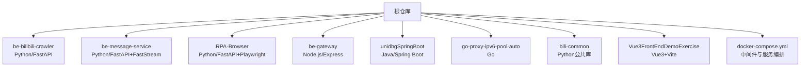
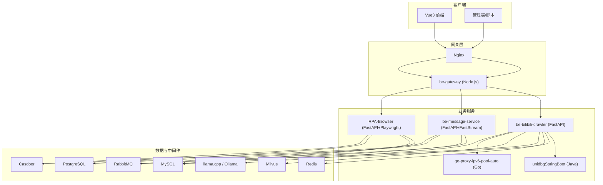
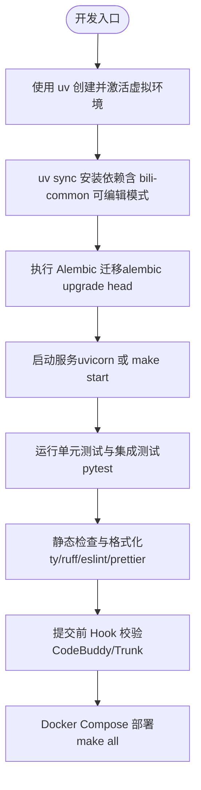
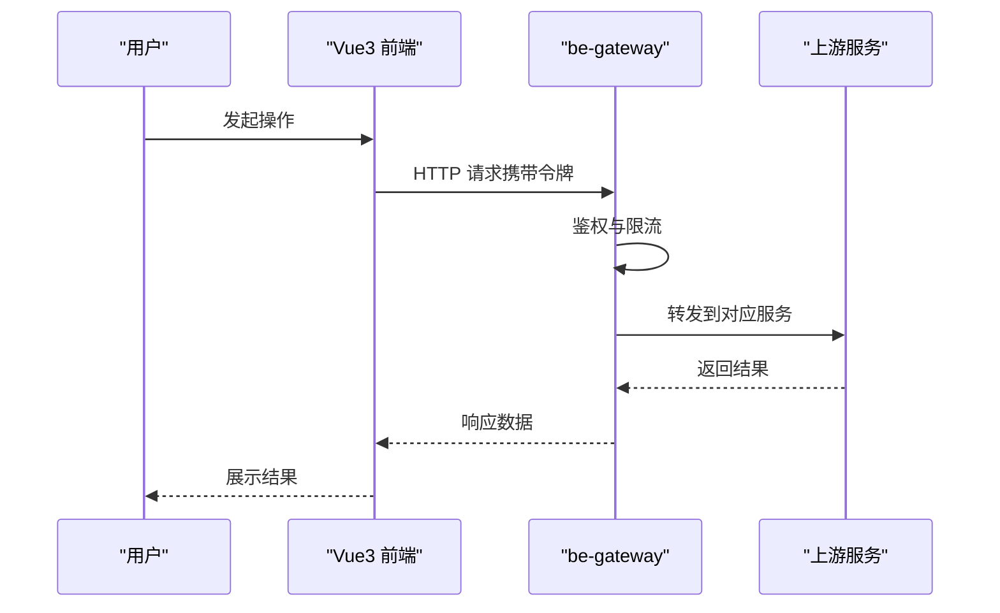
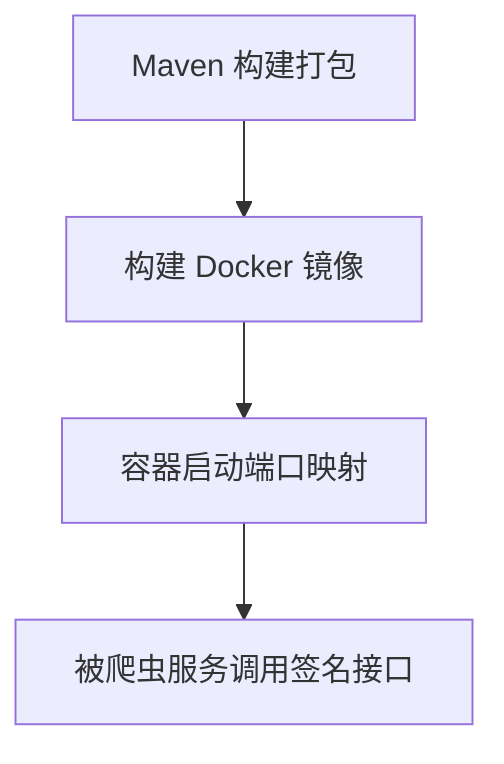
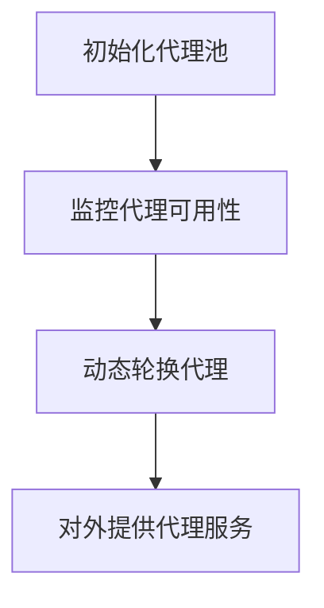
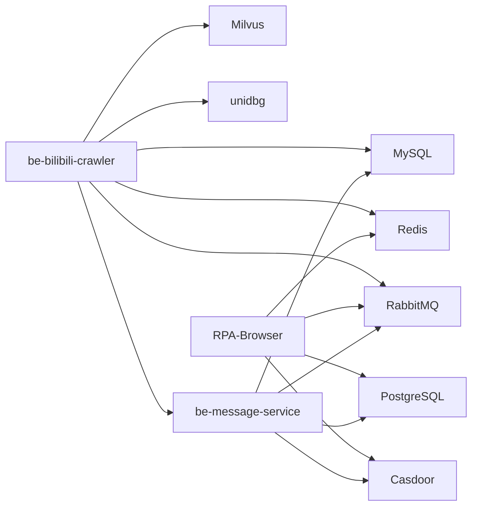

# 开发指南

<cite>
**本文引用的文件**
- [README.md](file://README.md)
- [Makefile](file://Makefile)
- [docker-compose.yml](file://docker-compose.yml)
- [Dockerfile.mono](file://Dockerfile.mono)
- [RPA-Browser/pyproject.toml](file://RPA-Browser/pyproject.toml)
- [be-bilibili-crawler/pyproject.toml](file://be-bilibili-crawler/pyproject.toml)
- [be-message-service/pyproject.toml](file://be-message-service/pyproject.toml)
- [bili-common/pyproject.toml](file://bili-common/pyproject.toml)
- [Vue3FrontEndDemoExercise/package.json](file://Vue3FrontEndDemoExercise/package.json)
- [.codebuddy/rules/python-venv-activation.mdc](file://.codebuddy/rules/python-venv-activation.mdc)
- [.codebuddy/rules/vue前端项目规范.mdc](file://.codebuddy/rules/vue前端项目规范.mdc)
</cite>

## 目录
1. [简介](#简介)
2. [项目结构](#项目结构)
3. [核心组件](#核心组件)
4. [架构总览](#架构总览)
5. [详细组件分析](#详细组件分析)
6. [依赖关系分析](#依赖关系分析)
7. [性能考量](#性能考量)
8. [故障排查指南](#故障排查指南)
9. [结论](#结论)
10. [附录](#附录)

## 简介
本指南面向多语言微服务项目的开发者，覆盖本地开发环境搭建、代码规范、测试策略与覆盖率要求、代码审查流程、版本管理与发布流程，以及常见问题调试与性能分析方法。项目由多个子工程组成：Python（FastAPI/Playwright/FastStream）、Node.js（Express/Vue3 前端）、Java（Spring Boot 签名计算）、Go（IPv6 代理池），并通过 Docker Compose 统一编排中间件与服务。

## 项目结构
根仓库通过 git submodule 聚合各微服务，使用 Makefile 与 docker-compose.yml 进行一键启动、停止、日志查看等运维操作；Python 子工程使用 uv 管理环境与依赖，前端使用 pnpm + Vite 构建。

**图示来源**
- [docker-compose.yml:120-309](file://docker-compose.yml#L120-L309)
- [README.md:12-23](file://README.md#L12-L23)

**章节来源**
- [README.md:12-52](file://README.md#L12-L52)
- [Makefile:1-71](file://Makefile#L1-L71)
- [docker-compose.yml:1-380](file://docker-compose.yml#L1-L380)

## 核心组件
- Python 后端服务
  - be-bilibili-crawler：核心爬虫后端与数据 API，依赖 MySQL、Redis、RabbitMQ、Milvus、unidbg 等。
  - be-message-service：统一消息推送微服务，基于 FastStream + RabbitMQ，提供系统通知、事件提醒、私信与消息设置能力。
  - RPA-Browser：浏览器自动化服务，基于 Playwright/Patchright，支持浏览器指纹、验证码处理、录制回放等。
  - bili-common：被多个 Python 服务复用的公共模型与工具包。
- Node.js 网关与前端
  - be-gateway：Express 网关，负责鉴权、路由转发、与上游服务交互。
  - Vue3FrontEndDemoExercise：Vue3 + Tailwind 前端，提供用户界面与交互。
- Java 签名服务
  - unidbgSpringBoot：B 站签名计算服务，供爬虫等服务调用。
- Go 代理池
  - go-proxy-ipv6-pool-auto：自动 IPv6 代理池，为请求提供高可用代理出口。

**章节来源**
- [README.md:12-34](file://README.md#L12-L34)
- [docker-compose.yml:120-309](file://docker-compose.yml#L120-L309)

## 架构总览
下图展示了主要服务之间的依赖与通信关系，包括数据库、缓存、消息队列、向量检索、认证与网关等。

**图示来源**
- [docker-compose.yml:68-178](file://docker-compose.yml#L68-L178)
- [docker-compose.yml:179-226](file://docker-compose.yml#L179-L226)
- [docker-compose.yml:227-309](file://docker-compose.yml#L227-L309)
- [docker-compose.yml:323-371](file://docker-compose.yml#L323-L371)

## 详细组件分析

### Python 后端开发工作流（FastAPI）
- 环境管理
  - 所有 Python 子工程使用 uv 管理虚拟环境与依赖，禁止直接使用系统 Python 或 pip。
  - 本地开发时 bili-common 以 editable 方式引入，便于即时修改生效；Docker 构建时按非 editable 安装以保证可移植性。
- 依赖与索引
  - 各 pyproject.toml 配置了国内镜像源（阿里云、腾讯云、清华等），提升依赖下载速度。
  - 测试依赖通过 dependency-groups 或 optional-dependencies 组织，便于按需安装。
- 异步与任务
  - 使用 FastAPI + Uvicorn 提供 HTTP API；FastStream 集成 RabbitMQ 实现消息消费与生产；APScheduler 用于定时任务。
- 数据库与迁移
  - SQLModel + SQLAlchemy 作为 ORM；Alembic 管理数据库迁移；不同服务分别维护各自的 alembic 目录与配置。
- 国际化与配置
  - fastapi-i18n 提供多语言支持；pydantic-settings 与环境变量结合进行配置管理。

**图示来源**
- [be-bilibili-crawler/pyproject.toml:70-129](file://be-bilibili-crawler/pyproject.toml#L70-L129)
- [be-message-service/pyproject.toml:42-85](file://be-message-service/pyproject.toml#L42-L85)
- [RPA-Browser/pyproject.toml:50-75](file://RPA-Browser/pyproject.toml#L50-L75)
- [Makefile:20-71](file://Makefile#L20-L71)

**章节来源**
- [be-bilibili-crawler/pyproject.toml:1-129](file://be-bilibili-crawler/pyproject.toml#L1-L129)
- [be-message-service/pyproject.toml:1-85](file://be-message-service/pyproject.toml#L1-L85)
- [RPA-Browser/pyproject.toml:1-75](file://RPA-Browser/pyproject.toml#L1-L75)
- [bili-common/pyproject.toml:1-22](file://bili-common/pyproject.toml#L1-L22)
- [.codebuddy/rules/python-venv-activation.mdc:1-7](file://.codebuddy/rules/python-venv-activation.mdc#L1-L7)

### Node.js 网关与前端工作流（Express + Vue3）
- 网关（be-gateway）
  - Express 应用，负责鉴权、路由转发、与上游服务交互；使用 Sequelize 管理 Postgres 迁移；PM2 进程管理。
- 前端（Vue3FrontEndDemoExercise）
  - 使用 Vite 构建，Tailwind CSS 样式，Element Plus 组件；ESLint + Prettier 保证代码风格；GraphQL Codegen 生成类型化查询。
- 脚本与命令
  - package.json 中定义了 dev/build/lint/format/type-check/graphqlgen 等常用命令，便于开发与交付。

**图示来源**
- [Vue3FrontEndDemoExercise/package.json:6-17](file://Vue3FrontEndDemoExercise/package.json#L6-L17)
- [docker-compose.yml:179-226](file://docker-compose.yml#L179-L226)

**章节来源**
- [Vue3FrontEndDemoExercise/package.json:1-95](file://Vue3FrontEndDemoExercise/package.json#L1-L95)
- [docker-compose.yml:179-226](file://docker-compose.yml#L179-L226)

### Java 签名服务（Spring Boot）
- 角色与职责
  - 提供 B 站签名计算能力，供爬虫等服务调用；通过 Docker 镜像独立部署。
- 构建与运行
  - Maven 构建；端口映射至宿主机；环境变量控制时区等。

**图示来源**
- [docker-compose.yml:110-119](file://docker-compose.yml#L110-L119)

**章节来源**
- [docker-compose.yml:110-119](file://docker-compose.yml#L110-L119)

### Go 代理池（IPv6）
- 角色与职责
  - 自动管理 IPv6 代理池，为请求提供高可用出口；可通过 PM2 或 Docker 运行。
- 构建与运行
  - go mod 管理依赖；编译后直接运行或通过容器部署。

**图示来源**
- [README.md:84-85](file://README.md#L84-L85)

**章节来源**
- [README.md:84-85](file://README.md#L84-L85)

## 依赖关系分析
- 服务间耦合
  - be-bilibili-crawler 强依赖 MySQL、Redis、RabbitMQ、Milvus、unidbg、message-service；RPA-Browser 依赖 PostgreSQL、Redis、RabbitMQ、Casdoor。
  - be-message-service 依赖 RabbitMQ、MySQL、PostgreSQL（只读）、Casdoor。
- 外部依赖
  - Milvus 依赖 etcd 与 MinIO；Nginx 作为反向代理；LLM 服务可选启用。
- 共享库
  - bili-common 被多个 Python 服务复用，提供统一模型与工具。

**图示来源**
- [docker-compose.yml:68-178](file://docker-compose.yml#L68-L178)
- [docker-compose.yml:179-309](file://docker-compose.yml#L179-L309)

**章节来源**
- [docker-compose.yml:68-309](file://docker-compose.yml#L68-L309)

## 性能考量
- 资源限制
  - 爬虫服务在容器中设置了内存上限（5G），避免占用过多宿主资源。
- 中间件健康检查
  - etcd、MinIO、Milvus、message-service 均配置了健康检查，确保服务就绪后再启动依赖服务。
- 网络与存储
  - 使用命名卷保存 node_modules 与 Chrome 应用，减少重复下载与挂载覆盖问题。
- 并发与异步
  - Python 服务采用异步 IO（aiomysql、aiofiles、httpx 等），提高吞吐；RabbitMQ 解耦消息处理。

**章节来源**
- [docker-compose.yml:120-164](file://docker-compose.yml#L120-L164)
- [docker-compose.yml:1-67](file://docker-compose.yml#L1-L67)
- [docker-compose.yml:179-226](file://docker-compose.yml#L179-L226)

## 故障排查指南
- 常见环境问题
  - Milvus 无法读写：调整数据卷权限（chown 999:999）。
  - WSL2 网络问题：重启 winnat。
  - PyLance 插件兼容：手动安装指定版本。
- 服务启动失败
  - 使用 make logs SERVICE=xxx 查看具体服务日志；检查环境变量与依赖服务是否就绪。
- 数据库与迁移
  - 确认 Alembic 迁移已执行；检查数据库连接字符串与密码。
- 消息队列
  - 检查 RabbitMQ 账号密码与网络连通；确认消费者是否正确订阅队列。
- 前端构建
  - 使用 npm/pnpm 的 lint/format/type-check 命令定位问题；清理 node_modules 后重试。

**章节来源**
- [README.md:116-121](file://README.md#L116-L121)
- [Makefile:42-60](file://Makefile#L42-L60)

## 结论
本项目通过多语言微服务与 Docker Compose 实现了数据采集、自动化、消息推送与前端网关的一体化解决方案。遵循统一的开发规范（uv 环境管理、ESLint/Prettier、Alembic 迁移、FastStream 消息驱动），配合完善的测试与发布流程，能够高效支撑业务迭代与扩展。建议在新功能开发中严格遵循代码规范与测试策略，确保质量与可维护性。

## 附录

### 开发环境搭建
- 克隆与初始化
  - 使用 --recurse-submodules 克隆仓库，或执行 make submodule-init。
- 安装依赖
  - Python：pip install uv 后在各子工程执行 uv sync。
  - Node：进入 be-gateway 与 Vue3FrontEndDemoExercise 执行 npm install（或 pnpm install）。
  - Java：执行 ./mvnw clean package。
  - Go：go mod download 并构建。
- 启动服务
  - 使用 make all 或 docker compose up -d 启动全部服务；也可选择性启动（如 exclude fastapi）。

**章节来源**
- [README.md:54-95](file://README.md#L54-L95)
- [Makefile:20-71](file://Makefile#L20-L71)

### 代码规范
- Python
  - 统一使用 uv 管理环境与运行代码；优先使用 Python 3.13 语法与类型提示。
- Vue/TS
  - 样式强制使用 Tailwind 原子类，禁止内联样式与 <style> 块；主题变量集中管理；外链跳转统一策略防止 Referer 泄露。
- 前端接口
  - 遵循接口规范文档（trae/rules），保持前后端契约一致。

**章节来源**
- [.codebuddy/rules/python-venv-activation.mdc:1-7](file://.codebuddy/rules/python-venv-activation.mdc#L1-L7)
- [.codebuddy/rules/vue前端项目规范.mdc:1-91](file://.codebuddy/rules/vue前端项目规范.mdc#L1-L91)

### 测试策略与覆盖率
- Python
  - 使用 pytest 与 pytest-asyncio；可选 pytest-cov 统计覆盖率；testpaths 指向 test 或 tests 目录。
- Node
  - 可使用 Jest/Mocha 等框架（根据实际项目配置）；前端可使用 Playwright 进行端到端测试。
- 覆盖率要求
  - 建议核心模块覆盖率不低于 80%，关键路径（登录、支付、消息发送）达到 90% 以上。

**章节来源**
- [be-bilibili-crawler/pyproject.toml:73-96](file://be-bilibili-crawler/pyproject.toml#L73-L96)
- [be-message-service/pyproject.toml:65-76](file://be-message-service/pyproject.toml#L65-L76)
- [RPA-Browser/pyproject.toml:40-48](file://RPA-Browser/pyproject.toml#L40-L48)

### 代码审查流程
- 提交前 Hook
  - 使用 CodeBuddy/Trunk 进行静态检查与格式化；确保 lint/format 通过。
- 评审要点
  - 接口契约一致性、错误处理完整性、日志与埋点、性能与安全（注入、越权、敏感信息）。
- 合并策略
  - 分支保护与 PR 审核；CI 流水线通过后合并。

**章节来源**
- [.codebuddy/rules/vue前端项目规范.mdc:1-91](file://.codebuddy/rules/vue前端项目规范.mdc#L1-L91)
- [Makefile:63-71](file://Makefile#L63-L71)

### 版本管理与发布流程
- 版本管理
  - 使用 Git 分支模型（feature/fix/release）；tag 标记版本；submodule 同步远端最新。
- 发布流程
  - 构建 Docker 镜像（Dockerfile.mono 多阶段构建）；推送镜像到仓库；更新 docker-compose 配置；灰度发布与回滚策略。
- 自动化
  - GitHub Workflow 触发镜像构建；pm2 管理进程；日志收集与分析。

**章节来源**
- [README.md:9-11](file://README.md#L9-L11)
- [docker-compose.yml:152-164](file://docker-compose.yml#L152-L164)
- [Makefile:63-71](file://Makefile#L63-L71)

### 调试技巧与性能分析
- 调试
  - 使用 make logs 查看服务日志；本地启动单个服务快速验证；断点调试（IDE 配置 uv 环境）。
- 性能分析
  - 使用 cProfile/py-spy 分析 Python 热点；前端使用浏览器开发者工具与 Lighthouse；数据库慢查询分析。
- 中间件
  - 检查 Redis/MQ/DB 连接池与超时配置；监控 Milvus 与 etcd 状态。

**章节来源**
- [Makefile:42-60](file://Makefile#L42-L60)
- [docker-compose.yml:1-67](file://docker-compose.yml#L1-L67)