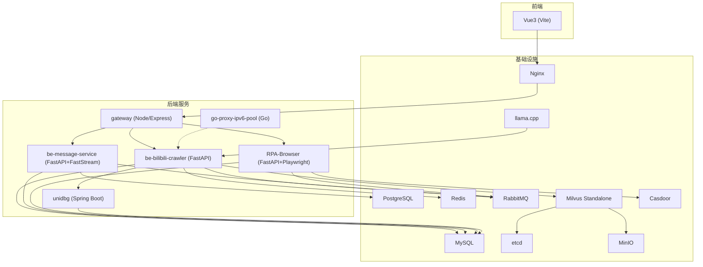
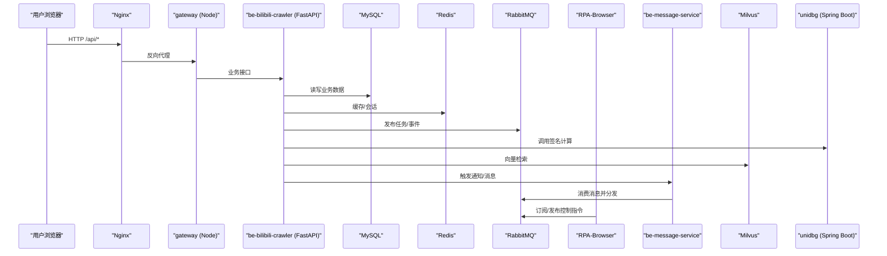
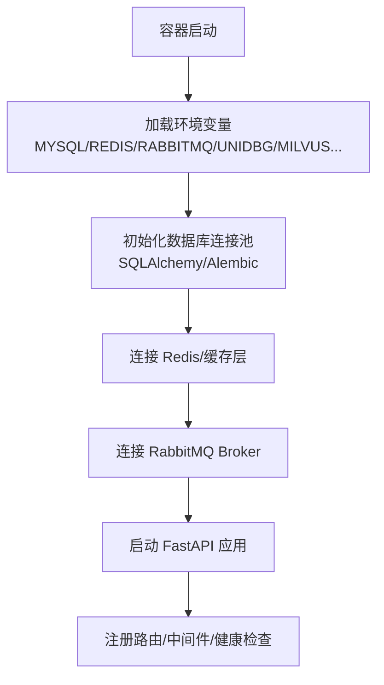
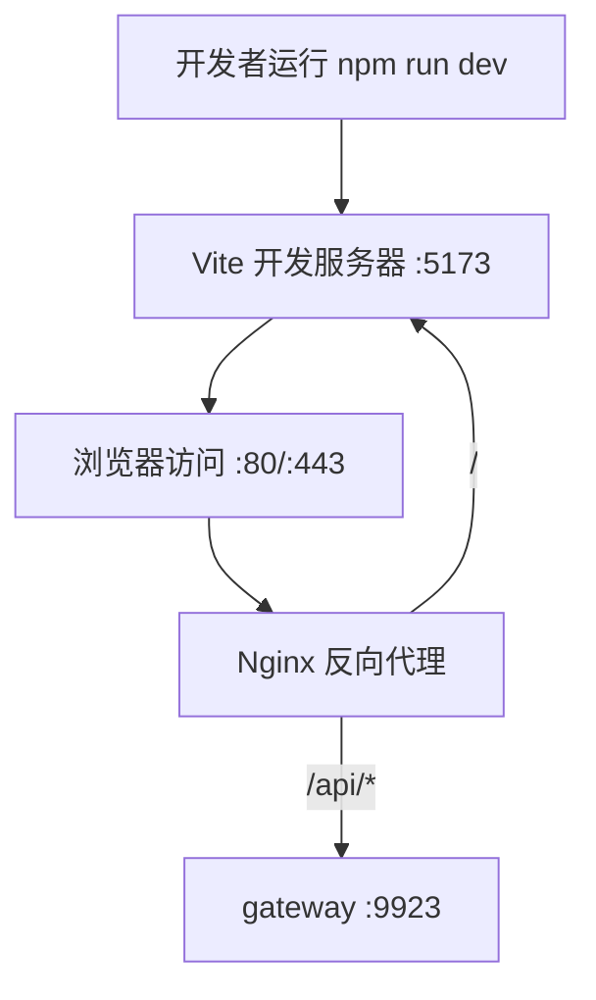
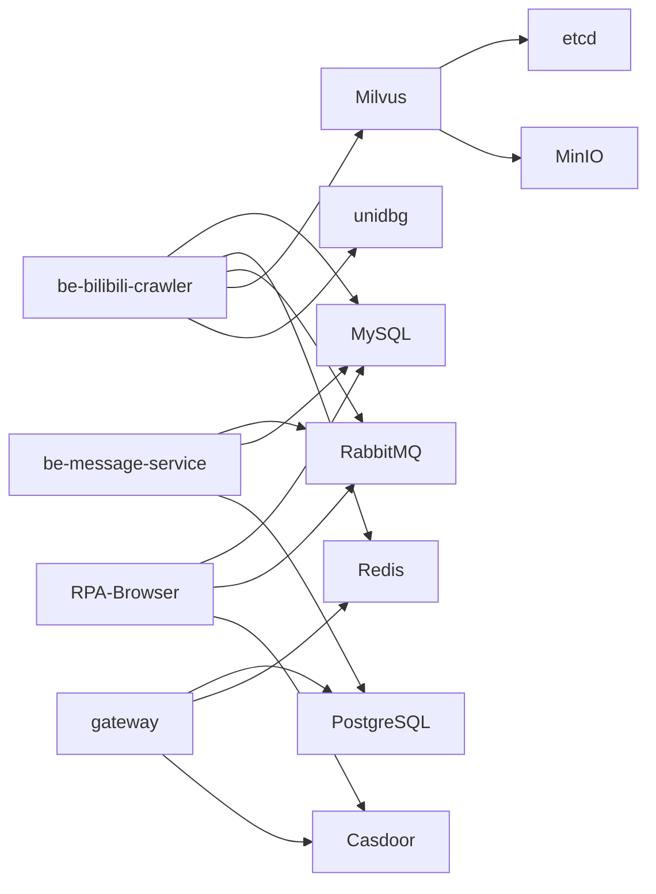

# 开发环境搭建

<cite>
**本文引用的文件**
- [docker-compose.yml](file://docker-compose.yml)
- [dc-dev.yml](file://dc-dev.yml)
- [Makefile](file://Makefile)
- [README.md](file://README.md)
- [be-bilibili-crawler/pyproject.toml](file://be-bilibili-crawler/pyproject.toml)
- [RPA-Browser/pyproject.toml](file://RPA-Browser/pyproject.toml)
- [be-message-service/pyproject.toml](file://be-message-service/pyproject.toml)
- [Vue3FrontEndDemoExercise/package.json](file://Vue3FrontEndDemoExercise/package.json)
- [unidbgSpringBoot/pom.xml](file://unidbgSpringBoot/pom.xml)
- [go-proxy-ipv6-pool-auto/go-proxy-ipv6-pool/go.mod](file://go-proxy-ipv6-pool-auto/go-proxy-ipv6-pool/go.mod)
- [docker_vol/mysql_data/conf.d/custom_mysql.cnf](file://docker_vol/mysql_data/conf.d/custom_mysql.cnf)
- [docker_vol/nginx/conf/nginx.conf](file://docker_vol/nginx/conf/nginx.conf)
- [be-bilibili-crawler/CONFIG.py](file://be-bilibili-crawler/CONFIG.py)
</cite>

## 目录
1. [简介](#简介)
2. [项目结构](#项目结构)
3. [核心组件](#核心组件)
4. [架构总览](#架构总览)
5. [详细组件分析](#详细组件分析)
6. [依赖关系分析](#依赖关系分析)
7. [性能与容量建议](#性能与容量建议)
8. [故障排查指南](#故障排查指南)
9. [结论](#结论)
10. [附录：环境变量与一键脚本](#附录：环境变量与一键脚本)

## 简介
本指南面向多语言微服务项目的本地开发环境搭建，覆盖 Python（FastAPI）、JavaScript/TypeScript（Vue3）、Java（Spring Boot）、Go 等语言的依赖安装与环境配置；提供 Docker Compose 服务启动、数据库初始化、Redis 与 RabbitMQ 等中间件配置说明；给出环境变量配置、IDE 推荐与开发工具链设置；并附带常见环境问题的一键部署脚本使用方法和排障指引。

## 项目结构
仓库采用 monorepo + git submodule 组织多个微服务，通过 Docker Compose 统一编排基础设施与应用服务。关键要点：
- 基础设施：MySQL、PostgreSQL、Redis、RabbitMQ、Milvus（etcd/minio/standalone）、Casdoor、Nginx、llama.cpp（CPU/GPU）
- 应用服务：be-bilibili-crawler（Python/FastAPI）、be-message-service（Python/FastAPI+FastStream）、RPA-Browser（Python/FastAPI+Playwright）、gateway（Node.js/Express）、unidbg（Java/Spring Boot）、go-proxy-ipv6-pool（Go）
- 前端：Vue3 工程（Vite），由 Nginx 反向代理到 Vite 开发服务器
- 数据卷：docker_vol 下集中管理各中间件数据与配置

图表来源
- [docker-compose.yml:1-380](file://docker-compose.yml#L1-L380)
- [docker_vol/nginx/conf/nginx.conf:1-71](file://docker_vol/nginx/conf/nginx.conf#L1-L71)

章节来源
- [README.md:12-35](file://README.md#L12-L35)
- [docker-compose.yml:1-380](file://docker-compose.yml#L1-L380)

## 核心组件
- Python 后端（FastAPI）
  - be-bilibili-crawler：核心爬虫与数据 API，依赖 MySQL、Redis、RabbitMQ、Milvus、unidbg、message-service
  - be-message-service：统一消息推送（RabbitMQ + FastStream），依赖 MySQL、PostgreSQL（只读）、Casdoor
  - RPA-Browser：浏览器自动化（Playwright/Patchright），依赖 MySQL、RabbitMQ、Casdoor
  - 公共库 bili-common：被上述 Python 服务复用
- Node.js/Express 网关（gateway）：聚合路由、鉴权（Casdoor）、转发至后端服务
- Java Spring Boot（unidbg）：签名计算服务，供 Python 服务调用
- Go 代理池（go-proxy-ipv6-pool）：IPv6 代理池，PM2 进程守护
- 前端 Vue3：Vite 开发服务器，Nginx 反向代理静态资源与 API
- 中间件：MySQL、PostgreSQL、Redis、RabbitMQ、Milvus（etcd/minio）、Casdoor、Nginx、llama.cpp

章节来源
- [README.md:12-35](file://README.md#L12-L35)
- [be-bilibili-crawler/pyproject.toml:1-129](file://be-bilibili-crawler/pyproject.toml#L1-L129)
- [be-message-service/pyproject.toml:1-85](file://be-message-service/pyproject.toml#L1-L85)
- [RPA-Browser/pyproject.toml:1-75](file://RPA-Browser/pyproject.toml#L1-L75)
- [Vue3FrontEndDemoExercise/package.json:1-95](file://Vue3FrontEndDemoExercise/package.json#L1-L95)
- [unidbgSpringBoot/pom.xml:1-133](file://unidbgSpringBoot/pom.xml#L1-L133)
- [go-proxy-ipv6-pool-auto/go-proxy-ipv6-pool/go.mod:1-12](file://go-proxy-ipv6-pool-auto/go-proxy-ipv6-pool/go.mod#L1-L12)

## 架构总览
下图展示请求从浏览器到网关、再到后端服务及中间件的完整链路，以及向量检索与消息队列的交互。

图表来源
- [docker-compose.yml:120-164](file://docker-compose.yml#L120-L164)
- [docker-compose.yml:227-260](file://docker-compose.yml#L227-L260)
- [docker-compose.yml:261-309](file://docker-compose.yml#L261-L309)
- [docker-compose.yml:179-212](file://docker-compose.yml#L179-L212)
- [docker_vol/nginx/conf/nginx.conf:30-48](file://docker_vol/nginx/conf/nginx.conf#L30-L48)

## 详细组件分析

### Python（FastAPI）服务与环境
- 依赖管理与镜像构建
  - 使用 uv 同步依赖，pyproject.toml 中声明依赖与索引源，支持本地 bili-common 包以 editable 方式解析
  - Docker 多阶段构建目标：crawler、rpa、message，分别对应不同服务
- 运行时配置
  - 通过环境变量注入数据库、缓存、消息队列、外部服务地址与密钥
  - be-bilibili-crawler 的 Settings 集中读取 .env 文件与环境变量，构造数据库连接、RabbitMQ URL、LLM 端点等
- 典型依赖
  - FastAPI、SQLModel、Alembic、aiomysql、redis、faststream[rabbit]、playwright/patchright、pymilvus、langchain 系列

图表来源
- [be-bilibili-crawler/CONFIG.py:225-277](file://be-bilibili-crawler/CONFIG.py#L225-L277)
- [be-bilibili-crawler/pyproject.toml:1-129](file://be-bilibili-crawler/pyproject.toml#L1-L129)
- [docker-compose.yml:120-164](file://docker-compose.yml#L120-L164)

章节来源
- [be-bilibili-crawler/pyproject.toml:1-129](file://be-bilibili-crawler/pyproject.toml#L1-L129)
- [RPA-Browser/pyproject.toml:1-75](file://RPA-Browser/pyproject.toml#L1-L75)
- [be-message-service/pyproject.toml:1-85](file://be-message-service/pyproject.toml#L1-L85)
- [be-bilibili-crawler/CONFIG.py:225-277](file://be-bilibili-crawler/CONFIG.py#L225-L277)

### JavaScript/TypeScript（Vue3）前端
- 开发与构建
  - 使用 Vite 作为构建工具，scripts 提供 dev/build/preview/type-check/lint/format 等命令
  - 依赖管理使用 pnpm（packageManager 指定版本）
- 集成
  - 通过 Nginx 将 / 反向代理到 Vite 开发服务器（端口 5173），/api/* 转发到 gateway
  - 支持 GraphQL Codegen、Tailwind、Element Plus、ECharts 等生态

图表来源
- [Vue3FrontEndDemoExercise/package.json:6-18](file://Vue3FrontEndDemoExercise/package.json#L6-L18)
- [docker_vol/nginx/conf/nginx.conf:30-48](file://docker_vol/nginx/conf/nginx.conf#L30-L48)

章节来源
- [Vue3FrontEndDemoExercise/package.json:1-95](file://Vue3FrontEndDemoExercise/package.json#L1-L95)
- [docker_vol/nginx/conf/nginx.conf:1-71](file://docker_vol/nginx/conf/nginx.conf#L1-L71)

### Java（Spring Boot）签名服务
- 技术栈
  - Spring Boot 3.x，Java 21，集成 unidbg 进行签名计算
  - 构建产物镜像名：unidbg-springboot-samsclub
- 运行方式
  - 通过 docker-compose 以 unidbg 服务暴露端口，供 Python 服务调用

章节来源
- [unidbgSpringBoot/pom.xml:1-133](file://unidbgSpringBoot/pom.xml#L1-L133)
- [docker-compose.yml:110-119](file://docker-compose.yml#L110-L119)

### Go 代理池
- 模块与依赖
  - go.mod 定义模块名与依赖（socks5、goproxy、godotenv）
- 运行方式
  - 可通过 pm2 或系统服务常驻，配合 IPv6 网络能力

章节来源
- [go-proxy-ipv6-pool-auto/go-proxy-ipv6-pool/go.mod:1-12](file://go-proxy-ipv6-pool-auto/go-proxy-ipv6-pool/go.mod#L1-L12)
- [README.md:84-86](file://README.md#L84-L86)

## 依赖关系分析
- 服务间依赖
  - be-bilibili-crawler 依赖 MySQL、Redis、RabbitMQ、Milvus、unidbg、message-service
  - be-message-service 依赖 RabbitMQ、MySQL、PostgreSQL（只读）、Casdoor
  - RPA-Browser 依赖 MySQL、RabbitMQ、Casdoor
  - gateway 依赖 PostgreSQL、Redis、Casdoor
- 中间件依赖
  - Milvus 依赖 etcd 与 MinIO
  - Nginx 反向代理前端与网关

图表来源
- [docker-compose.yml:68-119](file://docker-compose.yml#L68-L119)
- [docker-compose.yml:120-164](file://docker-compose.yml#L120-L164)
- [docker-compose.yml:165-212](file://docker-compose.yml#L165-L212)
- [docker-compose.yml:227-309](file://docker-compose.yml#L227-L309)

章节来源
- [docker-compose.yml:1-380](file://docker-compose.yml#L1-L380)

## 性能与容量建议
- MySQL 优化
  - 关闭 Binlog 与冗余日志，降低内存占用
  - 调整连接数、超时、InnoDB 缓冲池大小与 IO 线程
  - 谨慎设置 per-connection 缓冲区，避免 OOM
- 连接池与回收
  - SQLAlchemy 连接池启用 pre_ping 与合理 recycle，避免陈旧连接导致断连
- 向量检索
  - Milvus 存储卷权限需正确（如 chown 999:999），确保可写
- 前端与网关
  - Nginx worker_connections 与 HMR WebSocket 升级头配置保障开发体验

章节来源
- [docker_vol/mysql_data/conf.d/custom_mysql.cnf:1-67](file://docker_vol/mysql_data/conf.d/custom_mysql.cnf#L1-L67)
- [be-bilibili-crawler/CONFIG.py:381-419](file://be-bilibili-crawler/CONFIG.py#L381-L419)
- [docker_vol/nginx/conf/nginx.conf:1-71](file://docker_vol/nginx/conf/nginx.conf#L1-L71)
- [README.md:118-120](file://README.md#L118-L120)

## 故障排查指南
- 常见问题
  - Milvus 无法读写：修复数据卷权限（chown 999:999）
  - WSL2 网络问题：重启 winnat
  - IDE pylance 兼容：手动安装指定版本
- 服务健康检查
  - message-service 提供 /health 探活，未连接 broker 返回 503
- 日志查看
  - 使用 Makefile 提供的 logs 命令按服务过滤查看日志
- 端口冲突
  - 检查 docker-compose 映射端口是否被占用（MySQL/Redis/RabbitMQ/Postgres/Nginx 等）

章节来源
- [README.md:116-121](file://README.md#L116-L121)
- [docker-compose.yml:310-322](file://docker-compose.yml#L310-L322)
- [Makefile:42-52](file://Makefile#L42-L52)

## 结论
本项目通过 Docker Compose 将多语言微服务与中间件一体化编排，结合 uv、pnpm、Maven、Go 工具链完成依赖管理。按照本指南完成环境准备后，可使用 Makefile 或 docker-compose 快速启动全部服务，并通过 Nginx 统一入口访问前端与后端 API。建议在开发过程中关注数据库连接池、中间件健康检查与日志定位，以提升调试效率。

## 附录：环境变量与一键脚本

### 环境变量清单（节选）
- 通用
  - ENV_TZ：时区
- 数据库
  - MYSQL_PASSWORD、POSTGRES_USER、POSTGRES_PASSWORD
- 缓存与消息
  - REDIS_PORT、RABBITMQ_USER、RABBITMQ_PASSWORD、RABBITMQ_PORT、RABBITMQ_WEBUI_PORT
- 服务地址
  - MILVUS_PORT、FASTAPI_PORT、MESSAGE_SERVICE_PORT、NODEJS_PPTR_PORT、CASDOOR_PORT、LLAMA_PORT
- 认证与回调
  - CASDOOR_ENDPOINT、CASDOOR_CLIENT_ID、CASDOOR_CLIENT_SECRET、CASDOOR_ORGANIZATION、CASDOOR_APPLICATION、CASDOOR_REDIRECT_URI、CASDOOR_CERTIFICATE
- 其他
  - SERVER_NAME、SERVER_ADDRESS、PROXY_SERVER、V2RAY_HOST、MESSAGE_CONFIG、SHOW_LOG、IS_DEV、LOG_LEVEL

章节来源
- [docker-compose.yml:68-119](file://docker-compose.yml#L68-L119)
- [docker-compose.yml:120-164](file://docker-compose.yml#L120-L164)
- [docker-compose.yml:165-212](file://docker-compose.yml#L165-L212)
- [docker-compose.yml:227-309](file://docker-compose.yml#L227-L309)
- [be-bilibili-crawler/CONFIG.py:225-277](file://be-bilibili-crawler/CONFIG.py#L225-L277)

### 一键部署与常用命令
- 初始化子模块
  - make submodule-init
- 启动所有服务
  - make all 或 make start
- 仅启动非 FastAPI 服务（便于单独调试）
  - make start-excluding-fastapi
- 停止/重启/清理
  - make stop / make restart / make down / make clean
- 查看日志
  - make logs 或 make logs SERVICE=xxx
- 更新子模块
  - make update

章节来源
- [Makefile:1-71](file://Makefile#L1-L71)
- [README.md:54-70](file://README.md#L54-L70)
- [README.md:97-110](file://README.md#L97-L110)

### 本地开发工具链建议
- Python
  - 安装 uv 并使用 pyproject.toml 同步依赖；IDE 建议使用 VSCode + Python 插件；注意 pylance 版本兼容性
- Node.js/TypeScript
  - 使用 pnpm 安装依赖；Vite 开发模式；ESLint/Prettier 格式化
- Java
  - 使用 Maven Wrapper 构建；JDK 21；Spring Boot 3.x
- Go
  - 安装 Go 工具链；go mod download 并构建；必要时安装 ndppd 并开启 IPv6 绑定

章节来源
- [README.md:71-95](file://README.md#L71-L95)
- [be-bilibili-crawler/pyproject.toml:70-129](file://be-bilibili-crawler/pyproject.toml#L70-L129)
- [Vue3FrontEndDemoExercise/package.json:6-18](file://Vue3FrontEndDemoExercise/package.json#L6-L18)
- [unidbgSpringBoot/pom.xml:17-20](file://unidbgSpringBoot/pom.xml#L17-L20)
- [go-proxy-ipv6-pool-auto/go-proxy-ipv6-pool/go.mod:1-12](file://go-proxy-ipv6-pool-auto/go-proxy-ipv6-pool/go.mod#L1-L12)