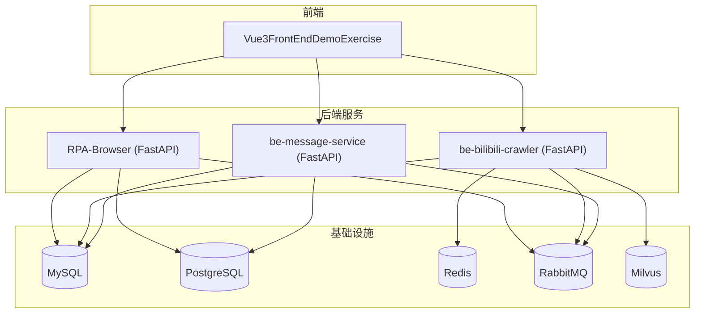
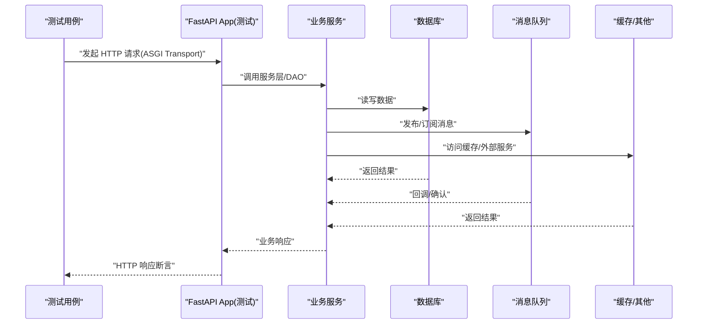
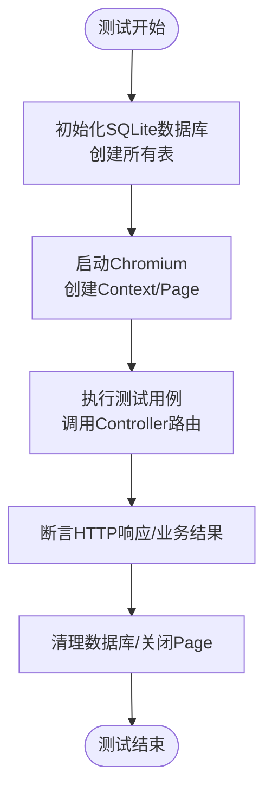
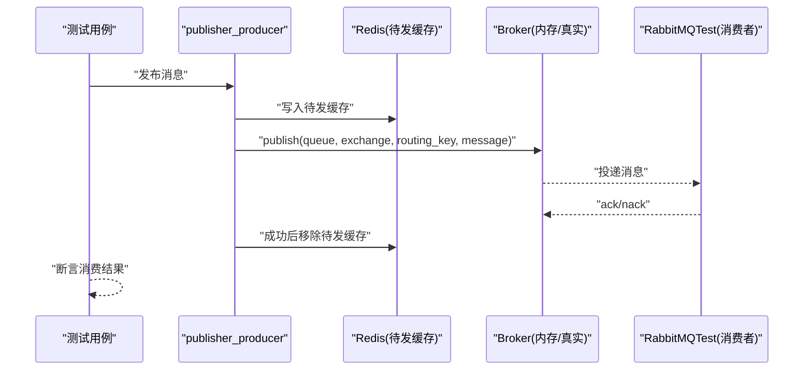
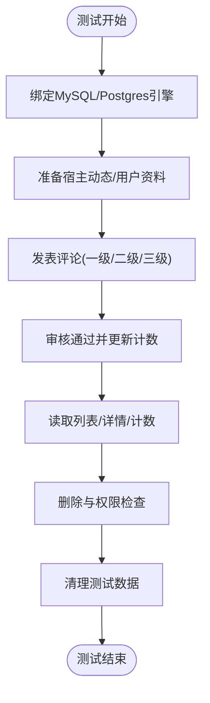
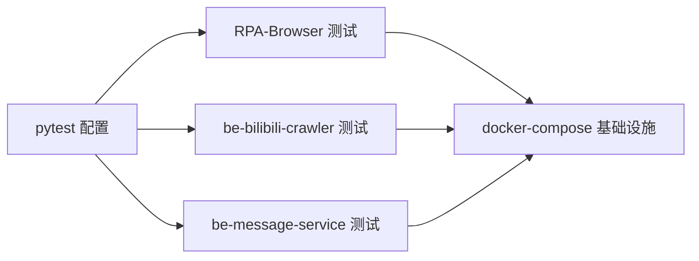

# 测试指南

<cite>
**本文引用的文件**
- [RPA-Browser/pytest.ini](file://RPA-Browser/pytest.ini)
- [RPA-Browser/pyproject.toml](file://RPA-Browser/pyproject.toml)
- [RPA-Browser/test/conftest.py](file://RPA-Browser/test/conftest.py)
- [RPA-Browser/test/controller/conftest.py](file://RPA-Browser/test/controller/conftest.py)
- [be-bilibili-crawler/test/conftest.py](file://be-bilibili-crawler/test/conftest.py)
- [be-bilibili-crawler/test/test_mq.py](file://be-bilibili-crawler/test/test_mq.py)
- [be-message-service/tests/test_comment_crud.py](file://be-message-service/tests/test_comment_crud.py)
- [be-message-service/tests/test_push_channels.py](file://be-message-service/tests/test_push_channels.py)
- [be-message-service/pyproject.toml](file://be-message-service/pyproject.toml)
- [Vue3FrontEndDemoExercise/package.json](file://Vue3FrontEndDemoExercise/package.json)
- [docker-compose.yml](file://docker-compose.yml)
</cite>

## 目录
1. [简介](#简介)
2. [项目结构](#项目结构)
3. [核心组件](#核心组件)
4. [架构总览](#架构总览)
5. [详细组件分析](#详细组件分析)
6. [依赖关系分析](#依赖关系分析)
7. [性能考虑](#性能考虑)
8. [故障排查指南](#故障排查指南)
9. [结论](#结论)
10. [附录](#附录)

## 简介
本指南面向本仓库的多语言、多服务微服务项目，提供覆盖单元测试、集成测试、端到端（E2E）测试的完整策略与落地实践。重点包括：
- Python 侧使用 pytest 进行单元与集成测试，结合 httpx ASGI 客户端对 FastAPI 路由进行接口测试；结合 Playwright 进行浏览器自动化测试。
- 前端 Vue3 工程基于 Vite，已引入 Playwright，可用于 E2E 场景。
- 消息队列（RabbitMQ）链路采用“单元测试 + 可选集成测试”双模式，通过环境变量开关控制是否连接真实 MQ。
- 数据库测试以 MySQL/Postgres 为主，部分模块在测试中切换为 SQLite 以降低依赖。
- 统一通过 docker-compose 启动测试所需的基础设施（MySQL、Redis、RabbitMQ、Postgres、Milvus 等）。

## 项目结构
本项目包含多个子服务与前端工程，测试代码按服务划分：
- RPA-Browser：Python/FastAPI + Playwright 浏览器自动化测试，使用 pytest 配置与共享浏览器上下文。
- be-bilibili-crawler：Python/FastAPI + RabbitMQ，提供完整的 MQ 发布/消费链路测试，含单元测试与可选集成测试。
- be-message-service：Python/FastAPI + MySQL/Postgres，提供评论系统、推送渠道连通性测试等。
- Vue3FrontEndDemoExercise：前端工程，已安装 Playwright，可支撑 E2E 测试。
- docker-compose.yml：集中编排测试环境所需基础设施。

图表来源
- [docker-compose.yml:68-178](file://docker-compose.yml#L68-L178)
- [docker-compose.yml:179-309](file://docker-compose.yml#L179-L309)

章节来源
- [docker-compose.yml:1-380](file://docker-compose.yml#L1-L380)

## 核心组件
- pytest 配置与运行
  - RPA-Browser：启用异步自动模式，指定测试路径与命名约定，禁用 playwright-asyncio 插件以避免冲突。
  - be-message-service：在 pyproject 中声明 pytest 选项与测试路径。
- 共享夹具（fixtures）
  - RPA-Browser：会话级共享浏览器、上下文与页面；会话级初始化 SQLite 数据库表。
  - RPA-Browser Controller：httpx.AsyncClient + ASGITransport 挂载路由，覆盖认证依赖，提供清理夹具。
  - be-bilibili-crawler：构建最小 FastAPI app 并注册路由，设置环境变量，提供分页参数等通用夹具。
- 数据与环境
  - 通过环境变量注入数据库、缓存、MQ、外部服务地址；测试时可使用 SQLite 替代 MySQL。
  - docker-compose 提供 MySQL、Redis、RabbitMQ、Postgres、Milvus 等容器化基础设施。

章节来源
- [RPA-Browser/pytest.ini:1-10](file://RPA-Browser/pytest.ini#L1-L10)
- [RPA-Browser/test/conftest.py:1-75](file://RPA-Browser/test/conftest.py#L1-L75)
- [RPA-Browser/test/controller/conftest.py:1-145](file://RPA-Browser/test/controller/conftest.py#L1-L145)
- [be-bilibili-crawler/test/conftest.py:1-117](file://be-bilibili-crawler/test/conftest.py#L1-L117)
- [be-message-service/pyproject.toml:65-69](file://be-message-service/pyproject.toml#L65-L69)
- [docker-compose.yml:68-178](file://docker-compose.yml#L68-L178)

## 架构总览
下图展示测试在不同层级如何与服务和基础设施交互：

图表来源
- [RPA-Browser/test/controller/conftest.py:47-64](file://RPA-Browser/test/controller/conftest.py#L47-L64)
- [be-bilibili-crawler/test/conftest.py:68-100](file://be-bilibili-crawler/test/conftest.py#L68-L100)
- [be-bilibili-crawler/test/test_mq.py:266-308](file://be-bilibili-crawler/test/test_mq.py#L266-L308)

## 详细组件分析

### RPA-Browser：pytest + Playwright 浏览器自动化测试
- 目标
  - 使用 Playwright 驱动 Chromium，复用会话级浏览器实例，减少启动开销。
  - 使用 SQLite 作为测试数据库，避免外部 MySQL 依赖。
  - 通过 httpx ASGI 客户端对控制器路由进行接口测试，覆盖认证依赖。
- 关键实现
  - 会话级 fixture：shared_browser、browser_context、page，确保整个测试会话只启动一次浏览器。
  - 数据库初始化：会话级别创建所有模型表，测试前删除旧 test.db。
  - 控制器测试：构造 FastAPI 应用并 include 相关 router，使用 AsyncClient 发送请求，断言响应码与数据。
- 建议
  - 对于需要隔离数据的测试，使用每个测试前后清理数据库的 autouse fixture。
  - 对第三方服务（如 LLM、OCR）进行 mock，保证测试稳定性。

图表来源
- [RPA-Browser/test/conftest.py:21-43](file://RPA-Browser/test/conftest.py#L21-L43)
- [RPA-Browser/test/conftest.py:46-75](file://RPA-Browser/test/conftest.py#L46-L75)
- [RPA-Browser/test/controller/conftest.py:67-88](file://RPA-Browser/test/controller/conftest.py#L67-L88)

章节来源
- [RPA-Browser/pytest.ini:1-10](file://RPA-Browser/pytest.ini#L1-L10)
- [RPA-Browser/test/conftest.py:1-75](file://RPA-Browser/test/conftest.py#L1-L75)
- [RPA-Browser/test/controller/conftest.py:1-145](file://RPA-Browser/test/controller/conftest.py#L1-L145)

### be-bilibili-crawler：消息队列链路测试（单元 + 集成）
- 目标
  - 验证消息模型序列化往返、发布流程（Redis待发缓存 → broker.publish → 清除缓存）、消费者 ack/nack、失败重发。
  - 提供可选的集成测试，需开启环境变量 RUN_MQ_INTEGRATION=1 并启动 RabbitMQ。
- 关键实现
  - 单元测试：使用 unittest.mock 替换 broker 与 redis_obj，验证发布/消费逻辑。
  - 集成测试：使用 faststream TestRabbitBroker 模拟 broker，注册消费者，验证发布-消费闭环。
  - 环境变量：conftest 中设置 MySQL、Redis、RabbitMQ、LLM、代理等默认值。
- 建议
  - 将集成测试标记为可选，默认跳过，仅在 CI 或本地明确开启时运行。
  - 对外部依赖（如 Redis、Unidbg）进行 mock，降低耦合度。

图表来源
- [be-bilibili-crawler/test/test_mq.py:87-123](file://be-bilibili-crawler/test/test_mq.py#L87-L123)
- [be-bilibili-crawler/test/test_mq.py:266-308](file://be-bilibili-crawler/test/test_mq.py#L266-L308)
- [be-bilibili-crawler/test/conftest.py:34-61](file://be-bilibili-crawler/test/conftest.py#L34-L61)

章节来源
- [be-bilibili-crawler/test/test_mq.py:1-366](file://be-bilibili-crawler/test/test_mq.py#L1-L366)
- [be-bilibili-crawler/test/conftest.py:1-117](file://be-bilibili-crawler/test/conftest.py#L1-L117)

### be-message-service：数据库与推送渠道测试
- 目标
  - 对评论系统的核心语义进行集成测试：发表一级评论/楼中楼、列表/详情/计数、软删可见性、权限控制、入参校验。
  - 对推送渠道进行连通性测试，验证 token 有效性。
- 关键实现
  - 数据库绑定：每个测试通过 create_async_engine 绑定到 settings 中的 MySQL/Postgres URL，并在测试后释放。
  - 数据准备：通过 _ensure_moment 和 _pass_audit 辅助函数准备宿主动态与审核状态，确保计数回写正确。
  - 推送渠道：收集已配置的渠道，逐一发起真实推送，报告成功/失败。
- 建议
  - 将涉及真实网络调用的测试（如推送）放在独立套件，默认跳过或在 CI 中按需启用。
  - 使用事务或数据清理策略，避免测试间污染。

图表来源
- [be-message-service/tests/test_comment_crud.py:40-71](file://be-message-service/tests/test_comment_crud.py#L40-L71)
- [be-message-service/tests/test_comment_crud.py:104-182](file://be-message-service/tests/test_comment_crud.py#L104-L182)
- [be-message-service/tests/test_comment_crud.py:313-370](file://be-message-service/tests/test_comment_crud.py#L313-L370)
- [be-message-service/tests/test_push_channels.py:22-54](file://be-message-service/tests/test_push_channels.py#L22-L54)

章节来源
- [be-message-service/tests/test_comment_crud.py:1-453](file://be-message-service/tests/test_comment_crud.py#L1-L453)
- [be-message-service/tests/test_push_channels.py:1-54](file://be-message-service/tests/test_push_channels.py#L1-L54)

### 前端工程：Playwright E2E 测试基础
- 现状
  - 前端工程已安装 Playwright，可作为 E2E 测试框架基础。
  - package.json 中未定义专门的测试脚本，但可通过 Vite 或自定义脚本启动测试。
- 建议
  - 在前端工程中新增 vitest.config.ts 或 playwright.config.ts，编写 UI 交互测试。
  - 使用 Mock API 或拦截网络请求，减少对后端服务的强依赖。
  - 在 CI 中并行运行 E2E 用例，提升反馈速度。

章节来源
- [Vue3FrontEndDemoExercise/package.json:1-95](file://Vue3FrontEndDemoExercise/package.json#L1-L95)

## 依赖关系分析
- 测试与基础设施
  - docker-compose 提供 MySQL、Redis、RabbitMQ、Postgres、Milvus 等容器，供各服务测试使用。
  - be-bilibili-crawler 的 conftest 设置默认环境变量，便于本地快速运行测试。
- 测试与代码
  - RPA-Browser 的 controller 测试通过 include_router 组装最小 FastAPI 应用，避免全量启动。
  - be-message-service 的测试直接操作 Service 层，绕过 HTTP，提高执行效率。

图表来源
- [RPA-Browser/pytest.ini:1-10](file://RPA-Browser/pytest.ini#L1-L10)
- [be-bilibili-crawler/test/conftest.py:34-61](file://be-bilibili-crawler/test/conftest.py#L34-L61)
- [be-message-service/pyproject.toml:65-69](file://be-message-service/pyproject.toml#L65-L69)
- [docker-compose.yml:68-178](file://docker-compose.yml#L68-L178)

章节来源
- [docker-compose.yml:1-380](file://docker-compose.yml#L1-L380)

## 性能考虑
- 浏览器测试
  - 使用会话级共享浏览器与上下文，减少启动开销。
  - 合理设置 viewport 与 headless 模式，平衡调试与性能。
- 数据库测试
  - 优先使用 SQLite 进行轻量测试，复杂场景再切换到 MySQL/Postgres。
  - 使用连接池与预检（pool_pre_ping），避免连接失效导致的超时。
- 消息队列测试
  - 单元测试优先，集成测试按需启用，避免 CI 时间过长。
  - 使用内存 Broker（TestRabbitBroker）进行集成测试，降低外部依赖。
- 并发与异步
  - 使用 pytest-asyncio 的 auto 模式，简化异步测试编写。
  - 注意事件循环复用问题，必要时在每个测试中重新绑定引擎与会话。

## 故障排查指南
- 常见问题
  - 数据库连接失败：检查 docker-compose 是否启动，环境变量是否正确。
  - RabbitMQ 不可用：确认端口映射与凭据，必要时启用集成测试开关。
  - 浏览器启动失败：检查 Playwright 依赖与 Chromium 二进制是否存在。
  - 推送渠道失败：检查 MESSAGE_CONFIG 配置与网络连通性。
- 定位方法
  - 查看测试日志与异常堆栈，优先关注外部依赖错误。
  - 使用最小化用例复现问题，逐步缩小范围。
  - 在本地 docker-compose 环境下运行，排除网络与权限问题。

章节来源
- [be-bilibili-crawler/test/conftest.py:34-61](file://be-bilibili-crawler/test/conftest.py#L34-L61)
- [be-message-service/tests/test_push_channels.py:22-54](file://be-message-service/tests/test_push_channels.py#L22-L54)

## 结论
本指南基于仓库现有测试代码与配置，提供了从单元到集成的分层测试策略，覆盖了 Python 后端、消息队列、数据库与浏览器自动化等关键场景。通过 pytest、Playwright、httpx 与 docker-compose 的组合，实现了稳定、可维护且高效的测试体系。建议在后续迭代中持续完善前端 E2E 测试、覆盖率统计与 CI 流水线，进一步提升质量保障能力。

## 附录
- 运行命令参考
  - RPA-Browser：cd RPA-Browser && uv run --python 3.13 pytest test/ -v
  - be-bilibili-crawler：cd be-bilibili-crawler && uv run --python 3.13 pytest test/ -v
  - be-message-service：cd be-message-service && uv run pytest tests/ -v
  - 集成测试（MQ）：RUN_MQ_INTEGRATION=1 uv run --python 3.13 pytest test/test_mq.py -v
- 环境准备
  - 启动基础设施：docker-compose up -d mysql redis rabbitmq postgres milvus
  - 配置环境变量：参考各服务 conftest 与 docker-compose 的环境变量说明