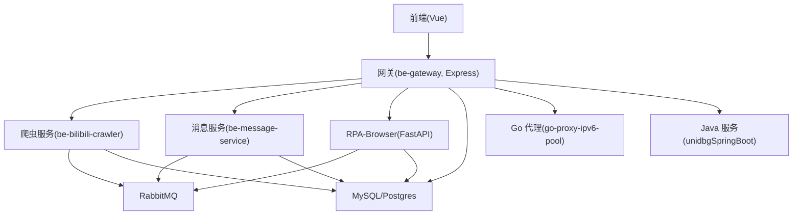
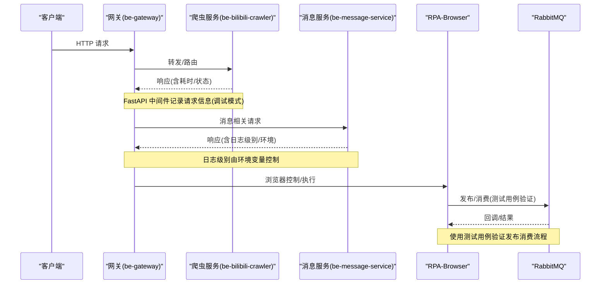
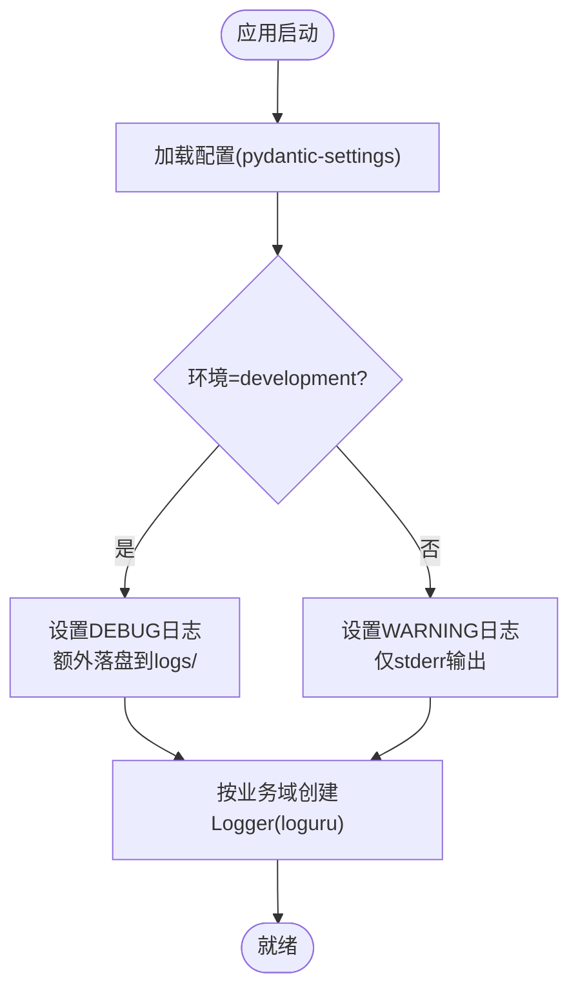
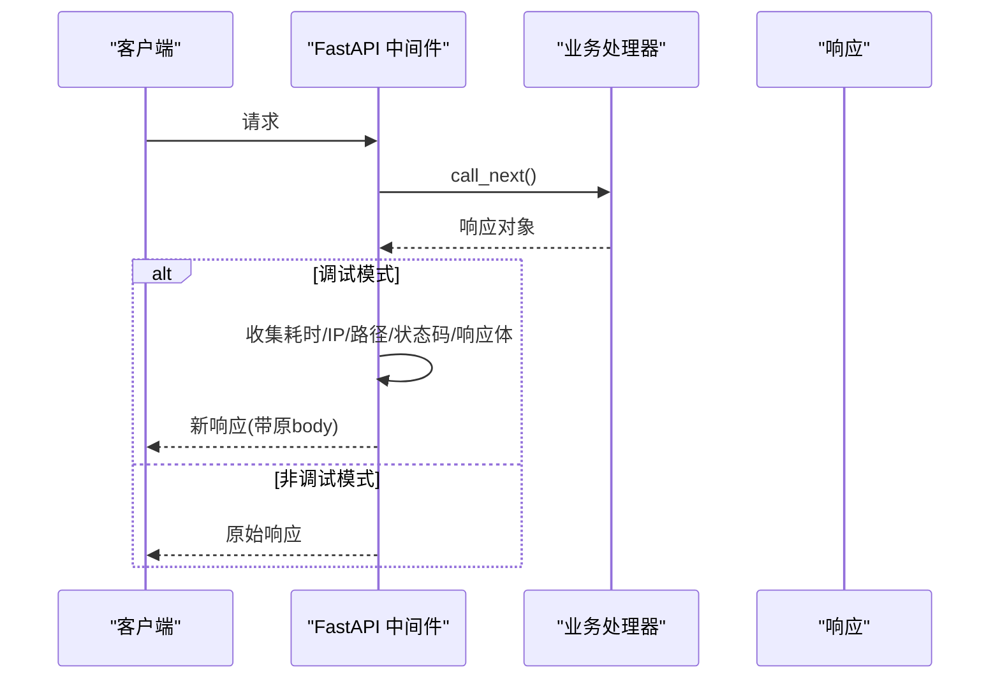
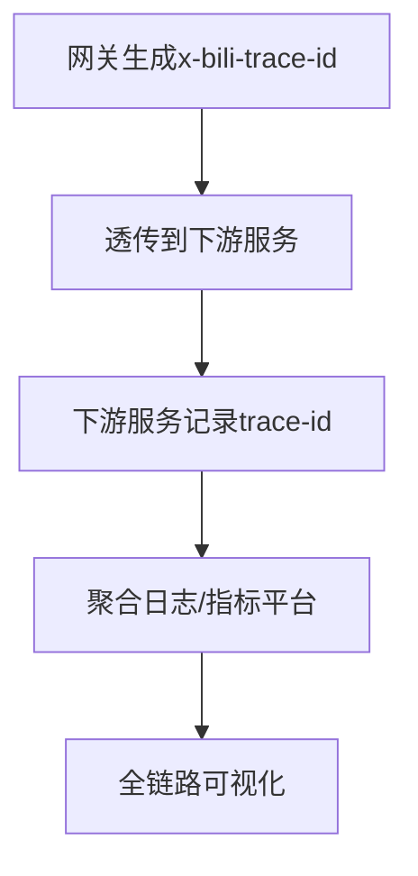
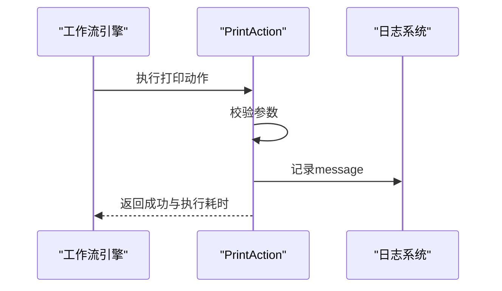
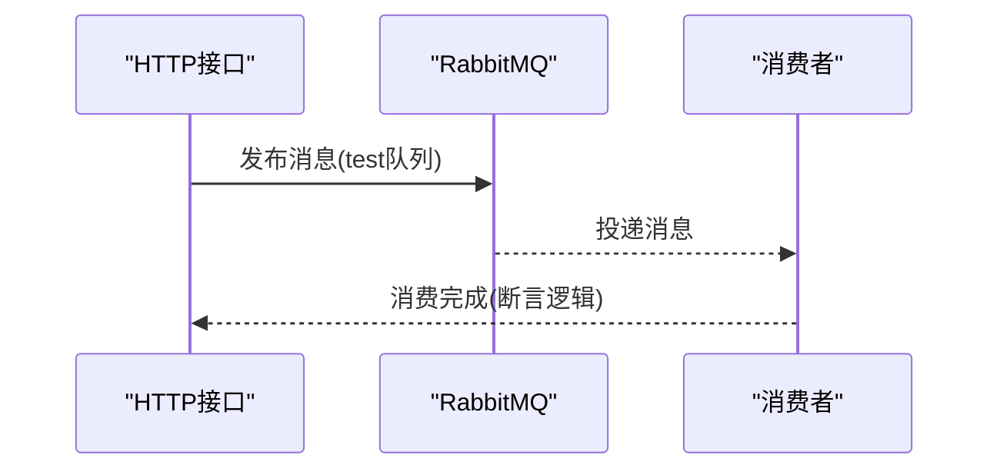
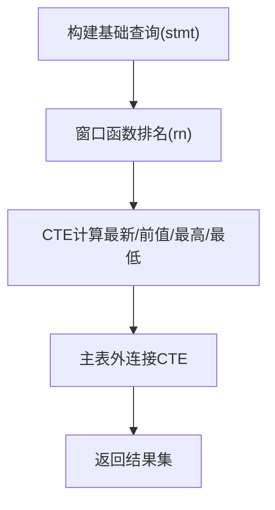
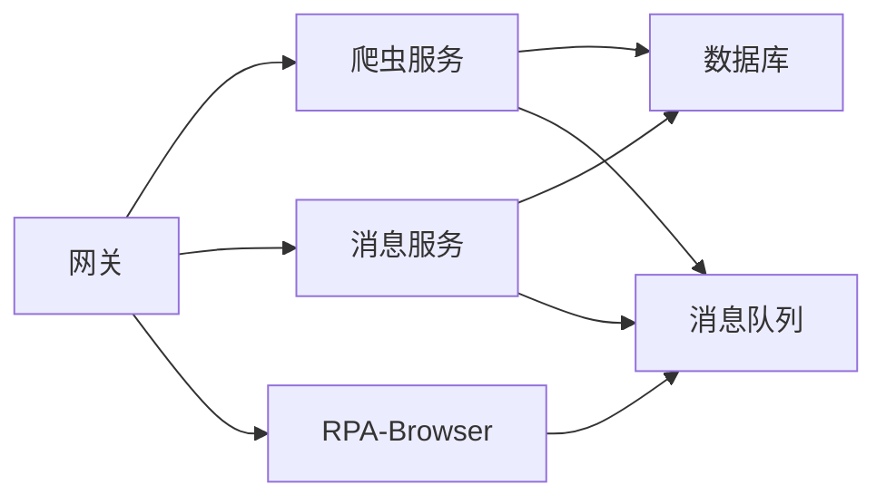

# 调试与性能分析

<cite>
**本文引用的文件**
- [be-bilibili-crawler/log/base_log.py](file://be-bilibili-crawler/log/base_log.py)
- [RPA-Browser/app/services/execution/actions/debug.py](file://RPA-Browser/app/services/execution/actions/debug.py)
- [RPA-Browser/app/config.py](file://RPA-Browser/app/config.py)
- [be-message-service/app/core/config.py](file://be-message-service/app/core/config.py)
- [be-bilibili-crawler/main.py](file://be-bilibili-crawler/main.py)
- [be-bilibili-crawler/dev_env_main.py](file://be-bilibili-crawler/dev_env_main.py)
- [be-gateway/ExpressServerEnd/app.js](file://be-gateway/ExpressServerEnd/app.js)
- [be-gateway/ExpressServerEnd/Model/api/v1/log/log_model.js](file://be-gateway/ExpressServerEnd/Model/api/v1/log/log_model.js)
- [be-bilibili-crawler/Service/GrpcModule/Grpc/GrpcProto/readme.md](file://be-bilibili-crawler/Service/GrpcModule/Grpc/GrpcProto/readme.md)
- [be-bilibili-crawler/test/test_mq.py](file://be-bilibili-crawler/test/test_mq.py)
- [go-proxy-ipv6-pool-auto/go-proxy-ipv6-pool/main.go](file://go-proxy-ipv6-pool-auto/go-proxy-ipv6-pool/main.go)
- [unidbgSpringBoot/src/main/java/guanzhujiaran/unidbgspringboot/UnidbgSpringBootApplication.java](file://unidbgSpringBoot/src/main/java/guanzhujiaran/unidbgspringboot/UnidbgSpringBootApplication.java)
</cite>

## 目录
1. [简介](#简介)
2. [项目结构](#项目结构)
3. [核心组件](#核心组件)
4. [架构总览](#架构总览)
5. [详细组件分析](#详细组件分析)
6. [依赖关系分析](#依赖关系分析)
7. [性能考量](#性能考量)
8. [故障排查指南](#故障排查指南)
9. [结论](#结论)
10. [附录](#附录)

## 简介
本文件面向多语言、多服务（Python、JavaScript、Java、Go）的调试与性能分析方法，结合仓库中的实际实现，系统化梳理日志规范、异常追踪、内存泄漏检测、性能瓶颈定位、浏览器与网络调试、数据库查询优化、消息队列监控、分布式链路追踪、跨服务调用追踪以及生产问题复现等常见难题的解决方案。文档以“可操作、可落地”为原则，提供流程图、时序图与架构图，帮助读者快速定位并解决问题。

## 项目结构
本项目包含多个子系统：
- Python 后端：be-bilibili-crawler、be-message-service、RPA-Browser
- JavaScript 网关：be-gateway（Express）
- Go 代理：go-proxy-ipv6-pool
- Java 服务：unidbgSpringBoot
- Vue 前端：Vue3FrontEndDemoExercise

各子系统的调试与可观测性基础设施如下：
- Python：统一日志模块（loguru）、中间件请求日志、配置中心（pydantic-settings）、MQ 测试用例、动作执行调试 Action
- JavaScript：Express 错误处理中间件、日志等级模型
- Go：HTTP/SOCKS5 代理入口
- Java：Spring Boot 应用启动类
- 分布式：gRPC 协议中定义的心跳、回执与 trace-id 生成说明

**图示来源**
- [be-gateway/ExpressServerEnd/app.js:119-161](file://be-gateway/ExpressServerEnd/app.js#L119-L161)
- [be-bilibili-crawler/main.py:63-91](file://be-bilibili-crawler/main.py#L63-L91)
- [be-message-service/app/core/config.py:19-39](file://be-message-service/app/core/config.py#L19-L39)
- [RPA-Browser/app/config.py:140-215](file://RPA-Browser/app/config.py#L140-L215)
- [go-proxy-ipv6-pool-auto/go-proxy-ipv6-pool/main.go:1-200](file://go-proxy-ipv6-pool-auto/go-proxy-ipv6-pool/main.go#L1-L200)
- [unidbgSpringBoot/src/main/java/guanzhujiaran/unidbgspringboot/UnidbgSpringBootApplication.java:1-200](file://unidbgSpringBoot/src/main/java/guanzhujiaran/unidbgspringboot/UnidbgSpringBootApplication.java#L1-L200)

**章节来源**
- [be-gateway/ExpressServerEnd/app.js:119-161](file://be-gateway/ExpressServerEnd/app.js#L119-L161)
- [be-bilibili-crawler/main.py:63-91](file://be-bilibili-crawler/main.py#L63-L91)
- [be-message-service/app/core/config.py:19-39](file://be-message-service/app/core/config.py#L19-L39)
- [RPA-Browser/app/config.py:140-215](file://RPA-Browser/app/config.py#L140-L215)

## 核心组件
- 统一日志与分级：Python 侧通过 loguru 创建按业务域隔离的日志实例；JS 侧定义日志等级模型；消息服务提供日志级别与环境变量控制。
- 请求级可观测性：FastAPI 中间件在调试模式下记录请求耗时、IP、路径、状态码与响应体；Express 错误中间件统一返回业务错误码。
- 分布式追踪：gRPC 协议文档定义了 x-bili-trace-id 生成算法，便于跨服务追踪。
- 动作调试：RPA-Browser 内置 PrintAction，用于打印参数替换后的内容，辅助工作流调试。
- 配置管理：pydantic-settings 集中管理环境变量，支持不同环境下的日志级别、连接池大小、迁移策略等。

**章节来源**
- [be-bilibili-crawler/log/base_log.py:11-96](file://be-bilibili-crawler/log/base_log.py#L11-L96)
- [be-gateway/ExpressServerEnd/Model/api/v1/log/log_model.js:1-10](file://be-gateway/ExpressServerEnd/Model/api/v1/log/log_model.js#L1-L10)
- [be-message-service/app/core/config.py:19-39](file://be-message-service/app/core/config.py#L19-L39)
- [be-bilibili-crawler/main.py:63-91](file://be-bilibili-crawler/main.py#L63-L91)
- [be-bilibili-crawler/Service/GrpcModule/Grpc/GrpcProto/readme.md:106-148](file://be-bilibili-crawler/Service/GrpcModule/Grpc/GrpcProto/readme.md#L106-L148)
- [RPA-Browser/app/services/execution/actions/debug.py:1-57](file://RPA-Browser/app/services/execution/actions/debug.py#L1-L57)
- [RPA-Browser/app/config.py:140-215](file://RPA-Browser/app/config.py#L140-L215)

## 架构总览
下图展示了从前端到网关再到各后端服务的请求流转，以及在调试模式下的日志采集点与错误处理路径。

**图示来源**
- [be-bilibili-crawler/main.py:63-91](file://be-bilibili-crawler/main.py#L63-L91)
- [be-message-service/app/core/config.py:19-39](file://be-message-service/app/core/config.py#L19-L39)
- [be-bilibili-crawler/test/test_mq.py:344-365](file://be-bilibili-crawler/test/test_mq.py#L344-L365)

## 详细组件分析

### 日志与分级体系
- Python 日志：基于 loguru，按业务域创建独立 Logger，支持异步写入、轮转、压缩与保留天数；通过 extra.user 过滤输出到对应文件。
- JS 日志等级：定义 debug/info/warn/error/critical 等级，便于统一上报与聚合。
- 消息服务日志：通过环境变量控制 FastStream 框架日志级别与业务日志级别；生产默认 WARNING，开发可设为 DEBUG；日志默认输出到 stderr，开发环境额外落盘。

**图示来源**
- [be-message-service/app/core/config.py:19-39](file://be-message-service/app/core/config.py#L19-L39)
- [be-bilibili-crawler/log/base_log.py:44-96](file://be-bilibili-crawler/log/base_log.py#L44-L96)

**章节来源**
- [be-bilibili-crawler/log/base_log.py:11-96](file://be-bilibili-crawler/log/base_log.py#L11-L96)
- [be-gateway/ExpressServerEnd/Model/api/v1/log/log_model.js:1-10](file://be-gateway/ExpressServerEnd/Model/api/v1/log/log_model.js#L1-L10)
- [be-message-service/app/core/config.py:19-39](file://be-message-service/app/core/config.py#L19-L39)

### 请求级可观测性与异常追踪
- FastAPI 中间件：在调试模式下记录请求耗时、IP、方法、路径、状态码与响应体；非调试模式直接返回原始响应。
- Express 错误中间件：将权限错误、未登录、超时等统一转换为业务错误码与消息；对校验错误进行映射并返回。

**图示来源**
- [be-bilibili-crawler/main.py:63-91](file://be-bilibili-crawler/main.py#L63-L91)
- [be-bilibili-crawler/dev_env_main.py:63-89](file://be-bilibili-crawler/dev_env_main.py#L63-L89)
- [be-gateway/ExpressServerEnd/app.js:119-161](file://be-gateway/ExpressServerEnd/app.js#L119-L161)

**章节来源**
- [be-bilibili-crawler/main.py:63-91](file://be-bilibili-crawler/main.py#L63-L91)
- [be-bilibili-crawler/dev_env_main.py:63-89](file://be-bilibili-crawler/dev_env_main.py#L63-L89)
- [be-gateway/ExpressServerEnd/app.js:119-161](file://be-gateway/ExpressServerEnd/app.js#L119-L161)

### 分布式链路追踪
- gRPC 协议文档定义了 x-bili-trace-id 的生成算法，包含随机串、时间戳编码与固定后缀，便于跨服务关联请求。
- 建议在网关与各服务间透传该头部，并在日志中记录，形成端到端追踪。

**图示来源**
- [be-bilibili-crawler/Service/GrpcModule/Grpc/GrpcProto/readme.md:106-148](file://be-bilibili-crawler/Service/GrpcModule/Grpc/GrpcProto/readme.md#L106-L148)

**章节来源**
- [be-bilibili-crawler/Service/GrpcModule/Grpc/GrpcProto/readme.md:106-148](file://be-bilibili-crawler/Service/GrpcModule/Grpc/GrpcProto/readme.md#L106-L148)

### 动作调试与工作流排障
- RPA-Browser 的 PrintAction：用于打印变量替换后的参数，不执行实际操作，适合在工作流中插入断点式观察点。
- 建议配合 action 日志采集配置（启用/记录参数/结果/变量/仅错误时记录/最大负载长度/保留天数）进行精细化调试。

**图示来源**
- [RPA-Browser/app/services/execution/actions/debug.py:15-57](file://RPA-Browser/app/services/execution/actions/debug.py#L15-L57)
- [RPA-Browser/app/config.py:209-212](file://RPA-Browser/app/config.py#L209-L212)

**章节来源**
- [RPA-Browser/app/services/execution/actions/debug.py:1-57](file://RPA-Browser/app/services/execution/actions/debug.py#L1-L57)
- [RPA-Browser/app/config.py:209-212](file://RPA-Browser/app/config.py#L209-L212)

### 消息队列监控与测试
- 使用测试用例验证 RabbitMQ 发布与消费流程，确保 HTTP 发布的消息能被消费者正确处理。
- 建议在生产环境增加队列深度、延迟队列、死信队列监控，并结合日志级别调整 FastStream 内部日志。

**图示来源**
- [be-bilibili-crawler/test/test_mq.py:344-365](file://be-bilibili-crawler/test/test_mq.py#L344-L365)

**章节来源**
- [be-bilibili-crawler/test/test_mq.py:344-365](file://be-bilibili-crawler/test/test_mq.py#L344-L365)
- [be-message-service/app/core/config.py:19-39](file://be-message-service/app/core/config.py#L19-L39)

### 数据库查询优化
- 示例：使用窗口函数与 CTE 计算最新价、前值、最高价、最低价，并通过外连接保证主表数据完整性。
- 建议结合慢查询日志、索引分析与执行计划优化，避免全表扫描与重复计算。

**图示来源**
- [be-bilibili-crawler/Service/samsclub/Sql/SdlHelper.py:207-234](file://be-bilibili-crawler/Service/samsclub/Sql/SdlHelper.py#L207-L234)

**章节来源**
- [be-bilibili-crawler/Service/samsclub/Sql/SdlHelper.py:207-234](file://be-bilibili-crawler/Service/samsclub/Sql/SdlHelper.py#L207-L234)

### 容器化与生产环境调试
- 日志输出：生产环境默认仅 stderr 输出，便于容器日志收集；开发环境额外落盘到 logs/。
- 配置管理：通过环境变量覆盖日志级别、连接池大小、迁移策略等；注意连接池上限保护，防止打满数据库。
- 健康检查：消息服务暴露 /health 路由，便于探针探测。

**章节来源**
- [be-message-service/app/core/config.py:19-39](file://be-message-service/app/core/config.py#L19-L39)
- [be-message-service/app/core/config.py:351-360](file://be-message-service/app/core/config.py#L351-L360)

### 多语言调试要点
- Python：使用 loguru 统一日志；中间件记录请求；pydantic-settings 管理配置；MQ 测试用例验证。
- JavaScript：Express 错误中间件统一错误码；日志等级模型便于上报。
- Go：HTTP/SOCKS5 代理入口，便于网络层调试与抓包。
- Java：Spring Boot 应用启动类，便于接入 APM 与 JVM 参数调优。

**章节来源**
- [go-proxy-ipv6-pool-auto/go-proxy-ipv6-pool/main.go:1-200](file://go-proxy-ipv6-pool-auto/go-proxy-ipv6-pool/main.go#L1-L200)
- [unidbgSpringBoot/src/main/java/guanzhujiaran/unidbgspringboot/UnidbgSpringBootApplication.java:1-200](file://unidbgSpringBoot/src/main/java/guanzhujiaran/unidbgspringboot/UnidbgSpringBootApplication.java#L1-L200)

## 依赖关系分析
- 服务间耦合：网关作为统一入口，路由到各后端服务；消息服务与爬虫服务通过 RabbitMQ 解耦；RPA-Browser 通过 MQ 与外部系统交互。
- 外部依赖：MySQL/Postgres、RabbitMQ、gRPC 协议、GeoIP mmdb、JWT/Casdoor 等。
- 潜在风险：连接池过大导致数据库压力；日志级别不当导致 I/O 瓶颈；MQ 堆积影响吞吐。

**图示来源**
- [be-gateway/ExpressServerEnd/app.js:119-161](file://be-gateway/ExpressServerEnd/app.js#L119-L161)
- [be-bilibili-crawler/main.py:63-91](file://be-bilibili-crawler/main.py#L63-L91)
- [be-message-service/app/core/config.py:19-39](file://be-message-service/app/core/config.py#L19-L39)
- [RPA-Browser/app/config.py:140-215](file://RPA-Browser/app/config.py#L140-L215)

**章节来源**
- [be-gateway/ExpressServerEnd/app.js:119-161](file://be-gateway/ExpressServerEnd/app.js#L119-L161)
- [be-bilibili-crawler/main.py:63-91](file://be-bilibili-crawler/main.py#L63-L91)
- [be-message-service/app/core/config.py:19-39](file://be-message-service/app/core/config.py#L19-L39)
- [RPA-Browser/app/config.py:140-215](file://RPA-Browser/app/config.py#L140-L215)

## 性能考量
- 日志级别：生产环境保持 WARNING，避免过多 I/O；开发环境可调至 DEBUG 以便排查。
- 连接池：限制 pool_size + max_overflow 上限，防止数据库连接耗尽。
- 查询优化：使用窗口函数与 CTE 减少重复计算；避免全表扫描。
- MQ 监控：关注队列深度、消费延迟、重试与死信队列。
- 分布式追踪：透传 x-bili-trace-id，聚合日志与指标平台。

[本节为通用指导，无需特定文件引用]

## 故障排查指南
- 请求级问题：查看 FastAPI 中间件记录的耗时、IP、路径、状态码与响应体；确认是否在调试模式。
- 错误码统一：检查 Express 错误中间件是否正确映射业务错误码。
- 日志缺失：确认日志级别与环境变量；检查 loguru 是否按业务域正确绑定用户标识。
- MQ 问题：使用测试用例验证发布与消费；检查队列配置与消费者逻辑。
- 数据库问题：分析慢查询与执行计划；检查连接池配置与上限保护。

**章节来源**
- [be-bilibili-crawler/main.py:63-91](file://be-bilibili-crawler/main.py#L63-L91)
- [be-gateway/ExpressServerEnd/app.js:119-161](file://be-gateway/ExpressServerEnd/app.js#L119-L161)
- [be-bilibili-crawler/log/base_log.py:44-96](file://be-bilibili-crawler/log/base_log.py#L44-L96)
- [be-bilibili-crawler/test/test_mq.py:344-365](file://be-bilibili-crawler/test/test_mq.py#L344-L365)
- [be-message-service/app/core/config.py:351-360](file://be-message-service/app/core/config.py#L351-L360)

## 结论
通过统一的日志体系、请求级可观测性、分布式链路追踪、消息队列监控与数据库查询优化，本项目在多语言、多服务环境下具备完善的调试与性能分析能力。建议在生产环境中严格管控日志级别与连接池配置，结合分布式追踪与指标平台，实现端到端的可观测性与快速排障。

[本节为总结，无需特定文件引用]

## 附录
- 浏览器开发者工具：利用 Network 面板抓包、Console 面板调试脚本、Performance 面板分析渲染与脚本耗时。
- 网络请求调试：通过 Go 代理进行抓包与分析；结合 Wireshark/tcpdump 深入网络层。
- 实时性能监控：接入 APM（如 SkyWalking、Prometheus+Grafana），采集 CPU、内存、GC、线程、I/O 等指标。
- 异步代码调试：使用断点与日志结合；关注事件循环阻塞与任务调度。
- 容器化环境调试：通过 docker logs 收集 stderr；挂载日志目录到宿主机；使用 k8s 日志聚合。
- 生产问题复现：使用灰度发布与流量复制；结合分布式追踪定位根因。

[本节为通用指导，无需特定文件引用]