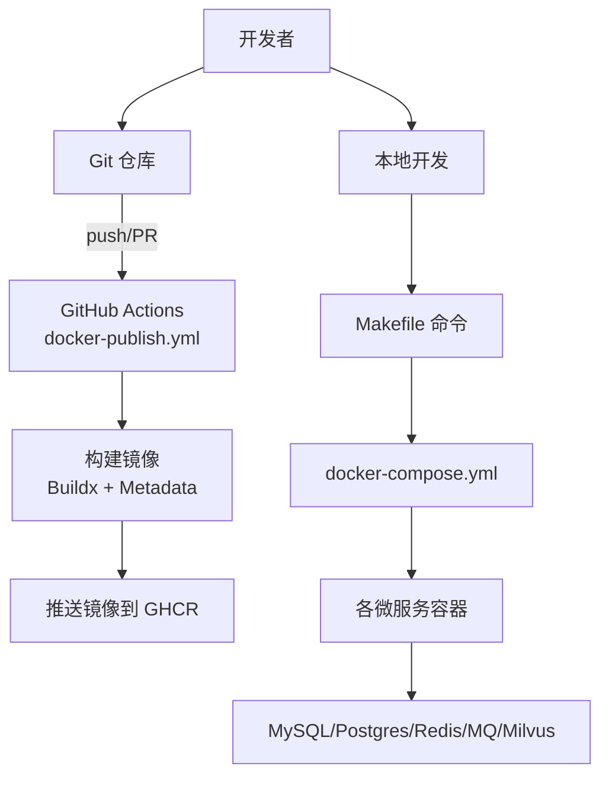
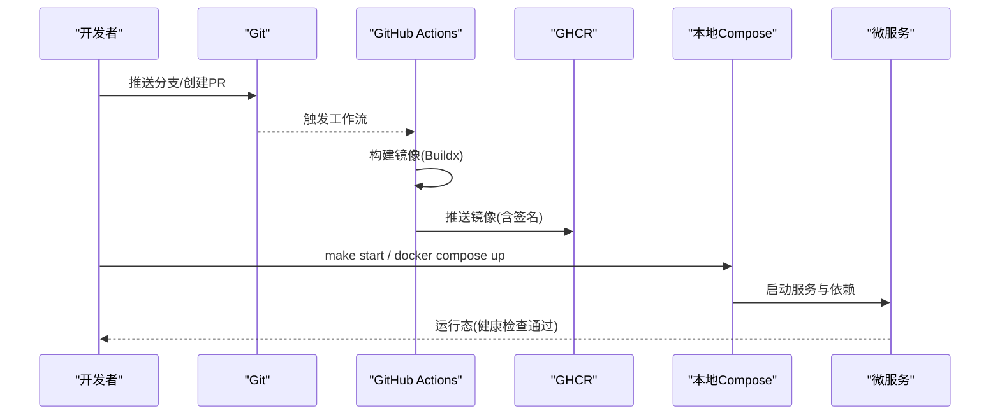
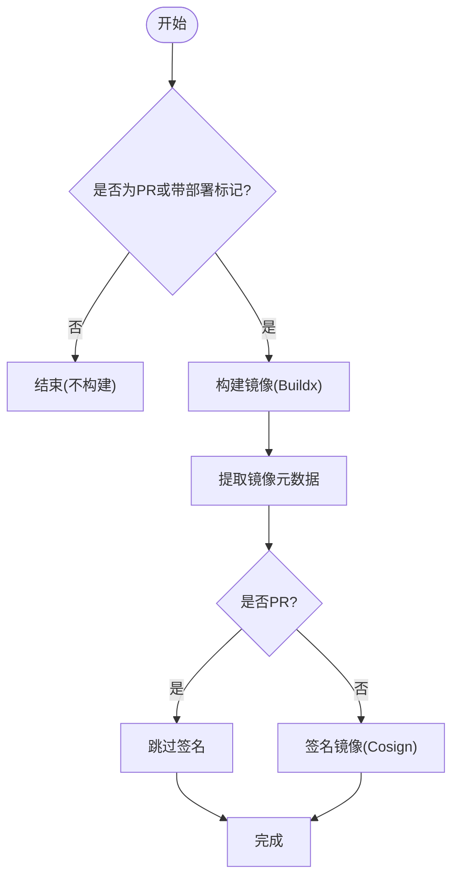
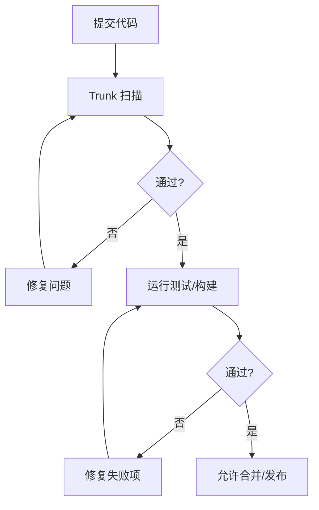
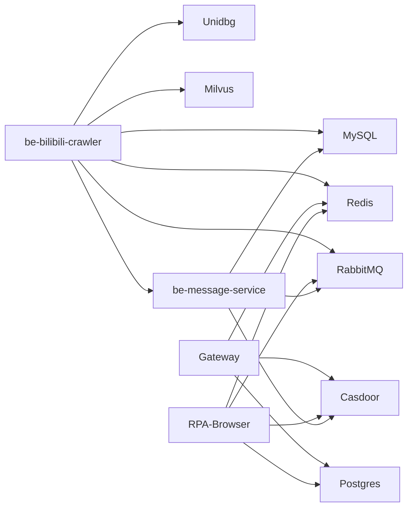

# 贡献流程

<cite>
**本文引用的文件**
- [README.md](file://README.md)
- [Makefile](file://Makefile)
- [docker-compose.yml](file://docker-compose.yml)
- [.github/workflows/docker-publish.yml](file://.github/workflows/docker-publish.yml)
- [.trunk/trunk.yaml](file://.trunk/trunk.yaml)
- [.trunk/configs/ruff.toml](file://.trunk/configs/ruff.toml)
- [.codebuddy/rules/vue前端项目规范.mdc](file://.codebuddy/rules/vue前端项目规范.mdc)
- [.codebuddy/rules/python-venv-activation.mdc](file://.codebuddy/rules/python-venv-activation.mdc)
</cite>

## 目录
1. [简介](#简介)
2. [项目结构](#项目结构)
3. [核心组件](#核心组件)
4. [架构总览](#架构总览)
5. [详细组件分析](#详细组件分析)
6. [依赖分析](#依赖分析)
7. [性能考虑](#性能考虑)
8. [故障排查指南](#故障排查指南)
9. [结论](#结论)
10. [附录](#附录)

## 简介
本贡献流程文档面向仓库内所有微服务（爬虫后端、消息服务、RPA 浏览器、网关、签名计算、代理池等），统一分支管理策略、提交信息规范、代码审查流程与版本发布流程。结合现有 CI/CD（GitHub Actions）与本地编排（Docker Compose、Makefile）、代码质量与安全扫描（Trunk/Ruff/Bandit/Grype/Hadolint 等），为“新功能开发”“Bug 修复”“文档更新”提供可操作的操作指南，并给出冲突解决、回滚策略与紧急修复流程建议。

## 项目结构
仓库采用多子工程 + Docker Compose 编排：
- 根级 Makefile 提供常用运维命令（启动、停止、日志、清理、submodule 同步）。
- docker-compose.yml 定义全部中间件与服务容器，包含健康检查与端口映射。
- GitHub Actions 流水线在 push/PR 到 main 时触发镜像构建与推送（含签名步骤）。
- Trunk 集中配置代码质量与安全扫描工具链。
- CodeBuddy 规则约束 Python/前端开发习惯与环境使用。

**图示来源**
- [.github/workflows/docker-publish.yml:1-68](file://.github/workflows/docker-publish.yml#L1-L68)
- [Makefile:1-71](file://Makefile#L1-L71)
- [docker-compose.yml:1-380](file://docker-compose.yml#L1-L380)

**章节来源**
- [README.md:1-121](file://README.md#L1-L121)
- [Makefile:1-71](file://Makefile#L1-L71)
- [docker-compose.yml:1-380](file://docker-compose.yml#L1-L380)

## 核心组件
- 分支与提交
  - 分支模型：基于 main 的短生命周期特性分支；仅合并通过 PR 的代码。
  - 提交信息：建议遵循 Conventional Commits（如 feat/fix/docs/chore），便于后续自动化生成变更日志。
- 代码审查
  - 强制 Pull Request 评审；CI 必须通过（lint、test、build）。
  - 建议在 PR 中附带影响范围、测试用例与回滚方案。
- 版本发布
  - 通过带特定标记的提交或分支策略触发镜像构建与推送；生产发布需人工审批。
- 本地开发
  - 使用 uv 管理 Python 环境；npm 管理 Node 依赖；Makefile 一键编排。

**章节来源**
- [README.md:54-95](file://README.md#L54-L95)
- [Makefile:1-71](file://Makefile#L1-L71)
- [.github/workflows/docker-publish.yml:1-68](file://.github/workflows/docker-publish.yml#L1-L68)

## 架构总览
下图展示从代码提交到镜像发布的完整流水线，以及本地开发到容器化运行的路径。

**图示来源**
- [.github/workflows/docker-publish.yml:1-68](file://.github/workflows/docker-publish.yml#L1-L68)
- [docker-compose.yml:1-380](file://docker-compose.yml#L1-L380)

## 详细组件分析

### 分支管理与提交规范
- 分支命名
  - 功能：feature/<描述>
  - 修复：fix/<描述>
  - 文档：docs/<描述>
  - 发布：release/<版本号>
- 提交信息
  - 类型：feat/fix/docs/chore/build/ci/refactor/test
  - 格式：type(scope): subject
  - 示例：feat(crawler): 新增动态抓取重试逻辑
- 分支保护
  - main 分支禁止直接推送；仅允许通过 PR 合并。
  - PR 要求至少一名 reviewer 批准且 CI 全绿。

**章节来源**
- [README.md:54-95](file://README.md#L54-L95)

### 代码审查流程
- 提交流程
  - 本地完成 lint/test/build 后推送到远端特性分支。
  - 创建 PR 至 main，填写模板（背景、变更点、测试、风险与回滚）。
- 审查要点
  - 接口契约是否稳定、向后兼容。
  - 数据库迁移是否幂等、可回滚。
  - 环境变量与密钥是否安全。
  - 日志与指标是否完善。
- 合并标准
  - CI 通过（Trunk 扫描、单元测试、集成测试、构建镜像）。
  - 至少一名维护者批准。

**章节来源**
- [.trunk/trunk.yaml:1-37](file://.trunk/trunk.yaml#L1-L37)
- [docker-compose.yml:1-380](file://docker-compose.yml#L1-L380)

### 版本发布流程
- 触发条件
  - 对 main 分支 push 或 PR 触发构建；生产发布建议使用 release 分支或打 tag。
  - 可在提交信息中包含部署标记以控制流水线行为。
- 构建与签名
  - 使用 Buildx 构建多阶段镜像，输出元数据标签。
  - 非 PR 场景下执行镜像签名，确保供应链安全。
- 发布与回滚
  - 发布前进行冒烟测试与灰度验证。
  - 回滚策略：快速切回上一稳定镜像标签；必要时回滚数据库迁移。

**图示来源**
- [.github/workflows/docker-publish.yml:1-68](file://.github/workflows/docker-publish.yml#L1-L68)

**章节来源**
- [.github/workflows/docker-publish.yml:1-68](file://.github/workflows/docker-publish.yml#L1-L68)

### 自动化测试与质量门禁
- 代码质量
  - Trunk 聚合多种 linter/formatter（ruff、black、isort、prettier、markdownlint、yamllint 等）。
  - Ruff 规则集启用基础错误与风格检查，忽略行宽限制交由格式化器处理。
- 安全扫描
  - Bandit 静态安全扫描 Python 代码。
  - Grype 依赖漏洞扫描。
  - Hadolint 校验 Dockerfile。
  - TruffleHog 检测敏感信息泄露。
- 容器与脚本
  - ShellCheck/shfmt 校验 Shell 脚本。
  - Actionlint 校验 GitHub Actions。
- 前端规范
  - Vue/Tailwind 样式与作用域规范，避免样式污染与外链 Referer 泄露。

**图示来源**
- [.trunk/trunk.yaml:1-37](file://.trunk/trunk.yaml#L1-L37)
- [.trunk/configs/ruff.toml:1-5](file://.trunk/configs/ruff.toml#L1-L5)
- [.codebuddy/rules/vue前端项目规范.mdc:1-91](file://.codebuddy/rules/vue前端项目规范.mdc#L1-L91)

**章节来源**
- [.trunk/trunk.yaml:1-37](file://.trunk/trunk.yaml#L1-L37)
- [.trunk/configs/ruff.toml:1-5](file://.trunk/configs/ruff.toml#L1-L5)
- [.codebuddy/rules/vue前端项目规范.mdc:1-91](file://.codebuddy/rules/vue前端项目规范.mdc#L1-L91)

### 不同贡献类型的操作指南
- 新功能开发
  - 新建 feature 分支，实现功能并补充单测/集成测试。
  - 提交前执行本地 lint/test/build；PR 中说明影响面与兼容性。
- Bug 修复
  - 新建 fix 分支，最小化改动；附回归测试用例。
  - 若涉及数据库变更，提供可回滚的迁移脚本。
- 文档更新
  - docs 分支，保持文档与代码同步；必要时更新 README/接口说明。
- 依赖更新
  - 使用 uv/npm/maven 更新依赖，锁定版本并更新 lock 文件。
  - 运行全量测试与依赖扫描，确认无新漏洞。

**章节来源**
- [README.md:71-95](file://README.md#L71-L95)
- [.codebuddy/rules/python-venv-activation.mdc:1-7](file://.codebuddy/rules/python-venv-activation.mdc#L1-L7)

### 冲突解决与回滚策略
- 冲突解决
  - 先 fetch 并 rebase 到最新 main，解决冲突后重新运行 CI。
  - 大粒度冲突建议拆分为更小的 PR。
- 回滚策略
  - 应用层：回滚到上一个稳定镜像标签。
  - 数据层：按迁移顺序回滚；必要时执行反向迁移。
  - 配置层：回滚环境变量与配置文件至已知稳定版本。
- 紧急修复
  - 优先 hotfix 分支，快速修复并合并至 main，随后打补丁版本。
  - 发布后进行线上监控与告警观察。

**章节来源**
- [docker-compose.yml:1-380](file://docker-compose.yml#L1-L380)
- [Makefile:1-71](file://Makefile#L1-L71)

## 依赖分析
- 服务间依赖
  - be-bilibili-crawler 依赖 MySQL、Redis、RabbitMQ、unidbg、Milvus、be-message-service。
  - gateway 依赖 Postgres、Redis、Casdoor。
  - rpa-browser 依赖 Postgres、Redis、RabbitMQ、Casdoor。
  - be-message-service 依赖 RabbitMQ、MySQL、Casdoor。
- 中间件与健康检查
  - etcd/minio/milvus 具备健康检查，保障编排稳定性。
  - 关键服务暴露端口用于外部访问与管理界面。

**图示来源**
- [docker-compose.yml:1-380](file://docker-compose.yml#L1-L380)

**章节来源**
- [docker-compose.yml:1-380](file://docker-compose.yml#L1-L380)

## 性能考虑
- 资源限制
  - 爬虫服务设置内存上限，避免 OOM。
- 缓存与存储
  - 合理使用 Redis 缓存热点数据；Milvus 向量检索注意索引与查询优化。
- 网络与并发
  - 合理配置连接池与超时；避免阻塞 I/O。
- 构建与镜像
  - 利用 Buildx 缓存加速构建；精简镜像体积。

[本节为通用指导，无需具体文件引用]

## 故障排查指南
- 常见问题
  - 容器无法启动：检查环境变量、端口占用、依赖服务健康状态。
  - 数据库连接失败：核对账号密码、网络连通性与防火墙策略。
  - 消息队列不可用：确认 RabbitMQ 用户权限与队列存在性。
- 日志与诊断
  - 使用 Makefile 查看服务日志；定位错误堆栈。
  - 借助健康检查端点判断服务就绪状态。
- 恢复步骤
  - 重启相关服务；必要时清理卷并重载配置。
  - 回滚到上一个稳定版本并逐步排查。

**章节来源**
- [Makefile:42-60](file://Makefile#L42-L60)
- [docker-compose.yml:14-67](file://docker-compose.yml#L14-L67)

## 结论
本流程将分支管理、提交规范、代码审查、CI/CD 与发布回滚策略整合为一套可执行的协作规范。配合 Trunk 质量门禁与 Docker Compose 本地编排，确保团队高效协作与稳定交付。建议持续完善自动化测试覆盖率与安全扫描覆盖，并在发布前进行灰度与回滚演练。

[本节为总结性内容，无需具体文件引用]

## 附录
- 本地开发命令
  - 启动全部服务：make all
  - 启动除 FastAPI 外服务：make start-excluding-fastapi
  - 查看日志：make logs [SERVICE]
  - 清理环境：make clean
- 子模块管理
  - 初始化子模块：make submodule-init
  - 同步远端最新：make update
- 环境变量与端口
  - 参考 docker-compose.yml 中的服务端口与环境变量定义。

**章节来源**
- [Makefile:1-71](file://Makefile#L1-L71)
- [docker-compose.yml:1-380](file://docker-compose.yml#L1-L380)