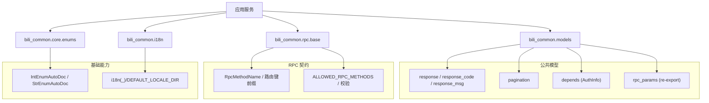
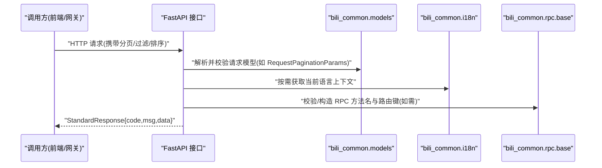
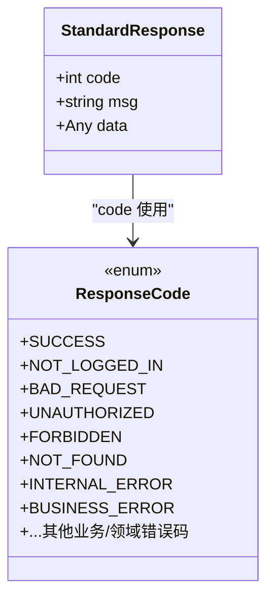
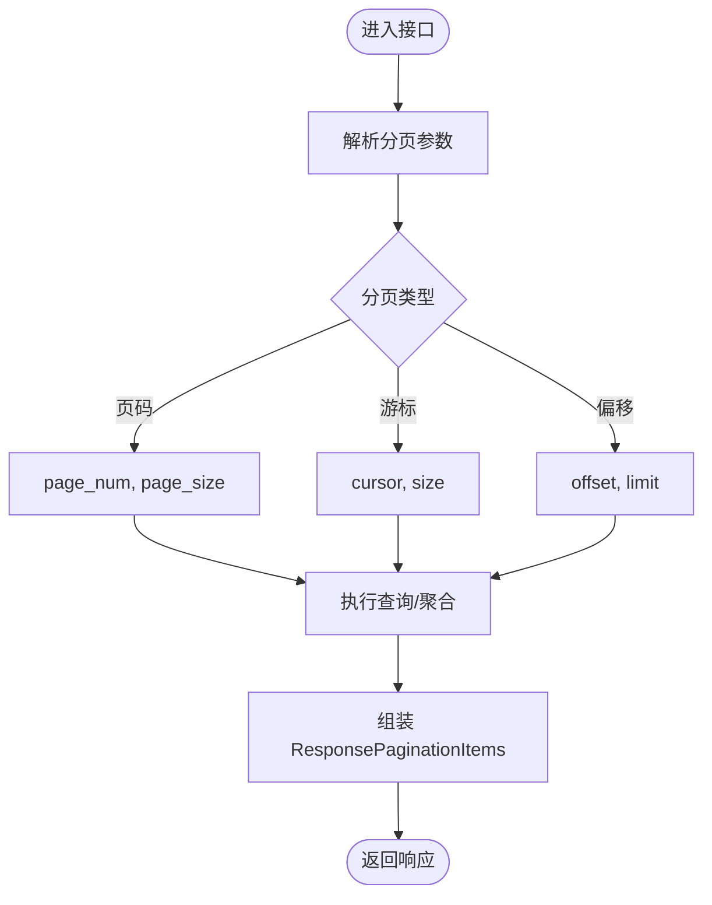
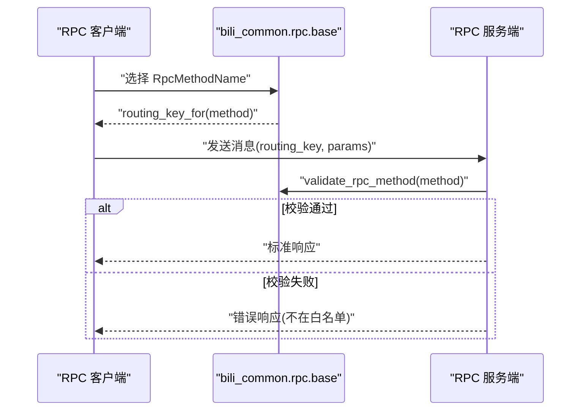
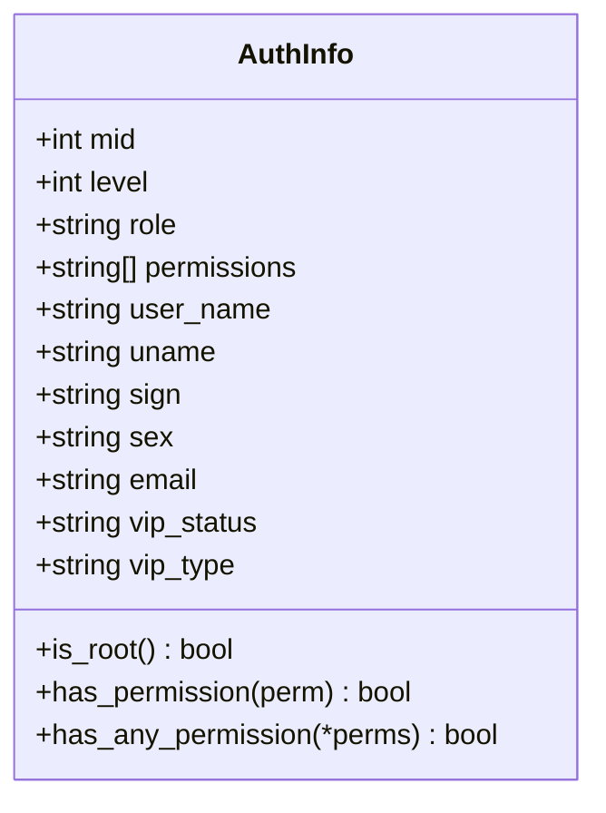
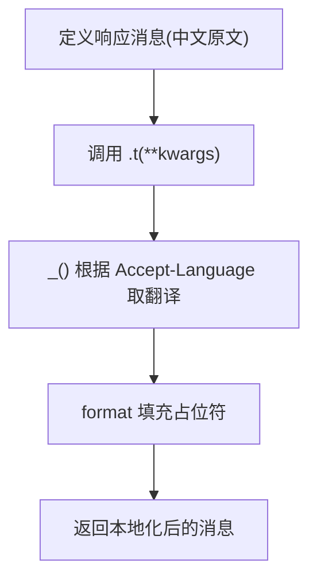
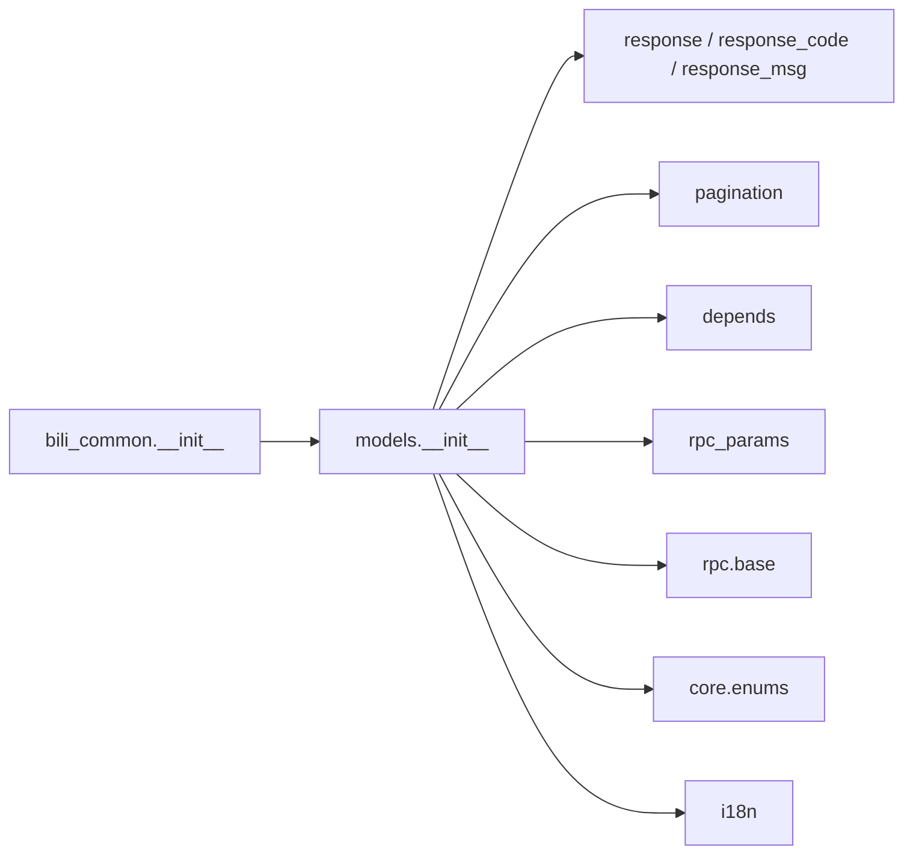

# 公共数据模型

<cite>
**本文引用的文件**
- [bili-common/bili_common/__init__.py](file://bili-common/bili_common/__init__.py)
- [bili-common/bili_common/models/__init__.py](file://bili-common/bili_common/models/__init__.py)
- [bili-common/bili_common/models/response.py](file://bili-common/bili_common/models/response.py)
- [bili-common/bili_common/models/response_code.py](file://bili-common/bili_common/models/response_code.py)
- [bili-common/bili_common/models/response_msg.py](file://bili-common/bili_common/models/response_msg.py)
- [bili-common/bili_common/models/pagination.py](file://bili-common/bili_common/models/pagination.py)
- [bili-common/bili_common/models/rpc_params.py](file://bili-common/bili_common/models/rpc_params.py)
- [bili-common/bili_common/models/depends.py](file://bili-common/bili_common/models/depends.py)
- [bili-common/bili_common/rpc/base.py](file://bili-common/bili_common/rpc/base.py)
- [bili-common/bili_common/core/enums.py](file://bili-common/bili_common/core/enums.py)
- [bili-common/bili_common/i18n.py](file://bili-common/bili_common/i18n.py)
</cite>

## 目录
1. [简介](#简介)
2. [项目结构](#项目结构)
3. [核心组件](#核心组件)
4. [架构总览](#架构总览)
5. [详细组件分析](#详细组件分析)
6. [依赖关系分析](#依赖关系分析)
7. [性能考虑](#性能考虑)
8. [故障排查指南](#故障排查指南)
9. [结论](#结论)
10. [附录](#附录)

## 简介
本文件面向 bili-common 库的“公共数据模型”，系统化说明跨服务通信中统一的数据结构与接口规范。内容覆盖：
- 统一响应模型、分页模型、RPC 参数与契约
- 枚举类型、常量定义与错误码规范
- 国际化（i18n）数据结构设计与多语言处理方案
- 模型复用指南与扩展开发规范
- 在不同服务中正确引用与使用这些公共模型的实践建议

## 项目结构
bili-common 的核心位于 bili-common/bili_common，其中与“公共数据模型”直接相关的模块包括：
- models：统一响应、分页、认证信息、RPC 参数与契约等
- rpc：RPC 方法名、路由键前缀、白名单与校验工具
- core：通用枚举基类（自动文档化）
- i18n：后端国际化封装（基于 fastapi-i18n/gettext）

图表来源
- [bili-common/bili_common/models/__init__.py:1-259](file://bili-common/bili_common/models/__init__.py#L1-L259)
- [bili-common/bili_common/rpc/base.py:1-226](file://bili-common/bili_common/rpc/base.py#L1-L226)
- [bili-common/bili_common/core/enums.py:1-63](file://bili-common/bili_common/core/enums.py#L1-L63)
- [bili-common/bili_common/i18n.py:1-30](file://bili-common/bili_common/i18n.py#L1-L30)

章节来源
- [bili-common/bili_common/models/__init__.py:1-259](file://bili-common/bili_common/models/__init__.py#L1-L259)

## 核心组件
- 统一响应：StandardResponse、success_response、error_response、custom_response
- 分页：RequestPaginationParams、RequestCursorParams、RequestOffsetLimitParams、ResponsePaginationItems
- RPC 契约：RpcMethodName、路由键前缀、ALLOWED_RPC_METHODS、validate_rpc_method、routing_key_for 系列函数
- 认证信息：AuthInfo（含权限判断 has_permission/has_any_permission）
- 枚举基类：IntEnumAutoDoc、StrEnumAutoDoc（自动生成 OpenAPI 描述）
- 国际化：i18n 依赖与 _ 翻译器、默认 locale 目录

章节来源
- [bili-common/bili_common/models/response.py:1-79](file://bili-common/bili_common/models/response.py#L1-L79)
- [bili-common/bili_common/models/pagination.py:1-73](file://bili-common/bili_common/models/pagination.py#L1-L73)
- [bili-common/bili_common/rpc/base.py:1-226](file://bili-common/bili_common/rpc/base.py#L1-L226)
- [bili-common/bili_common/models/depends.py:1-126](file://bili-common/bili_common/models/depends.py#L1-L126)
- [bili-common/bili_common/core/enums.py:1-63](file://bili-common/bili_common/core/enums.py#L1-L63)
- [bili-common/bili_common/i18n.py:1-30](file://bili-common/bili_common/i18n.py#L1-L30)

## 架构总览
公共数据模型在跨服务通信中的角色：
- HTTP 层：所有接口统一返回 StandardResponse，业务状态通过 code/msg/data 表达；HTTP 状态码恒为 200。
- 请求参数：分页、过滤、排序等入参采用统一的 SQLModel 模型，便于 FastAPI 自动校验与生成文档。
- RPC 层：通过 RpcMethodName 与路由键前缀约定，确保客户端与服务端对 method_name 与 routing_key 的一致性。
- 国际化：响应消息以中文原文存储于枚举，调用时通过 _() 延迟翻译，支持多语言输出。

图表来源
- [bili-common/bili_common/models/response.py:1-79](file://bili-common/bili_common/models/response.py#L1-L79)
- [bili-common/bili_common/models/pagination.py:1-73](file://bili-common/bili_common/models/pagination.py#L1-L73)
- [bili-common/bili_common/rpc/base.py:1-226](file://bili-common/bili_common/rpc/base.py#L1-L226)
- [bili-common/bili_common/i18n.py:1-30](file://bili-common/bili_common/i18n.py#L1-L30)

## 详细组件分析

### 统一响应模型
- StandardResponse：包含 code、msg、data 三个字段，作为所有接口的统一返回体。
- success_response/error_response/custom_response：便捷构建成功或错误响应，支持传入 ResponseCode 枚举或整型码。
- 错误码：ResponseCode 集中管理成功、通用错误、服务器错误、自定义业务错误及特定领域错误（如 WebRTC、截图、Casdoor 等）。

图表来源
- [bili-common/bili_common/models/response.py:1-79](file://bili-common/bili_common/models/response.py#L1-L79)
- [bili-common/bili_common/models/response_code.py:1-79](file://bili-common/bili_common/models/response_code.py#L1-L79)

章节来源
- [bili-common/bili_common/models/response.py:1-79](file://bili-common/bili_common/models/response.py#L1-L79)
- [bili-common/bili_common/models/response_code.py:1-79](file://bili-common/bili_common/models/response_code.py#L1-L79)

### 分页模型
- RequestPaginationParams：基于页码的分页（page_num/page_size），带最小值校验与 OpenAPI 过滤器元数据。
- RequestCursorParams：基于游标的分页（cursor/size），适用于无限滚动场景。
- RequestOffsetLimitParams：基于偏移量的分页（offset/limit），可泛型承载额外过滤条件。
- ResponsePaginationItems：统一分页结果（items/total）。

图表来源
- [bili-common/bili_common/models/pagination.py:1-73](file://bili-common/bili_common/models/pagination.py#L1-L73)

章节来源
- [bili-common/bili_common/models/pagination.py:1-73](file://bili-common/bili_common/models/pagination.py#L1-L73)

### RPC 参数与契约
- 方法名与路由键：RpcMethodName 集中定义所有 RPC 方法名；提供 routing_key_for/pptr_routing_key_for/push_rpc_routing_key_for/rpa_rpc_routing_key_for/notify_rpc_routing_key_for 生成对应 routing_key。
- 白名单与校验：ALLOWED_RPC_METHODS 限定允许调用的方法；validate_rpc_method 用于服务端校验。
- 兼容入口：models/rpc_params.py 将抽奖相关 RPC 参数 re-export，保证存量引用零改动。

图表来源
- [bili-common/bili_common/rpc/base.py:1-226](file://bili-common/bili_common/rpc/base.py#L1-L226)
- [bili-common/bili_common/models/rpc_params.py:1-30](file://bili-common/bili_common/models/rpc_params.py#L1-L30)

章节来源
- [bili-common/bili_common/rpc/base.py:1-226](file://bili-common/bili_common/rpc/base.py#L1-L226)
- [bili-common/bili_common/models/rpc_params.py:1-30](file://bili-common/bili_common/models/rpc_params.py#L1-L30)

### 认证信息与权限
- AuthInfo：来自网关转发的 x-bili-* 请求头，包含 mid、level、role、permissions 等；提供 is_root、has_permission、has_any_permission 等方法进行权限判定。
- 浏览器/插件相关依赖模型：VerifyBrowserDependsReq、BrowserReqInfo、BrowserPluginReqInfo 等，用于统一校验浏览器与插件所有权。

图表来源
- [bili-common/bili_common/models/depends.py:1-126](file://bili-common/bili_common/models/depends.py#L1-L126)

章节来源
- [bili-common/bili_common/models/depends.py:1-126](file://bili-common/bili_common/models/depends.py#L1-L126)

### 枚举与自动文档
- IntEnumAutoDoc/StrEnumAutoDoc：继承后自动在 OpenAPI/JSON Schema 中生成“枚举选项：name: value”的描述，减少重复文档工作。
- 适用场景：响应码、业务枚举、排序方式、时间预设等。

章节来源
- [bili-common/bili_common/core/enums.py:1-63](file://bili-common/bili_common/core/enums.py#L1-L63)

### 国际化（i18n）
- 设计要点：_() 必须在请求上下文中调用；枚举/异常属性仅存中文原文，对外返回时再调用 _() 延迟翻译。
- 默认 locale 目录：DEFAULT_LOCALE_DIR 指向 bili_common/locale，支持 zh_CN、en、zh_TW、ja、ko。
- 响应消息：ResponseMsg 提供 .t(**kwargs) 方法，支持占位符格式化与多语言输出。

图表来源
- [bili-common/bili_common/models/response_msg.py:1-84](file://bili-common/bili_common/models/response_msg.py#L1-L84)
- [bili-common/bili_common/i18n.py:1-30](file://bili-common/bili_common/i18n.py#L1-L30)

章节来源
- [bili-common/bili_common/models/response_msg.py:1-84](file://bili-common/bili_common/models/response_msg.py#L1-L84)
- [bili-common/bili_common/i18n.py:1-30](file://bili-common/bili_common/i18n.py#L1-L30)

## 依赖关系分析
- 包入口：__init__.py 暴露常用模型（ResponseCode、ResponseMsg、StandardResponse、AuthInfo、UserRole 等），供上层服务直接导入。
- 模型聚合：models/__init__.py 集中导出各子模块的模型与工具，避免分散导入造成耦合。
- RPC 契约：rpc/base.py 提供方法名与路由键的统一约定，确保两端一致。
- 枚举基类：core/enums.py 被多个模型模块引用，实现一致的 OpenAPI 文档行为。
- i18n：i18n.py 被 response_msg 等模块引用，实现延迟翻译。

图表来源
- [bili-common/bili_common/__init__.py:1-17](file://bili-common/bili_common/__init__.py#L1-L17)
- [bili-common/bili_common/models/__init__.py:1-259](file://bili-common/bili_common/models/__init__.py#L1-L259)

章节来源
- [bili-common/bili_common/__init__.py:1-17](file://bili-common/bili_common/__init__.py#L1-L17)
- [bili-common/bili_common/models/__init__.py:1-259](file://bili-common/bili_common/models/__init__.py#L1-L259)

## 性能考虑
- 统一响应与分页模型基于 SQLModel/Pydantic，具备高效序列化与强类型校验，减少运行时错误。
- 分页策略：优先使用 cursor 分页（RequestCursorParams）避免深翻页开销；必要时使用 offset/limit。
- RPC 白名单校验在服务端集中进行，降低非法调用带来的资源消耗。
- i18n 延迟翻译仅在需要时执行，避免模块加载期不必要的计算。

[本节为通用指导，不直接分析具体文件]

## 故障排查指南
- 未登录：使用 ResponseCode.NOT_LOGGED_IN（-101），前端据此跳转登录页。
- 参数非法：使用 ResponseCode.INVALID_PARAM/BAD_REQUEST，结合 RequestPaginationParams 等模型自动校验提示。
- 权限不足：通过 AuthInfo.has_permission/has_any_permission 判断，必要时返回 FORBIDDEN。
- RPC 方法非法：validate_rpc_method 返回失败原因，检查 ALLOWED_RPC_METHODS 与方法名是否匹配。
- 国际化问题：确认在请求上下文中调用 _()，并确保 locale 文件存在且已编译。

章节来源
- [bili-common/bili_common/models/response_code.py:1-79](file://bili-common/bili_common/models/response_code.py#L1-L79)
- [bili-common/bili_common/models/depends.py:1-126](file://bili-common/bili_common/models/depends.py#L1-L126)
- [bili-common/bili_common/rpc/base.py:1-226](file://bili-common/bili_common/rpc/base.py#L1-L226)
- [bili-common/bili_common/models/response_msg.py:1-84](file://bili-common/bili_common/models/response_msg.py#L1-L84)
- [bili-common/bili_common/i18n.py:1-30](file://bili-common/bili_common/i18n.py#L1-L30)

## 结论
bili-common 的公共数据模型为跨服务通信提供了统一、可扩展且易于维护的基础设施：
- 统一响应与分页模型简化了接口契约与文档生成
- RPC 契约集中管理，确保客户端与服务端一致性
- 枚举基类与 i18n 机制提升文档质量与多语言体验
- 通过集中导出与清晰分层，便于服务间复用与扩展

[本节为总结性内容，不直接分析具体文件]

## 附录

### 模型复用指南
- 在任意服务中引入统一响应：使用 StandardResponse 与 success_response/error_response/custom_response。
- 分页入参与出参：优先使用 RequestCursorParams；若需页码式分页，使用 RequestPaginationParams；复杂过滤可使用 RequestOffsetLimitParams[T]。
- RPC 调用：通过 RpcMethodName 选择方法名，并使用对应的 routing_key_for 生成 routing_key；服务端使用 validate_rpc_method 校验。
- 权限控制：使用 AuthInfo.has_permission/has_any_permission 进行细粒度权限判断。
- 国际化：在视图/处理器中调用 ResponseMsg.xxx.t(**kwargs) 或 _() 获取本地化消息。

章节来源
- [bili-common/bili_common/models/response.py:1-79](file://bili-common/bili_common/models/response.py#L1-L79)
- [bili-common/bili_common/models/pagination.py:1-73](file://bili-common/bili_common/models/pagination.py#L1-L73)
- [bili-common/bili_common/rpc/base.py:1-226](file://bili-common/bili_common/rpc/base.py#L1-L226)
- [bili-common/bili_common/models/depends.py:1-126](file://bili-common/bili_common/models/depends.py#L1-L126)
- [bili-common/bili_common/models/response_msg.py:1-84](file://bili-common/bili_common/models/response_msg.py#L1-L84)
- [bili-common/bili_common/i18n.py:1-30](file://bili-common/bili_common/i18n.py#L1-L30)

### 扩展开发规范
- 新增枚举：继承 IntEnumAutoDoc/StrEnumAutoDoc，以便自动文档化。
- 新增响应码：在 ResponseCode 中按类别添加，保持语义清晰。
- 新增 RPC 方法：在 RpcMethodName 中添加，并在 ALLOWED_RPC_METHODS 中登记；确保路由键前缀与两端一致。
- 新增分页场景：优先使用现有分页模型；如需新字段，扩展 RequestOffsetLimitParams[T] 的泛型 T。
- 新增国际化文案：在 ResponseMsg 中添加枚举项，并通过 .t() 输出；确保 locale 文件更新与编译。

章节来源
- [bili-common/bili_common/core/enums.py:1-63](file://bili-common/bili_common/core/enums.py#L1-L63)
- [bili-common/bili_common/models/response_code.py:1-79](file://bili-common/bili_common/models/response_code.py#L1-L79)
- [bili-common/bili_common/rpc/base.py:1-226](file://bili-common/bili_common/rpc/base.py#L1-L226)
- [bili-common/bili_common/models/pagination.py:1-73](file://bili-common/bili_common/models/pagination.py#L1-L73)
- [bili-common/bili_common/models/response_msg.py:1-84](file://bili-common/bili_common/models/response_msg.py#L1-L84)
- [bili-common/bili_common/i18n.py:1-30](file://bili-common/bili_common/i18n.py#L1-L30)