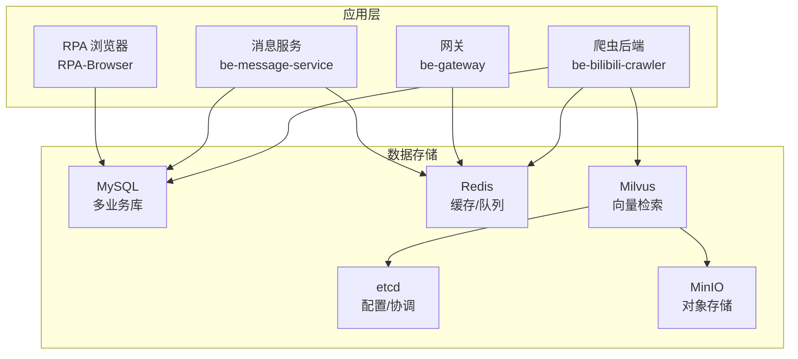
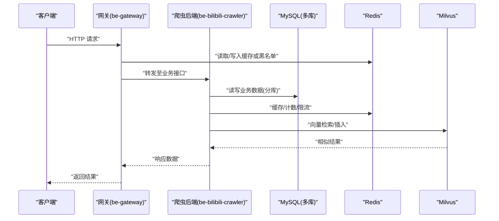
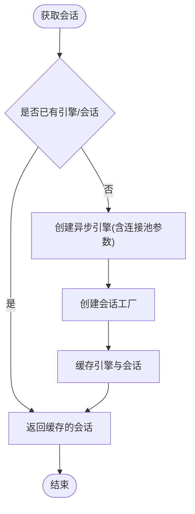
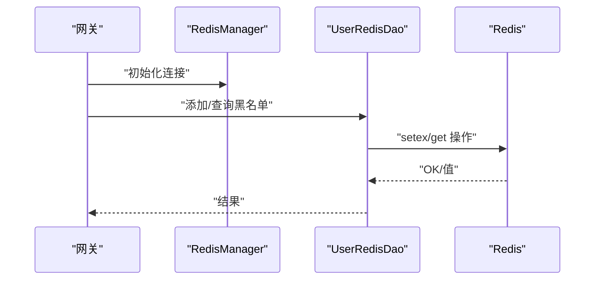
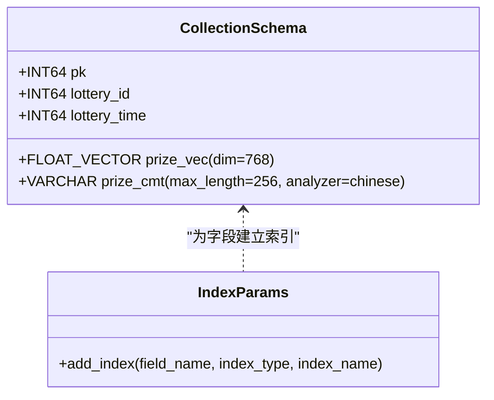
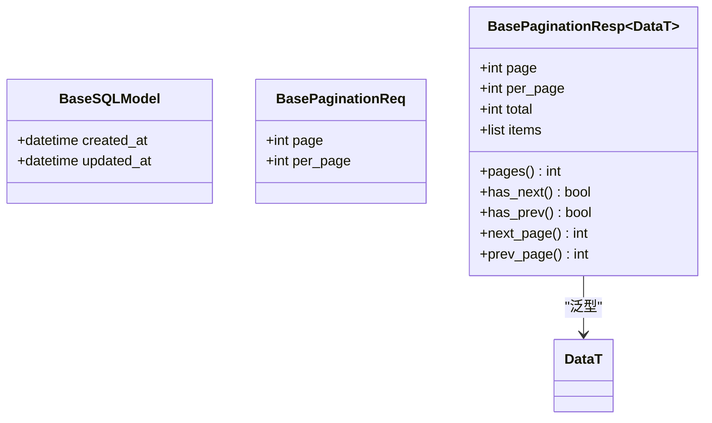
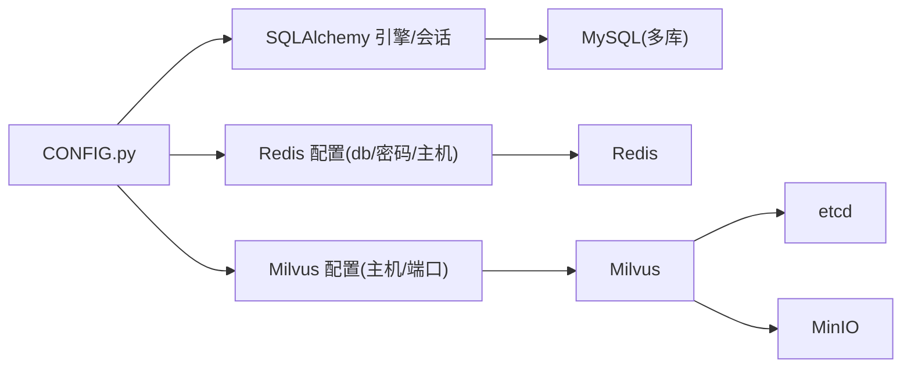

# 数据库架构设计

<cite>
**本文引用的文件**
- [docker-compose.yml](file://docker-compose.yml)
- [dc-dev.yml](file://dc-dev.yml)
- [CONFIG.py](file://be-bilibili-crawler/CONFIG.py)
- [SqlalchemyTool.py](file://be-bilibili-crawler/Utils/数据库/SqlalchemyTool.py)
- [alembic.ini](file://be-bilibili-crawler/alembic.ini)
- [create_collection.py](file://be-bilibili-crawler/scripts/database/同步向量数据库/create_collection.py)
- [text_embed.py](file://be-bilibili-crawler/Service/LangChainCompo/text_embed.py)
- [custom_mysql.cnf](file://docker_vol/mysql_data/conf.d/custom_mysql.cnf)
- [RedisManager.js](file://be-gateway/ExpressServerEnd/DAO/Redis/RedisManager.js)
- [UserRedisDao.js](file://be-gateway/ExpressServerEnd/DAO/UserRedisDao.js)
- [base_sqlmodel.py](file://RPA-Browser/app/models/base/base_sqlmodel.py)
</cite>

## 目录
1. [简介](#简介)
2. [项目结构](#项目结构)
3. [核心组件](#核心组件)
4. [架构总览](#架构总览)
5. [详细组件分析](#详细组件分析)
6. [依赖关系分析](#依赖关系分析)
7. [性能与优化](#性能与优化)
8. [故障恢复与一致性](#故障恢复与一致性)
9. [监控、备份与安全](#监控备份与安全)
10. [结论](#结论)
11. [附录：迁移与版本控制流程](#附录迁移与版本控制流程)

## 简介
本文件面向本仓库的分布式系统，系统性阐述数据库架构设计与分库策略，覆盖 MySQL、PostgreSQL（通过容器编排存在）、Redis、Milvus 等存储引擎的使用场景与配置；说明表结构设计原则、索引优化策略与查询调优方法；描述基于 Alembic 的数据迁移管理与版本控制流程；给出分布式数据一致性与故障恢复方案；并提供监控、备份恢复与安全加固的最佳实践；最后总结复杂查询优化技巧与性能分析方法。

## 项目结构
- 多服务多数据库：爬虫后端 be-bilibili-crawler 使用多个 MySQL 业务库（按领域分库），并接入 Redis 缓存、Milvus 向量检索；网关 be-gateway 使用 Redis 做黑名单等缓存；消息服务 be-message-service 与 RPA 浏览器服务 RPA-Browser 各自维护独立迁移脚本与模型基类。
- 容器化部署：通过 docker-compose.yml 与 dc-dev.yml 统一编排 MySQL、Redis、Milvus、etcd、MinIO 等基础设施，便于开发与生产环境一致性。
- 配置集中：be-bilibili-crawler 的 CONFIG.py 集中管理各数据库连接串、连接池参数与 Redis 分库编号；SQLAlchemy 工具封装异步引擎与会话工厂，提供连接复用与隔离。

**图表来源**
- [docker-compose.yml:43-92](file://docker-compose.yml#L43-L92)
- [dc-dev.yml:1-76](file://dc-dev.yml#L1-L76)

**章节来源**
- [docker-compose.yml:43-92](file://docker-compose.yml#L43-L92)
- [dc-dev.yml:1-76](file://dc-dev.yml#L1-L76)

## 核心组件
- 多数据库分库策略：
  - 爬虫后端按业务域划分多个 MySQL 库：代理库、话题抽奖库、预约抽奖库、动态详情库、山姆会员店库等，避免单库膨胀与热点冲突。
  - 每个库拥有独立的 Alembic 迁移目录，便于独立演进与回滚。
- 连接池与会话管理：
  - 为业务与爬虫分别配置独立的 SQLAlchemy 连接池，防止爬虫高并发抢占业务连接。
  - 启用连接预检查与回收周期，降低陈旧连接导致的错误。
- 缓存与队列：
  - Redis 用于高频读缓存、黑名单、临时状态等；不同业务使用不同 db 号进行逻辑隔离。
  - 网关侧通过 ioredis 统一管理连接与重试策略。
- 向量检索：
  - Milvus 用于奖品文本向量化后的相似度检索，配合 etcd 与 MinIO 实现元数据与对象存储分离。
  - 集合创建与字段类型、维度、中文分析器在脚本中显式定义。

**章节来源**
- [CONFIG.py:330-379](file://be-bilibili-crawler/CONFIG.py#L330-L379)
- [CONFIG.py:381-419](file://be-bilibili-crawler/CONFIG.py#L381-L319)
- [SqlalchemyTool.py:25-47](file://be-bilibili-crawler/Utils/数据库/SqlalchemyTool.py#L25-L47)
- [RedisManager.js:1-21](file://be-gateway/ExpressServerEnd/DAO/Redis/RedisManager.js#L1-L21)
- [create_collection.py:8-71](file://be-bilibili-crawler/scripts/database/同步向量数据库/create_collection.py#L8-L71)

## 架构总览
下图展示请求从网关到后端再到多种存储的路径，以及向量检索链路。

**图表来源**
- [docker-compose.yml:43-92](file://docker-compose.yml#L43-L92)
- [dc-dev.yml:1-76](file://dc-dev.yml#L1-L76)
- [CONFIG.py:330-379](file://be-bilibili-crawler/CONFIG.py#L330-L379)
- [create_collection.py:8-71](file://be-bilibili-crawler/scripts/database/同步向量数据库/create_collection.py#L8-L71)

## 详细组件分析

### MySQL 分库与连接池
- 分库设计：
  - 代理库：存放代理相关数据，便于网络层治理。
  - 话题抽奖库：话题维度的抽奖活动与参与记录。
  - 预约抽奖库：预约类活动的生命周期数据。
  - 动态详情库：动态内容及其扩展信息。
  - 山姆会员店库：特定业务线数据。
- 连接池配置：
  - 业务连接池与爬虫连接池完全隔离，避免资源争用。
  - 开启 pool_pre_ping 与 pool_recycle，降低连接失效风险。
- 会话工厂：
  - 通过工具函数缓存引擎与会话，减少重复创建开销。

**图表来源**
- [SqlalchemyTool.py:25-47](file://be-bilibili-crawler/Utils/数据库/SqlalchemyTool.py#L25-L47)
- [CONFIG.py:381-419](file://be-bilibili-crawler/CONFIG.py#L381-L419)

**章节来源**
- [CONFIG.py:330-379](file://be-bilibili-crawler/CONFIG.py#L330-L379)
- [CONFIG.py:381-419](file://be-bilibili-crawler/CONFIG.py#L381-L419)
- [SqlalchemyTool.py:25-47](file://be-bilibili-crawler/Utils/数据库/SqlalchemyTool.py#L25-L47)

### Redis 缓存与黑名单
- 网关侧通过 ioredis 建立连接，支持密码、端口、DB 选择与重试策略。
- 用户黑名单以键值形式存储，设置过期时间，快速判断 JWT 签名是否在黑名单。
- 爬虫后端按业务划分不同 Redis DB 号，实现逻辑隔离与容量规划。

**图表来源**
- [RedisManager.js:1-21](file://be-gateway/ExpressServerEnd/DAO/Redis/RedisManager.js#L1-L21)
- [UserRedisDao.js:1-27](file://be-gateway/ExpressServerEnd/DAO/UserRedisDao.js#L1-L27)
- [CONFIG.py:361-379](file://be-bilibili-crawler/CONFIG.py#L361-L379)

**章节来源**
- [RedisManager.js:1-21](file://be-gateway/ExpressServerEnd/DAO/Redis/RedisManager.js#L1-L21)
- [UserRedisDao.js:1-27](file://be-gateway/ExpressServerEnd/DAO/UserRedisDao.js#L1-L27)
- [CONFIG.py:361-379](file://be-bilibili-crawler/CONFIG.py#L361-L379)

### Milvus 向量检索与集合建模
- 集合字段：主键、抽奖ID、奖项向量（768维）、评论文本（中文分析器）、时间戳。
- 索引参数：对关键维度与字段建立索引以提升相似度检索与过滤效率。
- 嵌入生成：通过 OpenAI 兼容 API 将文本转为向量，批量上存入 Milvus。

**图表来源**
- [create_collection.py:8-71](file://be-bilibili-crawler/scripts/database/同步向量数据库/create_collection.py#L8-L71)
- [text_embed.py:13-39](file://be-bilibili-crawler/Service/LangChainCompo/text_embed.py#L13-L39)

**章节来源**
- [create_collection.py:8-71](file://be-bilibili-crawler/scripts/database/同步向量数据库/create_collection.py#L8-L71)
- [text_embed.py:13-39](file://be-bilibili-crawler/Service/LangChainCompo/text_embed.py#L13-L39)

### RPA 浏览器服务模型基类
- 基础模型包含创建时间与更新时间，自动填充与更新，保证审计字段一致性。
- 分页请求/响应模型提供通用分页能力，简化上层接口开发。

**图表来源**
- [base_sqlmodel.py:11-59](file://RPA-Browser/app/models/base/base_sqlmodel.py#L11-L59)

**章节来源**
- [base_sqlmodel.py:11-59](file://RPA-Browser/app/models/base/base_sqlmodel.py#L11-L59)

## 依赖关系分析
- 配置依赖：
  - 所有数据库连接串由 CONFIG.py 集中生成，确保环境与实例一致性。
  - 容器编排通过环境变量注入密码、端口与时区，保证可移植性。
- 运行时依赖：
  - 爬虫后端依赖 MySQL、Redis、Milvus；网关依赖 Redis；消息服务与 RPA 服务依赖 MySQL 与 Redis。
  - Milvus 依赖 etcd 与 MinIO，用于元数据与对象存储。

**图表来源**
- [CONFIG.py:330-379](file://be-bilibili-crawler/CONFIG.py#L330-L379)
- [docker-compose.yml:43-92](file://docker-compose.yml#L43-L92)
- [dc-dev.yml:1-76](file://dc-dev.yml#L1-L76)

**章节来源**
- [CONFIG.py:330-379](file://be-bilibili-crawler/CONFIG.py#L330-L379)
- [docker-compose.yml:43-92](file://docker-compose.yml#L43-L92)
- [dc-dev.yml:1-76](file://dc-dev.yml#L1-L76)

## 性能与优化
- MySQL 优化要点：
  - InnoDB 缓冲池与日志大小根据服务器内存调整，提升写入吞吐与崩溃恢复速度。
  - 关闭不必要的性能监控以降低内存占用；合理设置表打开缓存与定义缓存。
  - 连接池启用 pre-ping 与 recycle，避免连接失效与资源泄漏。
- 索引与查询优化：
  - 针对高频过滤字段建立复合索引；避免过度索引导致写放大。
  - 使用 EXPLAIN 分析执行计划，关注全表扫描与临时表使用。
  - 对大表采用分区或归档策略，保持热数据在小表内。
- Redis 优化：
  - 按业务划分 DB 号，限制单个 DB 的键数量与过期策略，避免内存碎片。
  - 使用 pipeline 与批量命令减少网络往返。
- Milvus 优化：
  - 向量维度固定且稳定，选择合适的索引类型（如 IVF、HNSW）平衡召回率与延迟。
  - 对非向量字段建立标量索引，加速过滤条件。
  - 批量写入与 Upsert 合并减少 IO 压力。

**章节来源**
- [custom_mysql.cnf:44-66](file://docker_vol/mysql_data/conf.d/custom_mysql.cnf#L44-L66)
- [CONFIG.py:381-419](file://be-bilibili-crawler/CONFIG.py#L381-L419)
- [create_collection.py:8-71](file://be-bilibili-crawler/scripts/database/同步向量数据库/create_collection.py#L8-L71)

## 故障恢复与一致性
- 事务与幂等：
  - 关键写路径使用数据库事务保证原子性；对外部调用增加幂等键，避免重复处理。
- 分布式一致性：
  - 跨库写通过消息队列异步解耦，最终一致性优先；消费者具备重试与死信队列。
  - 向量数据与关系数据采用“先写关系库，再异步入向量库”的策略，失败时补偿任务重放。
- 故障恢复：
  - MySQL 主从复制与定期快照；异常时切换只读副本保障读能力。
  - Redis AOF 与 RDB 双保险；主从切换与哨兵模式提高可用性。
  - Milvus 依赖 etcd 与 MinIO，确保元数据与对象持久化；节点故障时由集群自愈。

[本节为概念性说明，不直接引用具体代码文件]

## 监控、备份与安全
- 监控：
  - 暴露 MySQL、Redis、Milvus 健康检查端点；结合容器 healthcheck 与告警规则。
  - 采集慢查询日志与 SQL 执行计划，定期分析优化。
- 备份：
  - MySQL 定时逻辑备份与物理备份；增量备份结合 binlog 实现时间点恢复。
  - Redis 持久化策略与定期快照导出；Milvus 元数据与对象存储定期备份。
- 安全：
  - 数据库账号最小权限原则；敏感信息通过环境变量注入，禁止硬编码。
  - 网络层限制访问白名单；传输层启用 TLS（视部署环境）。
  - 对 Redis 启用密码与访问控制；Milvus 启用认证与鉴权（生产环境）。

[本节为概念性说明，不直接引用具体代码文件]

## 结论
本系统通过多库拆分、连接池隔离、缓存与向量检索的组合，实现了高并发与复杂查询场景下的可扩展性与稳定性。借助 Alembic 的迁移管理与容器化编排，保证了版本一致性与部署可重复性。后续应持续完善监控告警、备份恢复与安全加固，并通过性能压测与慢查询分析不断优化关键路径。

[本节为总结性内容，不直接引用具体代码文件]

## 附录：迁移与版本控制流程
- 多库迁移配置：
  - alembic.ini 中为每个数据库定义独立 section 与 script_location，通过命令行指定数据库名执行迁移。
  - env.py 与模板脚本负责动态加载配置与生成升级/降级脚本。
- 操作流程：
  - 新增或修改表结构后，生成迁移脚本；在测试环境验证；在生产环境按顺序执行 upgrade。
  - 回滚时使用 downgrade 回到上一版本，注意数据兼容性与回滚风险。
- 最佳实践：
  - 迁移脚本幂等，避免重复执行报错。
  - 大表变更采用在线 DDL 或分阶段发布，降低停机窗口。
  - 迁移前后进行数据校验与备份，确保可回退。

**章节来源**
- [alembic.ini:1-79](file://be-bilibili-crawler/alembic.ini#L1-L79)
- [script.py.mako (示例):1-24](file://be-bilibili-crawler/alembic/bilidb/script.py.mako#L1-L24)