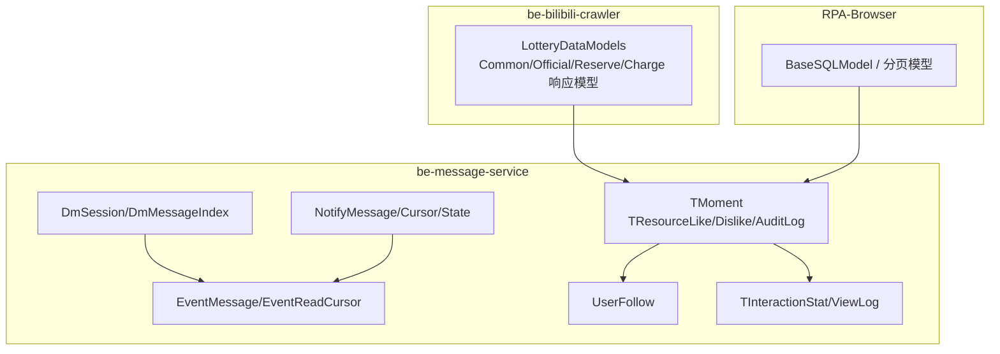
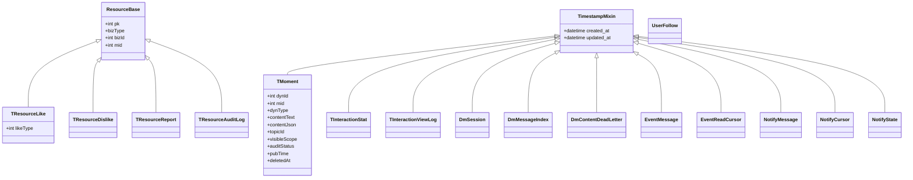
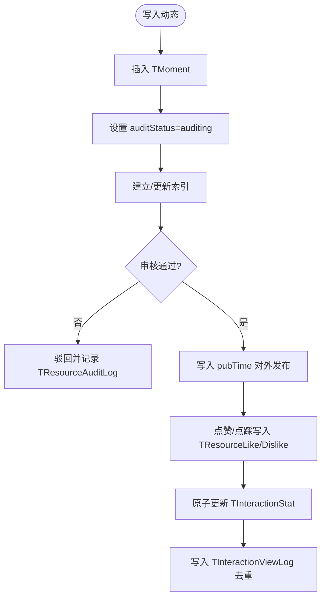
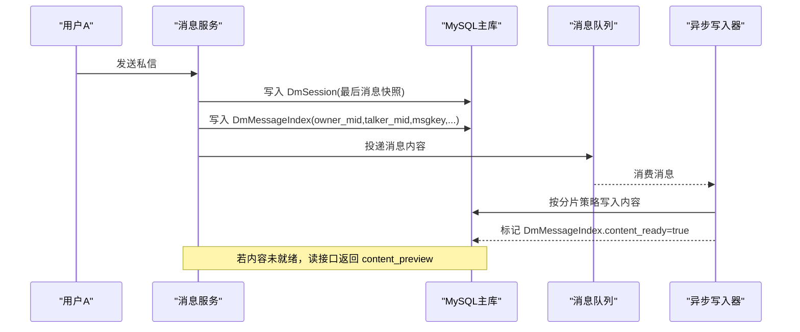
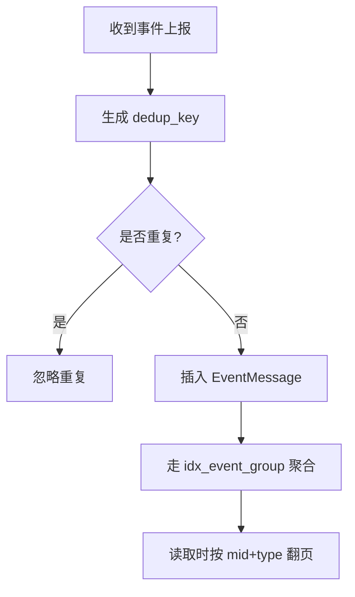
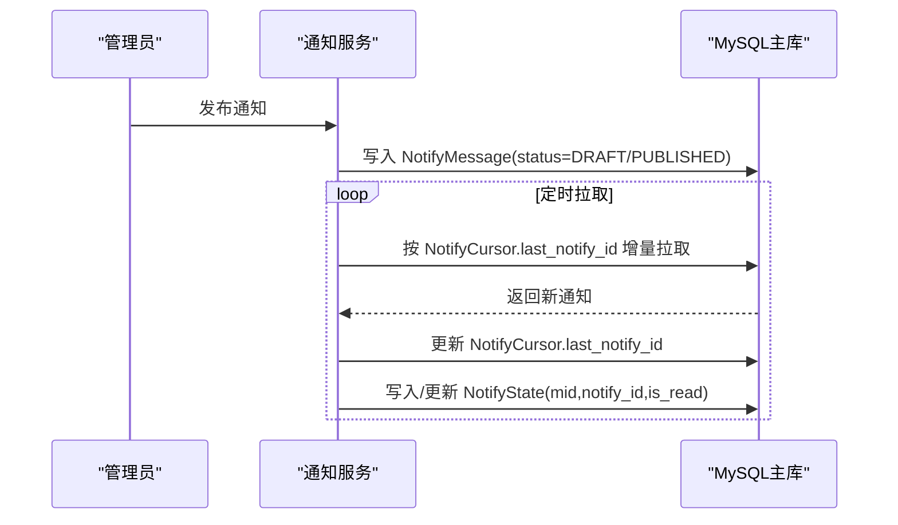
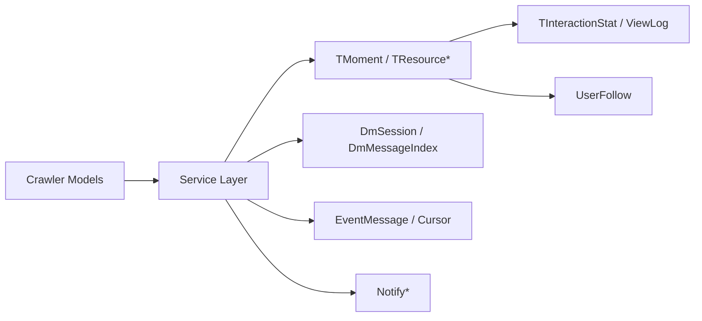
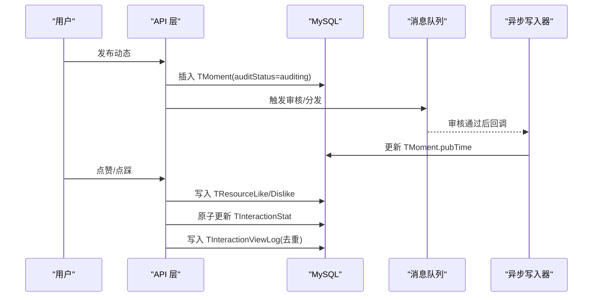

# 数据模型

<cite>
**本文引用的文件**
- [base_sqlmodel.py](file://RPA-Browser/app/models/base/base_sqlmodel.py)
- [LotteryDataModels.py](file://be-bilibili-crawler/Models/lottery_database/bili/LotteryDataModels.py)
- [base_tbl.py](file://be-message-service/app/models/db/base_tbl.py)
- [moment_tbl.py](file://be-message-service/app/models/db/moment_tbl.py)
- [dm_tbl.py](file://be-message-service/app/models/db/dm_tbl.py)
- [follow_tbl.py](file://be-message-service/app/models/db/follow_tbl.py)
- [interaction_tbl.py](file://be-message-service/app/models/db/interaction_tbl.py)
- [resource_tbl.py](file://be-message-service/app/models/db/resource_tbl.py)
- [event_tbl.py](file://be-message-service/app/models/db/event_tbl.py)
- [notify_tbl.py](file://be-message-service/app/models/db/notify_tbl.py)
</cite>

## 目录
1. [引言](#引言)
2. [项目结构](#项目结构)
3. [核心组件](#核心组件)
4. [架构总览](#架构总览)
5. [详细组件分析](#详细组件分析)
6. [依赖关系分析](#依赖关系分析)
7. [性能考虑](#性能考虑)
8. [故障排查指南](#故障排查指南)
9. [结论](#结论)
10. [附录](#附录)

## 引言
本文件面向“B站动态、用户信息、消息记录、任务调度”等核心业务的数据模型，系统性梳理数据库表结构、实体关系与业务模型，覆盖字段定义、约束条件、索引设计、数据流转、缓存策略、性能优化、迁移脚本使用与版本管理、数据验证规则、安全与访问控制。文档以 be-message（MySQL）为主库的实时交互系统为核心，结合 RPA-Browser 与 be-bilibili-crawler 的抽奖/动态数据模型，形成跨服务的数据视图。

## 项目结构
- be-message-service：消息/互动/通知/私信/事件/关注等核心能力，采用 SQLModel + Alembic 管理 MySQL 主库；通过通用基类 ResourceBase/TimestampMixin 统一建模。
- RPA-Browser：浏览器自动化与执行引擎，提供基础分页、时间戳等通用模型。
- be-bilibili-crawler：抓取与处理 B 站动态/抽奖数据，定义大量 Pydantic 模型用于接口与存储映射。

图表来源
- [moment_tbl.py:35-101](file://be-message-service/app/models/db/moment_tbl.py#L35-L101)
- [resource_tbl.py:27-135](file://be-message-service/app/models/db/resource_tbl.py#L27-L135)
- [dm_tbl.py:36-175](file://be-message-service/app/models/db/dm_tbl.py#L36-L175)
- [event_tbl.py:31-103](file://be-message-service/app/models/db/event_tbl.py#L31-L103)
- [notify_tbl.py:24-108](file://be-message-service/app/models/db/notify_tbl.py#L24-L108)
- [follow_tbl.py:34-63](file://be-message-service/app/models/db/follow_tbl.py#L34-L63)
- [interaction_tbl.py:18-39](file://be-message-service/app/models/db/interaction_tbl.py#L18-L39)
- [base_sqlmodel.py:11-59](file://RPA-Browser/app/models/base/base_sqlmodel.py#L11-L59)
- [LotteryDataModels.py:20-455](file://be-bilibili-crawler/Models/lottery_database/bili/LotteryDataModels.py#L20-L455)

章节来源
- [base_sqlmodel.py:11-59](file://RPA-Browser/app/models/base/base_sqlmodel.py#L11-L59)
- [base_tbl.py:12-73](file://be-message-service/app/models/db/base_tbl.py#L12-L73)

## 核心组件
- 动态与资源（be-message）
  - TMoment：动态主表，支持文字/转发、话题关联、可见范围、审核状态、置顶、定时发布、软删除等。
  - TResourceLike/Dislike：通用点赞/点踩明细，一人一赞/踩，唯一约束保证幂等。
  - TResourceReport：通用举报表，按 bizType+bizId 定位任意资源。
  - TResourceAuditLog：通用审核流水，记录状态流转与操作者信息。
  - TInteractionStat/ViewLog：通用计数与浏览去重，支撑 EdgeRank 指标。
- 私信（be-message）
  - DmSession：会话列表（写扩散，owner_mid 视角）。
  - DmMessageIndex：消息索引（内容异步落库，摘要兜底）。
  - DmContentDeadLetter：内容异步落库失败重试。
- 事件提醒（be-message）
  - EventMessage：接收者视角的事件提醒，聚合分组键与 dedup_key 实现幂等与聚合。
  - EventReadCursor：一键已读游标。
- 系统通知（be-message）
  - NotifyMessage：管理员发布的通知本体（读扩散）。
  - NotifyCursor：用户拉取游标，避免重复消费。
  - NotifyState：用户对单条通知的已读状态。
- 关注关系（be-message）
  - UserFollow：mid→target_mid 的关系（following/blocked），双向独立记录。
- 抽奖/动态数据（be-bilibili-crawler）
  - Common/Official/Reserve/Charge 等响应模型，承载动态与抽奖信息、附加信息、统计与筛选元数据。
- 通用基础（RPA-Browser）
  - BaseSQLModel：统一 created_at/updated_at。
  - 分页请求/响应模型：page/per_page/total/items/pages/has_next/has_prev/next_page/prev_page。

章节来源
- [moment_tbl.py:35-101](file://be-message-service/app/models/db/moment_tbl.py#L35-L101)
- [resource_tbl.py:27-135](file://be-message-service/app/models/db/resource_tbl.py#L27-L135)
- [dm_tbl.py:36-175](file://be-message-service/app/models/db/dm_tbl.py#L36-L175)
- [event_tbl.py:31-103](file://be-message-service/app/models/db/event_tbl.py#L31-L103)
- [notify_tbl.py:24-108](file://be-message-service/app/models/db/notify_tbl.py#L24-L108)
- [follow_tbl.py:34-63](file://be-message-service/app/models/db/follow_tbl.py#L34-L63)
- [interaction_tbl.py:18-39](file://be-message-service/app/models/db/interaction_tbl.py#L18-L39)
- [LotteryDataModels.py:20-455](file://be-bilibili-crawler/Models/lottery_database/bili/LotteryDataModels.py#L20-L455)
- [base_sqlmodel.py:11-59](file://RPA-Browser/app/models/base/base_sqlmodel.py#L11-L59)

## 架构总览

图表来源
- [base_tbl.py:12-73](file://be-message-service/app/models/db/base_tbl.py#L12-L73)
- [moment_tbl.py:35-101](file://be-message-service/app/models/db/moment_tbl.py#L35-L101)
- [resource_tbl.py:27-135](file://be-message-service/app/models/db/resource_tbl.py#L27-L135)
- [interaction_tbl.py:18-39](file://be-message-service/app/models/db/interaction_tbl.py#L18-L39)
- [dm_tbl.py:36-175](file://be-message-service/app/models/db/dm_tbl.py#L36-L175)
- [event_tbl.py:31-103](file://be-message-service/app/models/db/event_tbl.py#L31-L103)
- [notify_tbl.py:24-108](file://be-message-service/app/models/db/notify_tbl.py#L24-L108)

## 详细组件分析

### 动态与资源（TMoment、TResource*、TInteraction*）
- 主表 TMoment
  - 主键：dynId（自增 BIGINT）
  - 关键列：mid、dynType、contentText/contentJson、topicId、visibleScope、auditStatus、pubTime、deletedAt
  - 索引：按 mid+pubTime、mid+created_at、auditStatus+created_at、topicId+pubTime、pubTime+visibleScope、repostSrcDynId+auditStatus、bizType+bizRid
  - 自引用：repostSrcDynId → TMoment.dynId（SET NULL）
- 通用资源明细
  - TResourceLike/Dislike：唯一约束 (bizType,bizId,mid)，一人一赞/踩；索引便于按 mid 或 biz 查询
  - TResourceReport：唯一约束 (reportMid,bizType,bizId)；索引 (bizType,bizId)
  - TResourceAuditLog：索引 (bizType,bizId,created_at)、(mid,created_at)、(actionType,created_at)
- 通用计数与浏览
  - TInteractionStat：主键 (bizType,bizId)
  - TInteractionViewLog：主键 pk，唯一 (bizType,bizId,mid)，lastViewAt 判自然日窗口

图表来源
- [moment_tbl.py:35-101](file://be-message-service/app/models/db/moment_tbl.py#L35-L101)
- [resource_tbl.py:27-135](file://be-message-service/app/models/db/resource_tbl.py#L27-L135)
- [interaction_tbl.py:18-39](file://be-message-service/app/models/db/interaction_tbl.py#L18-L39)

章节来源
- [moment_tbl.py:35-101](file://be-message-service/app/models/db/moment_tbl.py#L35-L101)
- [resource_tbl.py:27-135](file://be-message-service/app/models/db/resource_tbl.py#L27-L135)
- [interaction_tbl.py:18-39](file://be-message-service/app/models/db/interaction_tbl.py#L18-L39)

### 私信（DmSession、DmMessageIndex、DmContentDeadLetter）
- 写扩散：发送方与接收方各一行索引记录，读路径简单
- DmSession：会话列表，维护 last_msgkey/preview/ts、未读数、已读水位 ack_msgkey、置顶/免打扰/删除
- DmMessageIndex：消息索引，冗余 content_preview 与 content_ready，审核状态与撤回信息
- DmContentDeadLetter：内容异步落库失败重试，最终一致

图表来源
- [dm_tbl.py:36-175](file://be-message-service/app/models/db/dm_tbl.py#L36-L175)

章节来源
- [dm_tbl.py:36-175](file://be-message-service/app/models/db/dm_tbl.py#L36-L175)

### 事件提醒（EventMessage、EventReadCursor）
- 写扩散：一次行为产生一条给接收者的记录
- 聚合：按 (mid,event_type,source_type,source_id) 联合索引 GROUP BY 聚合
- 幂等：dedup_key 唯一约束拦截重复上报
- 已读：EventReadCursor 维护类型级游标

图表来源
- [event_tbl.py:31-103](file://be-message-service/app/models/db/event_tbl.py#L31-L103)

章节来源
- [event_tbl.py:31-103](file://be-message-service/app/models/db/event_tbl.py#L31-L103)

### 系统通知（NotifyMessage、NotifyCursor、NotifyState）
- 读扩散：一份通知内容，用户侧游标增量拉取
- 目标受众：target_type/target_value 控制推送范围
- 幂等：NotifyCursor 避免重复消费；NotifyState 记录已读

图表来源
- [notify_tbl.py:24-108](file://be-message-service/app/models/db/notify_tbl.py#L24-L108)

章节来源
- [notify_tbl.py:24-108](file://be-message-service/app/models/db/notify_tbl.py#L24-L108)

### 关注关系（UserFollow）
- 单向关系：mid→target_mid，status=following/blocked
- 唯一约束 (mid,target_mid) 保证同一方向仅一条生效
- 索引：idx_follow_mid_status、idx_follow_target_status

章节来源
- [follow_tbl.py:34-63](file://be-message-service/app/models/db/follow_tbl.py#L34-L63)

### 抽奖/动态数据模型（be-bilibili-crawler）
- 通用/官方/预约/充电等响应模型，包含动态ID、作者、发布时间、正文、评论/转发/点赞数、附加信息等
- 附加信息（extra_info）统一承载奖品名、开奖时间、是否需要评论/转发、大奖标志等
- 统计与排序：提供多种枚举与时间范围计算工具，便于前端筛选与后端统计

章节来源
- [LotteryDataModels.py:20-455](file://be-bilibili-crawler/Models/lottery_database/bili/LotteryDataModels.py#L20-L455)

## 依赖关系分析
- 通用基类依赖
  - ResourceBase：统一 bizType/bizId/mid 定位资源
  - TimestampMixin：统一 created_at/updated_at
- 模块内依赖
  - TMoment 与 TResource*：通过 bizType=basic dynamic 关联
  - DmMessageIndex 与 DmContentDeadLetter：异步化补偿链路
  - EventMessage 与 EventReadCursor：聚合与已读联动
  - NotifyMessage/NotifyCursor/NotifyState：读扩散三件套
- 跨服务依赖
  - be-bilibili-crawler 产出动态/抽奖数据，经服务层写入 be-message（如动态/互动）
  - RPA-Browser 提供基础分页与时间戳模型，被上层复用

图表来源
- [base_tbl.py:12-73](file://be-message-service/app/models/db/base_tbl.py#L12-L73)
- [moment_tbl.py:35-101](file://be-message-service/app/models/db/moment_tbl.py#L35-L101)
- [resource_tbl.py:27-135](file://be-message-service/app/models/db/resource_tbl.py#L27-L135)
- [dm_tbl.py:36-175](file://be-message-service/app/models/db/dm_tbl.py#L36-L175)
- [event_tbl.py:31-103](file://be-message-service/app/models/db/event_tbl.py#L31-L103)
- [notify_tbl.py:24-108](file://be-message-service/app/models/db/notify_tbl.py#L24-L108)
- [interaction_tbl.py:18-39](file://be-message-service/app/models/db/interaction_tbl.py#L18-L39)
- [follow_tbl.py:34-63](file://be-message-service/app/models/db/follow_tbl.py#L34-L63)

章节来源
- [base_tbl.py:12-73](file://be-message-service/app/models/db/base_tbl.py#L12-L73)
- [moment_tbl.py:35-101](file://be-message-service/app/models/db/moment_tbl.py#L35-L101)
- [resource_tbl.py:27-135](file://be-message-service/app/models/db/resource_tbl.py#L27-L135)
- [dm_tbl.py:36-175](file://be-message-service/app/models/db/dm_tbl.py#L36-L175)
- [event_tbl.py:31-103](file://be-message-service/app/models/db/event_tbl.py#L31-L103)
- [notify_tbl.py:24-108](file://be-message-service/app/models/db/notify_tbl.py#L24-L108)
- [interaction_tbl.py:18-39](file://be-message-service/app/models/db/interaction_tbl.py#L18-L39)
- [follow_tbl.py:34-63](file://be-message-service/app/models/db/follow_tbl.py#L34-L63)

## 性能考虑
- 索引设计
  - 高频查询路径均建复合索引：如 TMoment 的 mid+pubTime、topicId+pubTime；DmMessageIndex 的 owner_mid+talker_mid+msgkey；EventMessage 的聚合索引
- 写扩散与读扩散
  - 私信/事件采用写扩散降低读复杂度；通知采用读扩散减少冗余
- 异步化与兜底
  - 私信内容异步落库，索引表冗余 content_preview 与 content_ready，保障可用性
  - 死信表 DmContentDeadLetter 保障最终一致
- 计数与去重
  - TInteractionStat 原子 ±1；TInteractionViewLog 按自然日去重，避免刷量
- 分页与计算
  - BasePaginationResp 提供 pages/has_next/has_prev/next_page/prev_page 计算，减轻前端负担

[本节为通用指导，不直接分析具体文件]

## 故障排查指南
- 私信内容缺失
  - 检查 DmMessageIndex.content_ready 是否为 true；若 false，查看 DmContentDeadLetter 是否有重试记录
- 事件未聚合
  - 确认 EventMessage 的 dedup_key 唯一性是否命中；核对 event_type/source_type/source_id 组合
- 通知重复消费
  - 检查 NotifyCursor.last_notify_id 是否正确推进；确认 NotifyState 幂等
- 审核流程异常
  - 查看 TResourceAuditLog 的 actionType/fromStatus/toStatus 流转是否符合预期

章节来源
- [dm_tbl.py:94-175](file://be-message-service/app/models/db/dm_tbl.py#L94-L175)
- [event_tbl.py:31-103](file://be-message-service/app/models/db/event_tbl.py#L31-L103)
- [notify_tbl.py:24-108](file://be-message-service/app/models/db/notify_tbl.py#L24-L108)
- [resource_tbl.py:94-135](file://be-message-service/app/models/db/resource_tbl.py#L94-L135)

## 结论
本数据模型以 be-message 为中心，围绕动态、私信、事件、通知、关注与通用资源交互构建了高可用、可扩展的结构。通过写/读扩散、索引优化、异步化与幂等设计，兼顾了吞吐与一致性。配合 Alembic 的版本化管理与严格的字段约束，确保系统在演进过程中的稳定性与可维护性。

## 附录

### 数据流转过程（示例：动态发布与互动）

图表来源
- [moment_tbl.py:35-101](file://be-message-service/app/models/db/moment_tbl.py#L35-L101)
- [resource_tbl.py:27-135](file://be-message-service/app/models/db/resource_tbl.py#L27-L135)
- [interaction_tbl.py:18-39](file://be-message-service/app/models/db/interaction_tbl.py#L18-L39)

### 缓存策略
- 私信内容：索引表冗余 content_preview 作为兜底，待内容就绪后替换
- 事件聚合：利用索引 GROUP BY，避免额外聚合表
- 通知拉取：基于 NotifyCursor 增量拉取，减少全量扫描

[本节为通用指导，不直接分析具体文件]

### 性能优化方案
- 索引：按查询热点构建复合索引，避免回表
- 写放大：私信写扩散可控（系数固定为2）
- 异步化：私信内容异步落库，提升写入吞吐
- 去重：TInteractionViewLog 按自然日去重，防止刷量

[本节为通用指导，不直接分析具体文件]

### 数据迁移脚本使用方法与版本管理
- 使用 Alembic 管理 be-message 主库迁移（见 alembic 配置）
- 新增/修改表结构后生成迁移脚本，review 后执行升级
- 建议：迁移脚本命名体现业务含义；对大表变更采用分批/在线变更策略

[本节为通用指导，不直接分析具体文件]

### 数据验证规则
- 必填与长度限制：如 topicName max_length=100、ipLocation/max_length=64 等
- 枚举约束：auditStatus、visibleScope、msg_type、event_type 等使用 SAEnum 限制取值
- 唯一约束：如 (bizType,bizId,mid)、(reportMid,bizType,bizId)、dedup_key 等保证幂等

章节来源
- [moment_tbl.py:128-158](file://be-message-service/app/models/db/moment_tbl.py#L128-L158)
- [resource_tbl.py:41-91](file://be-message-service/app/models/db/resource_tbl.py#L41-L91)
- [event_tbl.py:31-85](file://be-message-service/app/models/db/event_tbl.py#L31-L85)

### 安全考虑与访问控制
- 最小权限原则：读写分离与只读回查（如 pptr Postgres 用户信息只读）
- 敏感字段：IP 属地/运营商等仅服务端解析与落库，避免客户端伪造
- 审核机制：动态/话题/私信等具备审核状态与审计日志，支持驳回原因与操作者追踪

章节来源
- [moment_tbl.py:77-99](file://be-message-service/app/models/db/moment_tbl.py#L77-L99)
- [resource_tbl.py:94-135](file://be-message-service/app/models/db/resource_tbl.py#L94-L135)
- [dm_tbl.py:126-147](file://be-message-service/app/models/db/dm_tbl.py#L126-L147)