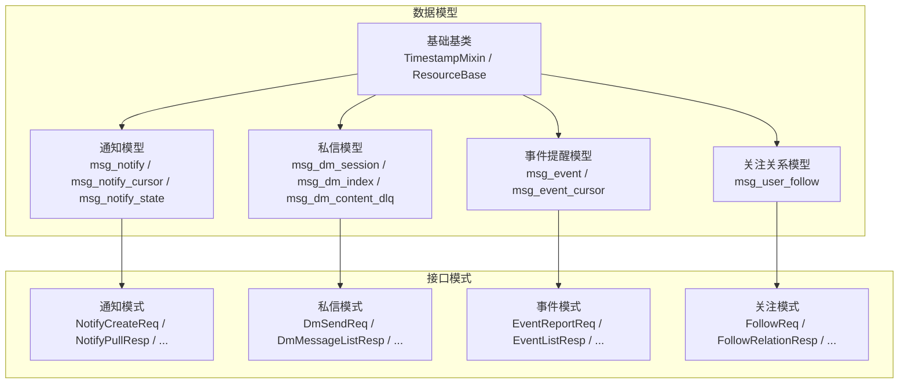
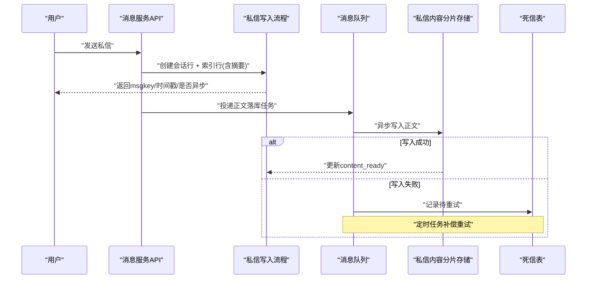
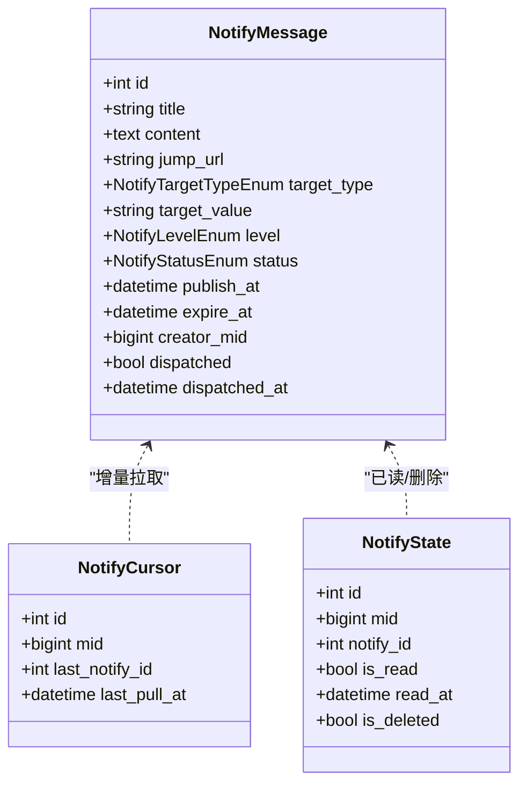
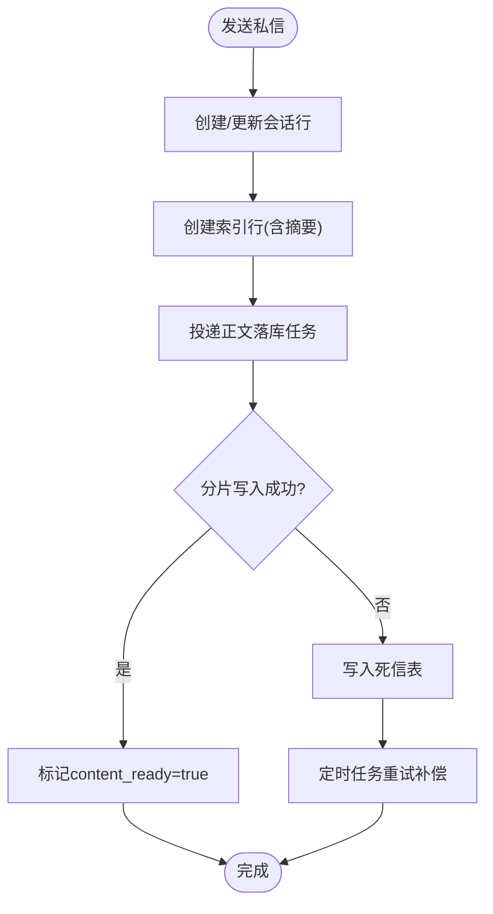
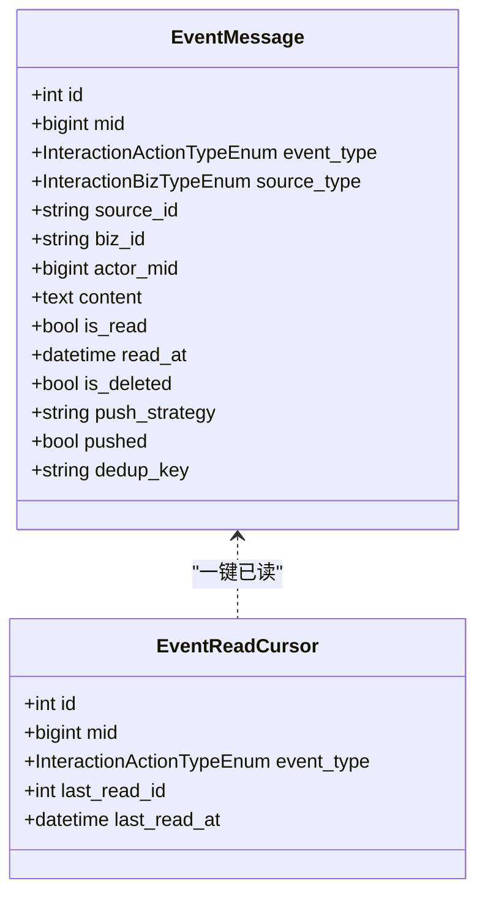
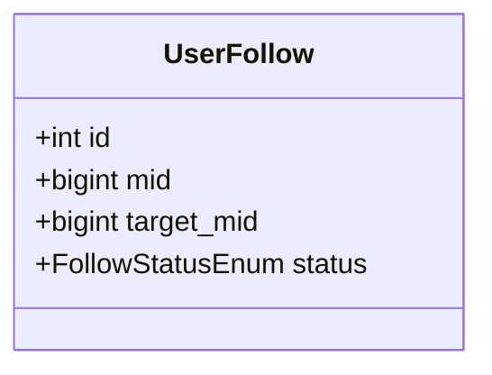
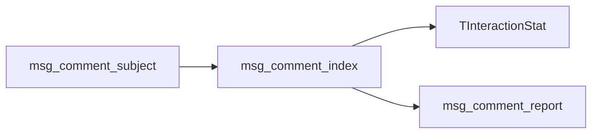
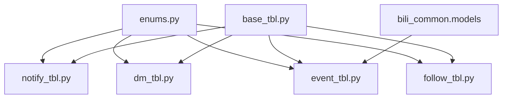

# 消息服务数据模型

<cite>
**本文引用的文件**
- [notify_tbl.py](file://be-message-service/app/models/db/notify_tbl.py)
- [dm_tbl.py](file://be-message-service/app/models/db/dm_tbl.py)
- [event_tbl.py](file://be-message-service/app/models/db/event_tbl.py)
- [follow_tbl.py](file://be-message-service/app/models/db/follow_tbl.py)
- [base_tbl.py](file://be-message-service/app/models/db/base_tbl.py)
- [enums.py](file://be-message-service/app/models/enums.py)
- [notify.py](file://be-message-service/app/models/schemas/notify.py)
- [dm.py](file://be-message-service/app/models/schemas/dm.py)
- [event.py](file://be-message-service/app/models/schemas/event.py)
- [follow.py](file://be-message-service/app/models/schemas/follow.py)
- [20260902_1515-f2712dc213c3_.py](file://be-message-service/alembic/versions/20260902_1515-f2712dc213c3_.py)
</cite>

## 目录
1. [简介](#简介)
2. [项目结构](#项目结构)
3. [核心组件](#核心组件)
4. [架构总览](#架构总览)
5. [详细组件分析](#详细组件分析)
6. [依赖关系分析](#依赖关系分析)
7. [性能考虑](#性能考虑)
8. [故障排查指南](#故障排查指南)
9. [结论](#结论)
10. [附录](#附录)

## 简介
本文件系统性梳理消息服务的数据模型，覆盖系统通知、事件提醒、私信等消息相关的数据结构设计，包括数据库表模型（db models）与 Pydantic/SQLModel 模式（schemas），解释消息生命周期管理、状态流转与业务规则，描述用户交互数据、评论系统、关注关系等核心实体之间的关系映射，并给出数据迁移脚本、版本管理与向后兼容性处理建议，以及数据访问模式和查询优化最佳实践。

## 项目结构
消息服务数据模型主要分布在 be-message-service 的 app/models 目录下：
- db 层：SQLModel 表模型定义，对应 MySQL 表结构与索引设计
- schemas 层：请求/响应体与 DTO，用于 API 契约与校验
- enums 层：统一枚举，贯穿 DB 与接口序列化
- alembic 迁移：DDL 变更与版本管理

图表来源
- [notify_tbl.py:24-111](file://be-message-service/app/models/db/notify_tbl.py#L24-L111)
- [dm_tbl.py:36-178](file://be-message-service/app/models/db/dm_tbl.py#L36-L178)
- [event_tbl.py:31-106](file://be-message-service/app/models/db/event_tbl.py#L31-L106)
- [follow_tbl.py:34-66](file://be-message-service/app/models/db/follow_tbl.py#L34-L66)
- [base_tbl.py:12-73](file://be-message-service/app/models/db/base_tbl.py#L12-L73)
- [notify.py:12-207](file://be-message-service/app/models/schemas/notify.py#L12-L207)
- [dm.py:19-240](file://be-message-service/app/models/schemas/dm.py#L19-L240)
- [event.py:30-313](file://be-message-service/app/models/schemas/event.py#L30-L313)
- [follow.py:21-112](file://be-message-service/app/models/schemas/follow.py#L21-L112)

章节来源
- [notify_tbl.py:1-112](file://be-message-service/app/models/db/notify_tbl.py#L1-L112)
- [dm_tbl.py:1-179](file://be-message-service/app/models/db/dm_tbl.py#L1-L179)
- [event_tbl.py:1-107](file://be-message-service/app/models/db/event_tbl.py#L1-L107)
- [follow_tbl.py:1-67](file://be-message-service/app/models/db/follow_tbl.py#L1-L67)
- [base_tbl.py:1-74](file://be-message-service/app/models/db/base_tbl.py#L1-L74)
- [enums.py:1-412](file://be-message-service/app/models/enums.py#L1-L412)
- [notify.py:1-208](file://be-message-service/app/models/schemas/notify.py#L1-L208)
- [dm.py:1-241](file://be-message-service/app/models/schemas/dm.py#L1-L241)
- [event.py:1-314](file://be-message-service/app/models/schemas/event.py#L1-L314)
- [follow.py:1-113](file://be-message-service/app/models/schemas/follow.py#L1-L113)

## 核心组件
- 系统通知：读扩散方案，单条通知一份内容 + 用户游标增量拉取 + 已读状态幂等记录
- 私信：写扩散，会话列表与消息索引在主库，正文异步落库到分片；提供摘要兜底与死信补偿
- 事件提醒：写扩散，按接收者 mid 落库，聚合展示通过联合索引 GROUP BY；去重键保证幂等
- 关注关系：方向性关系（关注/拉黑），唯一约束防重复，索引支持“我关注的”和“我的粉丝”查询
- 基础能力：统一时间戳混入、通用资源基类（bizType/bizId/mid）

章节来源
- [notify_tbl.py:24-111](file://be-message-service/app/models/db/notify_tbl.py#L24-L111)
- [dm_tbl.py:36-178](file://be-message-service/app/models/db/dm_tbl.py#L36-L178)
- [event_tbl.py:31-106](file://be-message-service/app/models/db/event_tbl.py#L31-L106)
- [follow_tbl.py:34-66](file://be-message-service/app/models/db/follow_tbl.py#L34-L66)
- [base_tbl.py:12-73](file://be-message-service/app/models/db/base_tbl.py#L12-L73)

## 架构总览
消息服务采用“写扩散/读扩散”混合策略：
- 私信与事件提醒：写扩散，读路径简单高效
- 系统通知：读扩散，避免 N 倍冗余，使用游标增量拉取
- 私信内容：异步化落库，主库仅存索引与摘要，失败走死信重试

图表来源
- [dm_tbl.py:36-178](file://be-message-service/app/models/db/dm_tbl.py#L36-L178)
- [20260902_1515-f2712dc213c3_.py:454-534](file://be-message-service/alembic/versions/20260902_1515-f2712dc213c3_.py#L454-L534)

## 详细组件分析

### 系统通知数据模型
- 通知本体（msg_notify）：管理员发布，目标受众按类型/值筛选，支持定时发布与过期，标记是否已完成推送投递
- 用户游标（msg_notify_cursor）：每个用户维护 last_notify_id，增量拉取避免重复消费
- 已读状态（msg_notify_state）：(mid, notify_id) 唯一，记录是否已读与删除状态

图表来源
- [notify_tbl.py:24-111](file://be-message-service/app/models/db/notify_tbl.py#L24-L111)

章节来源
- [notify_tbl.py:24-111](file://be-message-service/app/models/db/notify_tbl.py#L24-L111)
- [notify.py:12-207](file://be-message-service/app/models/schemas/notify.py#L12-L207)
- [enums.py:28-37](file://be-message-service/app/models/enums.py#L28-L37)

### 私信数据模型
- 会话（msg_dm_session）：owner_mid 视角，维护最后消息快照、未读数、已读水位、置顶/免打扰/删除
- 消息索引（msg_dm_index）：收发双方各一行，冗余摘要与就绪标记，审核状态与撤回信息
- 死信（msg_dm_content_dlq）：异步落库失败补偿，按 msgkey 唯一，记录重试次数与错误

图表来源
- [dm_tbl.py:36-178](file://be-message-service/app/models/db/dm_tbl.py#L36-L178)
- [20260902_1515-f2712dc213c3_.py:454-534](file://be-message-service/alembic/versions/20260902_1515-f2712dc213c3_.py#L454-L534)

章节来源
- [dm_tbl.py:36-178](file://be-message-service/app/models/db/dm_tbl.py#L36-L178)
- [dm.py:19-240](file://be-message-service/app/models/schemas/dm.py#L19-L240)
- [enums.py:47-94](file://be-message-service/app/models/enums.py#L47-L94)

### 事件提醒数据模型
- 事件（msg_event）：按接收者 mid 落库，聚合查询通过联合索引 (mid, event_type, source_type, source_id)
- 去重键（dedup_key）：event_type:actor_mid:source_type:source_id:biz_id 摘要，幂等消费
- 已读游标（msg_event_cursor）：按事件类型维护 last_read_id，支持一键已读

图表来源
- [event_tbl.py:31-106](file://be-message-service/app/models/db/event_tbl.py#L31-L106)

章节来源
- [event_tbl.py:31-106](file://be-message-service/app/models/db/event_tbl.py#L31-L106)
- [event.py:30-313](file://be-message-service/app/models/schemas/event.py#L30-L313)
- [enums.py:16-42](file://be-message-service/app/models/enums.py#L16-L42)

### 关注关系数据模型
- 关注/拉黑（msg_user_follow）：方向性关系，唯一约束 (mid, target_mid)，索引支持“我关注的”和“我的粉丝”
- 语义：A 拉黑 B 时，A→B 为 blocked；若 B 曾关注 A，需删除 B→A 的 following 记录

图表来源
- [follow_tbl.py:34-66](file://be-message-service/app/models/db/follow_tbl.py#L34-L66)

章节来源
- [follow_tbl.py:34-66](file://be-message-service/app/models/db/follow_tbl.py#L34-L66)
- [follow.py:21-112](file://be-message-service/app/models/schemas/follow.py#L21-L112)
- [enums.py:311-324](file://be-message-service/app/models/enums.py#L311-L324)

### 评论系统与互动计数（关联）
- 评论主题与索引：msg_comment_subject / msg_comment_index，热点排序与子回复查询
- 通用互动计数：TInteractionStat（非动态资源的点赞/收藏/浏览等）
- 评论举报：msg_comment_report，继承通用举报模型

图表来源
- [20260902_1515-f2712dc213c3_.py:334-453](file://be-message-service/alembic/versions/20260902_1515-f2712dc213c3_.py#L334-L453)
- [20260902_1515-f2712dc213c3_.py:57-73](file://be-message-service/alembic/versions/20260902_1515-f2712dc213c3_.py#L57-L73)

章节来源
- [20260902_1515-f2712dc213c3_.py:334-453](file://be-message-service/alembic/versions/20260902_1515-f2712dc213c3_.py#L334-L453)
- [20260902_1515-f2712dc213c3_.py:57-73](file://be-message-service/alembic/versions/20260902_1515-f2712dc213c3_.py#L57-L73)

## 依赖关系分析
- 枚举依赖：所有模块共享 enums.py 中的统一枚举，DB 层使用 SQLAlchemy Enum，接口层序列化返回整数值
- 基础依赖：TimestampMixin 提供 created_at/updated_at；ResourceBase 提供 bizType/bizId/mid 通用骨架
- 外部依赖：事件与互动类型来自 bili_common.models（InteractionActionTypeEnum / InteractionBizTypeEnum）

图表来源
- [enums.py:1-412](file://be-message-service/app/models/enums.py#L1-L412)
- [base_tbl.py:12-73](file://be-message-service/app/models/db/base_tbl.py#L12-L73)
- [event_tbl.py:28-29](file://be-message-service/app/models/db/event_tbl.py#L28-L29)

章节来源
- [enums.py:1-412](file://be-message-service/app/models/enums.py#L1-L412)
- [base_tbl.py:12-73](file://be-message-service/app/models/db/base_tbl.py#L12-L73)
- [event_tbl.py:28-29](file://be-message-service/app/models/db/event_tbl.py#L28-L29)

## 性能考虑
- 私信写扩散：会话与索引在主库，正文异步落库至分片，提升写吞吐；索引冗余摘要保障读可用性
- 私信翻页：使用 msgkey 作为游标，单调递增且内嵌时间戳，深翻页不退化
- 事件聚合：联合索引 (mid, event_type, source_type, source_id) 支撑 GROUP BY 聚合，避免额外聚合表
- 通知增量：用户游标 last_notify_id 避免重复拉取，减少无效 IO
- 关注关系：唯一约束与复合索引支持高频点查与范围扫描

[本节为通用性能指导，不直接分析具体文件]

## 故障排查指南
- 私信内容异步落库失败：检查死信表 msg_dm_content_dlq，按 msgkey 定位并查看 retry_count 与 last_error，由定时任务重试补偿
- 私信不可见或无正文：确认索引行 content_ready 标志与审核状态 audit_state；必要时回查分片内容与摘要
- 事件重复上报：检查 dedup_key 唯一约束是否拦截重复；核对上游上报逻辑与 MQ 重投策略
- 通知重复消费：核对用户游标 last_notify_id 是否正确持久化；确认服务端与客户端双保险
- 关注关系异常：检查 (mid, target_mid) 唯一约束冲突；拉黑后需清理反向关注记录

章节来源
- [dm_tbl.py:150-178](file://be-message-service/app/models/db/dm_tbl.py#L150-L178)
- [event_tbl.py:82-85](file://be-message-service/app/models/db/event_tbl.py#L82-L85)
- [notify_tbl.py:76-109](file://be-message-service/app/models/db/notify_tbl.py#L76-L109)
- [follow_tbl.py:10-24](file://be-message-service/app/models/db/follow_tbl.py#L10-L24)

## 结论
本数据模型以写扩散与读扩散结合的方式平衡读写性能与一致性，通过游标、去重键、索引设计与异步化机制，实现高吞吐的消息系统。通知、私信、事件与关注关系各司其职，配合统一枚举与基础基类，形成清晰可扩展的数据层。迁移脚本完整覆盖表结构与索引，便于版本管理与回滚。

[本节为总结性内容，不直接分析具体文件]

## 附录

### 数据迁移与版本管理
- Alembic 迁移脚本集中存放于 alembic/versions，当前包含完整的建表与索引定义，涵盖通知、私信、事件、关注、评论、互动统计等
- 升级/降级函数分别实现 schema 的构建与销毁，确保可回滚
- 建议在新增字段或表时生成新的迁移文件，并在团队内评审后执行

章节来源
- [20260902_1515-f2712dc213c3_.py:21-708](file://be-message-service/alembic/versions/20260902_1515-f2712dc213c3_.py#L21-L708)
- [20260902_1515-f2712dc213c3_.py:711-800](file://be-message-service/alembic/versions/20260902_1515-f2712dc213c3_.py#L711-L800)

### 向后兼容性建议
- 枚举扩展：新增枚举值需评估 DDL 影响（MySQL 原生 ENUM），优先在接口层兼容旧值
- 字段新增：尽量使用可空字段与默认值，避免破坏现有查询
- 游标与去重键：保持幂等键格式稳定，避免下游解析失败
- 分页游标：维持 msgkey 单调性与语义不变，确保前端兼容

[本节为通用兼容性指导，不直接分析具体文件]

### 数据访问模式与查询优化最佳实践
- 私信聊天：按 owner_mid + talker_mid + msgkey 倒序翻页，使用游标避免 offset 退化
- 事件列表：按 mid + event_type + id 时间线查询；聚合卡片使用联合索引 GROUP BY
- 通知拉取：按 last_notify_id 增量获取，结合 is_read 与 is_deleted 过滤
- 关注列表：按 mid + status + created_at 查询“我关注的”，按 target_mid + status + created_at 查询“我的粉丝”
- 审核队列：按 audit_state 与 created_at 倒序拉取待审项

[本节为通用查询优化指导，不直接分析具体文件]