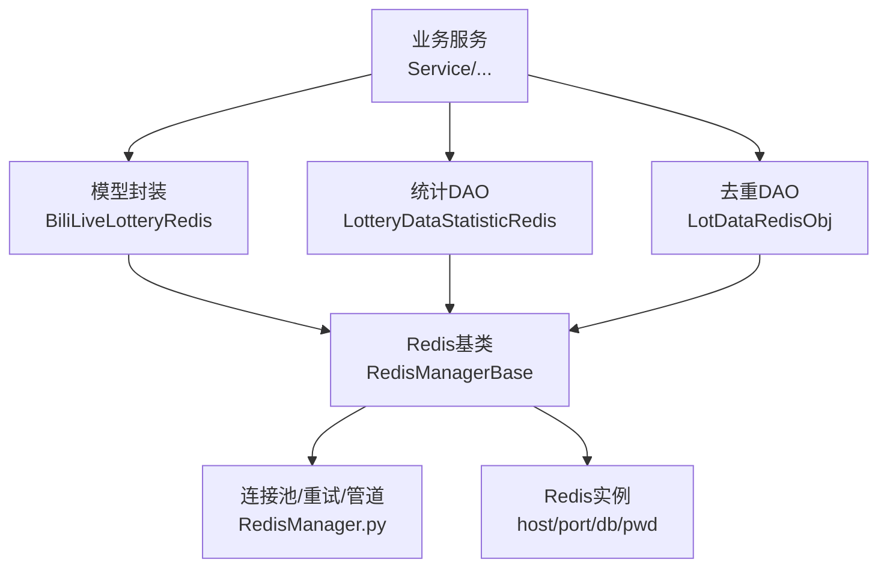
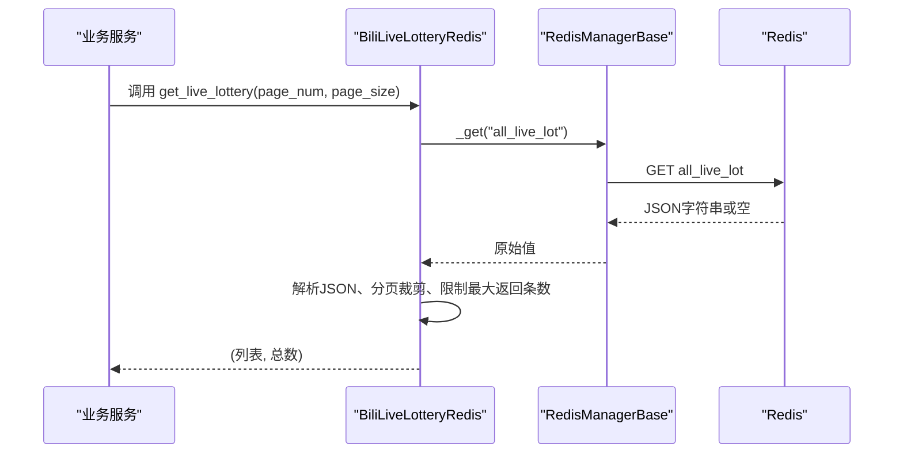
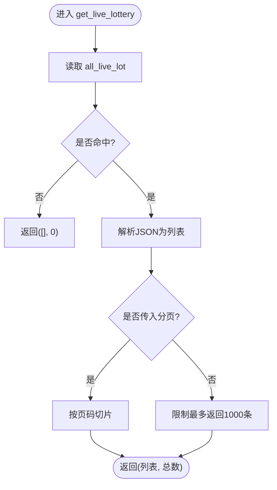
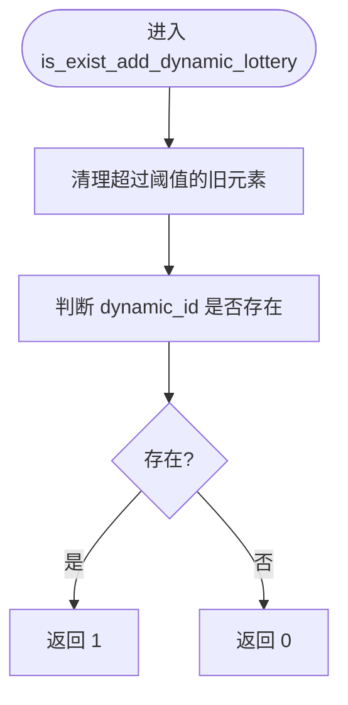
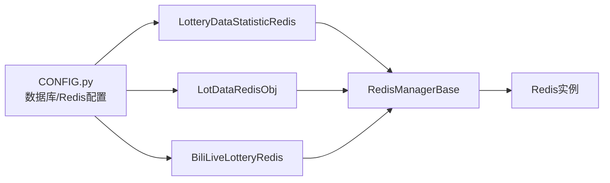

# Redis缓存模型

<cite>
**本文引用的文件**
- [biliRedisModel.py](file://be-bilibili-crawler/Models/lottery_database/redisModel/biliRedisModel.py)
- [RedisManager.py](file://be-bilibili-crawler/Utils/redisTool/RedisManager.py)
- [CONFIG.py](file://be-bilibili-crawler/CONFIG.py)
- [biliLotteryStatisticRedisObj.py](file://be-bilibili-crawler/dao/biliLotteryStatisticRedisObj.py)
- [lotDataRedisObj.py](file://be-bilibili-crawler/dao/lotDataRedisObj.py)
</cite>

## 目录
1. [简介](#简介)
2. [项目结构](#项目结构)
3. [核心组件](#核心组件)
4. [架构总览](#架构总览)
5. [详细组件分析](#详细组件分析)
6. [依赖关系分析](#依赖关系分析)
7. [性能考量](#性能考量)
8. [故障排查指南](#故障排查指南)
9. [结论](#结论)
10. [附录：键命名规范与最佳实践](#附录键命名规范与最佳实践)

## 简介
本文件围绕 be-bilibili-crawler 中的 Redis 缓存数据模型进行系统化说明，重点覆盖 biliRedisModel.py 定义的缓存数据结构、键命名规范、数据类型选择与过期策略；并基于仓库中已有的 Redis 工具类与 DAO 层实现，梳理缓存的组织方式（字符串、哈希表、集合、有序集合）、缓存同步机制与一致性保障方案；同时给出缓存预热、失效处理、监控告警、性能优化与故障排查的实践建议。

## 项目结构
- 模型层：Models/lottery_database/redisModel/biliRedisModel.py 定义了直播抽奖数据的 Redis 访问封装。
- 工具层：Utils/redisTool/RedisManager.py 提供统一的异步/同步 Redis 操作基类，包含连接池、重试、批量操作、锁等能力。
- 配置层：CONFIG.py 集中管理 Redis 主机、端口、密码、DB 编号等连接参数。
- DAO 层：dao 目录下多个 Redis 对象封装了业务场景的键空间与操作语义（如统计同步时间戳、去重队列等）。

图表来源
- [biliRedisModel.py:16-44](file://be-bilibili-crawler/Models/lottery_database/redisModel/biliRedisModel.py#L16-L44)
- [RedisManager.py:187-340](file://be-bilibili-crawler/Utils/redisTool/RedisManager.py#L187-L340)
- [CONFIG.py:360-378](file://be-bilibili-crawler/CONFIG.py#L360-L378)

章节来源
- [biliRedisModel.py:16-44](file://be-bilibili-crawler/Models/lottery_database/redisModel/biliRedisModel.py#L16-L44)
- [RedisManager.py:187-340](file://be-bilibili-crawler/Utils/redisTool/RedisManager.py#L187-L340)
- [CONFIG.py:360-378](file://be-bilibili-crawler/CONFIG.py#L360-L378)

## 核心组件
- BiliLiveLotteryRedis：面向“直播抽奖”列表的缓存读取封装，使用 JSON 字符串存储全量列表，支持分页裁剪与默认上限保护。
- RedisManagerBase：统一异步 Redis 操作基类，提供字符串、集合、有序集合、哈希表、扫描、批量读写、随机成员获取等能力，内置重试与异常处理。
- LotteryDataStatisticRedis：统计相关键空间封装，维护“同步时间戳”等键，用于控制增量同步节奏。
- LotDataRedisObj：基于有序集合的去重队列，按时间分数维护动态ID，支持过期清理与存在性判断。

章节来源
- [biliRedisModel.py:16-44](file://be-bilibili-crawler/Models/lottery_database/redisModel/biliRedisModel.py#L16-L44)
- [RedisManager.py:187-682](file://be-bilibili-crawler/Utils/redisTool/RedisManager.py#L187-L682)
- [biliLotteryStatisticRedisObj.py:13-48](file://be-bilibili-crawler/dao/biliLotteryStatisticRedisObj.py#L13-L48)
- [lotDataRedisObj.py:8-33](file://be-bilibili-crawler/dao/lotDataRedisObj.py#L8-L33)

## 架构总览
系统通过各业务 DAO/模型对 RedisManagerBase 的复用，形成“业务语义 -> 通用操作 -> 连接池/重试”的分层结构。不同业务域通过不同的 DB 编号和键前缀隔离，避免冲突。

图表来源
- [biliRedisModel.py:25-41](file://be-bilibili-crawler/Models/lottery_database/redisModel/biliRedisModel.py#L25-L41)
- [RedisManager.py:303-318](file://be-bilibili-crawler/Utils/redisTool/RedisManager.py#L303-L318)

## 详细组件分析

### BiliLiveLotteryRedis（直播抽奖缓存）
- 键空间：单键 all_live_lot，值为 JSON 数组字符串。
- 数据类型：字符串（JSON）。
- 过期策略：当前未设置 TTL；如需热点数据快速刷新，可在写入侧结合 setex 或外部任务设置合理过期时间。
- 读取逻辑：
  - 若命中则解析为列表，计算 total_num。
  - 若传入分页参数则切片返回；否则默认仅返回前 1000 条，防止全量返回导致网络与内存压力。
- 适用场景：读多写少、可容忍短暂不一致的列表型缓存。

图表来源
- [biliRedisModel.py:25-41](file://be-bilibili-crawler/Models/lottery_database/redisModel/biliRedisModel.py#L25-L41)

章节来源
- [biliRedisModel.py:16-44](file://be-bilibili-crawler/Models/lottery_database/redisModel/biliRedisModel.py#L16-L44)

### RedisManagerBase（通用 Redis 操作基类）
- 连接与重试：
  - 使用连接池，socket_timeout、health_check_interval、retry_on_timeout 等参数提升稳定性。
  - 装饰器 retry/retry_async_generator/sync_retry 对连接错误、BusyLoadingError 等进行自动重试与日志记录。
- 批量与扫描：
  - 提供 _scan_keys_with_prefix_iter、_get_all_val_with_prefix、_del_keys_with_prefix 等迭代式批量操作，避免大 Key 与全量扫描带来的阻塞。
- 数据结构操作：
  - 字符串：_get/_set/_setex/_delete/_exists
  - 集合：_sadd/_sisexist/_srandmember/_scard/_smembers/_srem
  - 有序集合：_zadd/_zscore_change/_zrange/_zrevrangebyscore/_zrank/_zcard/_zcount/_zrandmember/_zdel_elements/_zdel_range
  - 哈希表：_hmset/_hmget_bulk/_hgetall/_hget/_hdel/_hlen
- 并发安全：
  - 同步路径在部分方法中使用 r.lock 加锁，避免竞态条件（注意：异步路径未直接暴露分布式锁封装，需自行扩展或使用 Lua）。

章节来源
- [RedisManager.py:20-100](file://be-bilibili-crawler/Utils/redisTool/RedisManager.py#L20-L100)
- [RedisManager.py:187-682](file://be-bilibili-crawler/Utils/redisTool/RedisManager.py#L187-L682)

### LotteryDataStatisticRedis（统计同步时间戳）
- 键空间：
  - 同步时间戳：LotteryDataStatisticRedis:{lot_type}:sync_ts
  - 排名/奖品键：LotteryDataStatisticRedis:{date}:{lot_type}:{rank_type}_prize
  - 用户信息：LotteryDataStatisticRedis:user_info
- 数据类型：字符串（时间戳）、哈希表（用户信息等）
- 过期策略：当前未显式设置 TTL；建议在写入时结合业务周期设置过期，或在定时任务中清理历史键。
- 典型用法：
  - set_sync_ts/get_sync_ts：记录某类抽奖数据的最近一次同步时间，用于增量同步控制。

章节来源
- [biliLotteryStatisticRedisObj.py:13-48](file://be-bilibili-crawler/dao/biliLotteryStatisticRedisObj.py#L13-L48)

### LotDataRedisObj（去重队列）
- 键空间：add_dynamic_lottery_queue（有序集合）
- 数据类型：有序集合（ZSET），成员为动态ID，分数为时间戳。
- 过期策略：
  - 查询时主动清理超过阈值的旧成员（例如 10 分钟前），避免无限增长。
  - 可通过 ZREMRANGEBYSCORE 定期清理历史数据。
- 典型用法：
  - set_add_dynamic_lottery：将新动态ID加入队列，分数为当前时间。
  - is_exist_add_dynamic_lottery：先清理过期项，再判断是否存在。

图表来源
- [lotDataRedisObj.py:19-30](file://be-bilibili-crawler/dao/lotDataRedisObj.py#L19-L30)

章节来源
- [lotDataRedisObj.py:8-33](file://be-bilibili-crawler/dao/lotDataRedisObj.py#L8-L33)

## 依赖关系分析
- 模块耦合：
  - BiliLiveLotteryRedis 依赖 RedisManagerBase 提供的底层操作。
  - 各 DAO 通过 CONFIG.database.* 指定不同的 Redis DB 编号，实现物理隔离。
- 外部依赖：
  - redis.asyncio 与 redis.sync 客户端，连接池由 ConnectionPool.from_url 创建。
  - 日志模块 redis_logger 用于记录连接与操作异常。
- 潜在风险：
  - 大 Key 与全量扫描可能阻塞主线程；应优先使用 SCAN 分批处理。
  - 未设置 TTL 的键可能导致内存膨胀；建议结合业务生命周期设置过期。

图表来源
- [CONFIG.py:360-378](file://be-bilibili-crawler/CONFIG.py#L360-L378)
- [RedisManager.py:187-340](file://be-bilibili-crawler/Utils/redisTool/RedisManager.py#L187-L340)

章节来源
- [CONFIG.py:360-378](file://be-bilibili-crawler/CONFIG.py#L360-L378)
- [RedisManager.py:187-340](file://be-bilibili-crawler/Utils/redisTool/RedisManager.py#L187-L340)

## 性能考量
- 连接与超时：
  - 使用连接池与 socket_timeout、health_check_interval、retry_on_timeout 提升稳定性与吞吐。
- 批量与管道：
  - 优先使用 pipeline 批量执行命令，减少 RTT。
  - 使用 MGET/MSET/HSET(mapping) 等批量接口。
- 扫描与删除：
  - 使用 SCAN 迭代而非 KEYS，避免阻塞。
  - 使用 UNLINK 替代 DEL 降低阻塞风险。
- 数据结构选择：
  - 去重与时间窗口：使用 ZSET 以时间戳为分数，便于范围查询与过期清理。
  - 列表缓存：使用字符串+JSON，适合读多写少且结构稳定的场景；注意大小限制与序列化成本。
  - 计数与排行榜：使用 ZSET 的 score 与 rank 能力。
- 限流与并发：
  - 通过信号量与重试控制突发流量，避免雪崩。
- 内存与容量：
  - 为大 Key 设置合理 TTL，定期清理历史数据。
  - 监控 key 数量与内存占用，及时扩容或归档。

[本节为通用指导，不直接引用具体代码]

## 故障排查指南
- 常见问题定位：
  - 连接错误/BusyLoadingError：检查重试日志与 Redis 状态；必要时重启或等待恢复。
  - 大 Key/慢查询：使用 SCAN 分批处理，避免 KEYS；评估是否需要拆分或归档。
  - 内存飙升：检查未设置 TTL 的键；增加过期策略或定时清理。
  - 数据不一致：确认写入侧是否设置 TTL；考虑引入版本号或时间戳校验。
- 日志与监控：
  - 关注 redis_logger 输出，定位异常堆栈与参数。
  - 建议接入 Redis 指标监控（QPS、延迟、命中率、内存、Key 数量）。
- 回滚与降级：
  - 当 Redis 不可用时，降级到直连数据库或返回兜底数据，保证可用性。

章节来源
- [RedisManager.py:20-100](file://be-bilibili-crawler/Utils/redisTool/RedisManager.py#L20-L100)

## 结论
本项目通过分层设计将业务语义与 Redis 操作解耦：模型层定义键空间与业务规则，DAO 层封装领域操作，工具层提供稳定可靠的底层能力。结合合理的键命名、数据类型选择与过期策略，可有效支撑高并发与大数据量的缓存需求。建议在生产环境完善 TTL、监控告警与压测验证，确保稳定性与可观测性。

[本节为总结性内容，不直接引用具体代码]

## 附录：键命名规范与最佳实践
- 键命名规范
  - 采用“业务域:子域:实体:标识”的分段形式，便于管理与检索。
  - 示例：
    - 直播抽奖列表：all_live_lot（当前实现）
    - 统计同步时间戳：LotteryDataStatisticRedis:{lot_type}:sync_ts
    - 排名/奖品：LotteryDataStatisticRedis:{date}:{lot_type}:{rank_type}_prize
    - 用户信息：LotteryDataStatisticRedis:user_info
    - 去重队列：add_dynamic_lottery_queue
- 数据类型选择
  - 字符串：简单键值、JSON 序列化的大对象（如列表缓存）。
  - 哈希表：结构化字段存储（如用户信息、配置项）。
  - 集合：去重、随机抽取、交集并集差集运算。
  - 有序集合：排行榜、时间窗口去重、滑动窗口统计。
- 过期策略
  - 所有键均应设置合理 TTL，避免长期驻留造成内存压力。
  - 对于热点数据，可采用短 TTL + 后台刷新策略，保证新鲜度与性能。
  - 对有序集合，定期清理过期成员（如 ZREMRANGEBYSCORE）。
- 缓存预热
  - 启动时或定时任务预加载热点数据（如直播抽奖列表），减少冷启动延迟。
  - 使用批量写入与管道加速预热过程。
- 失效处理
  - 写入失败时记录日志并触发告警；必要时回退到数据库。
  - 对关键键设置“软失效”（如标记位），配合后台任务重建。
- 监控告警
  - 监控维度：连接数、QPS、延迟、命中率、内存、Key 数量、慢查询。
  - 告警阈值：根据压测结果设定，避免误报与漏报。
- 性能优化技巧
  - 使用 pipeline 批量操作，减少网络往返。
  - 使用 SCAN 替代 KEYS，避免阻塞。
  - 使用 UNLINK 替代 DEL，降低阻塞风险。
  - 合理分片与分区，避免单 Key 过大。
- 实际示例参考
  - 直播抽奖列表读取：见 [get_live_lottery:25-41](file://be-bilibili-crawler/Models/lottery_database/redisModel/biliRedisModel.py#L25-L41)
  - 统计同步时间戳：见 [set_sync_ts/get_sync_ts:38-44](file://be-bilibili-crawler/dao/biliLotteryStatisticRedisObj.py#L38-L44)
  - 去重队列：见 [set_add_dynamic_lottery/is_exist_add_dynamic_lottery:19-30](file://be-bilibili-crawler/dao/lotDataRedisObj.py#L19-L30)

章节来源
- [biliRedisModel.py:25-41](file://be-bilibili-crawler/Models/lottery_database/redisModel/biliRedisModel.py#L25-L41)
- [biliLotteryStatisticRedisObj.py:38-44](file://be-bilibili-crawler/dao/biliLotteryStatisticRedisObj.py#L38-L44)
- [lotDataRedisObj.py:19-30](file://be-bilibili-crawler/dao/lotDataRedisObj.py#L19-L30)