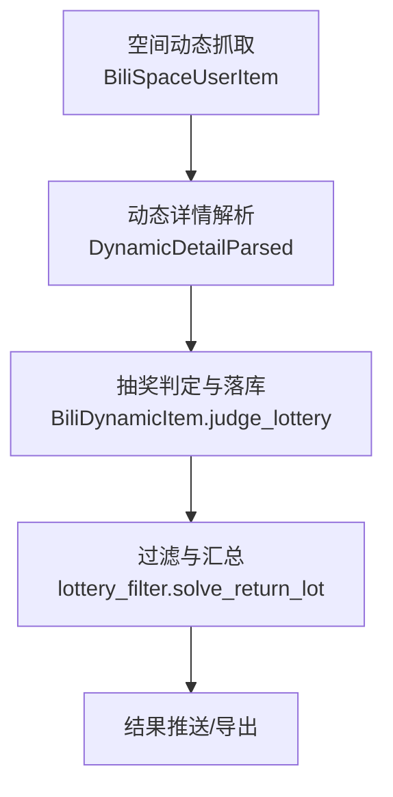
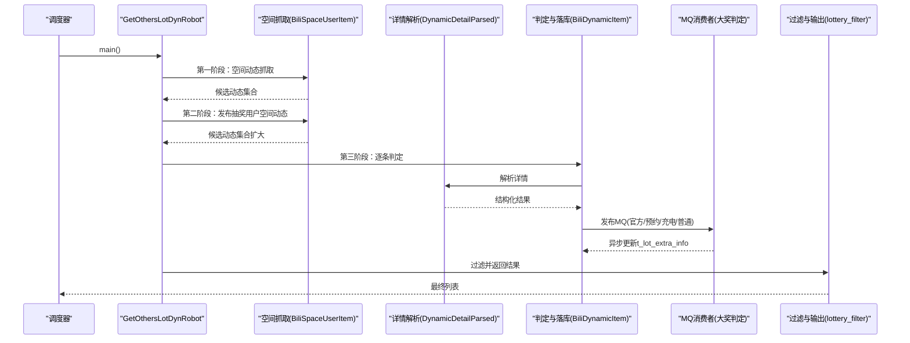
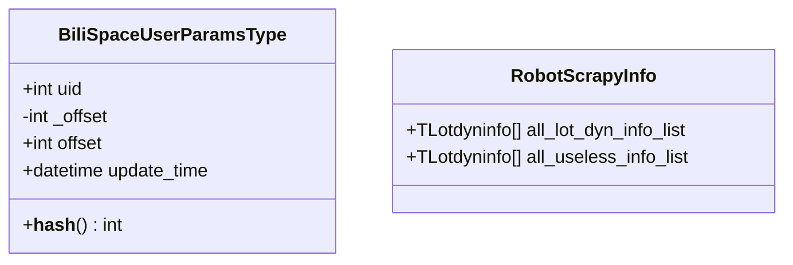
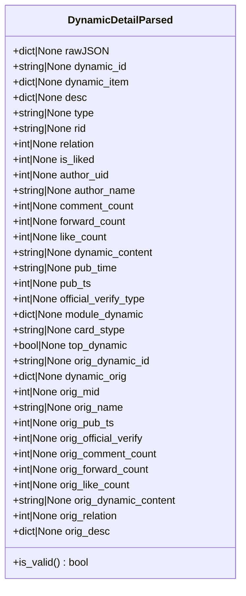
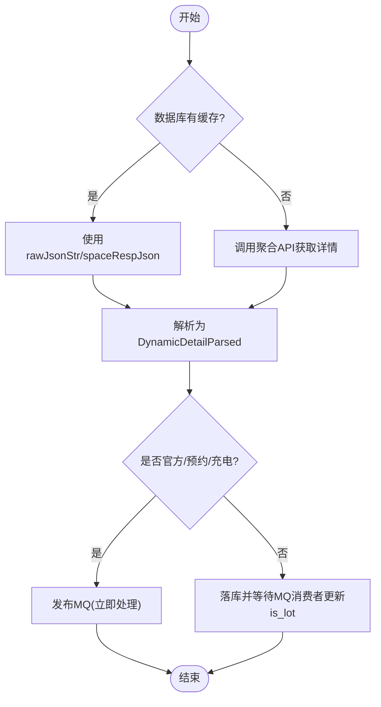
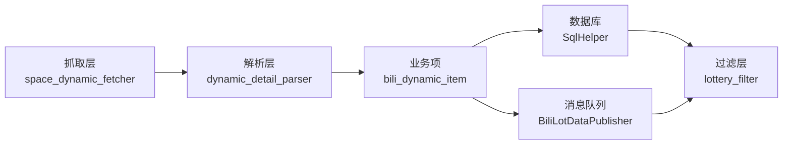

# 动态数据模型

<cite>
**本文引用的文件**
- [dyn_robot_model.py](file://be-bilibili-crawler/Models/get_other_lot_dyn/dyn_robot_model.py)
- [get_others_lot_dyn.py](file://be-bilibili-crawler/Service/GetOthersLotDyn/core/get_others_lot_dyn.py)
- [robot.py](file://be-bilibili-crawler/Service/GetOthersLotDyn/core/robot.py)
- [bili_dynamic_item.py](file://be-bilibili-crawler/Service/GetOthersLotDyn/core/bili_dynamic_item.py)
- [space_dynamic_fetcher.py](file://be-bilibili-crawler/Service/GetOthersLotDyn/fetcher/space_dynamic_fetcher.py)
- [dynamic_detail_parsed.py](file://be-bilibili-crawler/Service/GetOthersLotDyn/parser/dynamic_detail_parsed.py)
- [dynamic_detail_parser.py](file://be-bilibili-crawler/Service/GetOthersLotDyn/parser/dynamic_detail_parser.py)
- [lottery_filter.py](file://be-bilibili-crawler/Service/GetOthersLotDyn/filter/lottery_filter.py)
- [config.py](file://be-bilibili-crawler/Service/BaseCrawler/config.py)
- [custom_pydantic.py](file://be-bilibili-crawler/Models/base/custom_pydantic.py)
</cite>

## 目录
1. [简介](#简介)
2. [项目结构](#项目结构)
3. [核心组件](#核心组件)
4. [架构总览](#架构总览)
5. [详细组件分析](#详细组件分析)
6. [依赖关系分析](#依赖关系分析)
7. [性能与扩展性](#性能与扩展性)
8. [故障排查指南](#故障排查指南)
9. [结论](#结论)
10. [附录：示例与最佳实践](#附录示例与最佳实践)

## 简介
本文件聚焦“其他平台动态数据模型”，围绕 B站第三方抽奖动态采集链路，系统化说明以下要点：
- 机器人账号与任务参数模型（如分页偏移、更新时间等）
- 动态数据的统一解析模型（兼容视频、转发、图片、文章等多类型）
- 数据采集流程中的转换与标准化（空间动态抓取→详情解析→抽奖判定→入库与推送）
- 数据验证规则与异常处理机制（风控重试、缺失字段、无效动态等）
- 多平台适配方案与扩展指南（以 B站为例，提供可复用的抽象模式）
- 实际代码示例路径（便于快速定位实现）

## 项目结构
本项目在 be-bilibili-crawler 下组织“获取他人抽奖动态”的完整流水线：
- 模型层：定义统一的 Pydantic/数据类模型，承载账号参数、解析结果、抓取统计等
- 抓取层：从用户空间拉取动态卡片，识别转发原动态，记录发布抽奖的用户
- 解析层：将原始 JSON 转换为结构化对象，提取正文、互动数、作者信息等
- 判定层：判断是否为抽奖（官方/预约/充电/普通），并触发后续 MQ 处理
- 过滤与输出：按时间、认证类型、互动量等规则过滤，生成最终结果并推送

图表来源
- [space_dynamic_fetcher.py:97-308](file://be-bilibili-crawler/Service/GetOthersLotDyn/fetcher/space_dynamic_fetcher.py#L97-L308)
- [dynamic_detail_parser.py:165-268](file://be-bilibili-crawler/Service/GetOthersLotDyn/parser/dynamic_detail_parser.py#L165-L268)
- [bili_dynamic_item.py:262-481](file://be-bilibili-crawler/Service/GetOthersLotDyn/core/bili_dynamic_item.py#L262-L481)
- [lottery_filter.py:118-150](file://be-bilibili-crawler/Service/GetOthersLotDyn/filter/lottery_filter.py#L118-L150)

章节来源
- [space_dynamic_fetcher.py:1-436](file://be-bilibili-crawler/Service/GetOthersLotDyn/fetcher/space_dynamic_fetcher.py#L1-L436)
- [dynamic_detail_parsed.py:1-91](file://be-bilibili-crawler/Service/GetOthersLotDyn/parser/dynamic_detail_parsed.py#L1-L91)
- [dynamic_detail_parser.py:1-269](file://be-bilibili-crawler/Service/GetOthersLotDyn/parser/dynamic_detail_parser.py#L1-L269)
- [bili_dynamic_item.py:1-482](file://be-bilibili-crawler/Service/GetOthersLotDyn/core/bili_dynamic_item.py#L1-L482)
- [lottery_filter.py:1-151](file://be-bilibili-crawler/Service/GetOthersLotDyn/filter/lottery_filter.py#L1-L151)

## 核心组件
- 机器人任务参数与账号配置
  - 账号分页参数与更新时间追踪：用于断点续爬与去重
  - 抓取统计信息：本轮有效/无效动态集合
- 动态详情解析模型
  - 统一封装 rawJSON、动态ID、类型、rid、作者、互动数、正文、发布时间、官方认证、置顶标记、转发原动态等
- 抓取与判定
  - 空间动态抓取：支持断点续爬、折叠内容、AT用户识别、发布抽奖用户收集
  - 动态详情获取：优先数据库缓存，必要时调用 API；对 412/4101128/4101131 等错误进行重试或跳过
  - 抽奖判定：区分官方/预约/充电/普通，决定是否进入 MQ 异步处理
- 过滤与输出
  - 基于时间、认证类型、互动量阈值过滤，排序后返回标准字典列表

章节来源
- [dyn_robot_model.py:12-57](file://be-bilibili-crawler/Models/get_other_lot_dyn/dyn_robot_model.py#L12-L57)
- [dynamic_detail_parsed.py:12-91](file://be-bilibili-crawler/Service/GetOthersLotDyn/parser/dynamic_detail_parsed.py#L12-L91)
- [space_dynamic_fetcher.py:58-308](file://be-bilibili-crawler/Service/GetOthersLotDyn/fetcher/space_dynamic_fetcher.py#L58-L308)
- [bili_dynamic_item.py:38-481](file://be-bilibili-crawler/Service/GetOthersLotDyn/core/bili_dynamic_item.py#L38-L481)
- [lottery_filter.py:24-150](file://be-bilibili-crawler/Service/GetOthersLotDyn/filter/lottery_filter.py#L24-L150)

## 架构总览
整体采用“三阶段并发 + 异步 MQ”的流水线：
- 第一阶段：抓取目标用户空间动态，收集转发原动态与 AT 用户
- 第二阶段：抓取“发布抽奖用户”的空间动态，扩大候选集
- 第三阶段：对候选动态逐一判定是否抽奖，写入数据库并触发 MQ 消费者完成大奖判定等后续处理

图表来源
- [robot.py:212-269](file://be-bilibili-crawler/Service/GetOthersLotDyn/core/robot.py#L212-L269)
- [space_dynamic_fetcher.py:97-308](file://be-bilibili-crawler/Service/GetOthersLotDyn/fetcher/space_dynamic_fetcher.py#L97-L308)
- [dynamic_detail_parser.py:165-268](file://be-bilibili-crawler/Service/GetOthersLotDyn/parser/dynamic_detail_parser.py#L165-L268)
- [bili_dynamic_item.py:262-481](file://be-bilibili-crawler/Service/GetOthersLotDyn/core/bili_dynamic_item.py#L262-L481)
- [lottery_filter.py:118-150](file://be-bilibili-crawler/Service/GetOthersLotDyn/filter/lottery_filter.py#L118-L150)

## 详细组件分析

### 机器人账号与任务参数模型
- 账号分页参数
  - uid：唯一标识
  - offset：分页游标，变更时自动刷新更新时间戳
  - update_time：由 offset 变更触发的计算字段，便于幂等与断点续爬
- 抓取统计
  - all_lot_dyn_info_list：本轮有效抽奖动态集合
  - all_useless_info_list：本轮无效动态集合

图表来源
- [dyn_robot_model.py:12-57](file://be-bilibili-crawler/Models/get_other_lot_dyn/dyn_robot_model.py#L12-L57)

章节来源
- [dyn_robot_model.py:12-57](file://be-bilibili-crawler/Models/get_other_lot_dyn/dyn_robot_model.py#L12-L57)

### 动态数据解析模型（统一抽象）
- 统一封装字段
  - 原始数据：rawJSON、dynamic_item
  - 元信息：dynamic_id、type、rid、relation、official_verify_type、card_stype、top_dynamic
  - 作者与互动：author_uid、author_name、comment_count、forward_count、like_count
  - 正文与时间：dynamic_content、pub_time、pub_ts
  - 转发原动态：orig_* 系列字段
- 有效性校验
  - is_valid()：仅当 dynamic_id 存在时视为有效

图表来源
- [dynamic_detail_parsed.py:12-91](file://be-bilibili-crawler/Service/GetOthersLotDyn/parser/dynamic_detail_parsed.py#L12-L91)

章节来源
- [dynamic_detail_parsed.py:12-91](file://be-bilibili-crawler/Service/GetOthersLotDyn/parser/dynamic_detail_parsed.py#L12-L91)
- [dynamic_detail_parser.py:165-268](file://be-bilibili-crawler/Service/GetOthersLotDyn/parser/dynamic_detail_parser.py#L165-L268)

### 数据采集与标准化流程
- 空间动态抓取
  - 断点续爬：根据 offset 与 latestFinishedOffset 控制起止
  - 折叠内容与 AT 用户：合并折叠动态 ID，识别 @ 用户作为潜在发布抽奖者
  - 持久化：保存 spaceRespJson 到数据库，便于后续详情获取
- 详情获取与解析
  - 缓存策略：优先使用 t_lotdyninfo.rawJsonStr 或空间表 spaceRespJson
  - API 回退：缓存缺失或字段不完整时调用聚合接口
  - 解析优化：一次性提取模块节点，减少重复 .get() 开销
- 抽奖判定与落库
  - 官方/预约/充电：直接判定并触发 MQ 异步处理
  - 普通动态：is_lot 由 MQ 消费者异步更新 t_lot_extra_info
  - 失效动态：记录为失效条目，避免重复处理

图表来源
- [bili_dynamic_item.py:118-198](file://be-bilibili-crawler/Service/GetOthersLotDyn/core/bili_dynamic_item.py#L118-L198)
- [dynamic_detail_parser.py:165-268](file://be-bilibili-crawler/Service/GetOthersLotDyn/parser/dynamic_detail_parser.py#L165-L268)
- [space_dynamic_fetcher.py:310-332](file://be-bilibili-crawler/Service/GetOthersLotDyn/fetcher/space_dynamic_fetcher.py#L310-L332)

章节来源
- [space_dynamic_fetcher.py:97-308](file://be-bilibili-crawler/Service/GetOthersLotDyn/fetcher/space_dynamic_fetcher.py#L97-L308)
- [bili_dynamic_item.py:118-198](file://be-bilibili-crawler/Service/GetOthersLotDyn/core/bili_dynamic_item.py#L118-L198)
- [dynamic_detail_parser.py:165-268](file://be-bilibili-crawler/Service/GetOthersLotDyn/parser/dynamic_detail_parser.py#L165-L268)

### 数据验证规则与异常处理
- 验证规则
  - 动态有效性：dynamic_id 必须存在
  - 类型映射：comment_type → 内部动态类型（视频/转发/图片/文章）
  - 官方认证：module_author.official_verify.type 或 type 字符串推断
  - 正文提取：desc.text + major.archive/article/opus 文本拼接
- 异常处理
  - 412 风控：休眠重试，强制走 API 重新获取
  - 4101128 屏蔽/不可见：记录日志并跳过
  - 4101131 不存在：返回空解析结果
  - code 缺失或异常：重试并记录关键上下文
  - 大整数安全：序列化时将超 JS 安全整数的值转为字符串

章节来源
- [dynamic_detail_parsed.py:88-91](file://be-bilibili-crawler/Service/GetOthersLotDyn/parser/dynamic_detail_parsed.py#L88-L91)
- [dynamic_detail_parser.py:102-116](file://be-bilibili-crawler/Service/GetOthersLotDyn/parser/dynamic_detail_parser.py#L102-L116)
- [dynamic_detail_parser.py:175-203](file://be-bilibili-crawler/Service/GetOthersLotDyn/parser/dynamic_detail_parser.py#L175-L203)
- [bili_dynamic_item.py:75-109](file://be-bilibili-crawler/Service/GetOthersLotDyn/core/bili_dynamic_item.py#L75-L109)
- [custom_pydantic.py:21-33](file://be-bilibili-crawler/Models/base/custom_pydantic.py#L21-L33)

### 多平台适配与扩展指南
- 抽象设计
  - 通过 DynamicDetailParsed 统一不同平台动态的结构差异
  - 通过 parse_dynamic_item 将平台特定 JSON 映射为标准字段
- 扩展步骤
  - 新增平台适配器：实现解析函数，填充 DynamicDetailParsed
  - 注册到抓取管线：在抓取层产出统一 item，交由解析层处理
  - 复用判定与过滤：无需修改上层逻辑即可接入新平台
- 配置管理
  - 各爬虫独立配置类集中管理（并发、超时、重试、插件等）
  - 通过配置注册表注入实例，避免全局 Settings 耦合

章节来源
- [dynamic_detail_parsed.py:12-91](file://be-bilibili-crawler/Service/GetOthersLotDyn/parser/dynamic_detail_parsed.py#L12-L91)
- [dynamic_detail_parser.py:165-268](file://be-bilibili-crawler/Service/GetOthersLotDyn/parser/dynamic_detail_parser.py#L165-L268)
- [config.py:202-235](file://be-bilibili-crawler/Service/BaseCrawler/config.py#L202-L235)

## 依赖关系分析
- 组件耦合
  - 抓取层依赖 SQLHelper 与 BAPI，产出 BiliDynamicItem
  - 解析层依赖 dynamic_detail_parser，产出 DynamicDetailParsed
  - 判定层依赖 SqlHelper 与 MQ 客户端，完成落库与异步处理
  - 过滤层依赖 SqlHelper 与配置，输出最终结果
- 外部依赖
  - Redis：用户列表、轮次状态、时间戳
  - MySQL：动态详情、用户信息、额外信息
  - MQ：异步大奖判定与扩展处理

图表来源
- [space_dynamic_fetcher.py:97-308](file://be-bilibili-crawler/Service/GetOthersLotDyn/fetcher/space_dynamic_fetcher.py#L97-L308)
- [dynamic_detail_parser.py:165-268](file://be-bilibili-crawler/Service/GetOthersLotDyn/parser/dynamic_detail_parser.py#L165-L268)
- [bili_dynamic_item.py:262-481](file://be-bilibili-crawler/Service/GetOthersLotDyn/core/bili_dynamic_item.py#L262-L481)
- [lottery_filter.py:118-150](file://be-bilibili-crawler/Service/GetOthersLotDyn/filter/lottery_filter.py#L118-L150)

章节来源
- [get_others_lot_dyn.py:24-438](file://be-bilibili-crawler/Service/GetOthersLotDyn/core/get_others_lot_dyn.py#L24-L438)
- [robot.py:27-367](file://be-bilibili-crawler/Service/GetOthersLotDyn/core/robot.py#L27-L367)

## 性能与扩展性
- 性能优化
  - 断点续爬：避免重复抓取，降低 API 压力
  - 缓存优先：数据库缓存 rawJsonStr/spaceRespJson，减少网络请求
  - 解析优化：一次性提取模块节点，减少重复 .get() 开销
  - 并发控制：分阶段调整 max_sem，空间抓取与判定分离
- 扩展性
  - 统一解析模型：新增平台只需适配解析层
  - 配置集中管理：每个爬虫独立配置，便于隔离与调优
  - 异步 MQ：大奖判定与主流程解耦，提升吞吐

[本节为通用指导，不直接分析具体文件]

## 故障排查指南
- 常见问题
  - 412 风控：检查代理可用性，确认重试逻辑生效
  - 4101128 屏蔽/不可见：确认账号权限与隐私设置
  - 4101131 不存在：记录动态链接，避免重复处理
  - code 缺失：检查响应格式，必要时强制走 API 重新获取
- 排查步骤
  - 查看日志：关注关键错误码与动态链接
  - 检查缓存：确认数据库是否存在 rawJsonStr/spaceRespJson
  - 验证解析：核对 DynamicDetailParsed 关键字段是否填充
  - 监控 MQ：确认消费者是否正常处理并更新 t_lot_extra_info

章节来源
- [bili_dynamic_item.py:75-109](file://be-bilibili-crawler/Service/GetOthersLotDyn/core/bili_dynamic_item.py#L75-L109)
- [space_dynamic_fetcher.py:188-205](file://be-bilibili-crawler/Service/GetOthersLotDyn/fetcher/space_dynamic_fetcher.py#L188-L205)
- [dynamic_detail_parser.py:175-203](file://be-bilibili-crawler/Service/GetOthersLotDyn/parser/dynamic_detail_parser.py#L175-L203)

## 结论
本方案通过统一的数据模型与分层架构，实现了多平台动态数据的标准化采集、解析与处理。借助断点续爬、缓存优先、并发控制与异步 MQ，系统在稳定性与性能上具备良好表现。新增平台可通过适配解析层快速接入，保持上层逻辑不变。

[本节为总结，不直接分析具体文件]

## 附录：示例与最佳实践
- 账号参数与分页
  - 参考路径：[dyn_robot_model.py:21-57](file://be-bilibili-crawler/Models/get_other_lot_dyn/dyn_robot_model.py#L21-L57)
- 动态详情解析
  - 参考路径：[dynamic_detail_parsed.py:12-91](file://be-bilibili-crawler/Service/GetOthersLotDyn/parser/dynamic_detail_parsed.py#L12-L91)
  - 参考路径：[dynamic_detail_parser.py:165-268](file://be-bilibili-crawler/Service/GetOthersLotDyn/parser/dynamic_detail_parser.py#L165-L268)
- 抓取与判定
  - 参考路径：[space_dynamic_fetcher.py:97-308](file://be-bilibili-crawler/Service/GetOthersLotDyn/fetcher/space_dynamic_fetcher.py#L97-L308)
  - 参考路径：[bili_dynamic_item.py:262-481](file://be-bilibili-crawler/Service/GetOthersLotDyn/core/bili_dynamic_item.py#L262-L481)
- 过滤与输出
  - 参考路径：[lottery_filter.py:118-150](file://be-bilibili-crawler/Service/GetOthersLotDyn/filter/lottery_filter.py#L118-L150)
- 配置与插件
  - 参考路径：[config.py:202-235](file://be-bilibili-crawler/Service/BaseCrawler/config.py#L202-L235)

[本节为示例指引，不直接分析具体文件]