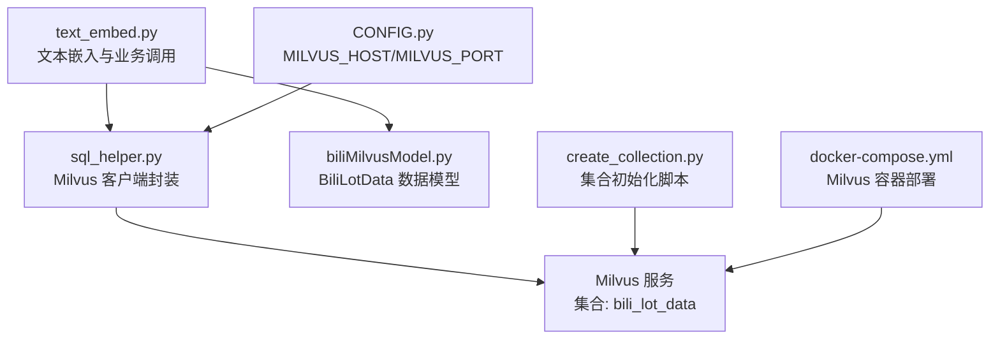
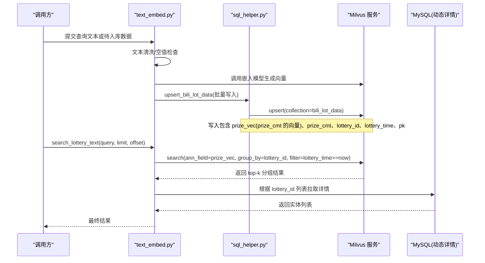
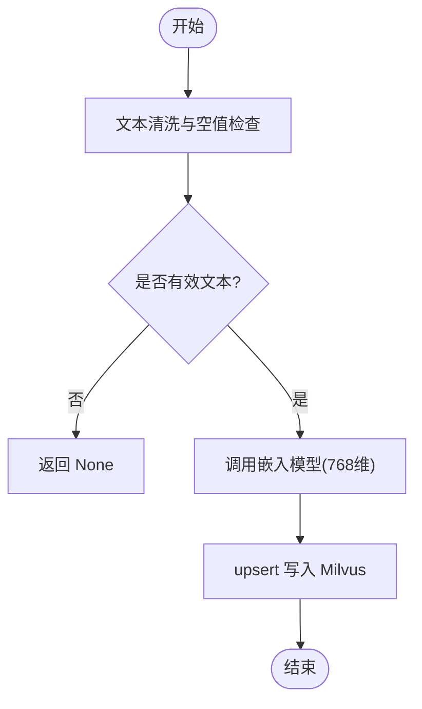
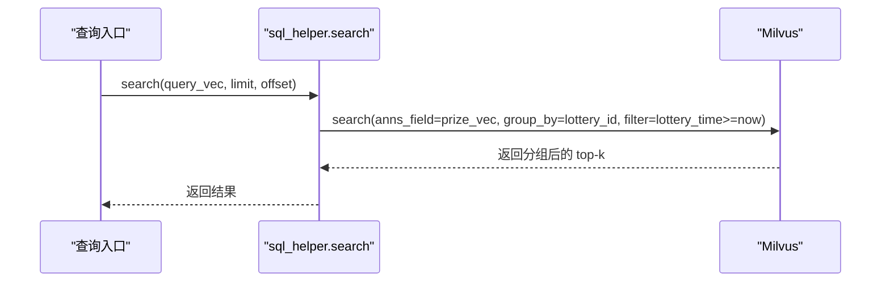
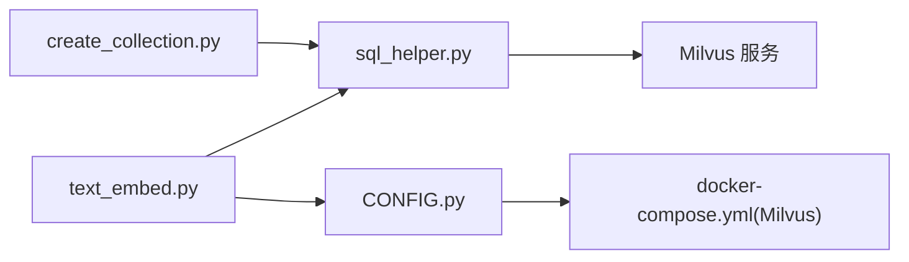

# 向量数据库模型

<cite>
**本文引用的文件**
- [biliMilvusModel.py](file://be-bilibili-crawler/Models/lottery_database/milvusModel/biliMilvusModel.py)
- [sql_helper.py](file://be-bilibili-crawler/Service/LangChainCompo/lottery_data_vec_sql/sql_helper.py)
- [text_embed.py](file://be-bilibili-crawler/Service/LangChainCompo/text_embed.py)
- [create_collection.py](file://be-bilibili-crawler/scripts/database/同步向量数据库/create_collection.py)
- [CONFIG.py](file://be-bilibili-crawler/CONFIG.py)
- [docker-compose.yml](file://docker-compose.yml)
</cite>

## 目录
1. [简介](#简介)
2. [项目结构](#项目结构)
3. [核心组件](#核心组件)
4. [架构总览](#架构总览)
5. [详细组件分析](#详细组件分析)
6. [依赖关系分析](#依赖关系分析)
7. [性能考虑](#性能考虑)
8. [故障排查指南](#故障排查指南)
9. [结论](#结论)
10. [附录](#附录)

## 简介
本文件围绕 Milvus 向量数据库在本项目中的使用，系统化说明向量数据模型、索引与相似度计算、文本向量化流程、检索模式（近似最近邻与精确搜索）、集合管理操作（创建、导入、删除、更新），以及性能优化策略与结果排序规则。重点聚焦于 biliMilvusModel.py 中定义的 BiliLotData 数据结构，并结合 sql_helper.py、text_embed.py 等实现文件，给出端到端的向量数据处理与检索流程说明。

## 项目结构
本项目中与 Milvus 相关的代码主要位于 be-bilibili-crawler 模块：
- 数据模型定义：Models/lottery_database/milvusModel/biliMilvusModel.py
- 向量存储与检索封装：Service/LangChainCompo/lottery_data_vec_sql/sql_helper.py
- 文本向量化与业务入口：Service/LangChainCompo/text_embed.py
- 集合初始化脚本：scripts/database/同步向量数据库/create_collection.py
- 配置与环境：CONFIG.py、docker-compose.yml（Milvus 容器）

图表来源
- [text_embed.py:1-119](file://be-bilibili-crawler/Service/LangChainCompo/text_embed.py#L1-L119)
- [sql_helper.py:1-178](file://be-bilibili-crawler/Service/LangChainCompo/lottery_data_vec_sql/sql_helper.py#L1-L178)
- [biliMilvusModel.py:1-10](file://be-bilibili-crawler/Models/lottery_database/milvusModel/biliMilvusModel.py#L1-L10)
- [create_collection.py:1-77](file://be-bilibili-crawler/scripts/database/同步向量数据库/create_collection.py#L1-L77)
- [CONFIG.py:225-277](file://be-bilibili-crawler/CONFIG.py#L225-L277)
- [docker-compose.yml:43-67](file://docker-compose.yml#L43-L67)

章节来源
- [text_embed.py:1-119](file://be-bilibili-crawler/Service/LangChainCompo/text_embed.py#L1-L119)
- [sql_helper.py:1-178](file://be-bilibili-crawler/Service/LangChainCompo/lottery_data_vec_sql/sql_helper.py#L1-L178)
- [biliMilvusModel.py:1-10](file://be-bilibili-crawler/Models/lottery_database/milvusModel/biliMilvusModel.py#L1-L10)
- [create_collection.py:1-77](file://be-bilibili-crawler/scripts/database/同步向量数据库/create_collection.py#L1-L77)
- [CONFIG.py:225-277](file://be-bilibili-crawler/CONFIG.py#L225-L277)
- [docker-compose.yml:43-67](file://docker-compose.yml#L43-L67)

## 核心组件
- 数据模型 BiliLotData：定义主键 pk、抽奖标识 lottery_id、向量字段 prize_vec、文本字段 prize_cmt、时间戳 lottery_time。用于描述一条“奖项”的向量记录。
- Milvus 客户端封装 Sqlhelper：负责集合创建/加载、索引创建、upsert 写入、search 检索、统计查询、过期数据删除。
- 文本嵌入 text_embed：将文本通过 OpenAI 兼容接口（本地 LLM 服务）转换为 768 维向量；提供批量 upsert 与基于文本的检索入口。
- 集合初始化 create_collection：演示如何构建 schema 与 index_params 并创建集合（含中文分词器配置）。

章节来源
- [biliMilvusModel.py:1-10](file://be-bilibili-crawler/Models/lottery_database/milvusModel/biliMilvusModel.py#L1-L10)
- [sql_helper.py:40-170](file://be-bilibili-crawler/Service/LangChainCompo/lottery_data_vec_sql/sql_helper.py#L40-L170)
- [text_embed.py:13-119](file://be-bilibili-crawler/Service/LangChainCompo/text_embed.py#L13-L119)
- [create_collection.py:8-71](file://be-bilibili-crawler/scripts/database/同步向量数据库/create_collection.py#L8-L71)

## 架构总览
整体流程包括：文本预处理与编码为向量、写入 Milvus 集合、按向量进行近似最近邻检索、过滤未来时间并分组去重、回查 MySQL 获取完整实体信息。

图表来源
- [text_embed.py:22-109](file://be-bilibili-crawler/Service/LangChainCompo/text_embed.py#L22-L109)
- [sql_helper.py:122-144](file://be-bilibili-crawler/Service/LangChainCompo/lottery_data_vec_sql/sql_helper.py#L122-L144)
- [sql_helper.py:40-86](file://be-bilibili-crawler/Service/LangChainCompo/lottery_data_vec_sql/sql_helper.py#L40-L86)

## 详细组件分析

### 数据模型：BiliLotData
- 字段说明
  - pk：整型主键，由 lottery_id 与奖项等级组合生成（例如一等奖 *10、二等奖 *20、三等奖 *30），确保唯一性。
  - lottery_id：抽奖活动标识。
  - prize_vec：浮点向量，维度 768，对应文本的语义向量。
  - prize_cmt：文本字段，用于展示与可能的全文检索（在部分初始化脚本中启用中文分词器）。
  - lottery_time：开奖时间戳，用于过滤未开奖数据。
- 设计要点
  - 使用 Pydantic 模型统一序列化，便于批量 upsert。
  - 向量维度固定为 768，需与嵌入模型输出一致。

章节来源
- [biliMilvusModel.py:1-10](file://be-bilibili-crawler/Models/lottery_database/milvusModel/biliMilvusModel.py#L1-L10)
- [text_embed.py:56-91](file://be-bilibili-crawler/Service/LangChainCompo/text_embed.py#L56-L91)

### 集合与索引：bili_lot_data
- 集合字段
  - pk：INT64，主键
  - lottery_id：INT64
  - prize_vec：FLOAT_VECTOR，dim=768
  - prize_cmt：VARCHAR，最大长度在不同脚本中有差异（256 或 65535）
  - lottery_time：INT64
- 索引与相似度
  - 向量索引类型：FLAT
  - 相似度度量：COSINE
  - 该配置等价于精确最近邻搜索（无近似加速），适合中小规模数据或高精度场景
- 集合生命周期
  - ensure_collection_exists：若不存在则创建并建索引，若存在则尝试加载
  - load_collection：确保集合已加载到内存以支持检索
- 备注
  - 另有独立脚本 create_collection.py 展示了使用 IndexParams 添加多字段索引占位的方式，但实际运行中以 sql_helper.py 的 FLAT+COSINE 为准

章节来源
- [sql_helper.py:40-86](file://be-bilibili-crawler/Service/LangChainCompo/lottery_data_vec_sql/sql_helper.py#L40-L86)
- [sql_helper.py:92-118](file://be-bilibili-crawler/Service/LangChainCompo/lottery_data_vec_sql/sql_helper.py#L92-L118)
- [create_collection.py:8-71](file://be-bilibili-crawler/scripts/database/同步向量数据库/create_collection.py#L8-L71)

### 文本向量化处理流程
- 输入：原始文本（如一等奖/二等奖/三等奖文案）
- 预处理：去除空白、空串校验
- 编码：通过 OpenAI 兼容接口调用本地 LLM 服务（E5 多语言嵌入模型），输出 768 维向量
- 并发控制：使用异步锁限制并发，避免服务端过载
- 存储：将向量与元数据一起 upsert 至 Milvus 集合

图表来源
- [text_embed.py:22-39](file://be-bilibili-crawler/Service/LangChainCompo/text_embed.py#L22-L39)
- [text_embed.py:56-91](file://be-bilibili-crawler/Service/LangChainCompo/text_embed.py#L56-L91)
- [sql_helper.py:122-127](file://be-bilibili-crawler/Service/LangChainCompo/lottery_data_vec_sql/sql_helper.py#L122-L127)

章节来源
- [text_embed.py:13-39](file://be-bilibili-crawler/Service/LangChainCompo/text_embed.py#L13-L39)
- [text_embed.py:56-91](file://be-bilibili-crawler/Service/LangChainCompo/text_embed.py#L56-L91)
- [sql_helper.py:122-127](file://be-bilibili-crawler/Service/LangChainCompo/lottery_data_vec_sql/sql_helper.py#L122-L127)

### 向量检索：查询模式与排序
- 查询模式
  - 近似最近邻搜索（ANN）：当前索引类型为 FLAT，属于精确最近邻（非 ANN 加速）。如需提升大规模检索性能，可替换为 HNSW/IVF_FLAT 等索引类型。
  - 精确搜索：FLAT + COSINE 即为精确最近邻搜索，保证召回质量。
- 过滤与分组
  - 过滤条件：仅检索 lottery_time >= 当前时间的数据（未开奖数据不参与检索）
  - 分组字段：group_by_field="lottery_id"，对同一抽奖活动的多条奖项记录进行分组，避免重复
- 排序规则
  - 默认按相似度分数降序排列（COSINE 越大越相似）
  - 可通过 limit/offset 控制分页与返回数量
- 结果回查
  - 从 Milvus 返回的 lottery_id 列表，再回查 MySQL 获取完整实体信息

图表来源
- [sql_helper.py:129-144](file://be-bilibili-crawler/Service/LangChainCompo/lottery_data_vec_sql/sql_helper.py#L129-L144)
- [text_embed.py:94-109](file://be-bilibili-crawler/Service/LangChainCompo/text_embed.py#L94-L109)

章节来源
- [sql_helper.py:129-144](file://be-bilibili-crawler/Service/LangChainCompo/lottery_data_vec_sql/sql_helper.py#L129-L144)
- [text_embed.py:94-109](file://be-bilibili-crawler/Service/LangChainCompo/text_embed.py#L94-L109)

### 集合管理操作
- 创建集合与索引
  - 通过 ensure_collection_exists 自动检测并创建/加载集合与索引
  - 也可通过 create_collection.py 手动执行初始化脚本
- 数据导入（Upsert）
  - 使用 upsert_bili_lot_data 批量写入，要求每条记录包含 prize_vec
- 删除
  - 提供 del_outdated_bili_lottery_data，按 lottery_time < now 删除过期数据
- 更新
  - 基于主键 pk 的 upsert 即覆盖更新
- 统计
  - get_bili_lot_data_collection_stats 获取行计数等统计信息

章节来源
- [sql_helper.py:92-118](file://be-bilibili-crawler/Service/LangChainCompo/lottery_data_vec_sql/sql_helper.py#L92-L118)
- [sql_helper.py:122-127](file://be-bilibili-crawler/Service/LangChainCompo/lottery_data_vec_sql/sql_helper.py#L122-L127)
- [sql_helper.py:162-170](file://be-bilibili-crawler/Service/LangChainCompo/lottery_data_vec_sql/sql_helper.py#L162-L170)
- [sql_helper.py:146-160](file://be-bilibili-crawler/Service/LangChainCompo/lottery_data_vec_sql/sql_helper.py#L146-L160)
- [create_collection.py:8-71](file://be-bilibili-crawler/scripts/database/同步向量数据库/create_collection.py#L8-L71)

### 使用示例与场景
- 场景一：批量入库抽奖奖项文案
  - 从数据库读取奖项文案，分别编码为 768 维向量，构造 BiliLotData 列表后批量 upsert
  - 参考路径：[text_embed.py:56-91](file://be-bilibili-crawler/Service/LangChainCompo/text_embed.py#L56-L91)
- 场景二：基于文本的相似检索
  - 用户输入查询文本，编码为向量后调用 search，按未开奖时间与分组过滤，返回最相似的奖项
  - 参考路径：[text_embed.py:94-109](file://be-bilibili-crawler/Service/LangChainCompo/text_embed.py#L94-L109)
- 场景三：定时清理过期数据
  - 定期执行删除逻辑，移除 lottery_time 早于当前时间的记录
  - 参考路径：[sql_helper.py:162-170](file://be-bilibili-crawler/Service/LangChainCompo/lottery_data_vec_sql/sql_helper.py#L162-L170)

章节来源
- [text_embed.py:56-91](file://be-bilibili-crawler/Service/LangChainCompo/text_embed.py#L56-L91)
- [text_embed.py:94-109](file://be-bilibili-crawler/Service/LangChainCompo/text_embed.py#L94-L109)
- [sql_helper.py:162-170](file://be-bilibili-crawler/Service/LangChainCompo/lottery_data_vec_sql/sql_helper.py#L162-L170)

## 依赖关系分析
- 组件耦合
  - text_embed.py 依赖 sql_helper.py 完成 Milvus 读写，依赖 CONFIG.py 获取 LLM 服务地址
  - sql_helper.py 依赖 pymilvus 客户端与 AsyncMilvusClient，连接 Milvus 服务
  - create_collection.py 作为初始化脚本，复用 milvus_sql_helper 的客户端实例
- 外部依赖
  - Milvus 服务通过 docker-compose.yml 启动，暴露端口 19530
  - 嵌入模型通过 OpenAI 兼容接口访问本地 LLM 服务（llama_url）

图表来源
- [text_embed.py:1-119](file://be-bilibili-crawler/Service/LangChainCompo/text_embed.py#L1-L119)
- [sql_helper.py:1-178](file://be-bilibili-crawler/Service/LangChainCompo/lottery_data_vec_sql/sql_helper.py#L1-L178)
- [create_collection.py:1-77](file://be-bilibili-crawler/scripts/database/同步向量数据库/create_collection.py#L1-L77)
- [CONFIG.py:225-277](file://be-bilibili-crawler/CONFIG.py#L225-L277)
- [docker-compose.yml:43-67](file://docker-compose.yml#L43-L67)

章节来源
- [text_embed.py:1-119](file://be-bilibili-crawler/Service/LangChainCompo/text_embed.py#L1-L119)
- [sql_helper.py:1-178](file://be-bilibili-crawler/Service/LangChainCompo/lottery_data_vec_sql/sql_helper.py#L1-L178)
- [create_collection.py:1-77](file://be-bilibili-crawler/scripts/database/同步向量数据库/create_collection.py#L1-L77)
- [CONFIG.py:225-277](file://be-bilibili-crawler/CONFIG.py#L225-L277)
- [docker-compose.yml:43-67](file://docker-compose.yml#L43-L67)

## 性能考虑
- 索引选择
  - 当前 FLAT + COSINE 提供精确最近邻，召回质量高但检索延迟随数据量线性增长
  - 建议：当数据量较大时，评估 HNSW 或 IVF_FLAT 等索引类型，权衡召回率与延迟
- 过滤与分组
  - 使用 lottery_time 过滤减少候选集；group_by 降低重复项影响
- 并发与限流
  - 嵌入阶段使用异步锁限制并发，避免 LLM 服务过载
- 批处理
  - 批量 upsert 减少网络往返，提高吞吐
- 资源隔离
  - Milvus 与 LLM 服务分离部署，避免相互影响

[本节为通用性能建议，不直接分析具体文件]

## 故障排查指南
- 集合未创建或未加载
  - 现象：检索时报错或无结果
  - 处理：调用 ensure_collection_exists 自动创建并加载；或通过 create_collection.py 初始化
- 向量维度不匹配
  - 现象：写入或检索失败
  - 处理：确认嵌入模型输出维度与集合 dim=768 一致
- 未返回结果
  - 可能原因：lottery_time 过滤过严（仅返回未来时间）
  - 处理：检查数据时间戳与过滤条件
- 服务不可用
  - 检查 Milvus 容器状态与端口映射（19530）
  - 检查 LLM 服务地址与连通性

章节来源
- [sql_helper.py:92-118](file://be-bilibili-crawler/Service/LangChainCompo/lottery_data_vec_sql/sql_helper.py#L92-L118)
- [sql_helper.py:129-144](file://be-bilibili-crawler/Service/LangChainCompo/lottery_data_vec_sql/sql_helper.py#L129-L144)
- [docker-compose.yml:43-67](file://docker-compose.yml#L43-L67)

## 结论
本项目以 BiliLotData 为核心数据模型，结合 FLAT+COSINE 的精确最近邻索引，实现了稳定的文本语义检索能力。通过 ensure_collection_exists 保障集合可用，通过 upsert 实现高效写入，通过 lottery_time 过滤与 group_by 提升检索质量。后续可根据数据规模引入 ANN 索引进一步优化性能，同时保持对未开奖数据的过滤与分组策略。

[本节为总结性内容，不直接分析具体文件]

## 附录
- 关键配置
  - Milvus 连接：MILVUS_HOST、MILVUS_PORT（来自 CONFIG.py）
  - 嵌入模型：OpenAI 兼容接口，模型名 TEXT_EMBEDDING_MULTILINGUAL_E5_BASE
- 常用操作路径
  - 集合初始化：create_collection.py
  - 写入与检索：sql_helper.py
  - 文本嵌入与业务入口：text_embed.py

章节来源
- [CONFIG.py:225-277](file://be-bilibili-crawler/CONFIG.py#L225-L277)
- [create_collection.py:8-71](file://be-bilibili-crawler/scripts/database/同步向量数据库/create_collection.py#L8-L71)
- [sql_helper.py:40-170](file://be-bilibili-crawler/Service/LangChainCompo/lottery_data_vec_sql/sql_helper.py#L40-L170)
- [text_embed.py:13-119](file://be-bilibili-crawler/Service/LangChainCompo/text_embed.py#L13-L119)