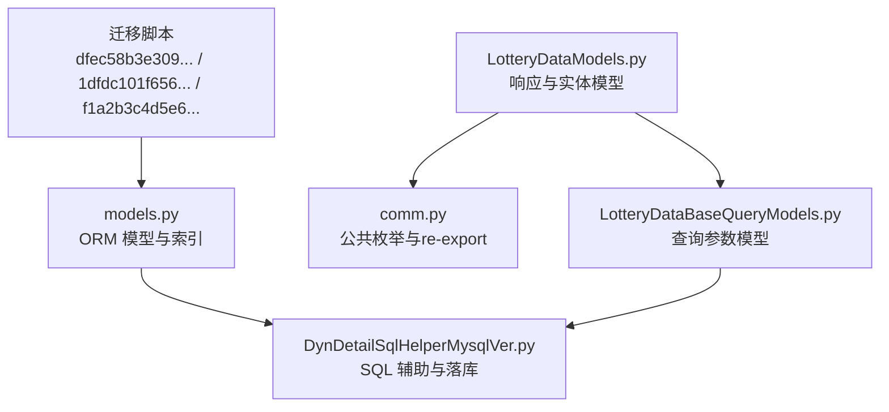
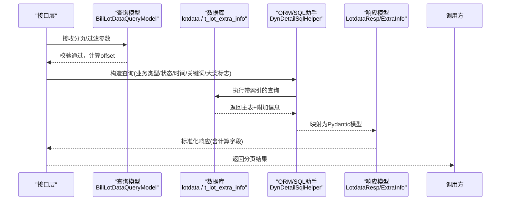
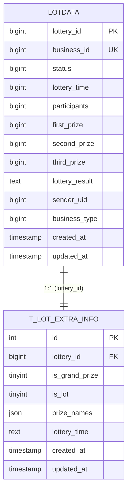
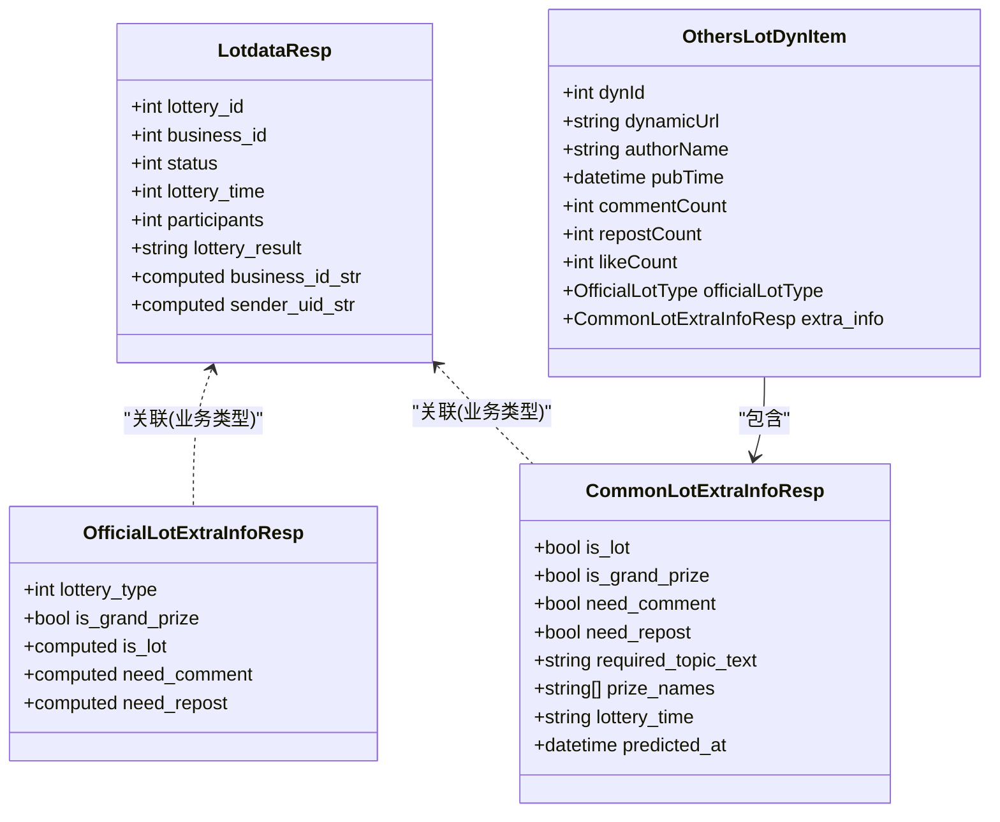
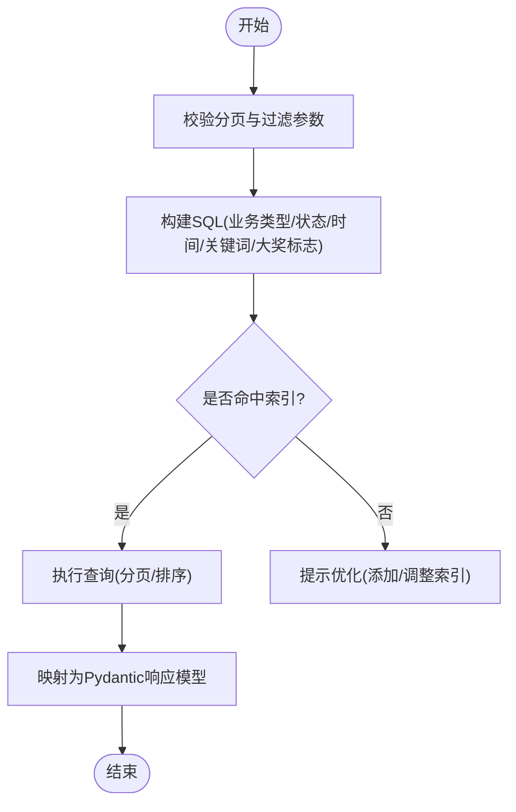
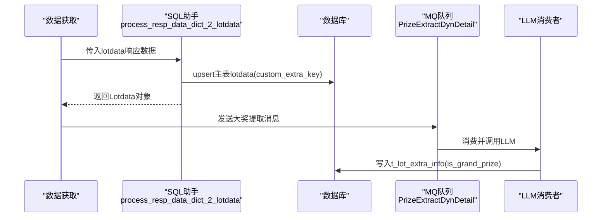
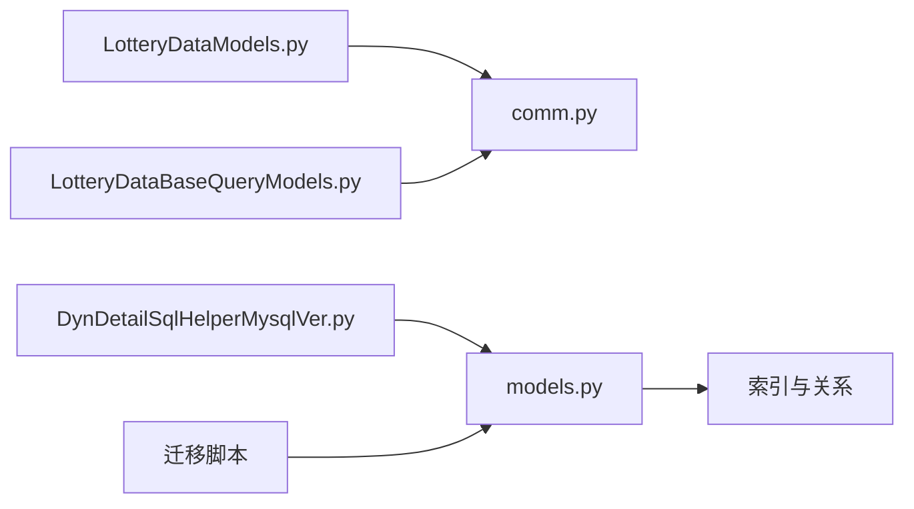

# 抽奖数据模型

<cite>
**本文引用的文件**
- [LotteryDataModels.py](file://be-bilibili-crawler/Models/lottery_database/bili/LotteryDataModels.py)
- [LotteryDataBaseQueryModels.py](file://be-bilibili-crawler/Models/lottery_database/bili/LotteryDataBaseQueryModels.py)
- [comm.py](file://be-bilibili-crawler/Models/lottery_database/bili/comm.py)
- [models.py](file://be-bilibili-crawler/Service/GrpcModule/GrpcSrc/SQLObject/models.py)
- [dfec58b3e309_first_upgrade.py](file://be-bilibili-crawler/alembic/dyndetail/versions/dfec58b3e309_first_upgrade.py)
- [1dfdc101f656_merge_others_lot_info_into_extra_info.py](file://be-bilibili-crawler/alembic/biliopusdb/versions/1dfdc101f656_merge_others_lot_info_into_extra_info.py)
- [f1a2b3c4d5e6_add_lot_extra_info_is_lot_index.py](file://be-bilibili-crawler/alembic/biliopusdb/versions/f1a2b3c4d5e6_add_lot_extra_info_is_lot_index.py)
- [DynDetailSqlHelperMysqlVer.py](file://be-bilibili-crawler/Service/GrpcModule/GrpcSrc/SQLObject/DynDetailSqlHelperMysqlVer.py)
</cite>

## 目录
1. [简介](#简介)
2. [项目结构](#项目结构)
3. [核心组件](#核心组件)
4. [架构总览](#架构总览)
5. [详细组件分析](#详细组件分析)
6. [依赖关系分析](#依赖关系分析)
7. [性能考虑](#性能考虑)
8. [故障排查指南](#故障排查指南)
9. [结论](#结论)
10. [附录](#附录)

## 简介
本文件面向 B 站抽奖数据模型，聚焦以下目标：
- 说明 LotteryDataModels 中实体类结构（动态信息、用户信息、奖品信息等）的数据类型、约束与业务含义。
- 详解 LotteryDataBaseQueryModels 查询模型的分页、条件过滤与聚合统计实现方式。
- 解释 comm.py 中的公共常量与工具函数使用方法。
- 提供数据验证规则、索引优化策略与性能调优建议。
- 给出实际数据操作示例与最佳实践。

## 项目结构
围绕抽奖数据的核心代码位于 be-bilibili-crawler 模块的 Models 与 Service 层：
- 数据模型与响应模型：Models/lottery_database/bili/LotteryDataModels.py
- 查询参数模型：Models/lottery_database/bili/LotteryDataBaseQueryModels.py
- 公共枚举与 re-export：Models/lottery_database/bili/comm.py
- 数据库 ORM 模型与索引：Service/GrpcModule/GrpcSrc/SQLObject/models.py
- 迁移脚本（表结构与索引）：alembic/dyndetail 与 alembic/biliopusdb 下的版本文件
- SQL 辅助与落库逻辑：Service/GrpcModule/GrpcSrc/SQLObject/DynDetailSqlHelperMysqlVer.py

图表来源
- [LotteryDataModels.py:1-823](file://be-bilibili-crawler/Models/lottery_database/bili/LotteryDataModels.py#L1-L823)
- [LotteryDataBaseQueryModels.py:1-38](file://be-bilibili-crawler/Models/lottery_database/bili/LotteryDataBaseQueryModels.py#L1-L38)
- [comm.py:1-46](file://be-bilibili-crawler/Models/lottery_database/bili/comm.py#L1-L46)
- [models.py:24-165](file://be-bilibili-crawler/Service/GrpcModule/GrpcSrc/SQLObject/models.py#L24-L165)
- [DynDetailSqlHelperMysqlVer.py:647-672](file://be-bilibili-crawler/Service/GrpcModule/GrpcSrc/SQLObject/DynDetailSqlHelperMysqlVer.py#L647-L672)
- [dfec58b3e309_first_upgrade.py:19-38](file://be-bilibili-crawler/alembic/dyndetail/versions/dfec58b3e309_first_upgrade.py#L19-L38)
- [1dfdc101f656_merge_others_lot_info_into_extra_info.py:34-39](file://be-bilibili-crawler/alembic/biliopusdb/versions/1dfdc101f656_merge_others_lot_info_into_extra_info.py#L34-L39)
- [f1a2b3c4d5e6_add_lot_extra_info_is_lot_index.py:27-29](file://be-bilibili-crawler/alembic/biliopusdb/versions/f1a2b3c4d5e6_add_lot_extra_info_is_lot_index.py#L27-L29)

章节来源
- [LotteryDataModels.py:1-823](file://be-bilibili-crawler/Models/lottery_database/bili/LotteryDataModels.py#L1-L823)
- [LotteryDataBaseQueryModels.py:1-38](file://be-bilibili-crawler/Models/lottery_database/bili/LotteryDataBaseQueryModels.py#L1-L38)
- [comm.py:1-46](file://be-bilibili-crawler/Models/lottery_database/bili/comm.py#L1-L46)
- [models.py:24-165](file://be-bilibili-crawler/Service/GrpcModule/GrpcSrc/SQLObject/models.py#L24-L165)

## 核心组件
- 主表 Lotdata（lotdata）：存储抽奖主记录，包含业务标识、状态、时间、参与人数、奖项数量、结果 JSON、参与者等字段，并维护多组复合索引以支撑排序与筛选。
- 附加信息表 t_lot_extra_info：存储大奖判断结果及 LLM 提取的通用抽奖信息（如奖品名列表、开奖时间字符串），并通过 lottery_id 与主表关联。
- 响应模型：LotdataResp 用于对外返回 lotdata 记录；OfficialLotExtraInfoResp/CommonLotExtraInfoResp 分别描述官方/普通抽奖的附加信息；OthersLotDynItem 描述第三方抽奖动态条目。
- 查询模型：BiliLotDataQueryModel 定义分页、时间范围、业务类型、状态、关键词、参与人数区间、是否大奖等过滤条件，并提供 offset 计算。
- 公共枚举：comm.py 提供 LotteryBusinessType、BiliLotDataStatusEnum 以及从 bili_common.models.lottery_query re-export 的排序、时间预设、分页与高级查询参数。

章节来源
- [models.py:24-103](file://be-bilibili-crawler/Service/GrpcModule/GrpcSrc/SQLObject/models.py#L24-L103)
- [LotteryDataModels.py:20-67](file://be-bilibili-crawler/Models/lottery_database/bili/LotteryDataModels.py#L20-L67)
- [LotteryDataModels.py:188-256](file://be-bilibili-crawler/Models/lottery_database/bili/LotteryDataModels.py#L188-L256)
- [LotteryDataModels.py:588-623](file://be-bilibili-crawler/Models/lottery_database/bili/LotteryDataModels.py#L588-L623)
- [LotteryDataBaseQueryModels.py:12-38](file://be-bilibili-crawler/Models/lottery_database/bili/LotteryDataBaseQueryModels.py#L12-L38)
- [comm.py:19-31](file://be-bilibili-crawler/Models/lottery_database/bili/comm.py#L19-L31)

## 架构总览
抽奖数据在系统中的流转如下：
- 抓取/解析后通过 SQL 辅助写入 lotdata 主表，并将扩展字段写入 t_lot_extra_info。
- 查询时基于 BiliLotDataQueryModel 构建条件，结合索引进行分页、过滤与排序。
- 对外响应使用 Pydantic 模型封装，统一处理空值、枚举转换与计算字段。

图表来源
- [LotteryDataBaseQueryModels.py:12-38](file://be-bilibili-crawler/Models/lottery_database/bili/LotteryDataBaseQueryModels.py#L12-L38)
- [DynDetailSqlHelperMysqlVer.py:647-672](file://be-bilibili-crawler/Service/GrpcModule/GrpcSrc/SQLObject/DynDetailSqlHelperMysqlVer.py#L647-L672)
- [models.py:24-103](file://be-bilibili-crawler/Service/GrpcModule/GrpcSrc/SQLObject/models.py#L24-L103)
- [LotteryDataModels.py:20-67](file://be-bilibili-crawler/Models/lottery_database/bili/LotteryDataModels.py#L20-L67)

## 详细组件分析

### 主表与附加信息模型（ORM）
- 主表 lotdata：
  - 关键字段：lottery_id（主键）、business_id（唯一）、status、lottery_time、participants、first/second/third_prize、lottery_result、sender_uid、business_type、created_at/updated_at。
  - 索引：UQ_business_id、idx_lottery_id、lottery_time、sender_uid、idx_bt_* 系列复合索引（按 business_type 前缀），便于按业务类型排序与过滤。
- 附加表 t_lot_extra_info：
  - 关键字段：lottery_id（外键，唯一）、is_grand_prize、is_lot、prize_names（JSON）、lottery_time（文本）。
  - 索引：idx_lottery_id（唯一）、idx_lot_type_is_lot（加速 is_lot 计数）。

图表来源
- [models.py:24-103](file://be-bilibili-crawler/Service/GrpcModule/GrpcSrc/SQLObject/models.py#L24-L103)
- [dfec58b3e309_first_upgrade.py:19-38](file://be-bilibili-crawler/alembic/dyndetail/versions/dfec58b3e309_first_upgrade.py#L19-L38)
- [1dfdc101f656_merge_others_lot_info_into_extra_info.py:34-39](file://be-bilibili-crawler/alembic/biliopusdb/versions/1dfdc101f656_merge_others_lot_info_into_extra_info.py#L34-L39)
- [f1a2b3c4d5e6_add_lot_extra_info_is_lot_index.py:27-29](file://be-bilibili-crawler/alembic/biliopusdb/versions/f1a2b3c4d5e6_add_lot_extra_info_is_lot_index.py#L27-L29)

章节来源
- [models.py:24-103](file://be-bilibili-crawler/Service/GrpcModule/GrpcSrc/SQLObject/models.py#L24-L103)
- [dfec58b3e309_first_upgrade.py:19-38](file://be-bilibili-crawler/alembic/dyndetail/versions/dfec58b3e309_first_upgrade.py#L19-L38)
- [1dfdc101f656_merge_others_lot_info_into_extra_info.py:34-39](file://be-bilibili-crawler/alembic/biliopusdb/versions/1dfdc101f656_merge_others_lot_info_into_extra_info.py#L34-L39)
- [f1a2b3c4d5e6_add_lot_extra_info_is_lot_index.py:27-29](file://be-bilibili-crawler/alembic/biliopusdb/versions/f1a2b3c4d5e6_add_lot_extra_info_is_lot_index.py#L27-L29)

### 响应与实体模型（Pydantic）
- LotdataResp：对应 lotdata 主表字段，提供 computed_field 将整型 ID 转为字符串，便于前端展示。
- OfficialLotExtraInfoResp：官方/预约/充电抽奖附加信息，lottery_type 即 business_type；need_comment/need_repost 由 computed_field 根据业务类型实时计算；is_grand_prize 来自大模型判断。
- CommonLotExtraInfoResp：普通/第三方抽奖附加信息，包含 is_lot、is_grand_prize、need_comment、need_repost、required_topic_text、prize_names（LLM 提取）、lottery_time（LLM 提取）、predicted_at。
- OthersLotDynItem：第三方抽奖动态条目，包含动态ID、URL、作者、发布时间、互动数、官方类型标记、extra_info（统一承载奖品与开奖时间）。
- 其他响应：ReserveInfoResp、OfficialLotteryResp、ChargeLotteryResp、LiveLotteryResp、AllLotteryResp 等，覆盖预约、官方、充电、直播等多种场景。

图表来源
- [LotteryDataModels.py:20-67](file://be-bilibili-crawler/Models/lottery_database/bili/LotteryDataModels.py#L20-L67)
- [LotteryDataModels.py:188-256](file://be-bilibili-crawler/Models/lottery_database/bili/LotteryDataModels.py#L188-L256)
- [LotteryDataModels.py:588-623](file://be-bilibili-crawler/Models/lottery_database/bili/LotteryDataModels.py#L588-L623)

章节来源
- [LotteryDataModels.py:20-67](file://be-bilibili-crawler/Models/lottery_database/bili/LotteryDataModels.py#L20-L67)
- [LotteryDataModels.py:188-256](file://be-bilibili-crawler/Models/lottery_database/bili/LotteryDataModels.py#L188-L256)
- [LotteryDataModels.py:588-623](file://be-bilibili-crawler/Models/lottery_database/bili/LotteryDataModels.py#L588-L623)

### 查询模型与分页/过滤/聚合
- BiliLotDataQueryModel：
  - 必填：business_type、page_num、page_size。
  - 可选过滤：status、start_ts/end_ts、sender_uid、min_participants/max_participants、keyword（对抽奖结果描述 LIKE）、created_at_preset/pub_time_preset（快捷时间）、sort_by/sort_order、is_grand_prize。
  - 分页：offset = max(0, (page_num - 1) * page_size)，当 page_num=0 或 page_size=0 时跳过分页。
- 排序与时间预设：通过 re-export 的 LotteryDataSortEnum、SortOrderEnum、TimePresetEnum 统一控制。
- 聚合统计：
  - 通过 t_lot_extra_info 的 idx_lot_type_is_lot 索引加速 is_lot 计数。
  - 统计响应模型：BiliLotStatisticInfoResp、BiliLotStatisticLotteryResultResp 等，支持按业务类型、奖项等级、日期维度聚合。

图表来源
- [LotteryDataBaseQueryModels.py:12-38](file://be-bilibili-crawler/Models/lottery_database/bili/LotteryDataBaseQueryModels.py#L12-L38)
- [f1a2b3c4d5e6_add_lot_extra_info_is_lot_index.py:27-29](file://be-bilibili-crawler/alembic/biliopusdb/versions/f1a2b3c4d5e6_add_lot_extra_info_is_lot_index.py#L27-L29)

章节来源
- [LotteryDataBaseQueryModels.py:12-38](file://be-bilibili-crawler/Models/lottery_database/bili/LotteryDataBaseQueryModels.py#L12-L38)
- [comm.py:1-46](file://be-bilibili-crawler/Models/lottery_database/bili/comm.py#L1-L46)

### 公共常量与工具函数（comm.py）
- 重新导出：LotteryDataSortEnum、SortOrderEnum、OthersLotDynSortEnum、OthersLotDynSortOrderEnum、TimePresetEnum、LotteryPaginationParams、LotterySearchPaginationParams、LotteryAdvancedQueryParams、OthersLotDynListFilterMetadata。
- 本地业务枚举：
  - LotteryBusinessType：Official=1、Reserve=10、Charge=12。
  - BiliLotDataStatusEnum：CANCELED=-1、DELETED=-2、UNFINISHED=0、FINISHED=2、UNKNOWN=404。
- 使用方式：在查询模型与业务逻辑中引用这些枚举，确保前后端一致性与可文档化。

章节来源
- [comm.py:1-46](file://be-bilibili-crawler/Models/lottery_database/bili/comm.py#L1-L46)

### 数据入库流程（落库与解耦）
- 主表落库：仅负责 lotdata 主表的插入/更新，不再耦合大模型大奖判断。
- 大奖判断：获取数据后通过 MQ 队列异步触发 PrizeExtractDynDetail，消费者调用 LLM 提取后直接写 t_lot_extra_info（包含 is_grand_prize）。
- 数据清洗：自定义额外字段会被抽取到 custom_extra_key 中保存为 JSON。

图表来源
- [DynDetailSqlHelperMysqlVer.py:647-672](file://be-bilibili-crawler/Service/GrpcModule/GrpcSrc/SQLObject/DynDetailSqlHelperMysqlVer.py#L647-L672)

章节来源
- [DynDetailSqlHelperMysqlVer.py:647-672](file://be-bilibili-crawler/Service/GrpcModule/GrpcSrc/SQLObject/DynDetailSqlHelperMysqlVer.py#L647-L672)

## 依赖关系分析
- LotteryDataModels 依赖 bili_common.models 中的排序与时间预设枚举，并通过 re-export 保持兼容。
- LotteryDataBaseQueryModels 依赖 comm.py 中的业务枚举与排序/时间预设。
- models.py 定义了 ORM 模型与索引，供 SQL 助手与查询逻辑使用。
- 迁移脚本保证表结构与索引的正确创建与维护。

图表来源
- [LotteryDataModels.py:1-17](file://be-bilibili-crawler/Models/lottery_database/bili/LotteryDataModels.py#L1-L17)
- [LotteryDataBaseQueryModels.py:1-9](file://be-bilibili-crawler/Models/lottery_database/bili/LotteryDataBaseQueryModels.py#L1-L9)
- [comm.py:1-46](file://be-bilibili-crawler/Models/lottery_database/bili/comm.py#L1-L46)
- [models.py:24-165](file://be-bilibili-crawler/Service/GrpcModule/GrpcSrc/SQLObject/models.py#L24-L165)
- [dfec58b3e309_first_upgrade.py:19-38](file://be-bilibili-crawler/alembic/dyndetail/versions/dfec58b3e309_first_upgrade.py#L19-L38)

章节来源
- [LotteryDataModels.py:1-17](file://be-bilibili-crawler/Models/lottery_database/bili/LotteryDataModels.py#L1-L17)
- [LotteryDataBaseQueryModels.py:1-9](file://be-bilibili-crawler/Models/lottery_database/bili/LotteryDataBaseQueryModels.py#L1-L9)
- [comm.py:1-46](file://be-bilibili-crawler/Models/lottery_database/bili/comm.py#L1-L46)
- [models.py:24-165](file://be-bilibili-crawler/Service/GrpcModule/GrpcSrc/SQLObject/models.py#L24-L165)

## 性能考虑
- 索引策略：
  - 主表 lotdata：按 business_type 前缀的复合索引（lottery_time、participants、first_prize、created_at、status+lottery_time）避免 filesort，提升排序与过滤效率。
  - 附加表 t_lot_extra_info：idx_lottery_id（唯一）保障 1:1 关联；idx_lot_type_is_lot 加速 is_lot 计数。
- 查询优化：
  - 优先使用业务类型作为过滤条件，配合时间范围与状态，充分利用复合索引。
  - 关键词过滤（LIKE）尽量限定在较小数据集或使用全文索引（若后续引入）。
- 分页优化：
  - 合理设置 page_size，避免过大导致内存与网络开销。
  - 使用偏移分页时注意深翻页性能，必要时采用游标分页。
- 写入优化：
  - 主表与附加表分离写入，减少事务长度。
  - 大奖判断异步化，降低同步路径延迟。

[本节为通用性能指导，不直接分析具体文件]

## 故障排查指南
- 常见错误：
  - 业务类型或状态枚举值不匹配：检查 comm.py 中的枚举定义与上游传入值。
  - 大奖标志未更新：确认 MQ 链路是否正常消费并写入 t_lot_extra_info。
  - 分页异常：检查 page_num/page_size 是否为非负数，offset 计算是否符合预期。
- 定位方法：
  - 查看 SQL 助手日志与重试包装器输出。
  - 核对迁移脚本是否成功执行，确认索引是否存在。
  - 通过响应模型的 computed_field 与 field_validator 检查数据转换是否正确。

章节来源
- [DynDetailSqlHelperMysqlVer.py:647-672](file://be-bilibili-crawler/Service/GrpcModule/GrpcSrc/SQLObject/DynDetailSqlHelperMysqlVer.py#L647-L672)
- [dfec58b3e309_first_upgrade.py:19-38](file://be-bilibili-crawler/alembic/dyndetail/versions/dfec58b3e309_first_upgrade.py#L19-L38)
- [f1a2b3c4d5e6_add_lot_extra_info_is_lot_index.py:27-29](file://be-bilibili-crawler/alembic/biliopusdb/versions/f1a2b3c4d5e6_add_lot_extra_info_is_lot_index.py#L27-L29)

## 结论
本仓库围绕 B 站抽奖数据构建了清晰的模型体系：主表与附加表分离、响应模型统一封装、查询参数模型规范分页与过滤、公共枚举集中管理。通过合理的索引设计与异步大奖判断，系统在可扩展性与性能之间取得平衡。建议在新增业务类型或查询维度时，遵循现有模式，补充相应索引与验证规则，确保一致性。

[本节为总结性内容，不直接分析具体文件]

## 附录
- 数据验证规则：
  - Pydantic field_validator 处理空字符串转 None、None 转默认值、枚举校验等。
  - computed_field 提供派生字段（如字符串化 ID、need_repost 计算）。
- 索引优化建议：
  - 针对高频查询组合（业务类型+时间/状态）建立复合索引。
  - 对附加表 is_lot 计数场景使用专用索引。
- 性能调优建议：
  - 限制单次查询返回字段，避免 SELECT *。
  - 合理使用分页与排序，避免深翻页。
  - 异步任务与同步路径解耦，降低请求延迟。
- 实际数据操作示例（路径参考）：
  - 查询抽奖列表：使用 BiliLotDataQueryModel 构建参数，调用 SQL 助手执行。
  - 写入抽奖数据：通过 process_resp_data_dict_2_lotdata 落库主表，并发 MQ 触发大奖判断。
  - 读取附加信息：根据 lottery_id 关联 t_lot_extra_info，返回 OfficialLotExtraInfoResp 或 CommonLotExtraInfoResp。

章节来源
- [LotteryDataModels.py:283-315](file://be-bilibili-crawler/Models/lottery_database/bili/LotteryDataModels.py#L283-L315)
- [LotteryDataModels.py:625-641](file://be-bilibili-crawler/Models/lottery_database/bili/LotteryDataModels.py#L625-L641)
- [DynDetailSqlHelperMysqlVer.py:647-672](file://be-bilibili-crawler/Service/GrpcModule/GrpcSrc/SQLObject/DynDetailSqlHelperMysqlVer.py#L647-L672)