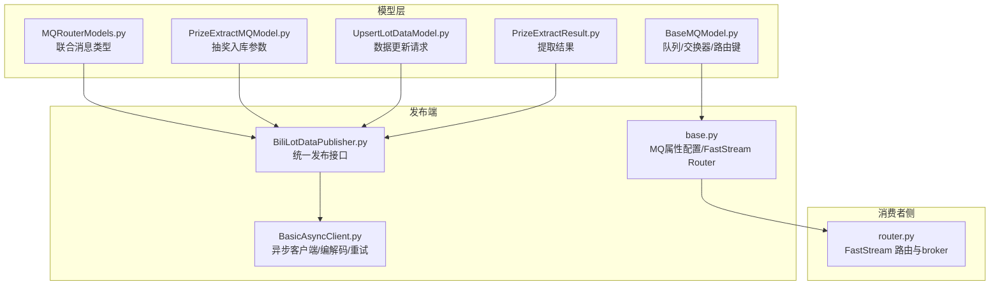
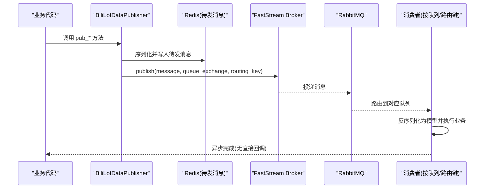
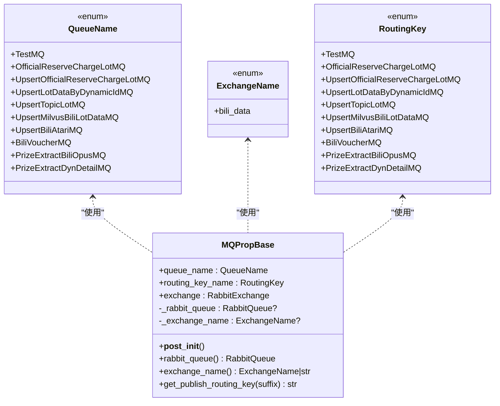
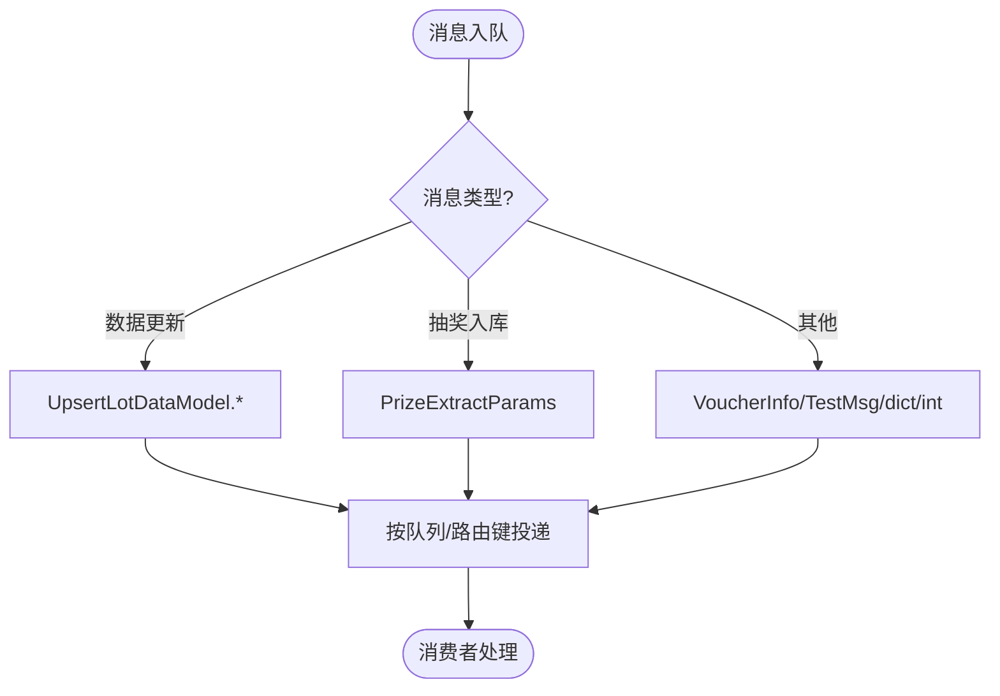
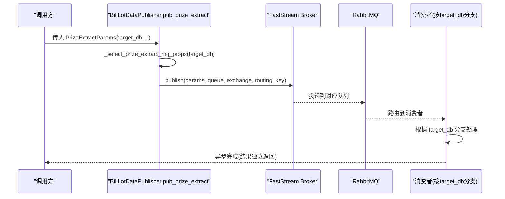
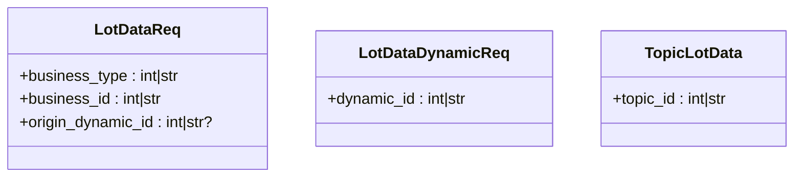
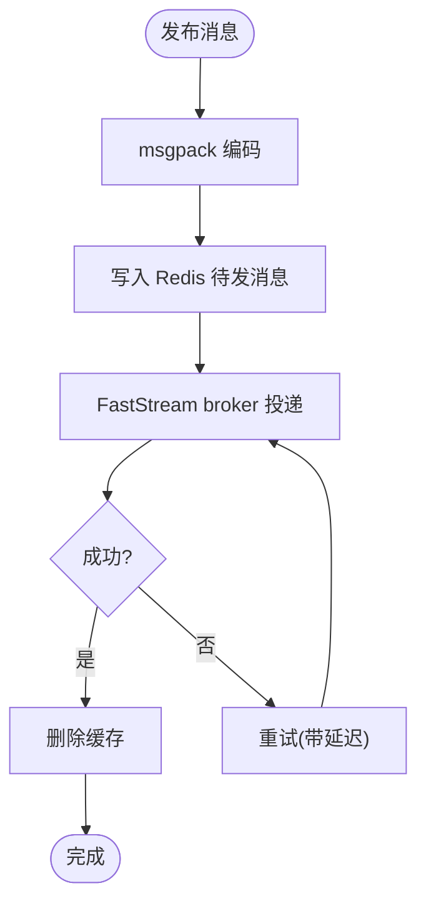
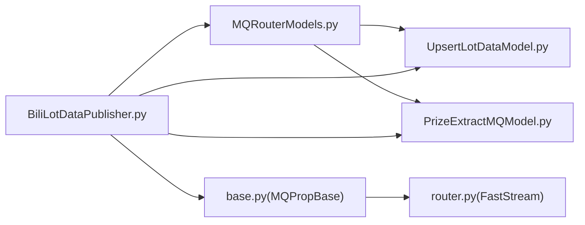

# 消息队列模型

<cite>
**本文引用的文件**
- [BaseMQModel.py](file://be-bilibili-crawler/Models/MQ/BaseMQModel.py)
- [MQRouterModels.py](file://be-bilibili-crawler/Models/MQ/MQRouterModels.py)
- [PrizeExtractMQModel.py](file://be-bilibili-crawler/Models/MQ/PrizeExtractMQModel.py)
- [UpsertLotDataModel.py](file://be-bilibili-crawler/Models/MQ/UpsertLotDataModel.py)
- [PrizeExtractResult.py](file://be-bilibili-crawler/Models/MQ/PrizeExtractResult.py)
- [BasicAsyncClient.py](file://be-bilibili-crawler/Service/MQ/base/BasicAsyncClient.py)
- [BiliLotDataPublisher.py](file://be-bilibili-crawler/Service/MQ/base/MQClient/BiliLotDataPublisher.py)
- [base.py](file://be-bilibili-crawler/Service/MQ/base/MQClient/base.py)
- [router.py](file://be-message-service/app/mq/router.py)
</cite>

## 目录
1. [简介](#简介)
2. [项目结构](#项目结构)
3. [核心组件](#核心组件)
4. [架构总览](#架构总览)
5. [详细组件分析](#详细组件分析)
6. [依赖关系分析](#依赖关系分析)
7. [性能考量](#性能考量)
8. [故障排查指南](#故障排查指南)
9. [结论](#结论)
10. [附录：生产者与消费者使用示例](#附录：生产者与消费者使用示例)

## 简介
本文件聚焦于消息队列数据模型的设计与实现，重点说明：
- BaseMQModel 基类的设计模式与继承关系
- MQRouterModels 中的路由模型定义、消息类型识别与分发机制
- PrizeExtractMQModel 中奖抽取消息模型的结构与处理流程
- UpsertLotDataModel 的数据更新模型设计（插入与更新的统一）
- 消息序列化/反序列化实现与错误处理机制
- 消息生产者与消费者的使用方式与最佳实践

## 项目结构
本项目在爬虫服务（be-bilibili-crawler）中集中定义了 MQ 数据模型与发布端能力，并在消息服务（be-message-service）中以 FastStream 集成消费者。关键路径如下：
- 模型层：Models/MQ/* 定义队列名、路由键、消息体结构
- 发布端：Service/MQ/base/MQClient/* 提供统一的发布封装与重试、缓存重发
- 基础客户端：Service/MQ/base/BasicAsyncClient.py 提供异步发送/接收、编码解码、连接管理
- 消费者入口：app/mq/router.py 注册 RabbitRouter 与 broker 生命周期

**图表来源**
- [BaseMQModel.py:7-74](file://be-bilibili-crawler/Models/MQ/BaseMQModel.py#L7-L74)
- [MQRouterModels.py:1-37](file://be-bilibili-crawler/Models/MQ/MQRouterModels.py#L1-L37)
- [PrizeExtractMQModel.py:17-57](file://be-bilibili-crawler/Models/MQ/PrizeExtractMQModel.py#L17-L57)
- [UpsertLotDataModel.py:6-18](file://be-bilibili-crawler/Models/MQ/UpsertLotDataModel.py#L6-L18)
- [PrizeExtractResult.py:12-40](file://be-bilibili-crawler/Models/MQ/PrizeExtractResult.py#L12-L40)
- [BiliLotDataPublisher.py:54-72](file://be-bilibili-crawler/Service/MQ/base/MQClient/BiliLotDataPublisher.py#L54-L72)
- [base.py:50-103](file://be-bilibili-crawler/Service/MQ/base/MQClient/base.py#L50-L103)
- [BasicAsyncClient.py:97-107](file://be-bilibili-crawler/Service/MQ/base/BasicAsyncClient.py#L97-L107)
- [router.py:22-36](file://be-message-service/app/mq/router.py#L22-L36)

**章节来源**
- [BaseMQModel.py:7-74](file://be-bilibili-crawler/Models/MQ/BaseMQModel.py#L7-L74)
- [MQRouterModels.py:1-37](file://be-bilibili-crawler/Models/MQ/MQRouterModels.py#L1-L37)
- [BiliLotDataPublisher.py:54-72](file://be-bilibili-crawler/Service/MQ/base/MQClient/BiliLotDataPublisher.py#L54-L72)
- [BasicAsyncClient.py:97-107](file://be-bilibili-crawler/Service/MQ/base/BasicAsyncClient.py#L97-L107)
- [router.py:22-36](file://be-message-service/app/mq/router.py#L22-L36)

## 核心组件
- BaseMQModel：定义队列名、交换器名、路由键枚举；提供 MQPropBase 数据类，封装 RabbitQueue/RabbitExchange 及动态路由键生成。
- MQRouterModels：聚合所有可入队的消息体类型，形成统一的联合类型，便于类型推断与校验。
- PrizeExtractMQModel：定义抽奖入库的统一参数模型，按目标数据库拆分队列，但共享同一套消费者逻辑。
- UpsertLotDataModel：定义数据更新请求的通用结构，支持业务类型、动态ID、话题等场景的“插入或更新”语义。
- BasicAsyncClient：提供异步消息发送/接收、msgpack 编解码、连接管理与重试装饰器。
- BiliLotDataPublisher：面向业务的发布器，封装各队列的发布方法，并集成 Redis 待发消息缓存与重试。
- base.py：集中声明各队列对应的 MQPropBase 实例，以及 FastStream 的 Router 与 Broker 获取方式。
- router.py（消息服务）：FastStream 路由与 broker 生命周期管理，作为消费者注册中心。

**章节来源**
- [BaseMQModel.py:7-74](file://be-bilibili-crawler/Models/MQ/BaseMQModel.py#L7-L74)
- [MQRouterModels.py:18-27](file://be-bilibili-crawler/Models/MQ/MQRouterModels.py#L18-L27)
- [PrizeExtractMQModel.py:17-57](file://be-bilibili-crawler/Models/MQ/PrizeExtractMQModel.py#L17-L57)
- [UpsertLotDataModel.py:6-18](file://be-bilibili-crawler/Models/MQ/UpsertLotDataModel.py#L6-L18)
- [BasicAsyncClient.py:15-47](file://be-bilibili-crawler/Service/MQ/base/BasicAsyncClient.py#L15-L47)
- [BiliLotDataPublisher.py:75-284](file://be-bilibili-crawler/Service/MQ/base/MQClient/BiliLotDataPublisher.py#L75-L284)
- [base.py:50-103](file://be-bilibili-crawler/Service/MQ/base/MQClient/base.py#L50-L103)
- [router.py:22-36](file://be-message-service/app/mq/router.py#L22-L36)

## 架构总览
整体采用“模型驱动 + 发布器封装 + 消费者解耦”的分层架构：
- 模型层：以 Pydantic 数据模型描述消息结构，保证序列化一致性与强类型约束。
- 发布层：通过 BiliLotDataPublisher 暴露稳定 API，内部复用 MQPropBase 与 FastStream broker，同时结合 Redis 做失败重试。
- 消费层：在 be-message-service 中通过 FastStream 的 @subscriber 注册消费者，按队列名与路由键进行消息分发。

**图表来源**
- [BiliLotDataPublisher.py:54-72](file://be-bilibili-crawler/Service/MQ/base/MQClient/BiliLotDataPublisher.py#L54-L72)
- [base.py:50-103](file://be-bilibili-crawler/Service/MQ/base/MQClient/base.py#L50-L103)
- [BasicAsyncClient.py:335-353](file://be-bilibili-crawler/Service/MQ/base/BasicAsyncClient.py#L335-L353)
- [router.py:22-36](file://be-message-service/app/mq/router.py#L22-L36)

## 详细组件分析

### BaseMQModel 基类设计与继承关系
- 枚举定义：
  - QueueName：定义所有队列名称，如测试队列、官方预约/充电抽奖队列、按动态ID更新队列、话题队列、Milvus 向量库队列、Atari 队列、优惠券队列、抽奖入库队列（按目标库拆分）。
  - ExchangeName：定义交换器名称，当前为 bili_data。
  - RoutingKey：定义路由键前缀，用于 Topic 模式下的精确匹配与通配符订阅。
- MQPropBase：
  - 封装 queue_name、routing_key_name、exchange，并在初始化时创建 RabbitQueue（绑定路由键通配符）和记录 exchange_name。
  - 提供 get_publish_routing_key(suffix) 动态拼接完整路由键的能力，便于扩展细分路由。

**图表来源**
- [BaseMQModel.py:7-74](file://be-bilibili-crawler/Models/MQ/BaseMQModel.py#L7-L74)

**章节来源**
- [BaseMQModel.py:7-74](file://be-bilibili-crawler/Models/MQ/BaseMQModel.py#L7-L74)

### MQRouterModels 路由模型与分发机制
- 联合类型 MQ_PARAMS_JOINED_TYPE：聚合所有允许入队的消息体类型，包括数据更新请求、抽奖入库参数、优惠券信息、测试消息、原始 dict/int 等，便于类型检查与文档化。
- 分发机制：
  - 发布端通过 MQPropBase 指定队列与路由键，消费者根据队列名与路由键（含通配符）订阅，从而实现按业务域的消息分发。
  - 对于抽奖入库，按 target_db 选择不同队列，但消费者内部按 target_db 分支处理，实现“队列拆分、逻辑共享”。

**图表来源**
- [MQRouterModels.py:18-27](file://be-bilibili-crawler/Models/MQ/MQRouterModels.py#L18-L27)
- [PrizeExtractMQModel.py:24-48](file://be-bilibili-crawler/Models/MQ/PrizeExtractMQModel.py#L24-L48)
- [base.py:50-103](file://be-bilibili-crawler/Service/MQ/base/MQClient/base.py#L50-L103)

**章节来源**
- [MQRouterModels.py:1-37](file://be-bilibili-crawler/Models/MQ/MQRouterModels.py#L1-L37)

### PrizeExtractMQModel 中奖抽取消息模型与处理流程
- 结构：
  - PrizeExtractTargetEnum：标识目标数据库（普通抽奖动态 vs 官方/充电抽奖），决定最终落库位置。
  - PrizeExtractParams：统一参数模型，包含 target_db 及按目标库选择性填充的字段（如 ref_id、lot_type、dyn_content、dyn_publish_time、need_comment、comment_count、forward_count、lottery_id、lottery_text）。
- 处理流程：
  - 发布端根据 target_db 自动选择队列（biliopusdb 或 dyndetail），将 PrizeExtractParams 投递至对应队列。
  - 消费者收到消息后，依据 target_db 分支执行大模型提取与写库逻辑，避免重复实现。
  - 结果（大模型返回）不放入消息体，单独传递/返回，避免引用指针混乱。

**图表来源**
- [BiliLotDataPublisher.py:177-207](file://be-bilibili-crawler/Service/MQ/base/MQClient/BiliLotDataPublisher.py#L177-L207)
- [PrizeExtractMQModel.py:17-48](file://be-bilibili-crawler/Models/MQ/PrizeExtractMQModel.py#L17-L48)
- [base.py:87-96](file://be-bilibili-crawler/Service/MQ/base/MQClient/base.py#L87-L96)

**章节来源**
- [PrizeExtractMQModel.py:17-57](file://be-bilibili-crawler/Models/MQ/PrizeExtractMQModel.py#L17-L57)
- [BiliLotDataPublisher.py:177-207](file://be-bilibili-crawler/Service/MQ/base/MQClient/BiliLotDataPublisher.py#L177-L207)

### UpsertLotDataModel 数据更新模型设计
- 模型：
  - LotDataReq：通用数据更新请求，包含 business_type、business_id、origin_dynamic_id 等，支持扩展字段（通过 *args/**kwargs 注入 extra_field_*）。
  - LotDataDynamicReq：基于 dynamic_id 的更新请求。
  - TopicLotData：基于 topic_id 的更新请求。
- 设计要点：
  - 通过统一模型表达“插入或更新”的语义，由消费者根据业务规则判断具体操作。
  - 支持动态扩展字段，提升灵活性。

**图表来源**
- [UpsertLotDataModel.py:6-18](file://be-bilibili-crawler/Models/MQ/UpsertLotDataModel.py#L6-L18)

**章节来源**
- [UpsertLotDataModel.py:6-18](file://be-bilibili-crawler/Models/MQ/UpsertLotDataModel.py#L6-L18)

### 消息序列化/反序列化与错误处理
- 序列化/反序列化：
  - BasicAsyncClient 使用 msgpack 对消息进行二进制编码/解码，提高传输效率。
  - 发布端 BiliLotDataPublisher 通过 publisher_producer 将消息序列化并写入 Redis 待发消息缓存，再经 FastStream broker 投递。
- 错误处理：
  - 发布端使用 @_mq_retry_wrapper 装饰器实现重试机制，超过最大重试次数后推送告警。
  - 连接异常时自动重连，确保稳定性。
  - 消费者侧通过 FastStream 的 ack_policy 手动确认，失败时可重新入队。

**图表来源**
- [BasicAsyncClient.py:97-107](file://be-bilibili-crawler/Service/MQ/base/BasicAsyncClient.py#L97-L107)
- [BasicAsyncClient.py:15-47](file://be-bilibili-crawler/Service/MQ/base/BasicAsyncClient.py#L15-L47)
- [BiliLotDataPublisher.py:36-72](file://be-bilibili-crawler/Service/MQ/base/MQClient/BiliLotDataPublisher.py#L36-L72)

**章节来源**
- [BasicAsyncClient.py:15-47](file://be-bilibili-crawler/Service/MQ/base/BasicAsyncClient.py#L15-L47)
- [BasicAsyncClient.py:97-107](file://be-bilibili-crawler/Service/MQ/base/BasicAsyncClient.py#L97-L107)
- [BiliLotDataPublisher.py:36-72](file://be-bilibili-crawler/Service/MQ/base/MQClient/BiliLotDataPublisher.py#L36-L72)

## 依赖关系分析
- 模型依赖：
  - MQRouterModels 依赖 UpsertLotDataModel 与 PrizeExtractMQModel，形成消息类型的统一视图。
  - BiliLotDataPublisher 依赖所有模型与 MQPropBase 实例，提供统一发布接口。
- 运行时依赖：
  - FastStream RabbitRouter 与 Broker 在 base.py 中集中管理，供发布与消费共用。
  - 消息服务通过 router.py 管理 broker 生命周期，确保消费者正确启动与停止。

**图表来源**
- [MQRouterModels.py:1-37](file://be-bilibili-crawler/Models/MQ/MQRouterModels.py#L1-L37)
- [BiliLotDataPublisher.py:5-31](file://be-bilibili-crawler/Service/MQ/base/MQClient/BiliLotDataPublisher.py#L5-L31)
- [base.py:50-103](file://be-bilibili-crawler/Service/MQ/base/MQClient/base.py#L50-L103)
- [router.py:22-36](file://be-message-service/app/mq/router.py#L22-L36)

**章节来源**
- [MQRouterModels.py:1-37](file://be-bilibili-crawler/Models/MQ/MQRouterModels.py#L1-L37)
- [BiliLotDataPublisher.py:5-31](file://be-bilibili-crawler/Service/MQ/base/MQClient/BiliLotDataPublisher.py#L5-L31)
- [base.py:50-103](file://be-bilibili-crawler/Service/MQ/base/MQClient/base.py#L50-L103)
- [router.py:22-36](file://be-message-service/app/mq/router.py#L22-L36)

## 性能考量
- 使用 msgpack 二进制编码减少网络传输开销。
- 通过 Redis 缓存待发消息，避免瞬时失败导致数据丢失，并提供批量重试能力。
- 消费者侧设置 prefetch_count 控制并发度，平衡吞吐与资源占用。
- 按目标数据库拆分队列，实现独立扩缩容与监控，降低热点影响。

[本节为通用指导，无需特定文件来源]

## 故障排查指南
- 发布失败：
  - 检查 @_mq_retry_wrapper 的重试日志与告警推送。
  - 查看 Redis 待发消息是否堆积，必要时调用 retry_pending_messages 进行重放。
- 连接异常：
  - BasicAsyncClient 会自动重连，关注 on_connection_closed 日志。
- 消费者未消费：
  - 确认队列与路由键绑定是否正确，检查 FastStream 路由注册。
  - 检查消费者 ack_policy 设置，避免消息被错误确认。

**章节来源**
- [BasicAsyncClient.py:15-47](file://be-bilibili-crawler/Service/MQ/base/BasicAsyncClient.py#L15-L47)
- [BiliLotDataPublisher.py:286-343](file://be-bilibili-crawler/Service/MQ/base/MQClient/BiliLotDataPublisher.py#L286-L343)
- [base.py:11-36](file://be-bilibili-crawler/Service/MQ/base/MQClient/base.py#L11-L36)

## 结论
本项目通过清晰的模型分层、统一的发布封装与灵活的消费者注册机制，实现了高内聚、低耦合的消息队列系统。BaseMQModel 提供了可扩展的路由与队列管理能力，MQRouterModels 统一了消息类型视图，PrizeExtractMQModel 与 UpsertLotDataModel 分别解决了抽奖入库与数据更新的复杂场景。结合 msgpack 编解码、Redis 缓存重试与 FastStream 生命周期管理，系统在可靠性与性能方面具备良好表现。

[本节为总结性内容，无需特定文件来源]

## 附录：生产者与消费者使用示例

### 生产者使用示例
- 发布抽奖入库消息：
  - 构造 PrizeExtractParams，调用 BiliLotDataPublisher.pub_prize_extract。
  - 若未显式传入 mq_props，将根据 target_db 自动选择队列。
- 发布数据更新消息：
  - 构造 LotDataReq/LotDataDynamicReq/TopicLotData，调用对应 pub_* 方法。
- 发布测试消息：
  - 构造 RabbitMQTestMsgModel，调用 pub_test_msg。

**章节来源**
- [BiliLotDataPublisher.py:75-284](file://be-bilibili-crawler/Service/MQ/base/MQClient/BiliLotDataPublisher.py#L75-L284)

### 消费者使用示例
- 在 be-message-service 中，通过 app/mq/router.py 的 RabbitRouter 管理 broker 生命周期。
- 在 consumers 目录下注册 @router.subscriber，绑定队列与路由键，实现消息处理逻辑。
- 使用 AckPolicy.MANUAL 手动确认消息，确保处理成功后再确认。

**章节来源**
- [router.py:22-36](file://be-message-service/app/mq/router.py#L22-L36)
- [base.py:11-36](file://be-bilibili-crawler/Service/MQ/base/MQClient/base.py#L11-L36)