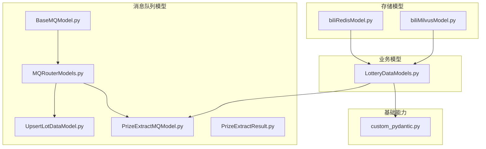
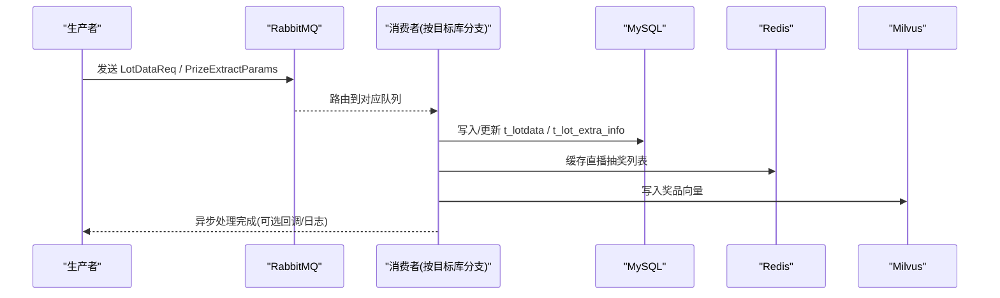
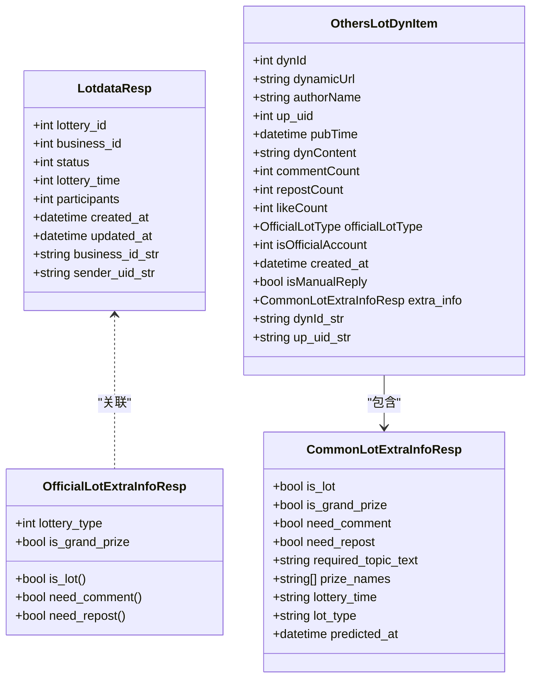
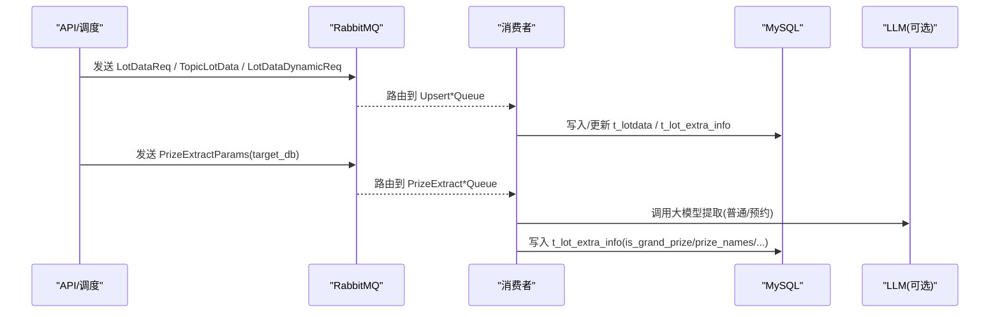
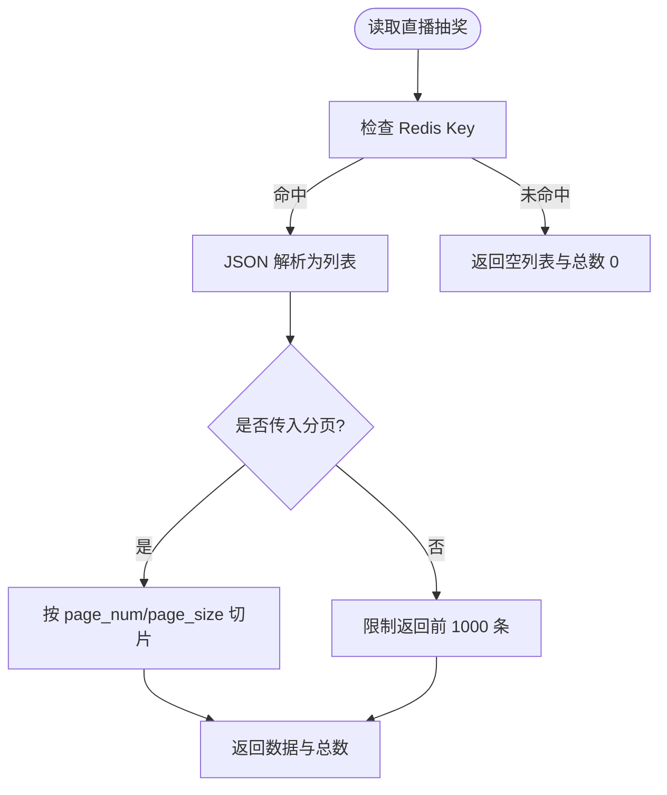
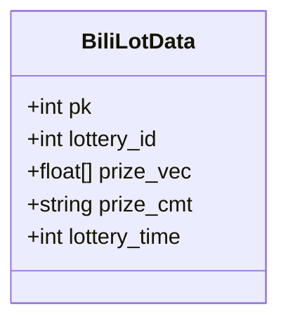
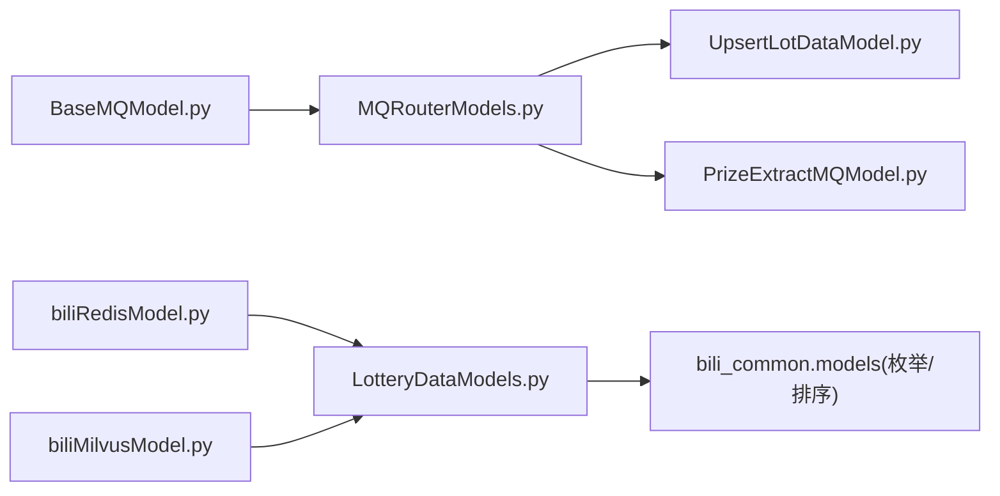

# 爬虫数据模型

<cite>
**本文引用的文件**
- [LotteryDataModels.py](file://be-bilibili-crawler/Models/lottery_database/bili/LotteryDataModels.py)
- [BaseMQModel.py](file://be-bilibili-crawler/Models/MQ/BaseMQModel.py)
- [UpsertLotDataModel.py](file://be-bilibili-crawler/Models/MQ/UpsertLotDataModel.py)
- [PrizeExtractMQModel.py](file://be-bilibili-crawler/Models/MQ/PrizeExtractMQModel.py)
- [PrizeExtractResult.py](file://be-bilibili-crawler/Models/MQ/PrizeExtractResult.py)
- [MQRouterModels.py](file://be-bilibili-crawler/Models/MQ/MQRouterModels.py)
- [biliRedisModel.py](file://be-bilibili-crawler/Models/lottery_database/redisModel/biliRedisModel.py)
- [biliMilvusModel.py](file://be-bilibili-crawler/Models/lottery_database/milvusModel/biliMilvusModel.py)
- [custom_pydantic.py](file://be-bilibili-crawler/Models/base/custom_pydantic.py)
</cite>

## 目录
1. [简介](#简介)
2. [项目结构](#项目结构)
3. [核心组件](#核心组件)
4. [架构总览](#架构总览)
5. [详细组件分析](#详细组件分析)
6. [依赖关系分析](#依赖关系分析)
7. [性能考虑](#性能考虑)
8. [故障排查指南](#故障排查指南)
9. [结论](#结论)
10. [附录](#附录)

## 简介
本文件聚焦爬虫服务的数据模型，系统性梳理 B 站动态数据、抽奖信息、用户信息等核心实体的数据结构；重点说明 LotteryDataModels 中的字段定义、数据类型与约束条件；解释消息队列（MQ）模型的设计模式与数据流转机制；并覆盖 Redis 缓存模型与 Milvus 向量数据库模型的使用场景。同时提供数据验证规则、索引优化策略与性能调优建议，以及实际数据操作示例与最佳实践。

## 项目结构
本项目在 be-bilibili-crawler 下以 Models 为核心组织数据模型：
- 业务领域模型集中在 lottery_database/bili/LotteryDataModels.py，涵盖抽奖主数据、预约/充电/官方抽奖响应、第三方抽奖条目、统计与筛选元数据等。
- MQ 模型位于 Models/MQ，统一抽象队列名、路由键、消息体与结果模型。
- 存储层模型包括 Redis 与 Milvus 的轻量封装，用于缓存与向量检索。
- 基础类型与通用能力由 base/custom_pydantic.py 提供，如大整数安全转换、扩展字段收集等。

图表来源
- [LotteryDataModels.py:1-823](file://be-bilibili-crawler/Models/lottery_database/bili/LotteryDataModels.py#L1-L823)
- [BaseMQModel.py:1-74](file://be-bilibili-crawler/Models/MQ/BaseMQModel.py#L1-L74)
- [UpsertLotDataModel.py:1-32](file://be-bilibili-crawler/Models/MQ/UpsertLotDataModel.py#L1-L32)
- [PrizeExtractMQModel.py:1-57](file://be-bilibili-crawler/Models/MQ/PrizeExtractMQModel.py#L1-L57)
- [PrizeExtractResult.py:1-40](file://be-bilibili-crawler/Models/MQ/PrizeExtractResult.py#L1-L40)
- [MQRouterModels.py:1-37](file://be-bilibili-crawler/Models/MQ/MQRouterModels.py#L1-L37)
- [biliRedisModel.py:1-51](file://be-bilibili-crawler/Models/lottery_database/redisModel/biliRedisModel.py#L1-L51)
- [biliMilvusModel.py:1-10](file://be-bilibili-crawler/Models/lottery_database/milvusModel/biliMilvusModel.py#L1-L10)
- [custom_pydantic.py:1-79](file://be-bilibili-crawler/Models/base/custom_pydantic.py#L1-L79)

章节来源
- [LotteryDataModels.py:1-823](file://be-bilibili-crawler/Models/lottery_database/bili/LotteryDataModels.py#L1-L823)
- [BaseMQModel.py:1-74](file://be-bilibili-crawler/Models/MQ/BaseMQModel.py#L1-L74)
- [UpsertLotDataModel.py:1-32](file://be-bilibili-crawler/Models/MQ/UpsertLotDataModel.py#L1-L32)
- [PrizeExtractMQModel.py:1-57](file://be-bilibili-crawler/Models/MQ/PrizeExtractMQModel.py#L1-L57)
- [PrizeExtractResult.py:1-40](file://be-bilibili-crawler/Models/MQ/PrizeExtractResult.py#L1-L40)
- [MQRouterModels.py:1-37](file://be-bilibili-crawler/Models/MQ/MQRouterModels.py#L1-L37)
- [biliRedisModel.py:1-51](file://be-bilibili-crawler/Models/lottery_database/redisModel/biliRedisModel.py#L1-L51)
- [biliMilvusModel.py:1-10](file://be-bilibili-crawler/Models/lottery_database/milvusModel/biliMilvusModel.py#L1-L10)
- [custom_pydantic.py:1-79](file://be-bilibili-crawler/Models/base/custom_pydantic.py#L1-L79)

## 核心组件
- 抽奖主数据与响应模型：LotteryDataModels.py 定义了抽奖主记录、官方/预约/充电/直播/话题抽奖响应、第三方抽奖条目、统计与筛选参数元数据等。
- 消息队列模型：BaseMQModel.py 集中管理队列名、交换器与路由键；UpsertLotDataModel.py 定义入库请求；PrizeExtractMQModel.py 定义按目标库拆分的抽取任务参数；PrizeExtractResult.py 定义抽取结果；MQRouterModels.py 聚合可入队的消息类型。
- 存储模型：biliRedisModel.py 提供直播抽奖列表的 Redis 缓存读取；biliMilvusModel.py 提供向量入库所需的实体模型。
- 基础能力：custom_pydantic.py 提供大整数转字符串、扩展字段收集等通用能力，保障前后端兼容与序列化一致性。

章节来源
- [LotteryDataModels.py:1-823](file://be-bilibili-crawler/Models/lottery_database/bili/LotteryDataModels.py#L1-L823)
- [BaseMQModel.py:1-74](file://be-bilibili-crawler/Models/MQ/BaseMQModel.py#L1-L74)
- [UpsertLotDataModel.py:1-32](file://be-bilibili-crawler/Models/MQ/UpsertLotDataModel.py#L1-L32)
- [PrizeExtractMQModel.py:1-57](file://be-bilibili-crawler/Models/MQ/PrizeExtractMQModel.py#L1-L57)
- [PrizeExtractResult.py:1-40](file://be-bilibili-crawler/Models/MQ/PrizeExtractResult.py#L1-L40)
- [MQRouterModels.py:1-37](file://be-bilibili-crawler/Models/MQ/MQRouterModels.py#L1-L37)
- [biliRedisModel.py:1-51](file://be-bilibili-crawler/Models/lottery_database/redisModel/biliRedisModel.py#L1-L51)
- [biliMilvusModel.py:1-10](file://be-bilibili-crawler/Models/lottery_database/milvusModel/biliMilvusModel.py#L1-L10)
- [custom_pydantic.py:1-79](file://be-bilibili-crawler/Models/base/custom_pydantic.py#L1-L79)

## 架构总览
下图展示了从抓取到落库的整体数据流：上游通过 MQ 投递入库或抽取任务，消费者根据目标库分支处理，最终写入 MySQL、Redis 或 Milvus。

图表来源
- [BaseMQModel.py:1-74](file://be-bilibili-crawler/Models/MQ/BaseMQModel.py#L1-L74)
- [UpsertLotDataModel.py:1-32](file://be-bilibili-crawler/Models/MQ/UpsertLotDataModel.py#L1-L32)
- [PrizeExtractMQModel.py:1-57](file://be-bilibili-crawler/Models/MQ/PrizeExtractMQModel.py#L1-L57)
- [biliRedisModel.py:1-51](file://be-bilibili-crawler/Models/lottery_database/redisModel/biliRedisModel.py#L1-L51)
- [biliMilvusModel.py:1-10](file://be-bilibili-crawler/Models/lottery_database/milvusModel/biliMilvusModel.py#L1-L10)

## 详细组件分析

### 抽奖主数据与响应模型（LotteryDataModels）
- 抽奖主记录：LotdataResp 包含业务 ID、状态、开奖时间、奖池规模、是否付费参与、参与者数量、VIP 标识、关注/转发状态、创建/更新时间等，并提供 business_id_str、sender_uid_str 计算字段，便于前端展示。
- 预约/充电/官方抽奖响应：ReserveInfoResp、OfficialLotteryResp、ChargeLotteryResp、LiveLotteryResp、TopicLotteryResp 分别描述不同渠道的抽奖详情，均包含跳转链接、应用内 Schema、文案、时间戳、ID 等必要字段，并通过 computed_field 输出字符串化 ID。
- 附加信息：OfficialLotExtraInfoResp 与 CommonLotExtraInfoResp 分别承载官方/普通抽奖的附加信息，其中官方类型由业务类型决定，无需重复落库；普通类型由 LLM 提取 prize_names、lottery_time 等。
- 第三方抽奖条目：OthersLotDynItem 描述第三方动态中的抽奖条目，包含作者、发布时间、互动数、官方账号标识、创建时间与 extra_info。
- 统计与筛选：BiliLotStatisticInfoResp、BiliLotStatisticLotteryResultResp、BiliLotStatisticRankDateTypeEnum 等提供统计维度与时间范围计算；FilterParamMeta、EndpointFilterMeta、LotteryFilterParamsResp 提供筛选参数的元数据描述，支持前端自动生成控件。

图表来源
- [LotteryDataModels.py:20-67](file://be-bilibili-crawler/Models/lottery_database/bili/LotteryDataModels.py#L20-L67)
- [LotteryDataModels.py:188-224](file://be-bilibili-crawler/Models/lottery_database/bili/LotteryDataModels.py#L188-L224)
- [LotteryDataModels.py:226-256](file://be-bilibili-crawler/Models/lottery_database/bili/LotteryDataModels.py#L226-L256)
- [LotteryDataModels.py:588-623](file://be-bilibili-crawler/Models/lottery_database/bili/LotteryDataModels.py#L588-L623)

章节来源
- [LotteryDataModels.py:20-67](file://be-bilibili-crawler/Models/lottery_database/bili/LotteryDataModels.py#L20-L67)
- [LotteryDataModels.py:188-224](file://be-bilibili-crawler/Models/lottery_database/bili/LotteryDataModels.py#L188-L224)
- [LotteryDataModels.py:226-256](file://be-bilibili-crawler/Models/lottery_database/bili/LotteryDataModels.py#L226-L256)
- [LotteryDataModels.py:588-623](file://be-bilibili-crawler/Models/lottery_database/bili/LotteryDataModels.py#L588-L623)

### 消息队列模型（MQ Models）
- 队列与路由：BaseMQModel.py 集中定义 QueueName、ExchangeName、RoutingKey，并通过 MQPropBase 为发布者提供统一的队列与路由键生成方法，支持后缀拼接。
- 入库请求：UpsertLotDataModel.py 定义 LotDataReq、LotDataDynamicReq、TopicLotData，用于触发不同维度的入库流程（业务维度、动态维度、话题维度）。
- 抽取任务：PrizeExtractMQModel.py 定义 PrizeExtractParams，按 target_db 区分写入目标库（普通抽奖动态 vs 官方/充电抽奖），并携带抽取所需文本与辅助字段。
- 抽取结果：PrizeExtractResult.py 定义 PrizeExtractResult（普通/预约抽奖）与 OfficialPrizeExtractResult（官方/充电抽奖仅大奖标记）。
- 路由聚合：MQRouterModels.py 将多种消息类型聚合为联合类型，便于消费者统一解析。

图表来源
- [BaseMQModel.py:7-35](file://be-bilibili-crawler/Models/MQ/BaseMQModel.py#L7-L35)
- [UpsertLotDataModel.py:6-18](file://be-bilibili-crawler/Models/MQ/UpsertLotDataModel.py#L6-L18)
- [PrizeExtractMQModel.py:17-48](file://be-bilibili-crawler/Models/MQ/PrizeExtractMQModel.py#L17-L48)
- [PrizeExtractResult.py:12-39](file://be-bilibili-crawler/Models/MQ/PrizeExtractResult.py#L12-L39)
- [MQRouterModels.py:18-27](file://be-bilibili-crawler/Models/MQ/MQRouterModels.py#L18-L27)

章节来源
- [BaseMQModel.py:7-35](file://be-bilibili-crawler/Models/MQ/BaseMQModel.py#L7-L35)
- [UpsertLotDataModel.py:6-18](file://be-bilibili-crawler/Models/MQ/UpsertLotDataModel.py#L6-L18)
- [PrizeExtractMQModel.py:17-48](file://be-bilibili-crawler/Models/MQ/PrizeExtractMQModel.py#L17-L48)
- [PrizeExtractResult.py:12-39](file://be-bilibili-crawler/Models/MQ/PrizeExtractResult.py#L12-L39)
- [MQRouterModels.py:18-27](file://be-bilibili-crawler/Models/MQ/MQRouterModels.py#L18-L27)

### Redis 缓存模型
- 使用场景：直播抽奖列表缓存，避免全量查询数据库，提升接口响应速度。
- 设计要点：
  - 使用 RedisMap 常量维护 key 名称，便于统一管理。
  - 分页读取时默认限制返回条数（例如前 1000 条），防止内存溢出。
  - 通过 JSON 序列化存储列表，读取后按需切片。

图表来源
- [biliRedisModel.py:16-41](file://be-bilibili-crawler/Models/lottery_database/redisModel/biliRedisModel.py#L16-L41)

章节来源
- [biliRedisModel.py:16-41](file://be-bilibili-crawler/Models/lottery_database/redisModel/biliRedisModel.py#L16-L41)

### Milvus 向量数据库模型
- 使用场景：将奖品相关文本向量化后存入 Milvus，支持语义检索与相似推荐。
- 设计要点：
  - 实体包含主键、抽奖 ID、向量、评论文案、开奖时间等字段。
  - 与业务模型解耦，仅保留向量检索所需的最小字段集。

图表来源
- [biliMilvusModel.py:4-9](file://be-bilibili-crawler/Models/lottery_database/milvusModel/biliMilvusModel.py#L4-L9)

章节来源
- [biliMilvusModel.py:4-9](file://be-bilibili-crawler/Models/lottery_database/milvusModel/biliMilvusModel.py#L4-L9)

### 基础能力（CustomBaseModel）
- 大整数安全转换：自动将超过 JavaScript 最大安全整数的数值转换为字符串，避免前端精度丢失。
- 扩展字段收集：提供 extra_fields 计算字段，便于调试与透传额外信息。
- 统一基类：所有业务模型继承 CustomBaseModel，确保一致的序列化行为。

章节来源
- [custom_pydantic.py:6-63](file://be-bilibili-crawler/Models/base/custom_pydantic.py#L6-L63)

## 依赖关系分析
- 业务模型对枚举与排序类型的依赖已迁移至 bili_common.models，LotteryDataModels.py 通过 re-export 保持向后兼容。
- MQ 模型之间通过 MQRouterModels.py 进行类型聚合，降低耦合度。
- 存储模型与业务模型解耦，仅通过字段映射交互。

图表来源
- [LotteryDataModels.py:10-17](file://be-bilibili-crawler/Models/lottery_database/bili/LotteryDataModels.py#L10-L17)
- [MQRouterModels.py:1-37](file://be-bilibili-crawler/Models/MQ/MQRouterModels.py#L1-L37)
- [BaseMQModel.py:1-74](file://be-bilibili-crawler/Models/MQ/BaseMQModel.py#L1-L74)
- [biliRedisModel.py:1-51](file://be-bilibili-crawler/Models/lottery_database/redisModel/biliRedisModel.py#L1-L51)
- [biliMilvusModel.py:1-10](file://be-bilibili-crawler/Models/lottery_database/milvusModel/biliMilvusModel.py#L1-L10)

章节来源
- [LotteryDataModels.py:10-17](file://be-bilibili-crawler/Models/lottery_database/bili/LotteryDataModels.py#L10-L17)
- [MQRouterModels.py:1-37](file://be-bilibili-crawler/Models/MQ/MQRouterModels.py#L1-L37)
- [BaseMQModel.py:1-74](file://be-bilibili-crawler/Models/MQ/BaseMQModel.py#L1-L74)
- [biliRedisModel.py:1-51](file://be-bilibili-crawler/Models/lottery_database/redisModel/biliRedisModel.py#L1-L51)
- [biliMilvusModel.py:1-10](file://be-bilibili-crawler/Models/lottery_database/milvusModel/biliMilvusModel.py#L1-L10)

## 性能考虑
- 分页与限流：Redis 读取默认限制返回条数，避免大对象传输；接口层应结合业务设置合理分页大小。
- 向量检索：Milvus 入库时应控制向量维度与批量大小，减少网络开销与内存峰值。
- 大整数处理：通过 CustomBaseModel 自动转换，避免前端精度问题导致的性能回退（如重算、错误比对）。
- MQ 背压：按目标库拆分队列，独立扩缩容，避免热点阻塞；消费者侧实现幂等与重试策略。

[本节为通用指导，不直接分析具体文件]

## 故障排查指南
- 队列路由错误：检查 BaseMQModel.py 中 RoutingKey 与 ExchangeName 配置是否与消费者一致。
- 抽取任务失败：确认 PrizeExtractParams.target_db 与字段填充是否符合目标库要求；核对 LLM 返回结构与 PrizeExtractResult 字段匹配。
- Redis 缓存异常：确认 Redis 连接与端口配置；检查 JSON 序列化/反序列化是否成功；注意分页参数为空时的默认限制。
- 向量入库失败：校验 BiliLotData.prize_vec 维度与 Milvus 集合 schema 一致；确认 lottery_time 与 prize_cmt 非空。

章节来源
- [BaseMQModel.py:7-35](file://be-bilibili-crawler/Models/MQ/BaseMQModel.py#L7-L35)
- [PrizeExtractMQModel.py:24-48](file://be-bilibili-crawler/Models/MQ/PrizeExtractMQModel.py#L24-L48)
- [PrizeExtractResult.py:12-39](file://be-bilibili-crawler/Models/MQ/PrizeExtractResult.py#L12-L39)
- [biliRedisModel.py:20-41](file://be-bilibili-crawler/Models/lottery_database/redisModel/biliRedisModel.py#L20-L41)
- [biliMilvusModel.py:4-9](file://be-bilibili-crawler/Models/lottery_database/milvusModel/biliMilvusModel.py#L4-L9)

## 结论
本仓库的数据模型围绕 B 站动态与抽奖业务构建，采用 Pydantic 强类型模型保证数据一致性；MQ 模型按目标库拆分，提升可扩展性与可观测性；Redis 与 Milvus 分别承担缓存与向量检索职责；基础能力层统一处理大整数与扩展字段，保障前后端兼容性。建议在接入新业务时遵循现有模型约定，完善数据验证与索引策略，持续优化性能与稳定性。

[本节为总结，不直接分析具体文件]

## 附录

### 数据验证规则与约束
- 枚举与排序：统一使用 bili_common.models 提供的枚举与排序类型，避免重复定义。
- 字段校验：Pydantic field_validator 用于空串转 None、None 转默认值、布尔兼容旧数据等。
- 计算字段：computed_field 用于生成字符串化 ID，简化前端展示逻辑。

章节来源
- [LotteryDataModels.py:283-315](file://be-bilibili-crawler/Models/lottery_database/bili/LotteryDataModels.py#L283-L315)
- [LotteryDataModels.py:625-641](file://be-bilibili-crawler/Models/lottery_database/bili/LotteryDataModels.py#L625-L641)

### 索引优化策略
- 主键与唯一键：lottery_id、dynId、up_uid 等作为查询主键或过滤条件，建议建立合适索引。
- 时间范围查询：lottery_time、created_at 常用于时间窗口筛选，建议建立复合索引以提升范围查询性能。
- 统计维度：business_type、officialLotType、isOfficialAccount 等用于分组与过滤，建议建立索引。

[本节为通用指导，不直接分析具体文件]

### 性能调优建议
- MQ 消费并行度：按目标库拆分队列，独立扩容消费者实例，避免单点瓶颈。
- 批量写入：对 t_lot_extra_info 等高频写入表采用批量插入，减少事务开销。
- 缓存预热：直播抽奖列表可在定时任务中预加载至 Redis，降低冷启动延迟。

[本节为通用指导，不直接分析具体文件]

### 实际数据操作示例与最佳实践
- 添加动态抽奖：构造 LotDataReq（business_type、business_id、origin_dynamic_id），发送至 UpsertLotDataByDynamicIdQueue。
- 添加话题抽奖：构造 TopicLotData（topic_id），发送至 UpsertTopicLotMQ。
- 抽取任务：构造 PrizeExtractParams（target_db、ref_id/dyn_content 或 lottery_id/lottery_text），发送至对应 PrizeExtractQueue。
- 读取直播抽奖：调用 BiliLiveLotteryRedis.get_live_lottery(page_num, page_size)，获取分页数据与总数。
- 向量入库：构造 BiliLotData（pk、lottery_id、prize_vec、prize_cmt、lottery_time），写入 Milvus。

章节来源
- [UpsertLotDataModel.py:6-18](file://be-bilibili-crawler/Models/MQ/UpsertLotDataModel.py#L6-L18)
- [PrizeExtractMQModel.py:24-48](file://be-bilibili-crawler/Models/MQ/PrizeExtractMQModel.py#L24-L48)
- [biliRedisModel.py:25-41](file://be-bilibili-crawler/Models/lottery_database/redisModel/biliRedisModel.py#L25-L41)
- [biliMilvusModel.py:4-9](file://be-bilibili-crawler/Models/lottery_database/milvusModel/biliMilvusModel.py#L4-L9)